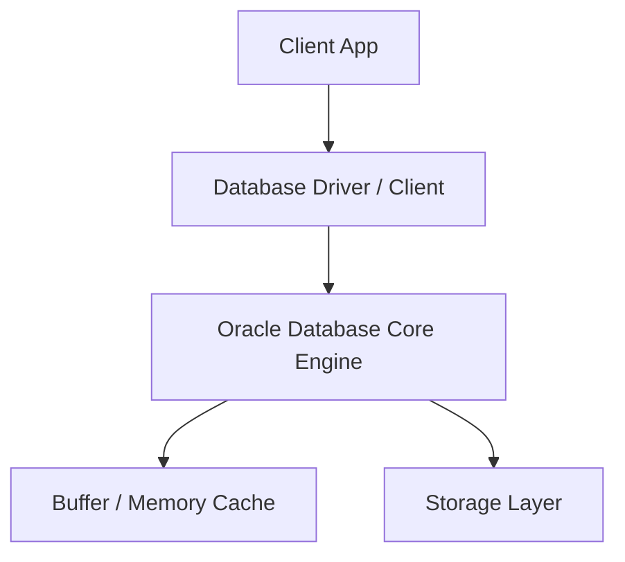
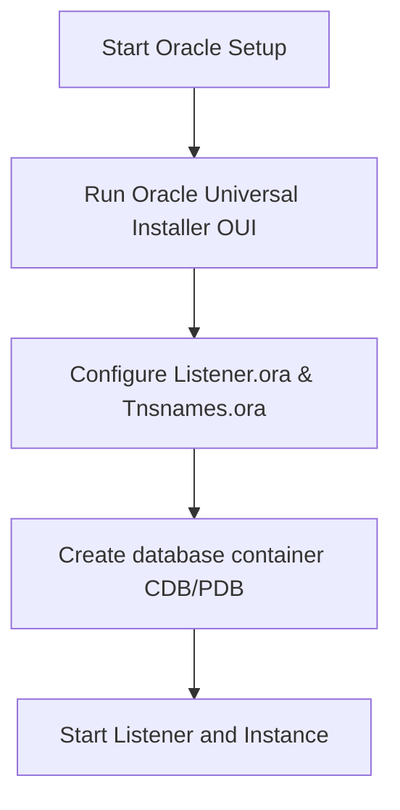

# Oracle Database Master Engineering Guide

A comprehensive, production-level, industry-grade guide to Oracle Database for software engineers, backend developers, data engineers, DevOps, and DBAs. Enterprise Oracle relational database system using PL/SQL, RAC, and Data Guard for high-availability enterprise workloads.

---

## 1. Introduction

### 1.1 Overview & Theory
Detailed explanation of Introduction in Oracle Database. Since Oracle Database is a relational database, it provides optimized strategies to solve enterprise engineering constraints.

### 1.2 Practical Operations & Best Practices
Production setup guidelines for Introduction in Oracle Database.

```sql
-- Check System Global Area (SGA) and Program Program Global Area (PGA) memory allocation stats
SELECT name, value FROM v$parameter WHERE name IN ('sga_max_size', 'pga_aggregate_target');
```

---

## 2. Database Fundamentals

### 2.1 Overview & Theory
Detailed explanation of Database Fundamentals in Oracle Database. Since Oracle Database is a relational database, it supports structural operations corresponding to transaction consistency models. It matches specific ACID/BASE characteristics.

### 2.2 Practical Operations & Best Practices
Production setup guidelines for Database Fundamentals in Oracle Database.

```sql
-- Query current instance status, database role, and read-write mode
SELECT status, database_role, open_mode FROM v$database;
```

---

## 3. Internal Architecture

### 3.1 Overview & Theory
Detailed explanation of Internal Architecture in Oracle Database. Since Oracle Database is a relational database, its internal architecture decouples various core processes. In Oracle Database, this handles write paths and read paths efficiently.



### 3.2 Practical Operations & Best Practices
Production setup guidelines for Internal Architecture in Oracle Database.

```sql
-- Find active sessions consuming high resources in production
SELECT sid, serial#, status, username, schemaname FROM v$session WHERE status = 'ACTIVE';
```

---

## 4. Installation

### 4.0 Official Resources & Installation Flow
- **Download Link**: [Official Oracle Database Download Page](https://www.oracle.com/database/technologies/oracle-database-software-downloads.html)




### 4.1 Overview & Theory
Detailed explanation of Installation in Oracle Database. Since Oracle Database is a relational database, it provides optimized strategies to solve enterprise engineering constraints.

### 4.2 Practical Operations & Best Practices
Production setup guidelines for Installation in Oracle Database.

```sql
-- Inspect tablespace storage capacity usage status
SELECT tablespace_name, used_space, tablespace_size FROM dba_tablespace_usage_metrics;
```

---

## 5. Database Creation

### 5.1 Overview & Theory
Detailed explanation of Database Creation in Oracle Database. Since Oracle Database is a relational database, it provides optimized strategies to solve enterprise engineering constraints.

### 5.2 Practical Operations & Best Practices
Production setup guidelines for Database Creation in Oracle Database.

```sql
-- Check System Global Area (SGA) and Program Program Global Area (PGA) memory allocation stats
SELECT name, value FROM v$parameter WHERE name IN ('sga_max_size', 'pga_aggregate_target');
```

---

## 6. Data Types

### 6.1 Overview & Theory
Detailed explanation of Data Types in Oracle Database. Since Oracle Database is a relational database, it provides optimized strategies to solve enterprise engineering constraints.

### 6.2 Practical Operations & Best Practices
Production setup guidelines for Data Types in Oracle Database.

```sql
-- Query current instance status, database role, and read-write mode
SELECT status, database_role, open_mode FROM v$database;
```

---

## 7. Tables

### 7.1 Overview & Theory
Detailed explanation of Tables in Oracle Database. Since Oracle Database is a relational database, it provides optimized strategies to solve enterprise engineering constraints.

### 7.2 Practical Operations & Best Practices
Production setup guidelines for Tables in Oracle Database.

```sql
-- Find active sessions consuming high resources in production
SELECT sid, serial#, status, username, schemaname FROM v$session WHERE status = 'ACTIVE';
```

---

## 8. CRUD Operations

### 8.1 Overview & Theory
Detailed explanation of CRUD Operations in Oracle Database. Since Oracle Database is a relational database, it offers specialized query paradigms. Let's look at code and syntax examples:

```sql
-- SELECT Example in Oracle Database
SELECT * FROM users WHERE status = 'active';
```

### 8.2 Practical Operations & Best Practices
Production setup guidelines for CRUD Operations in Oracle Database.

```sql
-- Inspect tablespace storage capacity usage status
SELECT tablespace_name, used_space, tablespace_size FROM dba_tablespace_usage_metrics;
```

---

## 9. SQL Queries

### 9.1 Overview & Theory
Detailed explanation of SQL Queries in Oracle Database. Since Oracle Database is a relational database, it offers specialized query paradigms. Let's look at code and syntax examples:

```sql
-- SELECT Example in Oracle Database
SELECT * FROM users WHERE status = 'active';
```

### 9.2 Practical Operations & Best Practices
Production setup guidelines for SQL Queries in Oracle Database.

```sql
-- Check System Global Area (SGA) and Program Program Global Area (PGA) memory allocation stats
SELECT name, value FROM v$parameter WHERE name IN ('sga_max_size', 'pga_aggregate_target');
```

---

## 10. Joins

### 10.1 Overview & Theory
Detailed explanation of Joins in Oracle Database. Since Oracle Database is a relational database, it provides optimized strategies to solve enterprise engineering constraints.

### 10.2 Practical Operations & Best Practices
Production setup guidelines for Joins in Oracle Database.

```sql
-- Query current instance status, database role, and read-write mode
SELECT status, database_role, open_mode FROM v$database;
```

---

## 11. Functions

### 11.1 Overview & Theory
Detailed explanation of Functions in Oracle Database. Since Oracle Database is a relational database, it provides optimized strategies to solve enterprise engineering constraints.

### 11.2 Practical Operations & Best Practices
Production setup guidelines for Functions in Oracle Database.

```sql
-- Find active sessions consuming high resources in production
SELECT sid, serial#, status, username, schemaname FROM v$session WHERE status = 'ACTIVE';
```

---

## 12. Indexes

### 12.1 Overview & Theory
Detailed explanation of Indexes in Oracle Database. Since Oracle Database is a relational database, it provides optimized strategies to solve enterprise engineering constraints.

### 12.2 Practical Operations & Best Practices
Production setup guidelines for Indexes in Oracle Database.

```sql
-- Inspect tablespace storage capacity usage status
SELECT tablespace_name, used_space, tablespace_size FROM dba_tablespace_usage_metrics;
```

---

## 13. Views

### 13.1 Overview & Theory
Detailed explanation of Views in Oracle Database. Since Oracle Database is a relational database, it provides optimized strategies to solve enterprise engineering constraints.

### 13.2 Practical Operations & Best Practices
Production setup guidelines for Views in Oracle Database.

```sql
-- Check System Global Area (SGA) and Program Program Global Area (PGA) memory allocation stats
SELECT name, value FROM v$parameter WHERE name IN ('sga_max_size', 'pga_aggregate_target');
```

---

## 14. Stored Procedures

### 14.1 Overview & Theory
Detailed explanation of Stored Procedures in Oracle Database. Since Oracle Database is a relational database, it provides optimized strategies to solve enterprise engineering constraints.

### 14.2 Practical Operations & Best Practices
Production setup guidelines for Stored Procedures in Oracle Database.

```sql
-- Query current instance status, database role, and read-write mode
SELECT status, database_role, open_mode FROM v$database;
```

---

## 15. Transactions

### 15.1 Overview & Theory
Detailed explanation of Transactions in Oracle Database. Since Oracle Database is a relational database, it provides optimized strategies to solve enterprise engineering constraints.

### 15.2 Practical Operations & Best Practices
Production setup guidelines for Transactions in Oracle Database.

```sql
-- Find active sessions consuming high resources in production
SELECT sid, serial#, status, username, schemaname FROM v$session WHERE status = 'ACTIVE';
```

---

## 16. Locks

### 16.1 Overview & Theory
Detailed explanation of Locks in Oracle Database. Since Oracle Database is a relational database, it provides optimized strategies to solve enterprise engineering constraints.

### 16.2 Practical Operations & Best Practices
Production setup guidelines for Locks in Oracle Database.

```sql
-- Inspect tablespace storage capacity usage status
SELECT tablespace_name, used_space, tablespace_size FROM dba_tablespace_usage_metrics;
```

---

## 17. Performance Optimization

### 17.1 Overview & Theory
Detailed explanation of Performance Optimization in Oracle Database. Since Oracle Database is a relational database, it provides optimized strategies to solve enterprise engineering constraints.

### 17.2 Practical Operations & Best Practices
Production setup guidelines for Performance Optimization in Oracle Database.

```sql
-- Check System Global Area (SGA) and Program Program Global Area (PGA) memory allocation stats
SELECT name, value FROM v$parameter WHERE name IN ('sga_max_size', 'pga_aggregate_target');
```

---

## 18. Replication

### 18.1 Overview & Theory
Detailed explanation of Replication in Oracle Database. Since Oracle Database is a relational database, it provides optimized strategies to solve enterprise engineering constraints.

### 18.2 Practical Operations & Best Practices
Production setup guidelines for Replication in Oracle Database.

```sql
-- Query current instance status, database role, and read-write mode
SELECT status, database_role, open_mode FROM v$database;
```

---

## 19. High Availability

### 19.1 Overview & Theory
Detailed explanation of High Availability in Oracle Database. Since Oracle Database is a relational database, it provides optimized strategies to solve enterprise engineering constraints.

### 19.2 Practical Operations & Best Practices
Production setup guidelines for High Availability in Oracle Database.

```sql
-- Find active sessions consuming high resources in production
SELECT sid, serial#, status, username, schemaname FROM v$session WHERE status = 'ACTIVE';
```

---

## 20. Security

### 20.1 Overview & Theory
Detailed explanation of Security in Oracle Database. Since Oracle Database is a relational database, it provides optimized strategies to solve enterprise engineering constraints.

### 20.2 Practical Operations & Best Practices
Production setup guidelines for Security in Oracle Database.

```sql
-- Inspect tablespace storage capacity usage status
SELECT tablespace_name, used_space, tablespace_size FROM dba_tablespace_usage_metrics;
```

---

## 21. Backup & Restore

### 21.1 Overview & Theory
Detailed explanation of Backup & Restore in Oracle Database. Since Oracle Database is a relational database, it provides optimized strategies to solve enterprise engineering constraints.

### 21.2 Practical Operations & Best Practices
Production setup guidelines for Backup & Restore in Oracle Database.

```sql
-- Check System Global Area (SGA) and Program Program Global Area (PGA) memory allocation stats
SELECT name, value FROM v$parameter WHERE name IN ('sga_max_size', 'pga_aggregate_target');
```

---

## 22. Monitoring

### 22.1 Overview & Theory
Detailed explanation of Monitoring in Oracle Database. Since Oracle Database is a relational database, it provides optimized strategies to solve enterprise engineering constraints.

### 22.2 Practical Operations & Best Practices
Production setup guidelines for Monitoring in Oracle Database.

```sql
-- Query current instance status, database role, and read-write mode
SELECT status, database_role, open_mode FROM v$database;
```

---

## 23. Cloud Services

### 23.1 Overview & Theory
Detailed explanation of Cloud Services in Oracle Database. Since Oracle Database is a relational database, it provides optimized strategies to solve enterprise engineering constraints.

### 23.2 Practical Operations & Best Practices
Production setup guidelines for Cloud Services in Oracle Database.

```sql
-- Find active sessions consuming high resources in production
SELECT sid, serial#, status, username, schemaname FROM v$session WHERE status = 'ACTIVE';
```

---

## 24. Integration

### 24.1 Overview & Theory
Detailed explanation of Integration in Oracle Database. Since Oracle Database is a relational database, drivers exist for popular frameworks. Here is a connection sample:

```python
# Python Connection Example
# Initialize and connect client
print('Connected to Oracle Database')
```

### 24.2 Practical Operations & Best Practices
Production setup guidelines for Integration in Oracle Database.

```sql
-- Inspect tablespace storage capacity usage status
SELECT tablespace_name, used_space, tablespace_size FROM dba_tablespace_usage_metrics;
```

---

## 25. ORM Support

### 25.1 Overview & Theory
Detailed explanation of ORM Support in Oracle Database. Since Oracle Database is a relational database, drivers exist for popular frameworks. Here is a connection sample:

```python
# Python Connection Example
# Initialize and connect client
print('Connected to Oracle Database')
```

### 25.2 Practical Operations & Best Practices
Production setup guidelines for ORM Support in Oracle Database.

```sql
-- Check System Global Area (SGA) and Program Program Global Area (PGA) memory allocation stats
SELECT name, value FROM v$parameter WHERE name IN ('sga_max_size', 'pga_aggregate_target');
```

---

## 26. AI Integration

### 26.1 Overview & Theory
Detailed explanation of AI Integration in Oracle Database. Since Oracle Database is a relational database, drivers exist for popular frameworks. Here is a connection sample:

```python
# Python Connection Example
# Initialize and connect client
print('Connected to Oracle Database')
```

### 26.2 Practical Operations & Best Practices
Production setup guidelines for AI Integration in Oracle Database.

```sql
-- Query current instance status, database role, and read-write mode
SELECT status, database_role, open_mode FROM v$database;
```

---

## 27. Production Architecture

### 27.1 Overview & Theory
Detailed explanation of Production Architecture in Oracle Database. Since Oracle Database is a relational database, its internal architecture decouples various core processes. In Oracle Database, this handles write paths and read paths efficiently.


### 27.2 Practical Operations & Best Practices
Production setup guidelines for Production Architecture in Oracle Database.

```sql
-- Find active sessions consuming high resources in production
SELECT sid, serial#, status, username, schemaname FROM v$session WHERE status = 'ACTIVE';
```

---

## 28. Real Industry Use Cases

### 28.1 Overview & Theory
Detailed explanation of Real Industry Use Cases in Oracle Database. Since Oracle Database is a relational database, it provides optimized strategies to solve enterprise engineering constraints.

### 28.2 Practical Operations & Best Practices
Production setup guidelines for Real Industry Use Cases in Oracle Database.

```sql
-- Inspect tablespace storage capacity usage status
SELECT tablespace_name, used_space, tablespace_size FROM dba_tablespace_usage_metrics;
```

---

## 29. Common Errors

### 29.1 Overview & Theory
Detailed explanation of Common Errors in Oracle Database. Since Oracle Database is a relational database, it provides optimized strategies to solve enterprise engineering constraints.

### 29.2 Practical Operations & Best Practices
Production setup guidelines for Common Errors in Oracle Database.

```sql
-- Check System Global Area (SGA) and Program Program Global Area (PGA) memory allocation stats
SELECT name, value FROM v$parameter WHERE name IN ('sga_max_size', 'pga_aggregate_target');
```

---

## 30. Interview Questions

### 30.1 Overview & Theory
Detailed explanation of Interview Questions in Oracle Database. Since Oracle Database is a relational database, it provides optimized strategies to solve enterprise engineering constraints.

### 30.2 Practical Operations & Best Practices
Production setup guidelines for Interview Questions in Oracle Database.

```sql
-- Query current instance status, database role, and read-write mode
SELECT status, database_role, open_mode FROM v$database;
```

---

## 31. Cheat Sheet

### 31.1 Overview & Theory
Detailed explanation of Cheat Sheet in Oracle Database. Since Oracle Database is a relational database, it provides optimized strategies to solve enterprise engineering constraints.

### 31.2 Practical Operations & Best Practices
Production setup guidelines for Cheat Sheet in Oracle Database.

```sql
-- Find active sessions consuming high resources in production
SELECT sid, serial#, status, username, schemaname FROM v$session WHERE status = 'ACTIVE';
```

---

## 32. Hands-on Projects

### 32.1 Overview & Theory
Detailed explanation of Hands-on Projects in Oracle Database. Since Oracle Database is a relational database, it provides optimized strategies to solve enterprise engineering constraints.

### 32.2 Practical Operations & Best Practices
Production setup guidelines for Hands-on Projects in Oracle Database.

```sql
-- Inspect tablespace storage capacity usage status
SELECT tablespace_name, used_space, tablespace_size FROM dba_tablespace_usage_metrics;
```

---

## 33. Practice Exercises

### 33.1 Overview & Theory
Detailed explanation of Practice Exercises in Oracle Database. Since Oracle Database is a relational database, it provides optimized strategies to solve enterprise engineering constraints.

### 33.2 Practical Operations & Best Practices
Production setup guidelines for Practice Exercises in Oracle Database.

```sql
-- Check System Global Area (SGA) and Program Program Global Area (PGA) memory allocation stats
SELECT name, value FROM v$parameter WHERE name IN ('sga_max_size', 'pga_aggregate_target');
```

---

## 34. Comparison

### 34.1 Overview & Theory
Detailed explanation of Comparison in Oracle Database. Since Oracle Database is a relational database, it provides optimized strategies to solve enterprise engineering constraints.

### 34.2 Practical Operations & Best Practices
Production setup guidelines for Comparison in Oracle Database.

```sql
-- Query current instance status, database role, and read-write mode
SELECT status, database_role, open_mode FROM v$database;
```

---

## 35. Final Summary

### 35.1 Overview & Theory
Detailed explanation of Final Summary in Oracle Database. Since Oracle Database is a relational database, it provides optimized strategies to solve enterprise engineering constraints.

### 35.2 Practical Operations & Best Practices
Production setup guidelines for Final Summary in Oracle Database.

```sql
-- Find active sessions consuming high resources in production
SELECT sid, serial#, status, username, schemaname FROM v$session WHERE status = 'ACTIVE';
```

---

