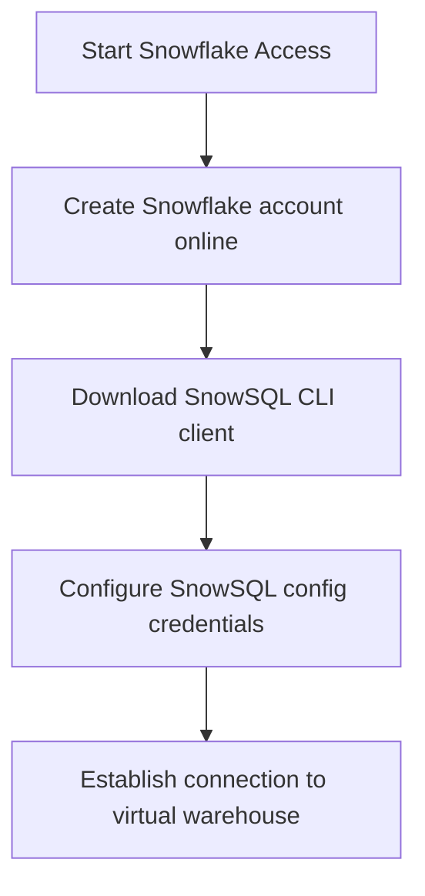

# Snowflake (Data Warehouse) Master Engineering Guide

A comprehensive, production-level, industry-grade guide to Snowflake (Data Warehouse) for software engineers, backend developers, data engineers, DevOps, and DBAs. Cloud data warehouse platform using virtual warehouses to scale compute independently from persistent storage.

---

<ProgressTracker currentSection=1 totalSections=35 />

## 1. Introduction

### 1.1 Overview & Theory
Detailed explanation of Introduction in Snowflake (Data Warehouse). Since Snowflake (Data Warehouse) is a warehouse database, it provides optimized strategies to solve enterprise engineering constraints.

### 1.2 Practical Operations & Best Practices
Production setup guidelines for Introduction in Snowflake (Data Warehouse).

```sql
-- List virtual warehouses and check auto-suspend status
SHOW WAREHOUSES;
```

---

<ProgressTracker currentSection=2 totalSections=35 />

## 2. Database Fundamentals

### 2.1 Overview & Theory
Detailed explanation of Database Fundamentals in Snowflake (Data Warehouse). Since Snowflake (Data Warehouse) is a warehouse database, it supports structural operations corresponding to transaction consistency models. It matches specific ACID/BASE characteristics.

### 2.2 Practical Operations & Best Practices
Production setup guidelines for Database Fundamentals in Snowflake (Data Warehouse).

```sql
-- Check warehouse query load metrics history
SELECT * FROM table(information_schema.warehouse_load_history(dateadd('hour',-1,current_timestamp())));
```

---

<ProgressTracker currentSection=3 totalSections=35 />

## 3. Internal Architecture

### 3.1 Overview & Theory
Detailed explanation of Internal Architecture in Snowflake (Data Warehouse). Since Snowflake (Data Warehouse) is a warehouse database, its internal architecture decouples various core processes. In Snowflake (Data Warehouse), this handles write paths and read paths efficiently.

```mermaid
graph TD
    Client[Client App] --> Driver[Database Driver / Client]
    Driver --> Engine[Snowflake (Data Warehouse) Core Engine]
    Engine --> Cache[Buffer / Memory Cache]
    Engine --> Disk[Storage Layer]
```

### 3.2 Practical Operations & Best Practices
Production setup guidelines for Internal Architecture in Snowflake (Data Warehouse).

```sql
-- Show data storage volume sizing metrics
SHOW STORAGE PROPERTIES;
```

---

<ProgressTracker currentSection=4 totalSections=35 />

## 4. Installation

### 4.0 Official Resources & Installation Flow
- **Download Link**: [Official Snowflake Signup Page](https://signup.snowflake.com/)




### 4.1 Overview & Theory
Detailed explanation of Installation in Snowflake (Data Warehouse). Since Snowflake (Data Warehouse) is a warehouse database, it provides optimized strategies to solve enterprise engineering constraints.

### 4.2 Practical Operations & Best Practices
Production setup guidelines for Installation in Snowflake (Data Warehouse).

```sql
-- List virtual warehouses and check auto-suspend status
SHOW WAREHOUSES;
```

---

<ProgressTracker currentSection=5 totalSections=35 />

## 5. Database Creation

### 5.1 Overview & Theory
Detailed explanation of Database Creation in Snowflake (Data Warehouse). Since Snowflake (Data Warehouse) is a warehouse database, it provides optimized strategies to solve enterprise engineering constraints.

### 5.2 Practical Operations & Best Practices
Production setup guidelines for Database Creation in Snowflake (Data Warehouse).

```sql
-- Check warehouse query load metrics history
SELECT * FROM table(information_schema.warehouse_load_history(dateadd('hour',-1,current_timestamp())));
```

---

<ProgressTracker currentSection=6 totalSections=35 />

## 6. Data Types

### 6.1 Overview & Theory
Detailed explanation of Data Types in Snowflake (Data Warehouse). Since Snowflake (Data Warehouse) is a warehouse database, it provides optimized strategies to solve enterprise engineering constraints.

### 6.2 Practical Operations & Best Practices
Production setup guidelines for Data Types in Snowflake (Data Warehouse).

```sql
-- Show data storage volume sizing metrics
SHOW STORAGE PROPERTIES;
```

---

<ProgressTracker currentSection=7 totalSections=35 />

## 7. Tables

### 7.1 Overview & Theory
Detailed explanation of Tables in Snowflake (Data Warehouse). Since Snowflake (Data Warehouse) is a warehouse database, it provides optimized strategies to solve enterprise engineering constraints.

### 7.2 Practical Operations & Best Practices
Production setup guidelines for Tables in Snowflake (Data Warehouse).

```sql
-- List virtual warehouses and check auto-suspend status
SHOW WAREHOUSES;
```

---

<ProgressTracker currentSection=8 totalSections=35 />

## 8. CRUD Operations

### 8.1 Overview & Theory
Detailed explanation of CRUD Operations in Snowflake (Data Warehouse). Since Snowflake (Data Warehouse) is a warehouse database, it offers specialized query paradigms. Let's look at code and syntax examples:

```bash
# Query example in Snowflake (Data Warehouse)
GET /users/_search?q=status:active
```

### 8.2 Practical Operations & Best Practices
Production setup guidelines for CRUD Operations in Snowflake (Data Warehouse).

```sql
-- Check warehouse query load metrics history
SELECT * FROM table(information_schema.warehouse_load_history(dateadd('hour',-1,current_timestamp())));
```

---

<ProgressTracker currentSection=9 totalSections=35 />

## 9. SQL Queries

### 9.1 Overview & Theory
Detailed explanation of SQL Queries in Snowflake (Data Warehouse). Since Snowflake (Data Warehouse) is a warehouse database, it offers specialized query paradigms. Let's look at code and syntax examples:

```bash
# Query example in Snowflake (Data Warehouse)
GET /users/_search?q=status:active
```

### 9.2 Practical Operations & Best Practices
Production setup guidelines for SQL Queries in Snowflake (Data Warehouse).

```sql
-- Show data storage volume sizing metrics
SHOW STORAGE PROPERTIES;
```

---

<ProgressTracker currentSection=10 totalSections=35 />

## 10. Joins

### 10.1 Overview & Theory
Detailed explanation of Joins in Snowflake (Data Warehouse). Since Snowflake (Data Warehouse) is a warehouse database, it provides optimized strategies to solve enterprise engineering constraints.

### 10.2 Practical Operations & Best Practices
Production setup guidelines for Joins in Snowflake (Data Warehouse).

```sql
-- List virtual warehouses and check auto-suspend status
SHOW WAREHOUSES;
```

---

<ProgressTracker currentSection=11 totalSections=35 />

## 11. Functions

### 11.1 Overview & Theory
Detailed explanation of Functions in Snowflake (Data Warehouse). Since Snowflake (Data Warehouse) is a warehouse database, it provides optimized strategies to solve enterprise engineering constraints.

### 11.2 Practical Operations & Best Practices
Production setup guidelines for Functions in Snowflake (Data Warehouse).

```sql
-- Check warehouse query load metrics history
SELECT * FROM table(information_schema.warehouse_load_history(dateadd('hour',-1,current_timestamp())));
```

---

<ProgressTracker currentSection=12 totalSections=35 />

## 12. Indexes

### 12.1 Overview & Theory
Detailed explanation of Indexes in Snowflake (Data Warehouse). Since Snowflake (Data Warehouse) is a warehouse database, it provides optimized strategies to solve enterprise engineering constraints.

### 12.2 Practical Operations & Best Practices
Production setup guidelines for Indexes in Snowflake (Data Warehouse).

```sql
-- Show data storage volume sizing metrics
SHOW STORAGE PROPERTIES;
```

---

<ProgressTracker currentSection=13 totalSections=35 />

## 13. Views

### 13.1 Overview & Theory
Detailed explanation of Views in Snowflake (Data Warehouse). Since Snowflake (Data Warehouse) is a warehouse database, it provides optimized strategies to solve enterprise engineering constraints.

### 13.2 Practical Operations & Best Practices
Production setup guidelines for Views in Snowflake (Data Warehouse).

```sql
-- List virtual warehouses and check auto-suspend status
SHOW WAREHOUSES;
```

---

<ProgressTracker currentSection=14 totalSections=35 />

## 14. Stored Procedures

### 14.1 Overview & Theory
Detailed explanation of Stored Procedures in Snowflake (Data Warehouse). Since Snowflake (Data Warehouse) is a warehouse database, it provides optimized strategies to solve enterprise engineering constraints.

### 14.2 Practical Operations & Best Practices
Production setup guidelines for Stored Procedures in Snowflake (Data Warehouse).

```sql
-- Check warehouse query load metrics history
SELECT * FROM table(information_schema.warehouse_load_history(dateadd('hour',-1,current_timestamp())));
```

---

<ProgressTracker currentSection=15 totalSections=35 />

## 15. Transactions

### 15.1 Overview & Theory
Detailed explanation of Transactions in Snowflake (Data Warehouse). Since Snowflake (Data Warehouse) is a warehouse database, it provides optimized strategies to solve enterprise engineering constraints.

### 15.2 Practical Operations & Best Practices
Production setup guidelines for Transactions in Snowflake (Data Warehouse).

```sql
-- Show data storage volume sizing metrics
SHOW STORAGE PROPERTIES;
```

---

<ProgressTracker currentSection=16 totalSections=35 />

## 16. Locks

### 16.1 Overview & Theory
Detailed explanation of Locks in Snowflake (Data Warehouse). Since Snowflake (Data Warehouse) is a warehouse database, it provides optimized strategies to solve enterprise engineering constraints.

### 16.2 Practical Operations & Best Practices
Production setup guidelines for Locks in Snowflake (Data Warehouse).

```sql
-- List virtual warehouses and check auto-suspend status
SHOW WAREHOUSES;
```

---

<ProgressTracker currentSection=17 totalSections=35 />

## 17. Performance Optimization

### 17.1 Overview & Theory
Detailed explanation of Performance Optimization in Snowflake (Data Warehouse). Since Snowflake (Data Warehouse) is a warehouse database, it provides optimized strategies to solve enterprise engineering constraints.

### 17.2 Practical Operations & Best Practices
Production setup guidelines for Performance Optimization in Snowflake (Data Warehouse).

```sql
-- Check warehouse query load metrics history
SELECT * FROM table(information_schema.warehouse_load_history(dateadd('hour',-1,current_timestamp())));
```

---

<ProgressTracker currentSection=18 totalSections=35 />

## 18. Replication

### 18.1 Overview & Theory
Detailed explanation of Replication in Snowflake (Data Warehouse). Since Snowflake (Data Warehouse) is a warehouse database, it provides optimized strategies to solve enterprise engineering constraints.

### 18.2 Practical Operations & Best Practices
Production setup guidelines for Replication in Snowflake (Data Warehouse).

```sql
-- Show data storage volume sizing metrics
SHOW STORAGE PROPERTIES;
```

---

<ProgressTracker currentSection=19 totalSections=35 />

## 19. High Availability

### 19.1 Overview & Theory
Detailed explanation of High Availability in Snowflake (Data Warehouse). Since Snowflake (Data Warehouse) is a warehouse database, it provides optimized strategies to solve enterprise engineering constraints.

### 19.2 Practical Operations & Best Practices
Production setup guidelines for High Availability in Snowflake (Data Warehouse).

```sql
-- List virtual warehouses and check auto-suspend status
SHOW WAREHOUSES;
```

---

<ProgressTracker currentSection=20 totalSections=35 />

## 20. Security

### 20.1 Overview & Theory
Detailed explanation of Security in Snowflake (Data Warehouse). Since Snowflake (Data Warehouse) is a warehouse database, it provides optimized strategies to solve enterprise engineering constraints.

### 20.2 Practical Operations & Best Practices
Production setup guidelines for Security in Snowflake (Data Warehouse).

```sql
-- Check warehouse query load metrics history
SELECT * FROM table(information_schema.warehouse_load_history(dateadd('hour',-1,current_timestamp())));
```

---

<ProgressTracker currentSection=21 totalSections=35 />

## 21. Backup & Restore

### 21.1 Overview & Theory
Detailed explanation of Backup & Restore in Snowflake (Data Warehouse). Since Snowflake (Data Warehouse) is a warehouse database, it provides optimized strategies to solve enterprise engineering constraints.

### 21.2 Practical Operations & Best Practices
Production setup guidelines for Backup & Restore in Snowflake (Data Warehouse).

```sql
-- Show data storage volume sizing metrics
SHOW STORAGE PROPERTIES;
```

---

<ProgressTracker currentSection=22 totalSections=35 />

## 22. Monitoring

### 22.1 Overview & Theory
Detailed explanation of Monitoring in Snowflake (Data Warehouse). Since Snowflake (Data Warehouse) is a warehouse database, it provides optimized strategies to solve enterprise engineering constraints.

### 22.2 Practical Operations & Best Practices
Production setup guidelines for Monitoring in Snowflake (Data Warehouse).

```sql
-- List virtual warehouses and check auto-suspend status
SHOW WAREHOUSES;
```

---

<ProgressTracker currentSection=23 totalSections=35 />

## 23. Cloud Services

### 23.1 Overview & Theory
Detailed explanation of Cloud Services in Snowflake (Data Warehouse). Since Snowflake (Data Warehouse) is a warehouse database, it provides optimized strategies to solve enterprise engineering constraints.

### 23.2 Practical Operations & Best Practices
Production setup guidelines for Cloud Services in Snowflake (Data Warehouse).

```sql
-- Check warehouse query load metrics history
SELECT * FROM table(information_schema.warehouse_load_history(dateadd('hour',-1,current_timestamp())));
```

---

<ProgressTracker currentSection=24 totalSections=35 />

## 24. Integration

### 24.1 Overview & Theory
Detailed explanation of Integration in Snowflake (Data Warehouse). Since Snowflake (Data Warehouse) is a warehouse database, drivers exist for popular frameworks. Here is a connection sample:

<Tabs>
  <Tab label="Syntax & Example">

```python
# Python Connection Example
# Initialize and connect client
print('Connected to Snowflake (Data Warehouse)')
```

  </Tab>
  <Tab label="Interactive Playground">
    <InteractiveExample 
      language="python"
      initialCode="# Python Connection Example\n# Initialize and connect client\nprint('Connected to Snowflake (Data Warehouse)')" 
      instruction="Execute and edit this PYTHON example."
    />
  </Tab>
</Tabs>

### 24.2 Practical Operations & Best Practices
Production setup guidelines for Integration in Snowflake (Data Warehouse).

```sql
-- Show data storage volume sizing metrics
SHOW STORAGE PROPERTIES;
```

---

<ProgressTracker currentSection=25 totalSections=35 />

## 25. ORM Support

### 25.1 Overview & Theory
Detailed explanation of ORM Support in Snowflake (Data Warehouse). Since Snowflake (Data Warehouse) is a warehouse database, drivers exist for popular frameworks. Here is a connection sample:

<Tabs>
  <Tab label="Syntax & Example">

```python
# Python Connection Example
# Initialize and connect client
print('Connected to Snowflake (Data Warehouse)')
```

  </Tab>
  <Tab label="Interactive Playground">
    <InteractiveExample 
      language="python"
      initialCode="# Python Connection Example\n# Initialize and connect client\nprint('Connected to Snowflake (Data Warehouse)')" 
      instruction="Execute and edit this PYTHON example."
    />
  </Tab>
</Tabs>

### 25.2 Practical Operations & Best Practices
Production setup guidelines for ORM Support in Snowflake (Data Warehouse).

```sql
-- List virtual warehouses and check auto-suspend status
SHOW WAREHOUSES;
```

---

<ProgressTracker currentSection=26 totalSections=35 />

## 26. AI Integration

### 26.1 Overview & Theory
Detailed explanation of AI Integration in Snowflake (Data Warehouse). Since Snowflake (Data Warehouse) is a warehouse database, drivers exist for popular frameworks. Here is a connection sample:

<Tabs>
  <Tab label="Syntax & Example">

```python
# Python Connection Example
# Initialize and connect client
print('Connected to Snowflake (Data Warehouse)')
```

  </Tab>
  <Tab label="Interactive Playground">
    <InteractiveExample 
      language="python"
      initialCode="# Python Connection Example\n# Initialize and connect client\nprint('Connected to Snowflake (Data Warehouse)')" 
      instruction="Execute and edit this PYTHON example."
    />
  </Tab>
</Tabs>

### 26.2 Practical Operations & Best Practices
Production setup guidelines for AI Integration in Snowflake (Data Warehouse).

```sql
-- Check warehouse query load metrics history
SELECT * FROM table(information_schema.warehouse_load_history(dateadd('hour',-1,current_timestamp())));
```

---

<ProgressTracker currentSection=27 totalSections=35 />

## 27. Production Architecture

### 27.1 Overview & Theory
Detailed explanation of Production Architecture in Snowflake (Data Warehouse). Since Snowflake (Data Warehouse) is a warehouse database, its internal architecture decouples various core processes. In Snowflake (Data Warehouse), this handles write paths and read paths efficiently.

```mermaid
graph TD
    Client[Client App] --> Driver[Database Driver / Client]
    Driver --> Engine[Snowflake (Data Warehouse) Core Engine]
    Engine --> Cache[Buffer / Memory Cache]
    Engine --> Disk[Storage Layer]
```

### 27.2 Practical Operations & Best Practices
Production setup guidelines for Production Architecture in Snowflake (Data Warehouse).

```sql
-- Show data storage volume sizing metrics
SHOW STORAGE PROPERTIES;
```

---

<ProgressTracker currentSection=28 totalSections=35 />

## 28. Real Industry Use Cases

### 28.1 Overview & Theory
Detailed explanation of Real Industry Use Cases in Snowflake (Data Warehouse). Since Snowflake (Data Warehouse) is a warehouse database, it provides optimized strategies to solve enterprise engineering constraints.

### 28.2 Practical Operations & Best Practices
Production setup guidelines for Real Industry Use Cases in Snowflake (Data Warehouse).

```sql
-- List virtual warehouses and check auto-suspend status
SHOW WAREHOUSES;
```

---

<ProgressTracker currentSection=29 totalSections=35 />

## 29. Common Errors

### 29.1 Overview & Theory
Detailed explanation of Common Errors in Snowflake (Data Warehouse). Since Snowflake (Data Warehouse) is a warehouse database, it provides optimized strategies to solve enterprise engineering constraints.

### 29.2 Practical Operations & Best Practices
Production setup guidelines for Common Errors in Snowflake (Data Warehouse).

```sql
-- Check warehouse query load metrics history
SELECT * FROM table(information_schema.warehouse_load_history(dateadd('hour',-1,current_timestamp())));
```

---

<ProgressTracker currentSection=30 totalSections=35 />

## 30. Interview Questions

### 30.1 Overview & Theory
Detailed explanation of Interview Questions in Snowflake (Data Warehouse). Since Snowflake (Data Warehouse) is a warehouse database, it provides optimized strategies to solve enterprise engineering constraints.

### 30.2 Practical Operations & Best Practices
Production setup guidelines for Interview Questions in Snowflake (Data Warehouse).

```sql
-- Show data storage volume sizing metrics
SHOW STORAGE PROPERTIES;
```

---

<ProgressTracker currentSection=31 totalSections=35 />

## 31. Cheat Sheet

### 31.1 Overview & Theory
Detailed explanation of Cheat Sheet in Snowflake (Data Warehouse). Since Snowflake (Data Warehouse) is a warehouse database, it provides optimized strategies to solve enterprise engineering constraints.

### 31.2 Practical Operations & Best Practices
Production setup guidelines for Cheat Sheet in Snowflake (Data Warehouse).

```sql
-- List virtual warehouses and check auto-suspend status
SHOW WAREHOUSES;
```

---

<ProgressTracker currentSection=32 totalSections=35 />

## 32. Hands-on Projects

### 32.1 Overview & Theory
Detailed explanation of Hands-on Projects in Snowflake (Data Warehouse). Since Snowflake (Data Warehouse) is a warehouse database, it provides optimized strategies to solve enterprise engineering constraints.

### 32.2 Practical Operations & Best Practices
Production setup guidelines for Hands-on Projects in Snowflake (Data Warehouse).

```sql
-- Check warehouse query load metrics history
SELECT * FROM table(information_schema.warehouse_load_history(dateadd('hour',-1,current_timestamp())));
```

---

<ProgressTracker currentSection=33 totalSections=35 />

## 33. Practice Exercises

### 33.1 Overview & Theory
Detailed explanation of Practice Exercises in Snowflake (Data Warehouse). Since Snowflake (Data Warehouse) is a warehouse database, it provides optimized strategies to solve enterprise engineering constraints.

### 33.2 Practical Operations & Best Practices
Production setup guidelines for Practice Exercises in Snowflake (Data Warehouse).

```sql
-- Show data storage volume sizing metrics
SHOW STORAGE PROPERTIES;
```

---

<ProgressTracker currentSection=34 totalSections=35 />

## 34. Comparison

### 34.1 Overview & Theory
Detailed explanation of Comparison in Snowflake (Data Warehouse). Since Snowflake (Data Warehouse) is a warehouse database, it provides optimized strategies to solve enterprise engineering constraints.

### 34.2 Practical Operations & Best Practices
Production setup guidelines for Comparison in Snowflake (Data Warehouse).

```sql
-- List virtual warehouses and check auto-suspend status
SHOW WAREHOUSES;
```

---

<ProgressTracker currentSection=35 totalSections=35 />

## 35. Final Summary

### 35.1 Overview & Theory
Detailed explanation of Final Summary in Snowflake (Data Warehouse). Since Snowflake (Data Warehouse) is a warehouse database, it provides optimized strategies to solve enterprise engineering constraints.

### 35.2 Practical Operations & Best Practices
Production setup guidelines for Final Summary in Snowflake (Data Warehouse).

```sql
-- Check warehouse query load metrics history
SELECT * FROM table(information_schema.warehouse_load_history(dateadd('hour',-1,current_timestamp())));
```

---

---

### Knowledge Verification Check

<Quiz 
  question="What does Retrieval-Augmented Generation (RAG) accomplish in LLM deployment?" 
  options=["It fine-tunes model weights on private PDFs.", "It queries external databases for relevant context based on user prompt, injecting that context into the prompt to provide accurate, up-to-date answers.", "It translates English prompts to SQL queries automatically.", "It speeds up token processing rates."] 
  answerIndex=1 
  explanation="RAG bridges foundation models with external search. It fetches domain documents semantically and feeds them as prompt context, reducing hallucinations." 
/>

<Quiz 
  question="What is the difference between Fine-tuning and Prompt Engineering?" 
  options=["Fine-tuning alters the model's static weight parameters; Prompt Engineering designs context prompts to guide pre-trained models without modifying weights.", "Fine-tuning is done in Javascript; Prompt Engineering in Python.", "Prompt Engineering is done only by compilers.", "There is no difference."] 
  answerIndex=0 
  explanation="Fine-tuning updates weights via gradient descent on specific datasets. Prompt engineering adjusts the query layout to leverage the model's in-context learning." 
/>

<Quiz 
  question="How are text prompts processed by LLM architectures?" 
  options=["As whole paragraphs in memory.", "Text is split into sub-word units called tokens, which are mapped to numerical IDs using a vocabulary tokenizer.", "By compiling words to native C strings.", "By index lookup in SQL databases."] 
  answerIndex=1 
  explanation="Models read sequences of tokens. Tokenization algorithms (like Byte Pair Encoding) break strings down into sub-word tokens representing common character sets." 
/>

<Quiz 
  question="What is a text embedding?" 
  options=["A compressed zip file of text documentation.", "A dense, high-dimensional vector representation of text that captures semantic meaning, enabling mathematical similarity comparison.", "A database primary key value.", "An HTML container tag."] 
  answerIndex=1 
  explanation="Embeddings map words or sentences into a continuous vector space where semantically similar items reside close to each other (e.g. calculated via Cosine Similarity)." 
/>

<Quiz 
  question="What database type is optimized to index and query vector embeddings for semantic search?" 
  options=["Relational Database (SQL)", "Vector Database (e.g. Pinecone, Milvus, Chroma)", "Graph Database", "Key-Value Store"] 
  answerIndex=1 
  explanation="Vector databases specialize in storing embeddings and executing fast nearest-neighbor queries (like KNN or ANN search algorithms) over high-dimensional vector spaces." 
/>

<Quiz 
  question="Which core mechanism in Transformer architectures calculates the relevance of tokens relative to each other in a sequence?" 
  options=["Backpropagation", "Self-Attention", "Activation gating", "Vector indexing"] 
  answerIndex=1 
  explanation="Self-attention computes dynamic weight vectors for each token based on query, key, and value matrices, letting tokens capture contextual relationships across sequences." 
/>

<Quiz 
  question="What is an LLM 'hallucination'?" 
  options=["A crash in the GPU server.", "When a model generates factually incorrect, nonsensical, or ungrounded statements with high statistical confidence.", "A syntax error in model compilation.", "A network timeout in API requests."] 
  answerIndex=1 
  explanation="Hallucinations occur because models predict the most statistically probable next token based on training data, without actual validation of factual truth." 
/>

<Quiz 
  question="What is the role of a System Prompt in LLM systems?" 
  options=["To control operating system threads.", "To define the overall persona, constraints, instructions, and behavior limits of the model prior to processing user queries.", "To index documentation documents.", "To handle database exceptions."] 
  answerIndex=1 
  explanation="System prompts establish the runtime frame. They tell the model how to act (e.g., 'You are a helpful assistant', 'Only output JSON') and set formatting guidelines." 
/>

<Quiz 
  question="How does the Temperature setting affect LLM responses?" 
  options=["It adjusts the GPU server cooling system.", "It controls randomness: low temperature yields deterministic responses; high temperature introduces variety and creativity by flattening probability logits.", "It alters context token limits.", "It tracks execution time."] 
  answerIndex=1 
  explanation="Temperature scales logit values before Softmax. Values near 0 produce greedy sampling (same output). Values near 1.0 introduce randomness." 
/>

<Quiz 
  question="What is the Context Window of an LLM?" 
  options=["The UI window displaying chats.", "The maximum sequence length (in tokens) the model can process in a single forward pass, covering both prompt input and generated output.", "The total training dataset file size.", "The API request time limit."] 
  answerIndex=1 
  explanation="The context window limits total token capacity (e.g. 8k, 32k, or 1M tokens). Exceeding it requires truncating history or using retrieval." 
/>

<Quiz 
  question="What defines Few-shot prompting?" 
  options=["Training models on few GPUs.", "Providing a few complete examples of inputs and desired outputs directly inside the prompt to demonstrate task format before query.", "Fine-tuning models on a tiny dataset.", "Running inference multiple times."] 
  answerIndex=1 
  explanation="Few-shot prompting leverages the in-context learning of LLMs. Showing examples of matching transformations guides the model to reproduce the target format." 
/>

<Quiz 
  question="What is the objective of Chunking in a RAG ingestion pipeline?" 
  options=["To delete empty lines in source documents.", "To split large documents into smaller, semantically coherent segments before vector indexing, ensuring focused embedding calculations and context injections.", "To convert markdown into HTML tables.", "To encrypt data fields."] 
  answerIndex=1 
  explanation="Chunking aligns document scale. Injecting a whole book exceeds context windows; chunking splits it into focused parts (e.g., 500-token segments) for exact retrieval." 
/>
