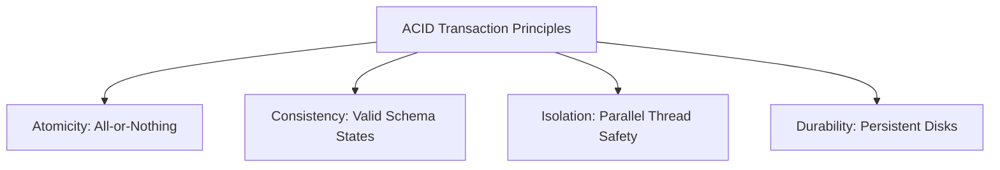

# SQL Databases in Backend Architectures

Relational (SQL) databases organize data into rows and tables with predefined schemas. They enforce strong relationships, structural integrity, and consistency.

## Installation & Tooling Setup

### 1. PostgreSQL (Database Server)
To install PostgreSQL on your machine:
1. Navigate to the [Official PostgreSQL Downloads Page](https://www.postgresql.org/download/).
2. Select your OS (e.g. Windows) and download the EnterpriseDB (EDB) graphical installer.
3. Run the installer, configure a password for the default `postgres` superuser, and keep the default port `5432` enabled.

### 2. pgAdmin (GUI Management Tool)
pgAdmin is the most popular graphical administration and management tool for PostgreSQL.
1. Download the tool from the [Official pgAdmin Downloads Page](https://www.pgadmin.org/download/).
2. Install the desktop package, launch it, and click **Add New Server** to connect to your local PostgreSQL instance on port `5432`.

### 3. psql (Command Line Interface)
The `psql` interactive terminal is included with your PostgreSQL installation.
* Connect to your local database server:
  ```bash
  psql -U postgres -h localhost
  ```
* Useful CLI shell commands:
  * `\l` : List all databases.
  * `\c <database_name>` : Connect to a specific database.
  * `\dt` : List all tables in the current database.
  * `\q` : Quit the psql shell.

### Official Installer Portals
| PostgreSQL Server Download | pgAdmin GUI Tool Download |
| :---: | :---: |
|  |  |

---

## 1. ACID Properties



### Explanation:
* **Atomicity**: Guarantees that all database updates in a transaction block complete, or none of them are committed (rollback).
* **Consistency**: Ensures data transformations move the database from one valid schema state to another, enforcing table constraints.
* **Isolation**: Controls the visibility of concurrent transactions (using isolation levels like *Read Committed* or *Serializable*) to prevent dirty or phantom reads.
* **Durability**: Ensures committed transactions survive system crashes by writing writes directly to non-volatile disk logs (Write-Ahead Logging).

---

## 2. Table Relationships: One-to-Many & Many-to-Many

Relational databases use **Primary Keys (PK)** and **Foreign Keys (FK)** to link tables.

### Code Demonstration: Table Definitions
```sql
-- 1. Create a parent Group table
CREATE TABLE groups (
    id SERIAL PRIMARY KEY,
    name VARCHAR(100) NOT NULL UNIQUE
);

-- 2. Create an Item table with a One-to-Many relationship (each item belongs to one group)
CREATE TABLE items (
    id SERIAL PRIMARY KEY,
    name VARCHAR(100) NOT NULL,
    description TEXT,
    group_id INTEGER REFERENCES groups(id) ON DELETE CASCADE
);

-- 3. Create a junction table for a Many-to-Many relationship between Items and Tags
CREATE TABLE tags (
    id SERIAL PRIMARY KEY,
    label VARCHAR(50) NOT NULL UNIQUE
);

CREATE TABLE item_tags (
    item_id INTEGER REFERENCES items(id) ON DELETE CASCADE,
    tag_id INTEGER REFERENCES tags(id) ON DELETE CASCADE,
    PRIMARY KEY (item_id, tag_id)
);
```

---

## 3. SQL Indexing & Optimization

An index acts as a lookup table (typically structured as a **B-Tree**) to allow fast queries without scanning every row in the table.

### Code Demonstration: Index Creation
```sql
-- Create index on foreign key to speed up JOIN operations
CREATE INDEX idx_items_group_id ON items(group_id);

-- Create a composite index for querying multiple columns in a specific order
CREATE INDEX idx_items_name_desc ON items(name, description);
```

> [!TIP]
> Do not over-index. While indices accelerate `SELECT` queries, they degrade `INSERT`, `UPDATE`, and `DELETE` execution times because the database must update the index structure for every modification.

---

## 4. Connecting and Querying in Backend Code

To interact with SQL databases in backend development, applications use database drivers and pools to connect, perform CRUD operations, and manage transactions.

### 4.1 PostgreSQL Integration

#### Python (using `psycopg2`)
```python
import psycopg2

# 1. Establish the connection
connection = psycopg2.connect(
    host="localhost",
    database="mydb",
    user="postgres",
    password="mysecretpassword",
    port=5432
)

try:
    with connection.cursor() as cursor:
        # Create table
        cursor.execute("""
            CREATE TABLE IF NOT EXISTS users (
                id SERIAL PRIMARY KEY,
                name VARCHAR(100) NOT NULL,
                email VARCHAR(100) UNIQUE NOT NULL
            );
        """)
        
        # INSERT Query (using %s placeholder to prevent SQL Injection)
        cursor.execute(
            "INSERT INTO users (name, email) VALUES (%s, %s) RETURNING id;",
            ("Alice", "alice@example.com")
        )
        user_id = cursor.fetchone()[0]
        print(f"Inserted Postgres User ID: {user_id}")
        
        # SELECT Query
        cursor.execute("SELECT id, name, email FROM users;")
        for row in cursor.fetchall():
            print(f"ID: {row[0]}, Name: {row[1]}, Email: {row[2]}")
            
        connection.commit()  # Commit transaction
except Exception as e:
    connection.rollback()  # Rollback transaction on failure
    print("Database error:", e)
finally:
    connection.close()  # Clean up resource
```

#### Node.js (using `pg` Pool)
```javascript
const { Pool } = require('pg');

// Create connection pool
const pool = new Pool({
  host: 'localhost',
  database: 'mydb',
  user: 'postgres',
  password: 'mysecretpassword',
  port: 5432,
  max: 20 // Max concurrent client connections
});

async function runPostgres() {
  const client = await pool.connect();
  try {
    await client.query('BEGIN'); // Start transaction

    // INSERT Query
    const insertRes = await client.query(
      'INSERT INTO users (name, email) VALUES ($1, $2) RETURNING id;',
      ['Bob', 'bob@example.com']
    );
    console.log(`Inserted Node User ID: ${insertRes.rows[0].id}`);

    // SELECT Query
    const selectRes = await client.query('SELECT * FROM users;');
    console.log('All Users:', selectRes.rows);

    await client.query('COMMIT');
  } catch (error) {
    await client.query('ROLLBACK');
    console.error('Transaction failed:', error.stack);
  } finally {
    client.release(); // Return client back to the pool
  }
}
```

### 4.2 MySQL Integration

#### Python (using `mysql-connector-python`)
```python
import mysql.connector

# Connect to MySQL Server
connection = mysql.connector.connect(
    host="localhost",
    database="mydb",
    user="root",
    password="mysecretpassword"
)

try:
    cursor = connection.cursor()
    cursor.execute("""
        CREATE TABLE IF NOT EXISTS users (
            id INT AUTO_INCREMENT PRIMARY KEY,
            name VARCHAR(100) NOT NULL,
            email VARCHAR(100) UNIQUE NOT NULL
        );
    """)
    
    # Parameterized INSERT
    cursor.execute(
        "INSERT INTO users (name, email) VALUES (%s, %s);",
        ("Charlie", "charlie@example.com")
    )
    connection.commit()
    print(f"Inserted MySQL User ID: {cursor.lastrowid}")
    
    # SELECT query execution
    cursor.execute("SELECT id, name, email FROM users;")
    for (user_id, name, email) in cursor:
        print(f"ID: {user_id}, Name: {name}, Email: {email}")
except Exception as e:
    print("MySQL Error:", e)
finally:
    connection.close()
```

#### Node.js (using `mysql2/promise`)
```javascript
const mysql = require('mysql2/promise');

async function runMySQL() {
  const connection = await mysql.createConnection({
    host: 'localhost',
    database: 'mydb',
    user: 'root',
    password: 'mysecretpassword'
  });

  try {
    // Parameterized INSERT
    const [result] = await connection.execute(
      'INSERT INTO users (name, email) VALUES (?, ?);',
      ['David', 'david@example.com']
    );
    console.log(`Inserted MySQL User ID: ${result.insertId}`);

    // SELECT Query
    const [rows] = await connection.query('SELECT * FROM users;');
    console.log('Users:', rows);
  } catch (err) {
    console.error(err);
  } finally {
    await connection.end();
  }
}
```

### 4.3 SQLite Integration (Serverless Local Database)

#### Python (using standard library `sqlite3`)
```python
import sqlite3

# Connect to a local database file (created automatically if missing)
connection = sqlite3.connect("app_local.db")

try:
    cursor = connection.cursor()
    cursor.execute("""
        CREATE TABLE IF NOT EXISTS users (
            id INTEGER PRIMARY KEY AUTOINCREMENT,
            name TEXT NOT NULL,
            email TEXT UNIQUE NOT NULL
        );
    """)
    
    # Parameterized INSERT (uses ? symbol in SQLite)
    cursor.execute(
        "INSERT INTO users (name, email) VALUES (?, ?);",
        ("Eve", "eve@example.com")
    )
    connection.commit()
    print(f"Inserted SQLite User ID: {cursor.lastrowid}")
    
    # SELECT query
    cursor.execute("SELECT * FROM users;")
    print(cursor.fetchall())
except Exception as e:
    print("SQLite Error:", e)
finally:
    connection.close()
```

#### Node.js (using `sqlite3`)
```javascript
const sqlite3 = require('sqlite3').verbose();

// Open standard SQLite database in system memory
const db = new sqlite3.Database(':memory:');

db.serialize(() => {
  db.run("CREATE TABLE users (id INTEGER PRIMARY KEY, name TEXT)");

  // Prepare and execute statement
  const stmt = db.prepare("INSERT INTO users (name) VALUES (?)");
  stmt.run("Frank");
  stmt.finalize();

  // Query database rows
  db.all("SELECT id, name FROM users", (err, rows) => {
    if (err) throw err;
    console.log('SQLite Memory Users:', rows);
  });
});

db.close();
```
