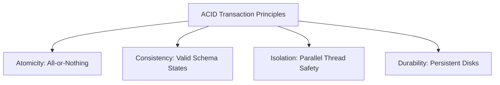

# SQL Databases in Backend Architectures

Relational (SQL) databases organize data into rows and tables with predefined schemas. They enforce strong relationships, structural integrity, and consistency.

## Installation & Tooling Setup

### 1. PostgreSQL (Database Server)
To install PostgreSQL on your machine:
1. Navigate to the [Official PostgreSQL Downloads Page](https://www.postgresql.org/download/).
2. Select your OS (e.g. Windows) and download the EnterpriseDB (EDB) graphical installer.
3. Run the installer, configure a password for the default `postgres` superuser, and keep the default port `5432` enabled.

### 2. pgAdmin (GUI Management Tool)
pgAdmin is the most popular graphical administration and management tool for PostgreSQL.
1. Download the tool from the [Official pgAdmin Downloads Page](https://www.pgadmin.org/download/).
2. Install the desktop package, launch it, and click **Add New Server** to connect to your local PostgreSQL instance on port `5432`.

### 3. psql (Command Line Interface)
The `psql` interactive terminal is included with your PostgreSQL installation.
* Connect to your local database server:
  ```bash
  psql -U postgres -h localhost
  ```
* Useful CLI shell commands:
  * `\l` : List all databases.
  * `\c <database_name>` : Connect to a specific database.
  * `\dt` : List all tables in the current database.
  * `\q` : Quit the psql shell.

### Official Installer Portals
| PostgreSQL Server Download | pgAdmin GUI Tool Download |
| :---: | :---: |
|  |  |

---

## 1. ACID Properties



### Explanation:
* **Atomicity**: Guarantees that all database updates in a transaction block complete, or none of them are committed (rollback).
* **Consistency**: Ensures data transformations move the database from one valid schema state to another, enforcing table constraints.
* **Isolation**: Controls the visibility of concurrent transactions (using isolation levels like *Read Committed* or *Serializable*) to prevent dirty or phantom reads.
* **Durability**: Ensures committed transactions survive system crashes by writing writes directly to non-volatile disk logs (Write-Ahead Logging).

---

## 2. Table Relationships: One-to-Many & Many-to-Many

Relational databases use **Primary Keys (PK)** and **Foreign Keys (FK)** to link tables.

### Code Demonstration: Table Definitions
```sql
-- 1. Create a parent Group table
CREATE TABLE groups (
    id SERIAL PRIMARY KEY,
    name VARCHAR(100) NOT NULL UNIQUE
);

-- 2. Create an Item table with a One-to-Many relationship (each item belongs to one group)
CREATE TABLE items (
    id SERIAL PRIMARY KEY,
    name VARCHAR(100) NOT NULL,
    description TEXT,
    group_id INTEGER REFERENCES groups(id) ON DELETE CASCADE
);

-- 3. Create a junction table for a Many-to-Many relationship between Items and Tags
CREATE TABLE tags (
    id SERIAL PRIMARY KEY,
    label VARCHAR(50) NOT NULL UNIQUE
);

CREATE TABLE item_tags (
    item_id INTEGER REFERENCES items(id) ON DELETE CASCADE,
    tag_id INTEGER REFERENCES tags(id) ON DELETE CASCADE,
    PRIMARY KEY (item_id, tag_id)
);
```

---

## 3. SQL Indexing & Optimization

An index acts as a lookup table (typically structured as a **B-Tree**) to allow fast queries without scanning every row in the table.

### Code Demonstration: Index Creation
```sql
-- Create index on foreign key to speed up JOIN operations
CREATE INDEX idx_items_group_id ON items(group_id);

-- Create a composite index for querying multiple columns in a specific order
CREATE INDEX idx_items_name_desc ON items(name, description);
```

> [!TIP]
> Do not over-index. While indices accelerate `SELECT` queries, they degrade `INSERT`, `UPDATE`, and `DELETE` execution times because the database must update the index structure for every modification.
