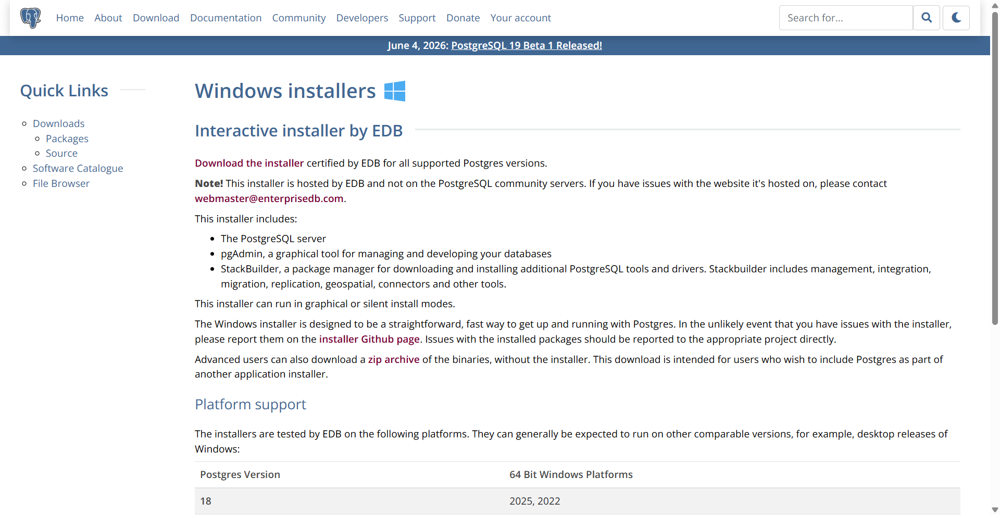
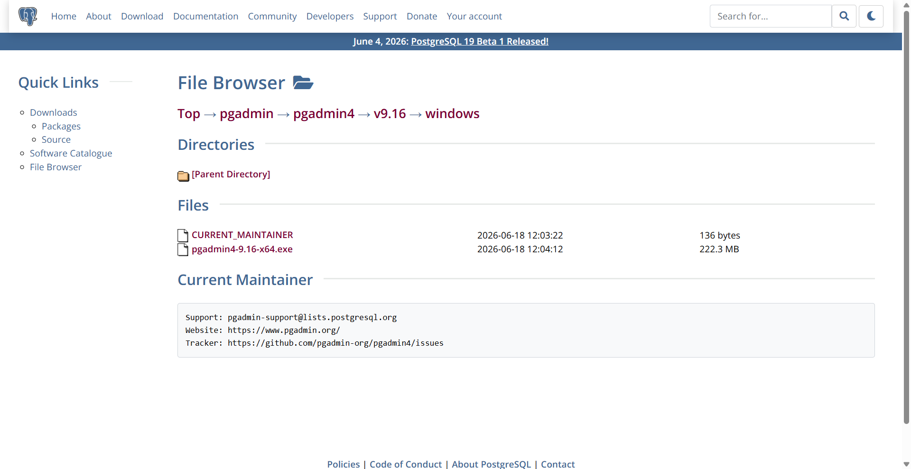
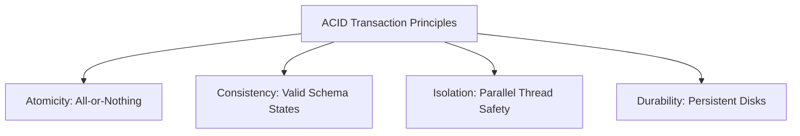

# SQL Databases in Backend Architectures

Relational (SQL) databases organize data into rows and tables with predefined schemas. They enforce strong relationships, structural integrity, and consistency.

<ProgressTracker currentSection=1 totalSections=5 />

## Installation & Tooling Setup

### 1. PostgreSQL (Database Server)
To install PostgreSQL on your machine:
1. Navigate to the [Official PostgreSQL Downloads Page](https://www.postgresql.org/download/).
2. Select your OS (e.g. Windows) and download the EnterpriseDB (EDB) graphical installer.
3. Run the installer, configure a password for the default `postgres` superuser, and keep the default port `5432` enabled.

### 2. pgAdmin (GUI Management Tool)
pgAdmin is the most popular graphical administration and management tool for PostgreSQL.
1. Download the tool from the [Official pgAdmin Downloads Page](https://www.pgadmin.org/download/).
2. Install the desktop package, launch it, and click **Add New Server** to connect to your local PostgreSQL instance on port `5432`.

### 3. psql (Command Line Interface)
The `psql` interactive terminal is included with your PostgreSQL installation.
* Connect to your local database server:
  ```bash
  psql -U postgres -h localhost
  ```
* Useful CLI shell commands:
  * `\l` : List all databases.
  * `\c <database_name>` : Connect to a specific database.
  * `\dt` : List all tables in the current database.
  * `\q` : Quit the psql shell.

### Official Installer Portals
| PostgreSQL Server Download | pgAdmin GUI Tool Download |
| :---: | :---: |
|  |  |

---

<ProgressTracker currentSection=2 totalSections=5 />

## 1. ACID Properties



### Explanation:
* **Atomicity**: Guarantees that all database updates in a transaction block complete, or none of them are committed (rollback).
* **Consistency**: Ensures data transformations move the database from one valid schema state to another, enforcing table constraints.
* **Isolation**: Controls the visibility of concurrent transactions (using isolation levels like *Read Committed* or *Serializable*) to prevent dirty or phantom reads.
* **Durability**: Ensures committed transactions survive system crashes by writing writes directly to non-volatile disk logs (Write-Ahead Logging).

---

<ProgressTracker currentSection=3 totalSections=5 />

## 2. Table Relationships: One-to-Many & Many-to-Many

Relational databases use **Primary Keys (PK)** and **Foreign Keys (FK)** to link tables.

### Code Demonstration: Table Definitions
```sql
-- 1. Create a parent Group table
CREATE TABLE groups (
    id SERIAL PRIMARY KEY,
    name VARCHAR(100) NOT NULL UNIQUE
);

-- 2. Create an Item table with a One-to-Many relationship (each item belongs to one group)
CREATE TABLE items (
    id SERIAL PRIMARY KEY,
    name VARCHAR(100) NOT NULL,
    description TEXT,
    group_id INTEGER REFERENCES groups(id) ON DELETE CASCADE
);

-- 3. Create a junction table for a Many-to-Many relationship between Items and Tags
CREATE TABLE tags (
    id SERIAL PRIMARY KEY,
    label VARCHAR(50) NOT NULL UNIQUE
);

CREATE TABLE item_tags (
    item_id INTEGER REFERENCES items(id) ON DELETE CASCADE,
    tag_id INTEGER REFERENCES tags(id) ON DELETE CASCADE,
    PRIMARY KEY (item_id, tag_id)
);
```

---

<ProgressTracker currentSection=4 totalSections=5 />

## 3. SQL Indexing & Optimization

An index acts as a lookup table (typically structured as a **B-Tree**) to allow fast queries without scanning every row in the table.

### Code Demonstration: Index Creation
```sql
-- Create index on foreign key to speed up JOIN operations
CREATE INDEX idx_items_group_id ON items(group_id);

-- Create a composite index for querying multiple columns in a specific order
CREATE INDEX idx_items_name_desc ON items(name, description);
```

> [!TIP]
> Do not over-index. While indices accelerate `SELECT` queries, they degrade `INSERT`, `UPDATE`, and `DELETE` execution times because the database must update the index structure for every modification.

---

<ProgressTracker currentSection=5 totalSections=5 />

## 4. Connecting and Querying in Backend Code

To interact with SQL databases in backend development, applications use database drivers and pools to connect, perform CRUD operations, and manage transactions.

### 4.1 PostgreSQL Integration

#### Python (using `psycopg2`)
<Tabs>
  <Tab label="Syntax & Example">

```python
import psycopg2

# 1. Establish the connection
connection = psycopg2.connect(
    host="localhost",
    database="mydb",
    user="postgres",
    password="mysecretpassword",
    port=5432
)

try:
    with connection.cursor() as cursor:
        # Create table
        cursor.execute("""
            CREATE TABLE IF NOT EXISTS users (
                id SERIAL PRIMARY KEY,
                name VARCHAR(100) NOT NULL,
                email VARCHAR(100) UNIQUE NOT NULL
            );
        """)
        
        # INSERT Query (using %s placeholder to prevent SQL Injection)
        cursor.execute(
            "INSERT INTO users (name, email) VALUES (%s, %s) RETURNING id;",
            ("Alice", "alice@example.com")
        )
        user_id = cursor.fetchone()[0]
        print(f"Inserted Postgres User ID: {user_id}")
        
        # SELECT Query
        cursor.execute("SELECT id, name, email FROM users;")
        for row in cursor.fetchall():
            print(f"ID: {row[0]}, Name: {row[1]}, Email: {row[2]}")
            
        connection.commit()  # Commit transaction
except Exception as e:
    connection.rollback()  # Rollback transaction on failure
    print("Database error:", e)
finally:
    connection.close()  # Clean up resource
```

  </Tab>
  <Tab label="Interactive Playground">
    <InteractiveExample 
      language="python"
      initialCode="import psycopg2\n\n# 1. Establish the connection\nconnection = psycopg2.connect(\n    host=\"localhost\",\n    database=\"mydb\",\n    user=\"postgres\",\n    password=\"mysecretpassword\",\n    port=5432\n)\n\ntry:\n    with connection.cursor() as cursor:\n        # Create table\n        cursor.execute(\"\"\"\n            CREATE TABLE IF NOT EXISTS users (\n                id SERIAL PRIMARY KEY,\n                name VARCHAR(100) NOT NULL,\n                email VARCHAR(100) UNIQUE NOT NULL\n            );\n        \"\"\")\n        \n        # INSERT Query (using %s placeholder to prevent SQL Injection)\n        cursor.execute(\n            \"INSERT INTO users (name, email) VALUES (%s, %s) RETURNING id;\",\n            (\"Alice\", \"alice@example.com\")\n        )\n        user_id = cursor.fetchone()[0]\n        print(f\"Inserted Postgres User ID: {user_id}\")\n        \n        # SELECT Query\n        cursor.execute(\"SELECT id, name, email FROM users;\")\n        for row in cursor.fetchall():\n            print(f\"ID: {row[0]}, Name: {row[1]}, Email: {row[2]}\")\n            \n        connection.commit()  # Commit transaction\nexcept Exception as e:\n    connection.rollback()  # Rollback transaction on failure\n    print(\"Database error:\", e)\nfinally:\n    connection.close()  # Clean up resource" 
      instruction="Execute and edit this PYTHON example."
    />
  </Tab>
</Tabs>

#### Node.js (using `pg` Pool)
<Tabs>
  <Tab label="Syntax & Example">

```javascript
const { Pool } = require('pg');

// Create connection pool
const pool = new Pool({
  host: 'localhost',
  database: 'mydb',
  user: 'postgres',
  password: 'mysecretpassword',
  port: 5432,
  max: 20 // Max concurrent client connections
});

async function runPostgres() {
  const client = await pool.connect();
  try {
    await client.query('BEGIN'); // Start transaction

    // INSERT Query
    const insertRes = await client.query(
      'INSERT INTO users (name, email) VALUES ($1, $2) RETURNING id;',
      ['Bob', 'bob@example.com']
    );
    console.log(`Inserted Node User ID: ${insertRes.rows[0].id}`);

    // SELECT Query
    const selectRes = await client.query('SELECT * FROM users;');
    console.log('All Users:', selectRes.rows);

    await client.query('COMMIT');
  } catch (error) {
    await client.query('ROLLBACK');
    console.error('Transaction failed:', error.stack);
  } finally {
    client.release(); // Return client back to the pool
  }
}
```

  </Tab>
  <Tab label="Interactive Playground">
    <InteractiveExample 
      language="javascript"
      initialCode="const { Pool } = require('pg');\n\n// Create connection pool\nconst pool = new Pool({\n  host: 'localhost',\n  database: 'mydb',\n  user: 'postgres',\n  password: 'mysecretpassword',\n  port: 5432,\n  max: 20 // Max concurrent client connections\n});\n\nasync function runPostgres() {\n  const client = await pool.connect();\n  try {\n    await client.query('BEGIN'); // Start transaction\n\n    // INSERT Query\n    const insertRes = await client.query(\n      'INSERT INTO users (name, email) VALUES ($1, $2) RETURNING id;',\n      ['Bob', 'bob@example.com']\n    );\n    console.log(`Inserted Node User ID: ${insertRes.rows[0].id}`);\n\n    // SELECT Query\n    const selectRes = await client.query('SELECT * FROM users;');\n    console.log('All Users:', selectRes.rows);\n\n    await client.query('COMMIT');\n  } catch (error) {\n    await client.query('ROLLBACK');\n    console.error('Transaction failed:', error.stack);\n  } finally {\n    client.release(); // Return client back to the pool\n  }\n}" 
      instruction="Execute and edit this JAVASCRIPT example."
    />
  </Tab>
</Tabs>

### 4.2 MySQL Integration

#### Python (using `mysql-connector-python`)
<Tabs>
  <Tab label="Syntax & Example">

```python
import mysql.connector

# Connect to MySQL Server
connection = mysql.connector.connect(
    host="localhost",
    database="mydb",
    user="root",
    password="mysecretpassword"
)

try:
    cursor = connection.cursor()
    cursor.execute("""
        CREATE TABLE IF NOT EXISTS users (
            id INT AUTO_INCREMENT PRIMARY KEY,
            name VARCHAR(100) NOT NULL,
            email VARCHAR(100) UNIQUE NOT NULL
        );
    """)
    
    # Parameterized INSERT
    cursor.execute(
        "INSERT INTO users (name, email) VALUES (%s, %s);",
        ("Charlie", "charlie@example.com")
    )
    connection.commit()
    print(f"Inserted MySQL User ID: {cursor.lastrowid}")
    
    # SELECT query execution
    cursor.execute("SELECT id, name, email FROM users;")
    for (user_id, name, email) in cursor:
        print(f"ID: {user_id}, Name: {name}, Email: {email}")
except Exception as e:
    print("MySQL Error:", e)
finally:
    connection.close()
```

  </Tab>
  <Tab label="Interactive Playground">
    <InteractiveExample 
      language="python"
      initialCode="import mysql.connector\n\n# Connect to MySQL Server\nconnection = mysql.connector.connect(\n    host=\"localhost\",\n    database=\"mydb\",\n    user=\"root\",\n    password=\"mysecretpassword\"\n)\n\ntry:\n    cursor = connection.cursor()\n    cursor.execute(\"\"\"\n        CREATE TABLE IF NOT EXISTS users (\n            id INT AUTO_INCREMENT PRIMARY KEY,\n            name VARCHAR(100) NOT NULL,\n            email VARCHAR(100) UNIQUE NOT NULL\n        );\n    \"\"\")\n    \n    # Parameterized INSERT\n    cursor.execute(\n        \"INSERT INTO users (name, email) VALUES (%s, %s);\",\n        (\"Charlie\", \"charlie@example.com\")\n    )\n    connection.commit()\n    print(f\"Inserted MySQL User ID: {cursor.lastrowid}\")\n    \n    # SELECT query execution\n    cursor.execute(\"SELECT id, name, email FROM users;\")\n    for (user_id, name, email) in cursor:\n        print(f\"ID: {user_id}, Name: {name}, Email: {email}\")\nexcept Exception as e:\n    print(\"MySQL Error:\", e)\nfinally:\n    connection.close()" 
      instruction="Execute and edit this PYTHON example."
    />
  </Tab>
</Tabs>

#### Node.js (using `mysql2/promise`)
<Tabs>
  <Tab label="Syntax & Example">

```javascript
const mysql = require('mysql2/promise');

async function runMySQL() {
  const connection = await mysql.createConnection({
    host: 'localhost',
    database: 'mydb',
    user: 'root',
    password: 'mysecretpassword'
  });

  try {
    // Parameterized INSERT
    const [result] = await connection.execute(
      'INSERT INTO users (name, email) VALUES (?, ?);',
      ['David', 'david@example.com']
    );
    console.log(`Inserted MySQL User ID: ${result.insertId}`);

    // SELECT Query
    const [rows] = await connection.query('SELECT * FROM users;');
    console.log('Users:', rows);
  } catch (err) {
    console.error(err);
  } finally {
    await connection.end();
  }
}
```

  </Tab>
  <Tab label="Interactive Playground">
    <InteractiveExample 
      language="javascript"
      initialCode="const mysql = require('mysql2/promise');\n\nasync function runMySQL() {\n  const connection = await mysql.createConnection({\n    host: 'localhost',\n    database: 'mydb',\n    user: 'root',\n    password: 'mysecretpassword'\n  });\n\n  try {\n    // Parameterized INSERT\n    const [result] = await connection.execute(\n      'INSERT INTO users (name, email) VALUES (?, ?);',\n      ['David', 'david@example.com']\n    );\n    console.log(`Inserted MySQL User ID: ${result.insertId}`);\n\n    // SELECT Query\n    const [rows] = await connection.query('SELECT * FROM users;');\n    console.log('Users:', rows);\n  } catch (err) {\n    console.error(err);\n  } finally {\n    await connection.end();\n  }\n}" 
      instruction="Execute and edit this JAVASCRIPT example."
    />
  </Tab>
</Tabs>

### 4.3 SQLite Integration (Serverless Local Database)

#### Python (using standard library `sqlite3`)
<Tabs>
  <Tab label="Syntax & Example">

```python
import sqlite3

# Connect to a local database file (created automatically if missing)
connection = sqlite3.connect("app_local.db")

try:
    cursor = connection.cursor()
    cursor.execute("""
        CREATE TABLE IF NOT EXISTS users (
            id INTEGER PRIMARY KEY AUTOINCREMENT,
            name TEXT NOT NULL,
            email TEXT UNIQUE NOT NULL
        );
    """)
    
    # Parameterized INSERT (uses ? symbol in SQLite)
    cursor.execute(
        "INSERT INTO users (name, email) VALUES (?, ?);",
        ("Eve", "eve@example.com")
    )
    connection.commit()
    print(f"Inserted SQLite User ID: {cursor.lastrowid}")
    
    # SELECT query
    cursor.execute("SELECT * FROM users;")
    print(cursor.fetchall())
except Exception as e:
    print("SQLite Error:", e)
finally:
    connection.close()
```

  </Tab>
  <Tab label="Interactive Playground">
    <InteractiveExample 
      language="python"
      initialCode="import sqlite3\n\n# Connect to a local database file (created automatically if missing)\nconnection = sqlite3.connect(\"app_local.db\")\n\ntry:\n    cursor = connection.cursor()\n    cursor.execute(\"\"\"\n        CREATE TABLE IF NOT EXISTS users (\n            id INTEGER PRIMARY KEY AUTOINCREMENT,\n            name TEXT NOT NULL,\n            email TEXT UNIQUE NOT NULL\n        );\n    \"\"\")\n    \n    # Parameterized INSERT (uses ? symbol in SQLite)\n    cursor.execute(\n        \"INSERT INTO users (name, email) VALUES (?, ?);\",\n        (\"Eve\", \"eve@example.com\")\n    )\n    connection.commit()\n    print(f\"Inserted SQLite User ID: {cursor.lastrowid}\")\n    \n    # SELECT query\n    cursor.execute(\"SELECT * FROM users;\")\n    print(cursor.fetchall())\nexcept Exception as e:\n    print(\"SQLite Error:\", e)\nfinally:\n    connection.close()" 
      instruction="Execute and edit this PYTHON example."
    />
  </Tab>
</Tabs>

#### Node.js (using `sqlite3`)
<Tabs>
  <Tab label="Syntax & Example">

```javascript
const sqlite3 = require('sqlite3').verbose();

// Open standard SQLite database in system memory
const db = new sqlite3.Database(':memory:');

db.serialize(() => {
  db.run("CREATE TABLE users (id INTEGER PRIMARY KEY, name TEXT)");

  // Prepare and execute statement
  const stmt = db.prepare("INSERT INTO users (name) VALUES (?)");
  stmt.run("Frank");
  stmt.finalize();

  // Query database rows
  db.all("SELECT id, name FROM users", (err, rows) => {
    if (err) throw err;
    console.log('SQLite Memory Users:', rows);
  });
});

db.close();
```

  </Tab>
  <Tab label="Interactive Playground">
    <InteractiveExample 
      language="javascript"
      initialCode="const sqlite3 = require('sqlite3').verbose();\n\n// Open standard SQLite database in system memory\nconst db = new sqlite3.Database(':memory:');\n\ndb.serialize(() => {\n  db.run(\"CREATE TABLE users (id INTEGER PRIMARY KEY, name TEXT)\");\n\n  // Prepare and execute statement\n  const stmt = db.prepare(\"INSERT INTO users (name) VALUES (?)\");\n  stmt.run(\"Frank\");\n  stmt.finalize();\n\n  // Query database rows\n  db.all(\"SELECT id, name FROM users\", (err, rows) => {\n    if (err) throw err;\n    console.log('SQLite Memory Users:', rows);\n  });\n});\n\ndb.close();" 
      instruction="Execute and edit this JAVASCRIPT example."
    />
  </Tab>
</Tabs>

---

### Knowledge Verification Check

<Quiz 
  question="When must the `HAVING` clause be used in SQL instead of the `WHERE` clause?" 
  options=["When filtering records containing string patterns.", "When filtering groups of query results based on aggregate functions (e.g. SUM, AVG).", "When sorting results in descending order.", "When performing SQL join operations."] 
  answerIndex=1 
  explanation="The `WHERE` clause filters individual rows before grouping. The `HAVING` clause filters grouped results after aggregation has been applied." 
/>

<Quiz 
  question="Which type of SQL Join returns all rows from the left table, and matching rows from the right table, filling with NULL if no match is found?" 
  options=["INNER JOIN", "LEFT JOIN", "RIGHT JOIN", "FULL OUTER JOIN"] 
  answerIndex=1 
  explanation="A `LEFT JOIN` (or LEFT OUTER JOIN) returns all records from the left table and any corresponding matching records from the right table." 
/>

<Quiz 
  question="How does a B-Tree index speed up database SELECT queries, and what is its overhead?" 
  options=["It compresses table files to half size, slowing down writes.", "It provides logarithmic time search (O(log N)) for matching rows, but adds write overhead to update the index on INSERT, UPDATE, and DELETE operations.", "It turns relational tables into NoSQL collections.", "It runs queries in parallel on the GPU."] 
  answerIndex=1 
  explanation="B-Tree indexes speed up lookups by organizing data in a balanced search tree. However, every modification to indexed columns requires updating the tree structure, adding write overhead." 
/>

<Quiz 
  question="What does the ACID acronym stand for in database transaction management?" 
  options=["Aggregation, Consolidation, Indexing, Distribution.", "Atomicity, Consistency, Isolation, Durability.", "Availability, Concurrency, Isolation, Deletion.", "Access, Control, Integrity, Definition."] 
  answerIndex=1 
  explanation="ACID properties (Atomicity, Consistency, Isolation, Durability) ensure database transactions are processed reliably, maintaining data integrity." 
/>

<Quiz 
  question="Which ANSI SQL transaction isolation level prevents dirty reads and non-repeatable reads, but can allow phantom reads?" 
  options=["Read Uncommitted", "Read Committed", "Repeatable Read", "Serializable"] 
  answerIndex=2 
  explanation="Repeatable Read prevents dirty reads and non-repeatable reads by holding locks on read rows, but does not lock index ranges, potentially allowing phantom rows to be inserted." 
/>

<Quiz 
  question="What is the primary goal of Third Normal Form (3NF) in database design?" 
  options=["To optimize search queries using caching.", "To eliminate transitive dependencies, ensuring all non-key columns depend only on the primary key, thereby reducing data redundancy.", "To split tables into document-based JSON rows.", "To enforce foreign key constraints across different databases."] 
  answerIndex=1 
  explanation="A database is in 3NF if it is in 2NF and has no transitive functional dependencies, meaning every non-prime attribute depends directly on the primary key." 
/>

<Quiz 
  question="What is a key difference between a Primary Key and a Unique constraint?" 
  options=["A table can have multiple Primary Keys, but only one Unique constraint.", "Primary Keys can contain NULL values, Unique constraints cannot.", "A table can have only one Primary Key, but multiple Unique constraints, and Unique constraints can allow NULL values.", "They are identical and have no functional differences."] 
  answerIndex=2 
  explanation="A table is limited to one primary key, which uniquely identifies rows and forbids NULL values. Unique constraints allow duplicate prevention across other columns, allowing NULLs." 
/>

<Quiz 
  question="What does a Foreign Key constraint enforce in a relational schema?" 
  options=["It encrypts columns to secure foreign user access.", "Referential integrity, guaranteeing that values in a column match existing values in the primary key of a referenced parent table.", "It automatically synchronizes tables with external APIs.", "It indexes columns for faster search."] 
  answerIndex=1 
  explanation="Foreign keys maintain referential integrity, preventing invalid data entries in child tables by ensuring they point to a valid parent record." 
/>

<Quiz 
  question="Which SQL aggregate function computes the rank of rows within query partitions without skipping rank numbers?" 
  options=["RANK()", "DENSE_RANK()", "ROW_NUMBER()", "PERCENT_RANK()"] 
  answerIndex=1 
  explanation="Unlike `RANK()`, which leaves gaps when ties occur (e.g. 1, 2, 2, 4), `DENSE_RANK()` assigns consecutive integers without gaps (e.g. 1, 2, 2, 3)." 
/>

<Quiz 
  question="What is the difference between a View and a Materialized View?" 
  options=["Views are stored on disk, Materialized Views exist only in memory.", "A View is a virtual table that executes its query dynamically, while a Materialized View precomputes and stores its result query data on disk.", "Materialized Views are used only in NoSQL databases.", "There is no difference; they are identical."] 
  answerIndex=1 
  explanation="Views run their queries on-demand, consuming computation resources each time. Materialized views cache query results physically on disk and must be refreshed when base data changes." 
/>

<Quiz 
  question="Why are Columnar databases preferred over Row-oriented databases for OLAP (Analytical) workloads?" 
  options=["They run transactions faster.", "They allow reading only the specific columns needed for aggregations, drastically reducing disk I/O and improving compression rates.", "They use JSON format internally.", "They require less memory to load."] 
  answerIndex=1 
  explanation="Row-oriented databases are optimized for OLTP (reading whole rows). Columnar databases group column values together, enabling high compression and fast aggregation over specific fields." 
/>

<Quiz 
  question="What is a Common Table Expression (CTE) in SQL?" 
  options=["A permanent database table used for caching.", "A temporary named result set defined within the scope of a single SELECT, INSERT, UPDATE, or DELETE query using the `WITH` keyword.", "A table index optimization strategy.", "A database schema validation rule."] 
  answerIndex=1 
  explanation="CTEs are defined using the `WITH` keyword. They act as temporary queries that exist during the execution of a main statement, improving query readability and enabling recursion." 
/>
