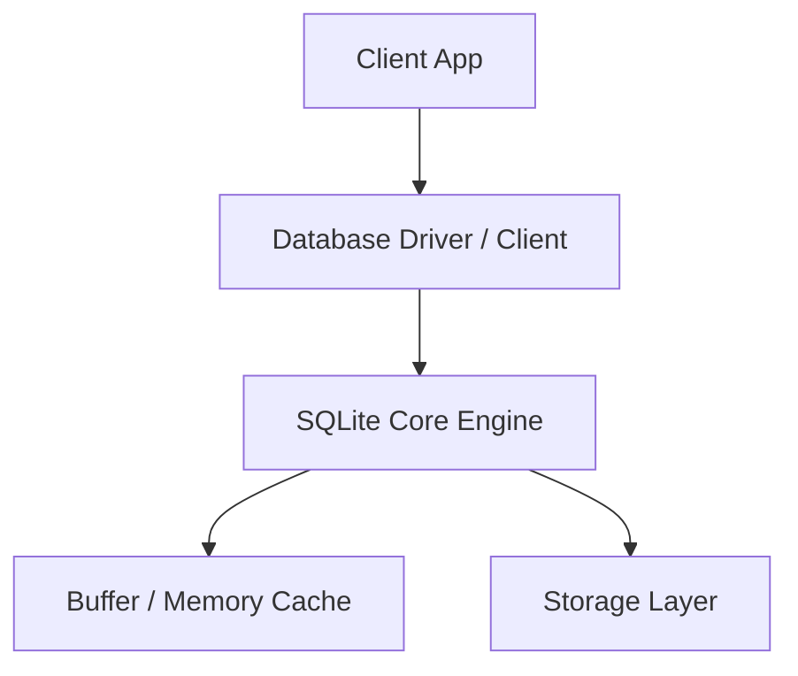
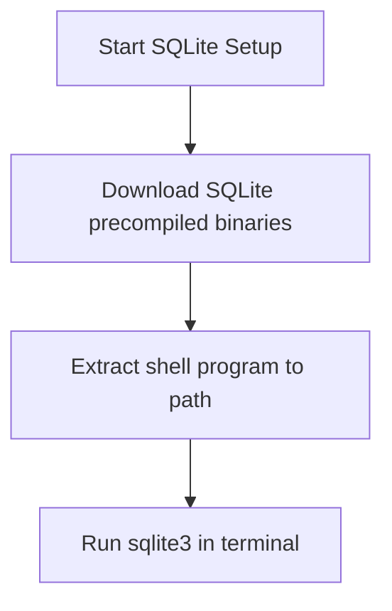

# SQLite Master Engineering Guide

A comprehensive, production-level, industry-grade guide to SQLite for software engineers, backend developers, data engineers, DevOps, and DBAs. Serverless, zero-configuration, single-file embedded SQL database engine suitable for local storage, mobile apps, and testing environments.

---

<ProgressTracker currentSection=1 totalSections=35 />

## 1. Introduction

### 1.1 Overview & Theory
Detailed explanation of Introduction in SQLite. Since SQLite is a embedded database, it provides optimized strategies to solve enterprise engineering constraints.

### 1.2 Practical Operations & Best Practices
Production setup guidelines for Introduction in SQLite.

```bash
# Configure Write-Ahead Logging (WAL) mode for database concurrent read/write throughput
sqlite3 production.db "PRAGMA journal_mode=WAL;"
```

---

<ProgressTracker currentSection=2 totalSections=35 />

## 2. Database Fundamentals

### 2.1 Overview & Theory
Detailed explanation of Database Fundamentals in SQLite. Since SQLite is a embedded database, it supports structural operations corresponding to transaction consistency models. It matches specific ACID/BASE characteristics.

### 2.2 Practical Operations & Best Practices
Production setup guidelines for Database Fundamentals in SQLite.

```bash
# Validate SQLite database schema integrity and search for structural corruptions
sqlite3 production.db "PRAGMA integrity_check;"
```

---

<ProgressTracker currentSection=3 totalSections=35 />

## 3. Internal Architecture

### 3.1 Overview & Theory
Detailed explanation of Internal Architecture in SQLite. Since SQLite is a embedded database, its internal architecture decouples various core processes. In SQLite, this handles write paths and read paths efficiently.



### 3.2 Practical Operations & Best Practices
Production setup guidelines for Internal Architecture in SQLite.

```bash
# Reclaim free pages and shrink physical database file size on disk
sqlite3 production.db "VACUUM;"
```

---

<ProgressTracker currentSection=4 totalSections=35 />

## 4. Installation

### 4.0 Official Resources & Installation Flow
- **Download Link**: [Official SQLite Download Page](https://www.sqlite.org/download.html)




### 4.1 Overview & Theory
Detailed explanation of Installation in SQLite. Since SQLite is a embedded database, it provides optimized strategies to solve enterprise engineering constraints.

### 4.2 Practical Operations & Best Practices
Production setup guidelines for Installation in SQLite.

```bash
# Check for foreign key constraint violations across all tables
sqlite3 production.db "PRAGMA foreign_key_check;"
```

---

<ProgressTracker currentSection=5 totalSections=35 />

## 5. Database Creation

### 5.1 Overview & Theory
Detailed explanation of Database Creation in SQLite. Since SQLite is a embedded database, it provides optimized strategies to solve enterprise engineering constraints.

### 5.2 Practical Operations & Best Practices
Production setup guidelines for Database Creation in SQLite.

```bash
# Configure Write-Ahead Logging (WAL) mode for database concurrent read/write throughput
sqlite3 production.db "PRAGMA journal_mode=WAL;"
```

---

<ProgressTracker currentSection=6 totalSections=35 />

## 6. Data Types

### 6.1 Overview & Theory
Detailed explanation of Data Types in SQLite. Since SQLite is a embedded database, it provides optimized strategies to solve enterprise engineering constraints.

### 6.2 Practical Operations & Best Practices
Production setup guidelines for Data Types in SQLite.

```bash
# Validate SQLite database schema integrity and search for structural corruptions
sqlite3 production.db "PRAGMA integrity_check;"
```

---

<ProgressTracker currentSection=7 totalSections=35 />

## 7. Tables

### 7.1 Overview & Theory
Detailed explanation of Tables in SQLite. Since SQLite is a embedded database, it provides optimized strategies to solve enterprise engineering constraints.

### 7.2 Practical Operations & Best Practices
Production setup guidelines for Tables in SQLite.

```bash
# Reclaim free pages and shrink physical database file size on disk
sqlite3 production.db "VACUUM;"
```

---

<ProgressTracker currentSection=8 totalSections=35 />

## 8. CRUD Operations

### 8.1 Overview & Theory
Detailed explanation of CRUD Operations in SQLite. Since SQLite is a embedded database, it offers specialized query paradigms. Let's look at code and syntax examples:

```sql
-- SELECT Example in SQLite
SELECT * FROM users WHERE status = 'active';
```

### 8.2 Practical Operations & Best Practices
Production setup guidelines for CRUD Operations in SQLite.

```bash
# Check for foreign key constraint violations across all tables
sqlite3 production.db "PRAGMA foreign_key_check;"
```

---

<ProgressTracker currentSection=9 totalSections=35 />

## 9. SQL Queries

### 9.1 Overview & Theory
Detailed explanation of SQL Queries in SQLite. Since SQLite is a embedded database, it offers specialized query paradigms. Let's look at code and syntax examples:

```sql
-- SELECT Example in SQLite
SELECT * FROM users WHERE status = 'active';
```

### 9.2 Practical Operations & Best Practices
Production setup guidelines for SQL Queries in SQLite.

```bash
# Configure Write-Ahead Logging (WAL) mode for database concurrent read/write throughput
sqlite3 production.db "PRAGMA journal_mode=WAL;"
```

---

<ProgressTracker currentSection=10 totalSections=35 />

## 10. Joins

### 10.1 Overview & Theory
Detailed explanation of Joins in SQLite. Since SQLite is a embedded database, it provides optimized strategies to solve enterprise engineering constraints.

### 10.2 Practical Operations & Best Practices
Production setup guidelines for Joins in SQLite.

```bash
# Validate SQLite database schema integrity and search for structural corruptions
sqlite3 production.db "PRAGMA integrity_check;"
```

---

<ProgressTracker currentSection=11 totalSections=35 />

## 11. Functions

### 11.1 Overview & Theory
Detailed explanation of Functions in SQLite. Since SQLite is a embedded database, it provides optimized strategies to solve enterprise engineering constraints.

### 11.2 Practical Operations & Best Practices
Production setup guidelines for Functions in SQLite.

```bash
# Reclaim free pages and shrink physical database file size on disk
sqlite3 production.db "VACUUM;"
```

---

<ProgressTracker currentSection=12 totalSections=35 />

## 12. Indexes

### 12.1 Overview & Theory
Detailed explanation of Indexes in SQLite. Since SQLite is a embedded database, it provides optimized strategies to solve enterprise engineering constraints.

### 12.2 Practical Operations & Best Practices
Production setup guidelines for Indexes in SQLite.

```bash
# Check for foreign key constraint violations across all tables
sqlite3 production.db "PRAGMA foreign_key_check;"
```

---

<ProgressTracker currentSection=13 totalSections=35 />

## 13. Views

### 13.1 Overview & Theory
Detailed explanation of Views in SQLite. Since SQLite is a embedded database, it provides optimized strategies to solve enterprise engineering constraints.

### 13.2 Practical Operations & Best Practices
Production setup guidelines for Views in SQLite.

```bash
# Configure Write-Ahead Logging (WAL) mode for database concurrent read/write throughput
sqlite3 production.db "PRAGMA journal_mode=WAL;"
```

---

<ProgressTracker currentSection=14 totalSections=35 />

## 14. Stored Procedures

### 14.1 Overview & Theory
Detailed explanation of Stored Procedures in SQLite. Since SQLite is a embedded database, it provides optimized strategies to solve enterprise engineering constraints.

### 14.2 Practical Operations & Best Practices
Production setup guidelines for Stored Procedures in SQLite.

```bash
# Validate SQLite database schema integrity and search for structural corruptions
sqlite3 production.db "PRAGMA integrity_check;"
```

---

<ProgressTracker currentSection=15 totalSections=35 />

## 15. Transactions

### 15.1 Overview & Theory
Detailed explanation of Transactions in SQLite. Since SQLite is a embedded database, it provides optimized strategies to solve enterprise engineering constraints.

### 15.2 Practical Operations & Best Practices
Production setup guidelines for Transactions in SQLite.

```bash
# Reclaim free pages and shrink physical database file size on disk
sqlite3 production.db "VACUUM;"
```

---

<ProgressTracker currentSection=16 totalSections=35 />

## 16. Locks

### 16.1 Overview & Theory
Detailed explanation of Locks in SQLite. Since SQLite is a embedded database, it provides optimized strategies to solve enterprise engineering constraints.

### 16.2 Practical Operations & Best Practices
Production setup guidelines for Locks in SQLite.

```bash
# Check for foreign key constraint violations across all tables
sqlite3 production.db "PRAGMA foreign_key_check;"
```

---

<ProgressTracker currentSection=17 totalSections=35 />

## 17. Performance Optimization

### 17.1 Overview & Theory
Detailed explanation of Performance Optimization in SQLite. Since SQLite is a embedded database, it provides optimized strategies to solve enterprise engineering constraints.

### 17.2 Practical Operations & Best Practices
Production setup guidelines for Performance Optimization in SQLite.

```bash
# Configure Write-Ahead Logging (WAL) mode for database concurrent read/write throughput
sqlite3 production.db "PRAGMA journal_mode=WAL;"
```

---

<ProgressTracker currentSection=18 totalSections=35 />

## 18. Replication

### 18.1 Overview & Theory
Detailed explanation of Replication in SQLite. Since SQLite is a embedded database, it provides optimized strategies to solve enterprise engineering constraints.

### 18.2 Practical Operations & Best Practices
Production setup guidelines for Replication in SQLite.

```bash
# Validate SQLite database schema integrity and search for structural corruptions
sqlite3 production.db "PRAGMA integrity_check;"
```

---

<ProgressTracker currentSection=19 totalSections=35 />

## 19. High Availability

### 19.1 Overview & Theory
Detailed explanation of High Availability in SQLite. Since SQLite is a embedded database, it provides optimized strategies to solve enterprise engineering constraints.

### 19.2 Practical Operations & Best Practices
Production setup guidelines for High Availability in SQLite.

```bash
# Reclaim free pages and shrink physical database file size on disk
sqlite3 production.db "VACUUM;"
```

---

<ProgressTracker currentSection=20 totalSections=35 />

## 20. Security

### 20.1 Overview & Theory
Detailed explanation of Security in SQLite. Since SQLite is a embedded database, it provides optimized strategies to solve enterprise engineering constraints.

### 20.2 Practical Operations & Best Practices
Production setup guidelines for Security in SQLite.

```bash
# Check for foreign key constraint violations across all tables
sqlite3 production.db "PRAGMA foreign_key_check;"
```

---

<ProgressTracker currentSection=21 totalSections=35 />

## 21. Backup & Restore

### 21.1 Overview & Theory
Detailed explanation of Backup & Restore in SQLite. Since SQLite is a embedded database, it provides optimized strategies to solve enterprise engineering constraints.

### 21.2 Practical Operations & Best Practices
Production setup guidelines for Backup & Restore in SQLite.

```bash
# Configure Write-Ahead Logging (WAL) mode for database concurrent read/write throughput
sqlite3 production.db "PRAGMA journal_mode=WAL;"
```

---

<ProgressTracker currentSection=22 totalSections=35 />

## 22. Monitoring

### 22.1 Overview & Theory
Detailed explanation of Monitoring in SQLite. Since SQLite is a embedded database, it provides optimized strategies to solve enterprise engineering constraints.

### 22.2 Practical Operations & Best Practices
Production setup guidelines for Monitoring in SQLite.

```bash
# Validate SQLite database schema integrity and search for structural corruptions
sqlite3 production.db "PRAGMA integrity_check;"
```

---

<ProgressTracker currentSection=23 totalSections=35 />

## 23. Cloud Services

### 23.1 Overview & Theory
Detailed explanation of Cloud Services in SQLite. Since SQLite is a embedded database, it provides optimized strategies to solve enterprise engineering constraints.

### 23.2 Practical Operations & Best Practices
Production setup guidelines for Cloud Services in SQLite.

```bash
# Reclaim free pages and shrink physical database file size on disk
sqlite3 production.db "VACUUM;"
```

---

<ProgressTracker currentSection=24 totalSections=35 />

## 24. Integration

### 24.1 Overview & Theory
Detailed explanation of Integration in SQLite. Since SQLite is a embedded database, drivers exist for popular frameworks. Here is a connection sample:

<Tabs>
  <Tab label="Syntax & Example">

```python
# Python Connection Example
# Initialize and connect client
print('Connected to SQLite')
```

  </Tab>
  <Tab label="Interactive Playground">
    <InteractiveExample 
      language="python"
      initialCode="# Python Connection Example\n# Initialize and connect client\nprint('Connected to SQLite')" 
      instruction="Execute and edit this PYTHON example."
    />
  </Tab>
</Tabs>

### 24.2 Practical Operations & Best Practices
Production setup guidelines for Integration in SQLite.

```bash
# Check for foreign key constraint violations across all tables
sqlite3 production.db "PRAGMA foreign_key_check;"
```

---

<ProgressTracker currentSection=25 totalSections=35 />

## 25. ORM Support

### 25.1 Overview & Theory
Detailed explanation of ORM Support in SQLite. Since SQLite is a embedded database, drivers exist for popular frameworks. Here is a connection sample:

<Tabs>
  <Tab label="Syntax & Example">

```python
# Python Connection Example
# Initialize and connect client
print('Connected to SQLite')
```

  </Tab>
  <Tab label="Interactive Playground">
    <InteractiveExample 
      language="python"
      initialCode="# Python Connection Example\n# Initialize and connect client\nprint('Connected to SQLite')" 
      instruction="Execute and edit this PYTHON example."
    />
  </Tab>
</Tabs>

### 25.2 Practical Operations & Best Practices
Production setup guidelines for ORM Support in SQLite.

```bash
# Configure Write-Ahead Logging (WAL) mode for database concurrent read/write throughput
sqlite3 production.db "PRAGMA journal_mode=WAL;"
```

---

<ProgressTracker currentSection=26 totalSections=35 />

## 26. AI Integration

### 26.1 Overview & Theory
Detailed explanation of AI Integration in SQLite. Since SQLite is a embedded database, drivers exist for popular frameworks. Here is a connection sample:

<Tabs>
  <Tab label="Syntax & Example">

```python
# Python Connection Example
# Initialize and connect client
print('Connected to SQLite')
```

  </Tab>
  <Tab label="Interactive Playground">
    <InteractiveExample 
      language="python"
      initialCode="# Python Connection Example\n# Initialize and connect client\nprint('Connected to SQLite')" 
      instruction="Execute and edit this PYTHON example."
    />
  </Tab>
</Tabs>

### 26.2 Practical Operations & Best Practices
Production setup guidelines for AI Integration in SQLite.

```bash
# Validate SQLite database schema integrity and search for structural corruptions
sqlite3 production.db "PRAGMA integrity_check;"
```

---

<ProgressTracker currentSection=27 totalSections=35 />

## 27. Production Architecture

### 27.1 Overview & Theory
Detailed explanation of Production Architecture in SQLite. Since SQLite is a embedded database, its internal architecture decouples various core processes. In SQLite, this handles write paths and read paths efficiently.


### 27.2 Practical Operations & Best Practices
Production setup guidelines for Production Architecture in SQLite.

```bash
# Reclaim free pages and shrink physical database file size on disk
sqlite3 production.db "VACUUM;"
```

---

<ProgressTracker currentSection=28 totalSections=35 />

## 28. Real Industry Use Cases

### 28.1 Overview & Theory
Detailed explanation of Real Industry Use Cases in SQLite. Since SQLite is a embedded database, it provides optimized strategies to solve enterprise engineering constraints.

### 28.2 Practical Operations & Best Practices
Production setup guidelines for Real Industry Use Cases in SQLite.

```bash
# Check for foreign key constraint violations across all tables
sqlite3 production.db "PRAGMA foreign_key_check;"
```

---

<ProgressTracker currentSection=29 totalSections=35 />

## 29. Common Errors

### 29.1 Overview & Theory
Detailed explanation of Common Errors in SQLite. Since SQLite is a embedded database, it provides optimized strategies to solve enterprise engineering constraints.

### 29.2 Practical Operations & Best Practices
Production setup guidelines for Common Errors in SQLite.

```bash
# Configure Write-Ahead Logging (WAL) mode for database concurrent read/write throughput
sqlite3 production.db "PRAGMA journal_mode=WAL;"
```

---

<ProgressTracker currentSection=30 totalSections=35 />

## 30. Interview Questions

### 30.1 Overview & Theory
Detailed explanation of Interview Questions in SQLite. Since SQLite is a embedded database, it provides optimized strategies to solve enterprise engineering constraints.

### 30.2 Practical Operations & Best Practices
Production setup guidelines for Interview Questions in SQLite.

```bash
# Validate SQLite database schema integrity and search for structural corruptions
sqlite3 production.db "PRAGMA integrity_check;"
```

---

<ProgressTracker currentSection=31 totalSections=35 />

## 31. Cheat Sheet

### 31.1 Overview & Theory
Detailed explanation of Cheat Sheet in SQLite. Since SQLite is a embedded database, it provides optimized strategies to solve enterprise engineering constraints.

### 31.2 Practical Operations & Best Practices
Production setup guidelines for Cheat Sheet in SQLite.

```bash
# Reclaim free pages and shrink physical database file size on disk
sqlite3 production.db "VACUUM;"
```

---

<ProgressTracker currentSection=32 totalSections=35 />

## 32. Hands-on Projects

### 32.1 Overview & Theory
Detailed explanation of Hands-on Projects in SQLite. Since SQLite is a embedded database, it provides optimized strategies to solve enterprise engineering constraints.

### 32.2 Practical Operations & Best Practices
Production setup guidelines for Hands-on Projects in SQLite.

```bash
# Check for foreign key constraint violations across all tables
sqlite3 production.db "PRAGMA foreign_key_check;"
```

---

<ProgressTracker currentSection=33 totalSections=35 />

## 33. Practice Exercises

### 33.1 Overview & Theory
Detailed explanation of Practice Exercises in SQLite. Since SQLite is a embedded database, it provides optimized strategies to solve enterprise engineering constraints.

### 33.2 Practical Operations & Best Practices
Production setup guidelines for Practice Exercises in SQLite.

```bash
# Configure Write-Ahead Logging (WAL) mode for database concurrent read/write throughput
sqlite3 production.db "PRAGMA journal_mode=WAL;"
```

---

<ProgressTracker currentSection=34 totalSections=35 />

## 34. Comparison

### 34.1 Overview & Theory
Detailed explanation of Comparison in SQLite. Since SQLite is a embedded database, it provides optimized strategies to solve enterprise engineering constraints.

### 34.2 Practical Operations & Best Practices
Production setup guidelines for Comparison in SQLite.

```bash
# Validate SQLite database schema integrity and search for structural corruptions
sqlite3 production.db "PRAGMA integrity_check;"
```

---

<ProgressTracker currentSection=35 totalSections=35 />

## 35. Final Summary

### 35.1 Overview & Theory
Detailed explanation of Final Summary in SQLite. Since SQLite is a embedded database, it provides optimized strategies to solve enterprise engineering constraints.

### 35.2 Practical Operations & Best Practices
Production setup guidelines for Final Summary in SQLite.

```bash
# Reclaim free pages and shrink physical database file size on disk
sqlite3 production.db "VACUUM;"
```

---

---

### Knowledge Verification Check

<Quiz 
  question="When must the `HAVING` clause be used in SQL instead of the `WHERE` clause?" 
  options=["When filtering records containing string patterns.", "When filtering groups of query results based on aggregate functions (e.g. SUM, AVG).", "When sorting results in descending order.", "When performing SQL join operations."] 
  answerIndex=1 
  explanation="The `WHERE` clause filters individual rows before grouping. The `HAVING` clause filters grouped results after aggregation has been applied." 
/>

<Quiz 
  question="Which type of SQL Join returns all rows from the left table, and matching rows from the right table, filling with NULL if no match is found?" 
  options=["INNER JOIN", "LEFT JOIN", "RIGHT JOIN", "FULL OUTER JOIN"] 
  answerIndex=1 
  explanation="A `LEFT JOIN` (or LEFT OUTER JOIN) returns all records from the left table and any corresponding matching records from the right table." 
/>

<Quiz 
  question="How does a B-Tree index speed up database SELECT queries, and what is its overhead?" 
  options=["It compresses table files to half size, slowing down writes.", "It provides logarithmic time search (O(log N)) for matching rows, but adds write overhead to update the index on INSERT, UPDATE, and DELETE operations.", "It turns relational tables into NoSQL collections.", "It runs queries in parallel on the GPU."] 
  answerIndex=1 
  explanation="B-Tree indexes speed up lookups by organizing data in a balanced search tree. However, every modification to indexed columns requires updating the tree structure, adding write overhead." 
/>

<Quiz 
  question="What does the ACID acronym stand for in database transaction management?" 
  options=["Aggregation, Consolidation, Indexing, Distribution.", "Atomicity, Consistency, Isolation, Durability.", "Availability, Concurrency, Isolation, Deletion.", "Access, Control, Integrity, Definition."] 
  answerIndex=1 
  explanation="ACID properties (Atomicity, Consistency, Isolation, Durability) ensure database transactions are processed reliably, maintaining data integrity." 
/>

<Quiz 
  question="Which ANSI SQL transaction isolation level prevents dirty reads and non-repeatable reads, but can allow phantom reads?" 
  options=["Read Uncommitted", "Read Committed", "Repeatable Read", "Serializable"] 
  answerIndex=2 
  explanation="Repeatable Read prevents dirty reads and non-repeatable reads by holding locks on read rows, but does not lock index ranges, potentially allowing phantom rows to be inserted." 
/>

<Quiz 
  question="What is the primary goal of Third Normal Form (3NF) in database design?" 
  options=["To optimize search queries using caching.", "To eliminate transitive dependencies, ensuring all non-key columns depend only on the primary key, thereby reducing data redundancy.", "To split tables into document-based JSON rows.", "To enforce foreign key constraints across different databases."] 
  answerIndex=1 
  explanation="A database is in 3NF if it is in 2NF and has no transitive functional dependencies, meaning every non-prime attribute depends directly on the primary key." 
/>

<Quiz 
  question="What is a key difference between a Primary Key and a Unique constraint?" 
  options=["A table can have multiple Primary Keys, but only one Unique constraint.", "Primary Keys can contain NULL values, Unique constraints cannot.", "A table can have only one Primary Key, but multiple Unique constraints, and Unique constraints can allow NULL values.", "They are identical and have no functional differences."] 
  answerIndex=2 
  explanation="A table is limited to one primary key, which uniquely identifies rows and forbids NULL values. Unique constraints allow duplicate prevention across other columns, allowing NULLs." 
/>

<Quiz 
  question="What does a Foreign Key constraint enforce in a relational schema?" 
  options=["It encrypts columns to secure foreign user access.", "Referential integrity, guaranteeing that values in a column match existing values in the primary key of a referenced parent table.", "It automatically synchronizes tables with external APIs.", "It indexes columns for faster search."] 
  answerIndex=1 
  explanation="Foreign keys maintain referential integrity, preventing invalid data entries in child tables by ensuring they point to a valid parent record." 
/>

<Quiz 
  question="Which SQL aggregate function computes the rank of rows within query partitions without skipping rank numbers?" 
  options=["RANK()", "DENSE_RANK()", "ROW_NUMBER()", "PERCENT_RANK()"] 
  answerIndex=1 
  explanation="Unlike `RANK()`, which leaves gaps when ties occur (e.g. 1, 2, 2, 4), `DENSE_RANK()` assigns consecutive integers without gaps (e.g. 1, 2, 2, 3)." 
/>

<Quiz 
  question="What is the difference between a View and a Materialized View?" 
  options=["Views are stored on disk, Materialized Views exist only in memory.", "A View is a virtual table that executes its query dynamically, while a Materialized View precomputes and stores its result query data on disk.", "Materialized Views are used only in NoSQL databases.", "There is no difference; they are identical."] 
  answerIndex=1 
  explanation="Views run their queries on-demand, consuming computation resources each time. Materialized views cache query results physically on disk and must be refreshed when base data changes." 
/>

<Quiz 
  question="Why are Columnar databases preferred over Row-oriented databases for OLAP (Analytical) workloads?" 
  options=["They run transactions faster.", "They allow reading only the specific columns needed for aggregations, drastically reducing disk I/O and improving compression rates.", "They use JSON format internally.", "They require less memory to load."] 
  answerIndex=1 
  explanation="Row-oriented databases are optimized for OLTP (reading whole rows). Columnar databases group column values together, enabling high compression and fast aggregation over specific fields." 
/>

<Quiz 
  question="What is a Common Table Expression (CTE) in SQL?" 
  options=["A permanent database table used for caching.", "A temporary named result set defined within the scope of a single SELECT, INSERT, UPDATE, or DELETE query using the `WITH` keyword.", "A table index optimization strategy.", "A database schema validation rule."] 
  answerIndex=1 
  explanation="CTEs are defined using the `WITH` keyword. They act as temporary queries that exist during the execution of a main statement, improving query readability and enabling recursion." 
/>
