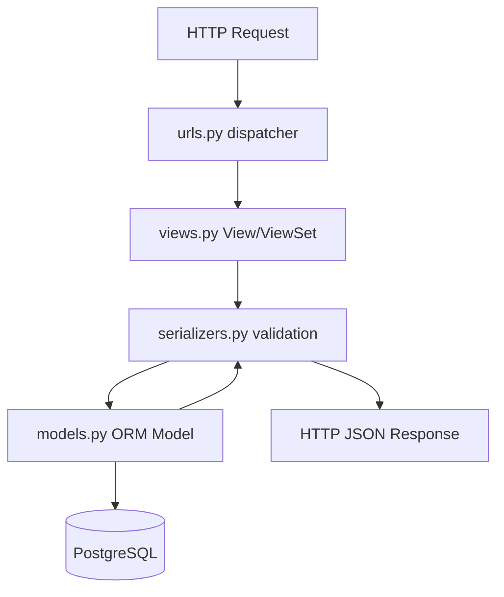

# Django & DRF APIs

Django is a high-level Python web framework that encourages rapid development and clean, pragmatic design. When paired with the **Django REST Framework (DRF)**, it becomes a powerful platform for building REST APIs.

---

## 1. Django REST Framework Architecture

DRF layers serialization and view controllers over Django's standard ORM and URL routing systems.



---

## 2. API Code Implementation

Below is a complete implementation representing the database models, validators/serializers, and views for a generic Item API.

```python
# models.py (Database Model Schema)
from django.db import models

class Item(models.Model):
    name = models.CharField(max_length=255)
    description = models.TextField(blank=True, null=True)

    def __str__(self):
        return self.name

# serializers.py (Validation & Serialization)
from rest_framework import serializers
from .models import Item

class ItemSerializer(serializers.ModelSerializer):
    class Meta:
        model = Item
        fields = ['id', 'name', 'description']

# views.py (Controller / API Endpoint Handler)
from rest_framework.views import APIView
from rest_framework.response import Response
from rest_framework import status
from .models import Item
from .serializers import ItemSerializer

class ItemListAPI(APIView):
    def get(self, request):
        items = Item.objects.all()
        serializer = ItemSerializer(items, many=True)
        return Response(serializer.data, status=status.HTTP_200_OK)

    def post(self, request):
        serializer = ItemSerializer(data=request.data)
        if serializer.is_valid():
            serializer.save()
            return Response(serializer.data, status=status.HTTP_201_CREATED)
        return Response(serializer.errors, status=status.HTTP_400_BAD_REQUEST)

# urls.py (Routing Config)
from django.urls import path
from .views import ItemListAPI

urlpatterns = [
    path('api/items/', ItemListAPI.as_view(), name='item-list-api'),
]
```

---

## 3. Key Concepts to Master
1. **Django ORM**: Django's built-in Object-Relational Mapper handles migrations, transactions, and relationships without writing raw SQL.
2. **Serializers**: Serializers handle bidirectionally: they serialize model records into JSON structures, and validate/deserialize client JSON payloads into python objects.
3. **ViewSets & Routers**: For standard CRUD endpoints, DRF allows you to write a single `ModelViewSet` and register it with a `DefaultRouter` to automatically generate all endpoints (`GET`, `POST`, `PUT`, `DELETE`).
