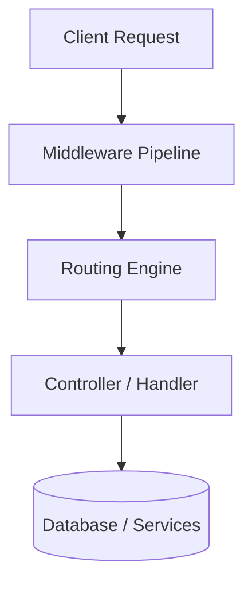
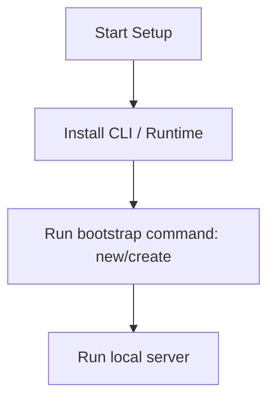

# Django Master Engineering Guide

A comprehensive, production-level, industry-grade guide to Django for software engineers, backend developers, frontend developers, full-stack developers, DevOps, and architects. Django is a high-level Python web framework that encourages rapid development and clean, pragmatic design.

---

<ProgressTracker currentSection=1 totalSections=34 />

## 1. Introduction

### 1.1 Overview & Concepts
Detailed explanation of Introduction in Django. Built using Python, Django provides rich abstractions for modern web or mobile workflows.

Configure security headers, rate limiting, and follow proper coding guidelines to build production-grade applications with Django.

### 1.2 Operations & Verification
Production and verification best practices for Introduction in Django.

```bash
# Create a new application inside the project
python manage.py startapp myapp
```

---

<ProgressTracker currentSection=2 totalSections=34 />

## 2. Why Use This Framework?

### 2.1 Overview & Concepts
Detailed explanation of Why Use This Framework? in Django. Built using Python, Django provides rich abstractions for modern web or mobile workflows.

Configure security headers, rate limiting, and follow proper coding guidelines to build production-grade applications with Django.

### 2.2 Operations & Verification
Production and verification best practices for Why Use This Framework? in Django.

```bash
# Start the Django shell for debugging
python manage.py shell
```

---

<ProgressTracker currentSection=3 totalSections=34 />

## 3. Architecture

### 3.1 Overview & Concepts
Detailed explanation of Architecture in Django. Built using Python, Django provides rich abstractions for modern web or mobile workflows.



### 3.2 Operations & Verification
Production and verification best practices for Architecture in Django.

```bash
# Run the test suite
python manage.py test
```

---

<ProgressTracker currentSection=4 totalSections=34 />

## 4. Installation

### 4.1 Overview & Concepts
Detailed explanation of Installation in Django. Built using Python, Django provides rich abstractions for modern web or mobile workflows.

#### Official Resources & Installation Flow
- **Download Link**: [Official Django Homepage](https://django.dev) or [Package Registry](https://npmjs.com)



### 4.2 Project Scaffolding & Setup
Run the following CLI command to install Django and scaffold a new project:
```bash
# Install Django and create a new Django project
pip install django django-filter djangorestframework
django-admin startproject mydjangoapp
cd mydjangoapp
```

---

<ProgressTracker currentSection=5 totalSections=34 />

## 5. Project Structure

### 5.1 Overview & Concepts
Detailed explanation of Project Structure in Django. Built using Python, Django provides rich abstractions for modern web or mobile workflows.

```text
src/
├── controllers/
├── models/
├── routes/
├── services/
└── app.js
```

### 5.2 Operations & Verification
Production and verification best practices for Project Structure in Django.

```bash
# Collect static files for production deployment
python manage.py collectstatic --noinput
```

---

<ProgressTracker currentSection=6 totalSections=34 />

## 6. Getting Started

### 6.1 Overview & Concepts
Detailed explanation of Getting Started in Django. Built using Python, Django provides rich abstractions for modern web or mobile workflows.

Here is a simple starting snippet:

<Tabs>
  <Tab label="Syntax & Example">

```python
# First Django app
print('Hello from Django')
```

  </Tab>
  <Tab label="Interactive Playground">
    <InteractiveExample 
      language="python"
      initialCode="# First Django app\nprint('Hello from Django')" 
      instruction="Execute and edit this PYTHON example."
    />
  </Tab>
</Tabs>

### 6.2 Running the Application
Run the following command to start the local Django development server:
```bash
# Start the Django development server
python manage.py runserver
```

---

<ProgressTracker currentSection=7 totalSections=34 />

## 7. Core Concepts

### 7.1 Overview & Concepts
Detailed explanation of Core Concepts in Django. Built using Python, Django provides rich abstractions for modern web or mobile workflows.

Configure security headers, rate limiting, and follow proper coding guidelines to build production-grade applications with Django.

### 7.2 Operations & Verification
Production and verification best practices for Core Concepts in Django.

```bash
# Create a superuser account for the admin panel
python manage.py createsuperuser
```

---

<ProgressTracker currentSection=8 totalSections=34 />

## 8. Routing

### 8.1 Overview & Concepts
Detailed explanation of Routing in Django. Built using Python, Django provides rich abstractions for modern web or mobile workflows.

Configure security headers, rate limiting, and follow proper coding guidelines to build production-grade applications with Django.

### 8.2 Operations & Verification
Production and verification best practices for Routing in Django.

```bash
# Check the project settings and configuration
python manage.py check
```

---

<ProgressTracker currentSection=9 totalSections=34 />

## 9. Middleware

### 9.1 Overview & Concepts
Detailed explanation of Middleware in Django. Built using Python, Django provides rich abstractions for modern web or mobile workflows.

Configure security headers, rate limiting, and follow proper coding guidelines to build production-grade applications with Django.

### 9.2 Operations & Verification
Production and verification best practices for Middleware in Django.

```bash
# Show current applied and unapplied migrations
python manage.py showmigrations
```

---

<ProgressTracker currentSection=10 totalSections=34 />

## 10. Request & Response Lifecycle

### 10.1 Overview & Concepts
Detailed explanation of Request & Response Lifecycle in Django. Built using Python, Django provides rich abstractions for modern web or mobile workflows.

Configure security headers, rate limiting, and follow proper coding guidelines to build production-grade applications with Django.

### 10.2 Operations & Verification
Production and verification best practices for Request & Response Lifecycle in Django.

```bash
# Check for security vulnerabilities in project configuration
python manage.py check --deploy
```

---

<ProgressTracker currentSection=11 totalSections=34 />

## 11. Dependency Injection (if supported)

### 11.1 Overview & Concepts
Detailed explanation of Dependency Injection (if supported) in Django. Built using Python, Django provides rich abstractions for modern web or mobile workflows.

Configure security headers, rate limiting, and follow proper coding guidelines to build production-grade applications with Django.

### 11.2 Operations & Verification
Production and verification best practices for Dependency Injection (if supported) in Django.

```bash
# Create a new application inside the project
python manage.py startapp myapp
```

---

<ProgressTracker currentSection=12 totalSections=34 />

## 12. Configuration

### 12.1 Overview & Concepts
Detailed explanation of Configuration in Django. Built using Python, Django provides rich abstractions for modern web or mobile workflows.

Configure security headers, rate limiting, and follow proper coding guidelines to build production-grade applications with Django.

### 12.2 Operations & Verification
Production and verification best practices for Configuration in Django.

```bash
# Start the Django shell for debugging
python manage.py shell
```

---

<ProgressTracker currentSection=13 totalSections=34 />

## 13. Database Integration

### 13.1 Overview & Concepts
Detailed explanation of Database Integration in Django. Built using Python, Django provides rich abstractions for modern web or mobile workflows.

Configure security headers, rate limiting, and follow proper coding guidelines to build production-grade applications with Django.

### 13.2 Operations & Verification
Production and verification best practices for Database Integration in Django.

```bash
# Run the test suite
python manage.py test
```

---

<ProgressTracker currentSection=14 totalSections=34 />

## 14. Authentication

### 14.1 Overview & Concepts
Detailed explanation of Authentication in Django. Built using Python, Django provides rich abstractions for modern web or mobile workflows.

Configure security headers, rate limiting, and follow proper coding guidelines to build production-grade applications with Django.

### 14.2 Operations & Verification
Production and verification best practices for Authentication in Django.

```bash
# Collect static files for production deployment
python manage.py collectstatic --noinput
```

---

<ProgressTracker currentSection=15 totalSections=34 />

## 15. Authorization

### 15.1 Overview & Concepts
Detailed explanation of Authorization in Django. Built using Python, Django provides rich abstractions for modern web or mobile workflows.

Configure security headers, rate limiting, and follow proper coding guidelines to build production-grade applications with Django.

### 15.2 Operations & Verification
Production and verification best practices for Authorization in Django.

```bash
# Create a superuser account for the admin panel
python manage.py createsuperuser
```

---

<ProgressTracker currentSection=16 totalSections=34 />

## 16. Validation

### 16.1 Overview & Concepts
Detailed explanation of Validation in Django. Built using Python, Django provides rich abstractions for modern web or mobile workflows.

Configure security headers, rate limiting, and follow proper coding guidelines to build production-grade applications with Django.

### 16.2 Operations & Verification
Production and verification best practices for Validation in Django.

```bash
# Check the project settings and configuration
python manage.py check
```

---

<ProgressTracker currentSection=17 totalSections=34 />

## 17. Error Handling

### 17.1 Overview & Concepts
Detailed explanation of Error Handling in Django. Built using Python, Django provides rich abstractions for modern web or mobile workflows.

Configure security headers, rate limiting, and follow proper coding guidelines to build production-grade applications with Django.

### 17.2 Operations & Verification
Production and verification best practices for Error Handling in Django.

```bash
# Show current applied and unapplied migrations
python manage.py showmigrations
```

---

<ProgressTracker currentSection=18 totalSections=34 />

## 18. Caching

### 18.1 Overview & Concepts
Detailed explanation of Caching in Django. Built using Python, Django provides rich abstractions for modern web or mobile workflows.

Configure security headers, rate limiting, and follow proper coding guidelines to build production-grade applications with Django.

### 18.2 Operations & Verification
Production and verification best practices for Caching in Django.

```bash
# Check for security vulnerabilities in project configuration
python manage.py check --deploy
```

---

<ProgressTracker currentSection=19 totalSections=34 />

## 19. Security

### 19.1 Overview & Concepts
Detailed explanation of Security in Django. Built using Python, Django provides rich abstractions for modern web or mobile workflows.

Configure security headers, rate limiting, and follow proper coding guidelines to build production-grade applications with Django.

### 19.2 Operations & Verification
Production and verification best practices for Security in Django.

```bash
# Create a new application inside the project
python manage.py startapp myapp
```

---

<ProgressTracker currentSection=20 totalSections=34 />

## 20. Performance Optimization

### 20.1 Overview & Concepts
Detailed explanation of Performance Optimization in Django. Built using Python, Django provides rich abstractions for modern web or mobile workflows.

Configure security headers, rate limiting, and follow proper coding guidelines to build production-grade applications with Django.

### 20.2 Operations & Verification
Production and verification best practices for Performance Optimization in Django.

```bash
# Start the Django shell for debugging
python manage.py shell
```

---

<ProgressTracker currentSection=21 totalSections=34 />

## 21. Testing

### 21.1 Overview & Concepts
Detailed explanation of Testing in Django. Built using Python, Django provides rich abstractions for modern web or mobile workflows.

Configure security headers, rate limiting, and follow proper coding guidelines to build production-grade applications with Django.

### 21.2 Operations & Verification
Production and verification best practices for Testing in Django.

```bash
# Run the test suite
python manage.py test
```

---

<ProgressTracker currentSection=22 totalSections=34 />

## 22. Deployment

### 22.1 Overview & Concepts
Detailed explanation of Deployment in Django. Built using Python, Django provides rich abstractions for modern web or mobile workflows.

Configure security headers, rate limiting, and follow proper coding guidelines to build production-grade applications with Django.

### 22.2 Operations & Verification
Production and verification best practices for Deployment in Django.

```bash
# Collect static files for production deployment
python manage.py collectstatic --noinput
```

---

<ProgressTracker currentSection=23 totalSections=34 />

## 23. Monitoring

### 23.1 Overview & Concepts
Detailed explanation of Monitoring in Django. Built using Python, Django provides rich abstractions for modern web or mobile workflows.

Configure security headers, rate limiting, and follow proper coding guidelines to build production-grade applications with Django.

### 23.2 Operations & Verification
Production and verification best practices for Monitoring in Django.

```bash
# Create a superuser account for the admin panel
python manage.py createsuperuser
```

---

<ProgressTracker currentSection=24 totalSections=34 />

## 24. Microservices

### 24.1 Overview & Concepts
Detailed explanation of Microservices in Django. Built using Python, Django provides rich abstractions for modern web or mobile workflows.

Configure security headers, rate limiting, and follow proper coding guidelines to build production-grade applications with Django.

### 24.2 Operations & Verification
Production and verification best practices for Microservices in Django.

```bash
# Check the project settings and configuration
python manage.py check
```

---

<ProgressTracker currentSection=25 totalSections=34 />

## 25. AI Integration

### 25.1 Overview & Concepts
Detailed explanation of AI Integration in Django. Built using Python, Django provides rich abstractions for modern web or mobile workflows.

Integrating OpenAI or Bedrock in Django is straightforward using direct client SDKs:

<Tabs>
  <Tab label="Syntax & Example">

```python
import openai
client = openai.OpenAI()
response = client.chat.completions.create(model='gpt-4', messages=[{'role': 'user', 'content': 'Hello'}])
print(response.choices[0].message.content)
```

  </Tab>
  <Tab label="Interactive Playground">
    <InteractiveExample 
      language="python"
      initialCode="import openai\nclient = openai.OpenAI()\nresponse = client.chat.completions.create(model='gpt-4', messages=[{'role': 'user', 'content': 'Hello'}])\nprint(response.choices[0].message.content)" 
      instruction="Execute and edit this PYTHON example."
    />
  </Tab>
</Tabs>

### 25.2 Operations & Verification
Production and verification best practices for AI Integration in Django.

```bash
# Show current applied and unapplied migrations
python manage.py showmigrations
```

---

<ProgressTracker currentSection=26 totalSections=34 />

## 26. Production Architecture

### 26.1 Overview & Concepts
Detailed explanation of Production Architecture in Django. Built using Python, Django provides rich abstractions for modern web or mobile workflows.

Configure security headers, rate limiting, and follow proper coding guidelines to build production-grade applications with Django.

### 26.2 Operations & Verification
Production and verification best practices for Production Architecture in Django.

```bash
# Check for security vulnerabilities in project configuration
python manage.py check --deploy
```

---

<ProgressTracker currentSection=27 totalSections=34 />

## 27. Best Practices

### 27.1 Overview & Concepts
Detailed explanation of Best Practices in Django. Built using Python, Django provides rich abstractions for modern web or mobile workflows.

Configure security headers, rate limiting, and follow proper coding guidelines to build production-grade applications with Django.

### 27.2 Operations & Verification
Production and verification best practices for Best Practices in Django.

```bash
# Create a new application inside the project
python manage.py startapp myapp
```

---

<ProgressTracker currentSection=28 totalSections=34 />

## 28. Common Errors

### 28.1 Overview & Concepts
Detailed explanation of Common Errors in Django. Built using Python, Django provides rich abstractions for modern web or mobile workflows.

Configure security headers, rate limiting, and follow proper coding guidelines to build production-grade applications with Django.

### 28.2 Operations & Verification
Production and verification best practices for Common Errors in Django.

```bash
# Start the Django shell for debugging
python manage.py shell
```

---

<ProgressTracker currentSection=29 totalSections=34 />

## 29. Interview Questions

### 29.1 Overview & Concepts
Detailed explanation of Interview Questions in Django. Built using Python, Django provides rich abstractions for modern web or mobile workflows.

Configure security headers, rate limiting, and follow proper coding guidelines to build production-grade applications with Django.

### 29.2 Operations & Verification
Production and verification best practices for Interview Questions in Django.

```bash
# Run the test suite
python manage.py test
```

---

<ProgressTracker currentSection=30 totalSections=34 />

## 30. Cheat Sheet

### 30.1 Overview & Concepts
Detailed explanation of Cheat Sheet in Django. Built using Python, Django provides rich abstractions for modern web or mobile workflows.

Configure security headers, rate limiting, and follow proper coding guidelines to build production-grade applications with Django.

### 30.2 Operations & Verification
Production and verification best practices for Cheat Sheet in Django.

```bash
# Collect static files for production deployment
python manage.py collectstatic --noinput
```

---

<ProgressTracker currentSection=31 totalSections=34 />

## 31. Hands-on Projects

### 31.1 Overview & Concepts
Detailed explanation of Hands-on Projects in Django. Built using Python, Django provides rich abstractions for modern web or mobile workflows.

Configure security headers, rate limiting, and follow proper coding guidelines to build production-grade applications with Django.

### 31.2 Operations & Verification
Production and verification best practices for Hands-on Projects in Django.

```bash
# Create a superuser account for the admin panel
python manage.py createsuperuser
```

---

<ProgressTracker currentSection=32 totalSections=34 />

## 32. Learning Roadmap

### 32.1 Overview & Concepts
Detailed explanation of Learning Roadmap in Django. Built using Python, Django provides rich abstractions for modern web or mobile workflows.

Configure security headers, rate limiting, and follow proper coding guidelines to build production-grade applications with Django.

### 32.2 Operations & Verification
Production and verification best practices for Learning Roadmap in Django.

```bash
# Check the project settings and configuration
python manage.py check
```

---

<ProgressTracker currentSection=33 totalSections=34 />

## 33. Final Summary

### 33.1 Overview & Concepts
Detailed explanation of Final Summary in Django. Built using Python, Django provides rich abstractions for modern web or mobile workflows.

Configure security headers, rate limiting, and follow proper coding guidelines to build production-grade applications with Django.

### 33.2 Operations & Verification
Production and verification best practices for Final Summary in Django.

```bash
# Show current applied and unapplied migrations
python manage.py showmigrations
```

---

<ProgressTracker currentSection=34 totalSections=34 />

## 34. Project Creation & Execution Commands

### Scaffolding a New Project
```bash
# Install Django and its dependencies
pip install django djangorestframework

# Scaffold a new Django project
django-admin startproject myproject
cd myproject
```

### Running the Application
```bash
# Start the local Django development server
python manage.py runserver
```

### Common Operations
```bash
# Generate SQL migrations based on model changes
python manage.py makemigrations

# Apply migrations to database
python manage.py migrate
```

---

### Knowledge Verification Check

<Quiz 
  question="What makes Go's goroutines much lighter than standard operating system threads?" 
  options=["Goroutines do not consume any RAM.", "Goroutines run inside the browser environment.", "Goroutines start with a very small stack (about 2KB) that grows and shrinks dynamically, and are multiplexed onto OS threads.", "Goroutines run only when the system is idle."] 
  answerIndex=2 
  explanation="Unlike OS threads which have large, fixed-size stacks (typically 1MB-2MB), goroutines start with 2KB stacks managed dynamically by the Go runtime scheduler." 
/>

<Quiz 
  question="How do goroutines communicate and synchronize data in Go?" 
  options=["Through global variables protected by thread locks.", "By using Channels to pass data and signal execution state.", "Using native operating system thread interrupts.", "Through shared database connections."] 
  answerIndex=1 
  explanation="Go uses channels as concurrency primitives to allow goroutines to pass typed data and safely synchronize without manual lock primitives." 
/>

<Quiz 
  question="What is the purpose of a pointer receiver (*StructName) in a Go method definition?" 
  options=["It automatically compiles the method as a static C binary.", "It allows the method to mutate the receiver's fields directly and avoids copying the struct's data on invocation.", "It renders the struct read-only.", "It registers the method with a garbage collection worker."] 
  answerIndex=1 
  explanation="A pointer receiver passes the memory address of the struct instance, enabling direct field modification and optimizing performance by avoiding struct copying." 
/>

<Quiz 
  question="What is the difference between an array and a slice in Go?" 
  options=["Arrays are dynamically sized, while slices have a fixed length.", "Arrays have a fixed size defined at compilation, while slices are dynamic windows pointing to an underlying array.", "Arrays are always passed by reference, while slices are passed by value.", "There is no difference; they are synonyms."] 
  answerIndex=1 
  explanation="Go arrays have a fixed size that is part of their type. Slices are flexible, dynamic wrappers containing a pointer to an underlying array, a length, and a capacity." 
/>

<Quiz 
  question="What is Go's standard approach for handling errors?" 
  options=["Using try-catch blocks to capture runtime exceptions.", "Returning an error interface as the last return value from functions, which the caller must check explicitly.", "Throwing fatal panics that terminate the program immediately.", "Writing errors automatically to a system syslog file."] 
  answerIndex=1 
  explanation="Go does not have standard try/catch blocks. Instead, functions return multiple values, including an error value, which callers inspect using `if err != nil`." 
/>

<Quiz 
  question="How does a class or struct implement an interface in Go?" 
  options=["By using the `implements` keyword in the declaration.", "Implicitly, by defining all methods declared in the interface (no explicit declaration needed).", "By inheriting from an interface helper base class.", "By wrapping the struct inside a package interface container."] 
  answerIndex=1 
  explanation="Go interfaces are implemented implicitly. A struct implements an interface simply by defining methods with matching signatures, enabling clean decoupling." 
/>

<Quiz 
  question="Which scheduling model does Go's runtime scheduler use to multiplex goroutines onto OS threads?" 
  options=["The M:N scheduler model (M goroutines onto N OS threads).", "A round-robin scheduling algorithm directly managed by the CPU.", "A single-threaded loop similar to Javascript.", "A multi-process fork scheduling model."] 
  answerIndex=0 
  explanation="The Go scheduler uses an M:N model (represented by G for goroutines, M for machine threads, and P for logical processors) to run millions of goroutines on a small pool of CPU threads." 
/>

<Quiz 
  question="When does a Go `defer` statement execute its associated function call?" 
  options=["Immediately when the defer line is parsed.", "In a separate background thread.", "When the surrounding function finishes and returns.", "Only if the program panics."] 
  answerIndex=2 
  explanation="A `defer` statement pushes a function call onto a stack. The deferred calls are executed in Last-In-First-Out (LIFO) order right before the surrounding function returns." 
/>

<Quiz 
  question="How are struct fields mapped to JSON properties during marshaling in Go?" 
  options=["By naming fields exactly the same as the JSON keys (case-insensitive).", "Using struct tags defined after field declarations, e.g. `json:\"fieldName\"`.", "By registering the struct inside an XML schema registry.", "Go automatically maps fields dynamically using reflection (no custom tags)."] 
  answerIndex=1 
  explanation="Go uses struct tags containing metadata (e.g. `json:\"id\"`) which the `encoding/json` package parses via reflection to serialize/deserialize fields." 
/>

<Quiz 
  question="How is package-level visibility (public/private) determined in Go?" 
  options=["By using the public or private keyword before declarations.", "Through directory path names.", "By capitalization: identifiers starting with an uppercase letter are public (exported), others are private.", "By declaring them in an external `package.json` configurations file."] 
  answerIndex=2 
  explanation="Go relies on capitalization for visibility. An identifier starting with an uppercase letter is exported (public) and visible outside its package; lowercase is unexported." 
/>

<Quiz 
  question="What is cap(slice) in Go?" 
  options=["The number of elements currently stored in the slice.", "The maximum length a slice can grow to before raising an exception.", "The capacity: the number of elements in the underlying array, starting from the first element of the slice.", "The memory size of the slice in bytes."] 
  answerIndex=2 
  explanation="The capacity of a slice represents the size of the underlying array allocation from the start of the slice. It is accessed via `cap(s)`, while `len(s)` returns the current item count." 
/>

<Quiz 
  question="What is the purpose of the `select` statement in Go?" 
  options=["To choose database rows from a table.", "To block execution until one of multiple channel operations (sends or receives) is ready to run.", "To implement standard switch cases for string values.", "To pick variables from system arrays."] 
  answerIndex=1 
  explanation="The `select` statement lets a goroutine wait on multiple channel communication operations. It blocks until one of its cases is ready to execute, then runs that case." 
/>
