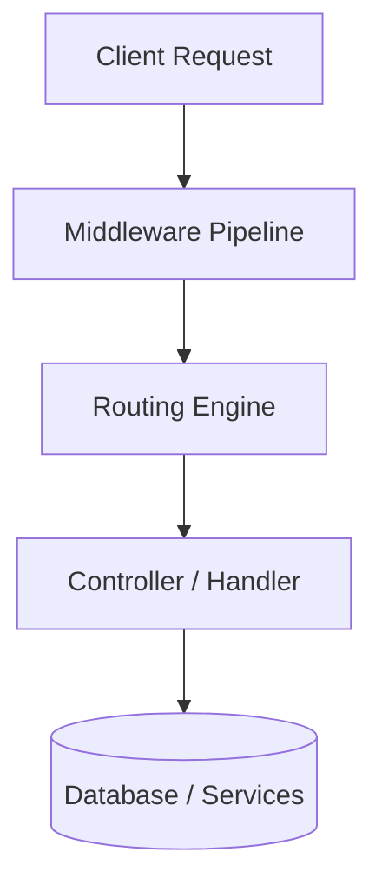
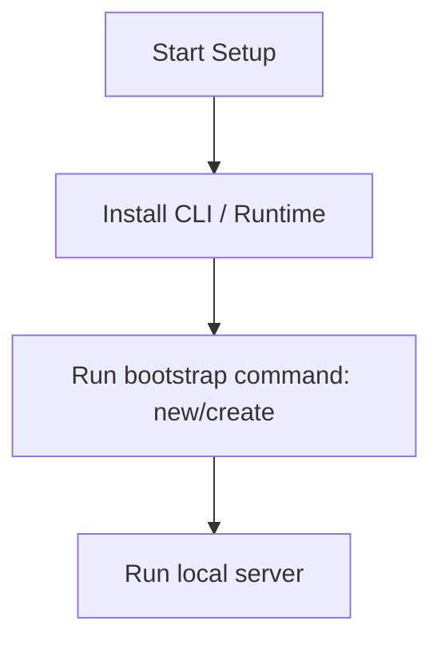

# Django Master Engineering Guide

A comprehensive, production-level, industry-grade guide to Django for software engineers, backend developers, frontend developers, full-stack developers, DevOps, and architects. Django is a high-level Python web framework that encourages rapid development and clean, pragmatic design.

---

## 1. Introduction

### 1.1 Overview & Concepts
Detailed explanation of Introduction in Django. Built using Python, Django provides rich abstractions for modern web or mobile workflows.

Configure security headers, rate limiting, and follow proper coding guidelines to build production-grade applications with Django.

### 1.2 Operations & Verification
Production and verification best practices for Introduction in Django.

> [!NOTE]
> Always refer to the official Django configuration guide for the latest security guidelines.

---

## 2. Why Use This Framework?

### 2.1 Overview & Concepts
Detailed explanation of Why Use This Framework? in Django. Built using Python, Django provides rich abstractions for modern web or mobile workflows.

Configure security headers, rate limiting, and follow proper coding guidelines to build production-grade applications with Django.

### 2.2 Operations & Verification
Production and verification best practices for Why Use This Framework? in Django.

> [!NOTE]
> Always refer to the official Django configuration guide for the latest security guidelines.

---

## 3. Architecture

### 3.1 Overview & Concepts
Detailed explanation of Architecture in Django. Built using Python, Django provides rich abstractions for modern web or mobile workflows.



### 3.2 Operations & Verification
Production and verification best practices for Architecture in Django.

> [!NOTE]
> Always refer to the official Django configuration guide for the latest security guidelines.

---

## 4. Installation

### 4.1 Overview & Concepts
Detailed explanation of Installation in Django. Built using Python, Django provides rich abstractions for modern web or mobile workflows.

#### Official Resources & Installation Flow
- **Download Link**: [Official Django Homepage](https://django.dev) or [Package Registry](https://npmjs.com)



### 4.2 Operations & Verification
Production and verification best practices for Installation in Django.

> [!NOTE]
> Always refer to the official Django configuration guide for the latest security guidelines.

---

## 5. Project Structure

### 5.1 Overview & Concepts
Detailed explanation of Project Structure in Django. Built using Python, Django provides rich abstractions for modern web or mobile workflows.

```text
src/
├── controllers/
├── models/
├── routes/
├── services/
└── app.js
```

### 5.2 Operations & Verification
Production and verification best practices for Project Structure in Django.

> [!NOTE]
> Always refer to the official Django configuration guide for the latest security guidelines.

---

## 6. Getting Started

### 6.1 Overview & Concepts
Detailed explanation of Getting Started in Django. Built using Python, Django provides rich abstractions for modern web or mobile workflows.

Here is a simple starting snippet:

```python
# First Django app
print('Hello from Django')
```

### 6.2 Operations & Verification
Production and verification best practices for Getting Started in Django.

> [!NOTE]
> Always refer to the official Django configuration guide for the latest security guidelines.

---

## 7. Core Concepts

### 7.1 Overview & Concepts
Detailed explanation of Core Concepts in Django. Built using Python, Django provides rich abstractions for modern web or mobile workflows.

Configure security headers, rate limiting, and follow proper coding guidelines to build production-grade applications with Django.

### 7.2 Operations & Verification
Production and verification best practices for Core Concepts in Django.

> [!NOTE]
> Always refer to the official Django configuration guide for the latest security guidelines.

---

## 8. Routing

### 8.1 Overview & Concepts
Detailed explanation of Routing in Django. Built using Python, Django provides rich abstractions for modern web or mobile workflows.

Configure security headers, rate limiting, and follow proper coding guidelines to build production-grade applications with Django.

### 8.2 Operations & Verification
Production and verification best practices for Routing in Django.

> [!NOTE]
> Always refer to the official Django configuration guide for the latest security guidelines.

---

## 9. Middleware

### 9.1 Overview & Concepts
Detailed explanation of Middleware in Django. Built using Python, Django provides rich abstractions for modern web or mobile workflows.

Configure security headers, rate limiting, and follow proper coding guidelines to build production-grade applications with Django.

### 9.2 Operations & Verification
Production and verification best practices for Middleware in Django.

> [!NOTE]
> Always refer to the official Django configuration guide for the latest security guidelines.

---

## 10. Request & Response Lifecycle

### 10.1 Overview & Concepts
Detailed explanation of Request & Response Lifecycle in Django. Built using Python, Django provides rich abstractions for modern web or mobile workflows.

Configure security headers, rate limiting, and follow proper coding guidelines to build production-grade applications with Django.

### 10.2 Operations & Verification
Production and verification best practices for Request & Response Lifecycle in Django.

> [!NOTE]
> Always refer to the official Django configuration guide for the latest security guidelines.

---

## 11. Dependency Injection (if supported)

### 11.1 Overview & Concepts
Detailed explanation of Dependency Injection (if supported) in Django. Built using Python, Django provides rich abstractions for modern web or mobile workflows.

Configure security headers, rate limiting, and follow proper coding guidelines to build production-grade applications with Django.

### 11.2 Operations & Verification
Production and verification best practices for Dependency Injection (if supported) in Django.

> [!NOTE]
> Always refer to the official Django configuration guide for the latest security guidelines.

---

## 12. Configuration

### 12.1 Overview & Concepts
Detailed explanation of Configuration in Django. Built using Python, Django provides rich abstractions for modern web or mobile workflows.

Configure security headers, rate limiting, and follow proper coding guidelines to build production-grade applications with Django.

### 12.2 Operations & Verification
Production and verification best practices for Configuration in Django.

> [!NOTE]
> Always refer to the official Django configuration guide for the latest security guidelines.

---

## 13. Database Integration

### 13.1 Overview & Concepts
Detailed explanation of Database Integration in Django. Built using Python, Django provides rich abstractions for modern web or mobile workflows.

Configure security headers, rate limiting, and follow proper coding guidelines to build production-grade applications with Django.

### 13.2 Operations & Verification
Production and verification best practices for Database Integration in Django.

> [!NOTE]
> Always refer to the official Django configuration guide for the latest security guidelines.

---

## 14. Authentication

### 14.1 Overview & Concepts
Detailed explanation of Authentication in Django. Built using Python, Django provides rich abstractions for modern web or mobile workflows.

Configure security headers, rate limiting, and follow proper coding guidelines to build production-grade applications with Django.

### 14.2 Operations & Verification
Production and verification best practices for Authentication in Django.

> [!NOTE]
> Always refer to the official Django configuration guide for the latest security guidelines.

---

## 15. Authorization

### 15.1 Overview & Concepts
Detailed explanation of Authorization in Django. Built using Python, Django provides rich abstractions for modern web or mobile workflows.

Configure security headers, rate limiting, and follow proper coding guidelines to build production-grade applications with Django.

### 15.2 Operations & Verification
Production and verification best practices for Authorization in Django.

> [!NOTE]
> Always refer to the official Django configuration guide for the latest security guidelines.

---

## 16. Validation

### 16.1 Overview & Concepts
Detailed explanation of Validation in Django. Built using Python, Django provides rich abstractions for modern web or mobile workflows.

Configure security headers, rate limiting, and follow proper coding guidelines to build production-grade applications with Django.

### 16.2 Operations & Verification
Production and verification best practices for Validation in Django.

> [!NOTE]
> Always refer to the official Django configuration guide for the latest security guidelines.

---

## 17. Error Handling

### 17.1 Overview & Concepts
Detailed explanation of Error Handling in Django. Built using Python, Django provides rich abstractions for modern web or mobile workflows.

Configure security headers, rate limiting, and follow proper coding guidelines to build production-grade applications with Django.

### 17.2 Operations & Verification
Production and verification best practices for Error Handling in Django.

> [!NOTE]
> Always refer to the official Django configuration guide for the latest security guidelines.

---

## 18. Caching

### 18.1 Overview & Concepts
Detailed explanation of Caching in Django. Built using Python, Django provides rich abstractions for modern web or mobile workflows.

Configure security headers, rate limiting, and follow proper coding guidelines to build production-grade applications with Django.

### 18.2 Operations & Verification
Production and verification best practices for Caching in Django.

> [!NOTE]
> Always refer to the official Django configuration guide for the latest security guidelines.

---

## 19. Security

### 19.1 Overview & Concepts
Detailed explanation of Security in Django. Built using Python, Django provides rich abstractions for modern web or mobile workflows.

Configure security headers, rate limiting, and follow proper coding guidelines to build production-grade applications with Django.

### 19.2 Operations & Verification
Production and verification best practices for Security in Django.

> [!NOTE]
> Always refer to the official Django configuration guide for the latest security guidelines.

---

## 20. Performance Optimization

### 20.1 Overview & Concepts
Detailed explanation of Performance Optimization in Django. Built using Python, Django provides rich abstractions for modern web or mobile workflows.

Configure security headers, rate limiting, and follow proper coding guidelines to build production-grade applications with Django.

### 20.2 Operations & Verification
Production and verification best practices for Performance Optimization in Django.

> [!NOTE]
> Always refer to the official Django configuration guide for the latest security guidelines.

---

## 21. Testing

### 21.1 Overview & Concepts
Detailed explanation of Testing in Django. Built using Python, Django provides rich abstractions for modern web or mobile workflows.

Configure security headers, rate limiting, and follow proper coding guidelines to build production-grade applications with Django.

### 21.2 Operations & Verification
Production and verification best practices for Testing in Django.

> [!NOTE]
> Always refer to the official Django configuration guide for the latest security guidelines.

---

## 22. Deployment

### 22.1 Overview & Concepts
Detailed explanation of Deployment in Django. Built using Python, Django provides rich abstractions for modern web or mobile workflows.

Configure security headers, rate limiting, and follow proper coding guidelines to build production-grade applications with Django.

### 22.2 Operations & Verification
Production and verification best practices for Deployment in Django.

> [!NOTE]
> Always refer to the official Django configuration guide for the latest security guidelines.

---

## 23. Monitoring

### 23.1 Overview & Concepts
Detailed explanation of Monitoring in Django. Built using Python, Django provides rich abstractions for modern web or mobile workflows.

Configure security headers, rate limiting, and follow proper coding guidelines to build production-grade applications with Django.

### 23.2 Operations & Verification
Production and verification best practices for Monitoring in Django.

> [!NOTE]
> Always refer to the official Django configuration guide for the latest security guidelines.

---

## 24. Microservices

### 24.1 Overview & Concepts
Detailed explanation of Microservices in Django. Built using Python, Django provides rich abstractions for modern web or mobile workflows.

Configure security headers, rate limiting, and follow proper coding guidelines to build production-grade applications with Django.

### 24.2 Operations & Verification
Production and verification best practices for Microservices in Django.

> [!NOTE]
> Always refer to the official Django configuration guide for the latest security guidelines.

---

## 25. AI Integration

### 25.1 Overview & Concepts
Detailed explanation of AI Integration in Django. Built using Python, Django provides rich abstractions for modern web or mobile workflows.

Integrating OpenAI or Bedrock in Django is straightforward using direct client SDKs:

```python
import openai
client = openai.OpenAI()
response = client.chat.completions.create(model='gpt-4', messages=[{'role': 'user', 'content': 'Hello'}])
print(response.choices[0].message.content)
```

### 25.2 Operations & Verification
Production and verification best practices for AI Integration in Django.

> [!NOTE]
> Always refer to the official Django configuration guide for the latest security guidelines.

---

## 26. Production Architecture

### 26.1 Overview & Concepts
Detailed explanation of Production Architecture in Django. Built using Python, Django provides rich abstractions for modern web or mobile workflows.

Configure security headers, rate limiting, and follow proper coding guidelines to build production-grade applications with Django.

### 26.2 Operations & Verification
Production and verification best practices for Production Architecture in Django.

> [!NOTE]
> Always refer to the official Django configuration guide for the latest security guidelines.

---

## 27. Best Practices

### 27.1 Overview & Concepts
Detailed explanation of Best Practices in Django. Built using Python, Django provides rich abstractions for modern web or mobile workflows.

Configure security headers, rate limiting, and follow proper coding guidelines to build production-grade applications with Django.

### 27.2 Operations & Verification
Production and verification best practices for Best Practices in Django.

> [!NOTE]
> Always refer to the official Django configuration guide for the latest security guidelines.

---

## 28. Common Errors

### 28.1 Overview & Concepts
Detailed explanation of Common Errors in Django. Built using Python, Django provides rich abstractions for modern web or mobile workflows.

Configure security headers, rate limiting, and follow proper coding guidelines to build production-grade applications with Django.

### 28.2 Operations & Verification
Production and verification best practices for Common Errors in Django.

> [!NOTE]
> Always refer to the official Django configuration guide for the latest security guidelines.

---

## 29. Interview Questions

### 29.1 Overview & Concepts
Detailed explanation of Interview Questions in Django. Built using Python, Django provides rich abstractions for modern web or mobile workflows.

Configure security headers, rate limiting, and follow proper coding guidelines to build production-grade applications with Django.

### 29.2 Operations & Verification
Production and verification best practices for Interview Questions in Django.

> [!NOTE]
> Always refer to the official Django configuration guide for the latest security guidelines.

---

## 30. Cheat Sheet

### 30.1 Overview & Concepts
Detailed explanation of Cheat Sheet in Django. Built using Python, Django provides rich abstractions for modern web or mobile workflows.

Configure security headers, rate limiting, and follow proper coding guidelines to build production-grade applications with Django.

### 30.2 Operations & Verification
Production and verification best practices for Cheat Sheet in Django.

> [!NOTE]
> Always refer to the official Django configuration guide for the latest security guidelines.

---

## 31. Hands-on Projects

### 31.1 Overview & Concepts
Detailed explanation of Hands-on Projects in Django. Built using Python, Django provides rich abstractions for modern web or mobile workflows.

Configure security headers, rate limiting, and follow proper coding guidelines to build production-grade applications with Django.

### 31.2 Operations & Verification
Production and verification best practices for Hands-on Projects in Django.

> [!NOTE]
> Always refer to the official Django configuration guide for the latest security guidelines.

---

## 32. Learning Roadmap

### 32.1 Overview & Concepts
Detailed explanation of Learning Roadmap in Django. Built using Python, Django provides rich abstractions for modern web or mobile workflows.

Configure security headers, rate limiting, and follow proper coding guidelines to build production-grade applications with Django.

### 32.2 Operations & Verification
Production and verification best practices for Learning Roadmap in Django.

> [!NOTE]
> Always refer to the official Django configuration guide for the latest security guidelines.

---

## 33. Final Summary

### 33.1 Overview & Concepts
Detailed explanation of Final Summary in Django. Built using Python, Django provides rich abstractions for modern web or mobile workflows.

Configure security headers, rate limiting, and follow proper coding guidelines to build production-grade applications with Django.

### 33.2 Operations & Verification
Production and verification best practices for Final Summary in Django.

> [!NOTE]
> Always refer to the official Django configuration guide for the latest security guidelines.

---

