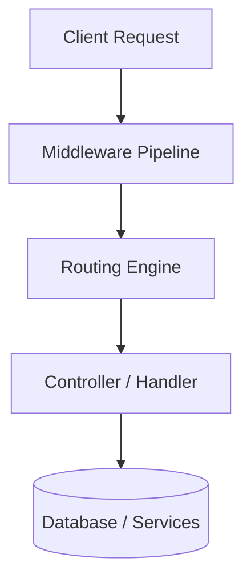
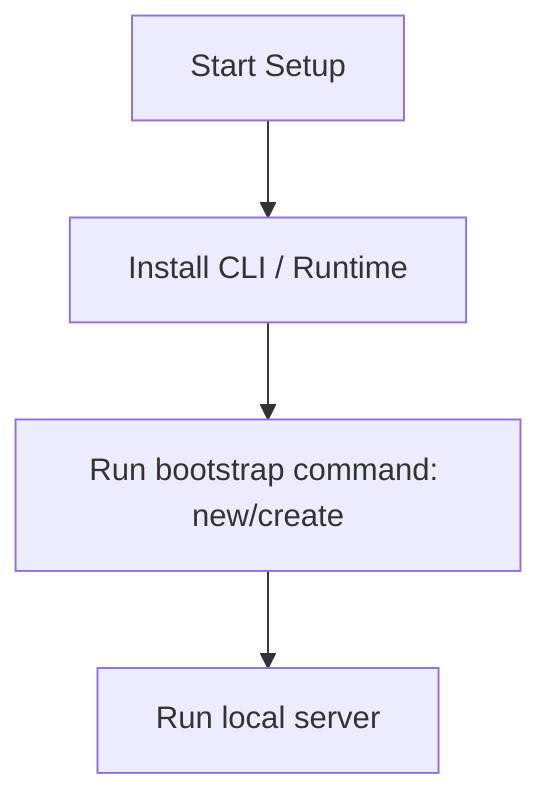

# Django Master Engineering Guide

A comprehensive, production-level, industry-grade guide to Django for software engineers, backend developers, frontend developers, full-stack developers, DevOps, and architects. Django is a high-level Python web framework that encourages rapid development and clean, pragmatic design.

---

## 1. Introduction

### 1.1 Overview & Concepts
Detailed explanation of Introduction in Django. Built using Python, Django provides rich abstractions for modern web or mobile workflows.

Configure security headers, rate limiting, and follow proper coding guidelines to build production-grade applications with Django.

### 1.2 Operations & Verification
Production and verification best practices for Introduction in Django.

```bash
# Create a new application inside the project
python manage.py startapp myapp
```

---

## 2. Why Use This Framework?

### 2.1 Overview & Concepts
Detailed explanation of Why Use This Framework? in Django. Built using Python, Django provides rich abstractions for modern web or mobile workflows.

Configure security headers, rate limiting, and follow proper coding guidelines to build production-grade applications with Django.

### 2.2 Operations & Verification
Production and verification best practices for Why Use This Framework? in Django.

```bash
# Start the Django shell for debugging
python manage.py shell
```

---

## 3. Architecture

### 3.1 Overview & Concepts
Detailed explanation of Architecture in Django. Built using Python, Django provides rich abstractions for modern web or mobile workflows.



### 3.2 Operations & Verification
Production and verification best practices for Architecture in Django.

```bash
# Run the test suite
python manage.py test
```

---

## 4. Installation

### 4.1 Overview & Concepts
Detailed explanation of Installation in Django. Built using Python, Django provides rich abstractions for modern web or mobile workflows.

#### Official Resources & Installation Flow
- **Download Link**: [Official Django Homepage](https://django.dev) or [Package Registry](https://npmjs.com)



### 4.2 Project Scaffolding & Setup
Run the following CLI command to install Django and scaffold a new project:
```bash
# Install Django and create a new Django project
pip install django django-filter djangorestframework
django-admin startproject mydjangoapp
cd mydjangoapp
```

---

## 5. Project Structure

### 5.1 Overview & Concepts
Detailed explanation of Project Structure in Django. Built using Python, Django provides rich abstractions for modern web or mobile workflows.

```text
src/
├── controllers/
├── models/
├── routes/
├── services/
└── app.js
```

### 5.2 Operations & Verification
Production and verification best practices for Project Structure in Django.

```bash
# Collect static files for production deployment
python manage.py collectstatic --noinput
```

---

## 6. Getting Started

### 6.1 Overview & Concepts
Detailed explanation of Getting Started in Django. Built using Python, Django provides rich abstractions for modern web or mobile workflows.

Here is a simple starting snippet:

```python
# First Django app
print('Hello from Django')
```

### 6.2 Running the Application
Run the following command to start the local Django development server:
```bash
# Start the Django development server
python manage.py runserver
```

---

## 7. Core Concepts

### 7.1 Overview & Concepts
Detailed explanation of Core Concepts in Django. Built using Python, Django provides rich abstractions for modern web or mobile workflows.

Configure security headers, rate limiting, and follow proper coding guidelines to build production-grade applications with Django.

### 7.2 Operations & Verification
Production and verification best practices for Core Concepts in Django.

```bash
# Create a superuser account for the admin panel
python manage.py createsuperuser
```

---

## 8. Routing

### 8.1 Overview & Concepts
Detailed explanation of Routing in Django. Built using Python, Django provides rich abstractions for modern web or mobile workflows.

Configure security headers, rate limiting, and follow proper coding guidelines to build production-grade applications with Django.

### 8.2 Operations & Verification
Production and verification best practices for Routing in Django.

```bash
# Check the project settings and configuration
python manage.py check
```

---

## 9. Middleware

### 9.1 Overview & Concepts
Detailed explanation of Middleware in Django. Built using Python, Django provides rich abstractions for modern web or mobile workflows.

Configure security headers, rate limiting, and follow proper coding guidelines to build production-grade applications with Django.

### 9.2 Operations & Verification
Production and verification best practices for Middleware in Django.

```bash
# Show current applied and unapplied migrations
python manage.py showmigrations
```

---

## 10. Request & Response Lifecycle

### 10.1 Overview & Concepts
Detailed explanation of Request & Response Lifecycle in Django. Built using Python, Django provides rich abstractions for modern web or mobile workflows.

Configure security headers, rate limiting, and follow proper coding guidelines to build production-grade applications with Django.

### 10.2 Operations & Verification
Production and verification best practices for Request & Response Lifecycle in Django.

```bash
# Check for security vulnerabilities in project configuration
python manage.py check --deploy
```

---

## 11. Dependency Injection (if supported)

### 11.1 Overview & Concepts
Detailed explanation of Dependency Injection (if supported) in Django. Built using Python, Django provides rich abstractions for modern web or mobile workflows.

Configure security headers, rate limiting, and follow proper coding guidelines to build production-grade applications with Django.

### 11.2 Operations & Verification
Production and verification best practices for Dependency Injection (if supported) in Django.

```bash
# Create a new application inside the project
python manage.py startapp myapp
```

---

## 12. Configuration

### 12.1 Overview & Concepts
Detailed explanation of Configuration in Django. Built using Python, Django provides rich abstractions for modern web or mobile workflows.

Configure security headers, rate limiting, and follow proper coding guidelines to build production-grade applications with Django.

### 12.2 Operations & Verification
Production and verification best practices for Configuration in Django.

```bash
# Start the Django shell for debugging
python manage.py shell
```

---

## 13. Database Integration

### 13.1 Overview & Concepts
Detailed explanation of Database Integration in Django. Built using Python, Django provides rich abstractions for modern web or mobile workflows.

Configure security headers, rate limiting, and follow proper coding guidelines to build production-grade applications with Django.

### 13.2 Operations & Verification
Production and verification best practices for Database Integration in Django.

```bash
# Run the test suite
python manage.py test
```

---

## 14. Authentication

### 14.1 Overview & Concepts
Detailed explanation of Authentication in Django. Built using Python, Django provides rich abstractions for modern web or mobile workflows.

Configure security headers, rate limiting, and follow proper coding guidelines to build production-grade applications with Django.

### 14.2 Operations & Verification
Production and verification best practices for Authentication in Django.

```bash
# Collect static files for production deployment
python manage.py collectstatic --noinput
```

---

## 15. Authorization

### 15.1 Overview & Concepts
Detailed explanation of Authorization in Django. Built using Python, Django provides rich abstractions for modern web or mobile workflows.

Configure security headers, rate limiting, and follow proper coding guidelines to build production-grade applications with Django.

### 15.2 Operations & Verification
Production and verification best practices for Authorization in Django.

```bash
# Create a superuser account for the admin panel
python manage.py createsuperuser
```

---

## 16. Validation

### 16.1 Overview & Concepts
Detailed explanation of Validation in Django. Built using Python, Django provides rich abstractions for modern web or mobile workflows.

Configure security headers, rate limiting, and follow proper coding guidelines to build production-grade applications with Django.

### 16.2 Operations & Verification
Production and verification best practices for Validation in Django.

```bash
# Check the project settings and configuration
python manage.py check
```

---

## 17. Error Handling

### 17.1 Overview & Concepts
Detailed explanation of Error Handling in Django. Built using Python, Django provides rich abstractions for modern web or mobile workflows.

Configure security headers, rate limiting, and follow proper coding guidelines to build production-grade applications with Django.

### 17.2 Operations & Verification
Production and verification best practices for Error Handling in Django.

```bash
# Show current applied and unapplied migrations
python manage.py showmigrations
```

---

## 18. Caching

### 18.1 Overview & Concepts
Detailed explanation of Caching in Django. Built using Python, Django provides rich abstractions for modern web or mobile workflows.

Configure security headers, rate limiting, and follow proper coding guidelines to build production-grade applications with Django.

### 18.2 Operations & Verification
Production and verification best practices for Caching in Django.

```bash
# Check for security vulnerabilities in project configuration
python manage.py check --deploy
```

---

## 19. Security

### 19.1 Overview & Concepts
Detailed explanation of Security in Django. Built using Python, Django provides rich abstractions for modern web or mobile workflows.

Configure security headers, rate limiting, and follow proper coding guidelines to build production-grade applications with Django.

### 19.2 Operations & Verification
Production and verification best practices for Security in Django.

```bash
# Create a new application inside the project
python manage.py startapp myapp
```

---

## 20. Performance Optimization

### 20.1 Overview & Concepts
Detailed explanation of Performance Optimization in Django. Built using Python, Django provides rich abstractions for modern web or mobile workflows.

Configure security headers, rate limiting, and follow proper coding guidelines to build production-grade applications with Django.

### 20.2 Operations & Verification
Production and verification best practices for Performance Optimization in Django.

```bash
# Start the Django shell for debugging
python manage.py shell
```

---

## 21. Testing

### 21.1 Overview & Concepts
Detailed explanation of Testing in Django. Built using Python, Django provides rich abstractions for modern web or mobile workflows.

Configure security headers, rate limiting, and follow proper coding guidelines to build production-grade applications with Django.

### 21.2 Operations & Verification
Production and verification best practices for Testing in Django.

```bash
# Run the test suite
python manage.py test
```

---

## 22. Deployment

### 22.1 Overview & Concepts
Detailed explanation of Deployment in Django. Built using Python, Django provides rich abstractions for modern web or mobile workflows.

Configure security headers, rate limiting, and follow proper coding guidelines to build production-grade applications with Django.

### 22.2 Operations & Verification
Production and verification best practices for Deployment in Django.

```bash
# Collect static files for production deployment
python manage.py collectstatic --noinput
```

---

## 23. Monitoring

### 23.1 Overview & Concepts
Detailed explanation of Monitoring in Django. Built using Python, Django provides rich abstractions for modern web or mobile workflows.

Configure security headers, rate limiting, and follow proper coding guidelines to build production-grade applications with Django.

### 23.2 Operations & Verification
Production and verification best practices for Monitoring in Django.

```bash
# Create a superuser account for the admin panel
python manage.py createsuperuser
```

---

## 24. Microservices

### 24.1 Overview & Concepts
Detailed explanation of Microservices in Django. Built using Python, Django provides rich abstractions for modern web or mobile workflows.

Configure security headers, rate limiting, and follow proper coding guidelines to build production-grade applications with Django.

### 24.2 Operations & Verification
Production and verification best practices for Microservices in Django.

```bash
# Check the project settings and configuration
python manage.py check
```

---

## 25. AI Integration

### 25.1 Overview & Concepts
Detailed explanation of AI Integration in Django. Built using Python, Django provides rich abstractions for modern web or mobile workflows.

Integrating OpenAI or Bedrock in Django is straightforward using direct client SDKs:

```python
import openai
client = openai.OpenAI()
response = client.chat.completions.create(model='gpt-4', messages=[{'role': 'user', 'content': 'Hello'}])
print(response.choices[0].message.content)
```

### 25.2 Operations & Verification
Production and verification best practices for AI Integration in Django.

```bash
# Show current applied and unapplied migrations
python manage.py showmigrations
```

---

## 26. Production Architecture

### 26.1 Overview & Concepts
Detailed explanation of Production Architecture in Django. Built using Python, Django provides rich abstractions for modern web or mobile workflows.

Configure security headers, rate limiting, and follow proper coding guidelines to build production-grade applications with Django.

### 26.2 Operations & Verification
Production and verification best practices for Production Architecture in Django.

```bash
# Check for security vulnerabilities in project configuration
python manage.py check --deploy
```

---

## 27. Best Practices

### 27.1 Overview & Concepts
Detailed explanation of Best Practices in Django. Built using Python, Django provides rich abstractions for modern web or mobile workflows.

Configure security headers, rate limiting, and follow proper coding guidelines to build production-grade applications with Django.

### 27.2 Operations & Verification
Production and verification best practices for Best Practices in Django.

```bash
# Create a new application inside the project
python manage.py startapp myapp
```

---

## 28. Common Errors

### 28.1 Overview & Concepts
Detailed explanation of Common Errors in Django. Built using Python, Django provides rich abstractions for modern web or mobile workflows.

Configure security headers, rate limiting, and follow proper coding guidelines to build production-grade applications with Django.

### 28.2 Operations & Verification
Production and verification best practices for Common Errors in Django.

```bash
# Start the Django shell for debugging
python manage.py shell
```

---

## 29. Interview Questions

### 29.1 Overview & Concepts
Detailed explanation of Interview Questions in Django. Built using Python, Django provides rich abstractions for modern web or mobile workflows.

Configure security headers, rate limiting, and follow proper coding guidelines to build production-grade applications with Django.

### 29.2 Operations & Verification
Production and verification best practices for Interview Questions in Django.

```bash
# Run the test suite
python manage.py test
```

---

## 30. Cheat Sheet

### 30.1 Overview & Concepts
Detailed explanation of Cheat Sheet in Django. Built using Python, Django provides rich abstractions for modern web or mobile workflows.

Configure security headers, rate limiting, and follow proper coding guidelines to build production-grade applications with Django.

### 30.2 Operations & Verification
Production and verification best practices for Cheat Sheet in Django.

```bash
# Collect static files for production deployment
python manage.py collectstatic --noinput
```

---

## 31. Hands-on Projects

### 31.1 Overview & Concepts
Detailed explanation of Hands-on Projects in Django. Built using Python, Django provides rich abstractions for modern web or mobile workflows.

Configure security headers, rate limiting, and follow proper coding guidelines to build production-grade applications with Django.

### 31.2 Operations & Verification
Production and verification best practices for Hands-on Projects in Django.

```bash
# Create a superuser account for the admin panel
python manage.py createsuperuser
```

---

## 32. Learning Roadmap

### 32.1 Overview & Concepts
Detailed explanation of Learning Roadmap in Django. Built using Python, Django provides rich abstractions for modern web or mobile workflows.

Configure security headers, rate limiting, and follow proper coding guidelines to build production-grade applications with Django.

### 32.2 Operations & Verification
Production and verification best practices for Learning Roadmap in Django.

```bash
# Check the project settings and configuration
python manage.py check
```

---

## 33. Final Summary

### 33.1 Overview & Concepts
Detailed explanation of Final Summary in Django. Built using Python, Django provides rich abstractions for modern web or mobile workflows.

Configure security headers, rate limiting, and follow proper coding guidelines to build production-grade applications with Django.

### 33.2 Operations & Verification
Production and verification best practices for Final Summary in Django.

```bash
# Show current applied and unapplied migrations
python manage.py showmigrations
```

---

## 34. Project Creation & Execution Commands

### Scaffolding a New Project
```bash
# Install Django and its dependencies
pip install django djangorestframework

# Scaffold a new Django project
django-admin startproject myproject
cd myproject
```

### Running the Application
```bash
# Start the local Django development server
python manage.py runserver
```

### Common Operations
```bash
# Generate SQL migrations based on model changes
python manage.py makemigrations

# Apply migrations to database
python manage.py migrate
```


