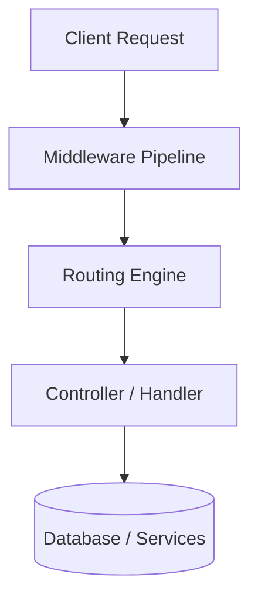
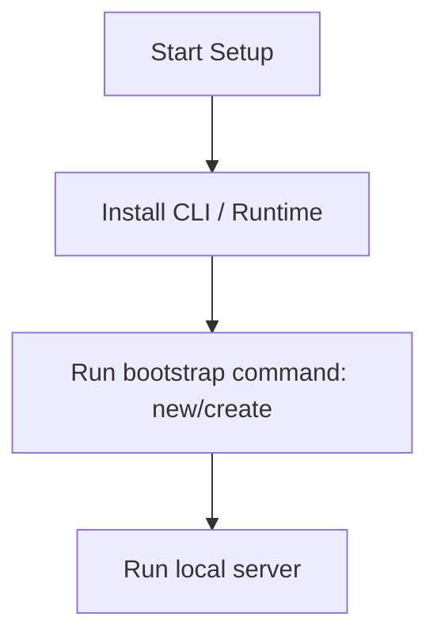

# FastAPI Master Engineering Guide

A comprehensive, production-level, industry-grade guide to FastAPI for software engineers, backend developers, frontend developers, full-stack developers, DevOps, and architects. FastAPI is a modern, fast (high-performance), web framework for building APIs with Python 3.8+ based on standard Python type hints.

---

## 1. Introduction

### 1.1 Overview & Concepts
Detailed explanation of Introduction in FastAPI. Built using Python, FastAPI provides rich abstractions for modern web or mobile workflows.

Configure security headers, rate limiting, and follow proper coding guidelines to build production-grade applications with FastAPI.

### 1.2 Operations & Verification
Production and verification best practices for Introduction in FastAPI.

> [!NOTE]
> Always refer to the official FastAPI configuration guide for the latest security guidelines.

---

## 2. Why Use This Framework?

### 2.1 Overview & Concepts
Detailed explanation of Why Use This Framework? in FastAPI. Built using Python, FastAPI provides rich abstractions for modern web or mobile workflows.

Configure security headers, rate limiting, and follow proper coding guidelines to build production-grade applications with FastAPI.

### 2.2 Operations & Verification
Production and verification best practices for Why Use This Framework? in FastAPI.

> [!NOTE]
> Always refer to the official FastAPI configuration guide for the latest security guidelines.

---

## 3. Architecture

### 3.1 Overview & Concepts
Detailed explanation of Architecture in FastAPI. Built using Python, FastAPI provides rich abstractions for modern web or mobile workflows.



### 3.2 Operations & Verification
Production and verification best practices for Architecture in FastAPI.

> [!NOTE]
> Always refer to the official FastAPI configuration guide for the latest security guidelines.

---

## 4. Installation

### 4.1 Overview & Concepts
Detailed explanation of Installation in FastAPI. Built using Python, FastAPI provides rich abstractions for modern web or mobile workflows.

#### Official Resources & Installation Flow
- **Download Link**: [Official FastAPI Homepage](https://fastapi.dev) or [Package Registry](https://npmjs.com)



### 4.2 Operations & Verification
Production and verification best practices for Installation in FastAPI.

> [!NOTE]
> Always refer to the official FastAPI configuration guide for the latest security guidelines.

---

## 5. Project Structure

### 5.1 Overview & Concepts
Detailed explanation of Project Structure in FastAPI. Built using Python, FastAPI provides rich abstractions for modern web or mobile workflows.

```text
src/
├── controllers/
├── models/
├── routes/
├── services/
└── app.js
```

### 5.2 Operations & Verification
Production and verification best practices for Project Structure in FastAPI.

> [!NOTE]
> Always refer to the official FastAPI configuration guide for the latest security guidelines.

---

## 6. Getting Started

### 6.1 Overview & Concepts
Detailed explanation of Getting Started in FastAPI. Built using Python, FastAPI provides rich abstractions for modern web or mobile workflows.

Here is a simple starting snippet:

```python
# First FastAPI app
print('Hello from FastAPI')
```

### 6.2 Operations & Verification
Production and verification best practices for Getting Started in FastAPI.

> [!NOTE]
> Always refer to the official FastAPI configuration guide for the latest security guidelines.

---

## 7. Core Concepts

### 7.1 Overview & Concepts
Detailed explanation of Core Concepts in FastAPI. Built using Python, FastAPI provides rich abstractions for modern web or mobile workflows.

Configure security headers, rate limiting, and follow proper coding guidelines to build production-grade applications with FastAPI.

### 7.2 Operations & Verification
Production and verification best practices for Core Concepts in FastAPI.

> [!NOTE]
> Always refer to the official FastAPI configuration guide for the latest security guidelines.

---

## 8. Routing

### 8.1 Overview & Concepts
Detailed explanation of Routing in FastAPI. Built using Python, FastAPI provides rich abstractions for modern web or mobile workflows.

Configure security headers, rate limiting, and follow proper coding guidelines to build production-grade applications with FastAPI.

### 8.2 Operations & Verification
Production and verification best practices for Routing in FastAPI.

> [!NOTE]
> Always refer to the official FastAPI configuration guide for the latest security guidelines.

---

## 9. Middleware

### 9.1 Overview & Concepts
Detailed explanation of Middleware in FastAPI. Built using Python, FastAPI provides rich abstractions for modern web or mobile workflows.

Configure security headers, rate limiting, and follow proper coding guidelines to build production-grade applications with FastAPI.

### 9.2 Operations & Verification
Production and verification best practices for Middleware in FastAPI.

> [!NOTE]
> Always refer to the official FastAPI configuration guide for the latest security guidelines.

---

## 10. Request & Response Lifecycle

### 10.1 Overview & Concepts
Detailed explanation of Request & Response Lifecycle in FastAPI. Built using Python, FastAPI provides rich abstractions for modern web or mobile workflows.

Configure security headers, rate limiting, and follow proper coding guidelines to build production-grade applications with FastAPI.

### 10.2 Operations & Verification
Production and verification best practices for Request & Response Lifecycle in FastAPI.

> [!NOTE]
> Always refer to the official FastAPI configuration guide for the latest security guidelines.

---

## 11. Dependency Injection (if supported)

### 11.1 Overview & Concepts
Detailed explanation of Dependency Injection (if supported) in FastAPI. Built using Python, FastAPI provides rich abstractions for modern web or mobile workflows.

Configure security headers, rate limiting, and follow proper coding guidelines to build production-grade applications with FastAPI.

### 11.2 Operations & Verification
Production and verification best practices for Dependency Injection (if supported) in FastAPI.

> [!NOTE]
> Always refer to the official FastAPI configuration guide for the latest security guidelines.

---

## 12. Configuration

### 12.1 Overview & Concepts
Detailed explanation of Configuration in FastAPI. Built using Python, FastAPI provides rich abstractions for modern web or mobile workflows.

Configure security headers, rate limiting, and follow proper coding guidelines to build production-grade applications with FastAPI.

### 12.2 Operations & Verification
Production and verification best practices for Configuration in FastAPI.

> [!NOTE]
> Always refer to the official FastAPI configuration guide for the latest security guidelines.

---

## 13. Database Integration

### 13.1 Overview & Concepts
Detailed explanation of Database Integration in FastAPI. Built using Python, FastAPI provides rich abstractions for modern web or mobile workflows.

Configure security headers, rate limiting, and follow proper coding guidelines to build production-grade applications with FastAPI.

### 13.2 Operations & Verification
Production and verification best practices for Database Integration in FastAPI.

> [!NOTE]
> Always refer to the official FastAPI configuration guide for the latest security guidelines.

---

## 14. Authentication

### 14.1 Overview & Concepts
Detailed explanation of Authentication in FastAPI. Built using Python, FastAPI provides rich abstractions for modern web or mobile workflows.

Configure security headers, rate limiting, and follow proper coding guidelines to build production-grade applications with FastAPI.

### 14.2 Operations & Verification
Production and verification best practices for Authentication in FastAPI.

> [!NOTE]
> Always refer to the official FastAPI configuration guide for the latest security guidelines.

---

## 15. Authorization

### 15.1 Overview & Concepts
Detailed explanation of Authorization in FastAPI. Built using Python, FastAPI provides rich abstractions for modern web or mobile workflows.

Configure security headers, rate limiting, and follow proper coding guidelines to build production-grade applications with FastAPI.

### 15.2 Operations & Verification
Production and verification best practices for Authorization in FastAPI.

> [!NOTE]
> Always refer to the official FastAPI configuration guide for the latest security guidelines.

---

## 16. Validation

### 16.1 Overview & Concepts
Detailed explanation of Validation in FastAPI. Built using Python, FastAPI provides rich abstractions for modern web or mobile workflows.

Configure security headers, rate limiting, and follow proper coding guidelines to build production-grade applications with FastAPI.

### 16.2 Operations & Verification
Production and verification best practices for Validation in FastAPI.

> [!NOTE]
> Always refer to the official FastAPI configuration guide for the latest security guidelines.

---

## 17. Error Handling

### 17.1 Overview & Concepts
Detailed explanation of Error Handling in FastAPI. Built using Python, FastAPI provides rich abstractions for modern web or mobile workflows.

Configure security headers, rate limiting, and follow proper coding guidelines to build production-grade applications with FastAPI.

### 17.2 Operations & Verification
Production and verification best practices for Error Handling in FastAPI.

> [!NOTE]
> Always refer to the official FastAPI configuration guide for the latest security guidelines.

---

## 18. Caching

### 18.1 Overview & Concepts
Detailed explanation of Caching in FastAPI. Built using Python, FastAPI provides rich abstractions for modern web or mobile workflows.

Configure security headers, rate limiting, and follow proper coding guidelines to build production-grade applications with FastAPI.

### 18.2 Operations & Verification
Production and verification best practices for Caching in FastAPI.

> [!NOTE]
> Always refer to the official FastAPI configuration guide for the latest security guidelines.

---

## 19. Security

### 19.1 Overview & Concepts
Detailed explanation of Security in FastAPI. Built using Python, FastAPI provides rich abstractions for modern web or mobile workflows.

Configure security headers, rate limiting, and follow proper coding guidelines to build production-grade applications with FastAPI.

### 19.2 Operations & Verification
Production and verification best practices for Security in FastAPI.

> [!NOTE]
> Always refer to the official FastAPI configuration guide for the latest security guidelines.

---

## 20. Performance Optimization

### 20.1 Overview & Concepts
Detailed explanation of Performance Optimization in FastAPI. Built using Python, FastAPI provides rich abstractions for modern web or mobile workflows.

Configure security headers, rate limiting, and follow proper coding guidelines to build production-grade applications with FastAPI.

### 20.2 Operations & Verification
Production and verification best practices for Performance Optimization in FastAPI.

> [!NOTE]
> Always refer to the official FastAPI configuration guide for the latest security guidelines.

---

## 21. Testing

### 21.1 Overview & Concepts
Detailed explanation of Testing in FastAPI. Built using Python, FastAPI provides rich abstractions for modern web or mobile workflows.

Configure security headers, rate limiting, and follow proper coding guidelines to build production-grade applications with FastAPI.

### 21.2 Operations & Verification
Production and verification best practices for Testing in FastAPI.

> [!NOTE]
> Always refer to the official FastAPI configuration guide for the latest security guidelines.

---

## 22. Deployment

### 22.1 Overview & Concepts
Detailed explanation of Deployment in FastAPI. Built using Python, FastAPI provides rich abstractions for modern web or mobile workflows.

Configure security headers, rate limiting, and follow proper coding guidelines to build production-grade applications with FastAPI.

### 22.2 Operations & Verification
Production and verification best practices for Deployment in FastAPI.

> [!NOTE]
> Always refer to the official FastAPI configuration guide for the latest security guidelines.

---

## 23. Monitoring

### 23.1 Overview & Concepts
Detailed explanation of Monitoring in FastAPI. Built using Python, FastAPI provides rich abstractions for modern web or mobile workflows.

Configure security headers, rate limiting, and follow proper coding guidelines to build production-grade applications with FastAPI.

### 23.2 Operations & Verification
Production and verification best practices for Monitoring in FastAPI.

> [!NOTE]
> Always refer to the official FastAPI configuration guide for the latest security guidelines.

---

## 24. Microservices

### 24.1 Overview & Concepts
Detailed explanation of Microservices in FastAPI. Built using Python, FastAPI provides rich abstractions for modern web or mobile workflows.

Configure security headers, rate limiting, and follow proper coding guidelines to build production-grade applications with FastAPI.

### 24.2 Operations & Verification
Production and verification best practices for Microservices in FastAPI.

> [!NOTE]
> Always refer to the official FastAPI configuration guide for the latest security guidelines.

---

## 25. AI Integration

### 25.1 Overview & Concepts
Detailed explanation of AI Integration in FastAPI. Built using Python, FastAPI provides rich abstractions for modern web or mobile workflows.

Integrating OpenAI or Bedrock in FastAPI is straightforward using direct client SDKs:

```python
import openai
client = openai.OpenAI()
response = client.chat.completions.create(model='gpt-4', messages=[{'role': 'user', 'content': 'Hello'}])
print(response.choices[0].message.content)
```

### 25.2 Operations & Verification
Production and verification best practices for AI Integration in FastAPI.

> [!NOTE]
> Always refer to the official FastAPI configuration guide for the latest security guidelines.

---

## 26. Production Architecture

### 26.1 Overview & Concepts
Detailed explanation of Production Architecture in FastAPI. Built using Python, FastAPI provides rich abstractions for modern web or mobile workflows.

Configure security headers, rate limiting, and follow proper coding guidelines to build production-grade applications with FastAPI.

### 26.2 Operations & Verification
Production and verification best practices for Production Architecture in FastAPI.

> [!NOTE]
> Always refer to the official FastAPI configuration guide for the latest security guidelines.

---

## 27. Best Practices

### 27.1 Overview & Concepts
Detailed explanation of Best Practices in FastAPI. Built using Python, FastAPI provides rich abstractions for modern web or mobile workflows.

Configure security headers, rate limiting, and follow proper coding guidelines to build production-grade applications with FastAPI.

### 27.2 Operations & Verification
Production and verification best practices for Best Practices in FastAPI.

> [!NOTE]
> Always refer to the official FastAPI configuration guide for the latest security guidelines.

---

## 28. Common Errors

### 28.1 Overview & Concepts
Detailed explanation of Common Errors in FastAPI. Built using Python, FastAPI provides rich abstractions for modern web or mobile workflows.

Configure security headers, rate limiting, and follow proper coding guidelines to build production-grade applications with FastAPI.

### 28.2 Operations & Verification
Production and verification best practices for Common Errors in FastAPI.

> [!NOTE]
> Always refer to the official FastAPI configuration guide for the latest security guidelines.

---

## 29. Interview Questions

### 29.1 Overview & Concepts
Detailed explanation of Interview Questions in FastAPI. Built using Python, FastAPI provides rich abstractions for modern web or mobile workflows.

Configure security headers, rate limiting, and follow proper coding guidelines to build production-grade applications with FastAPI.

### 29.2 Operations & Verification
Production and verification best practices for Interview Questions in FastAPI.

> [!NOTE]
> Always refer to the official FastAPI configuration guide for the latest security guidelines.

---

## 30. Cheat Sheet

### 30.1 Overview & Concepts
Detailed explanation of Cheat Sheet in FastAPI. Built using Python, FastAPI provides rich abstractions for modern web or mobile workflows.

Configure security headers, rate limiting, and follow proper coding guidelines to build production-grade applications with FastAPI.

### 30.2 Operations & Verification
Production and verification best practices for Cheat Sheet in FastAPI.

> [!NOTE]
> Always refer to the official FastAPI configuration guide for the latest security guidelines.

---

## 31. Hands-on Projects

### 31.1 Overview & Concepts
Detailed explanation of Hands-on Projects in FastAPI. Built using Python, FastAPI provides rich abstractions for modern web or mobile workflows.

Configure security headers, rate limiting, and follow proper coding guidelines to build production-grade applications with FastAPI.

### 31.2 Operations & Verification
Production and verification best practices for Hands-on Projects in FastAPI.

> [!NOTE]
> Always refer to the official FastAPI configuration guide for the latest security guidelines.

---

## 32. Learning Roadmap

### 32.1 Overview & Concepts
Detailed explanation of Learning Roadmap in FastAPI. Built using Python, FastAPI provides rich abstractions for modern web or mobile workflows.

Configure security headers, rate limiting, and follow proper coding guidelines to build production-grade applications with FastAPI.

### 32.2 Operations & Verification
Production and verification best practices for Learning Roadmap in FastAPI.

> [!NOTE]
> Always refer to the official FastAPI configuration guide for the latest security guidelines.

---

## 33. Final Summary

### 33.1 Overview & Concepts
Detailed explanation of Final Summary in FastAPI. Built using Python, FastAPI provides rich abstractions for modern web or mobile workflows.

Configure security headers, rate limiting, and follow proper coding guidelines to build production-grade applications with FastAPI.

### 33.2 Operations & Verification
Production and verification best practices for Final Summary in FastAPI.

> [!NOTE]
> Always refer to the official FastAPI configuration guide for the latest security guidelines.

---

