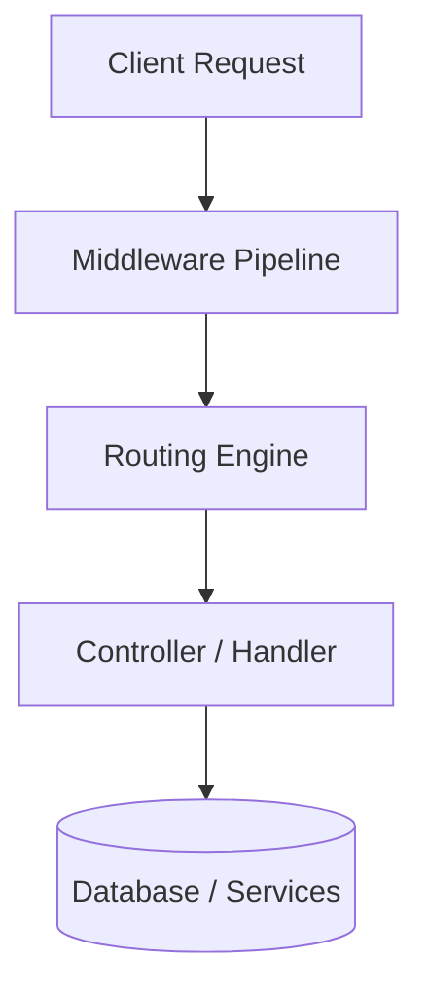
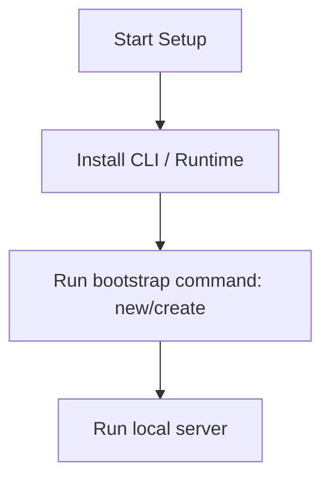

# Flask Master Engineering Guide

A comprehensive, production-level, industry-grade guide to Flask for software engineers, backend developers, frontend developers, full-stack developers, DevOps, and architects. Flask is a micro web framework written in Python, designed to make getting started quick and easy, with the ability to scale up to complex applications.

---

## 1. Introduction

### 1.1 Overview & Concepts
Detailed explanation of Introduction in Flask. Built using Python, Flask provides rich abstractions for modern web or mobile workflows.

Configure security headers, rate limiting, and follow proper coding guidelines to build production-grade applications with Flask.

### 1.2 Operations & Verification
Production and verification best practices for Introduction in Flask.

> [!NOTE]
> Always refer to the official Flask configuration guide for the latest security guidelines.

---

## 2. Why Use This Framework?

### 2.1 Overview & Concepts
Detailed explanation of Why Use This Framework? in Flask. Built using Python, Flask provides rich abstractions for modern web or mobile workflows.

Configure security headers, rate limiting, and follow proper coding guidelines to build production-grade applications with Flask.

### 2.2 Operations & Verification
Production and verification best practices for Why Use This Framework? in Flask.

> [!NOTE]
> Always refer to the official Flask configuration guide for the latest security guidelines.

---

## 3. Architecture

### 3.1 Overview & Concepts
Detailed explanation of Architecture in Flask. Built using Python, Flask provides rich abstractions for modern web or mobile workflows.



### 3.2 Operations & Verification
Production and verification best practices for Architecture in Flask.

> [!NOTE]
> Always refer to the official Flask configuration guide for the latest security guidelines.

---

## 4. Installation

### 4.1 Overview & Concepts
Detailed explanation of Installation in Flask. Built using Python, Flask provides rich abstractions for modern web or mobile workflows.

#### Official Resources & Installation Flow
- **Download Link**: [Official Flask Homepage](https://flask.dev) or [Package Registry](https://npmjs.com)



### 4.2 Operations & Verification
Production and verification best practices for Installation in Flask.

> [!NOTE]
> Always refer to the official Flask configuration guide for the latest security guidelines.

---

## 5. Project Structure

### 5.1 Overview & Concepts
Detailed explanation of Project Structure in Flask. Built using Python, Flask provides rich abstractions for modern web or mobile workflows.

```text
src/
├── controllers/
├── models/
├── routes/
├── services/
└── app.js
```

### 5.2 Operations & Verification
Production and verification best practices for Project Structure in Flask.

> [!NOTE]
> Always refer to the official Flask configuration guide for the latest security guidelines.

---

## 6. Getting Started

### 6.1 Overview & Concepts
Detailed explanation of Getting Started in Flask. Built using Python, Flask provides rich abstractions for modern web or mobile workflows.

Here is a simple starting snippet:

```python
# First Flask app
print('Hello from Flask')
```

### 6.2 Operations & Verification
Production and verification best practices for Getting Started in Flask.

> [!NOTE]
> Always refer to the official Flask configuration guide for the latest security guidelines.

---

## 7. Core Concepts

### 7.1 Overview & Concepts
Detailed explanation of Core Concepts in Flask. Built using Python, Flask provides rich abstractions for modern web or mobile workflows.

Configure security headers, rate limiting, and follow proper coding guidelines to build production-grade applications with Flask.

### 7.2 Operations & Verification
Production and verification best practices for Core Concepts in Flask.

> [!NOTE]
> Always refer to the official Flask configuration guide for the latest security guidelines.

---

## 8. Routing

### 8.1 Overview & Concepts
Detailed explanation of Routing in Flask. Built using Python, Flask provides rich abstractions for modern web or mobile workflows.

Configure security headers, rate limiting, and follow proper coding guidelines to build production-grade applications with Flask.

### 8.2 Operations & Verification
Production and verification best practices for Routing in Flask.

> [!NOTE]
> Always refer to the official Flask configuration guide for the latest security guidelines.

---

## 9. Middleware

### 9.1 Overview & Concepts
Detailed explanation of Middleware in Flask. Built using Python, Flask provides rich abstractions for modern web or mobile workflows.

Configure security headers, rate limiting, and follow proper coding guidelines to build production-grade applications with Flask.

### 9.2 Operations & Verification
Production and verification best practices for Middleware in Flask.

> [!NOTE]
> Always refer to the official Flask configuration guide for the latest security guidelines.

---

## 10. Request & Response Lifecycle

### 10.1 Overview & Concepts
Detailed explanation of Request & Response Lifecycle in Flask. Built using Python, Flask provides rich abstractions for modern web or mobile workflows.

Configure security headers, rate limiting, and follow proper coding guidelines to build production-grade applications with Flask.

### 10.2 Operations & Verification
Production and verification best practices for Request & Response Lifecycle in Flask.

> [!NOTE]
> Always refer to the official Flask configuration guide for the latest security guidelines.

---

## 11. Dependency Injection (if supported)

### 11.1 Overview & Concepts
Detailed explanation of Dependency Injection (if supported) in Flask. Built using Python, Flask provides rich abstractions for modern web or mobile workflows.

Configure security headers, rate limiting, and follow proper coding guidelines to build production-grade applications with Flask.

### 11.2 Operations & Verification
Production and verification best practices for Dependency Injection (if supported) in Flask.

> [!NOTE]
> Always refer to the official Flask configuration guide for the latest security guidelines.

---

## 12. Configuration

### 12.1 Overview & Concepts
Detailed explanation of Configuration in Flask. Built using Python, Flask provides rich abstractions for modern web or mobile workflows.

Configure security headers, rate limiting, and follow proper coding guidelines to build production-grade applications with Flask.

### 12.2 Operations & Verification
Production and verification best practices for Configuration in Flask.

> [!NOTE]
> Always refer to the official Flask configuration guide for the latest security guidelines.

---

## 13. Database Integration

### 13.1 Overview & Concepts
Detailed explanation of Database Integration in Flask. Built using Python, Flask provides rich abstractions for modern web or mobile workflows.

Configure security headers, rate limiting, and follow proper coding guidelines to build production-grade applications with Flask.

### 13.2 Operations & Verification
Production and verification best practices for Database Integration in Flask.

> [!NOTE]
> Always refer to the official Flask configuration guide for the latest security guidelines.

---

## 14. Authentication

### 14.1 Overview & Concepts
Detailed explanation of Authentication in Flask. Built using Python, Flask provides rich abstractions for modern web or mobile workflows.

Configure security headers, rate limiting, and follow proper coding guidelines to build production-grade applications with Flask.

### 14.2 Operations & Verification
Production and verification best practices for Authentication in Flask.

> [!NOTE]
> Always refer to the official Flask configuration guide for the latest security guidelines.

---

## 15. Authorization

### 15.1 Overview & Concepts
Detailed explanation of Authorization in Flask. Built using Python, Flask provides rich abstractions for modern web or mobile workflows.

Configure security headers, rate limiting, and follow proper coding guidelines to build production-grade applications with Flask.

### 15.2 Operations & Verification
Production and verification best practices for Authorization in Flask.

> [!NOTE]
> Always refer to the official Flask configuration guide for the latest security guidelines.

---

## 16. Validation

### 16.1 Overview & Concepts
Detailed explanation of Validation in Flask. Built using Python, Flask provides rich abstractions for modern web or mobile workflows.

Configure security headers, rate limiting, and follow proper coding guidelines to build production-grade applications with Flask.

### 16.2 Operations & Verification
Production and verification best practices for Validation in Flask.

> [!NOTE]
> Always refer to the official Flask configuration guide for the latest security guidelines.

---

## 17. Error Handling

### 17.1 Overview & Concepts
Detailed explanation of Error Handling in Flask. Built using Python, Flask provides rich abstractions for modern web or mobile workflows.

Configure security headers, rate limiting, and follow proper coding guidelines to build production-grade applications with Flask.

### 17.2 Operations & Verification
Production and verification best practices for Error Handling in Flask.

> [!NOTE]
> Always refer to the official Flask configuration guide for the latest security guidelines.

---

## 18. Caching

### 18.1 Overview & Concepts
Detailed explanation of Caching in Flask. Built using Python, Flask provides rich abstractions for modern web or mobile workflows.

Configure security headers, rate limiting, and follow proper coding guidelines to build production-grade applications with Flask.

### 18.2 Operations & Verification
Production and verification best practices for Caching in Flask.

> [!NOTE]
> Always refer to the official Flask configuration guide for the latest security guidelines.

---

## 19. Security

### 19.1 Overview & Concepts
Detailed explanation of Security in Flask. Built using Python, Flask provides rich abstractions for modern web or mobile workflows.

Configure security headers, rate limiting, and follow proper coding guidelines to build production-grade applications with Flask.

### 19.2 Operations & Verification
Production and verification best practices for Security in Flask.

> [!NOTE]
> Always refer to the official Flask configuration guide for the latest security guidelines.

---

## 20. Performance Optimization

### 20.1 Overview & Concepts
Detailed explanation of Performance Optimization in Flask. Built using Python, Flask provides rich abstractions for modern web or mobile workflows.

Configure security headers, rate limiting, and follow proper coding guidelines to build production-grade applications with Flask.

### 20.2 Operations & Verification
Production and verification best practices for Performance Optimization in Flask.

> [!NOTE]
> Always refer to the official Flask configuration guide for the latest security guidelines.

---

## 21. Testing

### 21.1 Overview & Concepts
Detailed explanation of Testing in Flask. Built using Python, Flask provides rich abstractions for modern web or mobile workflows.

Configure security headers, rate limiting, and follow proper coding guidelines to build production-grade applications with Flask.

### 21.2 Operations & Verification
Production and verification best practices for Testing in Flask.

> [!NOTE]
> Always refer to the official Flask configuration guide for the latest security guidelines.

---

## 22. Deployment

### 22.1 Overview & Concepts
Detailed explanation of Deployment in Flask. Built using Python, Flask provides rich abstractions for modern web or mobile workflows.

Configure security headers, rate limiting, and follow proper coding guidelines to build production-grade applications with Flask.

### 22.2 Operations & Verification
Production and verification best practices for Deployment in Flask.

> [!NOTE]
> Always refer to the official Flask configuration guide for the latest security guidelines.

---

## 23. Monitoring

### 23.1 Overview & Concepts
Detailed explanation of Monitoring in Flask. Built using Python, Flask provides rich abstractions for modern web or mobile workflows.

Configure security headers, rate limiting, and follow proper coding guidelines to build production-grade applications with Flask.

### 23.2 Operations & Verification
Production and verification best practices for Monitoring in Flask.

> [!NOTE]
> Always refer to the official Flask configuration guide for the latest security guidelines.

---

## 24. Microservices

### 24.1 Overview & Concepts
Detailed explanation of Microservices in Flask. Built using Python, Flask provides rich abstractions for modern web or mobile workflows.

Configure security headers, rate limiting, and follow proper coding guidelines to build production-grade applications with Flask.

### 24.2 Operations & Verification
Production and verification best practices for Microservices in Flask.

> [!NOTE]
> Always refer to the official Flask configuration guide for the latest security guidelines.

---

## 25. AI Integration

### 25.1 Overview & Concepts
Detailed explanation of AI Integration in Flask. Built using Python, Flask provides rich abstractions for modern web or mobile workflows.

Integrating OpenAI or Bedrock in Flask is straightforward using direct client SDKs:

```python
import openai
client = openai.OpenAI()
response = client.chat.completions.create(model='gpt-4', messages=[{'role': 'user', 'content': 'Hello'}])
print(response.choices[0].message.content)
```

### 25.2 Operations & Verification
Production and verification best practices for AI Integration in Flask.

> [!NOTE]
> Always refer to the official Flask configuration guide for the latest security guidelines.

---

## 26. Production Architecture

### 26.1 Overview & Concepts
Detailed explanation of Production Architecture in Flask. Built using Python, Flask provides rich abstractions for modern web or mobile workflows.

Configure security headers, rate limiting, and follow proper coding guidelines to build production-grade applications with Flask.

### 26.2 Operations & Verification
Production and verification best practices for Production Architecture in Flask.

> [!NOTE]
> Always refer to the official Flask configuration guide for the latest security guidelines.

---

## 27. Best Practices

### 27.1 Overview & Concepts
Detailed explanation of Best Practices in Flask. Built using Python, Flask provides rich abstractions for modern web or mobile workflows.

Configure security headers, rate limiting, and follow proper coding guidelines to build production-grade applications with Flask.

### 27.2 Operations & Verification
Production and verification best practices for Best Practices in Flask.

> [!NOTE]
> Always refer to the official Flask configuration guide for the latest security guidelines.

---

## 28. Common Errors

### 28.1 Overview & Concepts
Detailed explanation of Common Errors in Flask. Built using Python, Flask provides rich abstractions for modern web or mobile workflows.

Configure security headers, rate limiting, and follow proper coding guidelines to build production-grade applications with Flask.

### 28.2 Operations & Verification
Production and verification best practices for Common Errors in Flask.

> [!NOTE]
> Always refer to the official Flask configuration guide for the latest security guidelines.

---

## 29. Interview Questions

### 29.1 Overview & Concepts
Detailed explanation of Interview Questions in Flask. Built using Python, Flask provides rich abstractions for modern web or mobile workflows.

Configure security headers, rate limiting, and follow proper coding guidelines to build production-grade applications with Flask.

### 29.2 Operations & Verification
Production and verification best practices for Interview Questions in Flask.

> [!NOTE]
> Always refer to the official Flask configuration guide for the latest security guidelines.

---

## 30. Cheat Sheet

### 30.1 Overview & Concepts
Detailed explanation of Cheat Sheet in Flask. Built using Python, Flask provides rich abstractions for modern web or mobile workflows.

Configure security headers, rate limiting, and follow proper coding guidelines to build production-grade applications with Flask.

### 30.2 Operations & Verification
Production and verification best practices for Cheat Sheet in Flask.

> [!NOTE]
> Always refer to the official Flask configuration guide for the latest security guidelines.

---

## 31. Hands-on Projects

### 31.1 Overview & Concepts
Detailed explanation of Hands-on Projects in Flask. Built using Python, Flask provides rich abstractions for modern web or mobile workflows.

Configure security headers, rate limiting, and follow proper coding guidelines to build production-grade applications with Flask.

### 31.2 Operations & Verification
Production and verification best practices for Hands-on Projects in Flask.

> [!NOTE]
> Always refer to the official Flask configuration guide for the latest security guidelines.

---

## 32. Learning Roadmap

### 32.1 Overview & Concepts
Detailed explanation of Learning Roadmap in Flask. Built using Python, Flask provides rich abstractions for modern web or mobile workflows.

Configure security headers, rate limiting, and follow proper coding guidelines to build production-grade applications with Flask.

### 32.2 Operations & Verification
Production and verification best practices for Learning Roadmap in Flask.

> [!NOTE]
> Always refer to the official Flask configuration guide for the latest security guidelines.

---

## 33. Final Summary

### 33.1 Overview & Concepts
Detailed explanation of Final Summary in Flask. Built using Python, Flask provides rich abstractions for modern web or mobile workflows.

Configure security headers, rate limiting, and follow proper coding guidelines to build production-grade applications with Flask.

### 33.2 Operations & Verification
Production and verification best practices for Final Summary in Flask.

> [!NOTE]
> Always refer to the official Flask configuration guide for the latest security guidelines.

---

