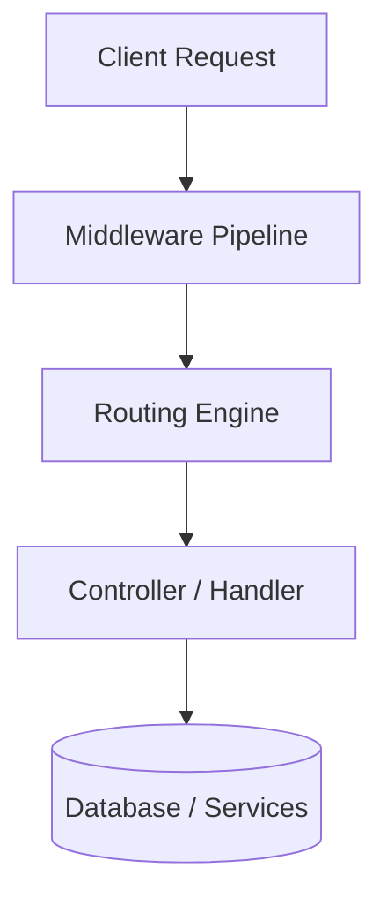
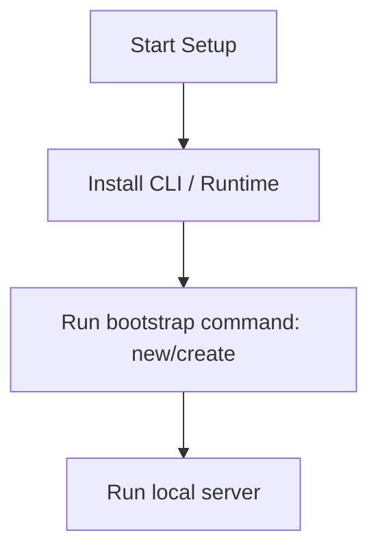

# Laravel Master Engineering Guide

A comprehensive, production-level, industry-grade guide to Laravel for software engineers, backend developers, frontend developers, full-stack developers, DevOps, and architects. Laravel is a web application framework with expressive, elegant syntax, designed to make development easy and enjoyable.

---

## 1. Introduction

### 1.1 Overview & Concepts
Detailed explanation of Introduction in Laravel. Built using PHP, Laravel provides rich abstractions for modern web or mobile workflows.

Configure security headers, rate limiting, and follow proper coding guidelines to build production-grade applications with Laravel.

### 1.2 Operations & Verification
Production and verification best practices for Introduction in Laravel.

```bash
# Run database migrations
php artisan migrate
```

---

## 2. Why Use This Framework?

### 2.1 Overview & Concepts
Detailed explanation of Why Use This Framework? in Laravel. Built using PHP, Laravel provides rich abstractions for modern web or mobile workflows.

Configure security headers, rate limiting, and follow proper coding guidelines to build production-grade applications with Laravel.

### 2.2 Operations & Verification
Production and verification best practices for Why Use This Framework? in Laravel.

```bash
# Run database migrations seeders
php artisan db:seed
```

---

## 3. Architecture

### 3.1 Overview & Concepts
Detailed explanation of Architecture in Laravel. Built using PHP, Laravel provides rich abstractions for modern web or mobile workflows.



### 3.2 Operations & Verification
Production and verification best practices for Architecture in Laravel.

```bash
# Clear the application cache
php artisan cache:clear
```

---

## 4. Installation

### 4.1 Overview & Concepts
Detailed explanation of Installation in Laravel. Built using PHP, Laravel provides rich abstractions for modern web or mobile workflows.

#### Official Resources & Installation Flow
- **Download Link**: [Official Laravel Homepage](https://laravel.dev) or [Package Registry](https://npmjs.com)



### 4.2 Project Scaffolding & Setup
Run the following Composer command to create a new Laravel project:
```bash
# Scaffold a new Laravel application using Composer
composer create-project laravel/laravel mylaravelapp
cd mylaravelapp
```

---

## 5. Project Structure

### 5.1 Overview & Concepts
Detailed explanation of Project Structure in Laravel. Built using PHP, Laravel provides rich abstractions for modern web or mobile workflows.

```text
src/
├── controllers/
├── models/
├── routes/
├── services/
└── app.js
```

### 5.2 Operations & Verification
Production and verification best practices for Project Structure in Laravel.

```bash
# Cache the configuration for better production performance
php artisan config:cache
```

---

## 6. Getting Started

### 6.1 Overview & Concepts
Detailed explanation of Getting Started in Laravel. Built using PHP, Laravel provides rich abstractions for modern web or mobile workflows.

Here is a simple starting snippet:

```java
// First Laravel app
System.out.println("Hello from Laravel");
```

### 6.2 Running the Application
Run the following command in the project directory to start the local artisan development server:
```bash
# Run the local Laravel artisan development server
php artisan serve
```

---

## 7. Core Concepts

### 7.1 Overview & Concepts
Detailed explanation of Core Concepts in Laravel. Built using PHP, Laravel provides rich abstractions for modern web or mobile workflows.

Configure security headers, rate limiting, and follow proper coding guidelines to build production-grade applications with Laravel.

### 7.2 Operations & Verification
Production and verification best practices for Core Concepts in Laravel.

```bash
# List all registered routes
php artisan route:list
```

---

## 8. Routing

### 8.1 Overview & Concepts
Detailed explanation of Routing in Laravel. Built using PHP, Laravel provides rich abstractions for modern web or mobile workflows.

Configure security headers, rate limiting, and follow proper coding guidelines to build production-grade applications with Laravel.

### 8.2 Operations & Verification
Production and verification best practices for Routing in Laravel.

```bash
# Run project test cases
php artisan test
```

---

## 9. Middleware

### 9.1 Overview & Concepts
Detailed explanation of Middleware in Laravel. Built using PHP, Laravel provides rich abstractions for modern web or mobile workflows.

Configure security headers, rate limiting, and follow proper coding guidelines to build production-grade applications with Laravel.

### 9.2 Operations & Verification
Production and verification best practices for Middleware in Laravel.

```bash
# Create a new controller class
php artisan make:controller ItemController
```

---

## 10. Request & Response Lifecycle

### 10.1 Overview & Concepts
Detailed explanation of Request & Response Lifecycle in Laravel. Built using PHP, Laravel provides rich abstractions for modern web or mobile workflows.

Configure security headers, rate limiting, and follow proper coding guidelines to build production-grade applications with Laravel.

### 10.2 Operations & Verification
Production and verification best practices for Request & Response Lifecycle in Laravel.

```bash
# Run database migrations
php artisan migrate
```

---

## 11. Dependency Injection (if supported)

### 11.1 Overview & Concepts
Detailed explanation of Dependency Injection (if supported) in Laravel. Built using PHP, Laravel provides rich abstractions for modern web or mobile workflows.

Configure security headers, rate limiting, and follow proper coding guidelines to build production-grade applications with Laravel.

### 11.2 Operations & Verification
Production and verification best practices for Dependency Injection (if supported) in Laravel.

```bash
# Run database migrations seeders
php artisan db:seed
```

---

## 12. Configuration

### 12.1 Overview & Concepts
Detailed explanation of Configuration in Laravel. Built using PHP, Laravel provides rich abstractions for modern web or mobile workflows.

Configure security headers, rate limiting, and follow proper coding guidelines to build production-grade applications with Laravel.

### 12.2 Operations & Verification
Production and verification best practices for Configuration in Laravel.

```bash
# Clear the application cache
php artisan cache:clear
```

---

## 13. Database Integration

### 13.1 Overview & Concepts
Detailed explanation of Database Integration in Laravel. Built using PHP, Laravel provides rich abstractions for modern web or mobile workflows.

Configure security headers, rate limiting, and follow proper coding guidelines to build production-grade applications with Laravel.

### 13.2 Operations & Verification
Production and verification best practices for Database Integration in Laravel.

```bash
# Cache the configuration for better production performance
php artisan config:cache
```

---

## 14. Authentication

### 14.1 Overview & Concepts
Detailed explanation of Authentication in Laravel. Built using PHP, Laravel provides rich abstractions for modern web or mobile workflows.

Configure security headers, rate limiting, and follow proper coding guidelines to build production-grade applications with Laravel.

### 14.2 Operations & Verification
Production and verification best practices for Authentication in Laravel.

```bash
# List all registered routes
php artisan route:list
```

---

## 15. Authorization

### 15.1 Overview & Concepts
Detailed explanation of Authorization in Laravel. Built using PHP, Laravel provides rich abstractions for modern web or mobile workflows.

Configure security headers, rate limiting, and follow proper coding guidelines to build production-grade applications with Laravel.

### 15.2 Operations & Verification
Production and verification best practices for Authorization in Laravel.

```bash
# Run project test cases
php artisan test
```

---

## 16. Validation

### 16.1 Overview & Concepts
Detailed explanation of Validation in Laravel. Built using PHP, Laravel provides rich abstractions for modern web or mobile workflows.

Configure security headers, rate limiting, and follow proper coding guidelines to build production-grade applications with Laravel.

### 16.2 Operations & Verification
Production and verification best practices for Validation in Laravel.

```bash
# Create a new controller class
php artisan make:controller ItemController
```

---

## 17. Error Handling

### 17.1 Overview & Concepts
Detailed explanation of Error Handling in Laravel. Built using PHP, Laravel provides rich abstractions for modern web or mobile workflows.

Configure security headers, rate limiting, and follow proper coding guidelines to build production-grade applications with Laravel.

### 17.2 Operations & Verification
Production and verification best practices for Error Handling in Laravel.

```bash
# Run database migrations
php artisan migrate
```

---

## 18. Caching

### 18.1 Overview & Concepts
Detailed explanation of Caching in Laravel. Built using PHP, Laravel provides rich abstractions for modern web or mobile workflows.

Configure security headers, rate limiting, and follow proper coding guidelines to build production-grade applications with Laravel.

### 18.2 Operations & Verification
Production and verification best practices for Caching in Laravel.

```bash
# Run database migrations seeders
php artisan db:seed
```

---

## 19. Security

### 19.1 Overview & Concepts
Detailed explanation of Security in Laravel. Built using PHP, Laravel provides rich abstractions for modern web or mobile workflows.

Configure security headers, rate limiting, and follow proper coding guidelines to build production-grade applications with Laravel.

### 19.2 Operations & Verification
Production and verification best practices for Security in Laravel.

```bash
# Clear the application cache
php artisan cache:clear
```

---

## 20. Performance Optimization

### 20.1 Overview & Concepts
Detailed explanation of Performance Optimization in Laravel. Built using PHP, Laravel provides rich abstractions for modern web or mobile workflows.

Configure security headers, rate limiting, and follow proper coding guidelines to build production-grade applications with Laravel.

### 20.2 Operations & Verification
Production and verification best practices for Performance Optimization in Laravel.

```bash
# Cache the configuration for better production performance
php artisan config:cache
```

---

## 21. Testing

### 21.1 Overview & Concepts
Detailed explanation of Testing in Laravel. Built using PHP, Laravel provides rich abstractions for modern web or mobile workflows.

Configure security headers, rate limiting, and follow proper coding guidelines to build production-grade applications with Laravel.

### 21.2 Operations & Verification
Production and verification best practices for Testing in Laravel.

```bash
# List all registered routes
php artisan route:list
```

---

## 22. Deployment

### 22.1 Overview & Concepts
Detailed explanation of Deployment in Laravel. Built using PHP, Laravel provides rich abstractions for modern web or mobile workflows.

Configure security headers, rate limiting, and follow proper coding guidelines to build production-grade applications with Laravel.

### 22.2 Operations & Verification
Production and verification best practices for Deployment in Laravel.

```bash
# Run project test cases
php artisan test
```

---

## 23. Monitoring

### 23.1 Overview & Concepts
Detailed explanation of Monitoring in Laravel. Built using PHP, Laravel provides rich abstractions for modern web or mobile workflows.

Configure security headers, rate limiting, and follow proper coding guidelines to build production-grade applications with Laravel.

### 23.2 Operations & Verification
Production and verification best practices for Monitoring in Laravel.

```bash
# Create a new controller class
php artisan make:controller ItemController
```

---

## 24. Microservices

### 24.1 Overview & Concepts
Detailed explanation of Microservices in Laravel. Built using PHP, Laravel provides rich abstractions for modern web or mobile workflows.

Configure security headers, rate limiting, and follow proper coding guidelines to build production-grade applications with Laravel.

### 24.2 Operations & Verification
Production and verification best practices for Microservices in Laravel.

```bash
# Run database migrations
php artisan migrate
```

---

## 25. AI Integration

### 25.1 Overview & Concepts
Detailed explanation of AI Integration in Laravel. Built using PHP, Laravel provides rich abstractions for modern web or mobile workflows.

Integrating OpenAI or Bedrock in Laravel is straightforward using direct client SDKs:

```typescript
import { OpenAI } from 'openai';
const openai = new OpenAI();
const completion = await openai.chat.completions.create({ model: 'gpt-4', messages: [{ role: 'user', content: 'Hello' }] });
console.log(completion.choices[0].message.content);
```

### 25.2 Operations & Verification
Production and verification best practices for AI Integration in Laravel.

```bash
# Run database migrations seeders
php artisan db:seed
```

---

## 26. Production Architecture

### 26.1 Overview & Concepts
Detailed explanation of Production Architecture in Laravel. Built using PHP, Laravel provides rich abstractions for modern web or mobile workflows.

Configure security headers, rate limiting, and follow proper coding guidelines to build production-grade applications with Laravel.

### 26.2 Operations & Verification
Production and verification best practices for Production Architecture in Laravel.

```bash
# Clear the application cache
php artisan cache:clear
```

---

## 27. Best Practices

### 27.1 Overview & Concepts
Detailed explanation of Best Practices in Laravel. Built using PHP, Laravel provides rich abstractions for modern web or mobile workflows.

Configure security headers, rate limiting, and follow proper coding guidelines to build production-grade applications with Laravel.

### 27.2 Operations & Verification
Production and verification best practices for Best Practices in Laravel.

```bash
# Cache the configuration for better production performance
php artisan config:cache
```

---

## 28. Common Errors

### 28.1 Overview & Concepts
Detailed explanation of Common Errors in Laravel. Built using PHP, Laravel provides rich abstractions for modern web or mobile workflows.

Configure security headers, rate limiting, and follow proper coding guidelines to build production-grade applications with Laravel.

### 28.2 Operations & Verification
Production and verification best practices for Common Errors in Laravel.

```bash
# List all registered routes
php artisan route:list
```

---

## 29. Interview Questions

### 29.1 Overview & Concepts
Detailed explanation of Interview Questions in Laravel. Built using PHP, Laravel provides rich abstractions for modern web or mobile workflows.

Configure security headers, rate limiting, and follow proper coding guidelines to build production-grade applications with Laravel.

### 29.2 Operations & Verification
Production and verification best practices for Interview Questions in Laravel.

```bash
# Run project test cases
php artisan test
```

---

## 30. Cheat Sheet

### 30.1 Overview & Concepts
Detailed explanation of Cheat Sheet in Laravel. Built using PHP, Laravel provides rich abstractions for modern web or mobile workflows.

Configure security headers, rate limiting, and follow proper coding guidelines to build production-grade applications with Laravel.

### 30.2 Operations & Verification
Production and verification best practices for Cheat Sheet in Laravel.

```bash
# Create a new controller class
php artisan make:controller ItemController
```

---

## 31. Hands-on Projects

### 31.1 Overview & Concepts
Detailed explanation of Hands-on Projects in Laravel. Built using PHP, Laravel provides rich abstractions for modern web or mobile workflows.

Configure security headers, rate limiting, and follow proper coding guidelines to build production-grade applications with Laravel.

### 31.2 Operations & Verification
Production and verification best practices for Hands-on Projects in Laravel.

```bash
# Run database migrations
php artisan migrate
```

---

## 32. Learning Roadmap

### 32.1 Overview & Concepts
Detailed explanation of Learning Roadmap in Laravel. Built using PHP, Laravel provides rich abstractions for modern web or mobile workflows.

Configure security headers, rate limiting, and follow proper coding guidelines to build production-grade applications with Laravel.

### 32.2 Operations & Verification
Production and verification best practices for Learning Roadmap in Laravel.

```bash
# Run database migrations seeders
php artisan db:seed
```

---

## 33. Final Summary

### 33.1 Overview & Concepts
Detailed explanation of Final Summary in Laravel. Built using PHP, Laravel provides rich abstractions for modern web or mobile workflows.

Configure security headers, rate limiting, and follow proper coding guidelines to build production-grade applications with Laravel.

### 33.2 Operations & Verification
Production and verification best practices for Final Summary in Laravel.

```bash
# Clear the application cache
php artisan cache:clear
```

---

---

## 34. Project Creation & Execution Commands

### Scaffolding a New Project
```bash
# Scaffold a new Laravel application using Composer
composer create-project laravel/laravel mylaravelapp
cd mylaravelapp
```

### Running the Application
```bash
# Run the local Laravel artisan development server
php artisan serve
```
