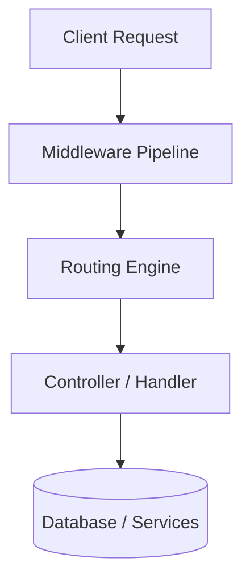
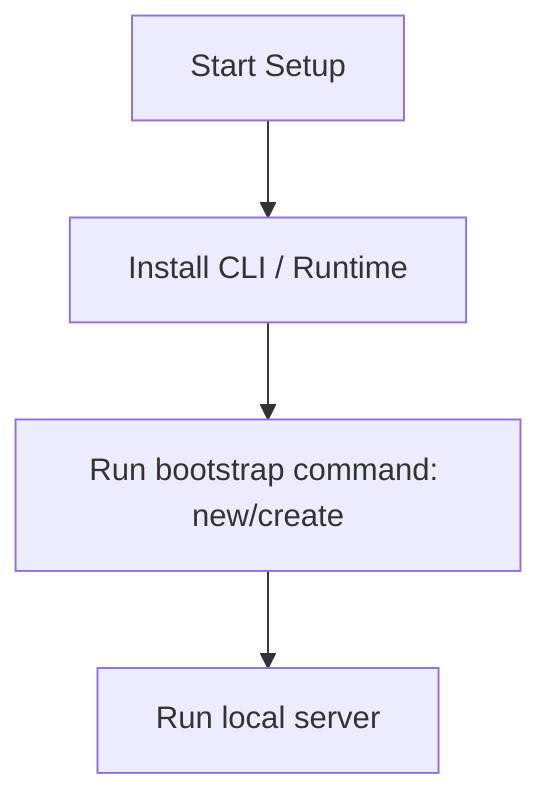

# NestJS Master Engineering Guide

A comprehensive, production-level, industry-grade guide to NestJS for software engineers, backend developers, frontend developers, full-stack developers, DevOps, and architects. NestJS is a framework for building efficient, scalable Node.js server-side applications using progressive JavaScript/TypeScript.

---

## 1. Introduction

### 1.1 Overview & Concepts
Detailed explanation of Introduction in NestJS. Built using TypeScript, NestJS provides rich abstractions for modern web or mobile workflows.

Configure security headers, rate limiting, and follow proper coding guidelines to build production-grade applications with NestJS.

### 1.2 Operations & Verification
Production and verification best practices for Introduction in NestJS.

```bash
# Run unit tests
npm run test
```

---

## 2. Why Use This Framework?

### 2.1 Overview & Concepts
Detailed explanation of Why Use This Framework? in NestJS. Built using TypeScript, NestJS provides rich abstractions for modern web or mobile workflows.

Configure security headers, rate limiting, and follow proper coding guidelines to build production-grade applications with NestJS.

### 2.2 Operations & Verification
Production and verification best practices for Why Use This Framework? in NestJS.

```bash
# Run End-to-End tests
npm run test:e2e
```

---

## 3. Architecture

### 3.1 Overview & Concepts
Detailed explanation of Architecture in NestJS. Built using TypeScript, NestJS provides rich abstractions for modern web or mobile workflows.



### 3.2 Operations & Verification
Production and verification best practices for Architecture in NestJS.

```bash
# Format code with Prettier
npm run format
```

---

## 4. Installation

### 4.1 Overview & Concepts
Detailed explanation of Installation in NestJS. Built using TypeScript, NestJS provides rich abstractions for modern web or mobile workflows.

#### Official Resources & Installation Flow
- **Download Link**: [Official NestJS Homepage](https://nestjs.dev) or [Package Registry](https://npmjs.com)



### 4.2 Project Scaffolding & Setup
Run the following NestJS CLI commands to create a new application:
```bash
# Install NestJS CLI globally and scaffold a new project
npm i -g @nestjs/cli
nest new mynestapp
cd mynestapp
```

---

## 5. Project Structure

### 5.1 Overview & Concepts
Detailed explanation of Project Structure in NestJS. Built using TypeScript, NestJS provides rich abstractions for modern web or mobile workflows.

```text
src/
├── controllers/
├── models/
├── routes/
├── services/
└── app.js
```

### 5.2 Operations & Verification
Production and verification best practices for Project Structure in NestJS.

```bash
# Generate a new controller using CLI
nest generate controller items
```

---

## 6. Getting Started

### 6.1 Overview & Concepts
Detailed explanation of Getting Started in NestJS. Built using TypeScript, NestJS provides rich abstractions for modern web or mobile workflows.

Here is a simple starting snippet:

```typescript
// First NestJS app
console.log('Hello from NestJS');
```

### 6.2 Running the Application
Run the following command to start the NestJS development server in watch mode:
```bash
# Start the NestJS development server in watch mode
npm run start:dev
```

---

## 7. Core Concepts

### 7.1 Overview & Concepts
Detailed explanation of Core Concepts in NestJS. Built using TypeScript, NestJS provides rich abstractions for modern web or mobile workflows.

Configure security headers, rate limiting, and follow proper coding guidelines to build production-grade applications with NestJS.

### 7.2 Operations & Verification
Production and verification best practices for Core Concepts in NestJS.

```bash
# Build the application for production
npm run build
```

---

## 8. Routing

### 8.1 Overview & Concepts
Detailed explanation of Routing in NestJS. Built using TypeScript, NestJS provides rich abstractions for modern web or mobile workflows.

Configure security headers, rate limiting, and follow proper coding guidelines to build production-grade applications with NestJS.

### 8.2 Operations & Verification
Production and verification best practices for Routing in NestJS.

```bash
# Lint code with ESLint
npm run lint
```

---

## 9. Middleware

### 9.1 Overview & Concepts
Detailed explanation of Middleware in NestJS. Built using TypeScript, NestJS provides rich abstractions for modern web or mobile workflows.

Configure security headers, rate limiting, and follow proper coding guidelines to build production-grade applications with NestJS.

### 9.2 Operations & Verification
Production and verification best practices for Middleware in NestJS.

```bash
# Run unit tests
npm run test
```

---

## 10. Request & Response Lifecycle

### 10.1 Overview & Concepts
Detailed explanation of Request & Response Lifecycle in NestJS. Built using TypeScript, NestJS provides rich abstractions for modern web or mobile workflows.

Configure security headers, rate limiting, and follow proper coding guidelines to build production-grade applications with NestJS.

### 10.2 Operations & Verification
Production and verification best practices for Request & Response Lifecycle in NestJS.

```bash
# Run End-to-End tests
npm run test:e2e
```

---

## 11. Dependency Injection (if supported)

### 11.1 Overview & Concepts
Detailed explanation of Dependency Injection (if supported) in NestJS. Built using TypeScript, NestJS provides rich abstractions for modern web or mobile workflows.

Configure security headers, rate limiting, and follow proper coding guidelines to build production-grade applications with NestJS.

### 11.2 Operations & Verification
Production and verification best practices for Dependency Injection (if supported) in NestJS.

```bash
# Format code with Prettier
npm run format
```

---

## 12. Configuration

### 12.1 Overview & Concepts
Detailed explanation of Configuration in NestJS. Built using TypeScript, NestJS provides rich abstractions for modern web or mobile workflows.

Configure security headers, rate limiting, and follow proper coding guidelines to build production-grade applications with NestJS.

### 12.2 Operations & Verification
Production and verification best practices for Configuration in NestJS.

```bash
# Generate a new controller using CLI
nest generate controller items
```

---

## 13. Database Integration

### 13.1 Overview & Concepts
Detailed explanation of Database Integration in NestJS. Built using TypeScript, NestJS provides rich abstractions for modern web or mobile workflows.

Configure security headers, rate limiting, and follow proper coding guidelines to build production-grade applications with NestJS.

### 13.2 Operations & Verification
Production and verification best practices for Database Integration in NestJS.

```bash
# Build the application for production
npm run build
```

---

## 14. Authentication

### 14.1 Overview & Concepts
Detailed explanation of Authentication in NestJS. Built using TypeScript, NestJS provides rich abstractions for modern web or mobile workflows.

Configure security headers, rate limiting, and follow proper coding guidelines to build production-grade applications with NestJS.

### 14.2 Operations & Verification
Production and verification best practices for Authentication in NestJS.

```bash
# Lint code with ESLint
npm run lint
```

---

## 15. Authorization

### 15.1 Overview & Concepts
Detailed explanation of Authorization in NestJS. Built using TypeScript, NestJS provides rich abstractions for modern web or mobile workflows.

Configure security headers, rate limiting, and follow proper coding guidelines to build production-grade applications with NestJS.

### 15.2 Operations & Verification
Production and verification best practices for Authorization in NestJS.

```bash
# Run unit tests
npm run test
```

---

## 16. Validation

### 16.1 Overview & Concepts
Detailed explanation of Validation in NestJS. Built using TypeScript, NestJS provides rich abstractions for modern web or mobile workflows.

Configure security headers, rate limiting, and follow proper coding guidelines to build production-grade applications with NestJS.

### 16.2 Operations & Verification
Production and verification best practices for Validation in NestJS.

```bash
# Run End-to-End tests
npm run test:e2e
```

---

## 17. Error Handling

### 17.1 Overview & Concepts
Detailed explanation of Error Handling in NestJS. Built using TypeScript, NestJS provides rich abstractions for modern web or mobile workflows.

Configure security headers, rate limiting, and follow proper coding guidelines to build production-grade applications with NestJS.

### 17.2 Operations & Verification
Production and verification best practices for Error Handling in NestJS.

```bash
# Format code with Prettier
npm run format
```

---

## 18. Caching

### 18.1 Overview & Concepts
Detailed explanation of Caching in NestJS. Built using TypeScript, NestJS provides rich abstractions for modern web or mobile workflows.

Configure security headers, rate limiting, and follow proper coding guidelines to build production-grade applications with NestJS.

### 18.2 Operations & Verification
Production and verification best practices for Caching in NestJS.

```bash
# Generate a new controller using CLI
nest generate controller items
```

---

## 19. Security

### 19.1 Overview & Concepts
Detailed explanation of Security in NestJS. Built using TypeScript, NestJS provides rich abstractions for modern web or mobile workflows.

Configure security headers, rate limiting, and follow proper coding guidelines to build production-grade applications with NestJS.

### 19.2 Operations & Verification
Production and verification best practices for Security in NestJS.

```bash
# Build the application for production
npm run build
```

---

## 20. Performance Optimization

### 20.1 Overview & Concepts
Detailed explanation of Performance Optimization in NestJS. Built using TypeScript, NestJS provides rich abstractions for modern web or mobile workflows.

Configure security headers, rate limiting, and follow proper coding guidelines to build production-grade applications with NestJS.

### 20.2 Operations & Verification
Production and verification best practices for Performance Optimization in NestJS.

```bash
# Lint code with ESLint
npm run lint
```

---

## 21. Testing

### 21.1 Overview & Concepts
Detailed explanation of Testing in NestJS. Built using TypeScript, NestJS provides rich abstractions for modern web or mobile workflows.

Configure security headers, rate limiting, and follow proper coding guidelines to build production-grade applications with NestJS.

### 21.2 Operations & Verification
Production and verification best practices for Testing in NestJS.

```bash
# Run unit tests
npm run test
```

---

## 22. Deployment

### 22.1 Overview & Concepts
Detailed explanation of Deployment in NestJS. Built using TypeScript, NestJS provides rich abstractions for modern web or mobile workflows.

Configure security headers, rate limiting, and follow proper coding guidelines to build production-grade applications with NestJS.

### 22.2 Operations & Verification
Production and verification best practices for Deployment in NestJS.

```bash
# Run End-to-End tests
npm run test:e2e
```

---

## 23. Monitoring

### 23.1 Overview & Concepts
Detailed explanation of Monitoring in NestJS. Built using TypeScript, NestJS provides rich abstractions for modern web or mobile workflows.

Configure security headers, rate limiting, and follow proper coding guidelines to build production-grade applications with NestJS.

### 23.2 Operations & Verification
Production and verification best practices for Monitoring in NestJS.

```bash
# Format code with Prettier
npm run format
```

---

## 24. Microservices

### 24.1 Overview & Concepts
Detailed explanation of Microservices in NestJS. Built using TypeScript, NestJS provides rich abstractions for modern web or mobile workflows.

Configure security headers, rate limiting, and follow proper coding guidelines to build production-grade applications with NestJS.

### 24.2 Operations & Verification
Production and verification best practices for Microservices in NestJS.

```bash
# Generate a new controller using CLI
nest generate controller items
```

---

## 25. AI Integration

### 25.1 Overview & Concepts
Detailed explanation of AI Integration in NestJS. Built using TypeScript, NestJS provides rich abstractions for modern web or mobile workflows.

Integrating OpenAI or Bedrock in NestJS is straightforward using direct client SDKs:

```typescript
import { OpenAI } from 'openai';
const openai = new OpenAI();
const completion = await openai.chat.completions.create({ model: 'gpt-4', messages: [{ role: 'user', content: 'Hello' }] });
console.log(completion.choices[0].message.content);
```

### 25.2 Operations & Verification
Production and verification best practices for AI Integration in NestJS.

```bash
# Build the application for production
npm run build
```

---

## 26. Production Architecture

### 26.1 Overview & Concepts
Detailed explanation of Production Architecture in NestJS. Built using TypeScript, NestJS provides rich abstractions for modern web or mobile workflows.

Configure security headers, rate limiting, and follow proper coding guidelines to build production-grade applications with NestJS.

### 26.2 Operations & Verification
Production and verification best practices for Production Architecture in NestJS.

```bash
# Lint code with ESLint
npm run lint
```

---

## 27. Best Practices

### 27.1 Overview & Concepts
Detailed explanation of Best Practices in NestJS. Built using TypeScript, NestJS provides rich abstractions for modern web or mobile workflows.

Configure security headers, rate limiting, and follow proper coding guidelines to build production-grade applications with NestJS.

### 27.2 Operations & Verification
Production and verification best practices for Best Practices in NestJS.

```bash
# Run unit tests
npm run test
```

---

## 28. Common Errors

### 28.1 Overview & Concepts
Detailed explanation of Common Errors in NestJS. Built using TypeScript, NestJS provides rich abstractions for modern web or mobile workflows.

Configure security headers, rate limiting, and follow proper coding guidelines to build production-grade applications with NestJS.

### 28.2 Operations & Verification
Production and verification best practices for Common Errors in NestJS.

```bash
# Run End-to-End tests
npm run test:e2e
```

---

## 29. Interview Questions

### 29.1 Overview & Concepts
Detailed explanation of Interview Questions in NestJS. Built using TypeScript, NestJS provides rich abstractions for modern web or mobile workflows.

Configure security headers, rate limiting, and follow proper coding guidelines to build production-grade applications with NestJS.

### 29.2 Operations & Verification
Production and verification best practices for Interview Questions in NestJS.

```bash
# Format code with Prettier
npm run format
```

---

## 30. Cheat Sheet

### 30.1 Overview & Concepts
Detailed explanation of Cheat Sheet in NestJS. Built using TypeScript, NestJS provides rich abstractions for modern web or mobile workflows.

Configure security headers, rate limiting, and follow proper coding guidelines to build production-grade applications with NestJS.

### 30.2 Operations & Verification
Production and verification best practices for Cheat Sheet in NestJS.

```bash
# Generate a new controller using CLI
nest generate controller items
```

---

## 31. Hands-on Projects

### 31.1 Overview & Concepts
Detailed explanation of Hands-on Projects in NestJS. Built using TypeScript, NestJS provides rich abstractions for modern web or mobile workflows.

Configure security headers, rate limiting, and follow proper coding guidelines to build production-grade applications with NestJS.

### 31.2 Operations & Verification
Production and verification best practices for Hands-on Projects in NestJS.

```bash
# Build the application for production
npm run build
```

---

## 32. Learning Roadmap

### 32.1 Overview & Concepts
Detailed explanation of Learning Roadmap in NestJS. Built using TypeScript, NestJS provides rich abstractions for modern web or mobile workflows.

Configure security headers, rate limiting, and follow proper coding guidelines to build production-grade applications with NestJS.

### 32.2 Operations & Verification
Production and verification best practices for Learning Roadmap in NestJS.

```bash
# Lint code with ESLint
npm run lint
```

---

## 33. Final Summary

### 33.1 Overview & Concepts
Detailed explanation of Final Summary in NestJS. Built using TypeScript, NestJS provides rich abstractions for modern web or mobile workflows.

Configure security headers, rate limiting, and follow proper coding guidelines to build production-grade applications with NestJS.

### 33.2 Operations & Verification
Production and verification best practices for Final Summary in NestJS.

```bash
# Run unit tests
npm run test
```

---

---

## 34. Project Creation & Execution Commands

### Scaffolding a New Project
```bash
# Install NestJS CLI globally and scaffold a new project
npm i -g @nestjs/cli
nest new mynestapp
cd mynestapp
```

### Running the Application
```bash
# Start the NestJS development server in watch mode
npm run start:dev
```
