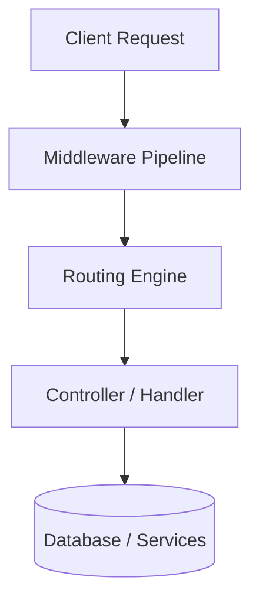
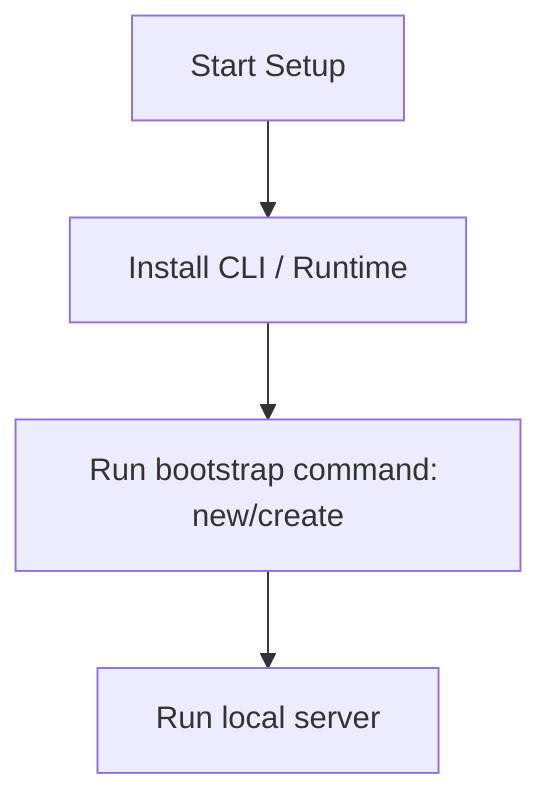

# NestJS Master Engineering Guide

A comprehensive, production-level, industry-grade guide to NestJS for software engineers, backend developers, frontend developers, full-stack developers, DevOps, and architects. NestJS is a framework for building efficient, scalable Node.js server-side applications using progressive JavaScript/TypeScript.

---

<ProgressTracker currentSection=1 totalSections=34 />

## 1. Introduction

### 1.1 Overview & Concepts
Detailed explanation of Introduction in NestJS. Built using TypeScript, NestJS provides rich abstractions for modern web or mobile workflows.

Configure security headers, rate limiting, and follow proper coding guidelines to build production-grade applications with NestJS.

### 1.2 Operations & Verification
Production and verification best practices for Introduction in NestJS.

```bash
# Run unit tests
npm run test
```

---

<ProgressTracker currentSection=2 totalSections=34 />

## 2. Why Use This Framework?

### 2.1 Overview & Concepts
Detailed explanation of Why Use This Framework? in NestJS. Built using TypeScript, NestJS provides rich abstractions for modern web or mobile workflows.

Configure security headers, rate limiting, and follow proper coding guidelines to build production-grade applications with NestJS.

### 2.2 Operations & Verification
Production and verification best practices for Why Use This Framework? in NestJS.

```bash
# Run End-to-End tests
npm run test:e2e
```

---

<ProgressTracker currentSection=3 totalSections=34 />

## 3. Architecture

### 3.1 Overview & Concepts
Detailed explanation of Architecture in NestJS. Built using TypeScript, NestJS provides rich abstractions for modern web or mobile workflows.



### 3.2 Operations & Verification
Production and verification best practices for Architecture in NestJS.

```bash
# Format code with Prettier
npm run format
```

---

<ProgressTracker currentSection=4 totalSections=34 />

## 4. Installation

### 4.1 Overview & Concepts
Detailed explanation of Installation in NestJS. Built using TypeScript, NestJS provides rich abstractions for modern web or mobile workflows.

#### Official Resources & Installation Flow
- **Download Link**: [Official NestJS Homepage](https://nestjs.dev) or [Package Registry](https://npmjs.com)



### 4.2 Project Scaffolding & Setup
Run the following NestJS CLI commands to create a new application:
```bash
# Install NestJS CLI globally and scaffold a new project
npm i -g @nestjs/cli
nest new mynestapp
cd mynestapp
```

---

<ProgressTracker currentSection=5 totalSections=34 />

## 5. Project Structure

### 5.1 Overview & Concepts
Detailed explanation of Project Structure in NestJS. Built using TypeScript, NestJS provides rich abstractions for modern web or mobile workflows.

```text
src/
├── controllers/
├── models/
├── routes/
├── services/
└── app.js
```

### 5.2 Operations & Verification
Production and verification best practices for Project Structure in NestJS.

```bash
# Generate a new controller using CLI
nest generate controller items
```

---

<ProgressTracker currentSection=6 totalSections=34 />

## 6. Getting Started

### 6.1 Overview & Concepts
Detailed explanation of Getting Started in NestJS. Built using TypeScript, NestJS provides rich abstractions for modern web or mobile workflows.

Here is a simple starting snippet:

```typescript
// First NestJS app
console.log('Hello from NestJS');
```

### 6.2 Running the Application
Run the following command to start the NestJS development server in watch mode:
```bash
# Start the NestJS development server in watch mode
npm run start:dev
```

---

<ProgressTracker currentSection=7 totalSections=34 />

## 7. Core Concepts

### 7.1 Overview & Concepts
Detailed explanation of Core Concepts in NestJS. Built using TypeScript, NestJS provides rich abstractions for modern web or mobile workflows.

Configure security headers, rate limiting, and follow proper coding guidelines to build production-grade applications with NestJS.

### 7.2 Operations & Verification
Production and verification best practices for Core Concepts in NestJS.

```bash
# Build the application for production
npm run build
```

---

<ProgressTracker currentSection=8 totalSections=34 />

## 8. Routing

### 8.1 Overview & Concepts
Detailed explanation of Routing in NestJS. Built using TypeScript, NestJS provides rich abstractions for modern web or mobile workflows.

Configure security headers, rate limiting, and follow proper coding guidelines to build production-grade applications with NestJS.

### 8.2 Operations & Verification
Production and verification best practices for Routing in NestJS.

```bash
# Lint code with ESLint
npm run lint
```

---

<ProgressTracker currentSection=9 totalSections=34 />

## 9. Middleware

### 9.1 Overview & Concepts
Detailed explanation of Middleware in NestJS. Built using TypeScript, NestJS provides rich abstractions for modern web or mobile workflows.

Configure security headers, rate limiting, and follow proper coding guidelines to build production-grade applications with NestJS.

### 9.2 Operations & Verification
Production and verification best practices for Middleware in NestJS.

```bash
# Run unit tests
npm run test
```

---

<ProgressTracker currentSection=10 totalSections=34 />

## 10. Request & Response Lifecycle

### 10.1 Overview & Concepts
Detailed explanation of Request & Response Lifecycle in NestJS. Built using TypeScript, NestJS provides rich abstractions for modern web or mobile workflows.

Configure security headers, rate limiting, and follow proper coding guidelines to build production-grade applications with NestJS.

### 10.2 Operations & Verification
Production and verification best practices for Request & Response Lifecycle in NestJS.

```bash
# Run End-to-End tests
npm run test:e2e
```

---

<ProgressTracker currentSection=11 totalSections=34 />

## 11. Dependency Injection (if supported)

### 11.1 Overview & Concepts
Detailed explanation of Dependency Injection (if supported) in NestJS. Built using TypeScript, NestJS provides rich abstractions for modern web or mobile workflows.

Configure security headers, rate limiting, and follow proper coding guidelines to build production-grade applications with NestJS.

### 11.2 Operations & Verification
Production and verification best practices for Dependency Injection (if supported) in NestJS.

```bash
# Format code with Prettier
npm run format
```

---

<ProgressTracker currentSection=12 totalSections=34 />

## 12. Configuration

### 12.1 Overview & Concepts
Detailed explanation of Configuration in NestJS. Built using TypeScript, NestJS provides rich abstractions for modern web or mobile workflows.

Configure security headers, rate limiting, and follow proper coding guidelines to build production-grade applications with NestJS.

### 12.2 Operations & Verification
Production and verification best practices for Configuration in NestJS.

```bash
# Generate a new controller using CLI
nest generate controller items
```

---

<ProgressTracker currentSection=13 totalSections=34 />

## 13. Database Integration

### 13.1 Overview & Concepts
Detailed explanation of Database Integration in NestJS. Built using TypeScript, NestJS provides rich abstractions for modern web or mobile workflows.

Configure security headers, rate limiting, and follow proper coding guidelines to build production-grade applications with NestJS.

### 13.2 Operations & Verification
Production and verification best practices for Database Integration in NestJS.

```bash
# Build the application for production
npm run build
```

---

<ProgressTracker currentSection=14 totalSections=34 />

## 14. Authentication

### 14.1 Overview & Concepts
Detailed explanation of Authentication in NestJS. Built using TypeScript, NestJS provides rich abstractions for modern web or mobile workflows.

Configure security headers, rate limiting, and follow proper coding guidelines to build production-grade applications with NestJS.

### 14.2 Operations & Verification
Production and verification best practices for Authentication in NestJS.

```bash
# Lint code with ESLint
npm run lint
```

---

<ProgressTracker currentSection=15 totalSections=34 />

## 15. Authorization

### 15.1 Overview & Concepts
Detailed explanation of Authorization in NestJS. Built using TypeScript, NestJS provides rich abstractions for modern web or mobile workflows.

Configure security headers, rate limiting, and follow proper coding guidelines to build production-grade applications with NestJS.

### 15.2 Operations & Verification
Production and verification best practices for Authorization in NestJS.

```bash
# Run unit tests
npm run test
```

---

<ProgressTracker currentSection=16 totalSections=34 />

## 16. Validation

### 16.1 Overview & Concepts
Detailed explanation of Validation in NestJS. Built using TypeScript, NestJS provides rich abstractions for modern web or mobile workflows.

Configure security headers, rate limiting, and follow proper coding guidelines to build production-grade applications with NestJS.

### 16.2 Operations & Verification
Production and verification best practices for Validation in NestJS.

```bash
# Run End-to-End tests
npm run test:e2e
```

---

<ProgressTracker currentSection=17 totalSections=34 />

## 17. Error Handling

### 17.1 Overview & Concepts
Detailed explanation of Error Handling in NestJS. Built using TypeScript, NestJS provides rich abstractions for modern web or mobile workflows.

Configure security headers, rate limiting, and follow proper coding guidelines to build production-grade applications with NestJS.

### 17.2 Operations & Verification
Production and verification best practices for Error Handling in NestJS.

```bash
# Format code with Prettier
npm run format
```

---

<ProgressTracker currentSection=18 totalSections=34 />

## 18. Caching

### 18.1 Overview & Concepts
Detailed explanation of Caching in NestJS. Built using TypeScript, NestJS provides rich abstractions for modern web or mobile workflows.

Configure security headers, rate limiting, and follow proper coding guidelines to build production-grade applications with NestJS.

### 18.2 Operations & Verification
Production and verification best practices for Caching in NestJS.

```bash
# Generate a new controller using CLI
nest generate controller items
```

---

<ProgressTracker currentSection=19 totalSections=34 />

## 19. Security

### 19.1 Overview & Concepts
Detailed explanation of Security in NestJS. Built using TypeScript, NestJS provides rich abstractions for modern web or mobile workflows.

Configure security headers, rate limiting, and follow proper coding guidelines to build production-grade applications with NestJS.

### 19.2 Operations & Verification
Production and verification best practices for Security in NestJS.

```bash
# Build the application for production
npm run build
```

---

<ProgressTracker currentSection=20 totalSections=34 />

## 20. Performance Optimization

### 20.1 Overview & Concepts
Detailed explanation of Performance Optimization in NestJS. Built using TypeScript, NestJS provides rich abstractions for modern web or mobile workflows.

Configure security headers, rate limiting, and follow proper coding guidelines to build production-grade applications with NestJS.

### 20.2 Operations & Verification
Production and verification best practices for Performance Optimization in NestJS.

```bash
# Lint code with ESLint
npm run lint
```

---

<ProgressTracker currentSection=21 totalSections=34 />

## 21. Testing

### 21.1 Overview & Concepts
Detailed explanation of Testing in NestJS. Built using TypeScript, NestJS provides rich abstractions for modern web or mobile workflows.

Configure security headers, rate limiting, and follow proper coding guidelines to build production-grade applications with NestJS.

### 21.2 Operations & Verification
Production and verification best practices for Testing in NestJS.

```bash
# Run unit tests
npm run test
```

---

<ProgressTracker currentSection=22 totalSections=34 />

## 22. Deployment

### 22.1 Overview & Concepts
Detailed explanation of Deployment in NestJS. Built using TypeScript, NestJS provides rich abstractions for modern web or mobile workflows.

Configure security headers, rate limiting, and follow proper coding guidelines to build production-grade applications with NestJS.

### 22.2 Operations & Verification
Production and verification best practices for Deployment in NestJS.

```bash
# Run End-to-End tests
npm run test:e2e
```

---

<ProgressTracker currentSection=23 totalSections=34 />

## 23. Monitoring

### 23.1 Overview & Concepts
Detailed explanation of Monitoring in NestJS. Built using TypeScript, NestJS provides rich abstractions for modern web or mobile workflows.

Configure security headers, rate limiting, and follow proper coding guidelines to build production-grade applications with NestJS.

### 23.2 Operations & Verification
Production and verification best practices for Monitoring in NestJS.

```bash
# Format code with Prettier
npm run format
```

---

<ProgressTracker currentSection=24 totalSections=34 />

## 24. Microservices

### 24.1 Overview & Concepts
Detailed explanation of Microservices in NestJS. Built using TypeScript, NestJS provides rich abstractions for modern web or mobile workflows.

Configure security headers, rate limiting, and follow proper coding guidelines to build production-grade applications with NestJS.

### 24.2 Operations & Verification
Production and verification best practices for Microservices in NestJS.

```bash
# Generate a new controller using CLI
nest generate controller items
```

---

<ProgressTracker currentSection=25 totalSections=34 />

## 25. AI Integration

### 25.1 Overview & Concepts
Detailed explanation of AI Integration in NestJS. Built using TypeScript, NestJS provides rich abstractions for modern web or mobile workflows.

Integrating OpenAI or Bedrock in NestJS is straightforward using direct client SDKs:

```typescript
import { OpenAI } from 'openai';
const openai = new OpenAI();
const completion = await openai.chat.completions.create({ model: 'gpt-4', messages: [{ role: 'user', content: 'Hello' }] });
console.log(completion.choices[0].message.content);
```

### 25.2 Operations & Verification
Production and verification best practices for AI Integration in NestJS.

```bash
# Build the application for production
npm run build
```

---

<ProgressTracker currentSection=26 totalSections=34 />

## 26. Production Architecture

### 26.1 Overview & Concepts
Detailed explanation of Production Architecture in NestJS. Built using TypeScript, NestJS provides rich abstractions for modern web or mobile workflows.

Configure security headers, rate limiting, and follow proper coding guidelines to build production-grade applications with NestJS.

### 26.2 Operations & Verification
Production and verification best practices for Production Architecture in NestJS.

```bash
# Lint code with ESLint
npm run lint
```

---

<ProgressTracker currentSection=27 totalSections=34 />

## 27. Best Practices

### 27.1 Overview & Concepts
Detailed explanation of Best Practices in NestJS. Built using TypeScript, NestJS provides rich abstractions for modern web or mobile workflows.

Configure security headers, rate limiting, and follow proper coding guidelines to build production-grade applications with NestJS.

### 27.2 Operations & Verification
Production and verification best practices for Best Practices in NestJS.

```bash
# Run unit tests
npm run test
```

---

<ProgressTracker currentSection=28 totalSections=34 />

## 28. Common Errors

### 28.1 Overview & Concepts
Detailed explanation of Common Errors in NestJS. Built using TypeScript, NestJS provides rich abstractions for modern web or mobile workflows.

Configure security headers, rate limiting, and follow proper coding guidelines to build production-grade applications with NestJS.

### 28.2 Operations & Verification
Production and verification best practices for Common Errors in NestJS.

```bash
# Run End-to-End tests
npm run test:e2e
```

---

<ProgressTracker currentSection=29 totalSections=34 />

## 29. Interview Questions

### 29.1 Overview & Concepts
Detailed explanation of Interview Questions in NestJS. Built using TypeScript, NestJS provides rich abstractions for modern web or mobile workflows.

Configure security headers, rate limiting, and follow proper coding guidelines to build production-grade applications with NestJS.

### 29.2 Operations & Verification
Production and verification best practices for Interview Questions in NestJS.

```bash
# Format code with Prettier
npm run format
```

---

<ProgressTracker currentSection=30 totalSections=34 />

## 30. Cheat Sheet

### 30.1 Overview & Concepts
Detailed explanation of Cheat Sheet in NestJS. Built using TypeScript, NestJS provides rich abstractions for modern web or mobile workflows.

Configure security headers, rate limiting, and follow proper coding guidelines to build production-grade applications with NestJS.

### 30.2 Operations & Verification
Production and verification best practices for Cheat Sheet in NestJS.

```bash
# Generate a new controller using CLI
nest generate controller items
```

---

<ProgressTracker currentSection=31 totalSections=34 />

## 31. Hands-on Projects

### 31.1 Overview & Concepts
Detailed explanation of Hands-on Projects in NestJS. Built using TypeScript, NestJS provides rich abstractions for modern web or mobile workflows.

Configure security headers, rate limiting, and follow proper coding guidelines to build production-grade applications with NestJS.

### 31.2 Operations & Verification
Production and verification best practices for Hands-on Projects in NestJS.

```bash
# Build the application for production
npm run build
```

---

<ProgressTracker currentSection=32 totalSections=34 />

## 32. Learning Roadmap

### 32.1 Overview & Concepts
Detailed explanation of Learning Roadmap in NestJS. Built using TypeScript, NestJS provides rich abstractions for modern web or mobile workflows.

Configure security headers, rate limiting, and follow proper coding guidelines to build production-grade applications with NestJS.

### 32.2 Operations & Verification
Production and verification best practices for Learning Roadmap in NestJS.

```bash
# Lint code with ESLint
npm run lint
```

---

<ProgressTracker currentSection=33 totalSections=34 />

## 33. Final Summary

### 33.1 Overview & Concepts
Detailed explanation of Final Summary in NestJS. Built using TypeScript, NestJS provides rich abstractions for modern web or mobile workflows.

Configure security headers, rate limiting, and follow proper coding guidelines to build production-grade applications with NestJS.

### 33.2 Operations & Verification
Production and verification best practices for Final Summary in NestJS.

```bash
# Run unit tests
npm run test
```

---

---

<ProgressTracker currentSection=34 totalSections=34 />

## 34. Project Creation & Execution Commands

### Scaffolding a New Project
```bash
# Install NestJS CLI globally and scaffold a new project
npm i -g @nestjs/cli
nest new mynestapp
cd mynestapp
```

### Running the Application
```bash
# Start the NestJS development server in watch mode
npm run start:dev
```

---

### Knowledge Verification Check

<Quiz 
  question="How does Node.js handle asynchronous operations if JavaScript is single-threaded?" 
  options=["By spawning a new CPU thread for each async callback.", "Using an Event Loop to offload non-blocking I/O tasks to the OS kernel or a thread pool, processing results sequentially when the call stack is empty.", "By compiling JavaScript code to a multithreaded native application.", "Through cooperative process-forking on multi-core servers."] 
  answerIndex=1 
  explanation="Node.js uses a single-threaded Event Loop that delegates asynchronous tasks (such as network or file operations) to system APIs or libuv's thread pool, processing callbacks sequentially." 
/>

<Quiz 
  question="What are the states of a JavaScript Promise?" 
  options=["Started, Running, Stopped.", "pending, fulfilled, rejected.", "Active, Resolved, Terminated.", "Waiting, Done, Failed."] 
  answerIndex=1 
  explanation="A Promise is always in one of three mutually exclusive states: pending (initial state), fulfilled (operation completed successfully), or rejected (operation failed)." 
/>

<Quiz 
  question="How does `async/await` relate to JavaScript Promises?" 
  options=["It compiles Javascript to native asynchronous C code.", "It is syntactic sugar built on top of Promises, making asynchronous code write and read like synchronous code.", "It deletes Promises entirely from runtime memory.", "It forces callbacks to run in parallel threads."] 
  answerIndex=1 
  explanation="`async` functions automatically return a Promise. The `await` keyword pauses execution of the async function until the awaited Promise resolves, making async code highly readable." 
/>

<Quiz 
  question="What parameters do Express.js middleware functions receive in their execution signature?" 
  options=["Only the request object (`req`).", "The Request (`req`), Response (`res`), and a call-forwarding function (`next`).", "The database client and router instances.", "System process and port information."] 
  answerIndex=1 
  explanation="Express middleware signature accepts `(req, res, next)`. This gives it access to request data, response handling, and control routing to subsequent handlers via `next()`." 
/>

<Quiz 
  question="What is a closure in JavaScript?" 
  options=["A function that automatically closes database connections.", "The combination of a function bundled together with references to its surrounding state (the lexical environment).", "A compile-time block syntax warning.", "An object that cannot hold properties."] 
  answerIndex=1 
  explanation="A closure allows an inner function to access variables from its outer (enclosing) scope even after the outer function has finished executing." 
/>

<Quiz 
  question="What is the difference between CommonJS and ES Modules (ESM) in Node.js?" 
  options=["CommonJS uses `require()` and `module.exports`, while ES Modules use `import` and `export` statements.", "CommonJS is asynchronous, while ESM is synchronous.", "CommonJS runs only in the browser, while ESM runs only in Node.js.", "There is no difference in syntax."] 
  answerIndex=0 
  explanation="CommonJS is Node's historical module system using `require`/`module.exports`. ESM is the ES6 standard using `import`/`export`, which supports static analysis and tree shaking." 
/>

<Quiz 
  question="Which C++ library does Node.js rely on to manage its thread pool and asynchronous event processing?" 
  options=["V8", "libuv", "Webpack", "Boost"] 
  answerIndex=1 
  explanation="Node.js uses the libuv library to handle the event loop, thread pool workers, file system notifications, and asynchronous networking events." 
/>

<Quiz 
  question="How does prototypical inheritance work in JavaScript?" 
  options=["Objects copy all properties from a class blueprint on instantiation.", "Objects inherit properties and methods directly from other objects via a prototype chain link.", "Inheritance is resolved strictly at compile time.", "JavaScript does not support inheritance."] 
  answerIndex=1 
  explanation="Every JS object has a link to a prototype object. When a property or method is requested, JS searches the object first, then traverses up the prototype chain until found or null is reached." 
/>

<Quiz 
  question="What is the scoping difference between `var`, `let`, and `const`?" 
  options=["`var` is block-scoped, while `let` and `const` are function-scoped.", "`var` is function-scoped (or global), while `let` and `const` are block-scoped.", "`const` is globally scoped, while `let` is locally scoped.", "All three share identical scoping rules."] 
  answerIndex=1 
  explanation="`var` is scoped to its declaring function. `let` and `const` are block-scoped (scoped to the nearest `{}` block). Additionally, `const` cannot be reassigned." 
/>

<Quiz 
  question="Which array method returns a single accumulated value by running a callback on each element?" 
  options=["map", "filter", "reduce", "forEach"] 
  answerIndex=2 
  explanation="The `reduce` method executes a reducer function on each array element, accumulating the results into a single value (e.g. summing numbers)." 
/>

<Quiz 
  question="What is the difference between `==` and `===` operators in JavaScript?" 
  options=["`==` is strict equality, while `===` performs type coercion.", "`==` performs type coercion before comparison, while `===` compares both value and type strictly.", "They behave identically.", "`==` is used for objects, `===` is used for primitive types."] 
  answerIndex=1 
  explanation="The loose equality operator (`==`) converts operands to a common type (coercion) before comparing. The strict equality operator (`===`) compares value and type without conversion." 
/>

<Quiz 
  question="What is the purpose of Node's `EventEmitter` class?" 
  options=["To manage browser mouse click events.", "To implement the observer pattern, allowing objects to emit named events that trigger registered listener callbacks.", "To execute database transactions.", "To create child server processes."] 
  answerIndex=1 
  explanation="The `EventEmitter` class in Node's `events` module enables event-driven programming, facilitating asynchronous communication between different components of an app." 
/>
