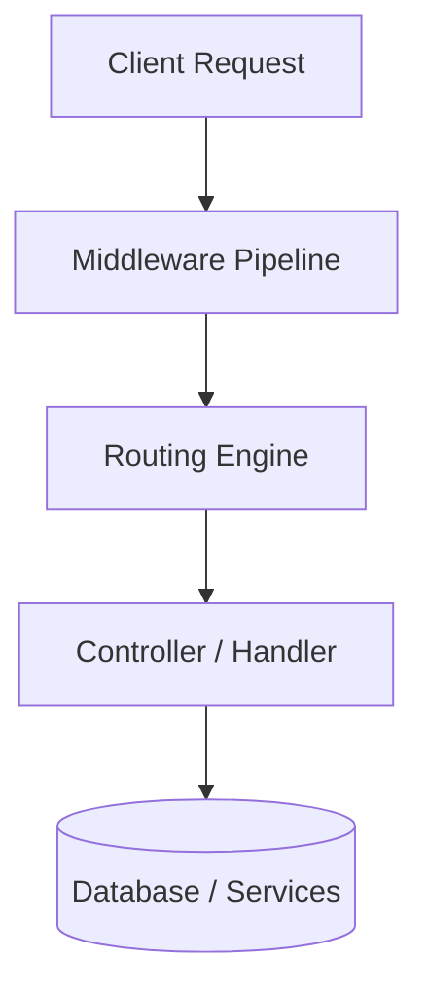
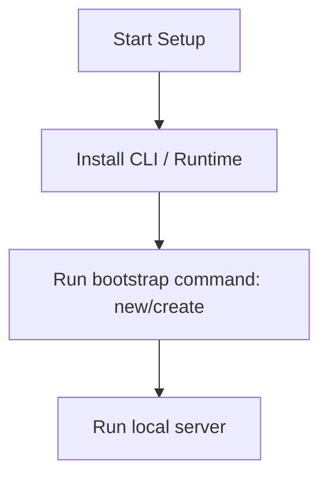

# Spring Boot Master Engineering Guide

A comprehensive, production-level, industry-grade guide to Spring Boot for software engineers, backend developers, frontend developers, full-stack developers, DevOps, and architects. Spring Boot makes it easy to create stand-alone, production-grade Spring-based Applications that you can 'just run'.

---

## 1. Introduction

### 1.1 Overview & Concepts
Detailed explanation of Introduction in Spring Boot. Built using Java/Kotlin, Spring Boot provides rich abstractions for modern web or mobile workflows.

Configure security headers, rate limiting, and follow proper coding guidelines to build production-grade applications with Spring Boot.

### 1.2 Operations & Verification
Production and verification best practices for Introduction in Spring Boot.

> [!NOTE]
> Always refer to the official Spring Boot configuration guide for the latest security guidelines.

---

## 2. Why Use This Framework?

### 2.1 Overview & Concepts
Detailed explanation of Why Use This Framework? in Spring Boot. Built using Java/Kotlin, Spring Boot provides rich abstractions for modern web or mobile workflows.

Configure security headers, rate limiting, and follow proper coding guidelines to build production-grade applications with Spring Boot.

### 2.2 Operations & Verification
Production and verification best practices for Why Use This Framework? in Spring Boot.

> [!NOTE]
> Always refer to the official Spring Boot configuration guide for the latest security guidelines.

---

## 3. Architecture

### 3.1 Overview & Concepts
Detailed explanation of Architecture in Spring Boot. Built using Java/Kotlin, Spring Boot provides rich abstractions for modern web or mobile workflows.



### 3.2 Operations & Verification
Production and verification best practices for Architecture in Spring Boot.

> [!NOTE]
> Always refer to the official Spring Boot configuration guide for the latest security guidelines.

---

## 4. Installation

### 4.1 Overview & Concepts
Detailed explanation of Installation in Spring Boot. Built using Java/Kotlin, Spring Boot provides rich abstractions for modern web or mobile workflows.

#### Official Resources & Installation Flow
- **Download Link**: [Official Spring Boot Homepage](https://springboot.dev) or [Package Registry](https://npmjs.com)



### 4.2 Operations & Verification
Production and verification best practices for Installation in Spring Boot.

> [!NOTE]
> Always refer to the official Spring Boot configuration guide for the latest security guidelines.

---

## 5. Project Structure

### 5.1 Overview & Concepts
Detailed explanation of Project Structure in Spring Boot. Built using Java/Kotlin, Spring Boot provides rich abstractions for modern web or mobile workflows.

```text
src/
├── controllers/
├── models/
├── routes/
├── services/
└── app.js
```

### 5.2 Operations & Verification
Production and verification best practices for Project Structure in Spring Boot.

> [!NOTE]
> Always refer to the official Spring Boot configuration guide for the latest security guidelines.

---

## 6. Getting Started

### 6.1 Overview & Concepts
Detailed explanation of Getting Started in Spring Boot. Built using Java/Kotlin, Spring Boot provides rich abstractions for modern web or mobile workflows.

Here is a simple starting snippet:

```java
// First Spring Boot app
System.out.println("Hello from Spring Boot");
```

### 6.2 Operations & Verification
Production and verification best practices for Getting Started in Spring Boot.

> [!NOTE]
> Always refer to the official Spring Boot configuration guide for the latest security guidelines.

---

## 7. Core Concepts

### 7.1 Overview & Concepts
Detailed explanation of Core Concepts in Spring Boot. Built using Java/Kotlin, Spring Boot provides rich abstractions for modern web or mobile workflows.

Configure security headers, rate limiting, and follow proper coding guidelines to build production-grade applications with Spring Boot.

### 7.2 Operations & Verification
Production and verification best practices for Core Concepts in Spring Boot.

> [!NOTE]
> Always refer to the official Spring Boot configuration guide for the latest security guidelines.

---

## 8. Routing

### 8.1 Overview & Concepts
Detailed explanation of Routing in Spring Boot. Built using Java/Kotlin, Spring Boot provides rich abstractions for modern web or mobile workflows.

Configure security headers, rate limiting, and follow proper coding guidelines to build production-grade applications with Spring Boot.

### 8.2 Operations & Verification
Production and verification best practices for Routing in Spring Boot.

> [!NOTE]
> Always refer to the official Spring Boot configuration guide for the latest security guidelines.

---

## 9. Middleware

### 9.1 Overview & Concepts
Detailed explanation of Middleware in Spring Boot. Built using Java/Kotlin, Spring Boot provides rich abstractions for modern web or mobile workflows.

Configure security headers, rate limiting, and follow proper coding guidelines to build production-grade applications with Spring Boot.

### 9.2 Operations & Verification
Production and verification best practices for Middleware in Spring Boot.

> [!NOTE]
> Always refer to the official Spring Boot configuration guide for the latest security guidelines.

---

## 10. Request & Response Lifecycle

### 10.1 Overview & Concepts
Detailed explanation of Request & Response Lifecycle in Spring Boot. Built using Java/Kotlin, Spring Boot provides rich abstractions for modern web or mobile workflows.

Configure security headers, rate limiting, and follow proper coding guidelines to build production-grade applications with Spring Boot.

### 10.2 Operations & Verification
Production and verification best practices for Request & Response Lifecycle in Spring Boot.

> [!NOTE]
> Always refer to the official Spring Boot configuration guide for the latest security guidelines.

---

## 11. Dependency Injection (if supported)

### 11.1 Overview & Concepts
Detailed explanation of Dependency Injection (if supported) in Spring Boot. Built using Java/Kotlin, Spring Boot provides rich abstractions for modern web or mobile workflows.

Configure security headers, rate limiting, and follow proper coding guidelines to build production-grade applications with Spring Boot.

### 11.2 Operations & Verification
Production and verification best practices for Dependency Injection (if supported) in Spring Boot.

> [!NOTE]
> Always refer to the official Spring Boot configuration guide for the latest security guidelines.

---

## 12. Configuration

### 12.1 Overview & Concepts
Detailed explanation of Configuration in Spring Boot. Built using Java/Kotlin, Spring Boot provides rich abstractions for modern web or mobile workflows.

Configure security headers, rate limiting, and follow proper coding guidelines to build production-grade applications with Spring Boot.

### 12.2 Operations & Verification
Production and verification best practices for Configuration in Spring Boot.

> [!NOTE]
> Always refer to the official Spring Boot configuration guide for the latest security guidelines.

---

## 13. Database Integration

### 13.1 Overview & Concepts
Detailed explanation of Database Integration in Spring Boot. Built using Java/Kotlin, Spring Boot provides rich abstractions for modern web or mobile workflows.

Configure security headers, rate limiting, and follow proper coding guidelines to build production-grade applications with Spring Boot.

### 13.2 Operations & Verification
Production and verification best practices for Database Integration in Spring Boot.

> [!NOTE]
> Always refer to the official Spring Boot configuration guide for the latest security guidelines.

---

## 14. Authentication

### 14.1 Overview & Concepts
Detailed explanation of Authentication in Spring Boot. Built using Java/Kotlin, Spring Boot provides rich abstractions for modern web or mobile workflows.

Configure security headers, rate limiting, and follow proper coding guidelines to build production-grade applications with Spring Boot.

### 14.2 Operations & Verification
Production and verification best practices for Authentication in Spring Boot.

> [!NOTE]
> Always refer to the official Spring Boot configuration guide for the latest security guidelines.

---

## 15. Authorization

### 15.1 Overview & Concepts
Detailed explanation of Authorization in Spring Boot. Built using Java/Kotlin, Spring Boot provides rich abstractions for modern web or mobile workflows.

Configure security headers, rate limiting, and follow proper coding guidelines to build production-grade applications with Spring Boot.

### 15.2 Operations & Verification
Production and verification best practices for Authorization in Spring Boot.

> [!NOTE]
> Always refer to the official Spring Boot configuration guide for the latest security guidelines.

---

## 16. Validation

### 16.1 Overview & Concepts
Detailed explanation of Validation in Spring Boot. Built using Java/Kotlin, Spring Boot provides rich abstractions for modern web or mobile workflows.

Configure security headers, rate limiting, and follow proper coding guidelines to build production-grade applications with Spring Boot.

### 16.2 Operations & Verification
Production and verification best practices for Validation in Spring Boot.

> [!NOTE]
> Always refer to the official Spring Boot configuration guide for the latest security guidelines.

---

## 17. Error Handling

### 17.1 Overview & Concepts
Detailed explanation of Error Handling in Spring Boot. Built using Java/Kotlin, Spring Boot provides rich abstractions for modern web or mobile workflows.

Configure security headers, rate limiting, and follow proper coding guidelines to build production-grade applications with Spring Boot.

### 17.2 Operations & Verification
Production and verification best practices for Error Handling in Spring Boot.

> [!NOTE]
> Always refer to the official Spring Boot configuration guide for the latest security guidelines.

---

## 18. Caching

### 18.1 Overview & Concepts
Detailed explanation of Caching in Spring Boot. Built using Java/Kotlin, Spring Boot provides rich abstractions for modern web or mobile workflows.

Configure security headers, rate limiting, and follow proper coding guidelines to build production-grade applications with Spring Boot.

### 18.2 Operations & Verification
Production and verification best practices for Caching in Spring Boot.

> [!NOTE]
> Always refer to the official Spring Boot configuration guide for the latest security guidelines.

---

## 19. Security

### 19.1 Overview & Concepts
Detailed explanation of Security in Spring Boot. Built using Java/Kotlin, Spring Boot provides rich abstractions for modern web or mobile workflows.

Configure security headers, rate limiting, and follow proper coding guidelines to build production-grade applications with Spring Boot.

### 19.2 Operations & Verification
Production and verification best practices for Security in Spring Boot.

> [!NOTE]
> Always refer to the official Spring Boot configuration guide for the latest security guidelines.

---

## 20. Performance Optimization

### 20.1 Overview & Concepts
Detailed explanation of Performance Optimization in Spring Boot. Built using Java/Kotlin, Spring Boot provides rich abstractions for modern web or mobile workflows.

Configure security headers, rate limiting, and follow proper coding guidelines to build production-grade applications with Spring Boot.

### 20.2 Operations & Verification
Production and verification best practices for Performance Optimization in Spring Boot.

> [!NOTE]
> Always refer to the official Spring Boot configuration guide for the latest security guidelines.

---

## 21. Testing

### 21.1 Overview & Concepts
Detailed explanation of Testing in Spring Boot. Built using Java/Kotlin, Spring Boot provides rich abstractions for modern web or mobile workflows.

Configure security headers, rate limiting, and follow proper coding guidelines to build production-grade applications with Spring Boot.

### 21.2 Operations & Verification
Production and verification best practices for Testing in Spring Boot.

> [!NOTE]
> Always refer to the official Spring Boot configuration guide for the latest security guidelines.

---

## 22. Deployment

### 22.1 Overview & Concepts
Detailed explanation of Deployment in Spring Boot. Built using Java/Kotlin, Spring Boot provides rich abstractions for modern web or mobile workflows.

Configure security headers, rate limiting, and follow proper coding guidelines to build production-grade applications with Spring Boot.

### 22.2 Operations & Verification
Production and verification best practices for Deployment in Spring Boot.

> [!NOTE]
> Always refer to the official Spring Boot configuration guide for the latest security guidelines.

---

## 23. Monitoring

### 23.1 Overview & Concepts
Detailed explanation of Monitoring in Spring Boot. Built using Java/Kotlin, Spring Boot provides rich abstractions for modern web or mobile workflows.

Configure security headers, rate limiting, and follow proper coding guidelines to build production-grade applications with Spring Boot.

### 23.2 Operations & Verification
Production and verification best practices for Monitoring in Spring Boot.

> [!NOTE]
> Always refer to the official Spring Boot configuration guide for the latest security guidelines.

---

## 24. Microservices

### 24.1 Overview & Concepts
Detailed explanation of Microservices in Spring Boot. Built using Java/Kotlin, Spring Boot provides rich abstractions for modern web or mobile workflows.

Configure security headers, rate limiting, and follow proper coding guidelines to build production-grade applications with Spring Boot.

### 24.2 Operations & Verification
Production and verification best practices for Microservices in Spring Boot.

> [!NOTE]
> Always refer to the official Spring Boot configuration guide for the latest security guidelines.

---

## 25. AI Integration

### 25.1 Overview & Concepts
Detailed explanation of AI Integration in Spring Boot. Built using Java/Kotlin, Spring Boot provides rich abstractions for modern web or mobile workflows.

Integrating OpenAI or Bedrock in Spring Boot is straightforward using direct client SDKs:

```typescript
import { OpenAI } from 'openai';
const openai = new OpenAI();
const completion = await openai.chat.completions.create({ model: 'gpt-4', messages: [{ role: 'user', content: 'Hello' }] });
console.log(completion.choices[0].message.content);
```

### 25.2 Operations & Verification
Production and verification best practices for AI Integration in Spring Boot.

> [!NOTE]
> Always refer to the official Spring Boot configuration guide for the latest security guidelines.

---

## 26. Production Architecture

### 26.1 Overview & Concepts
Detailed explanation of Production Architecture in Spring Boot. Built using Java/Kotlin, Spring Boot provides rich abstractions for modern web or mobile workflows.

Configure security headers, rate limiting, and follow proper coding guidelines to build production-grade applications with Spring Boot.

### 26.2 Operations & Verification
Production and verification best practices for Production Architecture in Spring Boot.

> [!NOTE]
> Always refer to the official Spring Boot configuration guide for the latest security guidelines.

---

## 27. Best Practices

### 27.1 Overview & Concepts
Detailed explanation of Best Practices in Spring Boot. Built using Java/Kotlin, Spring Boot provides rich abstractions for modern web or mobile workflows.

Configure security headers, rate limiting, and follow proper coding guidelines to build production-grade applications with Spring Boot.

### 27.2 Operations & Verification
Production and verification best practices for Best Practices in Spring Boot.

> [!NOTE]
> Always refer to the official Spring Boot configuration guide for the latest security guidelines.

---

## 28. Common Errors

### 28.1 Overview & Concepts
Detailed explanation of Common Errors in Spring Boot. Built using Java/Kotlin, Spring Boot provides rich abstractions for modern web or mobile workflows.

Configure security headers, rate limiting, and follow proper coding guidelines to build production-grade applications with Spring Boot.

### 28.2 Operations & Verification
Production and verification best practices for Common Errors in Spring Boot.

> [!NOTE]
> Always refer to the official Spring Boot configuration guide for the latest security guidelines.

---

## 29. Interview Questions

### 29.1 Overview & Concepts
Detailed explanation of Interview Questions in Spring Boot. Built using Java/Kotlin, Spring Boot provides rich abstractions for modern web or mobile workflows.

Configure security headers, rate limiting, and follow proper coding guidelines to build production-grade applications with Spring Boot.

### 29.2 Operations & Verification
Production and verification best practices for Interview Questions in Spring Boot.

> [!NOTE]
> Always refer to the official Spring Boot configuration guide for the latest security guidelines.

---

## 30. Cheat Sheet

### 30.1 Overview & Concepts
Detailed explanation of Cheat Sheet in Spring Boot. Built using Java/Kotlin, Spring Boot provides rich abstractions for modern web or mobile workflows.

Configure security headers, rate limiting, and follow proper coding guidelines to build production-grade applications with Spring Boot.

### 30.2 Operations & Verification
Production and verification best practices for Cheat Sheet in Spring Boot.

> [!NOTE]
> Always refer to the official Spring Boot configuration guide for the latest security guidelines.

---

## 31. Hands-on Projects

### 31.1 Overview & Concepts
Detailed explanation of Hands-on Projects in Spring Boot. Built using Java/Kotlin, Spring Boot provides rich abstractions for modern web or mobile workflows.

Configure security headers, rate limiting, and follow proper coding guidelines to build production-grade applications with Spring Boot.

### 31.2 Operations & Verification
Production and verification best practices for Hands-on Projects in Spring Boot.

> [!NOTE]
> Always refer to the official Spring Boot configuration guide for the latest security guidelines.

---

## 32. Learning Roadmap

### 32.1 Overview & Concepts
Detailed explanation of Learning Roadmap in Spring Boot. Built using Java/Kotlin, Spring Boot provides rich abstractions for modern web or mobile workflows.

Configure security headers, rate limiting, and follow proper coding guidelines to build production-grade applications with Spring Boot.

### 32.2 Operations & Verification
Production and verification best practices for Learning Roadmap in Spring Boot.

> [!NOTE]
> Always refer to the official Spring Boot configuration guide for the latest security guidelines.

---

## 33. Final Summary

### 33.1 Overview & Concepts
Detailed explanation of Final Summary in Spring Boot. Built using Java/Kotlin, Spring Boot provides rich abstractions for modern web or mobile workflows.

Configure security headers, rate limiting, and follow proper coding guidelines to build production-grade applications with Spring Boot.

### 33.2 Operations & Verification
Production and verification best practices for Final Summary in Spring Boot.

> [!NOTE]
> Always refer to the official Spring Boot configuration guide for the latest security guidelines.

---

