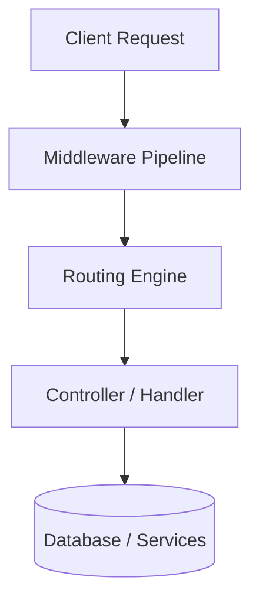
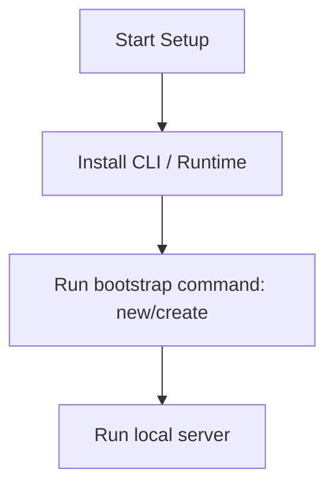

# Spring Boot Master Engineering Guide

A comprehensive, production-level, industry-grade guide to Spring Boot for software engineers, backend developers, frontend developers, full-stack developers, DevOps, and architects. Spring Boot makes it easy to create stand-alone, production-grade Spring-based Applications that you can 'just run'.

---

<ProgressTracker currentSection=1 totalSections=34 />

## 1. Introduction

### 1.1 Overview & Concepts
Detailed explanation of Introduction in Spring Boot. Built using Java/Kotlin, Spring Boot provides rich abstractions for modern web or mobile workflows.

Configure security headers, rate limiting, and follow proper coding guidelines to build production-grade applications with Spring Boot.

### 1.2 Operations & Verification
Production and verification best practices for Introduction in Spring Boot.

```bash
# Run all Spring Boot unit tests
./mvnw test
```

---

<ProgressTracker currentSection=2 totalSections=34 />

## 2. Why Use This Framework?

### 2.1 Overview & Concepts
Detailed explanation of Why Use This Framework? in Spring Boot. Built using Java/Kotlin, Spring Boot provides rich abstractions for modern web or mobile workflows.

Configure security headers, rate limiting, and follow proper coding guidelines to build production-grade applications with Spring Boot.

### 2.2 Operations & Verification
Production and verification best practices for Why Use This Framework? in Spring Boot.

```bash
# Clear the build cache and compile the project
./mvnw clean compile
```

---

<ProgressTracker currentSection=3 totalSections=34 />

## 3. Architecture

### 3.1 Overview & Concepts
Detailed explanation of Architecture in Spring Boot. Built using Java/Kotlin, Spring Boot provides rich abstractions for modern web or mobile workflows.



### 3.2 Operations & Verification
Production and verification best practices for Architecture in Spring Boot.

```bash
# Run checkstyle to verify code formatting
./mvnw checkstyle:check
```

---

<ProgressTracker currentSection=4 totalSections=34 />

## 4. Installation

### 4.1 Overview & Concepts
Detailed explanation of Installation in Spring Boot. Built using Java/Kotlin, Spring Boot provides rich abstractions for modern web or mobile workflows.

#### Official Resources & Installation Flow
- **Download Link**: [Official Spring Boot Homepage](https://springboot.dev) or [Package Registry](https://npmjs.com)



### 4.2 Project Scaffolding & Setup
Run the following curl command to download a bootstrapped Spring Boot web application:
```bash
# Use Spring Initializr CLI to scaffold a new project (Maven / Java 21)
curl https://start.spring.io/starter.zip -d dependencies=web -d javaVersion=21 -o myspringapp.zip
unzip myspringapp.zip -d myspringapp
cd myspringapp
```

---

<ProgressTracker currentSection=5 totalSections=34 />

## 5. Project Structure

### 5.1 Overview & Concepts
Detailed explanation of Project Structure in Spring Boot. Built using Java/Kotlin, Spring Boot provides rich abstractions for modern web or mobile workflows.

```text
src/
├── controllers/
├── models/
├── routes/
├── services/
└── app.js
```

### 5.2 Operations & Verification
Production and verification best practices for Project Structure in Spring Boot.

```bash
# Show dependency hierarchy tree
./mvnw dependency:tree
```

---

<ProgressTracker currentSection=6 totalSections=34 />

## 6. Getting Started

### 6.1 Overview & Concepts
Detailed explanation of Getting Started in Spring Boot. Built using Java/Kotlin, Spring Boot provides rich abstractions for modern web or mobile workflows.

Here is a simple starting snippet:

<Tabs>
  <Tab label="Syntax & Example">

```java
// First Spring Boot app
System.out.println("Hello from Spring Boot");
```

  </Tab>
  <Tab label="Interactive Playground">
    <InteractiveExample 
      language="java"
      initialCode="// First Spring Boot app\nSystem.out.println(\"Hello from Spring Boot\");" 
      instruction="Execute and edit this JAVA example."
    />
  </Tab>
</Tabs>

### 6.2 Running the Application
Run the following command using the Maven Wrapper to run the Spring Boot project:
```bash
# Run the Spring Boot application using Maven Wrapper
./mvnw spring-boot:run
```

---

<ProgressTracker currentSection=7 totalSections=34 />

## 7. Core Concepts

### 7.1 Overview & Concepts
Detailed explanation of Core Concepts in Spring Boot. Built using Java/Kotlin, Spring Boot provides rich abstractions for modern web or mobile workflows.

Configure security headers, rate limiting, and follow proper coding guidelines to build production-grade applications with Spring Boot.

### 7.2 Operations & Verification
Production and verification best practices for Core Concepts in Spring Boot.

```bash
# For Gradle: clean and test the project
./gradlew clean test
```

---

<ProgressTracker currentSection=8 totalSections=34 />

## 8. Routing

### 8.1 Overview & Concepts
Detailed explanation of Routing in Spring Boot. Built using Java/Kotlin, Spring Boot provides rich abstractions for modern web or mobile workflows.

Configure security headers, rate limiting, and follow proper coding guidelines to build production-grade applications with Spring Boot.

### 8.2 Operations & Verification
Production and verification best practices for Routing in Spring Boot.

```bash
# Run all Spring Boot unit tests
./mvnw test
```

---

<ProgressTracker currentSection=9 totalSections=34 />

## 9. Middleware

### 9.1 Overview & Concepts
Detailed explanation of Middleware in Spring Boot. Built using Java/Kotlin, Spring Boot provides rich abstractions for modern web or mobile workflows.

Configure security headers, rate limiting, and follow proper coding guidelines to build production-grade applications with Spring Boot.

### 9.2 Operations & Verification
Production and verification best practices for Middleware in Spring Boot.

```bash
# Clear the build cache and compile the project
./mvnw clean compile
```

---

<ProgressTracker currentSection=10 totalSections=34 />

## 10. Request & Response Lifecycle

### 10.1 Overview & Concepts
Detailed explanation of Request & Response Lifecycle in Spring Boot. Built using Java/Kotlin, Spring Boot provides rich abstractions for modern web or mobile workflows.

Configure security headers, rate limiting, and follow proper coding guidelines to build production-grade applications with Spring Boot.

### 10.2 Operations & Verification
Production and verification best practices for Request & Response Lifecycle in Spring Boot.

```bash
# Run checkstyle to verify code formatting
./mvnw checkstyle:check
```

---

<ProgressTracker currentSection=11 totalSections=34 />

## 11. Dependency Injection (if supported)

### 11.1 Overview & Concepts
Detailed explanation of Dependency Injection (if supported) in Spring Boot. Built using Java/Kotlin, Spring Boot provides rich abstractions for modern web or mobile workflows.

Configure security headers, rate limiting, and follow proper coding guidelines to build production-grade applications with Spring Boot.

### 11.2 Operations & Verification
Production and verification best practices for Dependency Injection (if supported) in Spring Boot.

```bash
# Show dependency hierarchy tree
./mvnw dependency:tree
```

---

<ProgressTracker currentSection=12 totalSections=34 />

## 12. Configuration

### 12.1 Overview & Concepts
Detailed explanation of Configuration in Spring Boot. Built using Java/Kotlin, Spring Boot provides rich abstractions for modern web or mobile workflows.

Configure security headers, rate limiting, and follow proper coding guidelines to build production-grade applications with Spring Boot.

### 12.2 Operations & Verification
Production and verification best practices for Configuration in Spring Boot.

```bash
# For Gradle: clean and test the project
./gradlew clean test
```

---

<ProgressTracker currentSection=13 totalSections=34 />

## 13. Database Integration

### 13.1 Overview & Concepts
Detailed explanation of Database Integration in Spring Boot. Built using Java/Kotlin, Spring Boot provides rich abstractions for modern web or mobile workflows.

Configure security headers, rate limiting, and follow proper coding guidelines to build production-grade applications with Spring Boot.

### 13.2 Operations & Verification
Production and verification best practices for Database Integration in Spring Boot.

```bash
# Run all Spring Boot unit tests
./mvnw test
```

---

<ProgressTracker currentSection=14 totalSections=34 />

## 14. Authentication

### 14.1 Overview & Concepts
Detailed explanation of Authentication in Spring Boot. Built using Java/Kotlin, Spring Boot provides rich abstractions for modern web or mobile workflows.

Configure security headers, rate limiting, and follow proper coding guidelines to build production-grade applications with Spring Boot.

### 14.2 Operations & Verification
Production and verification best practices for Authentication in Spring Boot.

```bash
# Clear the build cache and compile the project
./mvnw clean compile
```

---

<ProgressTracker currentSection=15 totalSections=34 />

## 15. Authorization

### 15.1 Overview & Concepts
Detailed explanation of Authorization in Spring Boot. Built using Java/Kotlin, Spring Boot provides rich abstractions for modern web or mobile workflows.

Configure security headers, rate limiting, and follow proper coding guidelines to build production-grade applications with Spring Boot.

### 15.2 Operations & Verification
Production and verification best practices for Authorization in Spring Boot.

```bash
# Run checkstyle to verify code formatting
./mvnw checkstyle:check
```

---

<ProgressTracker currentSection=16 totalSections=34 />

## 16. Validation

### 16.1 Overview & Concepts
Detailed explanation of Validation in Spring Boot. Built using Java/Kotlin, Spring Boot provides rich abstractions for modern web or mobile workflows.

Configure security headers, rate limiting, and follow proper coding guidelines to build production-grade applications with Spring Boot.

### 16.2 Operations & Verification
Production and verification best practices for Validation in Spring Boot.

```bash
# Show dependency hierarchy tree
./mvnw dependency:tree
```

---

<ProgressTracker currentSection=17 totalSections=34 />

## 17. Error Handling

### 17.1 Overview & Concepts
Detailed explanation of Error Handling in Spring Boot. Built using Java/Kotlin, Spring Boot provides rich abstractions for modern web or mobile workflows.

Configure security headers, rate limiting, and follow proper coding guidelines to build production-grade applications with Spring Boot.

### 17.2 Operations & Verification
Production and verification best practices for Error Handling in Spring Boot.

```bash
# For Gradle: clean and test the project
./gradlew clean test
```

---

<ProgressTracker currentSection=18 totalSections=34 />

## 18. Caching

### 18.1 Overview & Concepts
Detailed explanation of Caching in Spring Boot. Built using Java/Kotlin, Spring Boot provides rich abstractions for modern web or mobile workflows.

Configure security headers, rate limiting, and follow proper coding guidelines to build production-grade applications with Spring Boot.

### 18.2 Operations & Verification
Production and verification best practices for Caching in Spring Boot.

```bash
# Run all Spring Boot unit tests
./mvnw test
```

---

<ProgressTracker currentSection=19 totalSections=34 />

## 19. Security

### 19.1 Overview & Concepts
Detailed explanation of Security in Spring Boot. Built using Java/Kotlin, Spring Boot provides rich abstractions for modern web or mobile workflows.

Configure security headers, rate limiting, and follow proper coding guidelines to build production-grade applications with Spring Boot.

### 19.2 Operations & Verification
Production and verification best practices for Security in Spring Boot.

```bash
# Clear the build cache and compile the project
./mvnw clean compile
```

---

<ProgressTracker currentSection=20 totalSections=34 />

## 20. Performance Optimization

### 20.1 Overview & Concepts
Detailed explanation of Performance Optimization in Spring Boot. Built using Java/Kotlin, Spring Boot provides rich abstractions for modern web or mobile workflows.

Configure security headers, rate limiting, and follow proper coding guidelines to build production-grade applications with Spring Boot.

### 20.2 Operations & Verification
Production and verification best practices for Performance Optimization in Spring Boot.

```bash
# Run checkstyle to verify code formatting
./mvnw checkstyle:check
```

---

<ProgressTracker currentSection=21 totalSections=34 />

## 21. Testing

### 21.1 Overview & Concepts
Detailed explanation of Testing in Spring Boot. Built using Java/Kotlin, Spring Boot provides rich abstractions for modern web or mobile workflows.

Configure security headers, rate limiting, and follow proper coding guidelines to build production-grade applications with Spring Boot.

### 21.2 Operations & Verification
Production and verification best practices for Testing in Spring Boot.

```bash
# Show dependency hierarchy tree
./mvnw dependency:tree
```

---

<ProgressTracker currentSection=22 totalSections=34 />

## 22. Deployment

### 22.1 Overview & Concepts
Detailed explanation of Deployment in Spring Boot. Built using Java/Kotlin, Spring Boot provides rich abstractions for modern web or mobile workflows.

Configure security headers, rate limiting, and follow proper coding guidelines to build production-grade applications with Spring Boot.

### 22.2 Operations & Verification
Production and verification best practices for Deployment in Spring Boot.

```bash
# For Gradle: clean and test the project
./gradlew clean test
```

---

<ProgressTracker currentSection=23 totalSections=34 />

## 23. Monitoring

### 23.1 Overview & Concepts
Detailed explanation of Monitoring in Spring Boot. Built using Java/Kotlin, Spring Boot provides rich abstractions for modern web or mobile workflows.

Configure security headers, rate limiting, and follow proper coding guidelines to build production-grade applications with Spring Boot.

### 23.2 Operations & Verification
Production and verification best practices for Monitoring in Spring Boot.

```bash
# Run all Spring Boot unit tests
./mvnw test
```

---

<ProgressTracker currentSection=24 totalSections=34 />

## 24. Microservices

### 24.1 Overview & Concepts
Detailed explanation of Microservices in Spring Boot. Built using Java/Kotlin, Spring Boot provides rich abstractions for modern web or mobile workflows.

Configure security headers, rate limiting, and follow proper coding guidelines to build production-grade applications with Spring Boot.

### 24.2 Operations & Verification
Production and verification best practices for Microservices in Spring Boot.

```bash
# Clear the build cache and compile the project
./mvnw clean compile
```

---

<ProgressTracker currentSection=25 totalSections=34 />

## 25. AI Integration

### 25.1 Overview & Concepts
Detailed explanation of AI Integration in Spring Boot. Built using Java/Kotlin, Spring Boot provides rich abstractions for modern web or mobile workflows.

Integrating OpenAI or Bedrock in Spring Boot is straightforward using direct client SDKs:

```typescript
import { OpenAI } from 'openai';
const openai = new OpenAI();
const completion = await openai.chat.completions.create({ model: 'gpt-4', messages: [{ role: 'user', content: 'Hello' }] });
console.log(completion.choices[0].message.content);
```

### 25.2 Operations & Verification
Production and verification best practices for AI Integration in Spring Boot.

```bash
# Run checkstyle to verify code formatting
./mvnw checkstyle:check
```

---

<ProgressTracker currentSection=26 totalSections=34 />

## 26. Production Architecture

### 26.1 Overview & Concepts
Detailed explanation of Production Architecture in Spring Boot. Built using Java/Kotlin, Spring Boot provides rich abstractions for modern web or mobile workflows.

Configure security headers, rate limiting, and follow proper coding guidelines to build production-grade applications with Spring Boot.

### 26.2 Operations & Verification
Production and verification best practices for Production Architecture in Spring Boot.

```bash
# Show dependency hierarchy tree
./mvnw dependency:tree
```

---

<ProgressTracker currentSection=27 totalSections=34 />

## 27. Best Practices

### 27.1 Overview & Concepts
Detailed explanation of Best Practices in Spring Boot. Built using Java/Kotlin, Spring Boot provides rich abstractions for modern web or mobile workflows.

Configure security headers, rate limiting, and follow proper coding guidelines to build production-grade applications with Spring Boot.

### 27.2 Operations & Verification
Production and verification best practices for Best Practices in Spring Boot.

```bash
# For Gradle: clean and test the project
./gradlew clean test
```

---

<ProgressTracker currentSection=28 totalSections=34 />

## 28. Common Errors

### 28.1 Overview & Concepts
Detailed explanation of Common Errors in Spring Boot. Built using Java/Kotlin, Spring Boot provides rich abstractions for modern web or mobile workflows.

Configure security headers, rate limiting, and follow proper coding guidelines to build production-grade applications with Spring Boot.

### 28.2 Operations & Verification
Production and verification best practices for Common Errors in Spring Boot.

```bash
# Run all Spring Boot unit tests
./mvnw test
```

---

<ProgressTracker currentSection=29 totalSections=34 />

## 29. Interview Questions

### 29.1 Overview & Concepts
Detailed explanation of Interview Questions in Spring Boot. Built using Java/Kotlin, Spring Boot provides rich abstractions for modern web or mobile workflows.

Configure security headers, rate limiting, and follow proper coding guidelines to build production-grade applications with Spring Boot.

### 29.2 Operations & Verification
Production and verification best practices for Interview Questions in Spring Boot.

```bash
# Clear the build cache and compile the project
./mvnw clean compile
```

---

<ProgressTracker currentSection=30 totalSections=34 />

## 30. Cheat Sheet

### 30.1 Overview & Concepts
Detailed explanation of Cheat Sheet in Spring Boot. Built using Java/Kotlin, Spring Boot provides rich abstractions for modern web or mobile workflows.

Configure security headers, rate limiting, and follow proper coding guidelines to build production-grade applications with Spring Boot.

### 30.2 Operations & Verification
Production and verification best practices for Cheat Sheet in Spring Boot.

```bash
# Run checkstyle to verify code formatting
./mvnw checkstyle:check
```

---

<ProgressTracker currentSection=31 totalSections=34 />

## 31. Hands-on Projects

### 31.1 Overview & Concepts
Detailed explanation of Hands-on Projects in Spring Boot. Built using Java/Kotlin, Spring Boot provides rich abstractions for modern web or mobile workflows.

Configure security headers, rate limiting, and follow proper coding guidelines to build production-grade applications with Spring Boot.

### 31.2 Operations & Verification
Production and verification best practices for Hands-on Projects in Spring Boot.

```bash
# Show dependency hierarchy tree
./mvnw dependency:tree
```

---

<ProgressTracker currentSection=32 totalSections=34 />

## 32. Learning Roadmap

### 32.1 Overview & Concepts
Detailed explanation of Learning Roadmap in Spring Boot. Built using Java/Kotlin, Spring Boot provides rich abstractions for modern web or mobile workflows.

Configure security headers, rate limiting, and follow proper coding guidelines to build production-grade applications with Spring Boot.

### 32.2 Operations & Verification
Production and verification best practices for Learning Roadmap in Spring Boot.

```bash
# For Gradle: clean and test the project
./gradlew clean test
```

---

<ProgressTracker currentSection=33 totalSections=34 />

## 33. Final Summary

### 33.1 Overview & Concepts
Detailed explanation of Final Summary in Spring Boot. Built using Java/Kotlin, Spring Boot provides rich abstractions for modern web or mobile workflows.

Configure security headers, rate limiting, and follow proper coding guidelines to build production-grade applications with Spring Boot.

### 33.2 Operations & Verification
Production and verification best practices for Final Summary in Spring Boot.

```bash
# Run all Spring Boot unit tests
./mvnw test
```

---

---

<ProgressTracker currentSection=34 totalSections=34 />

## 34. Project Creation & Execution Commands

### Scaffolding a New Project
```bash
# Use Spring Initializr CLI to scaffold a new project (Maven / Java 21)
curl https://start.spring.io/starter.zip -d dependencies=web -d javaVersion=21 -o myspringapp.zip
unzip myspringapp.zip -d myspringapp
cd myspringapp
```

### Running the Application
```bash
# Run the Spring Boot application using Maven Wrapper
./mvnw spring-boot:run
```

---

### Knowledge Verification Check

<Quiz 
  question="How does Java achieve platform independence?" 
  options=["By compiling code directly to raw hardware machine instructions.", "By compiling source code to bytecode, which is then executed by the Java Virtual Machine (JVM).", "By dynamically translating Java into Javascript at runtime.", "By executing code directly from raw `.java` text files."] 
  answerIndex=1 
  explanation="Java code is compiled into platform-neutral bytecode (`.class` files), which the JVM translates into machine instructions for the host platform." 
/>

<Quiz 
  question="In the JVM memory model, where are objects allocated and where are local variables stored?" 
  options=["Objects on the Stack, local variables on the Heap.", "Objects and local variables are both stored on the Stack.", "Objects on the Heap, local variables on the Stack.", "Objects and local variables are both stored on the Heap."] 
  answerIndex=2 
  explanation="The Heap memory area is used for dynamic allocation of objects, while the Stack contains method frames storing local variables and reference pointers." 
/>

<Quiz 
  question="What is the primary role of the Java Garbage Collector (GC)?" 
  options=["To optimize SQL queries in databases.", "To automatically reclaim memory by deleting objects that are no longer reachable in the application code.", "To compile Java files into JAR archives.", "To monitor system file permissions."] 
  answerIndex=1 
  explanation="The JVM Garbage Collector manages memory by automatically tracking object reachability and freeing up Heap space occupied by unreachable objects." 
/>

<Quiz 
  question="Which access modifier in Java restricts visibility strictly to the declaring class itself?" 
  options=["public", "protected", "private", "default (no modifier)"] 
  answerIndex=2 
  explanation="The `private` access modifier limits access exclusively to fields, methods, or constructors within the class where they are declared." 
/>

<Quiz 
  question="What is a major difference between an interface and an abstract class in Java?" 
  options=["Interfaces can hold instance fields, abstract classes cannot.", "A class can implement multiple interfaces, but can extend only one abstract class.", "Interfaces must contain method bodies, abstract classes cannot.", "Abstract classes cannot declare constructors."] 
  answerIndex=1 
  explanation="Java supports single class inheritance (only one abstract class can be extended) but multiple interface implementation." 
/>

<Quiz 
  question="What does the `@RestController` annotation do in a Spring Boot application?" 
  options=["It registers the class as a database access repository.", "It combines `@Controller` and `@ResponseBody`, serializing return values (like objects) directly into HTTP responses (typically JSON).", "It launches a background compilation process.", "It maps a class to a container load balancer."] 
  answerIndex=1 
  explanation="`@RestController` simplifies REST API creation. It tells Spring Boot that handlers return serialized data objects rather than routing to HTML templates." 
/>

<Quiz 
  question="In Spring Boot, how does the `@Autowired` annotation facilitate dependency injection?" 
  options=["It automatically compiles dependencies on startup.", "It allows the Spring context to automatically resolve and inject matching bean dependencies into fields, constructors, or setters.", "It downloads external dependencies from Maven Central.", "It starts a new server thread for bean instances."] 
  answerIndex=1 
  explanation="`@Autowired` directs Spring Boot's dependency injection container to automatically wire matching bean components into the decorated construct." 
/>

<Quiz 
  question="What is the key difference between Checked and Unchecked exceptions in Java?" 
  options=["Checked exceptions occur at runtime, unchecked exceptions occur at compile time.", "Checked exceptions must be declared in throws or caught; unchecked exceptions (RuntimeException) do not require compile-time handling.", "Unchecked exceptions can never be caught in code.", "Checked exceptions consume more CPU cycles to process."] 
  answerIndex=1 
  explanation="Checked exceptions are verified at compile time. Unchecked exceptions extend `RuntimeException` and represent programming bugs (like NullPointerException) that are resolved at runtime." 
/>

<Quiz 
  question="How does a Java `HashMap` resolve collision when two keys have the same hash code?" 
  options=["It overwrites the old key-value pair immediately.", "It throws a RuntimeException.", "It stores colliding nodes in a linked list (or red-black tree) associated with that hash bucket.", "It resizes the map dynamically to double its size."] 
  answerIndex=2 
  explanation="HashMap uses chaining. Colliding entries are placed in a linked list at the bucket index. If the bucket exceeds a threshold (8), Java 8+ converts it to a red-black tree." 
/>

<Quiz 
  question="What are the states that a Java Thread can enter during its lifecycle?" 
  options=["Active, Inactive, Completed.", "NEW, RUNNABLE, BLOCKED, WAITING, TIMED_WAITING, TERMINATED.", "Starting, Working, Finished.", "Local, Global, Shared."] 
  answerIndex=1 
  explanation="Java threads follow a strict state diagram represented by the `Thread.State` enum: NEW, RUNNABLE, BLOCKED, WAITING, TIMED_WAITING, and TERMINATED." 
/>

<Quiz 
  question="What is the difference between method overloading and method overriding in Java?" 
  options=["Overloading is done in subclassing, overriding is done within the same class.", "Overloading is determined at compile-time (same method name, different signatures), overriding at runtime (replaces parent method in subclass).", "Overloading changes return type only, overriding changes parameters.", "There is no difference; they are synonymous."] 
  answerIndex=1 
  explanation="Method overloading is compile-time polymorphism (same name, different arguments). Method overriding is run-time polymorphism (subclass overrides parent method with identical signature)." 
/>

<Quiz 
  question="What does the `synchronized` keyword enforce in Java?" 
  options=["It forces compilation to run synchronously.", "It ensures that only one thread can execute a block or method on a locked object at any given time, preventing race conditions.", "It automatically runs code in parallel across all CPU cores.", "It updates local fields directly to database records."] 
  answerIndex=1 
  explanation="`synchronized` utilizes monitor locks (intrinsic locks) on objects, ensuring mutually exclusive thread access to critical sections of multi-threaded code." 
/>
