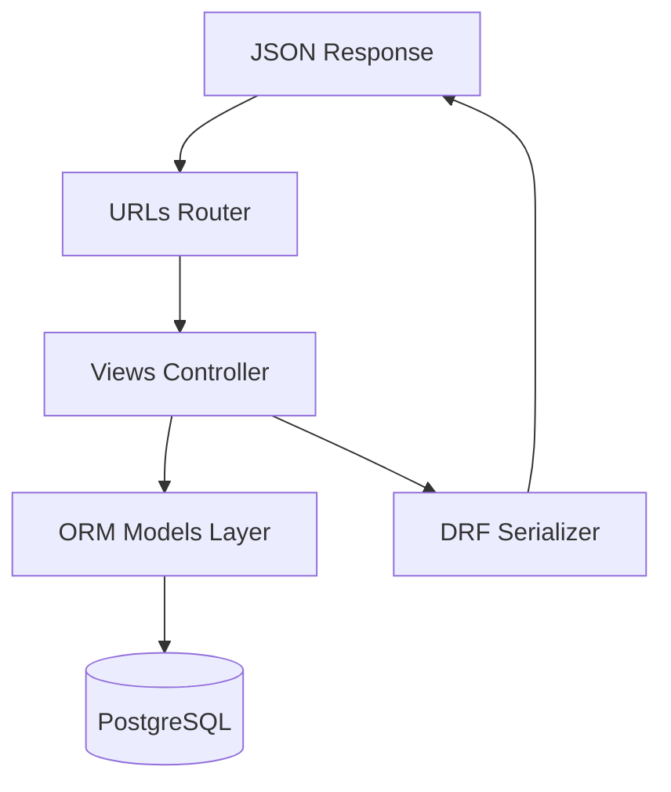

# Django & Django REST Framework (DRF)

Django is a batteries-included Python framework that enforces structured development using the Model-Template-View (MTV) pattern. Paired with Django REST Framework (DRF), it allows developers to build robust API servers.

---

## 1. Django MVT / MVC Flow



---

## 2. Code Demonstration: Django ORM & DRF ViewSets

```python
# models.py
from django.db import models

class Item(models.Model):
    name = models.CharField(max_length=100)
    description = models.TextField(blank=True, null=True)

# serializers.py
from rest_framework import serializers

class ItemSerializer(serializers.ModelSerializer):
    class Meta:
        model = Item
        fields = ['id', 'name', 'description']

# views.py
from rest_framework import viewsets
from rest_framework.permissions import IsAuthenticated

class ItemViewSet(viewsets.ModelViewSet):
    queryset = Item.objects.all()
    serializer_class = ItemSerializer
    permission_classes = [IsAuthenticated]
```

---

## 3. Core Characteristics
* **Batteries Included**: Includes built-in ORM, admin dashboard, user auth system, form generation, and cross-site scripting (XSS/CSRF) security protections.
* **Declarative Schema Migrations**: Detects changes in python models and creates/applies corresponding SQL scripts automatically.
