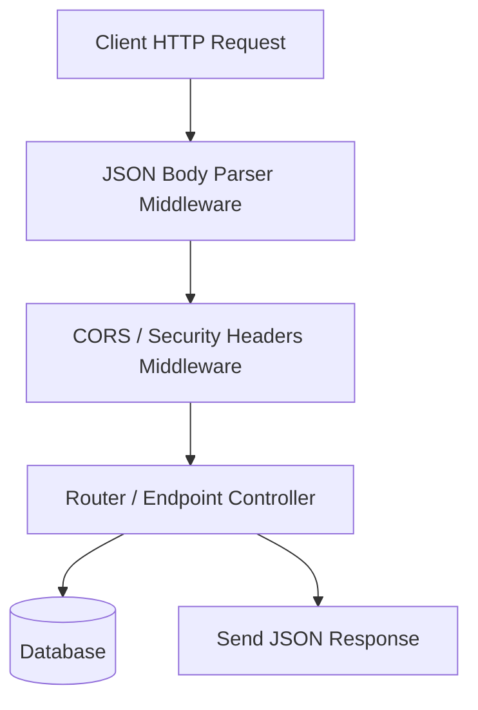

# Express.js API Framework (Node.js)

Express is a minimal and flexible Node.js web application framework that provides a robust set of features for web and mobile applications.

---

## 1. Middleware Pipeline Pattern

Express operations rely on a chain of middleware functions that execute sequentially.



### What is Middleware?
An Express middleware function has access to the Request object (`req`), the Response object (`res`), and the `next` middleware function in the application's request-response cycle (usually denoted by a variable named `next`).

---

## 2. Code Demonstration: Middleware & Router Setup

```javascript
const express = require('express');
const app = express();

// 1. Built-in body parser middleware
app.use(express.json());

// 2. Custom Logger Middleware
const requestLogger = (req, res, next) => {
  console.log(`[${new Date().toISOString()}] ${req.method} ${req.url}`);
  next(); // Pass control to the next middleware function in the stack
};
app.use(requestLogger);

// 3. Temporary memory database
let items = [];

// 4. API Endpoints
app.get('/api/items', (req, res) => {
  res.status(200).json(items);
});

app.post('/api/items', (req, res) => {
  const newItem = { id: items.length + 1, name: req.body.name };
  items.push(newItem);
  res.status(201).json(newItem);
});

app.listen(3000, () => console.log('Server running on port 3000'));
```

---

## 3. Core Characteristics
* **Unopinionated**: Does not enforce any specific architecture, folder layout, database ORM, or validation library. Developers are free to choose their own setups.
* **Highly Modular**: Relies on third-party middleware packages (like `cors`, `morgan`, `helmet`) to configure routing, authentication, and security headers.
