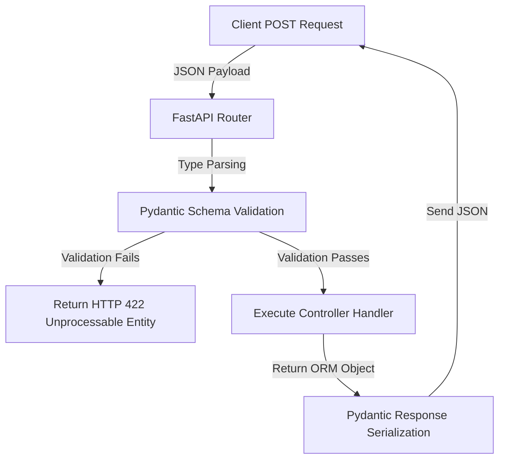

# FastAPI API Framework

FastAPI is a modern, high-performance web framework for building APIs with Python, based on standard Python type hints and ASGI servers.

---

## 1. Request Validation and Serialization Flow



---

## 2. Code Demonstration: Router & Dependency Injection

```python
from fastapi import FastAPI, Depends, HTTPException, status
from pydantic import BaseModel
from typing import List

app = FastAPI(title="FastAPI Micro-Framework")

# 1. Pydantic Request Validation Model
class ItemCreate(BaseModel):
    name: str
    description: str | None = None

# Pydantic Response Serialization Model
class ItemResponse(ItemCreate):
    id: int

# 2. Simulated DB Dependency
def get_database():
    db = {"items": []}
    return db

# 3. Router Endpoints
@app.post("/api/items", response_model=ItemResponse, status_code=status.HTTP_201_CREATED)
def create_new_item(payload: ItemCreate, db: dict = Depends(get_database)):
    new_id = len(db["items"]) + 1
    item_record = ItemResponse(id=new_id, name=payload.name, description=payload.description)
    db["items"].append(item_record)
    return item_record
```

---

## 3. Core Characteristics
* **Asynchronous execution**: Natively runs `async/await` handler functions, utilizing Python's event loop to support thousands of parallel connections.
* **Auto Docs**: Generates interactive Swagger UI documentation automatically from Pydantic schemas.
