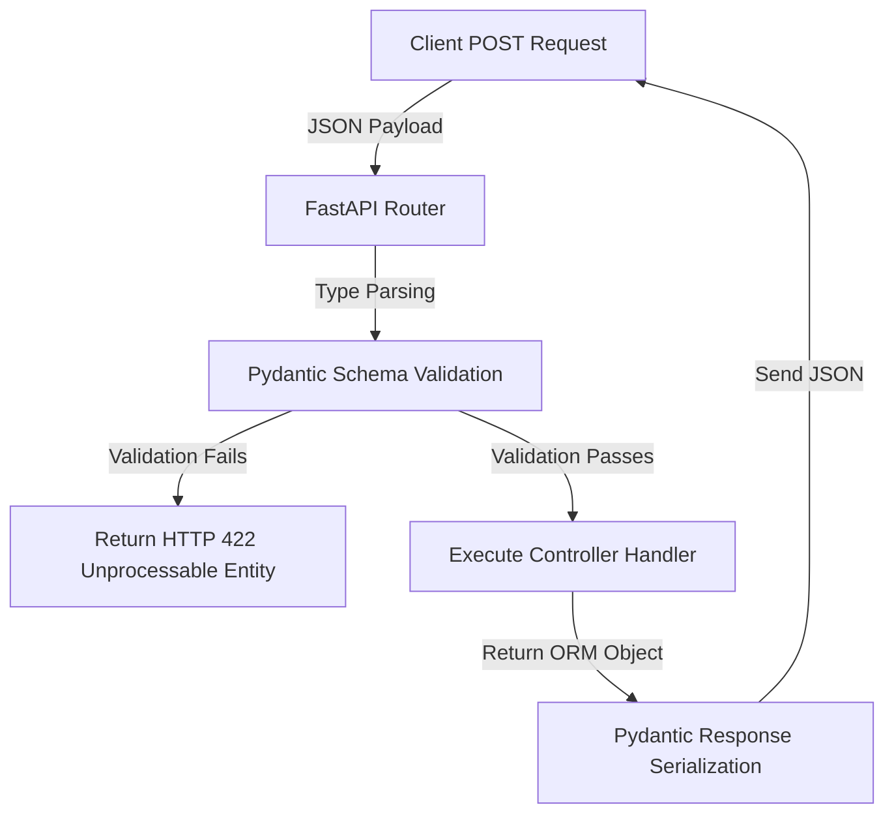

# FastAPI API Framework

FastAPI is a modern, high-performance web framework for building APIs with Python, based on standard Python type hints and ASGI servers.

---

<ProgressTracker currentSection=1 totalSections=4 />

## 1. Request Validation and Serialization Flow



---

<ProgressTracker currentSection=2 totalSections=4 />

## 2. Code Demonstration: Router & Dependency Injection

<Tabs>
  <Tab label="Syntax & Example">

```python
from fastapi import FastAPI, Depends, HTTPException, status
from pydantic import BaseModel
from typing import List

app = FastAPI(title="FastAPI Micro-Framework")

# 1. Pydantic Request Validation Model
class ItemCreate(BaseModel):
    name: str
    description: str | None = None

# Pydantic Response Serialization Model
class ItemResponse(ItemCreate):
    id: int

# 2. Simulated DB Dependency
def get_database():
    db = {"items": []}
    return db

# 3. Router Endpoints
@app.post("/api/items", response_model=ItemResponse, status_code=status.HTTP_201_CREATED)
def create_new_item(payload: ItemCreate, db: dict = Depends(get_database)):
    new_id = len(db["items"]) + 1
    item_record = ItemResponse(id=new_id, name=payload.name, description=payload.description)
    db["items"].append(item_record)
    return item_record
```

  </Tab>
  <Tab label="Interactive Playground">
    <InteractiveExample 
      language="python"
      initialCode="from fastapi import FastAPI, Depends, HTTPException, status\nfrom pydantic import BaseModel\nfrom typing import List\n\napp = FastAPI(title=\"FastAPI Micro-Framework\")\n\n# 1. Pydantic Request Validation Model\nclass ItemCreate(BaseModel):\n    name: str\n    description: str | None = None\n\n# Pydantic Response Serialization Model\nclass ItemResponse(ItemCreate):\n    id: int\n\n# 2. Simulated DB Dependency\ndef get_database():\n    db = {\"items\": []}\n    return db\n\n# 3. Router Endpoints\n@app.post(\"/api/items\", response_model=ItemResponse, status_code=status.HTTP_201_CREATED)\ndef create_new_item(payload: ItemCreate, db: dict = Depends(get_database)):\n    new_id = len(db[\"items\"]) + 1\n    item_record = ItemResponse(id=new_id, name=payload.name, description=payload.description)\n    db[\"items\"].append(item_record)\n    return item_record" 
      instruction="Execute and edit this PYTHON example."
    />
  </Tab>
</Tabs>

---

<ProgressTracker currentSection=3 totalSections=4 />

## 3. Core Characteristics
* **Asynchronous execution**: Natively runs `async/await` handler functions, utilizing Python's event loop to support thousands of parallel connections.
* **Auto Docs**: Generates interactive Swagger UI documentation automatically from Pydantic schemas.

---

<ProgressTracker currentSection=4 totalSections=4 />

## 4. Project Creation & Execution Commands

### Scaffolding a New Project
```bash
# Create project folder and navigate in
mkdir myfastapiapp && cd myfastapiapp

# Create a virtual environment
python -m venv venv
source venv/bin/activate  # On Windows: venv\Scripts\activate

# Install FastAPI and Uvicorn server
pip install fastapi "uvicorn[standard]"
```

### Running the Application
```bash
# Start the FastAPI server using Uvicorn with hot-reload enabled
uvicorn main:app --reload
```

### Dependency Management
```bash
# Freeze project dependencies to requirements.txt
pip freeze > requirements.txt

# Install dependencies from requirements.txt
pip install -r requirements.txt
```

---

### Knowledge Verification Check

<Quiz 
  question="Which of the following statements about Python's dynamic typing is correct?" 
  options=["Variables are bound to a specific data type at compilation.", "Variable names are references to objects, and types are resolved at runtime.", "A variable cannot change its type once initialized.", "Dynamic typing requires explicit casting before variable reassignment."] 
  answerIndex=1 
  explanation="In Python, variables are names that reference objects. The type is associated with the object itself, not the variable name, allowing dynamic reassignment at runtime." 
/>

<Quiz 
  question="What is the primary difference between a list and a tuple in Python?" 
  options=["Lists are immutable, while tuples are mutable.", "Lists use parenthesis, while tuples use square brackets.", "Lists are mutable, while tuples are immutable.", "Tuples support more built-in methods than lists."] 
  answerIndex=2 
  explanation="Lists are mutable and can be modified after creation. Tuples are immutable, making them hashable and useful as dictionary keys." 
/>

<Quiz 
  question="Which list comprehension correctly filters even numbers from a list `nums`?" 
  options=["[x if x % 2 == 0 for x in nums]", "[x for x in nums if x % 2 == 0]", "[x for x in nums while x % 2 == 0]", "[x filter x % 2 == 0 for x in nums]"] 
  answerIndex=1 
  explanation="The standard list comprehension syntax with an 'if' filter places the condition at the end: `[expression for item in iterable if condition]`." 
/>

<Quiz 
  question="What does the `yield` keyword accomplish in a Python function?" 
  options=["It terminates the function and returns a list.", "It pauses execution, returns a value, and saves state to create a generator.", "It forces the compiler to run the function in a background thread.", "It raises an exception to halt execution."] 
  answerIndex=1 
  explanation="`yield` turns a standard function into a generator. It yields values lazily one at a time, pausing execution state between calls to save memory." 
/>

<Quiz 
  question="How is a Python decorator structurally implemented?" 
  options=["As a class that inherits from a thread handler.", "As a function that takes another function as an argument and returns a wrapped replacement function.", "As a built-in compiler macro written in C.", "As a system-level process interrupt."] 
  answerIndex=1 
  explanation="Decorators are higher-order functions that accept a function as an argument, define an inner wrapper function to add behavior, and return that wrapper." 
/>

<Quiz 
  question="What is the main benefit of using a context manager (`with` statement) in Python?" 
  options=["It improves computation speed by running code in parallel.", "It guarantees proper cleanup and release of resources (e.g. closing files) even if errors occur.", "It automatically converts code into machine language.", "It registers the block within global shared variables."] 
  answerIndex=1 
  explanation="Context managers implement the `__enter__` and `__exit__` methods to guarantee resource cleanup, preventing memory leaks and locked files." 
/>

<Quiz 
  question="What is the Global Interpreter Lock (GIL) in CPython?" 
  options=["A compiler feature that prevents variable reassignment.", "A mutex that protects access to Python objects, preventing multiple native threads from executing Python bytecodes at once.", "A database locking mechanism for handling concurrent transactions.", "A sandbox security feature that restricts file system access."] 
  answerIndex=1 
  explanation="The GIL is a mechanism in CPython (the standard Python interpreter) that ensures only one thread executes Python bytecode at any given time, limiting CPU-bound multithreading." 
/>

<Quiz 
  question="In Python function signatures, what are `*args` and `**kwargs` used for?" 
  options=["To enforce strict type checking for variables.", "To accept an arbitrary number of positional arguments (as a tuple) and keyword arguments (as a dict) respectively.", "To declare global variables within local scope.", "To compile functions into C-compatible interfaces."] 
  answerIndex=1 
  explanation="`*args` collects extra positional arguments into a tuple, while `**kwargs` collects extra keyword arguments into a dictionary." 
/>

<Quiz 
  question="What is a requirement for an object to be used as a key in a Python dictionary?" 
  options=["It must be a mutable sequence.", "It must be hashable, meaning its hash value never changes during its lifetime and it can be compared to other objects.", "It must inherit from the DictKey class.", "It must be a numeric type."] 
  answerIndex=1 
  explanation="Dictionary keys must be hashable. Immutable types like strings, numbers, and tuples are hashable by default, whereas mutable objects like lists and dicts are not." 
/>

<Quiz 
  question="Which of the following describes a Python lambda function?" 
  options=["A function that runs recursively by default.", "An anonymous, single-expression function defined using the `lambda` keyword.", "A background process that manages memory allocation.", "A decorator class for logging execution times."] 
  answerIndex=1 
  explanation="Lambdas are anonymous, inline functions containing a single expression whose result is returned directly: `lambda arguments: expression`." 
/>

<Quiz 
  question="What is the difference between the `is` operator and the `==` operator in Python?" 
  options=["`is` compares values, while `==` compares data types.", "`is` checks identity (same memory address), while `==` checks equality (same value).", "`is` is used for strings, while `==` is used for numbers.", "There is no difference; they are completely interchangeable."] 
  answerIndex=1 
  explanation="`is` checks if two variables point to the exact same object in memory, while `==` compares the underlying values of the objects." 
/>

<Quiz 
  question="How does `asyncio` achieve concurrency in Python?" 
  options=["By starting new OS processes in parallel.", "Using cooperative multitasking on a single thread managed by an Event Loop.", "By compiling the code to multithreaded native binaries.", "Through hardware interrupts on multi-core processors."] 
  answerIndex=1 
  explanation="`asyncio` uses cooperative multitasking via coroutines and an Event Loop, allowing a single thread to context-switch when waiting for I/O operations." 
/>
