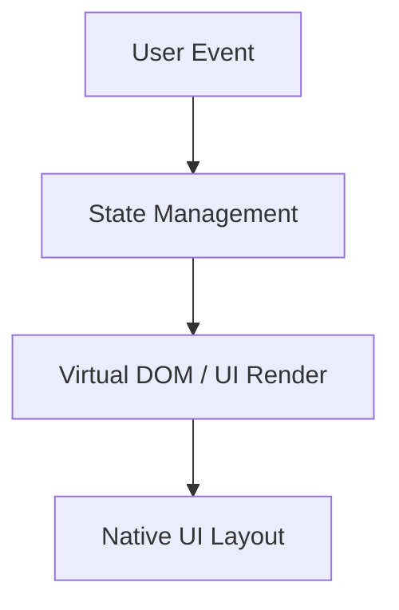
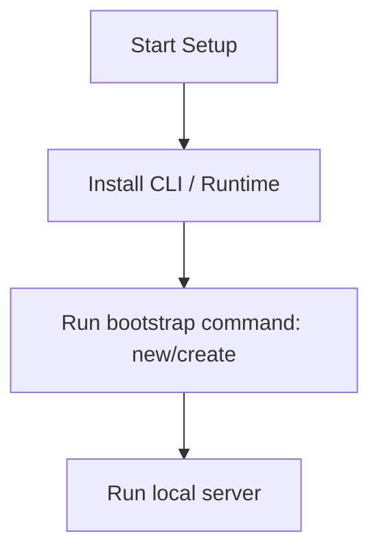

# Angular Master Engineering Guide

A comprehensive, production-level, industry-grade guide to Angular for software engineers, backend developers, frontend developers, full-stack developers, DevOps, and architects. Angular is a development platform, built on TypeScript, featuring a component-based framework for building scalable web applications.

---

## 1. Introduction

### 1.1 Overview & Concepts
Detailed explanation of Introduction in Angular. Built using TypeScript, Angular provides rich abstractions for modern web or mobile workflows.

Configure security headers, rate limiting, and follow proper coding guidelines to build production-grade applications with Angular.

### 1.2 Operations & Verification
Production and verification best practices for Introduction in Angular.

> [!NOTE]
> Always refer to the official Angular configuration guide for the latest security guidelines.

---

## 2. Why Use This Framework?

### 2.1 Overview & Concepts
Detailed explanation of Why Use This Framework? in Angular. Built using TypeScript, Angular provides rich abstractions for modern web or mobile workflows.

Configure security headers, rate limiting, and follow proper coding guidelines to build production-grade applications with Angular.

### 2.2 Operations & Verification
Production and verification best practices for Why Use This Framework? in Angular.

> [!NOTE]
> Always refer to the official Angular configuration guide for the latest security guidelines.

---

## 3. Architecture

### 3.1 Overview & Concepts
Detailed explanation of Architecture in Angular. Built using TypeScript, Angular provides rich abstractions for modern web or mobile workflows.



### 3.2 Operations & Verification
Production and verification best practices for Architecture in Angular.

> [!NOTE]
> Always refer to the official Angular configuration guide for the latest security guidelines.

---

## 4. Installation

### 4.1 Overview & Concepts
Detailed explanation of Installation in Angular. Built using TypeScript, Angular provides rich abstractions for modern web or mobile workflows.

#### Official Resources & Installation Flow
- **Download Link**: [Official Angular Homepage](https://angular.dev) or [Package Registry](https://npmjs.com)



### 4.2 Operations & Verification
Production and verification best practices for Installation in Angular.

> [!NOTE]
> Always refer to the official Angular configuration guide for the latest security guidelines.

---

## 5. Project Structure

### 5.1 Overview & Concepts
Detailed explanation of Project Structure in Angular. Built using TypeScript, Angular provides rich abstractions for modern web or mobile workflows.

```text
src/
├── components/
├── pages/
├── hooks/
└── index.js
```

### 5.2 Operations & Verification
Production and verification best practices for Project Structure in Angular.

> [!NOTE]
> Always refer to the official Angular configuration guide for the latest security guidelines.

---

## 6. Getting Started

### 6.1 Overview & Concepts
Detailed explanation of Getting Started in Angular. Built using TypeScript, Angular provides rich abstractions for modern web or mobile workflows.

Here is a simple starting snippet:

```typescript
// First Angular app
console.log('Hello from Angular');
```

### 6.2 Operations & Verification
Production and verification best practices for Getting Started in Angular.

> [!NOTE]
> Always refer to the official Angular configuration guide for the latest security guidelines.

---

## 7. Core Concepts

### 7.1 Overview & Concepts
Detailed explanation of Core Concepts in Angular. Built using TypeScript, Angular provides rich abstractions for modern web or mobile workflows.

Configure security headers, rate limiting, and follow proper coding guidelines to build production-grade applications with Angular.

### 7.2 Operations & Verification
Production and verification best practices for Core Concepts in Angular.

> [!NOTE]
> Always refer to the official Angular configuration guide for the latest security guidelines.

---

## 8. Routing

### 8.1 Overview & Concepts
Detailed explanation of Routing in Angular. Built using TypeScript, Angular provides rich abstractions for modern web or mobile workflows.

Configure security headers, rate limiting, and follow proper coding guidelines to build production-grade applications with Angular.

### 8.2 Operations & Verification
Production and verification best practices for Routing in Angular.

> [!NOTE]
> Always refer to the official Angular configuration guide for the latest security guidelines.

---

## 9. Middleware

### 9.1 Overview & Concepts
Detailed explanation of Middleware in Angular. Built using TypeScript, Angular provides rich abstractions for modern web or mobile workflows.

Configure security headers, rate limiting, and follow proper coding guidelines to build production-grade applications with Angular.

### 9.2 Operations & Verification
Production and verification best practices for Middleware in Angular.

> [!NOTE]
> Always refer to the official Angular configuration guide for the latest security guidelines.

---

## 10. Request & Response Lifecycle

### 10.1 Overview & Concepts
Detailed explanation of Request & Response Lifecycle in Angular. Built using TypeScript, Angular provides rich abstractions for modern web or mobile workflows.

Configure security headers, rate limiting, and follow proper coding guidelines to build production-grade applications with Angular.

### 10.2 Operations & Verification
Production and verification best practices for Request & Response Lifecycle in Angular.

> [!NOTE]
> Always refer to the official Angular configuration guide for the latest security guidelines.

---

## 11. Dependency Injection (if supported)

### 11.1 Overview & Concepts
Detailed explanation of Dependency Injection (if supported) in Angular. Built using TypeScript, Angular provides rich abstractions for modern web or mobile workflows.

Configure security headers, rate limiting, and follow proper coding guidelines to build production-grade applications with Angular.

### 11.2 Operations & Verification
Production and verification best practices for Dependency Injection (if supported) in Angular.

> [!NOTE]
> Always refer to the official Angular configuration guide for the latest security guidelines.

---

## 12. Configuration

### 12.1 Overview & Concepts
Detailed explanation of Configuration in Angular. Built using TypeScript, Angular provides rich abstractions for modern web or mobile workflows.

Configure security headers, rate limiting, and follow proper coding guidelines to build production-grade applications with Angular.

### 12.2 Operations & Verification
Production and verification best practices for Configuration in Angular.

> [!NOTE]
> Always refer to the official Angular configuration guide for the latest security guidelines.

---

## 13. Database Integration

### 13.1 Overview & Concepts
Detailed explanation of Database Integration in Angular. Built using TypeScript, Angular provides rich abstractions for modern web or mobile workflows.

Configure security headers, rate limiting, and follow proper coding guidelines to build production-grade applications with Angular.

### 13.2 Operations & Verification
Production and verification best practices for Database Integration in Angular.

> [!NOTE]
> Always refer to the official Angular configuration guide for the latest security guidelines.

---

## 14. Authentication

### 14.1 Overview & Concepts
Detailed explanation of Authentication in Angular. Built using TypeScript, Angular provides rich abstractions for modern web or mobile workflows.

Configure security headers, rate limiting, and follow proper coding guidelines to build production-grade applications with Angular.

### 14.2 Operations & Verification
Production and verification best practices for Authentication in Angular.

> [!NOTE]
> Always refer to the official Angular configuration guide for the latest security guidelines.

---

## 15. Authorization

### 15.1 Overview & Concepts
Detailed explanation of Authorization in Angular. Built using TypeScript, Angular provides rich abstractions for modern web or mobile workflows.

Configure security headers, rate limiting, and follow proper coding guidelines to build production-grade applications with Angular.

### 15.2 Operations & Verification
Production and verification best practices for Authorization in Angular.

> [!NOTE]
> Always refer to the official Angular configuration guide for the latest security guidelines.

---

## 16. Validation

### 16.1 Overview & Concepts
Detailed explanation of Validation in Angular. Built using TypeScript, Angular provides rich abstractions for modern web or mobile workflows.

Configure security headers, rate limiting, and follow proper coding guidelines to build production-grade applications with Angular.

### 16.2 Operations & Verification
Production and verification best practices for Validation in Angular.

> [!NOTE]
> Always refer to the official Angular configuration guide for the latest security guidelines.

---

## 17. Error Handling

### 17.1 Overview & Concepts
Detailed explanation of Error Handling in Angular. Built using TypeScript, Angular provides rich abstractions for modern web or mobile workflows.

Configure security headers, rate limiting, and follow proper coding guidelines to build production-grade applications with Angular.

### 17.2 Operations & Verification
Production and verification best practices for Error Handling in Angular.

> [!NOTE]
> Always refer to the official Angular configuration guide for the latest security guidelines.

---

## 18. Caching

### 18.1 Overview & Concepts
Detailed explanation of Caching in Angular. Built using TypeScript, Angular provides rich abstractions for modern web or mobile workflows.

Configure security headers, rate limiting, and follow proper coding guidelines to build production-grade applications with Angular.

### 18.2 Operations & Verification
Production and verification best practices for Caching in Angular.

> [!NOTE]
> Always refer to the official Angular configuration guide for the latest security guidelines.

---

## 19. Security

### 19.1 Overview & Concepts
Detailed explanation of Security in Angular. Built using TypeScript, Angular provides rich abstractions for modern web or mobile workflows.

Configure security headers, rate limiting, and follow proper coding guidelines to build production-grade applications with Angular.

### 19.2 Operations & Verification
Production and verification best practices for Security in Angular.

> [!NOTE]
> Always refer to the official Angular configuration guide for the latest security guidelines.

---

## 20. Performance Optimization

### 20.1 Overview & Concepts
Detailed explanation of Performance Optimization in Angular. Built using TypeScript, Angular provides rich abstractions for modern web or mobile workflows.

Configure security headers, rate limiting, and follow proper coding guidelines to build production-grade applications with Angular.

### 20.2 Operations & Verification
Production and verification best practices for Performance Optimization in Angular.

> [!NOTE]
> Always refer to the official Angular configuration guide for the latest security guidelines.

---

## 21. Testing

### 21.1 Overview & Concepts
Detailed explanation of Testing in Angular. Built using TypeScript, Angular provides rich abstractions for modern web or mobile workflows.

Configure security headers, rate limiting, and follow proper coding guidelines to build production-grade applications with Angular.

### 21.2 Operations & Verification
Production and verification best practices for Testing in Angular.

> [!NOTE]
> Always refer to the official Angular configuration guide for the latest security guidelines.

---

## 22. Deployment

### 22.1 Overview & Concepts
Detailed explanation of Deployment in Angular. Built using TypeScript, Angular provides rich abstractions for modern web or mobile workflows.

Configure security headers, rate limiting, and follow proper coding guidelines to build production-grade applications with Angular.

### 22.2 Operations & Verification
Production and verification best practices for Deployment in Angular.

> [!NOTE]
> Always refer to the official Angular configuration guide for the latest security guidelines.

---

## 23. Monitoring

### 23.1 Overview & Concepts
Detailed explanation of Monitoring in Angular. Built using TypeScript, Angular provides rich abstractions for modern web or mobile workflows.

Configure security headers, rate limiting, and follow proper coding guidelines to build production-grade applications with Angular.

### 23.2 Operations & Verification
Production and verification best practices for Monitoring in Angular.

> [!NOTE]
> Always refer to the official Angular configuration guide for the latest security guidelines.

---

## 24. Microservices

### 24.1 Overview & Concepts
Detailed explanation of Microservices in Angular. Built using TypeScript, Angular provides rich abstractions for modern web or mobile workflows.

Configure security headers, rate limiting, and follow proper coding guidelines to build production-grade applications with Angular.

### 24.2 Operations & Verification
Production and verification best practices for Microservices in Angular.

> [!NOTE]
> Always refer to the official Angular configuration guide for the latest security guidelines.

---

## 25. AI Integration

### 25.1 Overview & Concepts
Detailed explanation of AI Integration in Angular. Built using TypeScript, Angular provides rich abstractions for modern web or mobile workflows.

Integrating OpenAI or Bedrock in Angular is straightforward using direct client SDKs:

```typescript
import { OpenAI } from 'openai';
const openai = new OpenAI();
const completion = await openai.chat.completions.create({ model: 'gpt-4', messages: [{ role: 'user', content: 'Hello' }] });
console.log(completion.choices[0].message.content);
```

### 25.2 Operations & Verification
Production and verification best practices for AI Integration in Angular.

> [!NOTE]
> Always refer to the official Angular configuration guide for the latest security guidelines.

---

## 26. Production Architecture

### 26.1 Overview & Concepts
Detailed explanation of Production Architecture in Angular. Built using TypeScript, Angular provides rich abstractions for modern web or mobile workflows.

Configure security headers, rate limiting, and follow proper coding guidelines to build production-grade applications with Angular.

### 26.2 Operations & Verification
Production and verification best practices for Production Architecture in Angular.

> [!NOTE]
> Always refer to the official Angular configuration guide for the latest security guidelines.

---

## 27. Best Practices

### 27.1 Overview & Concepts
Detailed explanation of Best Practices in Angular. Built using TypeScript, Angular provides rich abstractions for modern web or mobile workflows.

Configure security headers, rate limiting, and follow proper coding guidelines to build production-grade applications with Angular.

### 27.2 Operations & Verification
Production and verification best practices for Best Practices in Angular.

> [!NOTE]
> Always refer to the official Angular configuration guide for the latest security guidelines.

---

## 28. Common Errors

### 28.1 Overview & Concepts
Detailed explanation of Common Errors in Angular. Built using TypeScript, Angular provides rich abstractions for modern web or mobile workflows.

Configure security headers, rate limiting, and follow proper coding guidelines to build production-grade applications with Angular.

### 28.2 Operations & Verification
Production and verification best practices for Common Errors in Angular.

> [!NOTE]
> Always refer to the official Angular configuration guide for the latest security guidelines.

---

## 29. Interview Questions

### 29.1 Overview & Concepts
Detailed explanation of Interview Questions in Angular. Built using TypeScript, Angular provides rich abstractions for modern web or mobile workflows.

Configure security headers, rate limiting, and follow proper coding guidelines to build production-grade applications with Angular.

### 29.2 Operations & Verification
Production and verification best practices for Interview Questions in Angular.

> [!NOTE]
> Always refer to the official Angular configuration guide for the latest security guidelines.

---

## 30. Cheat Sheet

### 30.1 Overview & Concepts
Detailed explanation of Cheat Sheet in Angular. Built using TypeScript, Angular provides rich abstractions for modern web or mobile workflows.

Configure security headers, rate limiting, and follow proper coding guidelines to build production-grade applications with Angular.

### 30.2 Operations & Verification
Production and verification best practices for Cheat Sheet in Angular.

> [!NOTE]
> Always refer to the official Angular configuration guide for the latest security guidelines.

---

## 31. Hands-on Projects

### 31.1 Overview & Concepts
Detailed explanation of Hands-on Projects in Angular. Built using TypeScript, Angular provides rich abstractions for modern web or mobile workflows.

Configure security headers, rate limiting, and follow proper coding guidelines to build production-grade applications with Angular.

### 31.2 Operations & Verification
Production and verification best practices for Hands-on Projects in Angular.

> [!NOTE]
> Always refer to the official Angular configuration guide for the latest security guidelines.

---

## 32. Learning Roadmap

### 32.1 Overview & Concepts
Detailed explanation of Learning Roadmap in Angular. Built using TypeScript, Angular provides rich abstractions for modern web or mobile workflows.

Configure security headers, rate limiting, and follow proper coding guidelines to build production-grade applications with Angular.

### 32.2 Operations & Verification
Production and verification best practices for Learning Roadmap in Angular.

> [!NOTE]
> Always refer to the official Angular configuration guide for the latest security guidelines.

---

## 33. Final Summary

### 33.1 Overview & Concepts
Detailed explanation of Final Summary in Angular. Built using TypeScript, Angular provides rich abstractions for modern web or mobile workflows.

Configure security headers, rate limiting, and follow proper coding guidelines to build production-grade applications with Angular.

### 33.2 Operations & Verification
Production and verification best practices for Final Summary in Angular.

> [!NOTE]
> Always refer to the official Angular configuration guide for the latest security guidelines.

---

