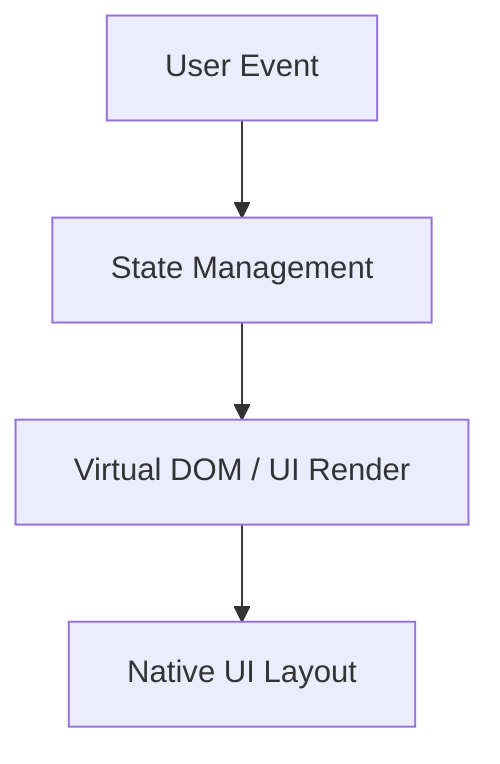
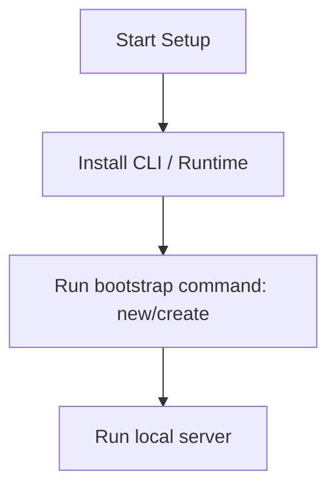

# Next.js Master Engineering Guide

A comprehensive, production-level, industry-grade guide to Next.js for software engineers, backend developers, frontend developers, full-stack developers, DevOps, and architects. Next.js is a React framework for the web, enabling features such as server-side rendering and generating static websites.

---

## 1. Introduction

### 1.1 Overview & Concepts
Detailed explanation of Introduction in Next.js. Built using TypeScript, Next.js provides rich abstractions for modern web or mobile workflows.

Configure security headers, rate limiting, and follow proper coding guidelines to build production-grade applications with Next.js.

### 1.2 Operations & Verification
Production and verification best practices for Introduction in Next.js.

> [!NOTE]
> Always refer to the official Next.js configuration guide for the latest security guidelines.

---

## 2. Why Use This Framework?

### 2.1 Overview & Concepts
Detailed explanation of Why Use This Framework? in Next.js. Built using TypeScript, Next.js provides rich abstractions for modern web or mobile workflows.

Configure security headers, rate limiting, and follow proper coding guidelines to build production-grade applications with Next.js.

### 2.2 Operations & Verification
Production and verification best practices for Why Use This Framework? in Next.js.

> [!NOTE]
> Always refer to the official Next.js configuration guide for the latest security guidelines.

---

## 3. Architecture

### 3.1 Overview & Concepts
Detailed explanation of Architecture in Next.js. Built using TypeScript, Next.js provides rich abstractions for modern web or mobile workflows.



### 3.2 Operations & Verification
Production and verification best practices for Architecture in Next.js.

> [!NOTE]
> Always refer to the official Next.js configuration guide for the latest security guidelines.

---

## 4. Installation

### 4.1 Overview & Concepts
Detailed explanation of Installation in Next.js. Built using TypeScript, Next.js provides rich abstractions for modern web or mobile workflows.

#### Official Resources & Installation Flow
- **Download Link**: [Official Next.js Homepage](https://nextjs.dev) or [Package Registry](https://npmjs.com)



### 4.2 Operations & Verification
Production and verification best practices for Installation in Next.js.

> [!NOTE]
> Always refer to the official Next.js configuration guide for the latest security guidelines.

---

## 5. Project Structure

### 5.1 Overview & Concepts
Detailed explanation of Project Structure in Next.js. Built using TypeScript, Next.js provides rich abstractions for modern web or mobile workflows.

```text
src/
├── components/
├── pages/
├── hooks/
└── index.js
```

### 5.2 Operations & Verification
Production and verification best practices for Project Structure in Next.js.

> [!NOTE]
> Always refer to the official Next.js configuration guide for the latest security guidelines.

---

## 6. Getting Started

### 6.1 Overview & Concepts
Detailed explanation of Getting Started in Next.js. Built using TypeScript, Next.js provides rich abstractions for modern web or mobile workflows.

Here is a simple starting snippet:

```typescript
// First Next.js app
console.log('Hello from Next.js');
```

### 6.2 Operations & Verification
Production and verification best practices for Getting Started in Next.js.

> [!NOTE]
> Always refer to the official Next.js configuration guide for the latest security guidelines.

---

## 7. Core Concepts

### 7.1 Overview & Concepts
Detailed explanation of Core Concepts in Next.js. Built using TypeScript, Next.js provides rich abstractions for modern web or mobile workflows.

Configure security headers, rate limiting, and follow proper coding guidelines to build production-grade applications with Next.js.

### 7.2 Operations & Verification
Production and verification best practices for Core Concepts in Next.js.

> [!NOTE]
> Always refer to the official Next.js configuration guide for the latest security guidelines.

---

## 8. Routing

### 8.1 Overview & Concepts
Detailed explanation of Routing in Next.js. Built using TypeScript, Next.js provides rich abstractions for modern web or mobile workflows.

Configure security headers, rate limiting, and follow proper coding guidelines to build production-grade applications with Next.js.

### 8.2 Operations & Verification
Production and verification best practices for Routing in Next.js.

> [!NOTE]
> Always refer to the official Next.js configuration guide for the latest security guidelines.

---

## 9. Middleware

### 9.1 Overview & Concepts
Detailed explanation of Middleware in Next.js. Built using TypeScript, Next.js provides rich abstractions for modern web or mobile workflows.

Configure security headers, rate limiting, and follow proper coding guidelines to build production-grade applications with Next.js.

### 9.2 Operations & Verification
Production and verification best practices for Middleware in Next.js.

> [!NOTE]
> Always refer to the official Next.js configuration guide for the latest security guidelines.

---

## 10. Request & Response Lifecycle

### 10.1 Overview & Concepts
Detailed explanation of Request & Response Lifecycle in Next.js. Built using TypeScript, Next.js provides rich abstractions for modern web or mobile workflows.

Configure security headers, rate limiting, and follow proper coding guidelines to build production-grade applications with Next.js.

### 10.2 Operations & Verification
Production and verification best practices for Request & Response Lifecycle in Next.js.

> [!NOTE]
> Always refer to the official Next.js configuration guide for the latest security guidelines.

---

## 11. Dependency Injection (if supported)

### 11.1 Overview & Concepts
Detailed explanation of Dependency Injection (if supported) in Next.js. Built using TypeScript, Next.js provides rich abstractions for modern web or mobile workflows.

Configure security headers, rate limiting, and follow proper coding guidelines to build production-grade applications with Next.js.

### 11.2 Operations & Verification
Production and verification best practices for Dependency Injection (if supported) in Next.js.

> [!NOTE]
> Always refer to the official Next.js configuration guide for the latest security guidelines.

---

## 12. Configuration

### 12.1 Overview & Concepts
Detailed explanation of Configuration in Next.js. Built using TypeScript, Next.js provides rich abstractions for modern web or mobile workflows.

Configure security headers, rate limiting, and follow proper coding guidelines to build production-grade applications with Next.js.

### 12.2 Operations & Verification
Production and verification best practices for Configuration in Next.js.

> [!NOTE]
> Always refer to the official Next.js configuration guide for the latest security guidelines.

---

## 13. Database Integration

### 13.1 Overview & Concepts
Detailed explanation of Database Integration in Next.js. Built using TypeScript, Next.js provides rich abstractions for modern web or mobile workflows.

Configure security headers, rate limiting, and follow proper coding guidelines to build production-grade applications with Next.js.

### 13.2 Operations & Verification
Production and verification best practices for Database Integration in Next.js.

> [!NOTE]
> Always refer to the official Next.js configuration guide for the latest security guidelines.

---

## 14. Authentication

### 14.1 Overview & Concepts
Detailed explanation of Authentication in Next.js. Built using TypeScript, Next.js provides rich abstractions for modern web or mobile workflows.

Configure security headers, rate limiting, and follow proper coding guidelines to build production-grade applications with Next.js.

### 14.2 Operations & Verification
Production and verification best practices for Authentication in Next.js.

> [!NOTE]
> Always refer to the official Next.js configuration guide for the latest security guidelines.

---

## 15. Authorization

### 15.1 Overview & Concepts
Detailed explanation of Authorization in Next.js. Built using TypeScript, Next.js provides rich abstractions for modern web or mobile workflows.

Configure security headers, rate limiting, and follow proper coding guidelines to build production-grade applications with Next.js.

### 15.2 Operations & Verification
Production and verification best practices for Authorization in Next.js.

> [!NOTE]
> Always refer to the official Next.js configuration guide for the latest security guidelines.

---

## 16. Validation

### 16.1 Overview & Concepts
Detailed explanation of Validation in Next.js. Built using TypeScript, Next.js provides rich abstractions for modern web or mobile workflows.

Configure security headers, rate limiting, and follow proper coding guidelines to build production-grade applications with Next.js.

### 16.2 Operations & Verification
Production and verification best practices for Validation in Next.js.

> [!NOTE]
> Always refer to the official Next.js configuration guide for the latest security guidelines.

---

## 17. Error Handling

### 17.1 Overview & Concepts
Detailed explanation of Error Handling in Next.js. Built using TypeScript, Next.js provides rich abstractions for modern web or mobile workflows.

Configure security headers, rate limiting, and follow proper coding guidelines to build production-grade applications with Next.js.

### 17.2 Operations & Verification
Production and verification best practices for Error Handling in Next.js.

> [!NOTE]
> Always refer to the official Next.js configuration guide for the latest security guidelines.

---

## 18. Caching

### 18.1 Overview & Concepts
Detailed explanation of Caching in Next.js. Built using TypeScript, Next.js provides rich abstractions for modern web or mobile workflows.

Configure security headers, rate limiting, and follow proper coding guidelines to build production-grade applications with Next.js.

### 18.2 Operations & Verification
Production and verification best practices for Caching in Next.js.

> [!NOTE]
> Always refer to the official Next.js configuration guide for the latest security guidelines.

---

## 19. Security

### 19.1 Overview & Concepts
Detailed explanation of Security in Next.js. Built using TypeScript, Next.js provides rich abstractions for modern web or mobile workflows.

Configure security headers, rate limiting, and follow proper coding guidelines to build production-grade applications with Next.js.

### 19.2 Operations & Verification
Production and verification best practices for Security in Next.js.

> [!NOTE]
> Always refer to the official Next.js configuration guide for the latest security guidelines.

---

## 20. Performance Optimization

### 20.1 Overview & Concepts
Detailed explanation of Performance Optimization in Next.js. Built using TypeScript, Next.js provides rich abstractions for modern web or mobile workflows.

Configure security headers, rate limiting, and follow proper coding guidelines to build production-grade applications with Next.js.

### 20.2 Operations & Verification
Production and verification best practices for Performance Optimization in Next.js.

> [!NOTE]
> Always refer to the official Next.js configuration guide for the latest security guidelines.

---

## 21. Testing

### 21.1 Overview & Concepts
Detailed explanation of Testing in Next.js. Built using TypeScript, Next.js provides rich abstractions for modern web or mobile workflows.

Configure security headers, rate limiting, and follow proper coding guidelines to build production-grade applications with Next.js.

### 21.2 Operations & Verification
Production and verification best practices for Testing in Next.js.

> [!NOTE]
> Always refer to the official Next.js configuration guide for the latest security guidelines.

---

## 22. Deployment

### 22.1 Overview & Concepts
Detailed explanation of Deployment in Next.js. Built using TypeScript, Next.js provides rich abstractions for modern web or mobile workflows.

Configure security headers, rate limiting, and follow proper coding guidelines to build production-grade applications with Next.js.

### 22.2 Operations & Verification
Production and verification best practices for Deployment in Next.js.

> [!NOTE]
> Always refer to the official Next.js configuration guide for the latest security guidelines.

---

## 23. Monitoring

### 23.1 Overview & Concepts
Detailed explanation of Monitoring in Next.js. Built using TypeScript, Next.js provides rich abstractions for modern web or mobile workflows.

Configure security headers, rate limiting, and follow proper coding guidelines to build production-grade applications with Next.js.

### 23.2 Operations & Verification
Production and verification best practices for Monitoring in Next.js.

> [!NOTE]
> Always refer to the official Next.js configuration guide for the latest security guidelines.

---

## 24. Microservices

### 24.1 Overview & Concepts
Detailed explanation of Microservices in Next.js. Built using TypeScript, Next.js provides rich abstractions for modern web or mobile workflows.

Configure security headers, rate limiting, and follow proper coding guidelines to build production-grade applications with Next.js.

### 24.2 Operations & Verification
Production and verification best practices for Microservices in Next.js.

> [!NOTE]
> Always refer to the official Next.js configuration guide for the latest security guidelines.

---

## 25. AI Integration

### 25.1 Overview & Concepts
Detailed explanation of AI Integration in Next.js. Built using TypeScript, Next.js provides rich abstractions for modern web or mobile workflows.

Integrating OpenAI or Bedrock in Next.js is straightforward using direct client SDKs:

```typescript
import { OpenAI } from 'openai';
const openai = new OpenAI();
const completion = await openai.chat.completions.create({ model: 'gpt-4', messages: [{ role: 'user', content: 'Hello' }] });
console.log(completion.choices[0].message.content);
```

### 25.2 Operations & Verification
Production and verification best practices for AI Integration in Next.js.

> [!NOTE]
> Always refer to the official Next.js configuration guide for the latest security guidelines.

---

## 26. Production Architecture

### 26.1 Overview & Concepts
Detailed explanation of Production Architecture in Next.js. Built using TypeScript, Next.js provides rich abstractions for modern web or mobile workflows.

Configure security headers, rate limiting, and follow proper coding guidelines to build production-grade applications with Next.js.

### 26.2 Operations & Verification
Production and verification best practices for Production Architecture in Next.js.

> [!NOTE]
> Always refer to the official Next.js configuration guide for the latest security guidelines.

---

## 27. Best Practices

### 27.1 Overview & Concepts
Detailed explanation of Best Practices in Next.js. Built using TypeScript, Next.js provides rich abstractions for modern web or mobile workflows.

Configure security headers, rate limiting, and follow proper coding guidelines to build production-grade applications with Next.js.

### 27.2 Operations & Verification
Production and verification best practices for Best Practices in Next.js.

> [!NOTE]
> Always refer to the official Next.js configuration guide for the latest security guidelines.

---

## 28. Common Errors

### 28.1 Overview & Concepts
Detailed explanation of Common Errors in Next.js. Built using TypeScript, Next.js provides rich abstractions for modern web or mobile workflows.

Configure security headers, rate limiting, and follow proper coding guidelines to build production-grade applications with Next.js.

### 28.2 Operations & Verification
Production and verification best practices for Common Errors in Next.js.

> [!NOTE]
> Always refer to the official Next.js configuration guide for the latest security guidelines.

---

## 29. Interview Questions

### 29.1 Overview & Concepts
Detailed explanation of Interview Questions in Next.js. Built using TypeScript, Next.js provides rich abstractions for modern web or mobile workflows.

Configure security headers, rate limiting, and follow proper coding guidelines to build production-grade applications with Next.js.

### 29.2 Operations & Verification
Production and verification best practices for Interview Questions in Next.js.

> [!NOTE]
> Always refer to the official Next.js configuration guide for the latest security guidelines.

---

## 30. Cheat Sheet

### 30.1 Overview & Concepts
Detailed explanation of Cheat Sheet in Next.js. Built using TypeScript, Next.js provides rich abstractions for modern web or mobile workflows.

Configure security headers, rate limiting, and follow proper coding guidelines to build production-grade applications with Next.js.

### 30.2 Operations & Verification
Production and verification best practices for Cheat Sheet in Next.js.

> [!NOTE]
> Always refer to the official Next.js configuration guide for the latest security guidelines.

---

## 31. Hands-on Projects

### 31.1 Overview & Concepts
Detailed explanation of Hands-on Projects in Next.js. Built using TypeScript, Next.js provides rich abstractions for modern web or mobile workflows.

Configure security headers, rate limiting, and follow proper coding guidelines to build production-grade applications with Next.js.

### 31.2 Operations & Verification
Production and verification best practices for Hands-on Projects in Next.js.

> [!NOTE]
> Always refer to the official Next.js configuration guide for the latest security guidelines.

---

## 32. Learning Roadmap

### 32.1 Overview & Concepts
Detailed explanation of Learning Roadmap in Next.js. Built using TypeScript, Next.js provides rich abstractions for modern web or mobile workflows.

Configure security headers, rate limiting, and follow proper coding guidelines to build production-grade applications with Next.js.

### 32.2 Operations & Verification
Production and verification best practices for Learning Roadmap in Next.js.

> [!NOTE]
> Always refer to the official Next.js configuration guide for the latest security guidelines.

---

## 33. Final Summary

### 33.1 Overview & Concepts
Detailed explanation of Final Summary in Next.js. Built using TypeScript, Next.js provides rich abstractions for modern web or mobile workflows.

Configure security headers, rate limiting, and follow proper coding guidelines to build production-grade applications with Next.js.

### 33.2 Operations & Verification
Production and verification best practices for Final Summary in Next.js.

> [!NOTE]
> Always refer to the official Next.js configuration guide for the latest security guidelines.

---

