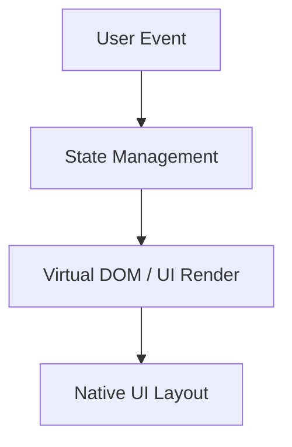
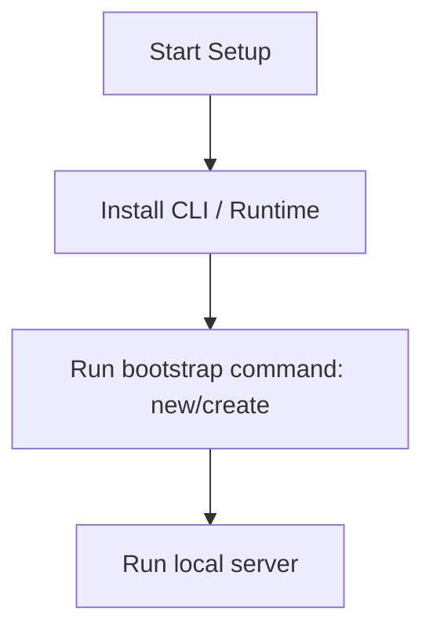

# Nuxt.js Master Engineering Guide

A comprehensive, production-level, industry-grade guide to Nuxt.js for software engineers, backend developers, frontend developers, full-stack developers, DevOps, and architects. Nuxt is an open-source framework under MIT license that makes web development simple and powerful, built on top of Vue.js.

---

<ProgressTracker currentSection=1 totalSections=34 />

## 1. Introduction

### 1.1 Overview & Concepts
Detailed explanation of Introduction in Nuxt.js. Built using TypeScript, Nuxt.js provides rich abstractions for modern web or mobile workflows.

Configure security headers, rate limiting, and follow proper coding guidelines to build production-grade applications with Nuxt.js.

### 1.2 Operations & Verification
Production and verification best practices for Introduction in Nuxt.js.

```bash
# Build the Nuxt application for production
npm run build
```

---

<ProgressTracker currentSection=2 totalSections=34 />

## 2. Why Use This Framework?

### 2.1 Overview & Concepts
Detailed explanation of Why Use This Framework? in Nuxt.js. Built using TypeScript, Nuxt.js provides rich abstractions for modern web or mobile workflows.

Configure security headers, rate limiting, and follow proper coding guidelines to build production-grade applications with Nuxt.js.

### 2.2 Operations & Verification
Production and verification best practices for Why Use This Framework? in Nuxt.js.

```bash
# Preview the production build locally
npm run preview
```

---

<ProgressTracker currentSection=3 totalSections=34 />

## 3. Architecture

### 3.1 Overview & Concepts
Detailed explanation of Architecture in Nuxt.js. Built using TypeScript, Nuxt.js provides rich abstractions for modern web or mobile workflows.



### 3.2 Operations & Verification
Production and verification best practices for Architecture in Nuxt.js.

```bash
# Generate a static site output
npx nuxi generate
```

---

<ProgressTracker currentSection=4 totalSections=34 />

## 4. Installation

### 4.1 Overview & Concepts
Detailed explanation of Installation in Nuxt.js. Built using TypeScript, Nuxt.js provides rich abstractions for modern web or mobile workflows.

#### Official Resources & Installation Flow
- **Download Link**: [Official Nuxt.js Homepage](https://nuxt.dev) or [Package Registry](https://npmjs.com)



### 4.2 Project Scaffolding & Setup
Run the following command to create a new Nuxt project:
```bash
# Scaffold a new Nuxt application
npx nuxi@latest init mynuxtapp
cd mynuxtapp
```

---

<ProgressTracker currentSection=5 totalSections=34 />

## 5. Project Structure

### 5.1 Overview & Concepts
Detailed explanation of Project Structure in Nuxt.js. Built using TypeScript, Nuxt.js provides rich abstractions for modern web or mobile workflows.

```text
src/
├── components/
├── pages/
├── hooks/
└── index.js
```

### 5.2 Operations & Verification
Production and verification best practices for Project Structure in Nuxt.js.

```bash
# Clear Nuxt development cache
npx nuxi cleanup
```

---

<ProgressTracker currentSection=6 totalSections=34 />

## 6. Getting Started

### 6.1 Overview & Concepts
Detailed explanation of Getting Started in Nuxt.js. Built using TypeScript, Nuxt.js provides rich abstractions for modern web or mobile workflows.

Here is a simple starting snippet:

```typescript
// First Nuxt.js app
console.log('Hello from Nuxt.js');
```

### 6.2 Running the Application
Run the following command to start the Nuxt local development server:
```bash
# Start the Nuxt development server
npm run dev -- -o
```

---

<ProgressTracker currentSection=7 totalSections=34 />

## 7. Core Concepts

### 7.1 Overview & Concepts
Detailed explanation of Core Concepts in Nuxt.js. Built using TypeScript, Nuxt.js provides rich abstractions for modern web or mobile workflows.

Configure security headers, rate limiting, and follow proper coding guidelines to build production-grade applications with Nuxt.js.

### 7.2 Operations & Verification
Production and verification best practices for Core Concepts in Nuxt.js.

```bash
# Build the Nuxt application for production
npm run build
```

---

<ProgressTracker currentSection=8 totalSections=34 />

## 8. Routing

### 8.1 Overview & Concepts
Detailed explanation of Routing in Nuxt.js. Built using TypeScript, Nuxt.js provides rich abstractions for modern web or mobile workflows.

Configure security headers, rate limiting, and follow proper coding guidelines to build production-grade applications with Nuxt.js.

### 8.2 Operations & Verification
Production and verification best practices for Routing in Nuxt.js.

```bash
# Preview the production build locally
npm run preview
```

---

<ProgressTracker currentSection=9 totalSections=34 />

## 9. Middleware

### 9.1 Overview & Concepts
Detailed explanation of Middleware in Nuxt.js. Built using TypeScript, Nuxt.js provides rich abstractions for modern web or mobile workflows.

Configure security headers, rate limiting, and follow proper coding guidelines to build production-grade applications with Nuxt.js.

### 9.2 Operations & Verification
Production and verification best practices for Middleware in Nuxt.js.

```bash
# Generate a static site output
npx nuxi generate
```

---

<ProgressTracker currentSection=10 totalSections=34 />

## 10. Request & Response Lifecycle

### 10.1 Overview & Concepts
Detailed explanation of Request & Response Lifecycle in Nuxt.js. Built using TypeScript, Nuxt.js provides rich abstractions for modern web or mobile workflows.

Configure security headers, rate limiting, and follow proper coding guidelines to build production-grade applications with Nuxt.js.

### 10.2 Operations & Verification
Production and verification best practices for Request & Response Lifecycle in Nuxt.js.

```bash
# Clear Nuxt development cache
npx nuxi cleanup
```

---

<ProgressTracker currentSection=11 totalSections=34 />

## 11. Dependency Injection (if supported)

### 11.1 Overview & Concepts
Detailed explanation of Dependency Injection (if supported) in Nuxt.js. Built using TypeScript, Nuxt.js provides rich abstractions for modern web or mobile workflows.

Configure security headers, rate limiting, and follow proper coding guidelines to build production-grade applications with Nuxt.js.

### 11.2 Operations & Verification
Production and verification best practices for Dependency Injection (if supported) in Nuxt.js.

```bash
# Build the Nuxt application for production
npm run build
```

---

<ProgressTracker currentSection=12 totalSections=34 />

## 12. Configuration

### 12.1 Overview & Concepts
Detailed explanation of Configuration in Nuxt.js. Built using TypeScript, Nuxt.js provides rich abstractions for modern web or mobile workflows.

Configure security headers, rate limiting, and follow proper coding guidelines to build production-grade applications with Nuxt.js.

### 12.2 Operations & Verification
Production and verification best practices for Configuration in Nuxt.js.

```bash
# Preview the production build locally
npm run preview
```

---

<ProgressTracker currentSection=13 totalSections=34 />

## 13. Database Integration

### 13.1 Overview & Concepts
Detailed explanation of Database Integration in Nuxt.js. Built using TypeScript, Nuxt.js provides rich abstractions for modern web or mobile workflows.

Configure security headers, rate limiting, and follow proper coding guidelines to build production-grade applications with Nuxt.js.

### 13.2 Operations & Verification
Production and verification best practices for Database Integration in Nuxt.js.

```bash
# Generate a static site output
npx nuxi generate
```

---

<ProgressTracker currentSection=14 totalSections=34 />

## 14. Authentication

### 14.1 Overview & Concepts
Detailed explanation of Authentication in Nuxt.js. Built using TypeScript, Nuxt.js provides rich abstractions for modern web or mobile workflows.

Configure security headers, rate limiting, and follow proper coding guidelines to build production-grade applications with Nuxt.js.

### 14.2 Operations & Verification
Production and verification best practices for Authentication in Nuxt.js.

```bash
# Clear Nuxt development cache
npx nuxi cleanup
```

---

<ProgressTracker currentSection=15 totalSections=34 />

## 15. Authorization

### 15.1 Overview & Concepts
Detailed explanation of Authorization in Nuxt.js. Built using TypeScript, Nuxt.js provides rich abstractions for modern web or mobile workflows.

Configure security headers, rate limiting, and follow proper coding guidelines to build production-grade applications with Nuxt.js.

### 15.2 Operations & Verification
Production and verification best practices for Authorization in Nuxt.js.

```bash
# Build the Nuxt application for production
npm run build
```

---

<ProgressTracker currentSection=16 totalSections=34 />

## 16. Validation

### 16.1 Overview & Concepts
Detailed explanation of Validation in Nuxt.js. Built using TypeScript, Nuxt.js provides rich abstractions for modern web or mobile workflows.

Configure security headers, rate limiting, and follow proper coding guidelines to build production-grade applications with Nuxt.js.

### 16.2 Operations & Verification
Production and verification best practices for Validation in Nuxt.js.

```bash
# Preview the production build locally
npm run preview
```

---

<ProgressTracker currentSection=17 totalSections=34 />

## 17. Error Handling

### 17.1 Overview & Concepts
Detailed explanation of Error Handling in Nuxt.js. Built using TypeScript, Nuxt.js provides rich abstractions for modern web or mobile workflows.

Configure security headers, rate limiting, and follow proper coding guidelines to build production-grade applications with Nuxt.js.

### 17.2 Operations & Verification
Production and verification best practices for Error Handling in Nuxt.js.

```bash
# Generate a static site output
npx nuxi generate
```

---

<ProgressTracker currentSection=18 totalSections=34 />

## 18. Caching

### 18.1 Overview & Concepts
Detailed explanation of Caching in Nuxt.js. Built using TypeScript, Nuxt.js provides rich abstractions for modern web or mobile workflows.

Configure security headers, rate limiting, and follow proper coding guidelines to build production-grade applications with Nuxt.js.

### 18.2 Operations & Verification
Production and verification best practices for Caching in Nuxt.js.

```bash
# Clear Nuxt development cache
npx nuxi cleanup
```

---

<ProgressTracker currentSection=19 totalSections=34 />

## 19. Security

### 19.1 Overview & Concepts
Detailed explanation of Security in Nuxt.js. Built using TypeScript, Nuxt.js provides rich abstractions for modern web or mobile workflows.

Configure security headers, rate limiting, and follow proper coding guidelines to build production-grade applications with Nuxt.js.

### 19.2 Operations & Verification
Production and verification best practices for Security in Nuxt.js.

```bash
# Build the Nuxt application for production
npm run build
```

---

<ProgressTracker currentSection=20 totalSections=34 />

## 20. Performance Optimization

### 20.1 Overview & Concepts
Detailed explanation of Performance Optimization in Nuxt.js. Built using TypeScript, Nuxt.js provides rich abstractions for modern web or mobile workflows.

Configure security headers, rate limiting, and follow proper coding guidelines to build production-grade applications with Nuxt.js.

### 20.2 Operations & Verification
Production and verification best practices for Performance Optimization in Nuxt.js.

```bash
# Preview the production build locally
npm run preview
```

---

<ProgressTracker currentSection=21 totalSections=34 />

## 21. Testing

### 21.1 Overview & Concepts
Detailed explanation of Testing in Nuxt.js. Built using TypeScript, Nuxt.js provides rich abstractions for modern web or mobile workflows.

Configure security headers, rate limiting, and follow proper coding guidelines to build production-grade applications with Nuxt.js.

### 21.2 Operations & Verification
Production and verification best practices for Testing in Nuxt.js.

```bash
# Generate a static site output
npx nuxi generate
```

---

<ProgressTracker currentSection=22 totalSections=34 />

## 22. Deployment

### 22.1 Overview & Concepts
Detailed explanation of Deployment in Nuxt.js. Built using TypeScript, Nuxt.js provides rich abstractions for modern web or mobile workflows.

Configure security headers, rate limiting, and follow proper coding guidelines to build production-grade applications with Nuxt.js.

### 22.2 Operations & Verification
Production and verification best practices for Deployment in Nuxt.js.

```bash
# Clear Nuxt development cache
npx nuxi cleanup
```

---

<ProgressTracker currentSection=23 totalSections=34 />

## 23. Monitoring

### 23.1 Overview & Concepts
Detailed explanation of Monitoring in Nuxt.js. Built using TypeScript, Nuxt.js provides rich abstractions for modern web or mobile workflows.

Configure security headers, rate limiting, and follow proper coding guidelines to build production-grade applications with Nuxt.js.

### 23.2 Operations & Verification
Production and verification best practices for Monitoring in Nuxt.js.

```bash
# Build the Nuxt application for production
npm run build
```

---

<ProgressTracker currentSection=24 totalSections=34 />

## 24. Microservices

### 24.1 Overview & Concepts
Detailed explanation of Microservices in Nuxt.js. Built using TypeScript, Nuxt.js provides rich abstractions for modern web or mobile workflows.

Configure security headers, rate limiting, and follow proper coding guidelines to build production-grade applications with Nuxt.js.

### 24.2 Operations & Verification
Production and verification best practices for Microservices in Nuxt.js.

```bash
# Preview the production build locally
npm run preview
```

---

<ProgressTracker currentSection=25 totalSections=34 />

## 25. AI Integration

### 25.1 Overview & Concepts
Detailed explanation of AI Integration in Nuxt.js. Built using TypeScript, Nuxt.js provides rich abstractions for modern web or mobile workflows.

Integrating OpenAI or Bedrock in Nuxt.js is straightforward using direct client SDKs:

```typescript
import { OpenAI } from 'openai';
const openai = new OpenAI();
const completion = await openai.chat.completions.create({ model: 'gpt-4', messages: [{ role: 'user', content: 'Hello' }] });
console.log(completion.choices[0].message.content);
```

### 25.2 Operations & Verification
Production and verification best practices for AI Integration in Nuxt.js.

```bash
# Generate a static site output
npx nuxi generate
```

---

<ProgressTracker currentSection=26 totalSections=34 />

## 26. Production Architecture

### 26.1 Overview & Concepts
Detailed explanation of Production Architecture in Nuxt.js. Built using TypeScript, Nuxt.js provides rich abstractions for modern web or mobile workflows.

Configure security headers, rate limiting, and follow proper coding guidelines to build production-grade applications with Nuxt.js.

### 26.2 Operations & Verification
Production and verification best practices for Production Architecture in Nuxt.js.

```bash
# Clear Nuxt development cache
npx nuxi cleanup
```

---

<ProgressTracker currentSection=27 totalSections=34 />

## 27. Best Practices

### 27.1 Overview & Concepts
Detailed explanation of Best Practices in Nuxt.js. Built using TypeScript, Nuxt.js provides rich abstractions for modern web or mobile workflows.

Configure security headers, rate limiting, and follow proper coding guidelines to build production-grade applications with Nuxt.js.

### 27.2 Operations & Verification
Production and verification best practices for Best Practices in Nuxt.js.

```bash
# Build the Nuxt application for production
npm run build
```

---

<ProgressTracker currentSection=28 totalSections=34 />

## 28. Common Errors

### 28.1 Overview & Concepts
Detailed explanation of Common Errors in Nuxt.js. Built using TypeScript, Nuxt.js provides rich abstractions for modern web or mobile workflows.

Configure security headers, rate limiting, and follow proper coding guidelines to build production-grade applications with Nuxt.js.

### 28.2 Operations & Verification
Production and verification best practices for Common Errors in Nuxt.js.

```bash
# Preview the production build locally
npm run preview
```

---

<ProgressTracker currentSection=29 totalSections=34 />

## 29. Interview Questions

### 29.1 Overview & Concepts
Detailed explanation of Interview Questions in Nuxt.js. Built using TypeScript, Nuxt.js provides rich abstractions for modern web or mobile workflows.

Configure security headers, rate limiting, and follow proper coding guidelines to build production-grade applications with Nuxt.js.

### 29.2 Operations & Verification
Production and verification best practices for Interview Questions in Nuxt.js.

```bash
# Generate a static site output
npx nuxi generate
```

---

<ProgressTracker currentSection=30 totalSections=34 />

## 30. Cheat Sheet

### 30.1 Overview & Concepts
Detailed explanation of Cheat Sheet in Nuxt.js. Built using TypeScript, Nuxt.js provides rich abstractions for modern web or mobile workflows.

Configure security headers, rate limiting, and follow proper coding guidelines to build production-grade applications with Nuxt.js.

### 30.2 Operations & Verification
Production and verification best practices for Cheat Sheet in Nuxt.js.

```bash
# Clear Nuxt development cache
npx nuxi cleanup
```

---

<ProgressTracker currentSection=31 totalSections=34 />

## 31. Hands-on Projects

### 31.1 Overview & Concepts
Detailed explanation of Hands-on Projects in Nuxt.js. Built using TypeScript, Nuxt.js provides rich abstractions for modern web or mobile workflows.

Configure security headers, rate limiting, and follow proper coding guidelines to build production-grade applications with Nuxt.js.

### 31.2 Operations & Verification
Production and verification best practices for Hands-on Projects in Nuxt.js.

```bash
# Build the Nuxt application for production
npm run build
```

---

<ProgressTracker currentSection=32 totalSections=34 />

## 32. Learning Roadmap

### 32.1 Overview & Concepts
Detailed explanation of Learning Roadmap in Nuxt.js. Built using TypeScript, Nuxt.js provides rich abstractions for modern web or mobile workflows.

Configure security headers, rate limiting, and follow proper coding guidelines to build production-grade applications with Nuxt.js.

### 32.2 Operations & Verification
Production and verification best practices for Learning Roadmap in Nuxt.js.

```bash
# Preview the production build locally
npm run preview
```

---

<ProgressTracker currentSection=33 totalSections=34 />

## 33. Final Summary

### 33.1 Overview & Concepts
Detailed explanation of Final Summary in Nuxt.js. Built using TypeScript, Nuxt.js provides rich abstractions for modern web or mobile workflows.

Configure security headers, rate limiting, and follow proper coding guidelines to build production-grade applications with Nuxt.js.

### 33.2 Operations & Verification
Production and verification best practices for Final Summary in Nuxt.js.

```bash
# Generate a static site output
npx nuxi generate
```

---

---

<ProgressTracker currentSection=34 totalSections=34 />

## 34. Project Creation & Execution Commands

### Scaffolding a New Project
```bash
# Scaffold a new Nuxt application
npx nuxi@latest init mynuxtapp
cd mynuxtapp
```

### Running the Application
```bash
# Start the Nuxt development server
npm run dev -- -o
```

---

### Knowledge Verification Check

<Quiz 
  question="What is the primary characteristic of key-value stores like Redis?" 
  options=["They store data in relational schemas with strict tables.", "They store records in-memory, mapping keys to values for sub-millisecond retrieval speeds.", "They compile code snippets to native binaries.", "They require GraphQL to access properties."] 
  answerIndex=1 
  explanation="Redis stores key-value pairs in memory, which allows it to act as an extremely fast cache, session store, or queue." 
/>

<Quiz 
  question="How are records represented and structured in a document database like MongoDB?" 
  options=["As rows in contiguous tables.", "As JSON-like documents (internally serialized as BSON) with dynamic schemas.", "As nodes and edge relationships.", "As key-value byte strings only."] 
  answerIndex=1 
  explanation="MongoDB is a document-oriented database. It stores records as BSON (Binary JSON) documents, letting applications persist nested object structures directly." 
/>

<Quiz 
  question="According to the CAP Theorem, which two properties must a distributed database choose between in the event of a Network Partition (P)?" 
  options=["Security vs Performance.", "Consistency (C) vs Availability (A).", "Scalability vs Relational Integrity.", "Replication vs Indexing."] 
  answerIndex=1 
  explanation="The CAP theorem states that a distributed system cannot simultaneously guarantee Consistency, Availability, and Partition Tolerance. Under network partitions, it must trade consistency for availability, or vice versa." 
/>

<Quiz 
  question="Which cache eviction policy removes the least recently accessed items first when memory limit is reached?" 
  options=["LFU (Least Frequently Used)", "LRU (Least Recently Used)", "FIFO (First In First Out)", "TTL (Time To Live)"] 
  answerIndex=1 
  explanation="Least Recently Used (LRU) evicts the key that has not been accessed for the longest duration, optimizing cache retention for temporal locality." 
/>

<Quiz 
  question="Why is denormalization commonly practiced in NoSQL database design?" 
  options=["To enforce strict SQL constraints.", "To optimize read performance by storing related data together, avoiding expensive runtime join operations across tables.", "To decrease disk space consumption.", "To make databases ACID-compliant."] 
  answerIndex=1 
  explanation="NoSQL databases generally lack relational join features. Denormalization repeats data in single documents to allow fast, single-query reads." 
/>

<Quiz 
  question="What are the two primary persistence options provided by Redis to survive restarts?" 
  options=["SQL replication and JSON dumps.", "RDB (snapshotting at intervals) and AOF (logging write commands to an append-only file).", "Direct memory allocation and swap files.", "B-Tree index logging and caching."] 
  answerIndex=1 
  explanation="Redis provides durability through RDB snapshots (point-in-time state dumps) and AOF logs (recording every write transaction as it happens)." 
/>

<Quiz 
  question="What is the role of MongoDB replica sets?" 
  options=["To split collections into separate shard keys.", "To provide high availability and automatic failover by replicating data across primary and secondary nodes.", "To speed up local memory reads by caching records.", "To compile database functions."] 
  answerIndex=1 
  explanation="Replica sets consist of a primary node (handling writes) and secondary nodes replicating data. If primary fails, secondary nodes hold an election to promote a new primary." 
/>

<Quiz 
  question="How does Consistent Hashing benefit distributed caching clusters?" 
  options=["It encrypts hash values for data security.", "It minimizes the reshuffling of cached keys when cache nodes are added or removed from the cluster.", "It compiles string keys to integer keys.", "It distributes data evenly to one single primary node."] 
  answerIndex=1 
  explanation="Consistent hashing maps cache nodes and keys to a logical ring. Adding or removing a node only impacts a fraction of keys (K/N), preventing massive cache misses." 
/>

<Quiz 
  question="What is the difference between Cache Avalanche and Cache Breakdown?" 
  options=["Avalanche is caused by database server crashes; Breakdown is client side.", "Cache Avalanche occurs when many keys expire simultaneously, flooding the database; Cache Breakdown is when a single popular hot key expires, causing concurrent DB queries.", "They are identical terms.", "Breakdown is caused by network timeouts."] 
  answerIndex=1 
  explanation="Avalanche happens when massive key expirations send concurrent spikes to databases. Breakdown (or cache stampede) is target-focused: a single hot key expires, causing concurrent database reads." 
/>

<Quiz 
  question="What defines the data model of a Graph Database (like Neo4j)?" 
  options=["Key-value string blobs.", "Nodes (entities), Edges (relationships), and Properties (key-value attributes on nodes/edges).", "Tabular records organized in rows.", "JSON documents stored inside buckets."] 
  answerIndex=1 
  explanation="Graph databases use the Property Graph model. Entities are represented as nodes, and their connections as edges, allowing fast traversal of complex relations." 
/>

<Quiz 
  question="Which NoSQL wide-column database uses keyspaces and column families to scale horizontally across multi-master nodes?" 
  options=["MongoDB", "Redis", "Apache Cassandra", "SQLite"] 
  answerIndex=2 
  explanation="Cassandra is a distributed wide-column store designed for high-availability write workloads, utilizing partitioning keys and ring topologies." 
/>

<Quiz 
  question="What is the difference between Write-through and Write-back caching strategies?" 
  options=["Write-through is slower because it writes to cache and database synchronously; Write-back writes to cache and updates the database asynchronously.", "Write-through is for NoSQL; Write-back is for SQL databases.", "Write-back deletes keys automatically.", "Write-through bypasses the cache entirely."] 
  answerIndex=0 
  explanation="Write-through updates both cache and DB immediately, avoiding stale data but adding write latency. Write-back updates cache and returns, queueing DB updates for background processing." 
/>
