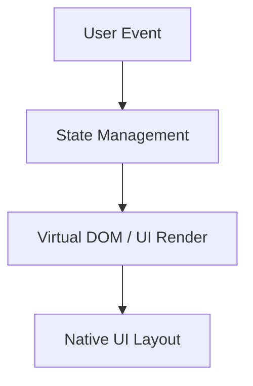
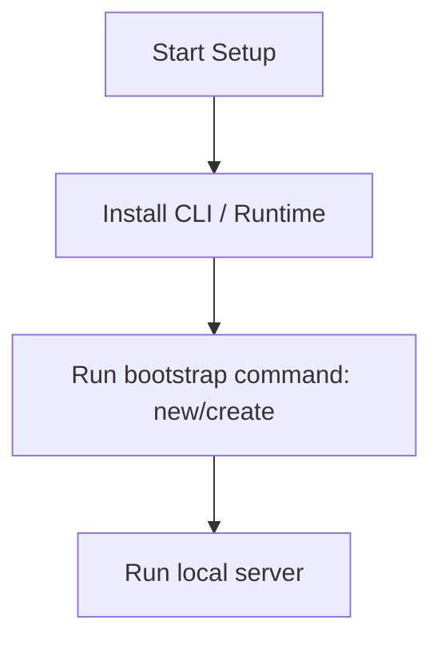

# Nuxt.js Master Engineering Guide

A comprehensive, production-level, industry-grade guide to Nuxt.js for software engineers, backend developers, frontend developers, full-stack developers, DevOps, and architects. Nuxt is an open-source framework under MIT license that makes web development simple and powerful, built on top of Vue.js.

---

## 1. Introduction

### 1.1 Overview & Concepts
Detailed explanation of Introduction in Nuxt.js. Built using TypeScript, Nuxt.js provides rich abstractions for modern web or mobile workflows.

Configure security headers, rate limiting, and follow proper coding guidelines to build production-grade applications with Nuxt.js.

### 1.2 Operations & Verification
Production and verification best practices for Introduction in Nuxt.js.

```bash
# Build the Nuxt application for production
npm run build
```

---

## 2. Why Use This Framework?

### 2.1 Overview & Concepts
Detailed explanation of Why Use This Framework? in Nuxt.js. Built using TypeScript, Nuxt.js provides rich abstractions for modern web or mobile workflows.

Configure security headers, rate limiting, and follow proper coding guidelines to build production-grade applications with Nuxt.js.

### 2.2 Operations & Verification
Production and verification best practices for Why Use This Framework? in Nuxt.js.

```bash
# Preview the production build locally
npm run preview
```

---

## 3. Architecture

### 3.1 Overview & Concepts
Detailed explanation of Architecture in Nuxt.js. Built using TypeScript, Nuxt.js provides rich abstractions for modern web or mobile workflows.



### 3.2 Operations & Verification
Production and verification best practices for Architecture in Nuxt.js.

```bash
# Generate a static site output
npx nuxi generate
```

---

## 4. Installation

### 4.1 Overview & Concepts
Detailed explanation of Installation in Nuxt.js. Built using TypeScript, Nuxt.js provides rich abstractions for modern web or mobile workflows.

#### Official Resources & Installation Flow
- **Download Link**: [Official Nuxt.js Homepage](https://nuxt.dev) or [Package Registry](https://npmjs.com)



### 4.2 Project Scaffolding & Setup
Run the following command to create a new Nuxt project:
```bash
# Scaffold a new Nuxt application
npx nuxi@latest init mynuxtapp
cd mynuxtapp
```

---

## 5. Project Structure

### 5.1 Overview & Concepts
Detailed explanation of Project Structure in Nuxt.js. Built using TypeScript, Nuxt.js provides rich abstractions for modern web or mobile workflows.

```text
src/
├── components/
├── pages/
├── hooks/
└── index.js
```

### 5.2 Operations & Verification
Production and verification best practices for Project Structure in Nuxt.js.

```bash
# Clear Nuxt development cache
npx nuxi cleanup
```

---

## 6. Getting Started

### 6.1 Overview & Concepts
Detailed explanation of Getting Started in Nuxt.js. Built using TypeScript, Nuxt.js provides rich abstractions for modern web or mobile workflows.

Here is a simple starting snippet:

```typescript
// First Nuxt.js app
console.log('Hello from Nuxt.js');
```

### 6.2 Running the Application
Run the following command to start the Nuxt local development server:
```bash
# Start the Nuxt development server
npm run dev -- -o
```

---

## 7. Core Concepts

### 7.1 Overview & Concepts
Detailed explanation of Core Concepts in Nuxt.js. Built using TypeScript, Nuxt.js provides rich abstractions for modern web or mobile workflows.

Configure security headers, rate limiting, and follow proper coding guidelines to build production-grade applications with Nuxt.js.

### 7.2 Operations & Verification
Production and verification best practices for Core Concepts in Nuxt.js.

```bash
# Build the Nuxt application for production
npm run build
```

---

## 8. Routing

### 8.1 Overview & Concepts
Detailed explanation of Routing in Nuxt.js. Built using TypeScript, Nuxt.js provides rich abstractions for modern web or mobile workflows.

Configure security headers, rate limiting, and follow proper coding guidelines to build production-grade applications with Nuxt.js.

### 8.2 Operations & Verification
Production and verification best practices for Routing in Nuxt.js.

```bash
# Preview the production build locally
npm run preview
```

---

## 9. Middleware

### 9.1 Overview & Concepts
Detailed explanation of Middleware in Nuxt.js. Built using TypeScript, Nuxt.js provides rich abstractions for modern web or mobile workflows.

Configure security headers, rate limiting, and follow proper coding guidelines to build production-grade applications with Nuxt.js.

### 9.2 Operations & Verification
Production and verification best practices for Middleware in Nuxt.js.

```bash
# Generate a static site output
npx nuxi generate
```

---

## 10. Request & Response Lifecycle

### 10.1 Overview & Concepts
Detailed explanation of Request & Response Lifecycle in Nuxt.js. Built using TypeScript, Nuxt.js provides rich abstractions for modern web or mobile workflows.

Configure security headers, rate limiting, and follow proper coding guidelines to build production-grade applications with Nuxt.js.

### 10.2 Operations & Verification
Production and verification best practices for Request & Response Lifecycle in Nuxt.js.

```bash
# Clear Nuxt development cache
npx nuxi cleanup
```

---

## 11. Dependency Injection (if supported)

### 11.1 Overview & Concepts
Detailed explanation of Dependency Injection (if supported) in Nuxt.js. Built using TypeScript, Nuxt.js provides rich abstractions for modern web or mobile workflows.

Configure security headers, rate limiting, and follow proper coding guidelines to build production-grade applications with Nuxt.js.

### 11.2 Operations & Verification
Production and verification best practices for Dependency Injection (if supported) in Nuxt.js.

```bash
# Build the Nuxt application for production
npm run build
```

---

## 12. Configuration

### 12.1 Overview & Concepts
Detailed explanation of Configuration in Nuxt.js. Built using TypeScript, Nuxt.js provides rich abstractions for modern web or mobile workflows.

Configure security headers, rate limiting, and follow proper coding guidelines to build production-grade applications with Nuxt.js.

### 12.2 Operations & Verification
Production and verification best practices for Configuration in Nuxt.js.

```bash
# Preview the production build locally
npm run preview
```

---

## 13. Database Integration

### 13.1 Overview & Concepts
Detailed explanation of Database Integration in Nuxt.js. Built using TypeScript, Nuxt.js provides rich abstractions for modern web or mobile workflows.

Configure security headers, rate limiting, and follow proper coding guidelines to build production-grade applications with Nuxt.js.

### 13.2 Operations & Verification
Production and verification best practices for Database Integration in Nuxt.js.

```bash
# Generate a static site output
npx nuxi generate
```

---

## 14. Authentication

### 14.1 Overview & Concepts
Detailed explanation of Authentication in Nuxt.js. Built using TypeScript, Nuxt.js provides rich abstractions for modern web or mobile workflows.

Configure security headers, rate limiting, and follow proper coding guidelines to build production-grade applications with Nuxt.js.

### 14.2 Operations & Verification
Production and verification best practices for Authentication in Nuxt.js.

```bash
# Clear Nuxt development cache
npx nuxi cleanup
```

---

## 15. Authorization

### 15.1 Overview & Concepts
Detailed explanation of Authorization in Nuxt.js. Built using TypeScript, Nuxt.js provides rich abstractions for modern web or mobile workflows.

Configure security headers, rate limiting, and follow proper coding guidelines to build production-grade applications with Nuxt.js.

### 15.2 Operations & Verification
Production and verification best practices for Authorization in Nuxt.js.

```bash
# Build the Nuxt application for production
npm run build
```

---

## 16. Validation

### 16.1 Overview & Concepts
Detailed explanation of Validation in Nuxt.js. Built using TypeScript, Nuxt.js provides rich abstractions for modern web or mobile workflows.

Configure security headers, rate limiting, and follow proper coding guidelines to build production-grade applications with Nuxt.js.

### 16.2 Operations & Verification
Production and verification best practices for Validation in Nuxt.js.

```bash
# Preview the production build locally
npm run preview
```

---

## 17. Error Handling

### 17.1 Overview & Concepts
Detailed explanation of Error Handling in Nuxt.js. Built using TypeScript, Nuxt.js provides rich abstractions for modern web or mobile workflows.

Configure security headers, rate limiting, and follow proper coding guidelines to build production-grade applications with Nuxt.js.

### 17.2 Operations & Verification
Production and verification best practices for Error Handling in Nuxt.js.

```bash
# Generate a static site output
npx nuxi generate
```

---

## 18. Caching

### 18.1 Overview & Concepts
Detailed explanation of Caching in Nuxt.js. Built using TypeScript, Nuxt.js provides rich abstractions for modern web or mobile workflows.

Configure security headers, rate limiting, and follow proper coding guidelines to build production-grade applications with Nuxt.js.

### 18.2 Operations & Verification
Production and verification best practices for Caching in Nuxt.js.

```bash
# Clear Nuxt development cache
npx nuxi cleanup
```

---

## 19. Security

### 19.1 Overview & Concepts
Detailed explanation of Security in Nuxt.js. Built using TypeScript, Nuxt.js provides rich abstractions for modern web or mobile workflows.

Configure security headers, rate limiting, and follow proper coding guidelines to build production-grade applications with Nuxt.js.

### 19.2 Operations & Verification
Production and verification best practices for Security in Nuxt.js.

```bash
# Build the Nuxt application for production
npm run build
```

---

## 20. Performance Optimization

### 20.1 Overview & Concepts
Detailed explanation of Performance Optimization in Nuxt.js. Built using TypeScript, Nuxt.js provides rich abstractions for modern web or mobile workflows.

Configure security headers, rate limiting, and follow proper coding guidelines to build production-grade applications with Nuxt.js.

### 20.2 Operations & Verification
Production and verification best practices for Performance Optimization in Nuxt.js.

```bash
# Preview the production build locally
npm run preview
```

---

## 21. Testing

### 21.1 Overview & Concepts
Detailed explanation of Testing in Nuxt.js. Built using TypeScript, Nuxt.js provides rich abstractions for modern web or mobile workflows.

Configure security headers, rate limiting, and follow proper coding guidelines to build production-grade applications with Nuxt.js.

### 21.2 Operations & Verification
Production and verification best practices for Testing in Nuxt.js.

```bash
# Generate a static site output
npx nuxi generate
```

---

## 22. Deployment

### 22.1 Overview & Concepts
Detailed explanation of Deployment in Nuxt.js. Built using TypeScript, Nuxt.js provides rich abstractions for modern web or mobile workflows.

Configure security headers, rate limiting, and follow proper coding guidelines to build production-grade applications with Nuxt.js.

### 22.2 Operations & Verification
Production and verification best practices for Deployment in Nuxt.js.

```bash
# Clear Nuxt development cache
npx nuxi cleanup
```

---

## 23. Monitoring

### 23.1 Overview & Concepts
Detailed explanation of Monitoring in Nuxt.js. Built using TypeScript, Nuxt.js provides rich abstractions for modern web or mobile workflows.

Configure security headers, rate limiting, and follow proper coding guidelines to build production-grade applications with Nuxt.js.

### 23.2 Operations & Verification
Production and verification best practices for Monitoring in Nuxt.js.

```bash
# Build the Nuxt application for production
npm run build
```

---

## 24. Microservices

### 24.1 Overview & Concepts
Detailed explanation of Microservices in Nuxt.js. Built using TypeScript, Nuxt.js provides rich abstractions for modern web or mobile workflows.

Configure security headers, rate limiting, and follow proper coding guidelines to build production-grade applications with Nuxt.js.

### 24.2 Operations & Verification
Production and verification best practices for Microservices in Nuxt.js.

```bash
# Preview the production build locally
npm run preview
```

---

## 25. AI Integration

### 25.1 Overview & Concepts
Detailed explanation of AI Integration in Nuxt.js. Built using TypeScript, Nuxt.js provides rich abstractions for modern web or mobile workflows.

Integrating OpenAI or Bedrock in Nuxt.js is straightforward using direct client SDKs:

```typescript
import { OpenAI } from 'openai';
const openai = new OpenAI();
const completion = await openai.chat.completions.create({ model: 'gpt-4', messages: [{ role: 'user', content: 'Hello' }] });
console.log(completion.choices[0].message.content);
```

### 25.2 Operations & Verification
Production and verification best practices for AI Integration in Nuxt.js.

```bash
# Generate a static site output
npx nuxi generate
```

---

## 26. Production Architecture

### 26.1 Overview & Concepts
Detailed explanation of Production Architecture in Nuxt.js. Built using TypeScript, Nuxt.js provides rich abstractions for modern web or mobile workflows.

Configure security headers, rate limiting, and follow proper coding guidelines to build production-grade applications with Nuxt.js.

### 26.2 Operations & Verification
Production and verification best practices for Production Architecture in Nuxt.js.

```bash
# Clear Nuxt development cache
npx nuxi cleanup
```

---

## 27. Best Practices

### 27.1 Overview & Concepts
Detailed explanation of Best Practices in Nuxt.js. Built using TypeScript, Nuxt.js provides rich abstractions for modern web or mobile workflows.

Configure security headers, rate limiting, and follow proper coding guidelines to build production-grade applications with Nuxt.js.

### 27.2 Operations & Verification
Production and verification best practices for Best Practices in Nuxt.js.

```bash
# Build the Nuxt application for production
npm run build
```

---

## 28. Common Errors

### 28.1 Overview & Concepts
Detailed explanation of Common Errors in Nuxt.js. Built using TypeScript, Nuxt.js provides rich abstractions for modern web or mobile workflows.

Configure security headers, rate limiting, and follow proper coding guidelines to build production-grade applications with Nuxt.js.

### 28.2 Operations & Verification
Production and verification best practices for Common Errors in Nuxt.js.

```bash
# Preview the production build locally
npm run preview
```

---

## 29. Interview Questions

### 29.1 Overview & Concepts
Detailed explanation of Interview Questions in Nuxt.js. Built using TypeScript, Nuxt.js provides rich abstractions for modern web or mobile workflows.

Configure security headers, rate limiting, and follow proper coding guidelines to build production-grade applications with Nuxt.js.

### 29.2 Operations & Verification
Production and verification best practices for Interview Questions in Nuxt.js.

```bash
# Generate a static site output
npx nuxi generate
```

---

## 30. Cheat Sheet

### 30.1 Overview & Concepts
Detailed explanation of Cheat Sheet in Nuxt.js. Built using TypeScript, Nuxt.js provides rich abstractions for modern web or mobile workflows.

Configure security headers, rate limiting, and follow proper coding guidelines to build production-grade applications with Nuxt.js.

### 30.2 Operations & Verification
Production and verification best practices for Cheat Sheet in Nuxt.js.

```bash
# Clear Nuxt development cache
npx nuxi cleanup
```

---

## 31. Hands-on Projects

### 31.1 Overview & Concepts
Detailed explanation of Hands-on Projects in Nuxt.js. Built using TypeScript, Nuxt.js provides rich abstractions for modern web or mobile workflows.

Configure security headers, rate limiting, and follow proper coding guidelines to build production-grade applications with Nuxt.js.

### 31.2 Operations & Verification
Production and verification best practices for Hands-on Projects in Nuxt.js.

```bash
# Build the Nuxt application for production
npm run build
```

---

## 32. Learning Roadmap

### 32.1 Overview & Concepts
Detailed explanation of Learning Roadmap in Nuxt.js. Built using TypeScript, Nuxt.js provides rich abstractions for modern web or mobile workflows.

Configure security headers, rate limiting, and follow proper coding guidelines to build production-grade applications with Nuxt.js.

### 32.2 Operations & Verification
Production and verification best practices for Learning Roadmap in Nuxt.js.

```bash
# Preview the production build locally
npm run preview
```

---

## 33. Final Summary

### 33.1 Overview & Concepts
Detailed explanation of Final Summary in Nuxt.js. Built using TypeScript, Nuxt.js provides rich abstractions for modern web or mobile workflows.

Configure security headers, rate limiting, and follow proper coding guidelines to build production-grade applications with Nuxt.js.

### 33.2 Operations & Verification
Production and verification best practices for Final Summary in Nuxt.js.

```bash
# Generate a static site output
npx nuxi generate
```

---

---

## 34. Project Creation & Execution Commands

### Scaffolding a New Project
```bash
# Scaffold a new Nuxt application
npx nuxi@latest init mynuxtapp
cd mynuxtapp
```

### Running the Application
```bash
# Start the Nuxt development server
npm run dev -- -o
```
