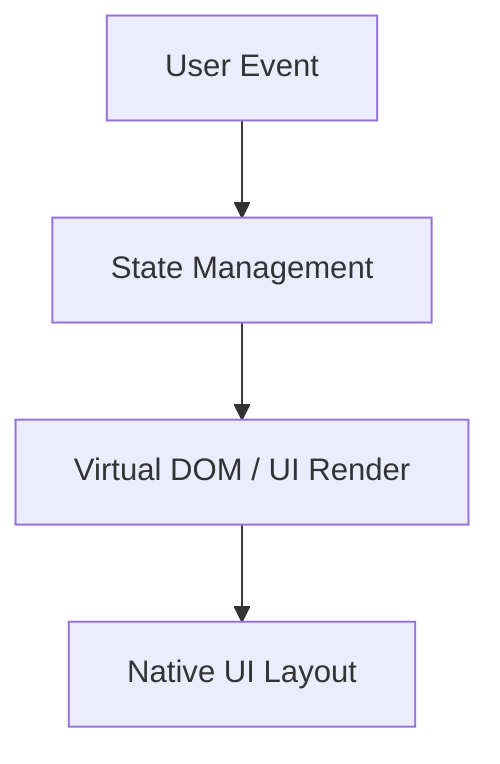
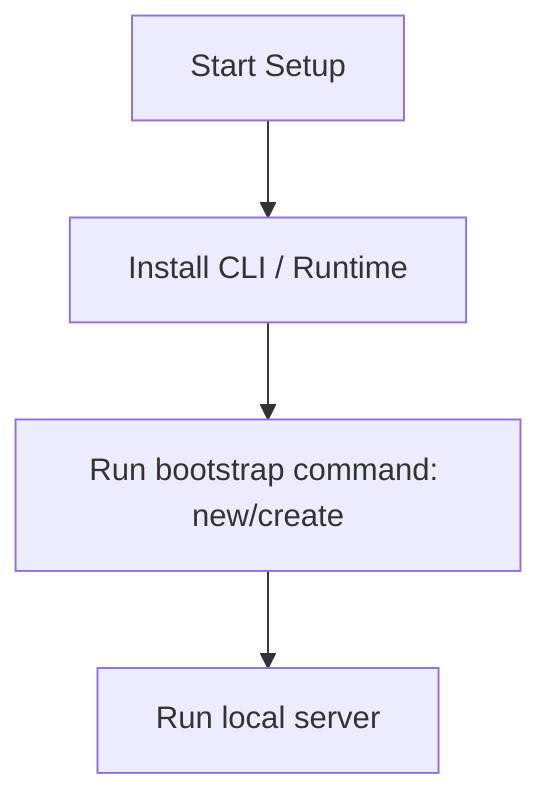

# React Master Engineering Guide

A comprehensive, production-level, industry-grade guide to React for software engineers, backend developers, frontend developers, full-stack developers, DevOps, and architects. React is a free and open-source front-end JavaScript library for building user interfaces based on components.

---

## 1. Introduction

### 1.1 Overview & Concepts
Detailed explanation of Introduction in React. Built using JavaScript/TypeScript, React provides rich abstractions for modern web or mobile workflows.

Configure security headers, rate limiting, and follow proper coding guidelines to build production-grade applications with React.

### 1.2 Operations & Verification
Production and verification best practices for Introduction in React.

```bash
# Build the production assets using Vite
npm run build
```

---

## 2. Why Use This Framework?

### 2.1 Overview & Concepts
Detailed explanation of Why Use This Framework? in React. Built using JavaScript/TypeScript, React provides rich abstractions for modern web or mobile workflows.

Configure security headers, rate limiting, and follow proper coding guidelines to build production-grade applications with React.

### 2.2 Operations & Verification
Production and verification best practices for Why Use This Framework? in React.

```bash
# Preview the production build locally
npm run preview
```

---

## 3. Architecture

### 3.1 Overview & Concepts
Detailed explanation of Architecture in React. Built using JavaScript/TypeScript, React provides rich abstractions for modern web or mobile workflows.



### 3.2 Operations & Verification
Production and verification best practices for Architecture in React.

```bash
# Check TypeScript compilation without emitting files
tsc --noEmit
```

---

## 4. Installation

### 4.1 Overview & Concepts
Detailed explanation of Installation in React. Built using JavaScript/TypeScript, React provides rich abstractions for modern web or mobile workflows.

#### Official Resources & Installation Flow
- **Download Link**: [Official React Homepage](https://react.dev) or [Package Registry](https://npmjs.com)



### 4.2 Project Scaffolding & Setup
Run the following CLI command to scaffold a new React project using Vite:
```bash
# Scaffold a React application using Vite
npm create vite@latest myreactapp -- --template react
cd myreactapp
npm install
```

---

## 5. Project Structure

### 5.1 Overview & Concepts
Detailed explanation of Project Structure in React. Built using JavaScript/TypeScript, React provides rich abstractions for modern web or mobile workflows.

```text
src/
├── components/
├── pages/
├── hooks/
└── index.js
```

### 5.2 Operations & Verification
Production and verification best practices for Project Structure in React.

```bash
# Run unit tests with Vitest
npm run test
```

---

## 6. Getting Started

### 6.1 Overview & Concepts
Detailed explanation of Getting Started in React. Built using JavaScript/TypeScript, React provides rich abstractions for modern web or mobile workflows.

Here is a simple starting snippet:

```typescript
// First React app
console.log('Hello from React');
```

### 6.2 Running the Application
Run the following command to run the React development server:
```bash
# Start the Vite development server
npm run dev
```

---

## 7. Core Concepts

### 7.1 Overview & Concepts
Detailed explanation of Core Concepts in React. Built using JavaScript/TypeScript, React provides rich abstractions for modern web or mobile workflows.

Configure security headers, rate limiting, and follow proper coding guidelines to build production-grade applications with React.

### 7.2 Operations & Verification
Production and verification best practices for Core Concepts in React.

```bash
# Build the production assets using Vite
npm run build
```

---

## 8. Routing

### 8.1 Overview & Concepts
Detailed explanation of Routing in React. Built using JavaScript/TypeScript, React provides rich abstractions for modern web or mobile workflows.

Configure security headers, rate limiting, and follow proper coding guidelines to build production-grade applications with React.

### 8.2 Operations & Verification
Production and verification best practices for Routing in React.

```bash
# Preview the production build locally
npm run preview
```

---

## 9. Middleware

### 9.1 Overview & Concepts
Detailed explanation of Middleware in React. Built using JavaScript/TypeScript, React provides rich abstractions for modern web or mobile workflows.

Configure security headers, rate limiting, and follow proper coding guidelines to build production-grade applications with React.

### 9.2 Operations & Verification
Production and verification best practices for Middleware in React.

```bash
# Check TypeScript compilation without emitting files
tsc --noEmit
```

---

## 10. Request & Response Lifecycle

### 10.1 Overview & Concepts
Detailed explanation of Request & Response Lifecycle in React. Built using JavaScript/TypeScript, React provides rich abstractions for modern web or mobile workflows.

Configure security headers, rate limiting, and follow proper coding guidelines to build production-grade applications with React.

### 10.2 Operations & Verification
Production and verification best practices for Request & Response Lifecycle in React.

```bash
# Run unit tests with Vitest
npm run test
```

---

## 11. Dependency Injection (if supported)

### 11.1 Overview & Concepts
Detailed explanation of Dependency Injection (if supported) in React. Built using JavaScript/TypeScript, React provides rich abstractions for modern web or mobile workflows.

Configure security headers, rate limiting, and follow proper coding guidelines to build production-grade applications with React.

### 11.2 Operations & Verification
Production and verification best practices for Dependency Injection (if supported) in React.

```bash
# Build the production assets using Vite
npm run build
```

---

## 12. Configuration

### 12.1 Overview & Concepts
Detailed explanation of Configuration in React. Built using JavaScript/TypeScript, React provides rich abstractions for modern web or mobile workflows.

Configure security headers, rate limiting, and follow proper coding guidelines to build production-grade applications with React.

### 12.2 Operations & Verification
Production and verification best practices for Configuration in React.

```bash
# Preview the production build locally
npm run preview
```

---

## 13. Database Integration

### 13.1 Overview & Concepts
Detailed explanation of Database Integration in React. Built using JavaScript/TypeScript, React provides rich abstractions for modern web or mobile workflows.

Configure security headers, rate limiting, and follow proper coding guidelines to build production-grade applications with React.

### 13.2 Operations & Verification
Production and verification best practices for Database Integration in React.

```bash
# Check TypeScript compilation without emitting files
tsc --noEmit
```

---

## 14. Authentication

### 14.1 Overview & Concepts
Detailed explanation of Authentication in React. Built using JavaScript/TypeScript, React provides rich abstractions for modern web or mobile workflows.

Configure security headers, rate limiting, and follow proper coding guidelines to build production-grade applications with React.

### 14.2 Operations & Verification
Production and verification best practices for Authentication in React.

```bash
# Run unit tests with Vitest
npm run test
```

---

## 15. Authorization

### 15.1 Overview & Concepts
Detailed explanation of Authorization in React. Built using JavaScript/TypeScript, React provides rich abstractions for modern web or mobile workflows.

Configure security headers, rate limiting, and follow proper coding guidelines to build production-grade applications with React.

### 15.2 Operations & Verification
Production and verification best practices for Authorization in React.

```bash
# Build the production assets using Vite
npm run build
```

---

## 16. Validation

### 16.1 Overview & Concepts
Detailed explanation of Validation in React. Built using JavaScript/TypeScript, React provides rich abstractions for modern web or mobile workflows.

Configure security headers, rate limiting, and follow proper coding guidelines to build production-grade applications with React.

### 16.2 Operations & Verification
Production and verification best practices for Validation in React.

```bash
# Preview the production build locally
npm run preview
```

---

## 17. Error Handling

### 17.1 Overview & Concepts
Detailed explanation of Error Handling in React. Built using JavaScript/TypeScript, React provides rich abstractions for modern web or mobile workflows.

Configure security headers, rate limiting, and follow proper coding guidelines to build production-grade applications with React.

### 17.2 Operations & Verification
Production and verification best practices for Error Handling in React.

```bash
# Check TypeScript compilation without emitting files
tsc --noEmit
```

---

## 18. Caching

### 18.1 Overview & Concepts
Detailed explanation of Caching in React. Built using JavaScript/TypeScript, React provides rich abstractions for modern web or mobile workflows.

Configure security headers, rate limiting, and follow proper coding guidelines to build production-grade applications with React.

### 18.2 Operations & Verification
Production and verification best practices for Caching in React.

```bash
# Run unit tests with Vitest
npm run test
```

---

## 19. Security

### 19.1 Overview & Concepts
Detailed explanation of Security in React. Built using JavaScript/TypeScript, React provides rich abstractions for modern web or mobile workflows.

Configure security headers, rate limiting, and follow proper coding guidelines to build production-grade applications with React.

### 19.2 Operations & Verification
Production and verification best practices for Security in React.

```bash
# Build the production assets using Vite
npm run build
```

---

## 20. Performance Optimization

### 20.1 Overview & Concepts
Detailed explanation of Performance Optimization in React. Built using JavaScript/TypeScript, React provides rich abstractions for modern web or mobile workflows.

Configure security headers, rate limiting, and follow proper coding guidelines to build production-grade applications with React.

### 20.2 Operations & Verification
Production and verification best practices for Performance Optimization in React.

```bash
# Preview the production build locally
npm run preview
```

---

## 21. Testing

### 21.1 Overview & Concepts
Detailed explanation of Testing in React. Built using JavaScript/TypeScript, React provides rich abstractions for modern web or mobile workflows.

Configure security headers, rate limiting, and follow proper coding guidelines to build production-grade applications with React.

### 21.2 Operations & Verification
Production and verification best practices for Testing in React.

```bash
# Check TypeScript compilation without emitting files
tsc --noEmit
```

---

## 22. Deployment

### 22.1 Overview & Concepts
Detailed explanation of Deployment in React. Built using JavaScript/TypeScript, React provides rich abstractions for modern web or mobile workflows.

Configure security headers, rate limiting, and follow proper coding guidelines to build production-grade applications with React.

### 22.2 Operations & Verification
Production and verification best practices for Deployment in React.

```bash
# Run unit tests with Vitest
npm run test
```

---

## 23. Monitoring

### 23.1 Overview & Concepts
Detailed explanation of Monitoring in React. Built using JavaScript/TypeScript, React provides rich abstractions for modern web or mobile workflows.

Configure security headers, rate limiting, and follow proper coding guidelines to build production-grade applications with React.

### 23.2 Operations & Verification
Production and verification best practices for Monitoring in React.

```bash
# Build the production assets using Vite
npm run build
```

---

## 24. Microservices

### 24.1 Overview & Concepts
Detailed explanation of Microservices in React. Built using JavaScript/TypeScript, React provides rich abstractions for modern web or mobile workflows.

Configure security headers, rate limiting, and follow proper coding guidelines to build production-grade applications with React.

### 24.2 Operations & Verification
Production and verification best practices for Microservices in React.

```bash
# Preview the production build locally
npm run preview
```

---

## 25. AI Integration

### 25.1 Overview & Concepts
Detailed explanation of AI Integration in React. Built using JavaScript/TypeScript, React provides rich abstractions for modern web or mobile workflows.

Integrating OpenAI or Bedrock in React is straightforward using direct client SDKs:

```typescript
import { OpenAI } from 'openai';
const openai = new OpenAI();
const completion = await openai.chat.completions.create({ model: 'gpt-4', messages: [{ role: 'user', content: 'Hello' }] });
console.log(completion.choices[0].message.content);
```

### 25.2 Operations & Verification
Production and verification best practices for AI Integration in React.

```bash
# Check TypeScript compilation without emitting files
tsc --noEmit
```

---

## 26. Production Architecture

### 26.1 Overview & Concepts
Detailed explanation of Production Architecture in React. Built using JavaScript/TypeScript, React provides rich abstractions for modern web or mobile workflows.

Configure security headers, rate limiting, and follow proper coding guidelines to build production-grade applications with React.

### 26.2 Operations & Verification
Production and verification best practices for Production Architecture in React.

```bash
# Run unit tests with Vitest
npm run test
```

---

## 27. Best Practices

### 27.1 Overview & Concepts
Detailed explanation of Best Practices in React. Built using JavaScript/TypeScript, React provides rich abstractions for modern web or mobile workflows.

Configure security headers, rate limiting, and follow proper coding guidelines to build production-grade applications with React.

### 27.2 Operations & Verification
Production and verification best practices for Best Practices in React.

```bash
# Build the production assets using Vite
npm run build
```

---

## 28. Common Errors

### 28.1 Overview & Concepts
Detailed explanation of Common Errors in React. Built using JavaScript/TypeScript, React provides rich abstractions for modern web or mobile workflows.

Configure security headers, rate limiting, and follow proper coding guidelines to build production-grade applications with React.

### 28.2 Operations & Verification
Production and verification best practices for Common Errors in React.

```bash
# Preview the production build locally
npm run preview
```

---

## 29. Interview Questions

### 29.1 Overview & Concepts
Detailed explanation of Interview Questions in React. Built using JavaScript/TypeScript, React provides rich abstractions for modern web or mobile workflows.

Configure security headers, rate limiting, and follow proper coding guidelines to build production-grade applications with React.

### 29.2 Operations & Verification
Production and verification best practices for Interview Questions in React.

```bash
# Check TypeScript compilation without emitting files
tsc --noEmit
```

---

## 30. Cheat Sheet

### 30.1 Overview & Concepts
Detailed explanation of Cheat Sheet in React. Built using JavaScript/TypeScript, React provides rich abstractions for modern web or mobile workflows.

Configure security headers, rate limiting, and follow proper coding guidelines to build production-grade applications with React.

### 30.2 Operations & Verification
Production and verification best practices for Cheat Sheet in React.

```bash
# Run unit tests with Vitest
npm run test
```

---

## 31. Hands-on Projects

### 31.1 Overview & Concepts
Detailed explanation of Hands-on Projects in React. Built using JavaScript/TypeScript, React provides rich abstractions for modern web or mobile workflows.

Configure security headers, rate limiting, and follow proper coding guidelines to build production-grade applications with React.

### 31.2 Operations & Verification
Production and verification best practices for Hands-on Projects in React.

```bash
# Build the production assets using Vite
npm run build
```

---

## 32. Learning Roadmap

### 32.1 Overview & Concepts
Detailed explanation of Learning Roadmap in React. Built using JavaScript/TypeScript, React provides rich abstractions for modern web or mobile workflows.

Configure security headers, rate limiting, and follow proper coding guidelines to build production-grade applications with React.

### 32.2 Operations & Verification
Production and verification best practices for Learning Roadmap in React.

```bash
# Preview the production build locally
npm run preview
```

---

## 33. Final Summary

### 33.1 Overview & Concepts
Detailed explanation of Final Summary in React. Built using JavaScript/TypeScript, React provides rich abstractions for modern web or mobile workflows.

Configure security headers, rate limiting, and follow proper coding guidelines to build production-grade applications with React.

### 33.2 Operations & Verification
Production and verification best practices for Final Summary in React.

```bash
# Check TypeScript compilation without emitting files
tsc --noEmit
```

---

---

## 34. Project Creation & Execution Commands

### Scaffolding a New Project
```bash
# Scaffold a React application using Vite
npm create vite@latest myreactapp -- --template react
cd myreactapp
npm install
```

### Running the Application
```bash
# Start the Vite development server
npm run dev
```
