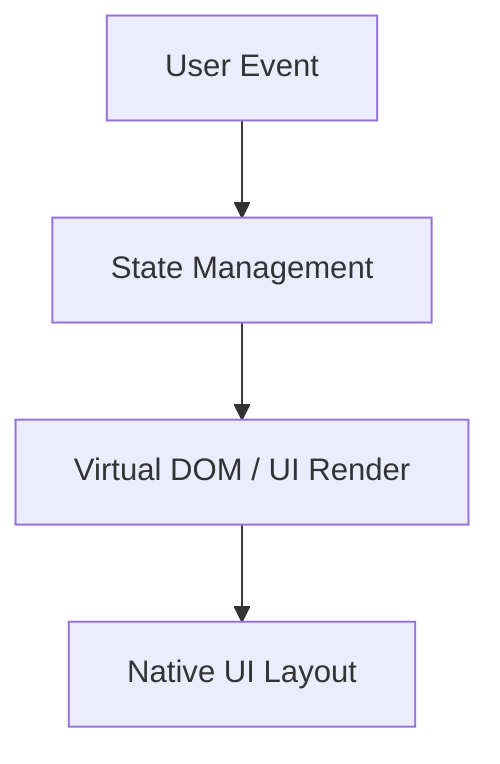
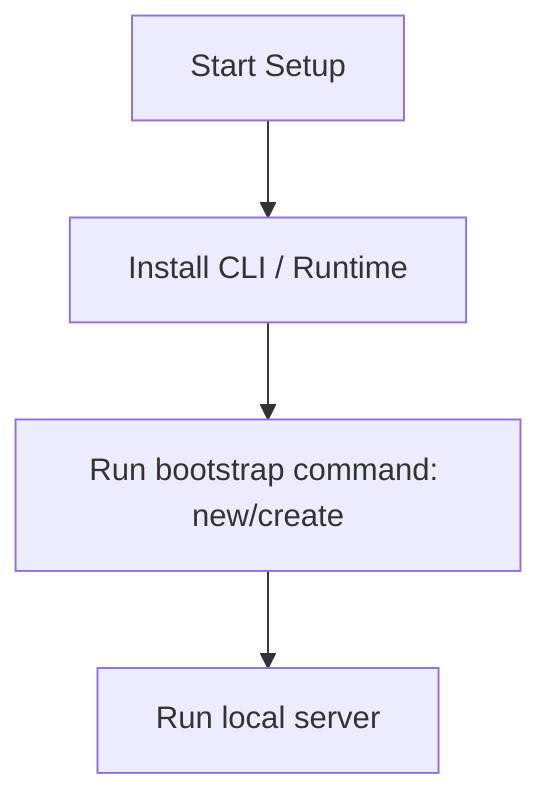

# Vue.js Master Engineering Guide

A comprehensive, production-level, industry-grade guide to Vue.js for software engineers, backend developers, frontend developers, full-stack developers, DevOps, and architects. Vue.js is an approachable, performant, and versatile framework for building web user interfaces.

---

## 1. Introduction

### 1.1 Overview & Concepts
Detailed explanation of Introduction in Vue.js. Built using JavaScript/TypeScript, Vue.js provides rich abstractions for modern web or mobile workflows.

Configure security headers, rate limiting, and follow proper coding guidelines to build production-grade applications with Vue.js.

### 1.2 Operations & Verification
Production and verification best practices for Introduction in Vue.js.

```bash
# Build Vue project for production
npm run build
```

---

## 2. Why Use This Framework?

### 2.1 Overview & Concepts
Detailed explanation of Why Use This Framework? in Vue.js. Built using JavaScript/TypeScript, Vue.js provides rich abstractions for modern web or mobile workflows.

Configure security headers, rate limiting, and follow proper coding guidelines to build production-grade applications with Vue.js.

### 2.2 Operations & Verification
Production and verification best practices for Why Use This Framework? in Vue.js.

```bash
# Preview production build locally
npm run preview
```

---

## 3. Architecture

### 3.1 Overview & Concepts
Detailed explanation of Architecture in Vue.js. Built using JavaScript/TypeScript, Vue.js provides rich abstractions for modern web or mobile workflows.



### 3.2 Operations & Verification
Production and verification best practices for Architecture in Vue.js.

```bash
# Lint and fix code syntax issues
npm run lint -- --fix
```

---

## 4. Installation

### 4.1 Overview & Concepts
Detailed explanation of Installation in Vue.js. Built using JavaScript/TypeScript, Vue.js provides rich abstractions for modern web or mobile workflows.

#### Official Resources & Installation Flow
- **Download Link**: [Official Vue.js Homepage](https://vue.dev) or [Package Registry](https://npmjs.com)



### 4.2 Project Scaffolding & Setup
Run the following commands to create a Vue application:
```bash
# Create a new Vue application using Vite
npm create vue@latest myvueapp
cd myvueapp
npm install
```

---

## 5. Project Structure

### 5.1 Overview & Concepts
Detailed explanation of Project Structure in Vue.js. Built using JavaScript/TypeScript, Vue.js provides rich abstractions for modern web or mobile workflows.

```text
src/
├── components/
├── pages/
├── hooks/
└── index.js
```

### 5.2 Operations & Verification
Production and verification best practices for Project Structure in Vue.js.

```bash
# Build Vue project for production
npm run build
```

---

## 6. Getting Started

### 6.1 Overview & Concepts
Detailed explanation of Getting Started in Vue.js. Built using JavaScript/TypeScript, Vue.js provides rich abstractions for modern web or mobile workflows.

Here is a simple starting snippet:

```typescript
// First Vue.js app
console.log('Hello from Vue.js');
```

### 6.2 Running the Application
Run the following command to run the Vue development server:
```bash
# Start the Vue development server
npm run dev
```

---

## 7. Core Concepts

### 7.1 Overview & Concepts
Detailed explanation of Core Concepts in Vue.js. Built using JavaScript/TypeScript, Vue.js provides rich abstractions for modern web or mobile workflows.

Configure security headers, rate limiting, and follow proper coding guidelines to build production-grade applications with Vue.js.

### 7.2 Operations & Verification
Production and verification best practices for Core Concepts in Vue.js.

```bash
# Preview production build locally
npm run preview
```

---

## 8. Routing

### 8.1 Overview & Concepts
Detailed explanation of Routing in Vue.js. Built using JavaScript/TypeScript, Vue.js provides rich abstractions for modern web or mobile workflows.

Configure security headers, rate limiting, and follow proper coding guidelines to build production-grade applications with Vue.js.

### 8.2 Operations & Verification
Production and verification best practices for Routing in Vue.js.

```bash
# Lint and fix code syntax issues
npm run lint -- --fix
```

---

## 9. Middleware

### 9.1 Overview & Concepts
Detailed explanation of Middleware in Vue.js. Built using JavaScript/TypeScript, Vue.js provides rich abstractions for modern web or mobile workflows.

Configure security headers, rate limiting, and follow proper coding guidelines to build production-grade applications with Vue.js.

### 9.2 Operations & Verification
Production and verification best practices for Middleware in Vue.js.

```bash
# Build Vue project for production
npm run build
```

---

## 10. Request & Response Lifecycle

### 10.1 Overview & Concepts
Detailed explanation of Request & Response Lifecycle in Vue.js. Built using JavaScript/TypeScript, Vue.js provides rich abstractions for modern web or mobile workflows.

Configure security headers, rate limiting, and follow proper coding guidelines to build production-grade applications with Vue.js.

### 10.2 Operations & Verification
Production and verification best practices for Request & Response Lifecycle in Vue.js.

```bash
# Preview production build locally
npm run preview
```

---

## 11. Dependency Injection (if supported)

### 11.1 Overview & Concepts
Detailed explanation of Dependency Injection (if supported) in Vue.js. Built using JavaScript/TypeScript, Vue.js provides rich abstractions for modern web or mobile workflows.

Configure security headers, rate limiting, and follow proper coding guidelines to build production-grade applications with Vue.js.

### 11.2 Operations & Verification
Production and verification best practices for Dependency Injection (if supported) in Vue.js.

```bash
# Lint and fix code syntax issues
npm run lint -- --fix
```

---

## 12. Configuration

### 12.1 Overview & Concepts
Detailed explanation of Configuration in Vue.js. Built using JavaScript/TypeScript, Vue.js provides rich abstractions for modern web or mobile workflows.

Configure security headers, rate limiting, and follow proper coding guidelines to build production-grade applications with Vue.js.

### 12.2 Operations & Verification
Production and verification best practices for Configuration in Vue.js.

```bash
# Build Vue project for production
npm run build
```

---

## 13. Database Integration

### 13.1 Overview & Concepts
Detailed explanation of Database Integration in Vue.js. Built using JavaScript/TypeScript, Vue.js provides rich abstractions for modern web or mobile workflows.

Configure security headers, rate limiting, and follow proper coding guidelines to build production-grade applications with Vue.js.

### 13.2 Operations & Verification
Production and verification best practices for Database Integration in Vue.js.

```bash
# Preview production build locally
npm run preview
```

---

## 14. Authentication

### 14.1 Overview & Concepts
Detailed explanation of Authentication in Vue.js. Built using JavaScript/TypeScript, Vue.js provides rich abstractions for modern web or mobile workflows.

Configure security headers, rate limiting, and follow proper coding guidelines to build production-grade applications with Vue.js.

### 14.2 Operations & Verification
Production and verification best practices for Authentication in Vue.js.

```bash
# Lint and fix code syntax issues
npm run lint -- --fix
```

---

## 15. Authorization

### 15.1 Overview & Concepts
Detailed explanation of Authorization in Vue.js. Built using JavaScript/TypeScript, Vue.js provides rich abstractions for modern web or mobile workflows.

Configure security headers, rate limiting, and follow proper coding guidelines to build production-grade applications with Vue.js.

### 15.2 Operations & Verification
Production and verification best practices for Authorization in Vue.js.

```bash
# Build Vue project for production
npm run build
```

---

## 16. Validation

### 16.1 Overview & Concepts
Detailed explanation of Validation in Vue.js. Built using JavaScript/TypeScript, Vue.js provides rich abstractions for modern web or mobile workflows.

Configure security headers, rate limiting, and follow proper coding guidelines to build production-grade applications with Vue.js.

### 16.2 Operations & Verification
Production and verification best practices for Validation in Vue.js.

```bash
# Preview production build locally
npm run preview
```

---

## 17. Error Handling

### 17.1 Overview & Concepts
Detailed explanation of Error Handling in Vue.js. Built using JavaScript/TypeScript, Vue.js provides rich abstractions for modern web or mobile workflows.

Configure security headers, rate limiting, and follow proper coding guidelines to build production-grade applications with Vue.js.

### 17.2 Operations & Verification
Production and verification best practices for Error Handling in Vue.js.

```bash
# Lint and fix code syntax issues
npm run lint -- --fix
```

---

## 18. Caching

### 18.1 Overview & Concepts
Detailed explanation of Caching in Vue.js. Built using JavaScript/TypeScript, Vue.js provides rich abstractions for modern web or mobile workflows.

Configure security headers, rate limiting, and follow proper coding guidelines to build production-grade applications with Vue.js.

### 18.2 Operations & Verification
Production and verification best practices for Caching in Vue.js.

```bash
# Build Vue project for production
npm run build
```

---

## 19. Security

### 19.1 Overview & Concepts
Detailed explanation of Security in Vue.js. Built using JavaScript/TypeScript, Vue.js provides rich abstractions for modern web or mobile workflows.

Configure security headers, rate limiting, and follow proper coding guidelines to build production-grade applications with Vue.js.

### 19.2 Operations & Verification
Production and verification best practices for Security in Vue.js.

```bash
# Preview production build locally
npm run preview
```

---

## 20. Performance Optimization

### 20.1 Overview & Concepts
Detailed explanation of Performance Optimization in Vue.js. Built using JavaScript/TypeScript, Vue.js provides rich abstractions for modern web or mobile workflows.

Configure security headers, rate limiting, and follow proper coding guidelines to build production-grade applications with Vue.js.

### 20.2 Operations & Verification
Production and verification best practices for Performance Optimization in Vue.js.

```bash
# Lint and fix code syntax issues
npm run lint -- --fix
```

---

## 21. Testing

### 21.1 Overview & Concepts
Detailed explanation of Testing in Vue.js. Built using JavaScript/TypeScript, Vue.js provides rich abstractions for modern web or mobile workflows.

Configure security headers, rate limiting, and follow proper coding guidelines to build production-grade applications with Vue.js.

### 21.2 Operations & Verification
Production and verification best practices for Testing in Vue.js.

```bash
# Build Vue project for production
npm run build
```

---

## 22. Deployment

### 22.1 Overview & Concepts
Detailed explanation of Deployment in Vue.js. Built using JavaScript/TypeScript, Vue.js provides rich abstractions for modern web or mobile workflows.

Configure security headers, rate limiting, and follow proper coding guidelines to build production-grade applications with Vue.js.

### 22.2 Operations & Verification
Production and verification best practices for Deployment in Vue.js.

```bash
# Preview production build locally
npm run preview
```

---

## 23. Monitoring

### 23.1 Overview & Concepts
Detailed explanation of Monitoring in Vue.js. Built using JavaScript/TypeScript, Vue.js provides rich abstractions for modern web or mobile workflows.

Configure security headers, rate limiting, and follow proper coding guidelines to build production-grade applications with Vue.js.

### 23.2 Operations & Verification
Production and verification best practices for Monitoring in Vue.js.

```bash
# Lint and fix code syntax issues
npm run lint -- --fix
```

---

## 24. Microservices

### 24.1 Overview & Concepts
Detailed explanation of Microservices in Vue.js. Built using JavaScript/TypeScript, Vue.js provides rich abstractions for modern web or mobile workflows.

Configure security headers, rate limiting, and follow proper coding guidelines to build production-grade applications with Vue.js.

### 24.2 Operations & Verification
Production and verification best practices for Microservices in Vue.js.

```bash
# Build Vue project for production
npm run build
```

---

## 25. AI Integration

### 25.1 Overview & Concepts
Detailed explanation of AI Integration in Vue.js. Built using JavaScript/TypeScript, Vue.js provides rich abstractions for modern web or mobile workflows.

Integrating OpenAI or Bedrock in Vue.js is straightforward using direct client SDKs:

```typescript
import { OpenAI } from 'openai';
const openai = new OpenAI();
const completion = await openai.chat.completions.create({ model: 'gpt-4', messages: [{ role: 'user', content: 'Hello' }] });
console.log(completion.choices[0].message.content);
```

### 25.2 Operations & Verification
Production and verification best practices for AI Integration in Vue.js.

```bash
# Preview production build locally
npm run preview
```

---

## 26. Production Architecture

### 26.1 Overview & Concepts
Detailed explanation of Production Architecture in Vue.js. Built using JavaScript/TypeScript, Vue.js provides rich abstractions for modern web or mobile workflows.

Configure security headers, rate limiting, and follow proper coding guidelines to build production-grade applications with Vue.js.

### 26.2 Operations & Verification
Production and verification best practices for Production Architecture in Vue.js.

```bash
# Lint and fix code syntax issues
npm run lint -- --fix
```

---

## 27. Best Practices

### 27.1 Overview & Concepts
Detailed explanation of Best Practices in Vue.js. Built using JavaScript/TypeScript, Vue.js provides rich abstractions for modern web or mobile workflows.

Configure security headers, rate limiting, and follow proper coding guidelines to build production-grade applications with Vue.js.

### 27.2 Operations & Verification
Production and verification best practices for Best Practices in Vue.js.

```bash
# Build Vue project for production
npm run build
```

---

## 28. Common Errors

### 28.1 Overview & Concepts
Detailed explanation of Common Errors in Vue.js. Built using JavaScript/TypeScript, Vue.js provides rich abstractions for modern web or mobile workflows.

Configure security headers, rate limiting, and follow proper coding guidelines to build production-grade applications with Vue.js.

### 28.2 Operations & Verification
Production and verification best practices for Common Errors in Vue.js.

```bash
# Preview production build locally
npm run preview
```

---

## 29. Interview Questions

### 29.1 Overview & Concepts
Detailed explanation of Interview Questions in Vue.js. Built using JavaScript/TypeScript, Vue.js provides rich abstractions for modern web or mobile workflows.

Configure security headers, rate limiting, and follow proper coding guidelines to build production-grade applications with Vue.js.

### 29.2 Operations & Verification
Production and verification best practices for Interview Questions in Vue.js.

```bash
# Lint and fix code syntax issues
npm run lint -- --fix
```

---

## 30. Cheat Sheet

### 30.1 Overview & Concepts
Detailed explanation of Cheat Sheet in Vue.js. Built using JavaScript/TypeScript, Vue.js provides rich abstractions for modern web or mobile workflows.

Configure security headers, rate limiting, and follow proper coding guidelines to build production-grade applications with Vue.js.

### 30.2 Operations & Verification
Production and verification best practices for Cheat Sheet in Vue.js.

```bash
# Build Vue project for production
npm run build
```

---

## 31. Hands-on Projects

### 31.1 Overview & Concepts
Detailed explanation of Hands-on Projects in Vue.js. Built using JavaScript/TypeScript, Vue.js provides rich abstractions for modern web or mobile workflows.

Configure security headers, rate limiting, and follow proper coding guidelines to build production-grade applications with Vue.js.

### 31.2 Operations & Verification
Production and verification best practices for Hands-on Projects in Vue.js.

```bash
# Preview production build locally
npm run preview
```

---

## 32. Learning Roadmap

### 32.1 Overview & Concepts
Detailed explanation of Learning Roadmap in Vue.js. Built using JavaScript/TypeScript, Vue.js provides rich abstractions for modern web or mobile workflows.

Configure security headers, rate limiting, and follow proper coding guidelines to build production-grade applications with Vue.js.

### 32.2 Operations & Verification
Production and verification best practices for Learning Roadmap in Vue.js.

```bash
# Lint and fix code syntax issues
npm run lint -- --fix
```

---

## 33. Final Summary

### 33.1 Overview & Concepts
Detailed explanation of Final Summary in Vue.js. Built using JavaScript/TypeScript, Vue.js provides rich abstractions for modern web or mobile workflows.

Configure security headers, rate limiting, and follow proper coding guidelines to build production-grade applications with Vue.js.

### 33.2 Operations & Verification
Production and verification best practices for Final Summary in Vue.js.

```bash
# Build Vue project for production
npm run build
```

---

---

## 34. Project Creation & Execution Commands

### Scaffolding a New Project
```bash
# Create a new Vue application using Vite
npm create vue@latest myvueapp
cd myvueapp
npm install
```

### Running the Application
```bash
# Start the Vue development server
npm run dev
```
