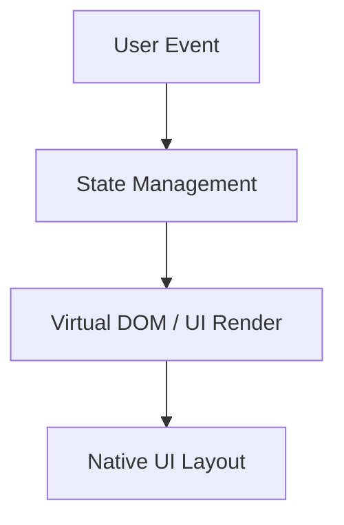
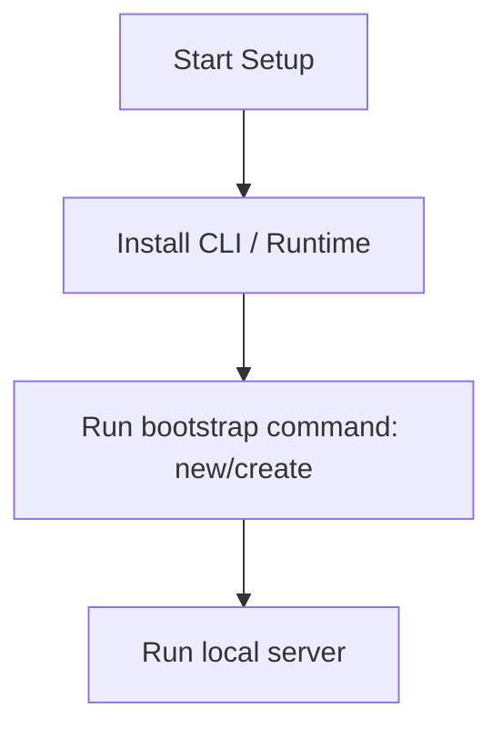

# Flutter Master Engineering Guide

A comprehensive, production-level, industry-grade guide to Flutter for software engineers, backend developers, frontend developers, full-stack developers, DevOps, and architects. Flutter is an open-source UI software development kit created by Google, used to develop cross-platform applications.

---

## 1. Introduction

### 1.1 Overview & Concepts
Detailed explanation of Introduction in Flutter. Built using Dart, Flutter provides rich abstractions for modern web or mobile workflows.

Configure security headers, rate limiting, and follow proper coding guidelines to build production-grade applications with Flutter.

### 1.2 Operations & Verification
Production and verification best practices for Introduction in Flutter.

```bash
# Analyze Flutter code for issues
flutter analyze
```

---

## 2. Why Use This Framework?

### 2.1 Overview & Concepts
Detailed explanation of Why Use This Framework? in Flutter. Built using Dart, Flutter provides rich abstractions for modern web or mobile workflows.

Configure security headers, rate limiting, and follow proper coding guidelines to build production-grade applications with Flutter.

### 2.2 Operations & Verification
Production and verification best practices for Why Use This Framework? in Flutter.

```bash
# Run Flutter unit tests
flutter test
```

---

## 3. Architecture

### 3.1 Overview & Concepts
Detailed explanation of Architecture in Flutter. Built using Dart, Flutter provides rich abstractions for modern web or mobile workflows.



### 3.2 Operations & Verification
Production and verification best practices for Architecture in Flutter.

```bash
# Build a release APK for Android
flutter build apk --release
```

---

## 4. Installation

### 4.1 Overview & Concepts
Detailed explanation of Installation in Flutter. Built using Dart, Flutter provides rich abstractions for modern web or mobile workflows.

#### Official Resources & Installation Flow
- **Download Link**: [Official Flutter Homepage](https://flutter.dev) or [Package Registry](https://npmjs.com)



### 4.2 Project Scaffolding & Setup
Run the following Flutter CLI commands to create a new app:
```bash
# Scaffold a new Flutter project
flutter create myflutterapp
cd myflutterapp
```

---

## 5. Project Structure

### 5.1 Overview & Concepts
Detailed explanation of Project Structure in Flutter. Built using Dart, Flutter provides rich abstractions for modern web or mobile workflows.

```text
src/
├── components/
├── pages/
├── hooks/
└── index.js
```

### 5.2 Operations & Verification
Production and verification best practices for Project Structure in Flutter.

```bash
# Build a release app bundle for iOS
flutter build ios --release
```

---

## 6. Getting Started

### 6.1 Overview & Concepts
Detailed explanation of Getting Started in Flutter. Built using Dart, Flutter provides rich abstractions for modern web or mobile workflows.

Here is a simple starting snippet:

```java
// First Flutter app
System.out.println("Hello from Flutter");
```

### 6.2 Running the Application
Run the following command to run the Flutter application on a connected device/simulator:
```bash
# Run the Flutter application on an active simulator or device
flutter run
```

---

## 7. Core Concepts

### 7.1 Overview & Concepts
Detailed explanation of Core Concepts in Flutter. Built using Dart, Flutter provides rich abstractions for modern web or mobile workflows.

Configure security headers, rate limiting, and follow proper coding guidelines to build production-grade applications with Flutter.

### 7.2 Operations & Verification
Production and verification best practices for Core Concepts in Flutter.

```bash
# Clean build cache and temporary directories
flutter clean
```

---

## 8. Routing

### 8.1 Overview & Concepts
Detailed explanation of Routing in Flutter. Built using Dart, Flutter provides rich abstractions for modern web or mobile workflows.

Configure security headers, rate limiting, and follow proper coding guidelines to build production-grade applications with Flutter.

### 8.2 Operations & Verification
Production and verification best practices for Routing in Flutter.

```bash
# Analyze Flutter code for issues
flutter analyze
```

---

## 9. Middleware

### 9.1 Overview & Concepts
Detailed explanation of Middleware in Flutter. Built using Dart, Flutter provides rich abstractions for modern web or mobile workflows.

Configure security headers, rate limiting, and follow proper coding guidelines to build production-grade applications with Flutter.

### 9.2 Operations & Verification
Production and verification best practices for Middleware in Flutter.

```bash
# Run Flutter unit tests
flutter test
```

---

## 10. Request & Response Lifecycle

### 10.1 Overview & Concepts
Detailed explanation of Request & Response Lifecycle in Flutter. Built using Dart, Flutter provides rich abstractions for modern web or mobile workflows.

Configure security headers, rate limiting, and follow proper coding guidelines to build production-grade applications with Flutter.

### 10.2 Operations & Verification
Production and verification best practices for Request & Response Lifecycle in Flutter.

```bash
# Build a release APK for Android
flutter build apk --release
```

---

## 11. Dependency Injection (if supported)

### 11.1 Overview & Concepts
Detailed explanation of Dependency Injection (if supported) in Flutter. Built using Dart, Flutter provides rich abstractions for modern web or mobile workflows.

Configure security headers, rate limiting, and follow proper coding guidelines to build production-grade applications with Flutter.

### 11.2 Operations & Verification
Production and verification best practices for Dependency Injection (if supported) in Flutter.

```bash
# Build a release app bundle for iOS
flutter build ios --release
```

---

## 12. Configuration

### 12.1 Overview & Concepts
Detailed explanation of Configuration in Flutter. Built using Dart, Flutter provides rich abstractions for modern web or mobile workflows.

Configure security headers, rate limiting, and follow proper coding guidelines to build production-grade applications with Flutter.

### 12.2 Operations & Verification
Production and verification best practices for Configuration in Flutter.

```bash
# Clean build cache and temporary directories
flutter clean
```

---

## 13. Database Integration

### 13.1 Overview & Concepts
Detailed explanation of Database Integration in Flutter. Built using Dart, Flutter provides rich abstractions for modern web or mobile workflows.

Configure security headers, rate limiting, and follow proper coding guidelines to build production-grade applications with Flutter.

### 13.2 Operations & Verification
Production and verification best practices for Database Integration in Flutter.

```bash
# Analyze Flutter code for issues
flutter analyze
```

---

## 14. Authentication

### 14.1 Overview & Concepts
Detailed explanation of Authentication in Flutter. Built using Dart, Flutter provides rich abstractions for modern web or mobile workflows.

Configure security headers, rate limiting, and follow proper coding guidelines to build production-grade applications with Flutter.

### 14.2 Operations & Verification
Production and verification best practices for Authentication in Flutter.

```bash
# Run Flutter unit tests
flutter test
```

---

## 15. Authorization

### 15.1 Overview & Concepts
Detailed explanation of Authorization in Flutter. Built using Dart, Flutter provides rich abstractions for modern web or mobile workflows.

Configure security headers, rate limiting, and follow proper coding guidelines to build production-grade applications with Flutter.

### 15.2 Operations & Verification
Production and verification best practices for Authorization in Flutter.

```bash
# Build a release APK for Android
flutter build apk --release
```

---

## 16. Validation

### 16.1 Overview & Concepts
Detailed explanation of Validation in Flutter. Built using Dart, Flutter provides rich abstractions for modern web or mobile workflows.

Configure security headers, rate limiting, and follow proper coding guidelines to build production-grade applications with Flutter.

### 16.2 Operations & Verification
Production and verification best practices for Validation in Flutter.

```bash
# Build a release app bundle for iOS
flutter build ios --release
```

---

## 17. Error Handling

### 17.1 Overview & Concepts
Detailed explanation of Error Handling in Flutter. Built using Dart, Flutter provides rich abstractions for modern web or mobile workflows.

Configure security headers, rate limiting, and follow proper coding guidelines to build production-grade applications with Flutter.

### 17.2 Operations & Verification
Production and verification best practices for Error Handling in Flutter.

```bash
# Clean build cache and temporary directories
flutter clean
```

---

## 18. Caching

### 18.1 Overview & Concepts
Detailed explanation of Caching in Flutter. Built using Dart, Flutter provides rich abstractions for modern web or mobile workflows.

Configure security headers, rate limiting, and follow proper coding guidelines to build production-grade applications with Flutter.

### 18.2 Operations & Verification
Production and verification best practices for Caching in Flutter.

```bash
# Analyze Flutter code for issues
flutter analyze
```

---

## 19. Security

### 19.1 Overview & Concepts
Detailed explanation of Security in Flutter. Built using Dart, Flutter provides rich abstractions for modern web or mobile workflows.

Configure security headers, rate limiting, and follow proper coding guidelines to build production-grade applications with Flutter.

### 19.2 Operations & Verification
Production and verification best practices for Security in Flutter.

```bash
# Run Flutter unit tests
flutter test
```

---

## 20. Performance Optimization

### 20.1 Overview & Concepts
Detailed explanation of Performance Optimization in Flutter. Built using Dart, Flutter provides rich abstractions for modern web or mobile workflows.

Configure security headers, rate limiting, and follow proper coding guidelines to build production-grade applications with Flutter.

### 20.2 Operations & Verification
Production and verification best practices for Performance Optimization in Flutter.

```bash
# Build a release APK for Android
flutter build apk --release
```

---

## 21. Testing

### 21.1 Overview & Concepts
Detailed explanation of Testing in Flutter. Built using Dart, Flutter provides rich abstractions for modern web or mobile workflows.

Configure security headers, rate limiting, and follow proper coding guidelines to build production-grade applications with Flutter.

### 21.2 Operations & Verification
Production and verification best practices for Testing in Flutter.

```bash
# Build a release app bundle for iOS
flutter build ios --release
```

---

## 22. Deployment

### 22.1 Overview & Concepts
Detailed explanation of Deployment in Flutter. Built using Dart, Flutter provides rich abstractions for modern web or mobile workflows.

Configure security headers, rate limiting, and follow proper coding guidelines to build production-grade applications with Flutter.

### 22.2 Operations & Verification
Production and verification best practices for Deployment in Flutter.

```bash
# Clean build cache and temporary directories
flutter clean
```

---

## 23. Monitoring

### 23.1 Overview & Concepts
Detailed explanation of Monitoring in Flutter. Built using Dart, Flutter provides rich abstractions for modern web or mobile workflows.

Configure security headers, rate limiting, and follow proper coding guidelines to build production-grade applications with Flutter.

### 23.2 Operations & Verification
Production and verification best practices for Monitoring in Flutter.

```bash
# Analyze Flutter code for issues
flutter analyze
```

---

## 24. Microservices

### 24.1 Overview & Concepts
Detailed explanation of Microservices in Flutter. Built using Dart, Flutter provides rich abstractions for modern web or mobile workflows.

Configure security headers, rate limiting, and follow proper coding guidelines to build production-grade applications with Flutter.

### 24.2 Operations & Verification
Production and verification best practices for Microservices in Flutter.

```bash
# Run Flutter unit tests
flutter test
```

---

## 25. AI Integration

### 25.1 Overview & Concepts
Detailed explanation of AI Integration in Flutter. Built using Dart, Flutter provides rich abstractions for modern web or mobile workflows.

Integrating OpenAI or Bedrock in Flutter is straightforward using direct client SDKs:

```typescript
import { OpenAI } from 'openai';
const openai = new OpenAI();
const completion = await openai.chat.completions.create({ model: 'gpt-4', messages: [{ role: 'user', content: 'Hello' }] });
console.log(completion.choices[0].message.content);
```

### 25.2 Operations & Verification
Production and verification best practices for AI Integration in Flutter.

```bash
# Build a release APK for Android
flutter build apk --release
```

---

## 26. Production Architecture

### 26.1 Overview & Concepts
Detailed explanation of Production Architecture in Flutter. Built using Dart, Flutter provides rich abstractions for modern web or mobile workflows.

Configure security headers, rate limiting, and follow proper coding guidelines to build production-grade applications with Flutter.

### 26.2 Operations & Verification
Production and verification best practices for Production Architecture in Flutter.

```bash
# Build a release app bundle for iOS
flutter build ios --release
```

---

## 27. Best Practices

### 27.1 Overview & Concepts
Detailed explanation of Best Practices in Flutter. Built using Dart, Flutter provides rich abstractions for modern web or mobile workflows.

Configure security headers, rate limiting, and follow proper coding guidelines to build production-grade applications with Flutter.

### 27.2 Operations & Verification
Production and verification best practices for Best Practices in Flutter.

```bash
# Clean build cache and temporary directories
flutter clean
```

---

## 28. Common Errors

### 28.1 Overview & Concepts
Detailed explanation of Common Errors in Flutter. Built using Dart, Flutter provides rich abstractions for modern web or mobile workflows.

Configure security headers, rate limiting, and follow proper coding guidelines to build production-grade applications with Flutter.

### 28.2 Operations & Verification
Production and verification best practices for Common Errors in Flutter.

```bash
# Analyze Flutter code for issues
flutter analyze
```

---

## 29. Interview Questions

### 29.1 Overview & Concepts
Detailed explanation of Interview Questions in Flutter. Built using Dart, Flutter provides rich abstractions for modern web or mobile workflows.

Configure security headers, rate limiting, and follow proper coding guidelines to build production-grade applications with Flutter.

### 29.2 Operations & Verification
Production and verification best practices for Interview Questions in Flutter.

```bash
# Run Flutter unit tests
flutter test
```

---

## 30. Cheat Sheet

### 30.1 Overview & Concepts
Detailed explanation of Cheat Sheet in Flutter. Built using Dart, Flutter provides rich abstractions for modern web or mobile workflows.

Configure security headers, rate limiting, and follow proper coding guidelines to build production-grade applications with Flutter.

### 30.2 Operations & Verification
Production and verification best practices for Cheat Sheet in Flutter.

```bash
# Build a release APK for Android
flutter build apk --release
```

---

## 31. Hands-on Projects

### 31.1 Overview & Concepts
Detailed explanation of Hands-on Projects in Flutter. Built using Dart, Flutter provides rich abstractions for modern web or mobile workflows.

Configure security headers, rate limiting, and follow proper coding guidelines to build production-grade applications with Flutter.

### 31.2 Operations & Verification
Production and verification best practices for Hands-on Projects in Flutter.

```bash
# Build a release app bundle for iOS
flutter build ios --release
```

---

## 32. Learning Roadmap

### 32.1 Overview & Concepts
Detailed explanation of Learning Roadmap in Flutter. Built using Dart, Flutter provides rich abstractions for modern web or mobile workflows.

Configure security headers, rate limiting, and follow proper coding guidelines to build production-grade applications with Flutter.

### 32.2 Operations & Verification
Production and verification best practices for Learning Roadmap in Flutter.

```bash
# Clean build cache and temporary directories
flutter clean
```

---

## 33. Final Summary

### 33.1 Overview & Concepts
Detailed explanation of Final Summary in Flutter. Built using Dart, Flutter provides rich abstractions for modern web or mobile workflows.

Configure security headers, rate limiting, and follow proper coding guidelines to build production-grade applications with Flutter.

### 33.2 Operations & Verification
Production and verification best practices for Final Summary in Flutter.

```bash
# Analyze Flutter code for issues
flutter analyze
```

---

---

## 34. Project Creation & Execution Commands

### Scaffolding a New Project
```bash
# Scaffold a new Flutter project
flutter create myflutterapp
cd myflutterapp
```

### Running the Application
```bash
# Run the Flutter application on an active simulator or device
flutter run
```
