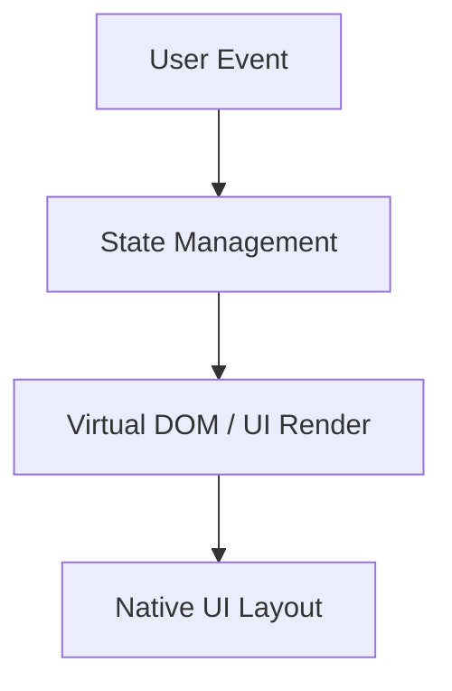
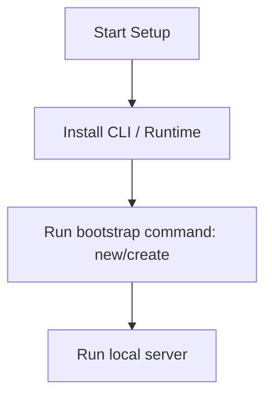

# Kotlin Multiplatform Master Engineering Guide

A comprehensive, production-level, industry-grade guide to Kotlin Multiplatform for software engineers, backend developers, frontend developers, full-stack developers, DevOps, and architects. Kotlin Multiplatform (KMP) simplifies cross-platform mobile development by sharing common business logic while preserving native UI.

---

## 1. Introduction

### 1.1 Overview & Concepts
Detailed explanation of Introduction in Kotlin Multiplatform. Built using Kotlin, Kotlin Multiplatform provides rich abstractions for modern web or mobile workflows.

Configure security headers, rate limiting, and follow proper coding guidelines to build production-grade applications with Kotlin Multiplatform.

### 1.2 Operations & Verification
Production and verification best practices for Introduction in Kotlin Multiplatform.

```bash
# Compile all targets
./gradlew assemble
```

---

## 2. Why Use This Framework?

### 2.1 Overview & Concepts
Detailed explanation of Why Use This Framework? in Kotlin Multiplatform. Built using Kotlin, Kotlin Multiplatform provides rich abstractions for modern web or mobile workflows.

Configure security headers, rate limiting, and follow proper coding guidelines to build production-grade applications with Kotlin Multiplatform.

### 2.2 Operations & Verification
Production and verification best practices for Why Use This Framework? in Kotlin Multiplatform.

```bash
# Run tests on all platform targets
./gradlew test
```

---

## 3. Architecture

### 3.1 Overview & Concepts
Detailed explanation of Architecture in Kotlin Multiplatform. Built using Kotlin, Kotlin Multiplatform provides rich abstractions for modern web or mobile workflows.



### 3.2 Operations & Verification
Production and verification best practices for Architecture in Kotlin Multiplatform.

```bash
# Clean gradle build cache
./gradlew clean
```

---

## 4. Installation

### 4.1 Overview & Concepts
Detailed explanation of Installation in Kotlin Multiplatform. Built using Kotlin, Kotlin Multiplatform provides rich abstractions for modern web or mobile workflows.

#### Official Resources & Installation Flow
- **Download Link**: [Official Kotlin Multiplatform Homepage](https://kotlin-multiplatform.dev) or [Package Registry](https://npmjs.com)



### 4.2 Project Scaffolding & Setup
Run the following git command to clone the official Kotlin Multiplatform template:
```bash
# Clone the official Kotlin Multiplatform template project
git clone https://github.com/Kotlin/kotlin-multiplatform-template.git mykmpapp
cd mykmpapp
```

---

## 5. Project Structure

### 5.1 Overview & Concepts
Detailed explanation of Project Structure in Kotlin Multiplatform. Built using Kotlin, Kotlin Multiplatform provides rich abstractions for modern web or mobile workflows.

```text
src/
├── components/
├── pages/
├── hooks/
└── index.js
```

### 5.2 Operations & Verification
Production and verification best practices for Project Structure in Kotlin Multiplatform.

```bash
# Compile all targets
./gradlew assemble
```

---

## 6. Getting Started

### 6.1 Overview & Concepts
Detailed explanation of Getting Started in Kotlin Multiplatform. Built using Kotlin, Kotlin Multiplatform provides rich abstractions for modern web or mobile workflows.

Here is a simple starting snippet:

```java
// First Kotlin Multiplatform app
System.out.println("Hello from Kotlin Multiplatform");
```

### 6.2 Running the Application
Run the following Gradle command to compile and run the desktop target application:
```bash
# Compile and run the desktop target
./gradlew :composeApp:run
```

---

## 7. Core Concepts

### 7.1 Overview & Concepts
Detailed explanation of Core Concepts in Kotlin Multiplatform. Built using Kotlin, Kotlin Multiplatform provides rich abstractions for modern web or mobile workflows.

Configure security headers, rate limiting, and follow proper coding guidelines to build production-grade applications with Kotlin Multiplatform.

### 7.2 Operations & Verification
Production and verification best practices for Core Concepts in Kotlin Multiplatform.

```bash
# Run tests on all platform targets
./gradlew test
```

---

## 8. Routing

### 8.1 Overview & Concepts
Detailed explanation of Routing in Kotlin Multiplatform. Built using Kotlin, Kotlin Multiplatform provides rich abstractions for modern web or mobile workflows.

Configure security headers, rate limiting, and follow proper coding guidelines to build production-grade applications with Kotlin Multiplatform.

### 8.2 Operations & Verification
Production and verification best practices for Routing in Kotlin Multiplatform.

```bash
# Clean gradle build cache
./gradlew clean
```

---

## 9. Middleware

### 9.1 Overview & Concepts
Detailed explanation of Middleware in Kotlin Multiplatform. Built using Kotlin, Kotlin Multiplatform provides rich abstractions for modern web or mobile workflows.

Configure security headers, rate limiting, and follow proper coding guidelines to build production-grade applications with Kotlin Multiplatform.

### 9.2 Operations & Verification
Production and verification best practices for Middleware in Kotlin Multiplatform.

```bash
# Compile all targets
./gradlew assemble
```

---

## 10. Request & Response Lifecycle

### 10.1 Overview & Concepts
Detailed explanation of Request & Response Lifecycle in Kotlin Multiplatform. Built using Kotlin, Kotlin Multiplatform provides rich abstractions for modern web or mobile workflows.

Configure security headers, rate limiting, and follow proper coding guidelines to build production-grade applications with Kotlin Multiplatform.

### 10.2 Operations & Verification
Production and verification best practices for Request & Response Lifecycle in Kotlin Multiplatform.

```bash
# Run tests on all platform targets
./gradlew test
```

---

## 11. Dependency Injection (if supported)

### 11.1 Overview & Concepts
Detailed explanation of Dependency Injection (if supported) in Kotlin Multiplatform. Built using Kotlin, Kotlin Multiplatform provides rich abstractions for modern web or mobile workflows.

Configure security headers, rate limiting, and follow proper coding guidelines to build production-grade applications with Kotlin Multiplatform.

### 11.2 Operations & Verification
Production and verification best practices for Dependency Injection (if supported) in Kotlin Multiplatform.

```bash
# Clean gradle build cache
./gradlew clean
```

---

## 12. Configuration

### 12.1 Overview & Concepts
Detailed explanation of Configuration in Kotlin Multiplatform. Built using Kotlin, Kotlin Multiplatform provides rich abstractions for modern web or mobile workflows.

Configure security headers, rate limiting, and follow proper coding guidelines to build production-grade applications with Kotlin Multiplatform.

### 12.2 Operations & Verification
Production and verification best practices for Configuration in Kotlin Multiplatform.

```bash
# Compile all targets
./gradlew assemble
```

---

## 13. Database Integration

### 13.1 Overview & Concepts
Detailed explanation of Database Integration in Kotlin Multiplatform. Built using Kotlin, Kotlin Multiplatform provides rich abstractions for modern web or mobile workflows.

Configure security headers, rate limiting, and follow proper coding guidelines to build production-grade applications with Kotlin Multiplatform.

### 13.2 Operations & Verification
Production and verification best practices for Database Integration in Kotlin Multiplatform.

```bash
# Run tests on all platform targets
./gradlew test
```

---

## 14. Authentication

### 14.1 Overview & Concepts
Detailed explanation of Authentication in Kotlin Multiplatform. Built using Kotlin, Kotlin Multiplatform provides rich abstractions for modern web or mobile workflows.

Configure security headers, rate limiting, and follow proper coding guidelines to build production-grade applications with Kotlin Multiplatform.

### 14.2 Operations & Verification
Production and verification best practices for Authentication in Kotlin Multiplatform.

```bash
# Clean gradle build cache
./gradlew clean
```

---

## 15. Authorization

### 15.1 Overview & Concepts
Detailed explanation of Authorization in Kotlin Multiplatform. Built using Kotlin, Kotlin Multiplatform provides rich abstractions for modern web or mobile workflows.

Configure security headers, rate limiting, and follow proper coding guidelines to build production-grade applications with Kotlin Multiplatform.

### 15.2 Operations & Verification
Production and verification best practices for Authorization in Kotlin Multiplatform.

```bash
# Compile all targets
./gradlew assemble
```

---

## 16. Validation

### 16.1 Overview & Concepts
Detailed explanation of Validation in Kotlin Multiplatform. Built using Kotlin, Kotlin Multiplatform provides rich abstractions for modern web or mobile workflows.

Configure security headers, rate limiting, and follow proper coding guidelines to build production-grade applications with Kotlin Multiplatform.

### 16.2 Operations & Verification
Production and verification best practices for Validation in Kotlin Multiplatform.

```bash
# Run tests on all platform targets
./gradlew test
```

---

## 17. Error Handling

### 17.1 Overview & Concepts
Detailed explanation of Error Handling in Kotlin Multiplatform. Built using Kotlin, Kotlin Multiplatform provides rich abstractions for modern web or mobile workflows.

Configure security headers, rate limiting, and follow proper coding guidelines to build production-grade applications with Kotlin Multiplatform.

### 17.2 Operations & Verification
Production and verification best practices for Error Handling in Kotlin Multiplatform.

```bash
# Clean gradle build cache
./gradlew clean
```

---

## 18. Caching

### 18.1 Overview & Concepts
Detailed explanation of Caching in Kotlin Multiplatform. Built using Kotlin, Kotlin Multiplatform provides rich abstractions for modern web or mobile workflows.

Configure security headers, rate limiting, and follow proper coding guidelines to build production-grade applications with Kotlin Multiplatform.

### 18.2 Operations & Verification
Production and verification best practices for Caching in Kotlin Multiplatform.

```bash
# Compile all targets
./gradlew assemble
```

---

## 19. Security

### 19.1 Overview & Concepts
Detailed explanation of Security in Kotlin Multiplatform. Built using Kotlin, Kotlin Multiplatform provides rich abstractions for modern web or mobile workflows.

Configure security headers, rate limiting, and follow proper coding guidelines to build production-grade applications with Kotlin Multiplatform.

### 19.2 Operations & Verification
Production and verification best practices for Security in Kotlin Multiplatform.

```bash
# Run tests on all platform targets
./gradlew test
```

---

## 20. Performance Optimization

### 20.1 Overview & Concepts
Detailed explanation of Performance Optimization in Kotlin Multiplatform. Built using Kotlin, Kotlin Multiplatform provides rich abstractions for modern web or mobile workflows.

Configure security headers, rate limiting, and follow proper coding guidelines to build production-grade applications with Kotlin Multiplatform.

### 20.2 Operations & Verification
Production and verification best practices for Performance Optimization in Kotlin Multiplatform.

```bash
# Clean gradle build cache
./gradlew clean
```

---

## 21. Testing

### 21.1 Overview & Concepts
Detailed explanation of Testing in Kotlin Multiplatform. Built using Kotlin, Kotlin Multiplatform provides rich abstractions for modern web or mobile workflows.

Configure security headers, rate limiting, and follow proper coding guidelines to build production-grade applications with Kotlin Multiplatform.

### 21.2 Operations & Verification
Production and verification best practices for Testing in Kotlin Multiplatform.

```bash
# Compile all targets
./gradlew assemble
```

---

## 22. Deployment

### 22.1 Overview & Concepts
Detailed explanation of Deployment in Kotlin Multiplatform. Built using Kotlin, Kotlin Multiplatform provides rich abstractions for modern web or mobile workflows.

Configure security headers, rate limiting, and follow proper coding guidelines to build production-grade applications with Kotlin Multiplatform.

### 22.2 Operations & Verification
Production and verification best practices for Deployment in Kotlin Multiplatform.

```bash
# Run tests on all platform targets
./gradlew test
```

---

## 23. Monitoring

### 23.1 Overview & Concepts
Detailed explanation of Monitoring in Kotlin Multiplatform. Built using Kotlin, Kotlin Multiplatform provides rich abstractions for modern web or mobile workflows.

Configure security headers, rate limiting, and follow proper coding guidelines to build production-grade applications with Kotlin Multiplatform.

### 23.2 Operations & Verification
Production and verification best practices for Monitoring in Kotlin Multiplatform.

```bash
# Clean gradle build cache
./gradlew clean
```

---

## 24. Microservices

### 24.1 Overview & Concepts
Detailed explanation of Microservices in Kotlin Multiplatform. Built using Kotlin, Kotlin Multiplatform provides rich abstractions for modern web or mobile workflows.

Configure security headers, rate limiting, and follow proper coding guidelines to build production-grade applications with Kotlin Multiplatform.

### 24.2 Operations & Verification
Production and verification best practices for Microservices in Kotlin Multiplatform.

```bash
# Compile all targets
./gradlew assemble
```

---

## 25. AI Integration

### 25.1 Overview & Concepts
Detailed explanation of AI Integration in Kotlin Multiplatform. Built using Kotlin, Kotlin Multiplatform provides rich abstractions for modern web or mobile workflows.

Integrating OpenAI or Bedrock in Kotlin Multiplatform is straightforward using direct client SDKs:

```typescript
import { OpenAI } from 'openai';
const openai = new OpenAI();
const completion = await openai.chat.completions.create({ model: 'gpt-4', messages: [{ role: 'user', content: 'Hello' }] });
console.log(completion.choices[0].message.content);
```

### 25.2 Operations & Verification
Production and verification best practices for AI Integration in Kotlin Multiplatform.

```bash
# Run tests on all platform targets
./gradlew test
```

---

## 26. Production Architecture

### 26.1 Overview & Concepts
Detailed explanation of Production Architecture in Kotlin Multiplatform. Built using Kotlin, Kotlin Multiplatform provides rich abstractions for modern web or mobile workflows.

Configure security headers, rate limiting, and follow proper coding guidelines to build production-grade applications with Kotlin Multiplatform.

### 26.2 Operations & Verification
Production and verification best practices for Production Architecture in Kotlin Multiplatform.

```bash
# Clean gradle build cache
./gradlew clean
```

---

## 27. Best Practices

### 27.1 Overview & Concepts
Detailed explanation of Best Practices in Kotlin Multiplatform. Built using Kotlin, Kotlin Multiplatform provides rich abstractions for modern web or mobile workflows.

Configure security headers, rate limiting, and follow proper coding guidelines to build production-grade applications with Kotlin Multiplatform.

### 27.2 Operations & Verification
Production and verification best practices for Best Practices in Kotlin Multiplatform.

```bash
# Compile all targets
./gradlew assemble
```

---

## 28. Common Errors

### 28.1 Overview & Concepts
Detailed explanation of Common Errors in Kotlin Multiplatform. Built using Kotlin, Kotlin Multiplatform provides rich abstractions for modern web or mobile workflows.

Configure security headers, rate limiting, and follow proper coding guidelines to build production-grade applications with Kotlin Multiplatform.

### 28.2 Operations & Verification
Production and verification best practices for Common Errors in Kotlin Multiplatform.

```bash
# Run tests on all platform targets
./gradlew test
```

---

## 29. Interview Questions

### 29.1 Overview & Concepts
Detailed explanation of Interview Questions in Kotlin Multiplatform. Built using Kotlin, Kotlin Multiplatform provides rich abstractions for modern web or mobile workflows.

Configure security headers, rate limiting, and follow proper coding guidelines to build production-grade applications with Kotlin Multiplatform.

### 29.2 Operations & Verification
Production and verification best practices for Interview Questions in Kotlin Multiplatform.

```bash
# Clean gradle build cache
./gradlew clean
```

---

## 30. Cheat Sheet

### 30.1 Overview & Concepts
Detailed explanation of Cheat Sheet in Kotlin Multiplatform. Built using Kotlin, Kotlin Multiplatform provides rich abstractions for modern web or mobile workflows.

Configure security headers, rate limiting, and follow proper coding guidelines to build production-grade applications with Kotlin Multiplatform.

### 30.2 Operations & Verification
Production and verification best practices for Cheat Sheet in Kotlin Multiplatform.

```bash
# Compile all targets
./gradlew assemble
```

---

## 31. Hands-on Projects

### 31.1 Overview & Concepts
Detailed explanation of Hands-on Projects in Kotlin Multiplatform. Built using Kotlin, Kotlin Multiplatform provides rich abstractions for modern web or mobile workflows.

Configure security headers, rate limiting, and follow proper coding guidelines to build production-grade applications with Kotlin Multiplatform.

### 31.2 Operations & Verification
Production and verification best practices for Hands-on Projects in Kotlin Multiplatform.

```bash
# Run tests on all platform targets
./gradlew test
```

---

## 32. Learning Roadmap

### 32.1 Overview & Concepts
Detailed explanation of Learning Roadmap in Kotlin Multiplatform. Built using Kotlin, Kotlin Multiplatform provides rich abstractions for modern web or mobile workflows.

Configure security headers, rate limiting, and follow proper coding guidelines to build production-grade applications with Kotlin Multiplatform.

### 32.2 Operations & Verification
Production and verification best practices for Learning Roadmap in Kotlin Multiplatform.

```bash
# Clean gradle build cache
./gradlew clean
```

---

## 33. Final Summary

### 33.1 Overview & Concepts
Detailed explanation of Final Summary in Kotlin Multiplatform. Built using Kotlin, Kotlin Multiplatform provides rich abstractions for modern web or mobile workflows.

Configure security headers, rate limiting, and follow proper coding guidelines to build production-grade applications with Kotlin Multiplatform.

### 33.2 Operations & Verification
Production and verification best practices for Final Summary in Kotlin Multiplatform.

```bash
# Compile all targets
./gradlew assemble
```

---

---

## 34. Project Creation & Execution Commands

### Scaffolding a New Project
```bash
# Clone the official Kotlin Multiplatform template project
git clone https://github.com/Kotlin/kotlin-multiplatform-template.git mykmpapp
cd mykmpapp
```

### Running the Application
```bash
# Compile and run the desktop target
./gradlew :composeApp:run
```
