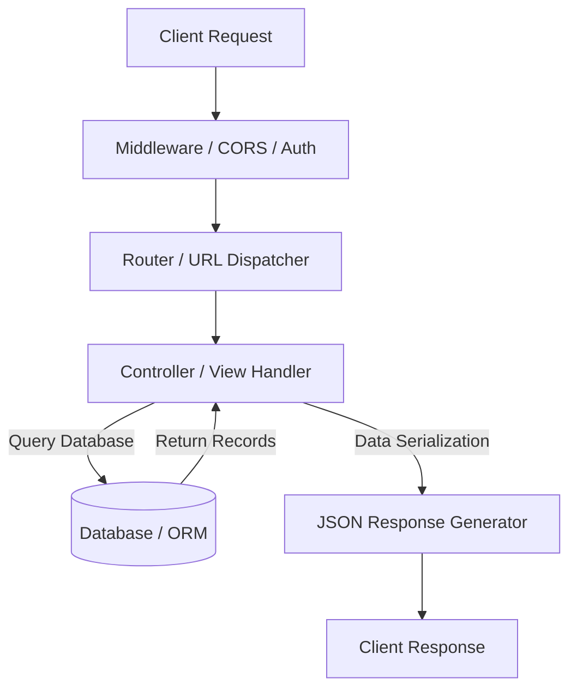

# Backend Architecture & Framework Overview

Welcome to the Backend API Development overview. The backend of a web application handles business logic, process orchestration, data serialization, and authentication.

---

## 1. Request-Response Lifecycle

When a client browser triggers an HTTP request, the backend server routes the request through a series of middleware and controllers to execute business logic, query databases, and serialize JSON responses.

---

## 2. FastAPI vs Django Comparison

Choosing the right backend framework determines the system's runtime performance, development velocity, and coding style.

| Feature | FastAPI | Django + DRF |
| :--- | :--- | :--- |
| **Concurrency** | Asynchronous (`async`/`await`) natively | Synchronous by default (supports ASGI/async views recently) |
| **Philosophy** | Lightweight, modular, micro-framework | "Batteries-included", opinionated monolithic design |
| **Data Validation** | Pydantic (Type hints driven) | Django Serializers / Forms |
| **Performance** | Extremely high (comparable to Node.js & Go) | Moderate (slower due to monolithic overhead) |
| **Learning Curve** | Gentle, relies on standard Python type hints | Moderate, requires learning Django-specific patterns |

---

## 3. How to Choose
* **Use FastAPI** if your project requires maximum performance, high concurrency (WebSockets, server-sent events), real-time streaming, or is structured as lightweight microservices.
* **Use Django** if you are building an enterprise monolithic app that requires administrative panels (Django Admin), user groups, session management, or built-in migration tools out-of-the-box.
