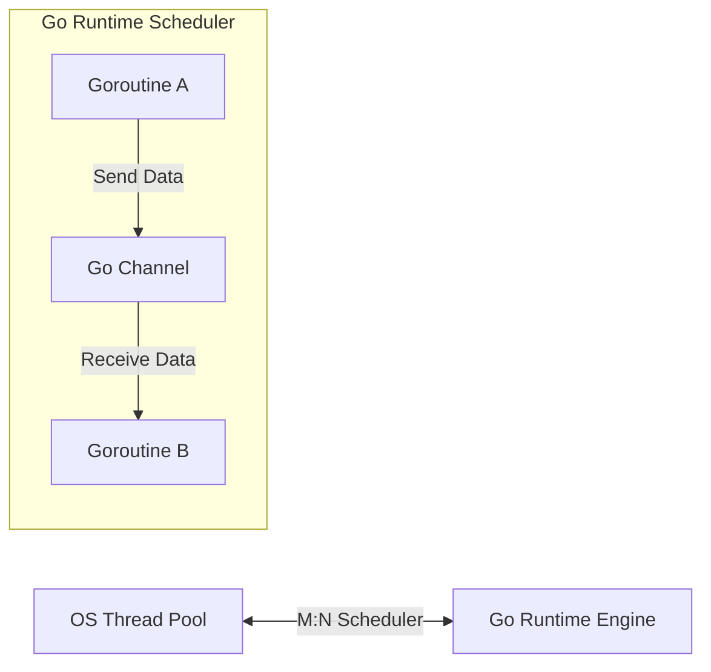

# Go Backend Engineering

Go (Golang) is a statically typed, compiled programming language designed at Google. It features a fast compiler, built-in garbage collection, structural typing, and first-class concurrency support using goroutines.

<ProgressTracker currentSection=1 totalSections=6 />

## Installation & Downloads

To install Go (Golang) on your machine:
1. Navigate to the [Official Go Downloads Page](https://go.dev/dl/).
2. Download the packaged installer corresponding to your Operating System (e.g. `.msi` for Windows, `.pkg` for macOS, or `.tar.gz` archive for Linux).
3. Run the installer and proceed with the prompts.
4. Verify the Go bin directory (usually `C:\Program Files\Go\bin` or `/usr/local/go/bin`) is in your system `PATH`.
5. Verify the installation by running:
   ```bash
   go version
   ```

### Official Download Portal


---

<ProgressTracker currentSection=2 totalSections=6 />

## 1. Go Concurrency Model: Communicating Sequential Processes (CSP)

Go avoids shared memory synchronization (locks/mutexes) by utilizing channels to pass data between goroutines.



### Core Architecture:
* **Compiled to Native Code**: Go compiles directly to a single, statically linked machine binary containing no virtual machines or heavy external dependency runtimes.
* **Goroutines**: Lightweight execution threads managed by the Go runtime rather than the OS. Goroutines start with a small stack size (approx. 2KB) and scale dynamically, allowing backends to spawn millions of concurrent routines.
* **Channels**: Typed conduits through which goroutines synchronize execution and share data.

---

<ProgressTracker currentSection=3 totalSections=6 />

## 2. Pointers & Structs

Go is not a traditional object-oriented language; it uses structs to model data and interfaces to model behaviors.

### Code Demonstration: Structs, Pointers, and Methods
<Tabs>
  <Tab label="Syntax & Example">

```go
package main

import (
	"fmt"
)

// Item defines a generic framework database resource structure
type Item struct {
	ID          int
	Name        string
	Description string
}

// ModifyDescription modifies the item struct using a pointer receiver
func (item *Item) ModifyDescription(newDesc string) {
	// Pointers allow directly mutating the underlying struct memory instead of copying it
	item.Description = newDesc
}

func main() {
	// Create struct instance
	myResource := Item{ID: 1, Name: "Asset A", Description: "Raw data"}

	// Invoke method using pointer reference
	myResource.ModifyDescription("Cleaned analytical record")

	fmt.Printf("Resource: %s (Desc: %s)\n", myResource.Name, myResource.Description)
}
```

  </Tab>
  <Tab label="Interactive Playground">
    <InteractiveExample 
      language="go"
      initialCode="package main\n\nimport (\n\t\"fmt\"\n)\n\n// Item defines a generic framework database resource structure\ntype Item struct {\n\tID          int\n\tName        string\n\tDescription string\n}\n\n// ModifyDescription modifies the item struct using a pointer receiver\nfunc (item *Item) ModifyDescription(newDesc string) {\n\t// Pointers allow directly mutating the underlying struct memory instead of copying it\n\titem.Description = newDesc\n}\n\nfunc main() {\n\t// Create struct instance\n\tmyResource := Item{ID: 1, Name: \"Asset A\", Description: \"Raw data\"}\n\n\t// Invoke method using pointer reference\n\tmyResource.ModifyDescription(\"Cleaned analytical record\")\n\n\tfmt.Printf(\"Resource: %s (Desc: %s)\\n\", myResource.Name, myResource.Description)\n}" 
      instruction="Execute and edit this GO example."
    />
  </Tab>
</Tabs>

### Line-by-Line Code Explanation

- **`type Item struct`**: Defines a custom structure type named `Item` grouping ID, Name, and Description.
- **`func (item *Item) ModifyDescription(...)`**: Declares a method with a pointer receiver `*Item`, enabling mutations of the actual struct fields in memory rather than a copy.
- **`myResource := Item{...}`**: Creates and initializes an instance of `Item`.

---

<ProgressTracker currentSection=4 totalSections=6 />

## 3. Concurrency in Action: Goroutines & Channels

<Tabs>
  <Tab label="Syntax & Example">

```go
package main

import (
	"fmt"
	"time"
)

// Worker function executing simulated asynchronous API work
func fetchDatabaseRecord(id int, dataChannel chan<- string) {
	time.Sleep(100 * time.Millisecond) // Simulate network delay
	dataChannel <- fmt.Sprintf("Fetched database row content for ID %d", id)
}

func main() {
	// Create buffered channel to receive string outputs
	dataChannel := make(chan string, 3)

	// Spawn 3 concurrent workers using the "go" keyword
	for i := 1; i <= 3; i++ {
		go fetchDatabaseRecord(i, dataChannel)
	}

	// Read outputs from the channel as they arrive
	for i := 1; i <= 3; i++ {
		record := <-dataChannel
		fmt.Println("Receiver Queue:", record)
	}
}
```

  </Tab>
  <Tab label="Interactive Playground">
    <InteractiveExample 
      language="go"
      initialCode="package main\n\nimport (\n\t\"fmt\"\n\t\"time\"\n)\n\n// Worker function executing simulated asynchronous API work\nfunc fetchDatabaseRecord(id int, dataChannel chan<- string) {\n\ttime.Sleep(100 * time.Millisecond) // Simulate network delay\n\tdataChannel <- fmt.Sprintf(\"Fetched database row content for ID %d\", id)\n}\n\nfunc main() {\n\t// Create buffered channel to receive string outputs\n\tdataChannel := make(chan string, 3)\n\n\t// Spawn 3 concurrent workers using the \"go\" keyword\n\tfor i := 1; i <= 3; i++ {\n\t\tgo fetchDatabaseRecord(i, dataChannel)\n\t}\n\n\t// Read outputs from the channel as they arrive\n\tfor i := 1; i <= 3; i++ {\n\t\trecord := <-dataChannel\n\t\tfmt.Println(\"Receiver Queue:\", record)\n\t}\n}" 
      instruction="Execute and edit this GO example."
    />
  </Tab>
</Tabs>

### Line-by-Line Code Explanation

- **`dataChannel chan<- string`**: Defines a write-only string channel parameter for worker routines.
- **`dataChannel <- ...`**: Sends a formatted string payload into the channel.
- **`dataChannel := make(chan string, 3)`**: Creates a buffered channel of type `string` with a capacity of `3`.
- **`go fetchDatabaseRecord(...)`**: Launches a new concurrent goroutine execution thread managed by the Go runtime scheduler.
- **`record := <-dataChannel`**: Blocks and receives a string message from the channel.

<ProgressTracker currentSection=5 totalSections=6 />

## 4. Loops in Go: For and While Equivalents

Go only has one looping construct: the `for` loop. However, it is highly versatile and can represent traditional loops, while-loop equivalents, infinite loops, and range-based collections traversal.

### 4.1 Traditional Three-Component Loop
Used for iterating with a counter variable.
<Tabs>
  <Tab label="Syntax & Example">

```go
package main

import "fmt"

func main() {
	for i := 0; i < 3; i++ {
		fmt.Printf("Iteration: %d\n", i)
	}
}
```

  </Tab>
  <Tab label="Interactive Playground">
    <InteractiveExample 
      language="go"
      initialCode="package main\n\nimport \"fmt\"\n\nfunc main() {\n\tfor i := 0; i < 3; i++ {\n\t\tfmt.Printf(\"Iteration: %d\\n\", i)\n\t}\n}" 
      instruction="Execute and edit this GO example."
    />
  </Tab>
</Tabs>

### Line-by-Line Code Explanation

- **`for i := 0; i < 3; i++`**: Implements a traditional three-component loop in Go.

### 4.2 While-Loop Equivalent
In Go, omitting the initialization and post statements transforms the `for` loop into a `while` loop.
<Tabs>
  <Tab label="Syntax & Example">

```go
package main

import "fmt"

func main() {
	count := 3
	for count > 0 {
		fmt.Printf("Countdown: %d\n", count)
		count--
	}
}
```

  </Tab>
  <Tab label="Interactive Playground">
    <InteractiveExample 
      language="go"
      initialCode="package main\n\nimport \"fmt\"\n\nfunc main() {\n\tcount := 3\n\tfor count > 0 {\n\t\tfmt.Printf(\"Countdown: %d\\n\", count)\n\t\tcount--\n\t}\n}" 
      instruction="Execute and edit this GO example."
    />
  </Tab>
</Tabs>

### Line-by-Line Code Explanation

- **`for count > 0`**: Implements a conditional loop equivalent to a `while` loop by omitting initialization and post statements.

### 4.3 Infinite Loop
Omitting all components creates an infinite loop, typically exited using a `break` or `return`.
<Tabs>
  <Tab label="Syntax & Example">

```go
package main

import "fmt"

func main() {
	count := 0
	for {
		fmt.Println("Running...")
		count++
		if count >= 3 {
			break
		}
	}
}
```

  </Tab>
  <Tab label="Interactive Playground">
    <InteractiveExample 
      language="go"
      initialCode="package main\n\nimport \"fmt\"\n\nfunc main() {\n\tcount := 0\n\tfor {\n\t\tfmt.Println(\"Running...\")\n\t\tcount++\n\t\tif count >= 3 {\n\t\t\tbreak\n\t\t}\n\t}\n}" 
      instruction="Execute and edit this GO example."
    />
  </Tab>
</Tabs>

### Line-by-Line Code Explanation

- **`for {`**: Initiates an infinite loop in Go.
- **`break`**: Terminates the loop execution.

### 4.4 For-Range Loop
Used to iterate over slices, arrays, maps, strings, or channels.
<Tabs>
  <Tab label="Syntax & Example">

```go
package main

import "fmt"

func main() {
	languages := []string{"Go", "Python", "Java"}
	for index, name := range languages {
		fmt.Printf("Index: %d, Value: %s\n", index, name)
	}
}
```

  </Tab>
  <Tab label="Interactive Playground">
    <InteractiveExample 
      language="go"
      initialCode="package main\n\nimport \"fmt\"\n\nfunc main() {\n\tlanguages := []string{\"Go\", \"Python\", \"Java\"}\n\tfor index, name := range languages {\n\t\tfmt.Printf(\"Index: %d, Value: %s\\n\", index, name)\n\t}\n}" 
      instruction="Execute and edit this GO example."
    />
  </Tab>
</Tabs>

### Line-by-Line Code Explanation

- **`for index, name := range languages`**: Iterates over a slice, unpacking both index and element value on each iteration.

---

<ProgressTracker currentSection=6 totalSections=6 />

## 5. Key Go Frameworks & Tools
* **Gin / Fiber**: High-performance HTTP routers for API routing.
* **Go Modules**: Dependency management configured in `go.mod`.
* **Gofmt**: In-built code formatter to enforce a single code style.

---

### Knowledge Verification Check

<Quiz 
  question="What makes Go's goroutines much lighter than standard operating system threads?" 
  options=["Goroutines do not consume any RAM.", "Goroutines run inside the browser environment.", "Goroutines start with a very small stack (about 2KB) that grows and shrinks dynamically, and are multiplexed onto OS threads.", "Goroutines run only when the system is idle."] 
  answerIndex=2 
  explanation="Unlike OS threads which have large, fixed-size stacks (typically 1MB-2MB), goroutines start with 2KB stacks managed dynamically by the Go runtime scheduler." 
/>

<Quiz 
  question="How do goroutines communicate and synchronize data in Go?" 
  options=["Through global variables protected by thread locks.", "By using Channels to pass data and signal execution state.", "Using native operating system thread interrupts.", "Through shared database connections."] 
  answerIndex=1 
  explanation="Go uses channels as concurrency primitives to allow goroutines to pass typed data and safely synchronize without manual lock primitives." 
/>

<Quiz 
  question="What is the purpose of a pointer receiver (*StructName) in a Go method definition?" 
  options=["It automatically compiles the method as a static C binary.", "It allows the method to mutate the receiver's fields directly and avoids copying the struct's data on invocation.", "It renders the struct read-only.", "It registers the method with a garbage collection worker."] 
  answerIndex=1 
  explanation="A pointer receiver passes the memory address of the struct instance, enabling direct field modification and optimizing performance by avoiding struct copying." 
/>

<Quiz 
  question="What is the difference between an array and a slice in Go?" 
  options=["Arrays are dynamically sized, while slices have a fixed length.", "Arrays have a fixed size defined at compilation, while slices are dynamic windows pointing to an underlying array.", "Arrays are always passed by reference, while slices are passed by value.", "There is no difference; they are synonyms."] 
  answerIndex=1 
  explanation="Go arrays have a fixed size that is part of their type. Slices are flexible, dynamic wrappers containing a pointer to an underlying array, a length, and a capacity." 
/>

<Quiz 
  question="What is Go's standard approach for handling errors?" 
  options=["Using try-catch blocks to capture runtime exceptions.", "Returning an error interface as the last return value from functions, which the caller must check explicitly.", "Throwing fatal panics that terminate the program immediately.", "Writing errors automatically to a system syslog file."] 
  answerIndex=1 
  explanation="Go does not have standard try/catch blocks. Instead, functions return multiple values, including an error value, which callers inspect using `if err != nil`." 
/>

<Quiz 
  question="How does a class or struct implement an interface in Go?" 
  options=["By using the `implements` keyword in the declaration.", "Implicitly, by defining all methods declared in the interface (no explicit declaration needed).", "By inheriting from an interface helper base class.", "By wrapping the struct inside a package interface container."] 
  answerIndex=1 
  explanation="Go interfaces are implemented implicitly. A struct implements an interface simply by defining methods with matching signatures, enabling clean decoupling." 
/>

<Quiz 
  question="Which scheduling model does Go's runtime scheduler use to multiplex goroutines onto OS threads?" 
  options=["The M:N scheduler model (M goroutines onto N OS threads).", "A round-robin scheduling algorithm directly managed by the CPU.", "A single-threaded loop similar to Javascript.", "A multi-process fork scheduling model."] 
  answerIndex=0 
  explanation="The Go scheduler uses an M:N model (represented by G for goroutines, M for machine threads, and P for logical processors) to run millions of goroutines on a small pool of CPU threads." 
/>

<Quiz 
  question="When does a Go `defer` statement execute its associated function call?" 
  options=["Immediately when the defer line is parsed.", "In a separate background thread.", "When the surrounding function finishes and returns.", "Only if the program panics."] 
  answerIndex=2 
  explanation="A `defer` statement pushes a function call onto a stack. The deferred calls are executed in Last-In-First-Out (LIFO) order right before the surrounding function returns." 
/>

<Quiz 
  question="How are struct fields mapped to JSON properties during marshaling in Go?" 
  options=["By naming fields exactly the same as the JSON keys (case-insensitive).", "Using struct tags defined after field declarations, e.g. `json:\"fieldName\"`.", "By registering the struct inside an XML schema registry.", "Go automatically maps fields dynamically using reflection (no custom tags)."] 
  answerIndex=1 
  explanation="Go uses struct tags containing metadata (e.g. `json:\"id\"`) which the `encoding/json` package parses via reflection to serialize/deserialize fields." 
/>

<Quiz 
  question="How is package-level visibility (public/private) determined in Go?" 
  options=["By using the public or private keyword before declarations.", "Through directory path names.", "By capitalization: identifiers starting with an uppercase letter are public (exported), others are private.", "By declaring them in an external `package.json` configurations file."] 
  answerIndex=2 
  explanation="Go relies on capitalization for visibility. An identifier starting with an uppercase letter is exported (public) and visible outside its package; lowercase is unexported." 
/>

<Quiz 
  question="What is cap(slice) in Go?" 
  options=["The number of elements currently stored in the slice.", "The maximum length a slice can grow to before raising an exception.", "The capacity: the number of elements in the underlying array, starting from the first element of the slice.", "The memory size of the slice in bytes."] 
  answerIndex=2 
  explanation="The capacity of a slice represents the size of the underlying array allocation from the start of the slice. It is accessed via `cap(s)`, while `len(s)` returns the current item count." 
/>

<Quiz 
  question="What is the purpose of the `select` statement in Go?" 
  options=["To choose database rows from a table.", "To block execution until one of multiple channel operations (sends or receives) is ready to run.", "To implement standard switch cases for string values.", "To pick variables from system arrays."] 
  answerIndex=1 
  explanation="The `select` statement lets a goroutine wait on multiple channel communication operations. It blocks until one of its cases is ready to execute, then runs that case." 
/>
