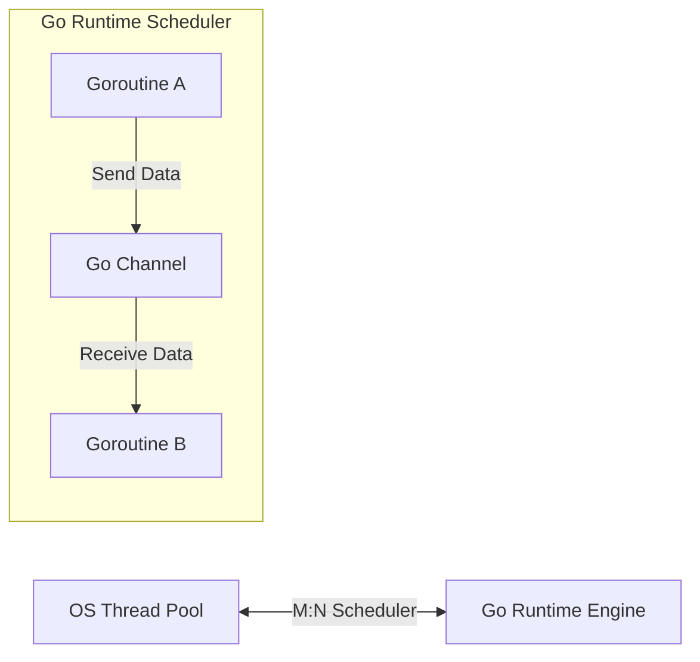

# Go Backend Engineering

Go (Golang) is a statically typed, compiled programming language designed at Google. It features a fast compiler, built-in garbage collection, structural typing, and first-class concurrency support using goroutines.

## Installation & Downloads

To install Go (Golang) on your machine:
1. Navigate to the [Official Go Downloads Page](https://go.dev/dl/).
2. Download the packaged installer corresponding to your Operating System (e.g. `.msi` for Windows, `.pkg` for macOS, or `.tar.gz` archive for Linux).
3. Run the installer and proceed with the prompts.
4. Verify the Go bin directory (usually `C:\Program Files\Go\bin` or `/usr/local/go/bin`) is in your system `PATH`.
5. Verify the installation by running:
   ```bash
   go version
   ```

### Official Download Portal


---

## 1. Go Concurrency Model: Communicating Sequential Processes (CSP)

Go avoids shared memory synchronization (locks/mutexes) by utilizing channels to pass data between goroutines.



### Core Architecture:
* **Compiled to Native Code**: Go compiles directly to a single, statically linked machine binary containing no virtual machines or heavy external dependency runtimes.
* **Goroutines**: Lightweight execution threads managed by the Go runtime rather than the OS. Goroutines start with a small stack size (approx. 2KB) and scale dynamically, allowing backends to spawn millions of concurrent routines.
* **Channels**: Typed conduits through which goroutines synchronize execution and share data.

---

## 2. Pointers & Structs

Go is not a traditional object-oriented language; it uses structs to model data and interfaces to model behaviors.

### Code Demonstration: Structs, Pointers, and Methods
```go
package main

import (
	"errors"
	"fmt"
)

// Item defines a generic framework database resource structure
type Item struct {
	ID          int
	Name        string
	Description string
}

// ModifyDescription modifies the item struct using a pointer receiver
func (item *Item) ModifyDescription(newDesc string) {
	// Pointers allow directly mutating the underlying struct memory instead of copying it
	item.Description = newDesc
}

func main() {
	// Create struct instance
	myResource := Item{ID: 1, Name: "Asset A", Description: "Raw data"}

	// Invoke method using pointer reference
	myResource.ModifyDescription("Cleaned analytical record")

	fmt.Printf("Resource: %s (Desc: %s)\n", myResource.Name, myResource.Description)
}
```

### Line-by-Line Code Explanation

- **`type Item struct`**: Defines a custom structure type named `Item` grouping ID, Name, and Description.
- **`func (item *Item) ModifyDescription(...)`**: Declares a method with a pointer receiver `*Item`, enabling mutations of the actual struct fields in memory rather than a copy.
- **`myResource := Item{...}`**: Creates and initializes an instance of `Item`.

---

## 3. Concurrency in Action: Goroutines & Channels

```go
package main

import (
	"fmt"
	"time"
)

// Worker function executing simulated asynchronous API work
func fetchDatabaseRecord(id int, dataChannel chan<- string) {
	time.Sleep(100 * time.Millisecond) // Simulate network delay
	dataChannel <- fmt.Sprintf("Fetched database row content for ID %d", id)
}

func main() {
	// Create buffered channel to receive string outputs
	dataChannel := make(chan string, 3)

	// Spawn 3 concurrent workers using the "go" keyword
	for i := 1; i <= 3; i++ {
		go fetchDatabaseRecord(i, dataChannel)
	}

	// Read outputs from the channel as they arrive
	for i := 1; i <= 3; i++ {
		record := <-dataChannel
		fmt.Println("Receiver Queue:", record)
	}
}
```

### Line-by-Line Code Explanation

- **`dataChannel chan<- string`**: Defines a write-only string channel parameter for worker routines.
- **`dataChannel <- ...`**: Sends a formatted string payload into the channel.
- **`dataChannel := make(chan string, 3)`**: Creates a buffered channel of type `string` with a capacity of `3`.
- **`go fetchDatabaseRecord(...)`**: Launches a new concurrent goroutine execution thread managed by the Go runtime scheduler.
- **`record := <-dataChannel`**: Blocks and receives a string message from the channel.

## 4. Loops in Go: For and While Equivalents

Go only has one looping construct: the `for` loop. However, it is highly versatile and can represent traditional loops, while-loop equivalents, infinite loops, and range-based collections traversal.

### 4.1 Traditional Three-Component Loop
Used for iterating with a counter variable.
```go
package main

import "fmt"

func main() {
	for i := 0; i < 3; i++ {
		fmt.Printf("Iteration: %d\n", i)
	}
}
```

### Line-by-Line Code Explanation

- **`for i := 0; i < 3; i++`**: Implements a traditional three-component loop in Go.

### 4.2 While-Loop Equivalent
In Go, omitting the initialization and post statements transforms the `for` loop into a `while` loop.
```go
package main

import "fmt"

func main() {
	count := 3
	for count > 0 {
		fmt.Printf("Countdown: %d\n", count)
		count--
	}
}
```

### Line-by-Line Code Explanation

- **`for count > 0`**: Implements a conditional loop equivalent to a `while` loop by omitting initialization and post statements.

### 4.3 Infinite Loop
Omitting all components creates an infinite loop, typically exited using a `break` or `return`.
```go
package main

import "fmt"

func main() {
	count := 0
	for {
		fmt.Println("Running...")
		count++
		if count >= 3 {
			break
		}
	}
}
```

### Line-by-Line Code Explanation

- **`for {`**: Initiates an infinite loop in Go.
- **`break`**: Terminates the loop execution.

### 4.4 For-Range Loop
Used to iterate over slices, arrays, maps, strings, or channels.
```go
package main

import "fmt"

func main() {
	languages := []string{"Go", "Python", "Java"}
	for index, name := range languages {
		fmt.Printf("Index: %d, Value: %s\n", index, name)
	}
}
```

### Line-by-Line Code Explanation

- **`for index, name := range languages`**: Iterates over a slice, unpacking both index and element value on each iteration.

---

## 5. Key Go Frameworks & Tools
* **Gin / Fiber**: High-performance HTTP routers for API routing.
* **Go Modules**: Dependency management configured in `go.mod`.
* **Gofmt**: In-built code formatter to enforce a single code style.
