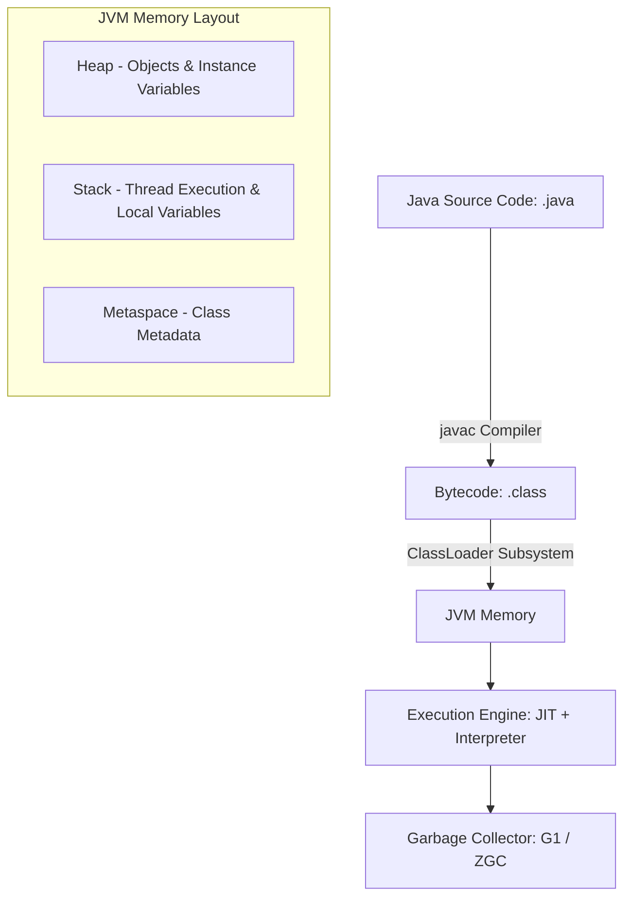
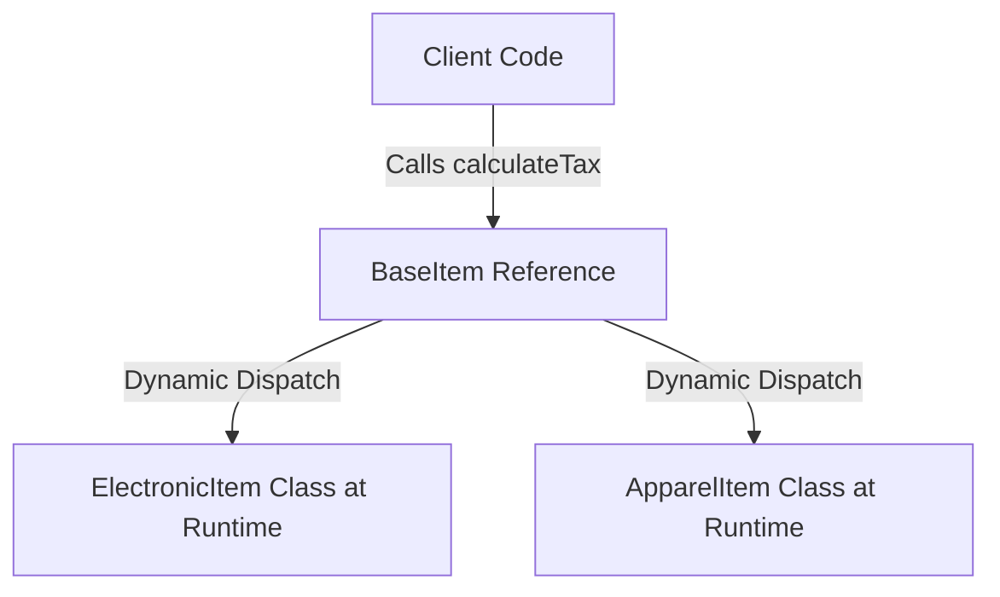

# Java Backend Engineering

Java is a statically typed, class-based, object-oriented programming language designed for platform independence. In enterprise backends, Java is the industry standard for secure, reliable, and high-performance applications.

## Installation & Downloads

To install Java (JDK) on your machine:
1. Navigate to the [Official Oracle Java Downloads Page](https://www.oracle.com/java/technologies/downloads/).
2. Select your Operating System (Windows, macOS, or Linux) and download the appropriate **JDK installer** (e.g., x64 Installer).
3. Run the installer to completion.
4. Set the `JAVA_HOME` environment variable to point to your JDK installation directory and add `%JAVA_HOME%\bin` to your system `PATH`.
5. Verify the installation by running:
   ```bash
   java -version
   javac -version
   ```

### Official Download Portal


---

## 1. Java Virtual Machine (JVM) Architecture



### Core Architecture:
* **Bytecode Platform Independence**: Code is compiled into `.class` files containing JVM bytecode, which can run on any OS with a compatible Java Runtime Environment (JRE).
* **Just-In-Time (JIT) Compiler**: Dynamically compiles frequently executed bytecode to native machine code at runtime to achieve near-C++ performance.
* **Garbage Collection (GC)**: Heap memory is managed automatically using advanced GC algorithms like G1 (Garbage-First) or ZGC (Z Garbage Collector), which divide the heap into generations to optimize sweep speed.

---

## 2. Advanced Object-Oriented Programming (OOP) in Java

Java enforces a strict class-based Object-Oriented paradigm. Beyond the basic pillars, enterprise backend engineering relies on advanced compiler behaviors, interface contracts, polymorphism models, and modern constructs like sealed classes and records.

### 2.1 Encapsulation, Access Modifiers, and Inner Classes

Java provides four levels of visibility to control access to class members:
* **`private`**: Accessible only within the declaring class.
* **`default` (package-private)**: Accessible only within classes in the same package (no modifier used).
* **`protected`**: Accessible within the same package and by subclasses in other packages.
* **`public`**: Accessible from any other class in the application.

```java
public class OuterConfig {
    private String secretKey = "ENC_XYZ";
    protected String environment = "PRODUCTION";

    // 1. Static Nested Class: Does not hold a reference to the outer instance
    public static class DatabaseConfig {
        public void load() {
            System.out.println("Loading DB configs...");
        }
    }

    // 2. Inner (Non-Static) Class: Holds an implicit reference to the outer instance
    public class Decryptor {
        public void decrypt() {
            // Can access private outer members directly
            System.out.println("Decrypting key " + secretKey);
        }
    }
}
```

### 2.2 Interface Contracts vs. Abstract Classes (Java 8 to 17+)

| Feature | Interface (Java 8/11/17) | Abstract Class |
| :--- | :--- | :--- |
| **Multiple Inheritance** | Yes, a class can implement multiple interfaces. | No, a class can inherit only one abstract class. |
| **State / Variables** | Constant fields only (`public static final`). | Can hold instance state (fields of any modifier). |
| **Constructor** | Cannot have constructors. | Can have constructors (called via `super()`). |
| **Methods** | Can have `abstract`, `default`, `static` (Java 8+), and `private` (Java 9+) methods. | Can have abstract, non-abstract, final, static, private, etc. |

```java
// Modern Interface Contract (Java 9+)
public interface PaymentGateway {
    // Abstract method (mandatory)
    void processPayment(double amount);

    // Default method (optional implementation override)
    default void refundPayment(double amount) {
        logTransaction("REFUND", amount);
        System.out.println("Refunding payment of $" + amount);
    }

    // Private utility method inside interface (helper logic sharing)
    private void logTransaction(String type, double amount) {
        System.out.println("[GATEWAY AUDIT] " + type + " : $" + amount);
    }
}
```

### 2.3 Dynamic Polymorphism & Method Dispatch

Dynamic (runtime) polymorphism allows a subclass to provide a specific implementation of a method defined in its parent class (Method Overriding). The JVM resolves overridden methods at runtime using a virtual method table (vtable) and dispatch bytecode (`invokevirtual`).



```java
// Abstract base representing dynamic method contracts
public abstract class BaseItem {
    private String name;
    private double val;

    public BaseItem(String name, double val) {
        this.name = name;
        this.val = val;
    }

    public String getName() { return name; }
    public double getVal() { return val; }

    public abstract void calculateTax();
}

public class ElectronicItem extends BaseItem {
    public ElectronicItem(String name, double val) { super(name, val); }

    @Override
    public void calculateTax() {
        System.out.println("Applying 18% electronics tax to " + getName());
    }
}

public class ApparelItem extends BaseItem {
    public ApparelItem(String name, double val) { super(name, val); }

    @Override
    public void calculateTax() {
        System.out.println("Applying 5% apparel tax to " + getName());
    }
}
```

### 2.4 Modern Java OOP: Records & Sealed Class Hierarchies (Java 16/17+)

* **Records (Java 16+)**: Immutable data carrier classes that automatically generate fields, getters, `equals()`, `hashCode()`, and `toString()`.
* **Sealed Classes (Java 17+)**: Restrict subclassing to a specific, predefined set of classes, which is extremely useful for Domain Modeling.

```java
// 1. Record for Immutable API DTOs
public record UserResponse(String userId, String email, String role) {}

// 2. Sealed Class Hierarchy
public sealed abstract class WebhookRequest permits StripeRequest, PaypalRequest {
    public abstract void execute();
}

public final class StripeRequest extends WebhookRequest {
    @Override
    public void execute() { System.out.println("Handling Stripe Webhook"); }
}

public final class PaypalRequest extends WebhookRequest {
    @Override
    public void execute() { System.out.println("Handling PayPal Webhook"); }
}
```

---

## 3. Java Collections Framework & Streams

### Collections API
Java provides a highly structured hierarchy of lists, sets, and maps:
* **`ArrayList` / `LinkedList`**: Sequential element storage.
* **`HashSet` / `TreeSet`**: Mathematical set representation.
* **`HashMap` / `ConcurrentHashMap`**: Key-value data access. `ConcurrentHashMap` uses bucket-level locking to support safe multithreaded operations.

### Stream API (Functional Processing)
Java Streams allow declarative processing of collections using filter, map, and reduce pipelines.

```java
import java.util.Arrays;
import java.util.List;
import java.util.stream.Collectors;

public class StreamDemo {
    public static void main(String[] args) {
        List<BaseItem> items = Arrays.asList(
            new ElectronicItem("Laptop", 1200.00),
            new ElectronicItem("Keyboard", 80.00),
            new ElectronicItem("Monitor", 300.00)
        );

        // Filter items costing more than 100, extract names, collect to List
        List<String> premiumItemNames = items.stream()
            .filter(item -> item.getVal() > 100.00)
            .map(BaseItem::getName)
            .collect(Collectors.toList());

        System.out.println(premiumItemNames); // Output: [Laptop, Monitor]
    }
}
```

---

## 4. Java Enterprise Best Practices
* **Spring Boot Integration**: Leverage Spring dependency injection (`@Autowired`, `@Service`, `@Repository`) to decouple controller handlers from data access layers.
* **Maven / Gradle Dependency Managers**: Organize remote libraries, compile workflows, and packaging (JAR/WAR creation) declaratively.
