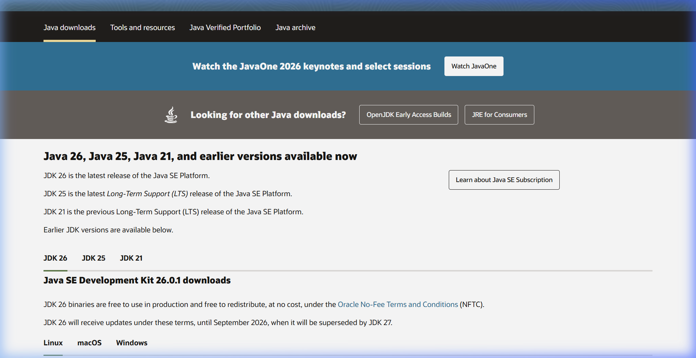
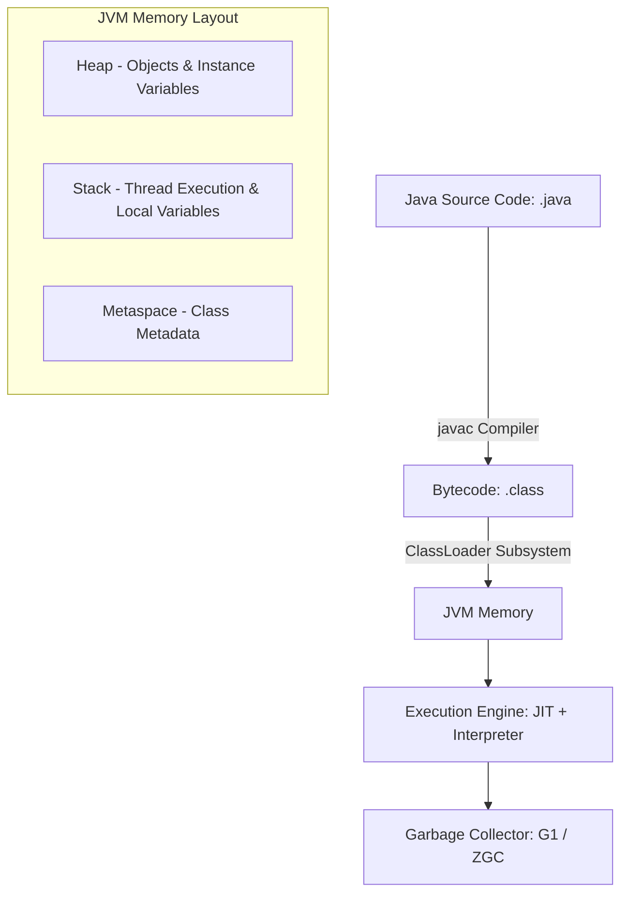

# Java Backend Engineering

Java is a statically typed, class-based, object-oriented programming language designed for platform independence. In enterprise backends, Java is the industry standard for secure, reliable, and high-performance applications.

## Installation & Downloads

To install Java (JDK) on your machine:
1. Navigate to the [Official Oracle Java Downloads Page](https://www.oracle.com/java/technologies/downloads/).
2. Select your Operating System (Windows, macOS, or Linux) and download the appropriate **JDK installer** (e.g., x64 Installer).
3. Run the installer to completion.
4. Set the `JAVA_HOME` environment variable to point to your JDK installation directory and add `%JAVA_HOME%\bin` to your system `PATH`.
5. Verify the installation by running:
   ```bash
   java -version
   javac -version
   ```

### Official Download Portal


---

## 1. Java Virtual Machine (JVM) Architecture



### Core Architecture:
* **Bytecode Platform Independence**: Code is compiled into `.class` files containing JVM bytecode, which can run on any OS with a compatible Java Runtime Environment (JRE).
* **Just-In-Time (JIT) Compiler**: Dynamically compiles frequently executed bytecode to native machine code at runtime to achieve near-C++ performance.
* **Garbage Collection (GC)**: Heap memory is managed automatically using advanced GC algorithms like G1 (Garbage-First) or ZGC (Z Garbage Collector), which divide the heap into generations to optimize sweep speed.

---

## 2. Object-Oriented Programming (OOP) & Inheritance

Java enforces strict OOP principles: Encapsulation, Inheritance, Polymorphism, and Abstraction.

### Code Demonstration: Polymorphism & Interfaces
```java
// ItemService.java (Interface for Abstraction)
public interface ItemService {
    void processItem(String id);
}

// BaseItem.java (Inheritance & Encapsulation)
public abstract class BaseItem {
    private String name;
    private double val;

    public BaseItem(String name, double val) {
        this.name = name;
        this.val = val;
    }

    public String getName() { return name; }
    public double getVal() { return val; }

    public abstract void calculateTax();
}

// ElectronicItem.java (Concrete Subclass)
public class ElectronicItem extends BaseItem implements ItemService {
    public ElectronicItem(String name, double val) {
        super(name, val);
    }

    @Override
    public void calculateTax() {
        System.out.println("Applying 18% electronics tax to " + getName());
    }

    @Override
    public void processItem(String id) {
        System.out.println("Processing Electronic item code: " + id);
    }
}
```

---

## 3. Java Collections Framework & Streams

### Collections API
Java provides a highly structured hierarchy of lists, sets, and maps:
* **`ArrayList` / `LinkedList`**: Sequential element storage.
* **`HashSet` / `TreeSet`**: Mathematical set representation.
* **`HashMap` / `ConcurrentHashMap`**: Key-value data access. `ConcurrentHashMap` uses bucket-level locking to support safe multithreaded operations.

### Stream API (Functional Processing)
Java Streams allow declarative processing of collections using filter, map, and reduce pipelines.

```java
import java.util.Arrays;
import java.util.List;
import java.util.stream.Collectors;

public class StreamDemo {
    public static void main(String[] args) {
        List<BaseItem> items = Arrays.asList(
            new ElectronicItem("Laptop", 1200.00),
            new ElectronicItem("Keyboard", 80.00),
            new ElectronicItem("Monitor", 300.00)
        );

        // Filter items costing more than 100, extract names, collect to List
        List<String> premiumItemNames = items.stream()
            .filter(item -> item.getVal() > 100.00)
            .map(BaseItem::getName)
            .collect(Collectors.toList());

        System.out.println(premiumItemNames); // Output: [Laptop, Monitor]
    }
}
```

---

## 4. Java Enterprise Best Practices
* **Spring Boot Integration**: Leverage Spring dependency injection (`@Autowired`, `@Service`, `@Repository`) to decouple controller handlers from data access layers.
* **Maven / Gradle Dependency Managers**: Organize remote libraries, compile workflows, and packaging (JAR/WAR creation) declaratively.
