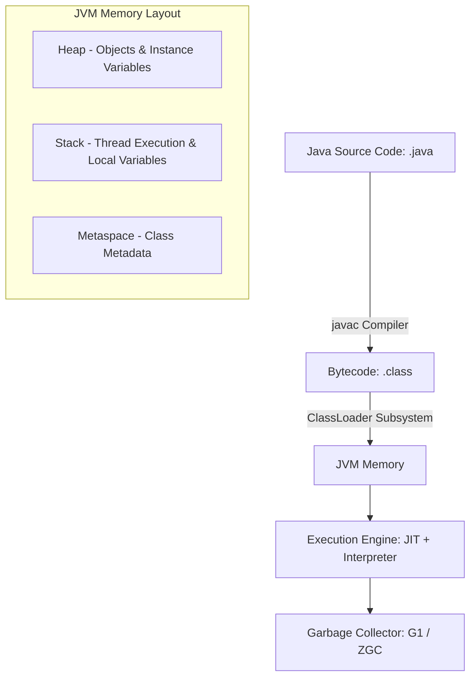

# Java Backend Engineering Master Guide

Java is a statically typed, class-based, object-oriented programming language designed for platform independence. In enterprise backends, Java is the industry standard for secure, reliable, and high-performance applications.

---

## Installation & Downloads

To install Java (JDK) on your machine:
1. Navigate to the [Official Oracle Java Downloads Page](https://www.oracle.com/java/technologies/downloads/).
2. Select your Operating System (Windows, macOS, or Linux) and download the appropriate **JDK installer** (e.g., x64 Installer).
3. Run the installer to completion.
4. Set the `JAVA_HOME` environment variable to point to your JDK installation directory and add `%JAVA_HOME%\bin` to your system `PATH`.
5. Verify the installation by running:
   ```bash
   java -version
   javac -version
   ```

### Official Download Portal


---

## 1. Phase 1: Beginner Fundamentals

### 1.1 Strong Static Typing & Variables
<ProgressTracker currentSection={1} totalSections={11} />

<InfoCard title="Concept Overview">
Java is a statically typed language, which means all variables must be declared with a specific data type before they can be used. This type checking is enforced by the compiler at compile-time.

*   **Primitive Types**: Direct data values stored in stack memory.
    *   `int`: 32-bit signed integer (`int count = 5;`)
    *   `double`: 64-bit double-precision floating-point (`double price = 19.99;`)
    *   `boolean`: Logical state (`boolean active = true;`)
    *   `char`: Single 16-bit Unicode character (`char flag = 'A';`)
*   **Reference Types**: Store references to object memory addresses allocated on the heap.
    *   `String`: Immutable sequence of characters (`String name = "AuraDocs";`)
    *   `Array`: Fixed-size container of homogeneous elements (`int[] numbers = {1, 2, 3};`)
</InfoCard>

<Tabs>
  <Tab label="Syntax & Example">

```java
public class FundamentalsDemo {
    public static void main(String[] args) {
        int primitiveVar = 42;
        String referenceVar = "Java Guide";
        
        System.out.println("Primitive Value: " + primitiveVar);
        System.out.println("Reference Value: " + referenceVar);
    }
}
```

  </Tab>
  <Tab label="Interactive Playground">
    <InteractiveExample 
      language="java"
      initialCode="public class FundamentalsDemo {\n    public static void main(String[] args) {\n        int primitiveVar = 42;\n        String referenceVar = \"Java Guide\";\n        \n        System.out.println(\"Primitive Value: \" + primitiveVar);\n        System.out.println(\"Reference Value: \" + referenceVar);\n    }\n}" 
      instruction="Run this interactive Java program. You can edit the variables or print statements."
    />
  </Tab>
</Tabs>

### Line-by-Line Code Explanation

- **`public class FundamentalsDemo`**: Declares a public class named `FundamentalsDemo`, which acts as the blueprint of the program.
- **`public static void main(String[] args)`**: The main entry point of the Java application, executed by the JVM.
- **`int primitiveVar = 42;`**: Declares a primitive integer variable allocated directly on the thread stack.
- **`String referenceVar = "Java Guide";`**: Declares a reference type variable storing the heap memory address of a `String` object.

<Quiz 
  question="Which of the following describes Java's variable typing system?" 
  options={["Dynamic typing: Variable types are resolved at runtime.", "Static typing: Variable types must be declared at compile-time and are checked by the compiler.", "Duck typing: Variables are typed on first assignment.", "Loose typing: Variables can hold any value type."]} 
  answerIndex={1} 
  explanation="Java enforces strict static typing. Every variable must have a declared type before compilation, and this is enforced at compile-time." 
/>

<InterviewQuestions>
  <InterviewQuestion q="What is the difference between Primitive and Reference types in Java?" a="Primitive types (e.g., int, double, boolean) store their values directly in stack memory. Reference types (e.g., String, Array, custom objects) store memory addresses pointing to the actual objects allocated on heap memory." />
</InterviewQuestions>

---

### 1.2 Operators
<ProgressTracker currentSection={2} totalSections={11} />

<InfoCard title="Concept Overview">
Java operators allow you to perform mathematical, comparison, and logical calculations on variables and values.
*   **Arithmetic**: `+`, `-`, `*`, `/`, `%` (modulo).
*   **Comparison**: `==`, `!=`, `>`, `<`, `>=`, `<=`.
*   **Logical**: `&&` (AND), `||` (OR), `!` (NOT).
</InfoCard>

---

### 1.3 Control Flow
<ProgressTracker currentSection={3} totalSections={11} />

<InfoCard title="Concept Overview">
Control flow structures direct the execution path of the application.
*   **Conditional Blocks**: `if-else` and `switch` statements.
*   **Loops**: `for` (traditional counter), `for-each` (enhanced loop), `while` (pre-test), and `do-while` (post-test) loops.
</InfoCard>

<Tabs>
  <Tab label="Syntax & Example">

```java
public class ControlFlowDemo {
    public static void main(String[] args) {
        int score = 85;
        
        // Conditional Check
        if (score >= 90) {
            System.out.println("Grade: A");
        } else if (score >= 80) {
            System.out.println("Grade: B");
        } else {
            System.out.println("Grade: C");
        }

        // Traditional For Loop
        for (int i = 0; i < 3; i++) {
            System.out.println("Loop index: " + i);
        }

        // Enhanced For (For-Each) Loop
        String[] technologies = {"Spring", "Hibernate", "Maven"};
        for (String tech : technologies) {
            System.out.println("Tech: " + tech);
        }

        // While Loop
        int countdown = 3;
        while (countdown > 0) {
            System.out.println("Countdown: " + countdown);
            countdown--;
        }

        // Do-While Loop
        int attempts = 0;
        do {
            System.out.println("Executing task trial...");
            attempts++;
        } while (attempts < 1);
    }
}
```

  </Tab>
  <Tab label="Interactive Playground">
    <InteractiveExample 
      language="java"
      initialCode="public class ControlFlowDemo {\n    public static void main(String[] args) {\n        int score = 85;\n        \n        if (score >= 90) {\n            System.out.println(\"Grade: A\");\n        } else if (score >= 80) {\n            System.out.println(\"Grade: B\");\n        } else {\n            System.out.println(\"Grade: C\");\n        }\n\n        for (int i = 0; i < 3; i++) {\n            System.out.println(\"Loop index: \" + i);\n        }\n\n        String[] technologies = {\"Spring\", \"Hibernate\", \"Maven\"};\n        for (String tech : technologies) {\n            System.out.println(\"Tech: \" + tech);\n        }\n\n        int countdown = 3;\n        while (countdown > 0) {\n            System.out.println(\"Countdown: \" + countdown);\n            countdown--;\n        }\n    }\n}" 
      instruction="Execute the Control Flow demo. Try changing the score value or loop thresholds."
    />
  </Tab>
</Tabs>

### Line-by-Line Code Explanation

- **`if (score >= 90) / else if`**: Evaluates comparison statements.
- **`for (int i = 0; i < 3; i++)`**: Iterates a counter index.
- **`for (String tech : technologies)`**: Loops over array elements without index counters.
- **`while (countdown > 0)`**: Continues execution as long as the state evaluates to `true`.

<Quiz 
  question="Which loop in Java is guaranteed to execute at least once?" 
  options={["for loop", "while loop", "do-while loop", "enhanced for loop"]} 
  answerIndex={2} 
  explanation="The do-while loop evaluates its conditional check at the bottom of the loop body, ensuring that the code block is executed at least once." 
/>

<InterviewQuestions>
  <InterviewQuestion q="What is the difference between a traditional for loop and an enhanced for loop (for-each) in Java?" a="A traditional for loop uses a counter variable and allows index-based access and modifying elements during iteration. The enhanced for loop (for-each) operates directly on elements of an array or Iterable collection, offering cleaner syntax and preventing index out-of-bounds errors, but it does not expose the index." />
</InterviewQuestions>

---

### 1.4 Methods & Method Overloading
<ProgressTracker currentSection={4} totalSections={11} />

<InfoCard title="Concept Overview">
A method is a reusable block of code. Java supports **Method Overloading**, which allows multiple methods to share the same name but with different parameter signatures (number or types of arguments).
</InfoCard>

<Tabs>
  <Tab label="Syntax & Example">

```java
public class Calculator {
    // Add two integers
    public int add(int a, int b) {
        return a + b;
    }

    // Add three integers (Overloaded signature)
    public int add(int a, int b, int c) {
        return a + b + c;
    }

    // Add two doubles (Overloaded type signature)
    public double add(double a, double b) {
        return a + b;
    }
}
```

  </Tab>
  <Tab label="Interactive Playground">
    <InteractiveExample 
      language="java"
      initialCode="public class Calculator {\n    public int add(int a, int b) {\n        return a + b;\n    }\n\n    public int add(int a, int b, int c) {\n        return a + b + c;\n    }\n\n    public double add(double a, double b) {\n        return a + b;\n    }\n\n    public static void main(String[] args) {\n        Calculator calc = new Calculator();\n        System.out.println(\"2 + 3 = \" + calc.add(2, 3));\n        System.out.println(\"2 + 3 + 4 = \" + calc.add(2, 3, 4));\n        System.out.println(\"2.5 + 3.5 = \" + calc.add(2.5, 3.5));\n    }\n}" 
      instruction="Try calling the different overloaded add() methods inside main and see which one gets selected."
    />
  </Tab>
</Tabs>

### Line-by-Line Code Explanation

- **`public int add(int a, int b)`**: Base method signature for adding two integers.
- **`public int add(int a, int b, int c)`**: Overloaded signature changing the parameter count.
- **`public double add(double a, double b)`**: Overloaded signature changing the parameter type.

<Quiz 
  question="Can you overload a method in Java by changing ONLY its return type?" 
  options={["Yes, return type differences are sufficient.", "No, Java differentiates overloaded methods solely by their parameter signatures.", "Only if one return type is primitive and the other is a class reference.", "Only inside interfaces."]} 
  answerIndex={1} 
  explanation="No. Method overloading requires different parameter types, numbers, or order. The return type is not considered by the Java compiler for method signature differentiation." 
/>

<InterviewQuestions>
  <InterviewQuestion q="What defines a method's signature in Java?" a="A method's signature is defined by its name and its parameter list (the number, types, and order of parameters). It does not include return type, access modifiers, or throws list." />
</InterviewQuestions>

---

## 2. Phase 2: Intermediate Core Java

### 2.1 The Four Pillars of OOP
1.  **Encapsulation**: Hiding internal state by declaring fields `private` and exposing access via public getters/setters.
2.  **Inheritance**: Sharing behaviors and states between superclasses and subclasses using the `extends` keyword.
3.  **Polymorphism**: The ability for objects of different classes to respond to the same method call (Compile-time via Overloading; Runtime via Overriding).
4.  **Abstraction**: Hiding structural implementation details using abstract classes and interfaces.

---

### 2.2 Access Modifiers & Inner Classes
<ProgressTracker currentSection={5} totalSections={11} />

<InfoCard title="Concept Overview">
Access modifiers control class and member visibility:
*   **`private`**: Visible only within the declaring class.
*   **`default` (package-private)**: Visible only within classes of the same package.
*   **`protected`**: Visible within the same package and to subclasses in other packages.
*   **`public`**: Accessible from any other class.
</InfoCard>

<Tabs>
  <Tab label="Syntax & Example">

```java
public class OuterConfig {
    private String secretKey = "ENC_XYZ";

    // Static nested class
    public static class DatabaseConfig {
        public void init() {
            System.out.println("Configuring database drivers...");
        }
    }

    // Inner class (has implicit reference to OuterConfig instance)
    public class Decryptor {
        public void decrypt() {
            // Direct access to outer class private fields
            System.out.println("Decrypting key: " + secretKey);
        }
    }
}
```

  </Tab>
  <Tab label="Interactive Playground">
    <InteractiveExample 
      language="java"
      initialCode="public class OuterConfig {\n    private String secretKey = \"ENC_XYZ\";\n\n    public static class DatabaseConfig {\n        public void init() {\n            System.out.println(\"Configuring database drivers...\");\n        }\n    }\n\n    public class Decryptor {\n        public void decrypt() {\n            System.out.println(\"Decrypting key: \" + secretKey);\n        }\n    }\n\n    public static void main(String[] args) {\n        DatabaseConfig db = new DatabaseConfig();\n        db.init();\n\n        OuterConfig outer = new OuterConfig();\n        Decryptor decryptor = outer.new Decryptor();\n        decryptor.decrypt();\n    }\n}" 
      instruction="Run code. Notice how we construct the static nested class directly vs how we construct the inner Decryptor class."
    />
  </Tab>
</Tabs>

### Line-by-Line Code Explanation

- **`private String secretKey`**: Protected encapsulation.
- **`public static class DatabaseConfig`**: Class nested statically. Doesn't need outer instance.
- **`public class Decryptor`**: Non-static inner class. Must be instantiated with an outer instance context (`outer.new Decryptor()`).

<Quiz 
  question="Which access modifier makes a field visible to subclasses in other packages?" 
  options={["private", "default (package-private)", "protected", "public"]} 
  answerIndex={2} 
  explanation="The protected modifier allows subclass access across package boundaries (as well as packages-level access)." 
/>

---

### 2.3 Interface Contracts vs. Abstract Classes
<ProgressTracker currentSection={6} totalSections={11} />

<InfoCard title="Concept Overview">
*   **Abstract Class**: Can contain instance state, variables, and constructors. Supports single inheritance.
*   **Interface**: Represents a structural contract. Supports multiple inheritance, default methods, static methods, and private helpers.
</InfoCard>

<Tabs>
  <Tab label="Syntax & Example">

```java
public interface PaymentGateway {
    // Abstract method declaration
    void processPayment(double amount);

    // Default method (since Java 8)
    default void refundPayment(double amount) {
        logTransaction("REFUND", amount);
        System.out.println("Refunding: $" + amount);
    }

    // Private helper method (since Java 9)
    private void logTransaction(String type, double amount) {
        System.out.println("[GATEWAY AUDIT] " + type + " : $" + amount);
    }
}
```

  </Tab>
  <Tab label="Interactive Playground">
    <InteractiveExample 
      language="java"
      initialCode="public interface PaymentGateway {\n    void processPayment(double amount);\n\n    default void refundPayment(double amount) {\n        logTransaction(\"REFUND\", amount);\n        System.out.println(\"Refunding: $\" + amount);\n    }\n\n    private void logTransaction(String type, double amount) {\n        System.out.println(\"[GATEWAY AUDIT] \" + type + \" : $\" + amount);\n    }\n}\n\nclass StripePayment implements PaymentGateway {\n    public void processPayment(double amount) {\n        System.out.println(\"Processing Stripe payment of $\" + amount);\n    }\n}\n\nclass Main {\n    public static void main(String[] args) {\n        PaymentGateway stripe = new StripePayment();\n        stripe.processPayment(100.0);\n        stripe.refundPayment(50.0);\n    }\n}" 
      instruction="Execute this interface demo. Try implementing another payment gateway."
    />
  </Tab>
</Tabs>

### Line-by-Line Code Explanation

- **`void processPayment(double amount)`**: Abstract method.
- **`default void refundPayment`**: Interface default method implementation.
- **`private void logTransaction`**: Private helper function within the interface boundaries.

<Quiz 
  question="Which keyword is used by a class to use interface structures?" 
  options={["extends", "implements", "exports", "requires"]} 
  answerIndex={1} 
  explanation="Classes use the 'implements' keyword to fulfill interface contracts, while 'extends' is used for extending other classes." 
/>

---

### 2.4 Exception Handling (Checked vs Unchecked)
<ProgressTracker currentSection={7} totalSections={11} />

<InfoCard title="Concept Overview">
*   **Checked Exceptions**: Checked at compile-time (e.g., `IOException`). Must be caught or declared in the method signature using `throws`.
*   **Unchecked Exceptions**: Occur at runtime (e.g., `NullPointerException`). Inherit from `RuntimeException`.
</InfoCard>

<Tabs>
  <Tab label="Syntax & Example">

```java
public class ExceptionDemo {
    public void readLogFile(String path) throws java.io.IOException {
        if (path == null) {
            throw new IllegalArgumentException("Path cannot be null."); // Unchecked
        }
        // Throws Checked IOException if file is missing
        java.nio.file.Files.readAllLines(java.nio.file.Paths.get(path));
    }
}
```

  </Tab>
  <Tab label="Interactive Playground">
    <InteractiveExample 
      language="java"
      initialCode="public class ExceptionDemo {\n    public void readLogFile(String path) throws java.io.IOException {\n        if (path == null) {\n            throw new IllegalArgumentException(\"Path cannot be null.\");\n        }\n        System.out.println(\"Mock reading path: \" + path);\n    }\n\n    public static void main(String[] args) {\n        ExceptionDemo demo = new ExceptionDemo();\n        try {\n            demo.readLogFile(null);\n        } catch (Exception e) {\n            System.out.println(\"Caught: \" + e.getClass().getSimpleName() + \" - \" + e.getMessage());\n        }\n    }\n}" 
      instruction="Run the code to see IllegalArgumentException catch blocks in action."
    />
  </Tab>
</Tabs>

<Quiz 
  question="Which class is the base class for unchecked exceptions in Java?" 
  options={["Exception", "Throwable", "RuntimeException", "IOException"]} 
  answerIndex={2} 
  explanation="All unchecked exceptions inherit from java.lang.RuntimeException. Other subclasses of Exception are checked exceptions." 
/>

---

## 3. Phase 3: Collections & Functional Streams

### 3.1 Collections Framework

| Interface | Main Implementations | Ordered? | Keys/Values Unique? | Thread-Safe? |
| :--- | :--- | :--- | :--- | :--- |
| **List** | `ArrayList`, `LinkedList` | Yes | No | No (use `CopyOnWriteArrayList` if needed) |
| **Set** | `HashSet`, `TreeSet` | No (TreeSet is sorted) | Yes | No |
| **Map** | `HashMap`, `TreeMap` | No (TreeMap is sorted) | Keys Unique | No (use `ConcurrentHashMap` for threads) |

---

### 3.2 Streams API (Functional Pipeline)
<ProgressTracker currentSection={8} totalSections={11} />

<InfoCard title="Concept Overview">
Streams process collections declaratively.
*   **Intermediate operations**: Filter, map, sort (lazy execution).
*   **Terminal operations**: collect, forEach, reduce (triggers processing).
</InfoCard>

<Tabs>
  <Tab label="Syntax & Example">

```java
import java.util.Arrays;
import java.util.List;
import java.util.stream.Collectors;

public class StreamsDemo {
    public static void main(String[] args) {
        List<String> items = Arrays.asList("Laptop", "Keyboard", "Monitor", "Mouse");

        // Declarative filtering and modification pipeline
        List<String> filtered = items.stream()
            .filter(name -> name.startsWith("M"))
            .map(String::toUpperCase)
            .collect(Collectors.toList());

        System.out.println(filtered); // Output: [MONITOR, MOUSE]
    }
}
```

  </Tab>
  <Tab label="Interactive Playground">
    <InteractiveExample 
      language="java"
      initialCode="import java.util.Arrays;\nimport java.util.List;\nimport java.util.stream.Collectors;\n\npublic class StreamsDemo {\n    public static void main(String[] args) {\n        List<String> items = Arrays.asList(\"Laptop\", \"Keyboard\", \"Monitor\", \"Mouse\");\n\n        List<String> filtered = items.stream()\n            .filter(name -> name.startsWith(\"M\"))\n            .map(String::toUpperCase)\n            .collect(Collectors.toList());\n\n        System.out.println(filtered);\n    }\n}" 
      instruction="Execute the Stream pipeline. Try changing the prefix filter to 'L' or adding map steps."
    />
  </Tab>
</Tabs>

<Quiz 
  question="Which of the following is a terminal operation in Java Streams?" 
  options={["filter()", "map()", "sorted()", "collect()"]} 
  answerIndex={3} 
  explanation="collect() is a terminal operation that compiles elements into a list or collection. filter, map, and sorted are intermediate lazy operations." 
/>

---

## 4. Phase 4: Advanced Engine & Language Features

### 4.1 JVM Architecture & Garbage Collection



*   **Bytecode compilation**: Compiled `.class` bytecode is platform independent.
*   **Heap vs Stack**:
    *   **Stack**: Stores primitive types and references to object memory. Thread-local.
    *   **Heap**: Stores allocated objects. Shared across threads.
*   **Garbage Collectors**:
    *   **G1 GC**: Divides heap into regions; cleans regions with less active data first.
    *   **ZGC (Z Garbage Collector)**: Ultra-low latency garbage collector designed for multi-gigabyte heaps, running GC pauses concurrent with application execution.

---

### 4.2 Multi-Threading, Concurrency, and Virtual Threads
<ProgressTracker currentSection={9} totalSections={11} />

<InfoCard title="Concept Overview">
*   **Traditional Threading**: Standard thread maps directly to an OS thread.
*   **Virtual Threads (Java 21+)**: Light-weight user-mode threads managed by the JVM instead of the OS, allowing millions of concurrent tasks to execute concurrently.
</InfoCard>

<Tabs>
  <Tab label="Syntax & Example">

```java
import java.util.concurrent.Executors;

public class ThreadingDemo {
    public static void main(String[] args) {
        // Using Java 21 Virtual Thread Executor
        try (var executor = Executors.newVirtualThreadPerTaskExecutor()) {
            executor.submit(() -> {
                System.out.println("Running task inside virtual thread: " + Thread.currentThread());
            });
        }
    }
}
```

  </Tab>
  <Tab label="Interactive Playground">
    <InteractiveExample 
      language="java"
      initialCode="import java.util.concurrent.Executors;\n\npublic class ThreadingDemo {\n    public static void main(String[] args) {\n        try (var executor = Executors.newVirtualThreadPerTaskExecutor()) {\n            executor.submit(() -> {\n                System.out.println(\"Running task inside virtual thread: \" + Thread.currentThread());\n            });\n        }\n    }\n}" 
      instruction="Execute the Virtual Thread demo to see the thread details printed."
    />
  </Tab>
</Tabs>

<Quiz 
  question="What is the primary benefit of Virtual Threads (Java 21+) compared to traditional platform threads?" 
  options={["They make CPU calculations run twice as fast.", "They are lightweight and managed by the JVM rather than OS threads, allowing high concurrency with low overhead.", "They bypass the JVM heap memory entirely.", "They eliminate the need for synchronization."]} 
  answerIndex={1} 
  explanation="Virtual threads are lightweight, user-mode threads managed by the JVM. Because they don't map 1:1 to heavy OS threads, you can run millions of them concurrently." 
/>

---

### 4.3 Generics
<ProgressTracker currentSection={10} totalSections={11} />

<InfoCard title="Concept Overview">
Generics enforce compile-time type-safety for reusable classes and methods.
</InfoCard>

<Tabs>
  <Tab label="Syntax & Example">

```java
// Reusable Generic Container
public class Box<T> {
    private T value;

    public void set(T value) { this.value = value; }
    public T get() { return value; }
}
```

  </Tab>
  <Tab label="Interactive Playground">
    <InteractiveExample 
      language="java"
      initialCode="public class Box<T> {\n    private T value;\n\n    public void set(T value) { this.value = value; }\n    public T get() { return value; }\n\n    public static void main(String[] args) {\n        Box<String> stringBox = new Box<>();\n        stringBox.set(\"Hello Java Generics\");\n        System.out.println(\"String Box: \" + stringBox.get());\n\n        Box<Integer> intBox = new Box<>();\n        intBox.set(123);\n        System.out.println(\"Integer Box: \" + intBox.get());\n    }\n}" 
      instruction="Execute Generics Demo. Modify the classes stored inside the Box container."
    />
  </Tab>
</Tabs>

---

### 4.4 Modern Language Features (Java 16/17+)
<ProgressTracker currentSection={11} totalSections={11} />

<InfoCard title="Concept Overview">
*   **Records (Java 16+)**: Immutable data classes containing default getters, constructors, `toString()`, `hashCode()`, and `equals()`.
*   **Sealed Classes (Java 17+)**: Pre-define exactly which classes can extend or implement a class/interface.
</InfoCard>

<Tabs>
  <Tab label="Syntax & Example">

```java
// 1. Record DTO
public record UserResponse(String userId, String email, String role) {}

// 2. Sealed Hierarchy
public sealed interface Webhook permits StripeWebhook, PaypalWebhook {}

public final class StripeWebhook implements Webhook {}
public final class PaypalWebhook implements Webhook {}
```

  </Tab>
  <Tab label="Interactive Playground">
    <InteractiveExample 
      language="java"
      initialCode="public class ModernJavaDemo {\n    public record UserResponse(String userId, String email, String role) {}\n\n    public sealed interface Webhook permits StripeWebhook, PaypalWebhook {}\n    public static final class StripeWebhook implements Webhook {}\n    public static final class PaypalWebhook implements Webhook {}\n\n    public static void main(String[] args) {\n        UserResponse user = new UserResponse(\"USR001\", \"user@domain.com\", \"Admin\");\n        System.out.println(\"User record: \" + user);\n        System.out.println(\"User email: \" + user.email());\n\n        Webhook webhook = new StripeWebhook();\n        System.out.println(\"Webhook type: \" + webhook.getClass().getSimpleName());\n    }\n}" 
      instruction="Execute this modern Java example to see Compiler-generated record outputs."
    />
  </Tab>
</Tabs>

<Quiz 
  question="Which of the following is true about Java Records?" 
  options={["They are mutable structures.", "They automatically generate getters, constructor, equals, hashCode, and toString methods.", "They cannot implement interfaces.", "They require the 'sealed' keyword."]} 
  answerIndex={1} 
  explanation="Records are immutable data carriers that automatically generate boilerplate methods like constructor, getters, equals(), hashCode(), and toString()." 
/>

---

## 5. Phase 5: Java Enterprise Ecosystem

### 5.1 Build Tools (Maven & Gradle)
Build tools organize third-party dependencies, test pipelines, and compilation steps.
*   **Maven (`pom.xml`)**: XML configuration tracking dependencies.
*   **Gradle (`build.gradle`)**: Groovy or Kotlin DSL scripts.

---

### 5.2 Spring Boot Integration
<InfoCard title="Concept Overview">
Spring Boot is the standard framework for enterprise Java web applications, relying heavily on Dependency Injection (DI) and annotations to decouple components.
</InfoCard>

<Tabs>
  <Tab label="Syntax & Example">

```java
import org.springframework.boot.SpringApplication;
import org.springframework.boot.autoconfigure.SpringBootApplication;
import org.springframework.web.bind.annotation.*;
import org.springframework.stereotype.Service;

@SpringBootApplication
public class EnterpriseApplication {
    public static void main(String[] args) {
        SpringApplication.run(EnterpriseApplication.class, args);
    }
}

@RestController
@RequestMapping("/api/v1")
class UserController {
    private final UserService userService;

    public UserController(UserService userService) {
        this.userService = userService;
    }

    @GetMapping("/users/{id}")
    public UserResponse getUser(@PathVariable String id) {
        return userService.fetchUser(id);
    }
}
```

  </Tab>
  <Tab label="Interactive Playground">
    <InteractiveExample 
      language="java"
      initialCode="public class SpringBootSimulation {\n    interface UserService {\n        String fetchUser(String id);\n    }\n    \n    static class UserServiceImpl implements UserService {\n        public String fetchUser(String id) {\n            return \"User: \" + id + \" (user@domain.com)\";\n        }\n    }\n    \n    static class UserController {\n        private final UserService userService;\n        public UserController(UserService userService) {\n            this.userService = userService;\n        }\n        public void handleRequest(String id) {\n            System.out.println(\"Controller response: \" + userService.fetchUser(id));\n        }\n    }\n    \n    public static void main(String[] args) {\n        System.out.println(\"Initializing Simulated Spring Context...\");\n        UserService service = new UserServiceImpl();\n        UserController controller = new UserController(service);\n        controller.handleRequest(\"USR101\");\n    }\n}" 
      instruction="Compile and execute this dependency injection simulation."
    />
  </Tab>
</Tabs>
