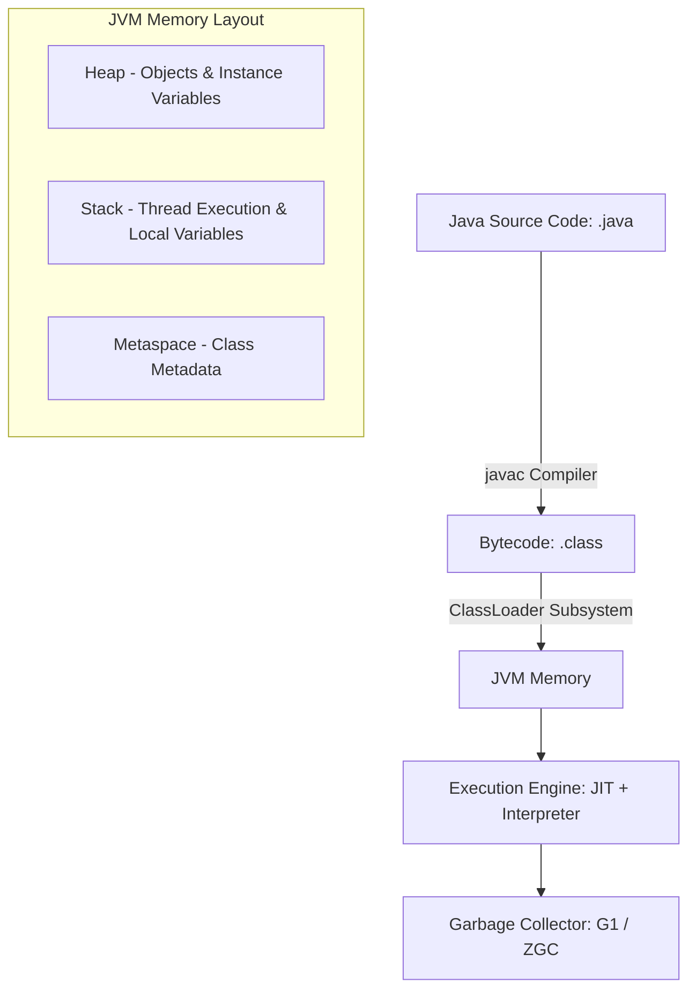

# Java Backend Engineering Master Guide

Java is a statically typed, class-based, object-oriented programming language designed for platform independence. In enterprise backends, Java is the industry standard for secure, reliable, and high-performance applications.

---

## Installation & Downloads

To install Java (JDK) on your machine:
1. Navigate to the [Official Oracle Java Downloads Page](https://www.oracle.com/java/technologies/downloads/).
2. Select your Operating System (Windows, macOS, or Linux) and download the appropriate **JDK installer** (e.g., x64 Installer).
3. Run the installer to completion.
4. Set the `JAVA_HOME` environment variable to point to your JDK installation directory and add `%JAVA_HOME%\bin` to your system `PATH`.
5. Verify the installation by running:
   ```bash
   java -version
   javac -version
   ```

### Official Download Portal


---

## 1. Phase 1: Beginner Fundamentals

### 1.1 Strong Static Typing & Variables
Java is a statically typed language, which means all variables must be declared with a specific data type before they can be used. This type checking is enforced by the compiler at compile-time.

*   **Primitive Types**: Direct data values stored in stack memory.
    *   `int`: 32-bit signed integer (`int count = 5;`)
    *   `double`: 64-bit double-precision floating-point (`double price = 19.99;`)
    *   `boolean`: Logical state (`boolean active = true;`)
    *   `char`: Single 16-bit Unicode character (`char flag = 'A';`)
*   **Reference Types**: Store references to object memory addresses allocated on the heap.
    *   `String`: Immutable sequence of characters (`String name = "AuraDocs";`)
    *   `Array`: Fixed-size container of homogeneous elements (`int[] numbers = {1, 2, 3};`)

```java
public class FundamentalsDemo {
    public static void main(String[] args) {
        int primitiveVar = 42;
        String referenceVar = "Java Guide";
        
        System.out.println("Primitive Value: " + primitiveVar);
        System.out.println("Reference Value: " + referenceVar);
    }
}
```

### 1.2 Operators
*   **Arithmetic**: `+`, `-`, `*`, `/`, `%` (modulo).
*   **Comparison**: `==`, `!=`, `>`, `<`, `>=`, `<=`.
*   **Logical**: `&&` (AND), `||` (OR), `!` (NOT).

### 1.3 Control Flow
*   **Conditional Blocks**: `if-else` and `switch` statements.
*   **Loops**: `for`, `while`, and `do-while` loops.

```java
public class ControlFlowDemo {
    public static void main(String[] args) {
        int score = 85;
        
        // Conditional Check
        if (score >= 90) {
            System.out.println("Grade: A");
        } else if (score >= 80) {
            System.out.println("Grade: B");
        } else {
            System.out.println("Grade: C");
        }

        // For Loop
        for (int i = 0; i < 3; i++) {
            System.out.println("Loop index: " + i);
        }

        // While Loop
        int countdown = 3;
        while (countdown > 0) {
            System.out.println("Countdown: " + countdown);
            countdown--;
        }
    }
}
```

### 1.4 Methods & Method Overloading
A method is a block of code that runs only when it is called. Java supports **Method Overloading**, which allows multiple methods to share the same name but with different parameter signatures.

```java
public class Calculator {
    // Add two integers
    public int add(int a, int b) {
        return a + b;
    }

    // Add three integers (Overloaded signature)
    public int add(int a, int b, int c) {
        return a + b + c;
    }

    // Add two doubles (Overloaded type signature)
    public double add(double a, double b) {
        return a + b;
    }
}
```

---

## 2. Phase 2: Intermediate Core Java

### 2.1 The Four Pillars of OOP
1.  **Encapsulation**: Hiding internal state by declaring fields `private` and exposing access via public getters/setters.
2.  **Inheritance**: Sharing behaviors and states between superclasses and subclasses using the `extends` keyword.
3.  **Polymorphism**: The ability for objects of different classes to respond to the same method call (Compile-time via Overloading; Runtime via Overriding).
4.  **Abstraction**: Hiding structural implementation details using abstract classes and interfaces.

### 2.2 Access Modifiers & Inner Classes
Access modifiers control class and member visibility:

*   **`private`**: Visible only within the declaring class.
*   **`default` (package-private)**: Visible only within classes of the same package.
*   **`protected`**: Visible within the same package and to subclasses in other packages.
*   **`public`**: Accessible from any other class in the application classpath.

```java
public class OuterConfig {
    private String secretKey = "ENC_XYZ";

    // Static nested class
    public static class DatabaseConfig {
        public void init() {
            System.out.println("Configuring database drivers...");
        }
    }

    // Inner class (has implicit reference to OuterConfig instance)
    public class Decryptor {
        public void decrypt() {
            // Direct access to outer class private fields
            System.out.println("Decrypting key: " + secretKey);
        }
    }
}
```

### 2.3 Interface Contracts vs. Abstract Classes
*   **Abstract Class**: Can contain instance state, variables, and constructors. Supports single inheritance.
*   **Interface**: Represents a structural contract. Supports multiple inheritance, default methods, static methods, and private helpers.

```java
public interface PaymentGateway {
    // Abstract method declaration
    void processPayment(double amount);

    // Default method (since Java 8)
    default void refundPayment(double amount) {
        logTransaction("REFUND", amount);
        System.out.println("Refunding: $" + amount);
    }

    // Private helper method (since Java 9)
    private void logTransaction(String type, double amount) {
        System.out.println("[GATEWAY AUDIT] " + type + " : $" + amount);
    }
}
```

### 2.4 Exception Handling (Checked vs Unchecked)
*   **Checked Exceptions**: Checked at compile-time (e.g., `IOException`). Must be caught or declared in the method signature.
*   **Unchecked Exceptions**: Occur at runtime (e.g., `NullPointerException`). Inherit from `RuntimeException`.

```java
public class ExceptionDemo {
    public void readLogFile(String path) throws java.io.IOException {
        if (path == null) {
            throw new IllegalArgumentException("Path cannot be null."); // Unchecked
        }
        // Throws Checked IOException if file is missing
        java.nio.file.Files.readAllLines(java.nio.file.Paths.get(path));
    }
}
```

---

## 3. Phase 3: Collections & Functional Streams

### 3.1 Collections Framework

| Interface | Main Implementations | Ordered? | Keys/Values Unique? | Thread-Safe? |
| :--- | :--- | :--- | :--- | :--- |
| **List** | `ArrayList`, `LinkedList` | Yes | No | No (use `CopyOnWriteArrayList` if needed) |
| **Set** | `HashSet`, `TreeSet` | No (TreeSet is sorted) | Yes | No |
| **Map** | `HashMap`, `TreeMap` | No (TreeMap is sorted) | Keys Unique | No (use `ConcurrentHashMap` for threads) |

### 3.2 Streams API (Functional Pipeline)
Streams process collections declaratively.

```java
import java.util.Arrays;
import java.util.List;
import java.util.stream.Collectors;

public class StreamsDemo {
    public static void main(String[] args) {
        List<String> items = Arrays.asList("Laptop", "Keyboard", "Monitor", "Mouse");

        // Declarative filtering and modification pipeline
        List<String> filtered = items.stream()
            .filter(name -> name.startsWith("M"))
            .map(String::toUpperCase)
            .collect(Collectors.toList());

        System.out.println(filtered); // Output: [MONITOR, MOUSE]
    }
}
```

---

## 4. Phase 4: Advanced Engine & Language Features

### 4.1 JVM Architecture & Garbage Collection



*   **Bytecode compilation**: Compiled `.class` bytecode is platform independent.
*   **Heap vs Stack**:
    *   **Stack**: Stores primitive types and references to object memory. Thread-local.
    *   **Heap**: Stores allocated objects. Shared across threads.
*   **Garbage Collectors**:
    *   **G1 GC**: Divides heap into regions; cleans regions with less active data first.
    *   **ZGC (Z Garbage Collector)**: Ultra-low latency garbage collector designed for multi-gigabyte heaps, running GC pauses concurrent with application execution.

### 4.2 Multi-Threading, Concurrency, and Virtual Threads
*   **Traditional Threading**: Standard thread maps directly to an OS thread.
*   **Virtual Threads (Java 21+)**: Light-weight user-mode threads managed by the JVM instead of the OS, allowing millions of concurrent tasks to execute concurrently.

```java
import java.util.concurrent.Executors;

public class ThreadingDemo {
    public static void main(String[] args) {
        // Using Java 21 Virtual Thread Executor
        try (var executor = Executors.newVirtualThreadPerTaskExecutor()) {
            executor.submit(() -> {
                System.out.println("Running task inside virtual thread: " + Thread.currentThread());
            });
        }
    }
}
```

### 4.3 Generics
Generics enforce compile-time type-safety for reusable classes and methods.

```java
// Reusable Generic Container
public class Box<T> {
    private T value;

    public void set(T value) { this.value = value; }
    public T get() { return value; }
}
```

### 4.4 Modern Language Features (Java 16/17+)
*   **Records (Java 16+)**: Immutable data classes containing default getters, constructors, `toString()`, `hashCode()`, and `equals()`.
*   **Sealed Classes (Java 17+)**: Pre-define exactly which classes can extend or implement a class/interface.

```java
// 1. Record DTO
public record UserResponse(String userId, String email, String role) {}

// 2. Sealed Hierarchy
public sealed interface Webhook permits StripeWebhook, PaypalWebhook {}

public final class StripeWebhook implements Webhook {}
public final class PaypalWebhook implements Webhook {}
```

---

## 5. Phase 5: Java Enterprise Ecosystem

### 5.1 Build Tools (Maven & Gradle)
Build tools organize third-party dependencies, test pipelines, and compilation steps.

*   **Maven (`pom.xml`)**: XML configuration tracking dependencies.
*   **Gradle (`build.gradle`)**: Groovy or Kotlin DSL scripts.

### 5.2 Spring Boot Integration
Spring Boot is the standard framework for enterprise Java web applications, relying heavily on Dependency Injection (DI) and annotations to decouple components.

```java
import org.springframework.boot.SpringApplication;
import org.springframework.boot.autoconfigure.SpringBootApplication;
import org.springframework.web.bind.annotation.*;
import org.springframework.stereotype.Service;

@SpringBootApplication
public class EnterpriseApplication {
    public static void main(String[] args) {
        SpringApplication.run(EnterpriseApplication.class, args);
    }
}

// Controller layer handling HTTP routing
@RestController
@RequestMapping("/api/v1")
class UserController {
    private final UserService userService;

    // Dependency injection
    public UserController(UserService userService) {
        this.userService = userService;
    }

    @GetMapping("/users/{id}")
    public UserResponse getUser(@PathVariable String id) {
        return userService.fetchUser(id);
    }
}

@Service
class UserService {
    public UserResponse fetchUser(String id) {
        return new UserResponse(id, "user@domain.com", "Admin");
    }
}
```
