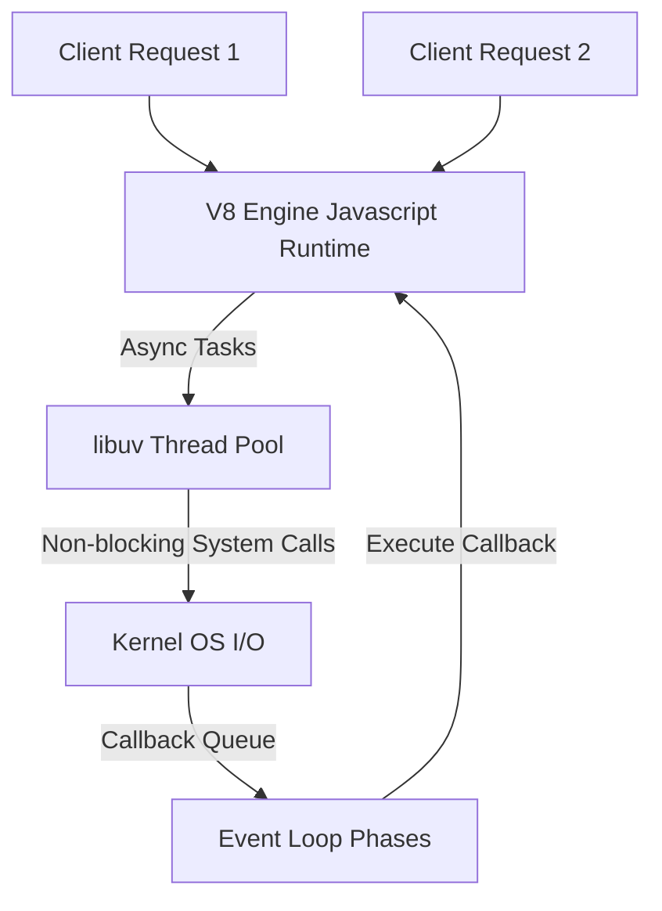

# Node.js Backend Engineering

Node.js is a cross-platform, open-source JavaScript runtime environment built on Chrome's V8 JavaScript engine. It uses an event-driven, non-blocking I/O model that makes it lightweight and efficient for real-time web applications.

<ProgressTracker currentSection=1 totalSections=6 />

## Installation & Downloads

To install Node.js on your machine:
1. Navigate to the [Official Node.js Downloads Page](https://nodejs.org/en/download/).
2. Select the LTS (Long Term Support) version and download the installer for your OS (Windows Installer `.msi`, macOS Installer, or binaries).
3. Run the installer and proceed with the default setup (ensure the option to add Node.js to your system `PATH` is enabled).
4. Verify the installation and version of Node.js and its package manager (npm) by running:
   ```bash
   node -v
   npm -v
   ```

### Official Download Portal


---

<ProgressTracker currentSection=2 totalSections=6 />

## 1. Node.js Architecture & Event Loop



### Core Architecture:
* **V8 Engine**: Compiles JavaScript directly to native machine code at runtime for fast execution.
* **Single-Threaded Model**: JavaScript execution is single-threaded, eliminating thread synchronization overhead.
* **libuv & Event Loop**: Multi-threaded C++ library (`libuv`) executes heavy network/file system I/O asynchronously, returning completed callbacks to the event loop.

---

<ProgressTracker currentSection=3 totalSections=6 />

## 2. Event Loop Phases

1. **Timers**: Executes callbacks scheduled by `setTimeout()` and `setInterval()`.
2. **Pending Callbacks**: Executes I/O callbacks deferred to the next loop iteration.
3. **Poll**: Retrieves new I/O events; executes I/O related callbacks.
4. **Check**: Executes `setImmediate()` callbacks.
5. **Close Callbacks**: Executes callbacks for closed resources, e.g., `socket.on('close')`.

---

<ProgressTracker currentSection=4 totalSections=6 />

## 3. Asynchronous Code Execution

Node.js developers write non-blocking asynchronous code using Promises and async/await syntax.

### Code Demonstration: Asynchronous Item Management
<Tabs>
  <Tab label="Syntax & Example">

```javascript
// itemController.js
const fs = require('fs').promises;

// Asynchronous handler reading database JSON file
async function loadItems() {
  try {
    // Non-blocking file system call
    const data = await fs.readFile('./db.json', 'utf-8');
    const items = JSON.parse(data);
    
    // Process items asynchronously
    const activeItems = items.filter(item => item.status === 'active');
    return activeItems;
  } catch (error) {
    console.error("Failed to read database records:", error);
    throw error;
  }
}

// Exporting using standard CommonJS module system
module.exports = { loadItems };
```

  </Tab>
  <Tab label="Interactive Playground">
    <InteractiveExample 
      language="javascript"
      initialCode="// itemController.js\nconst fs = require('fs').promises;\n\n// Asynchronous handler reading database JSON file\nasync function loadItems() {\n  try {\n    // Non-blocking file system call\n    const data = await fs.readFile('./db.json', 'utf-8');\n    const items = JSON.parse(data);\n    \n    // Process items asynchronously\n    const activeItems = items.filter(item => item.status === 'active');\n    return activeItems;\n  } catch (error) {\n    console.error(\"Failed to read database records:\", error);\n    throw error;\n  }\n}\n\n// Exporting using standard CommonJS module system\nmodule.exports = { loadItems };" 
      instruction="Execute and edit this JAVASCRIPT example."
    />
  </Tab>
</Tabs>

### Line-by-Line Code Explanation

- **`const fs = require('fs').promises;`**: Imports Node's built-in file system module utilizing Promise-based API endpoints.
- **`async function loadItems()`**: Declares an asynchronous function executing inside Node's event loop.
- **`await fs.readFile(...)`**: Non-blocking asynchronous read operation yielding thread control back to libuv pool until file stream completes.
- **`module.exports = { loadItems };`**: Exports the handler using standard CommonJS syntax.

<ProgressTracker currentSection=5 totalSections=6 />

## 4. Loops in JavaScript: For and While Loops

JavaScript in Node.js supports multiple looping constructs for iterating over arrays, objects, and executing conditional blocks.

### 4.1 Traditional `for` Loop
Used for iterating with a counter variable.
<Tabs>
  <Tab label="Syntax & Example">

```javascript
for (let i = 0; i < 3; i++) {
  console.log(`Index: ${i}`);
}
```

  </Tab>
  <Tab label="Interactive Playground">
    <InteractiveExample 
      language="javascript"
      initialCode="for (let i = 0; i < 3; i++) {\n  console.log(`Index: ${i}`);\n}" 
      instruction="Execute and edit this JAVASCRIPT example."
    />
  </Tab>
</Tabs>

### Line-by-Line Code Explanation

- **`for (let i = 0; i < 3; i++)`**: Sets up a standard three-component loop with a block-scoped iterator variable `i` declared via `let`.

### 4.2 `for...of` Loop
Iterates over iterable objects (such as arrays, strings, sets, or maps).
<Tabs>
  <Tab label="Syntax & Example">

```javascript
const frameworks = ['Express', 'NestJS', 'Koa'];
for (const framework of frameworks) {
  console.log(`Framework: ${framework}`);
}
```

  </Tab>
  <Tab label="Interactive Playground">
    <InteractiveExample 
      language="javascript"
      initialCode="const frameworks = ['Express', 'NestJS', 'Koa'];\nfor (const framework of frameworks) {\n  console.log(`Framework: ${framework}`);\n}" 
      instruction="Execute and edit this JAVASCRIPT example."
    />
  </Tab>
</Tabs>

### Line-by-Line Code Explanation

- **`for (const framework of frameworks)`**: Iterates over array elements, assigning the value of each element sequentially to the local constant.

### 4.3 `for...in` Loop
Iterates over the enumerable string properties of an object.
<Tabs>
  <Tab label="Syntax & Example">

```javascript
const service = { name: 'AuthService', port: 8080 };
for (const key in service) {
  console.log(`${key}: ${service[key]}`);
}
```

  </Tab>
  <Tab label="Interactive Playground">
    <InteractiveExample 
      language="javascript"
      initialCode="const service = { name: 'AuthService', port: 8080 };\nfor (const key in service) {\n  console.log(`${key}: ${service[key]}`);\n}" 
      instruction="Execute and edit this JAVASCRIPT example."
    />
  </Tab>
</Tabs>

### Line-by-Line Code Explanation

- **`for (const key in service)`**: Iterates over the keys/properties of the object sequentially.

### 4.4 `while` Loop
Executes a statement block as long as a specified condition evaluates to true.
<Tabs>
  <Tab label="Syntax & Example">

```javascript
let count = 3;
while (count > 0) {
  console.log(`Countdown: ${count}`);
  count--;
}
```

  </Tab>
  <Tab label="Interactive Playground">
    <InteractiveExample 
      language="javascript"
      initialCode="let count = 3;\nwhile (count > 0) {\n  console.log(`Countdown: ${count}`);\n  count--;\n}" 
      instruction="Execute and edit this JAVASCRIPT example."
    />
  </Tab>
</Tabs>

### Line-by-Line Code Explanation

- **`while (count > 0)`**: Executes the loop body repeatedly as long as the condition evaluates to `true`.

### 4.5 `do...while` Loop
Executes the code block once before checking the condition, ensuring at least one execution.
<Tabs>
  <Tab label="Syntax & Example">

```javascript
let attempts = 0;
do {
  console.log("Checking service availability...");
  attempts++;
} while (attempts < 1);
```

  </Tab>
  <Tab label="Interactive Playground">
    <InteractiveExample 
      language="javascript"
      initialCode="let attempts = 0;\ndo {\n  console.log(\"Checking service availability...\");\n  attempts++;\n} while (attempts < 1);" 
      instruction="Execute and edit this JAVASCRIPT example."
    />
  </Tab>
</Tabs>

### Line-by-Line Code Explanation

- **`do { ... } while (attempts < 1);`**: Executes the block once first, then checks the conditional expression to decide whether to repeat.

---

<ProgressTracker currentSection=6 totalSections=6 />

## 5. Key Node.js Packages & Ecosystem
* **Express / NestJS**: Lightweight and structured routing frameworks for building REST APIs.
* **npm / yarn**: The largest repository of shared libraries in the world, managing dependencies via `package.json`.
* **dotenv**: Loads configuration variables from `.env` files into `process.env`.

---

### Knowledge Verification Check

<Quiz 
  question="How does Node.js handle asynchronous operations if JavaScript is single-threaded?" 
  options=["By spawning a new CPU thread for each async callback.", "Using an Event Loop to offload non-blocking I/O tasks to the OS kernel or a thread pool, processing results sequentially when the call stack is empty.", "By compiling JavaScript code to a multithreaded native application.", "Through cooperative process-forking on multi-core servers."] 
  answerIndex=1 
  explanation="Node.js uses a single-threaded Event Loop that delegates asynchronous tasks (such as network or file operations) to system APIs or libuv's thread pool, processing callbacks sequentially." 
/>

<Quiz 
  question="What are the states of a JavaScript Promise?" 
  options=["Started, Running, Stopped.", "pending, fulfilled, rejected.", "Active, Resolved, Terminated.", "Waiting, Done, Failed."] 
  answerIndex=1 
  explanation="A Promise is always in one of three mutually exclusive states: pending (initial state), fulfilled (operation completed successfully), or rejected (operation failed)." 
/>

<Quiz 
  question="How does `async/await` relate to JavaScript Promises?" 
  options=["It compiles Javascript to native asynchronous C code.", "It is syntactic sugar built on top of Promises, making asynchronous code write and read like synchronous code.", "It deletes Promises entirely from runtime memory.", "It forces callbacks to run in parallel threads."] 
  answerIndex=1 
  explanation="`async` functions automatically return a Promise. The `await` keyword pauses execution of the async function until the awaited Promise resolves, making async code highly readable." 
/>

<Quiz 
  question="What parameters do Express.js middleware functions receive in their execution signature?" 
  options=["Only the request object (`req`).", "The Request (`req`), Response (`res`), and a call-forwarding function (`next`).", "The database client and router instances.", "System process and port information."] 
  answerIndex=1 
  explanation="Express middleware signature accepts `(req, res, next)`. This gives it access to request data, response handling, and control routing to subsequent handlers via `next()`." 
/>

<Quiz 
  question="What is a closure in JavaScript?" 
  options=["A function that automatically closes database connections.", "The combination of a function bundled together with references to its surrounding state (the lexical environment).", "A compile-time block syntax warning.", "An object that cannot hold properties."] 
  answerIndex=1 
  explanation="A closure allows an inner function to access variables from its outer (enclosing) scope even after the outer function has finished executing." 
/>

<Quiz 
  question="What is the difference between CommonJS and ES Modules (ESM) in Node.js?" 
  options=["CommonJS uses `require()` and `module.exports`, while ES Modules use `import` and `export` statements.", "CommonJS is asynchronous, while ESM is synchronous.", "CommonJS runs only in the browser, while ESM runs only in Node.js.", "There is no difference in syntax."] 
  answerIndex=0 
  explanation="CommonJS is Node's historical module system using `require`/`module.exports`. ESM is the ES6 standard using `import`/`export`, which supports static analysis and tree shaking." 
/>

<Quiz 
  question="Which C++ library does Node.js rely on to manage its thread pool and asynchronous event processing?" 
  options=["V8", "libuv", "Webpack", "Boost"] 
  answerIndex=1 
  explanation="Node.js uses the libuv library to handle the event loop, thread pool workers, file system notifications, and asynchronous networking events." 
/>

<Quiz 
  question="How does prototypical inheritance work in JavaScript?" 
  options=["Objects copy all properties from a class blueprint on instantiation.", "Objects inherit properties and methods directly from other objects via a prototype chain link.", "Inheritance is resolved strictly at compile time.", "JavaScript does not support inheritance."] 
  answerIndex=1 
  explanation="Every JS object has a link to a prototype object. When a property or method is requested, JS searches the object first, then traverses up the prototype chain until found or null is reached." 
/>

<Quiz 
  question="What is the scoping difference between `var`, `let`, and `const`?" 
  options=["`var` is block-scoped, while `let` and `const` are function-scoped.", "`var` is function-scoped (or global), while `let` and `const` are block-scoped.", "`const` is globally scoped, while `let` is locally scoped.", "All three share identical scoping rules."] 
  answerIndex=1 
  explanation="`var` is scoped to its declaring function. `let` and `const` are block-scoped (scoped to the nearest `{}` block). Additionally, `const` cannot be reassigned." 
/>

<Quiz 
  question="Which array method returns a single accumulated value by running a callback on each element?" 
  options=["map", "filter", "reduce", "forEach"] 
  answerIndex=2 
  explanation="The `reduce` method executes a reducer function on each array element, accumulating the results into a single value (e.g. summing numbers)." 
/>

<Quiz 
  question="What is the difference between `==` and `===` operators in JavaScript?" 
  options=["`==` is strict equality, while `===` performs type coercion.", "`==` performs type coercion before comparison, while `===` compares both value and type strictly.", "They behave identically.", "`==` is used for objects, `===` is used for primitive types."] 
  answerIndex=1 
  explanation="The loose equality operator (`==`) converts operands to a common type (coercion) before comparing. The strict equality operator (`===`) compares value and type without conversion." 
/>

<Quiz 
  question="What is the purpose of Node's `EventEmitter` class?" 
  options=["To manage browser mouse click events.", "To implement the observer pattern, allowing objects to emit named events that trigger registered listener callbacks.", "To execute database transactions.", "To create child server processes."] 
  answerIndex=1 
  explanation="The `EventEmitter` class in Node's `events` module enables event-driven programming, facilitating asynchronous communication between different components of an app." 
/>
