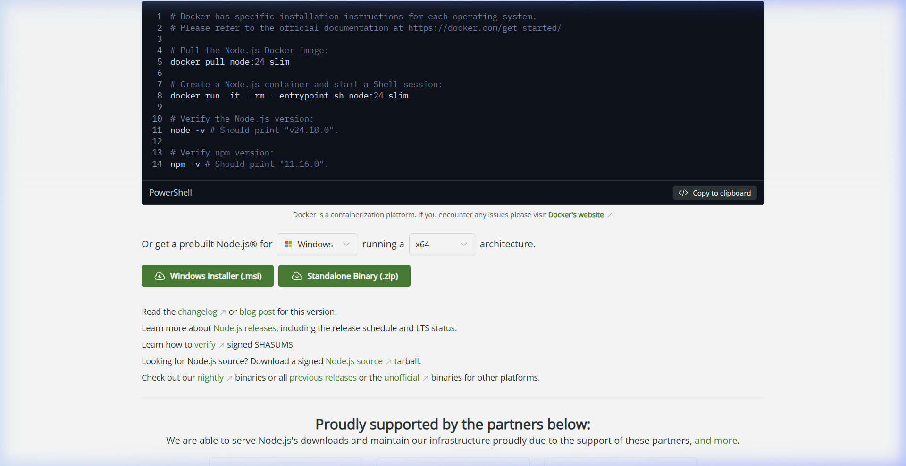
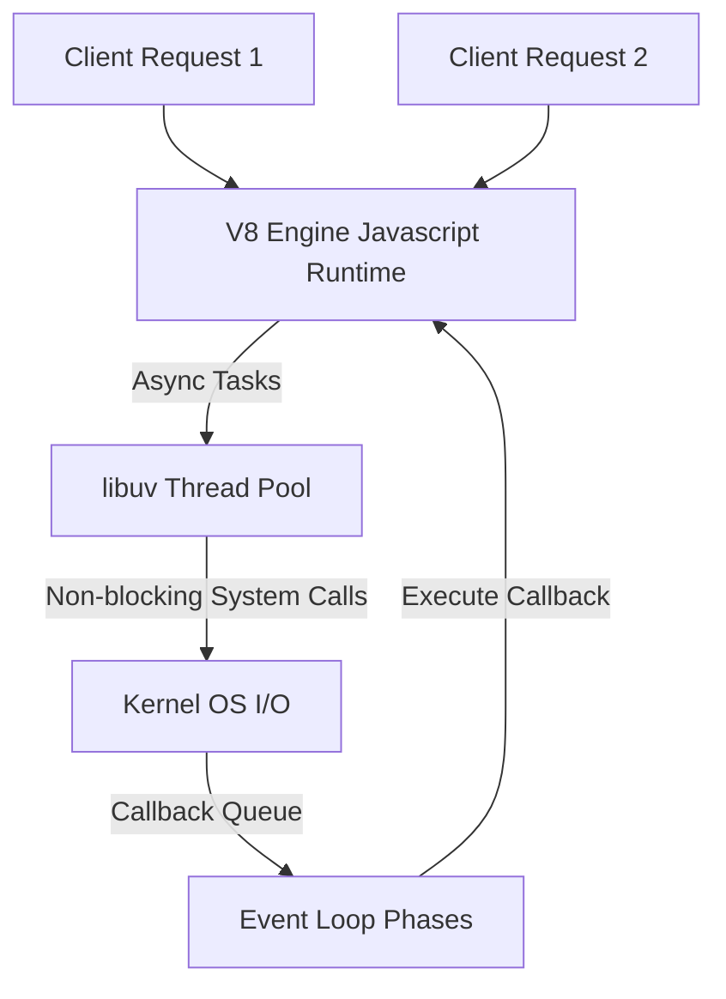

# Node.js Backend Engineering

Node.js is a cross-platform, open-source JavaScript runtime environment built on Chrome's V8 JavaScript engine. It uses an event-driven, non-blocking I/O model that makes it lightweight and efficient for real-time web applications.

## Installation & Downloads

To install Node.js on your machine:
1. Navigate to the [Official Node.js Downloads Page](https://nodejs.org/en/download/).
2. Select the LTS (Long Term Support) version and download the installer for your OS (Windows Installer `.msi`, macOS Installer, or binaries).
3. Run the installer and proceed with the default setup (ensure the option to add Node.js to your system `PATH` is enabled).
4. Verify the installation and version of Node.js and its package manager (npm) by running:
   ```bash
   node -v
   npm -v
   ```

### Official Download Portal


---

## 1. Node.js Architecture & Event Loop



### Core Architecture:
* **V8 Engine**: Compiles JavaScript directly to native machine code at runtime for fast execution.
* **Single-Threaded Model**: JavaScript execution is single-threaded, eliminating thread synchronization overhead.
* **libuv & Event Loop**: Multi-threaded C++ library (`libuv`) executes heavy network/file system I/O asynchronously, returning completed callbacks to the event loop.

---

## 2. Event Loop Phases

1. **Timers**: Executes callbacks scheduled by `setTimeout()` and `setInterval()`.
2. **Pending Callbacks**: Executes I/O callbacks deferred to the next loop iteration.
3. **Poll**: Retrieves new I/O events; executes I/O related callbacks.
4. **Check**: Executes `setImmediate()` callbacks.
5. **Close Callbacks**: Executes callbacks for closed resources, e.g., `socket.on('close')`.

---

## 3. Asynchronous Code Execution

Node.js developers write non-blocking asynchronous code using Promises and async/await syntax.

### Code Demonstration: Asynchronous Item Management
```javascript
// itemController.js
const fs = require('fs').promises;

// Asynchronous handler reading database JSON file
async function loadItems() {
  try {
    // Non-blocking file system call
    const data = await fs.readFile('./db.json', 'utf-8');
    const items = JSON.parse(data);
    
    // Process items asynchronously
    const activeItems = items.filter(item => item.status === 'active');
    return activeItems;
  } catch (error) {
    console.error("Failed to read database records:", error);
    throw error;
  }
}

// Exporting using standard CommonJS module system
module.exports = { loadItems };
```

### Line-by-Line Code Explanation

- **`const fs = require('fs').promises;`**: Imports Node's built-in file system module utilizing Promise-based API endpoints.
- **`async function loadItems()`**: Declares an asynchronous function executing inside Node's event loop.
- **`await fs.readFile(...)`**: Non-blocking asynchronous read operation yielding thread control back to libuv pool until file stream completes.
- **`module.exports = { loadItems };`**: Exports the handler using standard CommonJS syntax.

## 4. Loops in JavaScript: For and While Loops

JavaScript in Node.js supports multiple looping constructs for iterating over arrays, objects, and executing conditional blocks.

### 4.1 Traditional `for` Loop
Used for iterating with a counter variable.
```javascript
for (let i = 0; i < 3; i++) {
  console.log(`Index: ${i}`);
}
```

### Line-by-Line Code Explanation

- **`for (let i = 0; i < 3; i++)`**: Sets up a standard three-component loop with a block-scoped iterator variable `i` declared via `let`.

### 4.2 `for...of` Loop
Iterates over iterable objects (such as arrays, strings, sets, or maps).
```javascript
const frameworks = ['Express', 'NestJS', 'Koa'];
for (const framework of frameworks) {
  console.log(`Framework: ${framework}`);
}
```

### Line-by-Line Code Explanation

- **`for (const framework of frameworks)`**: Iterates over array elements, assigning the value of each element sequentially to the local constant.

### 4.3 `for...in` Loop
Iterates over the enumerable string properties of an object.
```javascript
const service = { name: 'AuthService', port: 8080 };
for (const key in service) {
  console.log(`${key}: ${service[key]}`);
}
```

### Line-by-Line Code Explanation

- **`for (const key in service)`**: Iterates over the keys/properties of the object sequentially.

### 4.4 `while` Loop
Executes a statement block as long as a specified condition evaluates to true.
```javascript
let count = 3;
while (count > 0) {
  console.log(`Countdown: ${count}`);
  count--;
}
```

### Line-by-Line Code Explanation

- **`while (count > 0)`**: Executes the loop body repeatedly as long as the condition evaluates to `true`.

### 4.5 `do...while` Loop
Executes the code block once before checking the condition, ensuring at least one execution.
```javascript
let attempts = 0;
do {
  console.log("Checking service availability...");
  attempts++;
} while (attempts < 1);
```

### Line-by-Line Code Explanation

- **`do { ... } while (attempts < 1);`**: Executes the block once first, then checks the conditional expression to decide whether to repeat.

---

## 5. Key Node.js Packages & Ecosystem
* **Express / NestJS**: Lightweight and structured routing frameworks for building REST APIs.
* **npm / yarn**: The largest repository of shared libraries in the world, managing dependencies via `package.json`.
* **dotenv**: Loads configuration variables from `.env` files into `process.env`.
