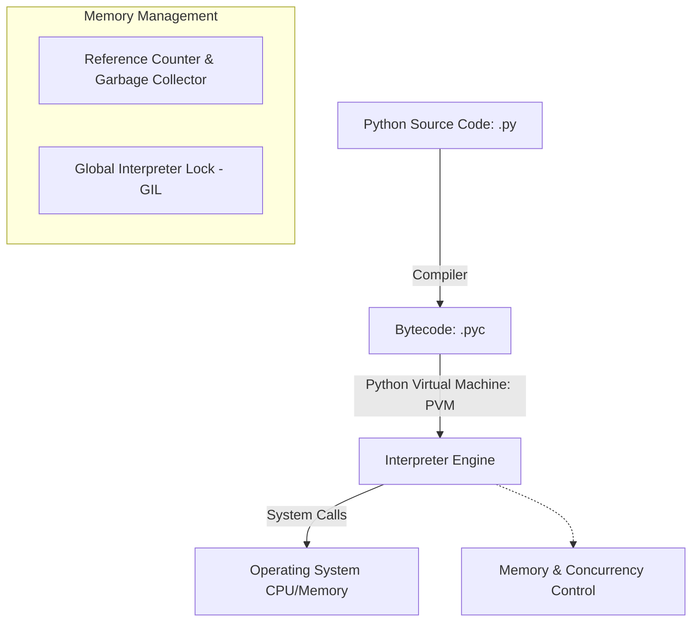
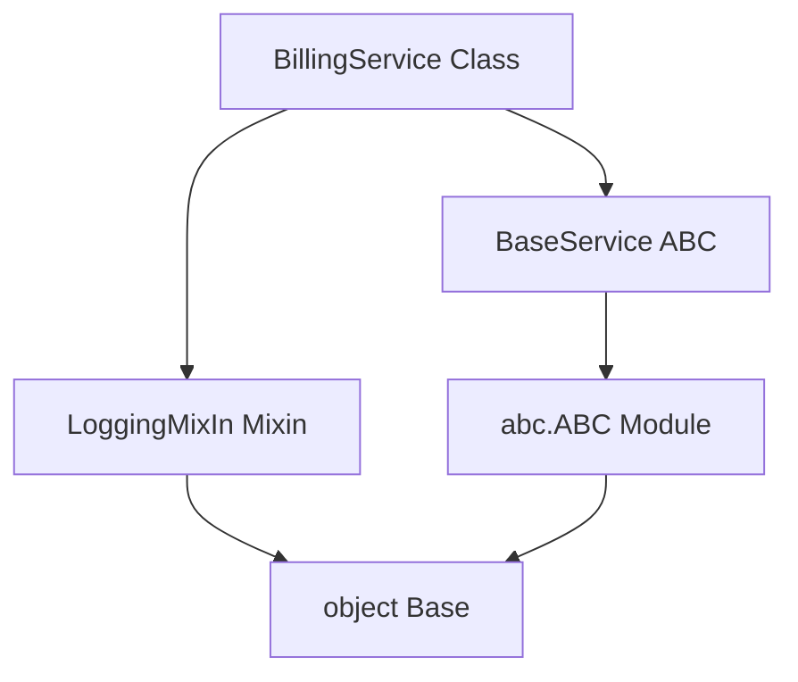

# Python Backend Engineering

Python is a dynamic, high-level, interpreted programming language known for its readability, expressive syntax, and robust ecosystem. In backend engineering, it powers APIs, data processing pipelines, and machine learning integrations.

## Installation & Downloads

To install Python on your machine:
1. Navigate to the [Official Python Downloads Page](https://www.python.org/downloads/).
2. Download the installer for your Operating System (Windows, macOS, or Linux).
3. Run the installer and **check the box "Add Python to PATH"** before clicking Install.
4. Verify the installation by running:
   ```bash
   python --version
   ```

### Official Download Portal


---

## 1. Python Execution & Memory Model



### Key Execution Architecture:
* **Bytecode Compilation**: Python source code (`.py`) is compiled into intermediate bytecode (`.pyc`) before execution.
* **Global Interpreter Lock (GIL)**: A mutex that protects access to Python objects, preventing multiple native threads from executing Python bytecodes at once. For multi-core processing, developers use multiprocessing instead of multithreading.
* **Garbage Collection**: Python manages memory automatically using **reference counting** combined with a generational garbage collector to resolve reference cycles.

---

## 2. Core Data Structures: Lists, Tuples, Dictionaries, Sets

| Structure | Syntax | Mutable? | Ordered? | Access Complexity | Typical Use Case |
| :--- | :--- | :--- | :--- | :--- | :--- |
| **List** | `[1, 2, 3]` | Yes | Yes | $O(1)$ indexing, $O(n)$ search | Storing collections of elements to modify dynamically. |
| **Tuple** | `(1, 2, 3)` | No | Yes | $O(1)$ indexing, $O(n)$ search | Heterogeneous records, dictionary keys, data integrity. |
| **Dictionary** | `{"key": "val"}`| Yes | Yes (3.7+) | $O(1)$ average lookup | Key-value store, caching, JSON payloads mapping. |
| **Set** | `{1, 2, 3}` | Yes | No | $O(1)$ average lookup | Deduplication, membership tests, mathematical set algebra. |

### Code Demonstration:
```python
# 1. List Comprehensions and Slicing
numbers = [x for x in range(10)]
evens = numbers[::2]  # Slice: start to end with step 2

# 2. Tuples as Read-Only Database Records
db_record = ("user_102", "john.doe@email.com", "Administrator")

# 3. Dictionary lookup optimization
user_permissions = {"admin": ["read", "write", "delete"], "guest": ["read"]}
guest_rights = user_permissions.get("guest", [])

# 4. Set Deduplication & Operations
allowed_ips = {"192.168.1.1", "10.0.0.1"}
request_ip = "192.168.1.1"
is_whitelisted = request_ip in allowed_ips  # O(1) time complexity
```

---

## 3. Advanced Features: Decorators & Generators

### Decorators (Metaprogramming)
Decorators wrap functions to extend or modify their behavior without editing their code directly. This is commonly used in backends for authorization, logging, and execution timing.

```python
import time
import functools

def execution_logger(func):
    @functools.wraps(func)
    def wrapper(*args, **kwargs):
        start_time = time.perf_counter()
        result = func(*args, **kwargs)
        end_time = time.perf_counter()
        print(f"Function {func.__name__} executed in {end_time - start_time:.4f} seconds.")
        return result
    return wrapper

@execution_logger
def process_database_query(query_id):
    # Simulate DB query delay
    time.sleep(0.5)
    return f"Result for query {query_id}"

# Execution
data = process_database_query(42)
```

### Generators (Memory Efficiency)
Generators yield values lazily using `yield`. Instead of loading a million records into memory at once, a generator streams them one-by-one.

```python
def stream_large_log_file(file_path):
    with open(file_path, "r") as file:
        for line in file:
            if "ERROR" in line:
                yield line.strip()

# Only processes lines on-demand, maintaining O(1) memory complexity
for error_log in stream_large_log_file("server.log"):
    print(f"Alert: {error_log}")
```

---

## 4. Standard Libraries for Web Engineering
* **`asyncio`**: Used to run concurrent I/O operations asynchronously using a single-threaded event loop.
* **`json` / `pydantic`**: Used to parse and validate incoming JSON request payloads.
* **`logging`**: Provides levels (`INFO`, `WARNING`, `ERROR`, `CRITICAL`) for audit trails.
* **`sys` / `os`**: Read environment configurations and container specifications.

---

## 5. Advanced Object-Oriented Programming (OOP) in Python

Python is a multi-paradigm language that supports advanced Object-Orient Oriented Programming (OOP). Understanding Python's dynamic object model, inheritance resolution, and encapsulation protocols is critical for writing robust backend architectures.

### 5.1 Encapsulation, Properties, and Name Mangling

Python uses specific naming conventions for access control:
* **Public**: Accessible from anywhere (e.g., `self.name`).
* **Protected** (`_attribute`): Indicates the attribute is internal and should not be accessed directly outside the class or its subclasses.
* **Private** (`__attribute`): Enforces **Name Mangling** (rewrites `__attribute` to `_ClassName__attribute`) to prevent direct modification and accidental subclass overrides.

The `@property` decorator allows developers to create getters and setters, exposing method calls as clean attributes while enforcing data validation rules.

```python
class DatabaseConnection:
    def __init__(self, host: str, port: int):
        self.host = host          # Public
        self._is_connected = False # Protected
        self.__password = None    # Private (mangled to _DatabaseConnection__password)

    @property
    def password(self) -> str:
        raise AttributeError("Password is write-only for security reasons.")

    @password.setter
    def password(self, val: str):
        if len(val) < 8:
            raise ValueError("Database password must be at least 8 characters.")
        self.__password = val

    def get_raw_password(self):
        return self.__password

# Usage
conn = DatabaseConnection("localhost", 5432)
conn.password = "supersecret123"  # Calls setter
# print(conn.__password)          # Raises AttributeError
print(conn.get_raw_password())    # Prints: supersecret123
```

### 5.2 Magic (Dunder) Methods & Custom Behaviors

Dunder (Double Underscore) methods allow user-defined classes to hook into Python's built-in operators, protocols, and standard behaviors.

* `__init__`: Constructor.
* `__str__` vs `__repr__`: `__str__` returns a user-friendly string representation; `__repr__` returns an unambiguous representation (useful for debugging/logging).
* `__call__`: Allows instances to be called like functions.
* `__enter__` / `__exit__`: Hooks into the `with` statement context manager.

```python
class QueryTransaction:
    def __init__(self, tx_id: str):
        self.tx_id = tx_id
        self.queries = []

    def __repr__(self):
        return f"QueryTransaction(tx_id='{self.tx_id}', query_count={len(self.queries)})"

    def __call__(self, query: str):
        self.queries.append(query)
        print(f"Executing: {query} inside transaction {self.tx_id}")

    def __enter__(self):
        print(f"--- START TRANSACTION {self.tx_id} ---")
        return self

    def __exit__(self, exc_type, exc_val, exc_tb):
        if exc_type:
            print(f"!!! ROLLBACK TRANSACTION {self.tx_id} due to: {exc_val} !!!")
            return False  # Propagate exception
        print(f"--- COMMIT TRANSACTION {self.tx_id} ---")
        return True

# Usage
with QueryTransaction("tx_999") as tx:
    tx("INSERT INTO users (name) VALUES ('Alice')")
    tx("UPDATE audit_logs SET status = 'active'")
    # repr usage
    print(tx)  # Prints: QueryTransaction(tx_id='tx_999', query_count=2)
```

### 5.3 Inheritance, Method Resolution Order (MRO), and Abstract Classes

* **Abstract Base Classes (ABCs)**: Define strict interfaces using the `abc` module and `@abstractmethod` decorator to mandate specific implementations in subclasses.
* **Method Resolution Order (MRO)**: Python uses the **C3 Linearization** algorithm to determine search order in multiple inheritance. Developers call `super()` to delegate method resolution dynamically.



```python
from abc import ABC, abstractmethod

class BaseService(ABC):
    @abstractmethod
    def execute(self, payload: dict) -> dict:
        pass

class LoggingMixIn:
    def log(self, message: str):
        print(f"[AUDIT LOG] {message}")

# Multiple Inheritance: BillingService inherits from BaseService and LoggingMixIn
class BillingService(BaseService, LoggingMixIn):
    def execute(self, payload: dict) -> dict:
        self.log(f"Processing billing payload: {payload}")
        amount = payload.get("amount", 0)
        return {"status": "success", "amount_charged": amount}

# Inspection of MRO
print(BillingService.__mro__)
# (<class 'BillingService'>, <class 'BaseService'>, <class 'abc.ABC'>, <class 'LoggingMixIn'>, <class 'object'>)
```
