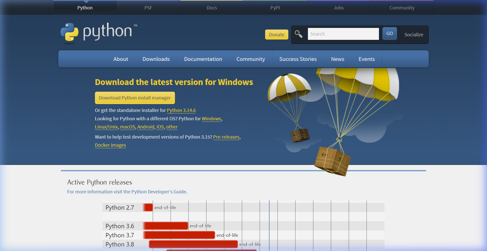
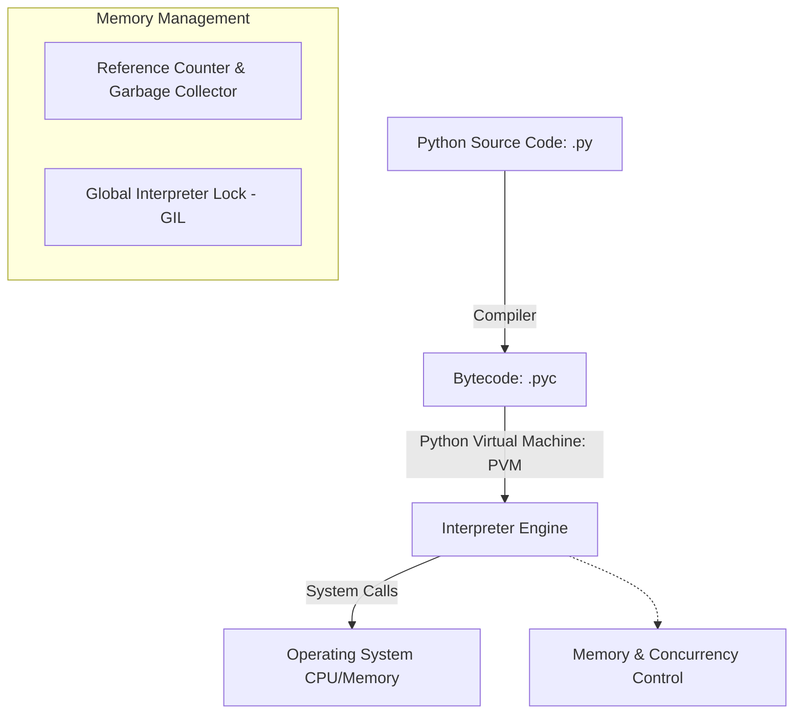

# Python Backend Engineering Master Guide

Python is a dynamic, high-level, interpreted programming language known for its readability, expressive syntax, and robust ecosystem. In backend engineering, it powers APIs, data processing pipelines, and agentic AI integrations.

---

## Installation & Downloads

To install Python on your machine:
1. Navigate to the [Official Python Downloads Page](https://www.python.org/downloads/).
2. Download the installer for your Operating System (Windows, macOS, or Linux).
3. Run the installer and **check the box "Add Python to PATH"** before clicking Install.
4. Verify the installation by running:
   ```bash
   python --version
   ```

### Official Download Portal


---

## 1. Phase 1: Beginner Fundamentals

### 1.1 Variables, Dynamic Typing, and Basic Types
Python is dynamically typed, meaning you do not need to declare a variable's type explicitly. Types are resolved at runtime.

* **Integers & Floats**: Representation of numeric values (`x = 42`, `y = 3.14`).
* **Strings**: Immutable sequence of Unicode characters (`name = "AuraDocs"`).
* **Booleans**: Logical values (`is_active = True`).

```python
# Variables and dynamic reassignment
data = 100        # Initially an integer
data = "Active"   # Reassigned to a string
print(f"Current state: {data} (Type: {type(data)})")
```

### Line-by-Line Code Explanation

- **`data = 100`**: Binds the variable `data` to an integer object.
- **`data = "Active"`**: Demonstrates dynamic typing by reassigning `data` to a string value.
- **`print(f"... {type(data)}")`**: Outputs the current value and displays the runtime class type using `type()`.

### 1.2 Operators
* **Arithmetic**: `+`, `-`, `*`, `/`, `//` (floor division), `%` (modulo), `**` (exponentiation).
* **Comparison**: `==`, `!=`, `>`, `<`, `>=`, `<=`.
* **Logical**: `and`, `or`, `not`.

### 1.3 Control Flow
Control flow structures direct the execution path of the application.

```python
# Conditional blocks
score = 85
if score >= 90:
    grade = "A"
elif score >= 80:
    grade = "B"
else:
    grade = "C"

# For loop iterating over a range
for i in range(3):
    print(f"Iteration {i}")

# For loop iterating over a list
frameworks = ["FastAPI", "Django", "Flask"]
for framework in frameworks:
    print(f"Web Framework: {framework}")

# For loop iterating over dictionary key-value pairs
user_roles = {"alice": "Admin", "bob": "Developer"}
for user, role in user_roles.items():
    print(f"User: {user}, Role: {role}")

# While loop
count = 3
while count > 0:
    print(f"Countdown: {count}")
    count -= 1

# Loop with an else block (unique Python feature)
# The else block executes only if the loop completes normally (without encountering break)
for num in range(3):
    if num == 5:
        break
else:
    print("Loop finished successfully without encountering break.")
```

### Line-by-Line Code Explanation

- **`if score >= 90 / elif score >= 80`**: Evaluates conditions sequentially to assign the correct grade value.
- **`for i in range(3)`**: Iterates over a sequence of integers from `0` to `2` generated by `range()`.
- **`for framework in frameworks`**: Loops through each element in the `frameworks` list.
- **`for user, role in user_roles.items()`**: Unpacks key-value tuples from the dictionary using `.items()`.
- **`while count > 0`**: Executes code block repeatedly as long as the condition evaluates to `True`.
- **`else:` (after `for` loop)**: Executes only if the loop completes fully without encountering a `break` statement.

### 1.4 Functions & Argument Passing
Functions are defined using the `def` keyword. Python supports positional arguments, keyword arguments, default values, and variable-length arguments (`*args`, `**kwargs`).

```python
def generate_user_profile(username, email, *roles, status="Active", **metadata):
    """
    Args:
        username (str): Position-based argument.
        email (str): Position-based argument.
        *roles: Variable positional arguments (tuples).
        status (str): Default keyword argument.
        **metadata: Variable keyword arguments (dictionary).
    """
    return {
        "username": username,
        "email": email,
        "roles": roles,
        "status": status,
        "extra_info": metadata
    }

# Invocation
profile = generate_user_profile(
    "dev_user", "dev@domain.com", "Admin", "Developer",
    status="Suspended", department="IT", location="US"
)
```

### Line-by-Line Code Explanation

- **`def generate_user_profile(...)`**: Defines a function with positional arguments, keyword arguments, and var-args.
- **`*roles`**: Captures any additional positional arguments as a tuple.
- **`status="Active"`**: Specifies a default keyword argument.
- **`**metadata`**: Captures any additional keyword arguments as a dictionary.

---

## 2. Phase 2: Intermediate Concepts

### 2.1 Core Data Structures

| Structure | Syntax | Mutable? | Ordered? | Access Complexity | Typical Use Case |
| :--- | :--- | :--- | :--- | :--- | :--- |
| **List** | `[1, 2, 3]` | Yes | Yes | $O(1)$ indexing, $O(n)$ search | Storing collections of elements to modify dynamically. |
| **Tuple** | `(1, 2, 3)` | No | Yes | $O(1)$ indexing, $O(n)$ search | Heterogeneous records, dictionary keys, data integrity. |
| **Dictionary** | `{"key": "val"}`| Yes | Yes (3.7+) | $O(1)$ average lookup | Key-value store, caching, JSON payloads mapping. |
| **Set** | `{1, 2, 3}` | Yes | No | $O(1)$ average lookup | Deduplication, membership tests, mathematical set algebra. |

```python
# List slicing and comprehensions
numbers = [x for x in range(10)]
evens = numbers[::2]  # Slice: start to end with step 2

# Dictionary lookup optimization
user_permissions = {"admin": ["read", "write", "delete"], "guest": ["read"]}
guest_rights = user_permissions.get("guest", [])  # Avoids KeyError
```

### Line-by-Line Code Explanation

- **`numbers = [x for x in range(10)]`**: Uses a list comprehension to dynamically construct a list of integers from `0` to `9`.
- **`evens = numbers[::2]`**: Slices the list from start to end with a step of `2` to extract even numbers.
- **`user_permissions.get("guest", [])`**: Accesses a dictionary value safely, returning a default empty list if the key is missing to avoid a `KeyError`.

### 2.2 Exception Handling
Robust error handling prevents unexpected application crashes. Use specific exception types rather than catching all base `Exception` instances.

```python
class DatabaseConnectionError(Exception):
    """Custom exception class for connection issues."""
    pass

def execute_query(conn_string):
    try:
        if not conn_string:
            raise DatabaseConnectionError("Invalid connection string parameters.")
        # Perform db queries...
        print("Query executed successfully.")
    except DatabaseConnectionError as db_err:
        print(f"Database Error: {db_err}")
    except Exception as err:
        print(f"Generic Failure: {err}")
    finally:
        print("Cleaning up database cursors and connections.")
```

### Line-by-Line Code Explanation

- **`class DatabaseConnectionError(Exception)`**: Declares a custom exception class by inheriting from `Exception`.
- **`try / except / finally`**: Sets up exception handling blocks to catch database errors and guarantee cleanup code runs in `finally`.
- **`raise DatabaseConnectionError(...)`**: Explicitly raises the custom exception.

### 2.3 Context Managers (`with` statement)
Context managers guarantee that setup and teardown tasks (like closing files or closing sockets) are executed, even if exceptions are raised.

```python
# Custom Context Manager using class syntax
class ManagedFile:
    def __init__(self, filename):
        self.filename = filename

    def __enter__(self):
        self.file = open(self.filename, 'r')
        return self.file

    def __exit__(self, exc_type, exc_val, exc_tb):
        if self.file:
            self.file.close()

# Usage
# with ManagedFile('data.txt') as f:
#     data = f.read()
```

### Line-by-Line Code Explanation

- **`__enter__()`**: Sets up resources (opens the file) when entering the `with` block context.
- **`__exit__()`**: Cleans up resources (closes the file) automatically when leaving the `with` block, even if an exception occurs.

---

## 3. Phase 3: Advanced Core Python

### 3.1 Execution & Memory Model



* **Bytecode Compilation**: Source code is compiled into bytecode (`.pyc`) stored in `__pycache__` directories.
* **Global Interpreter Lock (GIL)**: A mutex ensuring only one thread executes Python bytecode at a time, protecting internal reference counters.
* **Garbage Collection**: Reclaims memory using **reference counting** immediately when counters hit zero, backed by a generational collector to resolve cyclical dependencies.

### 3.2 Essential Python Decorators
Decorators wrap functions or classes to extend or modify their behavior. Here is an explanation of the most important decorators in the standard library:

#### 3.2.1 `@functools.wraps` (Metadata Preserver)
When wrapping a function inside a custom decorator, the original function's name and docstring are lost. `@functools.wraps` copies this metadata back to the wrapper.

```python
import functools

def my_decorator(func):
    @functools.wraps(func)  # Without this, help(say_hello) would output 'wrapper'
    def wrapper(*args, **kwargs):
        print("Before function call")
        return func(*args, **kwargs)
    return wrapper

@my_decorator
def say_hello():
    """Prints a friendly greeting."""
    print("Hello!")

print(say_hello.__name__)  # Prints: say_hello
print(say_hello.__doc__)   # Prints: Prints a friendly greeting.
```

### Line-by-Line Code Explanation

- **`@functools.wraps(func)`**: Retains the wrapped function's original name (`__name__`) and docstring (`__doc__`) in the decorated wrapper.

#### 3.2.2 `@property` (Encapsulation Getter/Setter)
Declares methods as getters, setters, or deleters, allowing properties to be accessed like variables while executing custom validation code.

```python
class TemperatureSensor:
    def __init__(self, celsius: float):
        self._celsius = celsius

    @property
    def fahrenheit(self) -> float:
        """Getter for fahrenheit."""
        return (self._celsius * 9/5) + 32

    @property
    def celsius(self) -> float:
        """Getter for celsius."""
        return self._celsius

    @celsius.setter
    def celsius(self, value: float):
        """Setter with validation."""
        if value < -273.15:
            raise ValueError("Temperature below absolute zero is impossible.")
        self._celsius = value
```

### Line-by-Line Code Explanation

- **`@property`**: Declares a method as a getter property so it can be accessed like a regular attribute.
- **`@celsius.setter`**: Decorates a setter method to validate and assign value changes to protected class properties.

#### 3.2.3 `@classmethod` vs `@staticmethod`
* **`@classmethod`**: Receives the class (`cls`) as the first argument. Used for factory patterns.
* **`@staticmethod`**: Receives no automatic arguments. Used for isolated helper functions.

```python
class User:
    def __init__(self, username, status):
        self.username = username
        self.status = status

    @classmethod
    def create_guest(cls, username):
        """Classmethod factory creating a guest user."""
        return cls(username, "Guest")

    @staticmethod
    def is_valid_username(name):
        """Helper method with no dependency on instance or class state."""
        return len(name) >= 3
```

### Line-by-Line Code Explanation

- **`@classmethod`**: Binds the method to the class (`cls`) rather than the instance, useful for alternative factory constructors.
- **`@staticmethod`**: Defines a utility function inside the class namespace that has no access to class or instance state.

#### 3.2.4 `@functools.lru_cache` (Memoization Caching)
Caches execution results of a function based on the arguments passed, dramatically speeding up recursive or expensive computation loops.

```python
from functools import lru_cache

@lru_cache(maxsize=128)
def fibonacci(n):
    if n < 2:
        return n
    return fibonacci(n-1) + fibonacci(n-2)
```

### Line-by-Line Code Explanation

- **`@lru_cache(maxsize=128)`**: Implements Least Recently Used caching to memoize function calls and accelerate recursive functions.

#### 3.2.5 `@contextmanager` (Generator Context Manager)
Allows creating context managers using a simple generator function, bypassing the need to write custom class blocks.

```python
from contextlib import contextmanager

@contextmanager
def db_transaction_scope():
    print("BEGIN TRANSACTION")
    try:
        yield
        print("COMMIT")
    except Exception:
        print("ROLLBACK")
        raise
```

### Line-by-Line Code Explanation

- **`@contextmanager`**: Uses generator semantics to implement a context manager without writing a full class definition.
- **`yield`**: Yields execution control back to the enclosed context block, returning to run post-yield cleanup afterwards.

### 3.3 Advanced Decorators in Modern AI: The `@tool` Decorator
In modern agentic frameworks (such as **LangChain** and **CrewAI**), the `@tool` decorator is a critical pattern. It transforms standard Python functions into structured tools that an agent can invoke, auto-generating the underlying JSON schemas from function signatures and docstrings.

```python
from langchain_core.tools import tool

@tool
def calculate_compound_interest(principal: float, rate: float, years: int) -> float:
    """
    Calculates the compound interest for a given principal, annual interest rate, and duration.
    
    Args:
        principal (float): The initial sum of money (e.g., 10000.0).
        rate (float): The annual interest rate as a decimal (e.g., 0.05 for 5%).
        years (int): The number of years the money is invested.
        
    Returns:
        float: The final balance after compound interest.
    """
    return principal * ((1 + rate) ** years)

# The agent parses the schema of this function to understand WHEN and HOW to call it:
print("Tool Name:", calculate_compound_interest.name)
print("Tool Description:", calculate_compound_interest.description)
print("Input Schema:", calculate_compound_interest.args)
```

### Line-by-Line Code Explanation

- **`@tool`**: Integrates a Python function as a tool for Agentic AI, auto-generating parameters schemas from signature types and docstrings.

### 3.4 Generators (Memory Efficiency)
Generators yield values lazily using `yield`. Instead of loading huge datasets into memory, generators stream them on-demand maintaining $O(1)$ memory complexity.

```python
def stream_large_log_file(file_path):
    with open(file_path, "r") as file:
        for line in file:
            if "ERROR" in line:
                yield line.strip()
```

### Line-by-Line Code Explanation

- **`yield`**: Lazily returns lines one-by-one from the file stream, avoiding loading the entire file into memory.

### 3.5 Advanced Object-Oriented Programming (OOP)
Python supports complex OOP patterns including multiple inheritance, dunder method hooks, properties, and name mangling.

```python
from abc import ABC, abstractmethod

class BaseService(ABC):
    @abstractmethod
    def execute(self, payload: dict) -> dict:
        pass

class LoggingMixIn:
    def log(self, message: str):
        print(f"[AUDIT LOG] {message}")

class BillingService(BaseService, LoggingMixIn):
    def __init__(self, stripe_key: str):
        self.public_key = "pk_live..."  # Public
        self._temp_session = None       # Protected
        self.__secret_key = stripe_key  # Private (Mangled to _BillingService__secret_key)

    @property
    def secret_key(self) -> str:
        raise AttributeError("Secret keys are write-only.")

    @secret_key.setter
    def secret_key(self, key: str):
        if not key.startswith("sk_"):
            raise ValueError("Invalid Stripe secret key prefix.")
        self.__secret_key = key

    def execute(self, payload: dict) -> dict:
        self.log(f"Executing payment charge...")
        return {"status": "success", "amount": payload.get("amount", 0)}

# Inspection of MRO (Method Resolution Order)
print(BillingService.__mro__)
```

### Line-by-Line Code Explanation

- **`@abstractmethod`**: Requires all inheriting subclasses to implement the decorated method.
- **`self.__secret_key`**: Triggers private name mangling, prepending the class name to the variable name (`_BillingService__secret_key`).
- **`BillingService.__mro__`**: Inspects the Method Resolution Order describing how Python resolves inheritance layers.

---

## 4. Phase 4: Concurrency & Parallelism

### 4.1 Asynchronous Programming (`asyncio`)
Async programming uses a single-threaded event loop to achieve high concurrency for I/O-bound operations.

```python
import asyncio

async def fetch_api_data(endpoint, delay):
    print(f"Fetching from {endpoint}...")
    await asyncio.sleep(delay)  # Non-blocking sleep
    print(f"Data received from {endpoint}")
    return {"endpoint": endpoint, "data": 200}

async def main():
    results = await asyncio.gather(
        fetch_api_data("users", 1.5),
        fetch_api_data("orders", 1.0),
        fetch_api_data("products", 0.5)
    )
    print(f"All operations complete: {len(results)} tasks.")
```

### Line-by-Line Code Explanation

- **`async def`**: Declares asynchronous functions that can run concurrently within the event loop.
- **`await asyncio.sleep()`**: Pauses execution without blocking the single event thread.
- **`await asyncio.gather(...)`**: Runs multiple asynchronous tasks concurrently and aggregates their results.

### 4.2 Multithreading vs. Multiprocessing
* **Multithreading (`threading`)**: Best for **I/O-bound tasks** (network calls, file input). Blocked by the GIL from speeding up CPU computations.
* **Multiprocessing (`multiprocessing`)**: Best for **CPU-bound tasks** (data processing, image compression). Spawns separate processes with their own memory space and Python interpreters, bypassing the GIL.

---

## 5. Phase 5: Python Library Ecosystem

### 5.1 Web & API Engines
Backend architectures rely on different web framework structures depending on scope and performance needs.

| Framework | Architecture | Async? | ORM Included? | Best For |
| :--- | :--- | :--- | :--- | :--- |
| **FastAPI** | ASGI Microframework | Native support | No | Fast microservices, real-time channels, OpenAI docs. |
| **Django** | WSGI / ASGI Monolith | Limited (added 3.0) | Yes (Django ORM) | Heavy applications, relational backends, admin dashboards. |
| **Flask** | WSGI Microframework | No | No | Small APIs, prototype applications, custom setups. |

#### FastAPI Code Structure
```python
from fastapi import FastAPI, Depends
from pydantic import BaseModel

app = FastAPI()

class UserPayload(BaseModel):
    username: str
    email: str

@app.post("/users")
async def create_user(payload: UserPayload):
    # Dynamic schema validation is handled by Pydantic
    return {"status": "success", "user": payload.username}
```

### Line-by-Line Code Explanation

- **`class UserPayload(BaseModel)`**: Extends Pydantic's `BaseModel` to configure strict JSON deserialization and schema validation.
- **`@app.post("/users")`**: Maps incoming HTTP POST requests to an asynchronous handler function.

### 5.2 Data Science & Machine Learning
* **`NumPy`**: Fundamental package for scientific computing with support for multi-dimensional arrays and matrix algebra.
* **`Pandas`**: Data manipulation library providing high-performance DataFrame objects.
* **`Scikit-Learn`**: Machine learning library for classification, regression, clustering, and data preprocessing.

```python
import numpy as np
import pandas as pd

# NumPy Vectorization
array = np.array([[1, 2], [3, 4]])
doubled = array * 2  # Vectorized operation

# Pandas Filtering
df = pd.DataFrame({
    "user_id": [101, 102, 103],
    "balance": [1200.0, 80.0, 500.0]
})
premium_users = df[df["balance"] > 100.0]  # Fast vector boolean filtering
```

### Line-by-Line Code Explanation

- **`array * 2`**: Demonstrates NumPy vectorization, multiplying all values inside the matrix without loops.
- **`df[df["balance"] > 100.0]`**: Performs quick boolean indexing vector filtering on a Pandas DataFrame.

### 5.3 Utility & Database Clients
* **`Pydantic`**: Data validation and settings management using Python type annotations.
* **`SQLAlchemy`**: SQL Toolkit and Object-Relational Mapper (ORM) providing powerful database operations.
* **`Requests` / `HTTPX`**: Standard HTTP clients for executing remote API requests.

```python
from pydantic import BaseModel, EmailStr, field_validator

class UserCreate(BaseModel):
    username: str
    email: EmailStr
    age: int

    @field_validator("age")
    @classmethod
    def validate_age(cls, value: int):
        if value < 18:
            raise ValueError("User must be an adult.")
        return value
```

### Line-by-Line Code Explanation

- **`@field_validator("age")`**: Triggers a custom validation check on specified model properties before data parsing completes.

### 5.4 LLM & Agentic AI
Libraries to orchestrate Large Language Models (LLMs) and autonomous agent workflows.

* **`LangChain`**: Standard framework for chains, prompts, vector indexes, and agentic workflows.
* **`CrewAI`**: Framework for orchestrating teams of role-playing, autonomous AI agents.

```python
# CrewAI Agent Orchestration Configuration
from crewai import Agent, Task, Crew, Process

# Define a researcher agent
researcher = Agent(
    role="Senior Research Analyst",
    goal="Extract technical installation steps for technologies",
    backstory="You are an expert technical writer and sysadmin.",
    verbose=True,
    memory=True
)

# Define task
task = Task(
    description="Document pgAdmin installation requirements.",
    expected_output="A markdown table detailing installation steps.",
    agent=researcher
)

# Assemble Crew
crew = Crew(
    agents=[researcher],
    tasks=[task],
    process=Process.sequential
)
```

### Line-by-Line Code Explanation

- **`Agent(...)`**: Configures an autonomous crew agent with specific roles, goals, and backstories.
- **`Task(...)`**: Sets requirements, expected outputs, and links them to the assigned agent.
- **`Crew(...)`**: Coordinates agents and tasks into a sequential execution workflow.

# Python for AI Agents (Beginner to Advanced)

## Why Python is the Language of AI

Python is the standard language of AI and Agentic development. While other languages offer high execution speed (like C++ or Rust) or native web integration (like JavaScript), Python strikes a balance that makes it irreplaceable:

<InfoCard title="Ecosystem Domination">
Python hosts the entire machine learning and LLM stack (PyTorch, Hugging Face, LangChain, Pydantic, Boto3, FastAPI).
</InfoCard>

<InfoCard title="Syntax Simplicity">
AI development is highly iterative. Writing prompts, parsing schemas, and routing logic must be written and tested rapidly. Python's clean syntax allows developers to write code that reads like pseudo-code.
</InfoCard>

<InfoCard title="C-Bindings Performance">
Heavy calculations (such as tensor math, matrix multiplications, or vector similarity computations) are executed in high-performance C/C++ backends under the hood. Python acts as a developer-friendly glue layer.
</InfoCard>

<InfoCard title="First-Class Framework Support">
Modern agent runtimes (such as Amazon Bedrock AgentCore and Strands) are built from the ground up to consume and execute Python functions natively inside virtualized environments.
</InfoCard>

---

## Python Concepts Needed for AI Agents

### Variables
<ProgressTracker currentSection={1} totalSections={26} />

<InfoCard title="Concept Overview">
Variables are labels bound to memory locations containing values. Python uses dynamic typing, meaning variable types are resolved at runtime rather than compile-time.

**Why do we need it?**
In AI agents, variables are used to track conversational context, extract model payloads, hold active session IDs, and configure prompt parameters.
</InfoCard>

<Tabs>
  <Tab label="Syntax & Example">

```python
variable_name = value
```

```python
prompt_input = "Search for AWS Bedrock pricing"
session_ttl_seconds = 28800
```

  </Tab>
  <Tab label="Interactive Playground">
    <InteractiveExample 
      initialCode="prompt_input = \"Search for AWS Bedrock pricing\"\nsession_ttl_seconds = 28800\nprint(f'Prompt: {prompt_input}')\nprint(f'Session TTL: {session_ttl_seconds}s')" 
      instruction="Run this interactive python example and see the console output."
    />
  </Tab>

  <Tab label="Advanced Playground">
    <InteractiveExample 
      language="python"
      initialCode="import json\n# Simulating dynamic parsing and reassignment of dynamic parameters in an agent tool call\nraw_payload = '{\"agent_name\": \"Auditor\", \"token_limit\": 4096}'\nconfig = json.loads(raw_payload)\n# Reassign and cast dynamically\nconfig[\"token_limit\"] = int(config[\"token_limit\"])\nprint(f\"Agent: {config['agent_name']} (Tokens: {config['token_limit']})\")" 
      instruction="Run this advanced example showing dynamic reassignment and type casting of JSON payloads in LLM tool outputs."
    />
  </Tab>
</Tabs>

<InfoCard title="AI Agent Integration">
In `ep01_simple_agent.py` line 20-21, variables are extracted dynamically from payload and context parameters:
```python
prompt = payload.get("prompt", "")
session_id = getattr(context, "session_id", "local-session-123")
```
</InfoCard>

<Tip>
- Use snake_case for variable names.
- Keep variable scopes as localized as possible.
- Use constants (uppercase) for configurations that shouldn't change.
</Tip>

<Warning>
- Reusing global variables inside functions without specifying `global`, which can lead to reference bugs.
- Variable shadow/collisions (e.g. naming a variable `list` or `dict`, overriding Python built-ins).
</Warning>

<Quiz 
  question="Which of the following describes Python's variable typing system?" 
  options={["Static typing: Types are declared at write-time and enforced by compiler.", "Dynamic typing: Variable labels point to memory objects whose types are resolved at runtime.", "Duck typing: Variables are immutable and typed on first assignment.", "Strict typing: Types are determined by the folder directory structure."]} 
  answerIndex={1} 
  explanation="Python resolves variable types dynamically at runtime. Variable names are labels bound to memory locations containing values." 
/>

<Quiz 
  question="Which of the following occurs under the hood when a Python variable is reassigned to a different data type?" 
  options=["The memory occupied by the original object is immediately freed, and the variable is modified to point to the new type.", "Python creates a new object in memory, rebinds the variable reference, and decrements the original object's reference counter.", "The virtual machine throws a runtime TypeError because Python is dynamically typed.", "Python reuses the same memory address but changes the internal type header of the original object."] 
  answerIndex=1 
  explanation="Python variables are references. Reassigning a variable creates a new object and updates the variable to point to it, decrementing the reference count on the previous object." 
/>

<InterviewQuestions>
  <InterviewQuestion q="What does dynamic typing mean in Python, and how does Python manage object references?" a="Dynamic typing means variables do not have static types; they point to objects in memory that have types. When you assign `x = 10` and then `x = \"text\"`, Python simply rebinds the label `x` from an integer object to a string object, updating the reference count of each object." />
</InterviewQuestions>

### Functions
<ProgressTracker currentSection={2} totalSections={26} />

<InfoCard title="Concept Overview">
Functions are reusable blocks of code that execute a specific action. Python support variable arguments (*args, **kwargs), default parameters, and first-class function objects.

**Why do we need it?**
AI Agent tools are registered as Python functions. LLM frameworks inspect function signatures and docstrings to generate JSON schemas.
</InfoCard>

<Tabs>
  <Tab label="Syntax & Example">

```python
def function_name(param1, param2=default_val, *args, **kwargs):
    return result
```

```python
def generate_prompt(task, context=""):
    return f"Task: {task}\nContext: {context}"
```

  </Tab>
  <Tab label="Interactive Playground">
    <InteractiveExample 
      initialCode="def generate_prompt(task, context=\"\"):\n    return f\"Task: {task}\\nContext: {context}\"\n\nprint(generate_prompt(\"Summarize logs\", \"Error at 12:00\"))" 
      instruction="Run this interactive python example and see the console output."
    />
  </Tab>

  <Tab label="Advanced Playground">
    <InteractiveExample 
      language="python"
      initialCode="def execute_agent_tool(tool_func, *args, **kwargs):\n    # Dynamically unpack and execute a tool with arbitrary positional and keyword arguments\n    print(f\"Invoking {tool_func.__name__}...\")\n    return tool_func(*args, **kwargs)\n\ndef get_user(id, role=\"Guest\"):\n    return {\"id\": id, \"role\": role}\n\nres = execute_agent_tool(get_user, \"usr_99\", role=\"Admin\")\nprint(res)" 
      instruction="Run this advanced example executing a tool with dynamic parameter unpacking using *args and **kwargs."
    />
  </Tab>
</Tabs>

<InfoCard title="AI Agent Integration">
In `ep01_simple_agent.py` line 34, functions define tools that agents can run:
```python
def get_user_details(user_id: str) -> dict:
    return {"user_id": user_id, "role": "developer"}
```
</InfoCard>

<Tip>
- Define explicit parameter names and use docstrings for LLM tool binding.
- Avoid mutable default arguments like `list` or `dict`.
</Tip>

<Warning>
- Using `history=[]` as a default argument. Python instantiates mutable default parameters once, causing state leak between function calls.
</Warning>

<Quiz 
  question="Why are mutable default arguments (like history=[]) dangerous in Python functions?" 
  options={["They consume double the memory on execution.", "They raise a SyntaxError at compile time.", "They are instantiated only once when the module is loaded, causing state to leak between subsequent calls.", "They cannot be passed to LLM tool schemas."]} 
  answerIndex={2} 
  explanation="Mutable default parameters are evaluated once when the function is defined, meaning the same object is shared across all subsequent invocations." 
/>

<Quiz 
  question="What is the structural difference between argument unpacking using *args and **kwargs in Python function definitions?" 
  options=["*args unpacks a dictionary of keyword arguments, whereas **kwargs unpacks a list of positional arguments.", "*args packs excess positional arguments into a tuple, while **kwargs packs excess keyword arguments into a dictionary.", "*args creates an immutable generator sequence, while **kwargs creates a mutable set object.", "There is no difference; they can be used interchangeably to capture any parameter type."] 
  answerIndex=1 
  explanation="*args collects positional parameters into a tuple, while **kwargs collects keyword arguments into a standard dictionary." 
/>

<InterviewQuestions>
  <InterviewQuestion q="Why are mutable default arguments dangerous in Python?" a="Mutable defaults are evaluated once at function definition time. Subsequent calls modify the same object, leaking state." />
</InterviewQuestions>

### Classes
<ProgressTracker currentSection={3} totalSections={26} />

<InfoCard title="Concept Overview">
Classes are blueprints for creating objects. They bundle data (attributes) and behavior (methods) together.

**Why do we need it?**
Agents maintain memory, state, client sessions, and tools inside structured class instances.
</InfoCard>

<Tabs>
  <Tab label="Syntax & Example">

```python
class Agent:
    def __init__(self, name):
        self.name = name
```

```python
class Memory:
    def __init__(self):
        self.history = []
    def add(self, msg):
        self.history.append(msg)
```

  </Tab>
  <Tab label="Interactive Playground">
    <InteractiveExample 
      initialCode="class Memory:\n    def __init__(self):\n        self.history = []\n    def add(self, msg):\n        self.history.append(msg)\n\nmem = Memory()\nmem.add(\"Hello agent\")\nprint(mem.history)" 
      instruction="Run this interactive python example and see the console output."
    />
  </Tab>

  <Tab label="Advanced Playground">
    <InteractiveExample 
      language="python"
      initialCode="class AgentMemory:\n    # Class variable sharing a max limit across all agent instances\n    GLOBAL_MAX_HISTORY = 100\n\n    def __init__(self, agent_id):\n        self.agent_id = agent_id  # Instance variable\n        self.history = []\n\n    def record(self, message):\n        if len(self.history) < self.GLOBAL_MAX_HISTORY:\n            self.history.append(message)\n\nm1 = AgentMemory(\"Agent_A\")\nm1.record(\"Hello\")\nprint(f\"Memory length: {len(m1.history)}\")" 
      instruction="Run this example demonstrating the difference between class variables and instance variables in agent memory class setups."
    />
  </Tab>
</Tabs>

<InfoCard title="AI Agent Integration">
In `ep02_production_supervisor.py` line 12, agents are defined as classes inheriting from a base Agent:
```python
class SupervisorAgent(BaseAgent):
    def __init__(self, team_members):
        super().__init__("Supervisor")
        self.team = team_members
```
</InfoCard>

<Tip>
- Always initialize attributes inside `__init__`.
- Keep class responsibilities single and focused.
</Tip>

<Warning>
- Defining instance variables as class variables, sharing state across all instances accidentally.
</Warning>

<Quiz 
  question="What is the primary difference between __new__ and __init__ in Python classes?" 
  options={["__new__ initializes the attributes; __init__ allocates the memory.", "__new__ creates the object instance and returns it; __init__ configures the instance attributes.", "__new__ is only for static methods; __init__ is for instance methods.", "There is no difference; they are aliases."]} 
  answerIndex={1} 
  explanation="__new__ is the constructor creator which returns the new instance, while __init__ initializes the fields on that instance." 
/>

<Quiz 
  question="If you modify a mutable class variable directly on a class instance (e.g. instance.class_var = new_val), what happens to other instances?" 
  options=["All other instances automatically see the new value of the class variable.", "The class variable is modified globally across all instances, including the base class definition.", "A new instance variable of the same name is created, shadowing the class variable on that specific instance only.", "The Python interpreter raises an AttributeError for invalid modification."] 
  answerIndex=2 
  explanation="Assigning to a class variable via an instance creates a new instance variable of the same name on that specific instance, shadowing the class variable." 
/>

<InterviewQuestions>
  <InterviewQuestion q="What is the difference between class variables and instance variables?" a="Class variables are shared by all instances of a class. Instance variables are unique to each instance." />
</InterviewQuestions>

### OOP
<ProgressTracker currentSection={4} totalSections={26} />

<InfoCard title="Concept Overview">
Object-Oriented Programming (OOP) uses encapsulation, inheritance, polymorphism, and abstraction to structure programs.

**Why do we need it?**
Different types of agents (e.g. Supervisor, Worker, Auditor) share base agent interfaces while overriding execution steps.
</InfoCard>

<Tabs>
  <Tab label="Syntax & Example">

```python
class WorkerAgent(BaseAgent):
    def execute(self):
        pass
```

```python
class BaseAgent:
    def run(self):
        raise NotImplementedError()

class SimpleAgent(BaseAgent):
    def run(self):
        return "Running task"
```

  </Tab>
  <Tab label="Interactive Playground">
    <InteractiveExample 
      initialCode="class BaseAgent:\n    def run(self):\n        raise NotImplementedError()\n\nclass SimpleAgent(BaseAgent):\n    def run(self):\n        return \"Running task\"\n\nagent = SimpleAgent()\nprint(agent.run())" 
      instruction="Run this interactive python example and see the console output."
    />
  </Tab>

  <Tab label="Advanced Playground">
    <InteractiveExample 
      language="python"
      initialCode="from abc import ABC, abstractmethod\n\nclass AgentBase(ABC):\n    @abstractmethod\n    def step(self): pass\n\nclass LoggerMixin:\n    def log_step(self, status):\n        print(f\"[LOG] Step completed with status: {status}\")\n\nclass AutonomousAgent(AgentBase, LoggerMixin):\n    def step(self):\n        self.log_step(\"Success\")\n        return \"Done\"\n\nagent = AutonomousAgent()\nagent.step()" 
      instruction="Run this example utilizing abstract base classes and logging mixins with multiple inheritance."
    />
  </Tab>
</Tabs>

<InfoCard title="AI Agent Integration">
In `ep02_production_supervisor.py` line 45, polymorphism is used to run different agent routines concurrently:
```python
for agent in self.team:
    agent.execute(task)
```
</InfoCard>

<Tip>
- Use Abstract Base Classes (ABCs) to enforce tool/agent schemas.
- Prefer composition over inheritance where applicable.
</Tip>

<Warning>
- Deep inheritance hierarchies that make code fragile and difficult to trace.
</Warning>

<Quiz 
  question="What algorithm does Python use to determine Method Resolution Order (MRO) in multiple inheritance?" 
  options={["A* Search Algorithm", "Depth First Search", "C3 Linearization Algorithm", "Kruskal's Algorithm"]} 
  answerIndex={2} 
  explanation="Python uses the C3 Linearization algorithm to construct a deterministic Method Resolution Order (MRO) list for class lookups." 
/>

<Quiz 
  question="What is the primary role of Method Resolution Order (MRO) when calling a method on a class that uses multiple inheritance?" 
  options=["MRO compiles the parent classes in parallel to execute duplicate methods simultaneously.", "MRO defines the search order Python follows to look up attributes/methods, traversing the class hierarchy deterministically via C3 linearization.", "MRO blocks subclasses from overriding any abstract methods defined in the parent class hierarchy.", "MRO resolves naming conflicts by automatically renaming duplicate methods at compile time."] 
  answerIndex=1 
  explanation="MRO uses the C3 linearization algorithm to determine a clean, deterministic linear list of parent classes to search when resolving attributes and methods." 
/>

<InterviewQuestions>
  <InterviewQuestion q="What algorithm does Python use to determine Method Resolution Order (MRO) in multiple inheritance?" a="Python uses the C3 Linearization algorithm to construct a deterministic list for class lookups." />
</InterviewQuestions>

### Modules
<ProgressTracker currentSection={5} totalSections={26} />

<InfoCard title="Concept Overview">
A module is a file containing Python definitions and statements. The file name is the module name with the suffix `.py` appended.

**Why do we need it?**
Splitting code into modules keeps tools, prompts, database logic, and agent definitions organized and importable.
</InfoCard>

<Tabs>
  <Tab label="Syntax & Example">

```python
# File: tools.py
def call_tool(): pass

# File: main.py
import tools
```

```python
# Save as agent_math.py
def add_numbers(a, b):
    return a + b
```

  </Tab>
  <Tab label="Interactive Playground">
    <InteractiveExample 
      initialCode="# Since this is a module, we show local import simulation\nimport math\nprint(math.sqrt(16))" 
      instruction="Run this interactive python example and see the console output."
    />
  </Tab>

  <Tab label="Advanced Playground">
    <InteractiveExample 
      language="python"
      initialCode="import importlib\n# Dynamically import standard math module and execute sqrt\nmath_module = importlib.import_module(\"math\")\nsquare_root = getattr(math_module, \"sqrt\")\nprint(f\"Result: {square_root(144)}\")" 
      instruction="Run this example showing how to dynamically load modules and execute functions at runtime."
    />
  </Tab>
</Tabs>

<InfoCard title="AI Agent Integration">
In `ep01_simple_agent.py` line 5, prompt templates are loaded from a dedicated module:
```python
from prompts.agent_prompts import SYSTEM_INSTRUCTION
```
</InfoCard>

<Tip>
- Keep modules focused on a single concern (e.g. tools, clients, schemas).
- Avoid wildcard imports like `from module import *`.
</Tip>

<Warning>
- Circular imports where module A imports B and B imports A, causing runtime failures.
</Warning>

<Quiz 
  question="How can you resolve circular import dependency errors in Python?" 
  options={["Rename all modules to use capital letters.", "Refactor dependencies, use dynamic imports inside functions, or place imports at the bottom of the file.", "Delete the __init__.py files from both modules.", "Use wildcards (from module import *) everywhere."]} 
  answerIndex={1} 
  explanation="Circular dependencies can be fixed by refactoring shared code into a third module, executing dynamic imports at runtime inside functions, or reorganizing code structure." 
/>

<Quiz 
  question="Why does Python cache imported modules in sys.modules instead of loading them each time an import statement is encountered?" 
  options=["To enforce private visibility modifiers for local package variables.", "To optimize performance by avoiding duplicate code compilation and execution of module-level statements.", "To prevent global variables from being reassigned in subsequent modules.", "Because Python cannot parse import statements inside local function scopes."] 
  answerIndex=1 
  explanation="When a module is imported, Python compiles and executes it, saving the resulting module object in sys.modules. Subsequent imports retrieve the cached object, saving resources." 
/>

<InterviewQuestions>
  <InterviewQuestion q="How do you prevent code in a module from running when imported?" a="Wrap the execution code block in an `if __name__ == '__main__':` block." />
</InterviewQuestions>

### Packages
<ProgressTracker currentSection={6} totalSections={26} />

<InfoCard title="Concept Overview">
Packages are namespaces containing multiple modules, structured using directories and designated by `__init__.py` files.

**Why do we need it?**
Complex agent runtimes are distributed as packages containing subpackages for memory, tools, and LLM providers.
</InfoCard>

<Tabs>
  <Tab label="Syntax & Example">

```
my_package/
    __init__.py
    agent.py
    tools/
        __init__.py
        web_search.py
```

```python
# package init exposes API endpoints
from .agent import RouterAgent
```

  </Tab>
  <Tab label="Interactive Playground">
    <InteractiveExample 
      initialCode="# Simulate package import using standard library packages\nimport os.path\nprint(os.path.join(\"usr\", \"bin\"))" 
      instruction="Run this interactive python example and see the console output."
    />
  </Tab>

  <Tab label="Advanced Playground">
    <InteractiveExample 
      language="python"
      initialCode="import sys\n# Inspecting path resolution; packages are loaded from paths in sys.path\nprint(\"First search directory:\", sys.path[0])" 
      instruction="Run this example inspecting package paths and demonstrating package path manipulations."
    />
  </Tab>
</Tabs>

<InfoCard title="AI Agent Integration">
Exposing primary endpoints in `__init__.py` simplifies agent imports:
```python
from my_agent_framework.core.agents import Agent
from my_agent_framework.core.tasks import Task
```
</InfoCard>

<Tip>
- Keep `__init__.py` files light and only use them to expose high-level APIs.
- Design clean package directory hierarchies.
</Tip>

<Warning>
- Omitting `__init__.py` in packages intended for legacy Python installations (before namespace packaging was introduced).
</Warning>

<Quiz 
  question="What is the purpose of __init__.py in a Python package?" 
  options={["It is used to compile the package to binary C code.", "It initializes the virtual environment parameters.", "It tells Python that the directory should be treated as a package, allowing package-level imports and api exposing.", "It registers the package with the global PyPI index."]} 
  answerIndex={2} 
  explanation="An __init__.py file designates a directory as a Python package, executing automatically when the package is imported." 
/>

<Quiz 
  question="Which of the following is a characteristic of Python namespace packages (introduced in Python 3.3 via PEP 420)?" 
  options=["They must contain an empty __init__.py file in their root directory.", "They allow splitting a single logical package across multiple independent directory paths on disk without an __init__.py file.", "They require compiling directories into binary files before imports work.", "They are only accessible within virtual environment installations."] 
  answerIndex=1 
  explanation="Namespace packages do not require an __init__.py file, permitting files across different directories or zip files to be combined under a single logical package namespace." 
/>

<InterviewQuestions>
  <InterviewQuestion q="What is the role of __init__.py in a Python package?" a="It signals to Python that the directory is a package, and executes package-level initializations." />
</InterviewQuestions>

### Decorators
<ProgressTracker currentSection={7} totalSections={26} />

<InfoCard title="Concept Overview">
Decorators modify or wrap function behaviors without changing their core source code. They take a function as input and return a wrapper function.

**Why do we need it?**
Decorators (like `@tool` or `@app.invoke`) register functions in LLM registries, automatically parse schemas, and log inputs/outputs.
</InfoCard>

<Tabs>
  <Tab label="Syntax & Example">

```python
def my_decorator(func):
    def wrapper(*args, **kwargs):
        return func(*args, **kwargs)
    return wrapper
```

```python
import functools
def log_call(func):
    @functools.wraps(func)
    def wrapper(*args, **kwargs):
        print(f"Calling {func.__name__}")
        return func(*args, **kwargs)
    return wrapper
```

  </Tab>
  <Tab label="Interactive Playground">
    <InteractiveExample 
      initialCode="import functools\ndef log_call(func):\n    @functools.wraps(func)\n    def wrapper(*args, **kwargs):\n        print(f\"Calling {func.__name__}\")\n        return func(*args, **kwargs)\n    return wrapper\n\n@log_call\ndef say_hi():\n    print(\"Hello!\")\n\nsay_hi()" 
      instruction="Run this interactive python example and see the console output."
    />
  </Tab>

  <Tab label="Advanced Playground">
    <InteractiveExample 
      language="python"
      initialCode="import time\nimport functools\n\ndef retry_tool(retries=3):\n    def decorator(func):\n        @functools.wraps(func)\n        def wrapper(*args, **kwargs):\n            for i in range(retries):\n                try:\n                    return func(*args, **kwargs)\n                except Exception as e:\n                    print(f\"Attempt {i+1} failed: {e}\")\n            return None\n        return wrapper\n    return decorator\n\n@retry_tool(retries=2)\ndef call_unstable_api():\n    raise RuntimeError(\"API Timeout\")\n\ncall_unstable_api()" 
      instruction="Run this example creating a parameterized decorator to automatically retry unstable API operations."
    />
  </Tab>
</Tabs>

<InfoCard title="AI Agent Integration">
In `ep01_simple_agent.py` line 12, `@app.invoke` registers agent handlers dynamically:
```python
@app.invoke(name="agent_runtime")
def handle_agent(payload, context):
    # handler code
```
</InfoCard>

<Tip>
- Always use `@functools.wraps(func)` to preserve function metadata (docstring, name, annotations).
- Use decorators for clean cross-cutting concerns like logging and security checks.
</Tip>

<Warning>
- Forgetting to return the wrapper function from the decorator.
- Losing metadata because `@functools.wraps` was omitted.
</Warning>

<Quiz 
  question="Why should you use @functools.wraps(func) when writing a custom decorator wrapper?" 
  options={["To speed up function execution.", "To bypass the Global Interpreter Lock (GIL).", "To preserve the original function's name, docstring, and signature metadata.", "To automatically catch runtime errors."]} 
  answerIndex={2} 
  explanation="@functools.wraps copies the original function metadata (name, docstring, arguments) to the wrapper function so that introspection libraries can still read it." 
/>

<Quiz 
  question="When stacking decorators (e.g. applying @decorator1 above @decorator2 on a function), what is the evaluation order?" 
  options=["They run concurrently using multithreaded handlers.", "@decorator1 executes first, wrapping the raw function, and then @decorator2 wraps the result.", "@decorator2 executes first, wrapping the raw function, and then @decorator1 wraps the resulting decorator function.", "Python randomly determines the execution order at runtime."] 
  answerIndex=2 
  explanation="Decorators are evaluated from bottom to top. The function is passed to the closest decorator first: decorator1(decorator2(func))." 
/>

<InterviewQuestions>
  <InterviewQuestion q="Why should you use @functools.wraps(func) when writing a custom decorator wrapper?" a="It copies the original function's name, docstring, and annotations metadata to the wrapper function, avoiding introspection breakage." />
</InterviewQuestions>

### Context Managers
<ProgressTracker currentSection={8} totalSections={26} />

<InfoCard title="Concept Overview">
Context Managers manage resource allocation and cleanup using `with` blocks. They implement `__enter__` and `__exit__` magic methods.

**Why do we need it?**
Agents use context managers to guarantee clean-up of database connections, remote API sessions, vector store indices, and sandbox runtimes.
</InfoCard>

<Tabs>
  <Tab label="Syntax & Example">

```python
with open('file.txt', 'r') as f:
    content = f.read()
```

```python
class SandboxSession:
    def __enter__(self):
        print("Allocating sandbox")
        return self
    def __exit__(self, exc_type, exc_val, exc_tb):
        print("Destroying sandbox")
```

  </Tab>
  <Tab label="Interactive Playground">
    <InteractiveExample 
      initialCode="class SandboxSession:\n    def __enter__(self):\n        print(\"Allocating sandbox\")\n        return self\n    def __exit__(self, exc_type, exc_val, exc_tb):\n        print(\"Destroying sandbox\")\n\nwith SandboxSession():\n    print(\"Executing user code inside sandbox\")" 
      instruction="Run this interactive python example and see the console output."
    />
  </Tab>

  <Tab label="Advanced Playground">
    <InteractiveExample 
      language="python"
      initialCode="from contextlib import contextmanager\nimport threading\n\nlock = threading.Lock()\n\n@contextmanager\ndef safe_session_scope():\n    print(\"Acquiring thread lock...\")\n    lock.acquire()\n    try:\n        yield \"Active Session\"\n    finally:\n        print(\"Releasing thread lock...\")\n        lock.release()\n\nwith safe_session_scope() as session:\n    print(f\"Working in: {session}\")" 
      instruction="Run this example utilizing a generator-based context manager to create a safe, synchronized execution block."
    />
  </Tab>
</Tabs>

<InfoCard title="AI Agent Integration">
Ensuring remote clients are closed after agent execution:
```python
with httpx.Client() as client:
    response = client.post("https://api.bedrock.com/v1", json=payload)
```
</InfoCard>

<Tip>
- Use `@contextlib.contextmanager` for quick, generator-based context managers.
- Always clean up resources in `__exit__` even if exceptions are raised.
</Tip>

<Warning>
- Swallowing exceptions in `__exit__` by returning `True` without checking if it is safe to do so.
</Warning>

<Quiz 
  question="In class-based Context Managers, what return value from __exit__ suppresses exceptions raised inside the with block?" 
  options={["None", "True", "False", "raise"]} 
  answerIndex={1} 
  explanation="Returning True from __exit__ tells Python to catch/suppress the exception; returning False allows the exception to bubble up." 
/>

<Quiz 
  question="If an exception is raised inside a with block, how must the context manager's __exit__(self, exc_type, exc_val, exc_tb) method behave to allow the exception to bubble up normally?" 
  options=["It must return True.", "It must raise the exception again manually using the raise keyword inside __exit__.", "It must return False (or return nothing, which evaluates to None/False).", "It must delete the exception parameters from the traceback memory."] 
  answerIndex=2 
  explanation="Returning False (or None) from __exit__ tells Python not to suppress the exception, letting it bubble up. Returning True suppresses the exception." 
/>

<InterviewQuestions>
  <InterviewQuestion q="What does returning True from __exit__ do in a context manager?" a="It suppresses the exception raised inside the `with` block, preventing it from bubbling up." />
</InterviewQuestions>

### Exception Handling
<ProgressTracker currentSection={9} totalSections={26} />

<InfoCard title="Concept Overview">
Exception handling manages runtime errors using `try`, `except`, `else`, and `finally` blocks.

**Why do we need it?**
LLM calls fail due to rate limits, format errors, or model hallucinations. Exception blocks catch and execute fallbacks.
</InfoCard>

<Tabs>
  <Tab label="Syntax & Example">

```python
try:
    # execute code
except ExceptionType as e:
    # handle error
finally:
    # cleanup code
```

```python
try:
    result = 10 / 0
except ZeroDivisionError:
    result = 0
```

  </Tab>
  <Tab label="Interactive Playground">
    <InteractiveExample 
      initialCode="try:\n    result = 10 / 0\nexcept ZeroDivisionError:\n    result = 0\nprint(f'Result: {result}')" 
      instruction="Run this interactive python example and see the console output."
    />
  </Tab>

  <Tab label="Advanced Playground">
    <InteractiveExample 
      language="python"
      initialCode="class ToolExecutionError(Exception): pass\n\ntry:\n    try:\n        result = 1 / 0\n    except ZeroDivisionError as e:\n        # Exception chaining to preserve context traceback\n        raise ToolExecutionError(\"Agent tool failed to compute\") from e\nexcept ToolExecutionError as outer:\n    print(f\"Caught: {outer}\")\n    print(f\"Original Cause: {outer.__cause__}\")" 
      instruction="Run this example illustrating exception chaining and causal tracebacks in python error handling."
    />
  </Tab>
</Tabs>

<InfoCard title="AI Agent Integration">
In `ep01_simple_agent.py` line 67, rate limits are managed dynamically:
```python
try:
    response = bedrock_client.invoke_model(**kwargs)
except bedrock_client.exceptions.ThrottlingException:
    time.sleep(2) # Backoff
```
</InfoCard>

<Tip>
- Avoid bare `except:` clauses as they catch system exit exceptions.
- Derive custom exceptions (like `TokenLimitException`) from `Exception`.
</Tip>

<Warning>
- Using bare `except:` which catches keyboard interrupts and prevents script termination.
</Warning>

<Quiz 
  question="Why is using a bare except: clause considered a dangerous anti-pattern?" 
  options={["It causes memory leaks.", "It raises a TypeError.", "It catches all exceptions, including system-interrupt signals like KeyboardInterrupt, making it impossible to stop execution.", "It is ignored by Python at runtime."]} 
  answerIndex={2} 
  explanation="A bare except: clause catches BaseException, which includes SystemExit and KeyboardInterrupt, preventing the user from interrupting the script." 
/>

<Quiz 
  question="In a try-except-else-finally structure, when does the else block execute?" 
  options=["Only when an exception is raised and successfully caught.", "Always, right before the finally block executes.", "Only when the try block executes successfully without raising any exceptions.", "Only if the finally block encounters an error."] 
  answerIndex=2 
  explanation="The else block executes after the code in the try block finishes, but only if no exceptions were raised during its execution." 
/>

<InterviewQuestions>
  <InterviewQuestion q="Why is using a bare except: clause considered a dangerous anti-pattern?" a="It catches BaseException, including KeyboardInterrupt and SystemExit, making it impossible to stop the program normally." />
</InterviewQuestions>

### Typing
<ProgressTracker currentSection={10} totalSections={26} />

<InfoCard title="Concept Overview">
Python typing provides type hinting metadata for variables and function signatures, used by static analyzers like `mypy`.

**Why do we need it?**
Pydantic and FastAPI read type hints (like `List[str]` or `Union[int, str]`) to generate schemas and validate input fields.
</InfoCard>

<Tabs>
  <Tab label="Syntax & Example">

```python
x: int = 10
def run_agent(name: str) -> dict:
    return {}
```

```python
from typing import List, Dict, Optional
def parse_tags(tags: List[str]) -> Optional[str]:
    return tags[0] if tags else None
```

  </Tab>
  <Tab label="Interactive Playground">
    <InteractiveExample 
      initialCode="from typing import List, Optional\ndef parse_tags(tags: List[str]) -> Optional[str]:\n    return tags[0] if tags else None\n\nprint(parse_tags([\"agent\", \"mcp\"]))" 
      instruction="Run this interactive python example and see the console output."
    />
  </Tab>

  <Tab label="Advanced Playground">
    <InteractiveExample 
      language="python"
      initialCode="from typing import Protocol\n\nclass ExecutableAgent(Protocol):\n    # Protocol defines structural subtyping (duck typing)\n    def execute(self, payload: dict) -> str: ...\n\nclass Worker:\n    def execute(self, payload: dict) -> str:\n        return \"Worker complete\"\n\ndef run_agent(agent: ExecutableAgent):\n    return agent.execute({})\n\nprint(run_agent(Worker()))" 
      instruction="Run this example utilizing typing.Protocol to implement structural subtyping constraints."
    />
  </Tab>
</Tabs>

<InfoCard title="AI Agent Integration">
Defining strict type schemas for agent tools ensures LLMs invoke them correctly:
```python
def query_db(query: str, limit: int = 10) -> List[Dict[str, Any]]:
    # database query
```
</InfoCard>

<Tip>
- Use type hints for public APIs and tool helper signatures.
- Use `mypy` to validate typing compliance during CI/CD pipelines.
</Tip>

<Warning>
- Relying on type hints to enforce constraints at runtime without using validation libraries like Pydantic.
</Warning>

<Quiz 
  question="Does Python enforce type hints (e.g. x: int) at runtime by default?" 
  options={["Yes, Python raises a TypeError if the value doesn't match the annotation.", "No, type hints are ignored during execution; static analysis must be run separately using tools like mypy.", "Yes, but only inside FastAPI routers.", "Only if the virtual environment is activated."]} 
  answerIndex={1} 
  explanation="Python does not check types at runtime. Type hints are metadata used by static analyzers (like mypy), IDEs, or frameworks like Pydantic." 
/>

<Quiz 
  question="What is the key difference between typing.Protocol (Structural typing) and standard abstract base classes (Nominal typing)?" 
  options=["Protocol is enforced at runtime, while abstract base classes are ignored.", "Protocol does not require classes to inherit from it explicitly; any class implementing the required methods matches the Protocol.", "Abstract base classes cannot declare concrete methods, while Protocol can.", "Protocol only supports basic integer types."] 
  answerIndex=1 
  explanation="Protocol implements structural subtyping (duck typing). A class matches a Protocol simply by having matching method signatures, without explicit inheritance." 
/>

<InterviewQuestions>
  <InterviewQuestion q="Does Python enforce type hints at runtime?" a="No. Type hints are completely ignored by the interpreter at runtime. They are only metadata for IDEs and static checkers." />
</InterviewQuestions>

### Async Programming
<ProgressTracker currentSection={11} totalSections={26} />

<InfoCard title="Concept Overview">
Asynchronous programming uses an event loop, `async` / `await` keywords, and coroutines to run concurrent non-blocking IO operations.

**Why do we need it?**
Agents invoke multiple LLMs, web search APIs, and databases concurrently. Async execution speeds up execution time dramatically.
</InfoCard>

<Tabs>
  <Tab label="Syntax & Example">

```python
async def fetch():
    await asyncio.sleep(1)
```

```python
import asyncio
async def main():
    print("Hello async")
    await asyncio.sleep(0.1)
```

  </Tab>
  <Tab label="Interactive Playground">
    <InteractiveExample 
      initialCode="import asyncio\nasync def main():\n    print(\"Hello async\")\n    await asyncio.sleep(0.1)\n\n# Run main loop\nasyncio.run(main())" 
      instruction="Run this interactive python example and see the console output."
    />
  </Tab>

  <Tab label="Advanced Playground">
    <InteractiveExample 
      language="python"
      initialCode="import asyncio\n\nasync def agent_action(name, duration):\n    await asyncio.sleep(duration)\n    return f\"{name} task done\"\n\nasync def run_pipeline():\n    try:\n        # Run concurrently with a timeout constraint\n        results = await asyncio.wait_for(\n            asyncio.gather(agent_action(\"A\", 0.5), agent_action(\"B\", 0.8)),\n            timeout=1.0\n        )\n        print(results)\n    except asyncio.TimeoutError:\n        print(\"Pipeline timed out!\")\n\nasyncio.run(run_pipeline())" 
      instruction="Run this example coordinating concurrent asynchronous tasks with timeout constraints."
    />
  </Tab>
</Tabs>

<InfoCard title="AI Agent Integration">
Running worker operations concurrently in `ep02_production_supervisor.py`:
```python
async def run_workers(tasks):
    results = await asyncio.gather(*[worker.run(t) for t in tasks])
    return results
```
</InfoCard>

<Tip>
- Never call blocking synchronous functions (like `time.sleep()`) in async functions; use `await asyncio.sleep()` instead.
- Use `asyncio.gather` to execute tasks concurrently.
</Tip>

<Warning>
- Stalling the event loop by calling blocking synchronous functions inside coroutines.
</Warning>

<Quiz 
  question="Which of the following should you avoid inside an asynchronous function?" 
  options={["Using the await keyword.", "Calling synchronous blocking functions like time.sleep() or requests.get().", "Using asyncio.gather().", "Returning a dictionary."]} 
  answerIndex={1} 
  explanation="Synchronous blocking calls stall the entire event loop, preventing other concurrent tasks from executing. Use non-blocking async counterparts." 
/>

<Quiz 
  question="What happens if a developer runs a CPU-heavy computation loop (e.g. while True: pass) inside an asynchronous coroutine without using await?" 
  options=["The event loop automatically offloads the loop to a background CPU process.", "The thread running the event loop is blocked, freezing all other concurrent tasks until the loop completes.", "The coroutine raises a RuntimeBlockingError.", "The execution continues in parallel using cooperative multitasking."] 
  answerIndex=1 
  explanation="Since asyncio runs on a single thread, blocking operations or CPU-bound loops without await block the entire thread, halting the event loop." 
/>

<InterviewQuestions>
  <InterviewQuestion q="What happens if you block the asyncio event loop with a call like time.sleep(5)?" a="The entire event loop freezes, blocking all other running concurrent tasks from executing for 5 seconds." />
</InterviewQuestions>

### Dataclasses
<ProgressTracker currentSection={12} totalSections={26} />

<InfoCard title="Concept Overview">
Dataclasses provide a decorator `@dataclass` that automatically adds special methods like `__init__` and `__repr__` to classes.

**Why do we need it?**
Dataclasses act as clean, lightweight records to hold agent payloads, configuration parameters, and execution state.
</InfoCard>

<Tabs>
  <Tab label="Syntax & Example">

```python
from dataclasses import dataclass
@dataclass
class AgentConfig:
    model: str
    max_tokens: int
```

```python
from dataclasses import dataclass
@dataclass
class User:
    username: str
    user_id: int
```

  </Tab>
  <Tab label="Interactive Playground">
    <InteractiveExample 
      initialCode="from dataclasses import dataclass\n@dataclass\nclass User:\n    username: str\n    user_id: int\n\nu = User(\"agent_dev\", 99)\nprint(u)" 
      instruction="Run this interactive python example and see the console output."
    />
  </Tab>

  <Tab label="Advanced Playground">
    <InteractiveExample 
      language="python"
      initialCode="from dataclasses import dataclass, field\n\n@dataclass(frozen=True)\nclass ImmutableAgentConfig:\n    agent_name: str\n    # default_factory prevents shared mutable reference bugs\n    tags: list[str] = field(default_factory=list)\n\nconfig = ImmutableAgentConfig(\"Clara\", [\"search\", \"math\"])\nprint(config)" 
      instruction="Run this example defining immutable dataclasses and using default factories for mutable list fields."
    />
  </Tab>
</Tabs>

<InfoCard title="AI Agent Integration">
Defining task specifications in `ep02_production_supervisor.py`:
```python
@dataclass
class AgentTask:
    task_id: str
    prompt: str
    temperature: float = 0.7
```
</InfoCard>

<Tip>
- Use `frozen=True` to create immutable dataclasses that are hashable.
- Provide default values for optional configurations.
</Tip>

<Warning>
- Using mutable types (like lists/dicts) as default field values without using `default_factory`.
</Warning>

<Quiz 
  question="How do you make a Python dataclass immutable and hashable?" 
  options={["Pass frozen=True to the @dataclass decorator.", "Use the readonly keyword.", "Store the class inside a tuple.", "Define all fields as private."]} 
  answerIndex={0} 
  explanation="Using @dataclass(frozen=True) automatically generates code that prevents attribute mutation and defines a __hash__ method." 
/>

<Quiz 
  question="Why does Python's dataclass raise a ValueError if you specify a mutable default parameter directly (like tags: list = [])?" 
  options=["Because dataclasses are compiled into C structures that do not support lists.", "Because mutable defaults are evaluated once and shared across all class instances, leading to state leaks.", "Because lists cannot be type-hinted in Python dataclasses.", "Because dataclass fields must be defined as read-only constants."] 
  answerIndex=1 
  explanation="To prevent instance state sharing (since defaults are evaluated once at definition time), dataclasses require mutable defaults to use default_factory." 
/>

<InterviewQuestions>
  <InterviewQuestion q="How do you make a Python dataclass immutable and hashable?" a="Set the `frozen=True` argument in the decorator: `@dataclass(frozen=True)`." />
</InterviewQuestions>

### Enums
<ProgressTracker currentSection={13} totalSections={26} />

<InfoCard title="Concept Overview">
Enums are sets of symbolic names bound to unique, constant values, inheriting from the `Enum` base class.

**Why do we need it?**
Enums categorize worker statuses (e.g. `PENDING`, `RUNNING`, `SUCCESS`) and target models in agent routing logic.
</InfoCard>

<Tabs>
  <Tab label="Syntax & Example">

```python
from enum import Enum
class Role(Enum):
    USER = "user"
    AGENT = "agent"
```

```python
from enum import Enum
class Status(Enum):
    ACTIVE = 1
    INACTIVE = 2
```

  </Tab>
  <Tab label="Interactive Playground">
    <InteractiveExample 
      initialCode="from enum import Enum\nclass Status(Enum):\n    ACTIVE = 1\n    INACTIVE = 2\n\nprint(Status.ACTIVE.name)\nprint(Status.ACTIVE.value)" 
      instruction="Run this interactive python example and see the console output."
    />
  </Tab>

  <Tab label="Advanced Playground">
    <InteractiveExample 
      language="python"
      initialCode="from enum import Enum, auto\n\nclass AgentState(Enum):\n    IDLE = auto()\n    THINKING = auto()\n    COMPLETED = auto()\n    \n    def can_transition_to(self, new_state):\n        # Custom routing validation\n        return self != AgentState.COMPLETED\n\nstate = AgentState.THINKING\nprint(\"Can change to Completed?\", state.can_transition_to(AgentState.COMPLETED))" 
      instruction="Run this example declaring enums with custom status transition methods."
    />
  </Tab>
</Tabs>

<InfoCard title="AI Agent Integration">
Managing agent orchestration workflows in `ep02_production_supervisor.py`:
```python
class StepStatus(str, Enum):
    NOT_STARTED = "NOT_STARTED"
    IN_PROGRESS = "IN_PROGRESS"
    COMPLETED = "COMPLETED"
```
</InfoCard>

<Tip>
- Inherit from both `str` and `Enum` to make values directly JSON serializable.
- Use uppercase names for Enum members.
</Tip>

<Warning>
- Comparing Enum members directly with primitive types without extracting `.value` (if they are not str-subclassed).
</Warning>

<Quiz 
  question="Why is inheriting from both str and Enum (e.g. class Role(str, Enum)) a best practice for API states?" 
  options={["It speeds up comparison operators.", "It allows the enum members to be serialized directly to JSON as plain strings.", "It bypasses pydantic validation.", "It makes the enum hashable."]} 
  answerIndex={1} 
  explanation="Inheriting from str ensures that enum values can be serialized directly into JSON outputs without needing custom serialization logic." 
/>

<Quiz 
  question="What is the primary difference between comparing Enum members using is vs comparing their values using ==?" 
  options=["Comparing with is checks the Enum member instance identity, whereas == compares the underlying values.", "is comparisons are only supported for string Enums, while == is for integer Enums.", "is performs type coercion while == is strict.", "There is no difference; they are exactly identical in all contexts."] 
  answerIndex=0 
  explanation="Enum members are singletons, so member1 is member2 checks identity. Comparing member1.value == value checks the value assigned to the member." 
/>

<InterviewQuestions>
  <InterviewQuestion q="Why is inheriting from both str and Enum (e.g., class Role(str, Enum)) helpful in APIs?" a="It allows the enum members to be serialized directly as plain strings in JSON outputs without requiring custom serializers." />
</InterviewQuestions>

### Logging
<ProgressTracker currentSection={14} totalSections={26} />

<InfoCard title="Concept Overview">
Logging tracks runtime events. Python's built-in `logging` module offers custom handlers, formatters, and logging levels.

**Why do we need it?**
JSON logging captures prompt executions, execution paths, database latencies, and tool trace logs in production environments.
</InfoCard>

<Tabs>
  <Tab label="Syntax & Example">

```python
import logging
logging.basicConfig(level=logging.INFO)
logging.info("Log message")
```

```python
import logging
logger = logging.getLogger("AgentLogger")
logger.warning("Tool timeout detected")
```

  </Tab>
  <Tab label="Interactive Playground">
    <InteractiveExample 
      initialCode="import logging\nlogging.basicConfig(level=logging.INFO)\nlogger = logging.getLogger(\"AgentDemo\")\nlogger.info(\"Simple test log\")" 
      instruction="Run this interactive python example and see the console output."
    />
  </Tab>

  <Tab label="Advanced Playground">
    <InteractiveExample 
      language="python"
      initialCode="import logging\nimport json\n\nclass JsonFormatter(logging.Formatter):\n    def format(self, record):\n        # Standardize log outputs as JSON objects\n        return json.dumps({\n            \"level\": record.levelname,\n            \"message\": record.getMessage(),\n            \"logger\": record.name\n        })\n\nhandler = logging.StreamHandler()\nhandler.setFormatter(JsonFormatter())\nlogger = logging.getLogger(\"AgentLogger\")\nlogger.addHandler(handler)\nlogger.setLevel(logging.INFO)\n\nlogger.info(\"JSON log initialization complete.\")" 
      instruction="Run this example setting up structured JSON logging in python applications."
    />
  </Tab>
</Tabs>

<InfoCard title="AI Agent Integration">
In `ep05_auth_middleware.py` line 15, request handling logs route details:
```python
logger.info("Incoming agent invocation", extra={"session_id": session_id, "route": route})
```
</InfoCard>

<Tip>
- Use structured JSON formatters to feed logs directly into Log Search Engines.
- Log exceptions using `logger.exception` to capture full tracebacks.
</Tip>

<Warning>
- Using print statements instead of logs in production code, which clutter standard outputs and lack severity labels.
</Warning>

<Quiz 
  question="Why is structured JSON logging preferred over plaintext logging for production agents?" 
  options={["JSON logging takes less disk space.", "Plaintext logs cannot be read on Windows.", "JSON logs group metadata into a single parseable line, enabling instant filtering and analysis in log search engines.", "JSON logs automatically mask all passwords."]} 
  answerIndex={2} 
  explanation="Log aggregators like CloudWatch or Elasticsearch parse JSON properties natively, allowing instant querying by session ID, module, or log level." 
/>

<Quiz 
  question="What is the purpose of log propagation in Python's logging module?" 
  options=["It duplicates log files across multiple server directories automatically.", "It passes log records up to the handlers of parent loggers in the logger hierarchy unless propagate is set to False.", "It converts all log formats to JSON structures.", "It encrypts logs before exporting them to standard output streams."] 
  answerIndex=1 
  explanation="Loggers are organized hierarchically. By default, events logged to child loggers are propagated up to their parents' handlers." 
/>

<InterviewQuestions>
  <InterviewQuestion q="Why is structured JSON logging preferred over plaintext logging for production agents?" a="Log aggregators parse JSON keys natively, making it fast and easy to query logs by session, module, or user ID." />
</InterviewQuestions>

### Environment Variables
<ProgressTracker currentSection={15} totalSections={26} />

<InfoCard title="Concept Overview">
Environment variables are configuration values defined in the system shell process environment.

**Why do we need it?**
API keys (like `GEMINI_API_KEY` or `OPENAI_API_KEY`) and server configurations must be kept secure, out of code repository commits.
</InfoCard>

<Tabs>
  <Tab label="Syntax & Example">

```python
import os
api_key = os.getenv("GEMINI_API_KEY")
```

```python
import os
port = int(os.environ.get("PORT", 8000))
```

  </Tab>
  <Tab label="Interactive Playground">
    <InteractiveExample 
      initialCode="import os\nprint(\"Current HOME directory:\", os.environ.get(\"USERPROFILE\", \"Unknown\"))" 
      instruction="Run this interactive python example and see the console output."
    />
  </Tab>

  <Tab label="Advanced Playground">
    <InteractiveExample 
      language="python"
      initialCode="import os\n\nclass AgentConfig:\n    def __init__(self):\n        # Safe retrieval with strict verification\n        self.api_key = os.environ.get(\"GEMINI_API_KEY\")\n        if not self.api_key:\n            raise ValueError(\"CRITICAL: GEMINI_API_KEY environment variable is not set!\")\n\ntry:\n    config = AgentConfig()\nexcept ValueError as e:\n    print(e)" 
      instruction="Run this example retrieving and validating environmental variable configs."
    />
  </Tab>
</Tabs>

<InfoCard title="AI Agent Integration">
In `ep01_simple_agent.py` line 14, system clients are configured using environment variables:
```python
bedrock_client = boto3.client("bedrock-runtime", region_name=os.getenv("AWS_DEFAULT_REGION", "us-east-1"))
```
</InfoCard>

<Tip>
- Always provide sensible default fallbacks when retrieving optional environment variables.
- Never commit files containing hardcoded keys to code repositories.
</Tip>

<Warning>
- Hardcoding secret tokens directly into source files, risking severe security breaches when code is pushed to public remotes.
</Warning>

<Quiz 
  question="What is a major security risk regarding environment variables in code?" 
  options={["Retrieving values with os.environ.get() causes memory fragmentation.", "Hardcoding secret keys/API tokens directly in code files instead of using environment variables, risking leaks to public repositories.", "Environment variables can only hold integers.", "They are cleared every time a function finishes execution."]} 
  answerIndex={1} 
  explanation="Hardcoding secrets in source files allows anyone with access to the source code repository to read them. Env variables keep secrets separated from code." 
/>

<Quiz 
  question="If you modify os.environ inside a running Python script, which processes are affected by this change?" 
  options=["Only the current Python process and any sub-processes spawned by it after the modification.", "All system processes currently running on the operating system.", "The change is saved permanently to the OS environment settings.", "No processes, as os.environ is read-only at runtime."] 
  answerIndex=0 
  explanation="Environment modifications are local to the process and inherited by its child processes. They do not affect parent or unrelated system processes." 
/>

<InterviewQuestions>
  <InterviewQuestion q="How do you securely configure credentials in local development vs production environments?" a="Use `.env` files for local setups (added to `.gitignore`) and system/cloud parameter stores in production." />
</InterviewQuestions>

### Virtual Environments
<ProgressTracker currentSection={16} totalSections={26} />

<InfoCard title="Concept Overview">
Virtual environments isolate python package libraries installed on a system, keeping project dependencies clean and separated.

**Why do we need it?**
Agents need specific, locked versions of libraries like `pydantic` or `langchain` that could conflict with global system packages.
</InfoCard>

<Tabs>
  <Tab label="Syntax & Example">

```bash
python -m venv .venv
source .venv/bin/activate  # On Unix
.venv\Scripts\activate     # On Windows
```

```bash
python -m venv my_env
```

  </Tab>
  <Tab label="Interactive Playground">
    <InteractiveExample 
      initialCode="# Simulate checking current virtual env prefix\nimport sys\nprint(\"Virtual environment path:\", sys.prefix)" 
      instruction="Run this interactive python example and see the console output."
    />
  </Tab>

  <Tab label="Advanced Playground">
    <InteractiveExample 
      language="python"
      initialCode="import sys\n# Check if we are running inside an active virtual environment\nis_venv = sys.prefix != sys.base_prefix\nprint(f\"Inside virtual environment: {is_venv}\")" 
      instruction="Run this example programmatically checking if python execution environment is virtualized."
    />
  </Tab>
</Tabs>

<InfoCard title="AI Agent Integration">
Standard runtimes activate virtual environments before execution:
```bash
# Production deployment script
cd /app && source .venv/bin/activate && python main.py
```
</InfoCard>

<Tip>
- Always create and activate virtual environments before installing packages.
- Exclude virtual environment folders (like `.venv`) in `.gitignore`.
</Tip>

<Warning>
- Installing dependencies globally using root/administrator privileges, breaking system tools.
</Warning>

<Quiz 
  question="How does activating a virtual environment affect import resolution?" 
  options={["It copies the entire python interpreter to the root directory.", "It overrides global imports by prepending the virtual environment path to the shell's PATH, resolving imports from its site-packages.", "It compiles python code to C++.", "It blocks all standard library imports."]} 
  answerIndex={1} 
  explanation="Activation configures environment variables so that pip installations and python execution refer to the isolated folder structure." 
/>

<Quiz 
  question="How does activating a virtual environment (.venv) change the interpreter's package discovery path?" 
  options=["It updates sys.path to prioritize directories within the virtual environment's site-packages folder.", "It copies all installed libraries into the system's root Python directory.", "It compiles python files into native shell commands.", "It blocks standard library modules from being loaded."] 
  answerIndex=0 
  explanation="Activation modifies environment paths (PATH, VIRTUAL_ENV) so that the interpreter resolves packages from the virtual environment's directories." 
/>

<InterviewQuestions>
  <InterviewQuestion q="How does activating a virtual environment affect import resolution?" a="It updates the environment shell's PATH, ensuring python loads imports from the virtual env's `site-packages` directory instead of global paths." />
</InterviewQuestions>

### Pip
<ProgressTracker currentSection={17} totalSections={26} />

<InfoCard title="Concept Overview">
Pip is the package installer for Python. It downloads and manages libraries from the Python Package Index (PyPI).

**Why do we need it?**
Pip installs agent dependencies, including SDK clients, database drivers, and serialization libraries.
</InfoCard>

<Tabs>
  <Tab label="Syntax & Example">

```bash
pip install package_name
pip install -r requirements.txt
```

```bash
pip install requests pydantic
```

  </Tab>
  <Tab label="Interactive Playground">
    <InteractiveExample 
      initialCode="# Show installed packages demo\nimport pkg_resources\nfor dist in list(pkg_resources.working_set)[:5]:\n    print(f'{dist.project_name} ({dist.version})')" 
      instruction="Run this interactive python example and see the console output."
    />
  </Tab>

  <Tab label="Advanced Playground">
    <InteractiveExample 
      language="python"
      initialCode="import subprocess\nimport sys\n\n# Programmatically execute pip list using subprocess\nres = subprocess.run([sys.executable, \"-m\", \"pip\", \"list\"], capture_output=True, text=True)\nprint(\"Pip Package Check:\")\nprint(\"\\n\".join(res.stdout.splitlines()[:5]))" 
      instruction="Run this example executing pip packages list checks programmatically."
    />
  </Tab>
</Tabs>

<InfoCard title="AI Agent Integration">
Installing packages dynamically in sandbox runtimes:
```python
subprocess.run(["pip", "install", "-r", "requirements.txt"])
```
</InfoCard>

<Tip>
- Pin package versions in `requirements.txt` to prevent breaking changes on updates.
- Use editable mode `pip install -e .` for local package development.
</Tip>

<Warning>
- Installing packages without pinning versions, causing dependency drifts and build errors in deployment pipelines.
</Warning>

<Quiz 
  question="What is the difference between pip install and pip install -e .?" 
  options={["Editable mode (-e) installs the package as a read-only symlink.", "Editable mode (-e) allows modifying the package source code directly without reinstalling to see changes.", "Editable mode disables sub-dependency resolution.", "Standard install downloads code from GitHub only."]} 
  answerIndex={1} 
  explanation="Editable install symlinks the source code directory, ensuring changes to the local files are immediately reflected in imports." 
/>

<Quiz 
  question="What is the primary purpose of using requirements constraints (e.g. pydantic>=2.0,<3.0) in a requirements.txt file?" 
  options=["To speed up the network download speed of libraries.", "To prevent breaking changes by locking updates to compatible major/minor versions while permitting bug fixes.", "To compile dependencies into binary wheels before installing.", "To force pip to run only inside a Docker container."] 
  answerIndex=1 
  explanation="Constraints ensure that compatible versions are installed (e.g. avoiding major breaking versions), preventing dependency drift and runtime breaks." 
/>

<InterviewQuestions>
  <InterviewQuestion q="What is the difference between pip install and pip install -e .?" a="Editable mode (-e) installs the local directory as a symbolic link, so source file modifications are immediately reflected in imports without reinstalling." />
</InterviewQuestions>

### UV
<ProgressTracker currentSection={18} totalSections={26} />

<InfoCard title="Concept Overview">
UV is a fast, modern package installer and resolver written in Rust, designed to replace pip, pip-tools, and virtualenv.

**Why do we need it?**
Speeding up agent deployment times and virtual environment creation in containerized execution clusters.
</InfoCard>

<Tabs>
  <Tab label="Syntax & Example">

```bash
uv pip install -r requirements.txt
uv venv
```

```bash
uv pip install httpx pydantic
```

  </Tab>
  <Tab label="Interactive Playground">
    <InteractiveExample 
      initialCode="# Show uv command simulation\nprint(\"UV executes concurrent Rust resolutions, downloading libraries rapidly.\")" 
      instruction="Run this interactive python example and see the console output."
    />
  </Tab>

  <Tab label="Advanced Playground">
    <InteractiveExample 
      language="python"
      initialCode="# Simulating a uv-based virtual env setup check\nimport sys\nprint(\"UV packages are resolved in optimized, concurrent caches.\")\nprint(\"Interpreter:\", sys.executable)" 
      instruction="Run this example demonstrating UV environment path variables."
    />
  </Tab>
</Tabs>

<InfoCard title="AI Agent Integration">
Running Docker deployments using UV:
```dockerfile
RUN pip install uv && uv pip install --system -r requirements.txt
```
</InfoCard>

<Tip>
- Use UV in CI/CD pipelines to speed up build processes.
- Keep dependencies cached globally for optimal deployment performance.
</Tip>

<Warning>
- Expecting UV to fix broken dependency requirements that have no valid resolved paths.
</Warning>

<Quiz 
  question="What makes UV faster than traditional pip?" 
  options={["It ignores sub-dependency resolution.", "It is written in Rust, compiling dependencies concurrently and caching globally using hard links.", "It only installs binary wheel files.", "It executes in the browser."]} 
  answerIndex={1} 
  explanation="UV implements state-of-the-art Rust architecture with parallel dependency fetching, caching, and linking for high performance." 
/>

<Quiz 
  question="How does UV achieve significant performance gains over traditional pip when installing packages?" 
  options=["It skips resolving dependencies entirely and copies files directly.", "It is written in Rust, resolves dependencies concurrently, and uses global cache links (hard links/reflink) to avoid copying files.", "It executes only inside web browser interpreters.", "It compresses package archives using a custom algorithm before download."] 
  answerIndex=1 
  explanation="UV leverages Rust concurrency and global caching with system file links (reflink or hard link) to make installs extremely fast and resource-efficient." 
/>

<InterviewQuestions>
  <InterviewQuestion q="What makes UV faster than traditional pip?" a="UV is built in Rust. It utilizes parallel dependency fetching, a global cache, and hard links instead of copy operations." />
</InterviewQuestions>

### Poetry
<ProgressTracker currentSection={19} totalSections={26} />

<InfoCard title="Concept Overview">
Poetry is a dependency management and packaging tool in Python that locks dependency versions in a deterministic file.

**Why do we need it?**
Ensuring reproducible builds for agent platforms by locking all sub-dependencies with cryptographic hashes.
</InfoCard>

<Tabs>
  <Tab label="Syntax & Example">

```toml
# pyproject.toml
[tool.poetry.dependencies]
python = "^3.10"
langchain = "*"
```

```bash
poetry add pydantic
poetry install
```

  </Tab>
  <Tab label="Interactive Playground">
    <InteractiveExample 
      initialCode="# Poetry simulation\nprint(\"Poetry uses poetry.lock to resolve and pin dependencies.\")" 
      instruction="Run this interactive python example and see the console output."
    />
  </Tab>

  <Tab label="Advanced Playground">
    <InteractiveExample 
      language="python"
      initialCode="# Simulating reading project config from pyproject.toml\nproject_config = \"\"\"\n[tool.poetry.dependencies]\npython = \"^3.11\"\npydantic = \"^2.5.0\"\n\"\"\"\nprint(\"Parsed pyproject.toml layout:\")\nprint(project_config.strip())" 
      instruction="Run this example displaying sample Poetry config files layout structures."
    />
  </Tab>
</Tabs>

<InfoCard title="AI Agent Integration">
Production agent templates use poetry to publish core toolkits:
```bash
poetry build
poetry publish
```
</InfoCard>

<Tip>
- Always commit `poetry.lock` to ensure all developers run identical library versions.
- Keep dependencies categorized under groups (e.g. dev, test).
</Tip>

<Warning>
- Manually editing `poetry.lock` instead of using `poetry add` or `poetry update`.
</Warning>

<Quiz 
  question="What is the difference between pyproject.toml and poetry.lock?" 
  options={["pyproject.toml is used on Windows, poetry.lock on Unix.", "pyproject.toml specifies general dependencies, while poetry.lock locks the exact resolved sub-dependency versions.", "poetry.lock contains encrypted security tokens.", "Poetry ignores the lockfile during installs."]} 
  answerIndex={1} 
  explanation="The toml configuration describes broad limits; the lockfile registers exact pinned versions to guarantee reproducible builds." 
/>

<Quiz 
  question="What security role does the poetry.lock file play in package deployments?" 
  options=["It encrypts all code files before sending them to production.", "It records exact package versions along with cryptographic content hashes to ensure identical and secure builds.", "It locks file permissions to prevent unauthorised users from editing code.", "It logs all active API keys in a secure dashboard."] 
  answerIndex=1 
  explanation="The lockfile ensures reproducibility and security by pinning the exact package version and storing file hashes to verify that installed code hasn't been altered." 
/>

<InterviewQuestions>
  <InterviewQuestion q="What is the difference between pyproject.toml and poetry.lock?" a="pyproject.toml specifies general dependency version limits, while poetry.lock pins the exact version hashes of all sub-dependencies." />
</InterviewQuestions>

### JSON
<ProgressTracker currentSection={20} totalSections={26} />

<InfoCard title="Concept Overview">
JSON is a text format used to represent structured data. Python's built-in `json` module translates data to and from dictionaries.

**Why do we need it?**
LLMs speak JSON. Agents serialize prompt parameters to JSON and deserialize responses back into structured objects.
</InfoCard>

<Tabs>
  <Tab label="Syntax & Example">

```python
import json
json_str = json.dumps(data_dict)
dict_data = json.loads(json_str)
```

```python
import json
payload = json.dumps({"query": "hello", "history": []})
```

  </Tab>
  <Tab label="Interactive Playground">
    <InteractiveExample 
      initialCode="import json\npayload = json.dumps({\"query\": \"hello\", \"history\": []})\nprint(payload)\nprint(json.loads(payload))" 
      instruction="Run this interactive python example and see the console output."
    />
  </Tab>

  <Tab label="Advanced Playground">
    <InteractiveExample 
      language="python"
      initialCode="import json\nfrom datetime import datetime\n\nclass AgentJsonEncoder(json.JSONEncoder):\n    def default(self, obj):\n        if isinstance(obj, datetime):\n            return obj.isoformat()\n        return super().default(obj)\n\npayload = {\"timestamp\": datetime.now(), \"status\": \"active\"}\nprint(json.dumps(payload, cls=AgentJsonEncoder))" 
      instruction="Run this example utilizing custom JSON encoders for non-serializable objects (datetime)."
    />
  </Tab>
</Tabs>

<InfoCard title="AI Agent Integration">
In `ep01_simple_agent.py` line 48, agent outputs are structured in JSON payloads:
```python
result = json.loads(response["body"].read().decode("utf-8"))
```
</InfoCard>

<Tip>
- Use `json.JSONDecodeError` to handle malformed LLM responses safely.
- Pass `indent=4` to formatting functions for logging outputs.
</Tip>

<Warning>
- Trying to serialize non-serializable objects (like `datetime` objects or custom classes) without custom JSON encoders.
</Warning>

<Quiz 
  question="How do you handle custom non-serializable objects (like datetime) when using json.dumps()?" 
  options={["Cast the entire object to a string.", "Provide a custom JSONEncoder subclass to parse and serialize the types.", "JSON cannot handle nested structures in Python.", "Import the json2 package."]} 
  answerIndex={1} 
  explanation="Providing a subclass of JSONEncoder allows defining customized serialization rules for non-primitive types." 
/>

<Quiz 
  question="Which error does Python's standard json.dumps() throw when attempting to serialize a custom object without a custom encoder?" 
  options=["AttributeError", "TypeError", "ValueError", "SerializationError"] 
  answerIndex=1 
  explanation="A TypeError is raised when an object of a non-serializable type (like custom class instances or datetime) is passed to json.dumps()." 
/>

<InterviewQuestions>
  <InterviewQuestion q="How do you handle custom non-serializable objects (like datetime) using json.dumps()?" a="Provide a custom encoder subclassing `json.JSONEncoder` or pass a serialization helper function to the `default` argument." />
</InterviewQuestions>

### HTTP APIs
<ProgressTracker currentSection={21} totalSections={26} />

<InfoCard title="Concept Overview">
HTTP APIs allow communication between clients and web servers using requests (GET, POST) over network channels.

**Why do we need it?**
Agents communicate with external LLM hosting services, vector search endpoints, and downstream tools using HTTP protocols.
</InfoCard>

<Tabs>
  <Tab label="Syntax & Example">

```python
import requests
resp = requests.post(url, json=data)
```

```python
import httpx
resp = httpx.get("https://httpbin.org/get")
```

  </Tab>
  <Tab label="Interactive Playground">
    <InteractiveExample 
      initialCode="import httpx\nresp = httpx.get(\"https://httpbin.org/get\")\nprint(resp.status_code)" 
      instruction="Run this interactive python example and see the console output."
    />
  </Tab>

  <Tab label="Advanced Playground">
    <InteractiveExample 
      language="python"
      initialCode="import httpx\nimport asyncio\n\nasync def check_api_status():\n    # Reusing an async HTTP client session\n    async with httpx.AsyncClient() as client:\n        resp = await client.get(\"https://httpbin.org/status/200\")\n        print(f\"Status Code: {resp.status_code}\")\n\nasyncio.run(check_api_status())" 
      instruction="Run this example executing concurrent API calls using httpx."
    />
  </Tab>
</Tabs>

<InfoCard title="AI Agent Integration">
In `ep04_lambda_mcp_server.py` line 26, tools run HTTP search queries:
```python
async with httpx.AsyncClient() as client:
    response = await client.post(SEARCH_URL, json=payload)
```
</InfoCard>

<Tip>
- Always set explicit request timeouts to prevent threads from hanging.
- Use async clients (`httpx.AsyncClient`) inside concurrent async code blocks.
</Tip>

<Warning>
- Making synchronous HTTP requests inside async loops, freezing execution across concurrent queries.
</Warning>

<Quiz 
  question="When should you use httpx instead of requests?" 
  options={["When you need to make asynchronous non-blocking HTTP requests.", "When you want to parse JSON automatically.", "Only when calling AWS Bedrock endpoints.", "When running on Python 2.x."]} 
  answerIndex={0} 
  explanation="httpx supports async requests via async/await, allowing concurrent I/O calls without blocking the async event loop." 
/>

<Quiz 
  question="What is a major advantage of using HTTPX's connection pooling via Client sessions over individual request calls?" 
  options=["It automatically encrypts request parameters.", "It reuses established TCP connections, reducing network latency and handshaking overhead.", "It bypasses system firewall constraints.", "It translates HTTP requests into GraphQL queries."] 
  answerIndex=1 
  explanation="Connection pooling reuses TCP connections, avoiding the overhead of opening and closing connections for each request, enhancing API performance." 
/>

<InterviewQuestions>
  <InterviewQuestion q="When should you use httpx instead of requests?" a="Use `httpx` when you need async support (`async/await`) to make non-blocking HTTP requests concurrently." />
</InterviewQuestions>

### FastAPI Basics
<ProgressTracker currentSection={22} totalSections={26} />

<InfoCard title="Concept Overview">
FastAPI is an ASGI framework built on Pydantic and type hints, enabling easy generation of REST endpoints.

**Why do we need it?**
FastAPI hosts agents as web APIs, accepting client queries, executing tool routing, and streaming responses back.
</InfoCard>

<Tabs>
  <Tab label="Syntax & Example">

```python
from fastapi import FastAPI
app = FastAPI()
@app.get("/")
def home(): return {}
```

```python
from fastapi import FastAPI
app = FastAPI()
@app.post("/invoke")
def run(payload: dict): return {"status": "ok"}
```

  </Tab>
  <Tab label="Interactive Playground">
    <InteractiveExample 
      initialCode="# Simulate FastAPI endpoint setup\nprint(\"FastAPI app instance configured with ASGI routers.\")" 
      instruction="Run this interactive python example and see the console output."
    />
  </Tab>

  <Tab label="Advanced Playground">
    <InteractiveExample 
      language="python"
      initialCode="from fastapi import FastAPI\nfrom pydantic import BaseModel\n\napp = FastAPI()\n\nclass PromptInput(BaseModel):\n    text: str\n\n@app.post(\"/agent\")\nasync def run_agent_route(payload: PromptInput):\n    return {\"response\": f\"Processed: {payload.text}\"}\n\nprint(\"FastAPI agent route registered successfully.\")" 
      instruction="Run this example showing route mappings and request body models configurations in FastAPI."
    />
  </Tab>
</Tabs>

<InfoCard title="AI Agent Integration">
In `ep01_simple_agent.py` line 18, routers expose api endpoints:
```python
@router.post("/chat")
async def chat_endpoint(payload: ChatPayload):
    return await agent_executor.run(payload)
```
</InfoCard>

<Tip>
- Use Pydantic models for request body inputs instead of raw dictionaries.
- Use dependency injection for clean database connections.
</Tip>

<Warning>
- Exposing sensitive credentials in OpenAPI documentation routes by failing to configure security handlers.
</Warning>

<Quiz 
  question="How does FastAPI automatically generate its OpenAPI / Swagger documentation?" 
  options={["By executing a separate doc generator script.", "FastAPI reads python type hints and Pydantic models in route handler signatures to generate JSON schemas dynamically.", "By scraping comments in the source files.", "By calling external API registries."]} 
  answerIndex={1} 
  explanation="FastAPI parses the endpoint function declarations and uses Pydantic model schemas to compile standard OpenAPI specs automatically." 
/>

<Quiz 
  question="What is ASGI, and how does it differ from WSGI in Python web framework architectures?" 
  options=["ASGI is faster because it compiles Python to native C++.", "ASGI is an asynchronous interface supporting WebSockets, Server-Sent Events, and async routing, whereas WSGI is synchronous.", "ASGI only runs on cloud systems, while WSGI runs locally.", "WSGI is the newer, asynchronous standard that replaced ASGI."] 
  answerIndex=1 
  explanation="ASGI (Asynchronous Server Gateway Interface) supports async Python features (like websockets and async tasks), while WSGI is limited to synchronous requests." 
/>

<InterviewQuestions>
  <InterviewQuestion q="How does FastAPI generate its OpenAPI documentation automatically?" a="It inspects path declarations, type hints, and Pydantic model definitions in endpoint signatures to compile standard JSON schemas." />
</InterviewQuestions>

### Pydantic
<ProgressTracker currentSection={23} totalSections={26} />

<InfoCard title="Concept Overview">
Pydantic is a data validation library that enforces type hints, transforming raw inputs into structured objects and validating fields.

**Why do we need it?**
LLMs are prompted to output JSON matching Pydantic schemas. Pydantic parses output JSON, throwing errors if fields are missing.
</InfoCard>

<Tabs>
  <Tab label="Syntax & Example">

```python
from pydantic import BaseModel
class User(BaseModel):
    name: str
    age: int
```

```python
from pydantic import BaseModel, Field
class Query(BaseModel):
    text: str = Field(description="User query")
```

  </Tab>
  <Tab label="Interactive Playground">
    <InteractiveExample 
      initialCode="from pydantic import BaseModel\nclass Query(BaseModel):\n    text: str\n\nq = Query(text=\"Search database\")\nprint(q.model_dump())" 
      instruction="Run this interactive python example and see the console output."
    />
  </Tab>

  <Tab label="Advanced Playground">
    <InteractiveExample 
      language="python"
      initialCode="from pydantic import BaseModel, Field, field_validator\n\nclass AgentTask(BaseModel):\n    task_id: str\n    priority: int = Field(default=1, ge=1, le=5)\n\n    @field_validator(\"task_id\")\n    def check_id_prefix(cls, val):\n        if not val.startswith(\"task_\"):\n            raise ValueError(\"task_id must start with 'task_' prefix\")\n        return val\n\ntry:\n    task = AgentTask(task_id=\"invalid_id\", priority=10)\nexcept Exception as e:\n    print(e)" 
      instruction="Run this example showing strict field validations and validators checks using Pydantic schemas."
    />
  </Tab>
</Tabs>

<InfoCard title="AI Agent Integration">
Validating incoming agent execution requests:
```python
class InvocationPayload(BaseModel):
    session_id: str
    prompt: str
    temperature: Optional[float] = 0.7
```
</InfoCard>

<Tip>
- Provide descriptive `Field(description=...)` info so LLMs understand tool parameters.
- Use `@field_validator` for custom integrity validation rules.
</Tip>

<Warning>
- Passing raw dictionaries to LLMs directly instead of validating and serializing them with Pydantic.
</Warning>

<Quiz 
  question="What does Pydantic do when you pass a numeric string (like '42') to an int field?" 
  options={["It raises a ValidationError immediately.", "It coerces the string to the integer 42 where possible.", "It keeps it as a string.", "It ignores the type hint."]} 
  answerIndex={1} 
  explanation="Pydantic performs type coercion automatically to convert input types (like string representations of numbers) into correct types." 
/>

<Quiz 
  question="How does Pydantic behave when performing field validation under Strict Mode (strict=True)?" 
  options=["It coerces values (e.g. converting '42' to 42) before validating.", "It fails validation immediately if the input type does not match the type annotation exactly.", "It compiles model declarations into binary executables.", "It ignores all custom field validators."] 
  answerIndex=1 
  explanation="In strict mode, Pydantic prevents automatic type coercion (like casting string numbers or floats to ints), raising validation errors if types aren't exact." 
/>

<InterviewQuestions>
  <InterviewQuestion q="What does Pydantic do when you pass a numeric string like '42' to a field defined as an integer?" a="Pydantic coerces the value, converting the string '42' into the integer 42 automatically." />
</InterviewQuestions>

### Dependency Injection
<ProgressTracker currentSection={24} totalSections={26} />

<InfoCard title="Concept Overview">
Dependency Injection passes required resources (database connections, clients) directly into routes/functions, separating code dependencies.

**Why do we need it?**
FastAPI endpoints inject Bedrock clients, database repositories, or session cache stores cleanly into running agents.
</InfoCard>

<Tabs>
  <Tab label="Syntax & Example">

```python
from fastapi import Depends
def run_query(db = Depends(get_db)): pass
```

```python
class Database:
    def get_data(self): return []

def fetch_details(db: Database):
    return db.get_data()
```

  </Tab>
  <Tab label="Interactive Playground">
    <InteractiveExample 
      initialCode="# Dependency injection simulation\ndef get_config(): return {\"model\": \"claude\"}\ndef run(config = get_config()): print(\"Model configured:\", config)\nrun()" 
      instruction="Run this interactive python example and see the console output."
    />
  </Tab>

  <Tab label="Advanced Playground">
    <InteractiveExample 
      language="python"
      initialCode="# Simulating a dependency override check for unit tests\ndef get_real_db():\n    return \"Production_Database_Connection\"\n\ndef execute_query(db_conn=None):\n    conn = db_conn or get_real_db()\n    print(\"Connecting to:\", conn)\n\n# Injecting a mock connection\nexecute_query(db_conn=\"Mock_Test_Connection\")" 
      instruction="Run this example demonstrating manual dependency injection configuration and overrides simulation."
    />
  </Tab>
</Tabs>

<InfoCard title="AI Agent Integration">
In `ep05_auth_middleware.py` line 12, routes inject active database connections:
```python
@app.post("/query")
async def handle_query(payload: dict, db: Session = Depends(get_db_session)):
    # execute agent with database context
```
</InfoCard>

<Tip>
- Use `Depends` in FastAPI to retrieve active security users or session instances.
- Write modular dependencies to allow testing with mock clients.
</Tip>

<Warning>
- Hardcoding database clients or API connections directly inside route methods, making testing difficult.
</Warning>

<Quiz 
  question="How does FastAPI's Depends simplify application testing?" 
  options={["It automatically creates SQLite databases.", "It allows overriding dependencies with mocks, avoiding calls to actual databases or external services.", "It speeds up API route routing.", "It compiles route handlers."]} 
  answerIndex={1} 
  explanation="Depends is a framework-native lookup mechanism, allowing unit tests to override dependencies cleanly without editing code." 
/>

<Quiz 
  question="In FastAPI, how are dependency overrides specified for test clients during integration testing?" 
  options=["By modifying the sys.path list.", "By assigning override functions to the app.dependency_overrides dictionary map.", "By deleting the standard dependency definitions.", "By compiling the application in Test mode."] 
  answerIndex=1 
  explanation="FastAPI provides a dictionary app.dependency_overrides. Mapping a dependency callable to a mock callable redirects the resolver automatically." 
/>

<InterviewQuestions>
  <InterviewQuestion q="How does FastAPI's Depends simplify application testing?" a="It allows unit tests to override dependencies (e.g. database sessions) with mock instances using `app.dependency_overrides`." />
</InterviewQuestions>

### File Handling
<ProgressTracker currentSection={25} totalSections={26} />

<InfoCard title="Concept Overview">
File handling opens and manages files on disk, utilizing the standard `pathlib.Path` class for modern OOP operations.

**Why do we need it?**
Agents read files for context, ingestion tasks, and document searches, utilizing path validation to prevent security issues.
</InfoCard>

<Tabs>
  <Tab label="Syntax & Example">

```python
from pathlib import Path
p = Path("config.json")
content = p.read_text()
```

```python
from pathlib import Path
p = Path("output.txt")
p.write_text("Agent complete.")
```

  </Tab>
  <Tab label="Interactive Playground">
    <InteractiveExample 
      initialCode="from pathlib import Path\np = Path(\"demo.txt\")\np.write_text(\"Hello disk!\")\nprint(p.read_text())" 
      instruction="Run this interactive python example and see the console output."
    />
  </Tab>

  <Tab label="Advanced Playground">
    <InteractiveExample 
      language="python"
      initialCode="from pathlib import Path\n\n# Secure path resolution, preventing directory traversal attacks\nbase_dir = Path(\"/app/sandbox\").resolve()\nuser_input = \"output.txt\"\n\n# Join and resolve\ntarget_file = (base_dir / user_input).resolve()\nis_safe = target_file.is_relative_to(base_dir)\nprint(f\"Path resolved to: {target_file}\")\nprint(f\"Is path safe (within sandbox)? {is_safe}\")" 
      instruction="Run this example using pathlib.Path to prevent path traversal vulnerability security risks."
    />
  </Tab>
</Tabs>

<InfoCard title="AI Agent Integration">
Validating local directory paths before opening files:
```python
safe_path = Path("/app/sandbox").resolve()
target_file = (safe_path / user_path).resolve()
if not target_file.is_relative_to(safe_path):
    raise ValueError("Path traversal detected!")
```
</InfoCard>

<Tip>
- Always use `pathlib` over the older `os.path` module.
- Resolve paths fully and validate parent directories to prevent security risks.
</Tip>

<Warning>
- Concatting strings for paths (e.g., `folder + '/' + file`), causing runtime issues on Windows vs Unix.
</Warning>

<Quiz 
  question="Why is pathlib.Path preferred over the older os.path module for file operations?" 
  options={["It runs 10x faster.", "It provides an object-oriented path interface and handles platform-independent operations automatically.", "It automatically writes files asynchronously.", "It is only compatible with AWS S3."]} 
  answerIndex={1} 
  explanation="pathlib models paths as object classes and overloads division operators (/), resolving Windows vs Unix slashes automatically." 
/>

<Quiz 
  question="Why is Path.resolve() crucial when validating user-supplied file paths in backend applications?" 
  options=["It compiles path strings to binary bytes.", "It resolves symbolic links and relative segments (like '..'), returning the absolute path to detect path traversal attempts.", "It automatically creates the file on disk if it is missing.", "It limits the maximum file read size to 10MB."] 
  answerIndex=1 
  explanation="resolve() produces the absolute canonical path, eliminating symlink aliases and traversal tokens (..), allowing clean safety boundaries checks." 
/>

<InterviewQuestions>
  <InterviewQuestion q="Why is pathlib.Path preferred over os.path?" a="pathlib provides a cross-platform, object-oriented API that handles forward/backslashes automatically." />
</InterviewQuestions>

### Package Structure
<ProgressTracker currentSection={26} totalSections={26} />

<InfoCard title="Concept Overview">
Package structure defines how files, packages, modules, tests, and configuration entries are organized in a project.

**Why do we need it?**
Production agents require modular setups dividing tools, agents, routers, and configurations into structured packages.
</InfoCard>

<Tabs>
  <Tab label="Syntax & Example">

```
project/
  pyproject.toml
  src/
    my_agent/
      __init__.py
      main.py
      tools.py
  tests/
    test_agent.py
```

```python
# File layout inside the src/ folder structures imports cleanly
```

  </Tab>
  <Tab label="Interactive Playground">
    <InteractiveExample 
      initialCode="print(\"Modular package structures separate backend endpoints, configurations, and core logics.\")" 
      instruction="Run this interactive python example and see the console output."
    />
  </Tab>

  <Tab label="Advanced Playground">
    <InteractiveExample 
      language="python"
      initialCode="# Simulating path resolution checks in src package layouts\nimport sys\nprint(\"System search paths listing:\")\nprint(\"\\n\".join(sys.path[:3]))" 
      instruction="Run this example showing system search paths configurations in package distributions structures."
    />
  </Tab>
</Tabs>

<InfoCard title="AI Agent Integration">
Deploying agent containers using modular imports:
```python
from src.my_agent.tools import search_web
from src.my_agent.main import agent_runtime
```
</InfoCard>

<Tip>
- Use the `src/` layout layout to enforce installation-based testing of packages.
- Organize tests into a dedicated `tests/` directory separate from source files.
</Tip>

<Warning>
- Importing modules via inconsistent paths, causing path errors in container environments.
</Warning>

<Quiz 
  question="Why is the src/ layout configuration considered a best practice in Python packaging?" 
  options={["It decreases package size.", "It forces tests to run against the installed package version from site-packages rather than raw local source files.", "It makes relative imports simpler.", "It is required by the Python interpreter."]} 
  answerIndex={1} 
  explanation="The src/ layout forces developers to install the package before tests run, helping identify configuration/packaging bugs before release." 
/>

<Quiz 
  question="Why is the src/ layout configuration considered a best practice in Python packaging?" 
  options=["It decreases package size.", "It forces tests to run against the installed package version from site-packages rather than raw local source files.", "It makes relative imports simpler.", "It is required by the Python interpreter."] 
  answerIndex=1 
  explanation="The src/ layout forces developers to install the package before tests run, helping identify configuration/packaging bugs before release." 
/>

<InterviewQuestions>
  <InterviewQuestion q="Why is the src/ layout configuration considered a best practice in Python packaging?" a="It prevents tools from importing local source files directly, forcing tests to run against the installed package, detecting packaging errors early." />
</InterviewQuestions>


## Agent Architecture with Python

In AI agent engineering, agent instances act as orchestrators coordinating model responses, active tools, and memory contexts.

<AgentArchitectureDiagram />

### Short-Term Memory vs Long-Term Memory
* **Short-Term Memory**: Stored as active JSON contexts passed back and forth within conversational turns.
* **Long-Term Memory**: Persisted in external vector search engines (like Pinecone or OpenSearch) or database layers (like DynamoDB), retrieved dynamically during runtime routing.

---

## Understanding Decorator-Based Agent Frameworks

In frameworks like LangChain, CrewAI, and Bedrock AgentCore, decorators (such as `@tool` or `@app.invoke`) modify target functions dynamically.

<DecoratorVisualizer decoratorName="@app.tool" functionName="get_balance" args="user_id" returns="100.0" />

The decorator extracts metadata from function signature types and docstrings to automatically generate JSON-RPC parameters schema:
```json
{
  "name": "get_balance",
  "description": "Retrieve active bank balance for user_id",
  "parameters": {
    "type": "object",
    "properties": {
      "user_id": {
        "type": "string"
      }
    },
    "required": ["user_id"]
  }
}
```

---

## Common Patterns Used in AI Agent Frameworks

Below is a comparison of design patterns commonly found in production-grade agent frameworks:

<ComparisonTable headers={["Pattern", "Description", "Code Example"]} rows={[["Model Context Protocol (MCP)", "Standardized protocol to list and call tools using JSON-RPC over HTTP/SSE.", "ep04_lambda_mcp_server.py"], ["Supervisor Delegation", "A parent agent routes tasks to specialized child agents, shielding tools.", "ep02_production_supervisor.py"], ["Token Budgeting", "Tracking and limiting token usage to prevent infinite routing loops.", "ep02_production_supervisor.py"], ["Identity Propagation", "Passing user identity claims (JWT) down to sub-agent tools for validation.", "ep05_auth_middleware.py"], ["Episodic Vector Memory", "Saving conversation snippets in vector stores and retrieving them using cosine similarity.", "ep12_semantic_memory.py"]]} />

---

## Reading Real Agent Code

Let's examine how these concepts are structured inside the codebase. Below are walk-through guides of real agent handlers.

### 1. Simple Agent (`ep01_simple_agent.py`)
Executes basic LLM API queries, formats prompts, handles response parsing, and catches runtime client rate limits.
```python
import os
import json
import boto3

# Initialize system client
bedrock_client = boto3.client("bedrock-runtime", region_name=os.getenv("AWS_DEFAULT_REGION", "us-east-1"))

def run_agent(prompt: str) -> dict:
    body = json.dumps({
        "inputText": prompt,
        "textGenerationConfig": {
            "temperature": 0.7,
            "maxTokenCount": 512
        }
    })
    
    try:
        response = bedrock_client.invoke_model(
            modelId="amazon.titan-text-express-v1",
            body=body
        )
        response_body = json.loads(response["body"].read().decode("utf-8"))
        return {"status": "success", "text": response_body["results"][0]["outputText"]}
    except Exception as e:
        return {"status": "error", "message": str(e)}
```

### 2. Multi-Agent Supervisor (`ep02_production_supervisor.py`)
Coordinates task delegation, executing concurrent async worker agent routines, and tracking overall token boundaries.
```python
import asyncio
from dataclasses import dataclass

@dataclass
class AgentTask:
    task_id: str
    prompt: str

class Supervisor:
    def __init__(self, workers):
        self.workers = workers
        
    async def delegate(self, tasks: list[AgentTask]):
        # Run worker routines concurrently
        results = await asyncio.gather(*[
            self.workers[idx % len(self.workers)].run(task.prompt)
            for idx, task in enumerate(tasks)
        ])
        return results
```

---

## Building Your First Agent
To create your first BedrockAgentCore tool, follow these steps:
1. Define a Pydantic class representing input parameters.
2. Define a function with descriptive type hints and a docstring.
3. Decorate the function with `@tool` to register it.

```python
from pydantic import BaseModel, Field

class CalculateInterestInput(BaseModel):
    principal: float = Field(description="The starting principal amount")
    rate: float = Field(description="Annual interest rate as decimal (e.g. 0.05)")
    years: int = Field(description="Investment period in years")

@tool
def calculate_interest(params: CalculateInterestInput) -> float:
    """Calculate compound interest based on principal, rate, and investment period."""
    return params.principal * ((1 + params.rate) ** params.years)
```

---

## Best Practices
- **Least Privilege**: Always restrict agent tools to sandbox environments with limited system access permissions.
- **Token Boundaries**: Implement strict token budget rules to prevent routing loops from racking up high usage bills.
- **Resource Constraints**: Run agent code in container clusters with set memory limits to prevent Out-Of-Memory system crashes.

---

## Common Errors
- **KeyError in Parser**: Occurs when LLM outputs fail to output fields specified in target JSON schemas. Always wrap parser calls in safe try-except blocks.
- **ImportError in Runtimes**: Occurs when packages inside dynamic user modules are missing from virtual environments. Double-check requirements.

---

## Interview Questions
<InterviewQuestions>
  <InterviewQuestion q="Explain the difference between synchronous blocking IO and asynchronous non-blocking IO in agent systems." a="Synchronous blocking IO stalls execution, freezing the runtime while waiting for remote APIs to reply. Asynchronous non-blocking IO allows the engine to request multiple API queries concurrently on a single event loop thread, speeding up execution." />
  <InterviewQuestion q="What is a tool registration schema, and how is it generated?" a="A tool registration schema describes a function name, input fields, types, and descriptions to an LLM. It is generated by inspecting type annotations and docstrings using reflection libraries." />
</InterviewQuestions>

---

## Cheat Sheet
| Syntax | Pattern | Description |
|---|---|---|
| `async def` | Async execution | Defines non-blocking coroutines |
| `await` | Event yield | Pauses coroutine execution until result resolves |
| `@tool` | Tool binder | Auto-generates schemas for LLMs |
| `logging.info` | Structured Logging | Logs structured objects to tracers |
