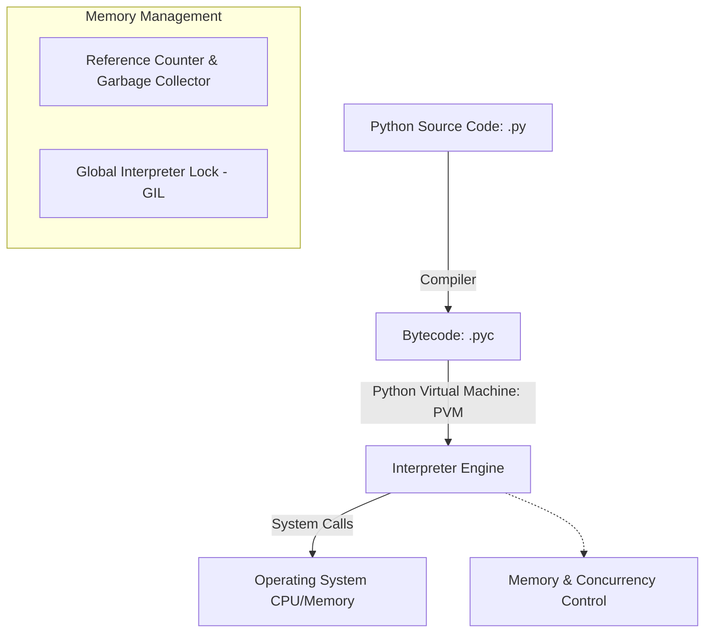

# Python Backend Engineering

Python is a dynamic, high-level, interpreted programming language known for its readability, expressive syntax, and robust ecosystem. In backend engineering, it powers APIs, data processing pipelines, and machine learning integrations.

## Installation & Downloads

To install Python on your machine:
1. Navigate to the [Official Python Downloads Page](https://www.python.org/downloads/).
2. Download the installer for your Operating System (Windows, macOS, or Linux).
3. Run the installer and **check the box "Add Python to PATH"** before clicking Install.
4. Verify the installation by running:
   ```bash
   python --version
   ```

### Official Download Portal


---

## 1. Python Execution & Memory Model



### Key Execution Architecture:
* **Bytecode Compilation**: Python source code (`.py`) is compiled into intermediate bytecode (`.pyc`) before execution.
* **Global Interpreter Lock (GIL)**: A mutex that protects access to Python objects, preventing multiple native threads from executing Python bytecodes at once. For multi-core processing, developers use multiprocessing instead of multithreading.
* **Garbage Collection**: Python manages memory automatically using **reference counting** combined with a generational garbage collector to resolve reference cycles.

---

## 2. Core Data Structures: Lists, Tuples, Dictionaries, Sets

| Structure | Syntax | Mutable? | Ordered? | Access Complexity | Typical Use Case |
| :--- | :--- | :--- | :--- | :--- | :--- |
| **List** | `[1, 2, 3]` | Yes | Yes | $O(1)$ indexing, $O(n)$ search | Storing collections of elements to modify dynamically. |
| **Tuple** | `(1, 2, 3)` | No | Yes | $O(1)$ indexing, $O(n)$ search | Heterogeneous records, dictionary keys, data integrity. |
| **Dictionary** | `{"key": "val"}`| Yes | Yes (3.7+) | $O(1)$ average lookup | Key-value store, caching, JSON payloads mapping. |
| **Set** | `{1, 2, 3}` | Yes | No | $O(1)$ average lookup | Deduplication, membership tests, mathematical set algebra. |

### Code Demonstration:
```python
# 1. List Comprehensions and Slicing
numbers = [x for x in range(10)]
evens = numbers[::2]  # Slice: start to end with step 2

# 2. Tuples as Read-Only Database Records
db_record = ("user_102", "john.doe@email.com", "Administrator")

# 3. Dictionary lookup optimization
user_permissions = {"admin": ["read", "write", "delete"], "guest": ["read"]}
guest_rights = user_permissions.get("guest", [])

# 4. Set Deduplication & Operations
allowed_ips = {"192.168.1.1", "10.0.0.1"}
request_ip = "192.168.1.1"
is_whitelisted = request_ip in allowed_ips  # O(1) time complexity
```

---

## 3. Advanced Features: Decorators & Generators

### Decorators (Metaprogramming)
Decorators wrap functions to extend or modify their behavior without editing their code directly. This is commonly used in backends for authorization, logging, and execution timing.

```python
import time
import functools

def execution_logger(func):
    @functools.wraps(func)
    def wrapper(*args, **kwargs):
        start_time = time.perf_counter()
        result = func(*args, **kwargs)
        end_time = time.perf_counter()
        print(f"Function {func.__name__} executed in {end_time - start_time:.4f} seconds.")
        return result
    return wrapper

@execution_logger
def process_database_query(query_id):
    # Simulate DB query delay
    time.sleep(0.5)
    return f"Result for query {query_id}"

# Execution
data = process_database_query(42)
```

### Generators (Memory Efficiency)
Generators yield values lazily using `yield`. Instead of loading a million records into memory at once, a generator streams them one-by-one.

```python
def stream_large_log_file(file_path):
    with open(file_path, "r") as file:
        for line in file:
            if "ERROR" in line:
                yield line.strip()

# Only processes lines on-demand, maintaining O(1) memory complexity
for error_log in stream_large_log_file("server.log"):
    print(f"Alert: {error_log}")
```

---

## 4. Standard Libraries for Web Engineering
* **`asyncio`**: Used to run concurrent I/O operations asynchronously using a single-threaded event loop.
* **`json` / `pydantic`**: Used to parse and validate incoming JSON request payloads.
* **`logging`**: Provides levels (`INFO`, `WARNING`, `ERROR`, `CRITICAL`) for audit trails.
* **`sys` / `os`**: Read environment configurations and container specifications.
