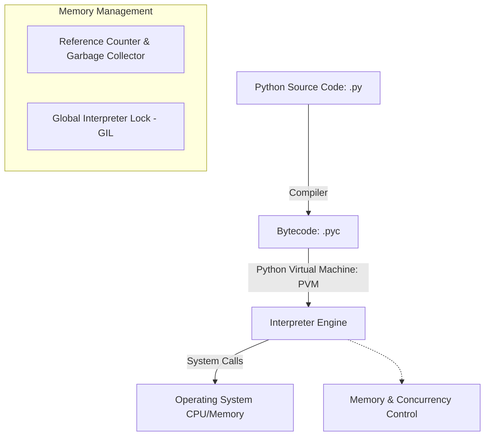

# Python Backend Engineering Master Guide

Python is a dynamic, high-level, interpreted programming language known for its readability, expressive syntax, and robust ecosystem. In backend engineering, it powers APIs, data processing pipelines, and agentic AI integrations.

---

## Installation & Downloads

To install Python on your machine:
1. Navigate to the [Official Python Downloads Page](https://www.python.org/downloads/).
2. Download the installer for your Operating System (Windows, macOS, or Linux).
3. Run the installer and **check the box "Add Python to PATH"** before clicking Install.
4. Verify the installation by running:
   ```bash
   python --version
   ```

### Official Download Portal


---

## 1. Phase 1: Beginner Fundamentals

### 1.1 Variables, Dynamic Typing, and Basic Types
Python is dynamically typed, meaning you do not need to declare a variable's type explicitly. Types are resolved at runtime.

* **Integers & Floats**: Representation of numeric values (`x = 42`, `y = 3.14`).
* **Strings**: Immutable sequence of Unicode characters (`name = "AuraDocs"`).
* **Booleans**: Logical values (`is_active = True`).

```python
# Variables and dynamic reassignment
data = 100        # Initially an integer
data = "Active"   # Reassigned to a string
print(f"Current state: {data} (Type: {type(data)})")
```

### Line-by-Line Code Explanation

- **`data = 100`**: Binds the variable `data` to an integer object.
- **`data = "Active"`**: Demonstrates dynamic typing by reassigning `data` to a string value.
- **`print(f"... {type(data)}")`**: Outputs the current value and displays the runtime class type using `type()`.

### 1.2 Operators
* **Arithmetic**: `+`, `-`, `*`, `/`, `//` (floor division), `%` (modulo), `**` (exponentiation).
* **Comparison**: `==`, `!=`, `>`, `<`, `>=`, `<=`.
* **Logical**: `and`, `or`, `not`.

### 1.3 Control Flow
Control flow structures direct the execution path of the application.

```python
# Conditional blocks
score = 85
if score >= 90:
    grade = "A"
elif score >= 80:
    grade = "B"
else:
    grade = "C"

# For loop iterating over a range
for i in range(3):
    print(f"Iteration {i}")

# For loop iterating over a list
frameworks = ["FastAPI", "Django", "Flask"]
for framework in frameworks:
    print(f"Web Framework: {framework}")

# For loop iterating over dictionary key-value pairs
user_roles = {"alice": "Admin", "bob": "Developer"}
for user, role in user_roles.items():
    print(f"User: {user}, Role: {role}")

# While loop
count = 3
while count > 0:
    print(f"Countdown: {count}")
    count -= 1

# Loop with an else block (unique Python feature)
# The else block executes only if the loop completes normally (without encountering break)
for num in range(3):
    if num == 5:
        break
else:
    print("Loop finished successfully without encountering break.")
```

### Line-by-Line Code Explanation

- **`if score >= 90 / elif score >= 80`**: Evaluates conditions sequentially to assign the correct grade value.
- **`for i in range(3)`**: Iterates over a sequence of integers from `0` to `2` generated by `range()`.
- **`for framework in frameworks`**: Loops through each element in the `frameworks` list.
- **`for user, role in user_roles.items()`**: Unpacks key-value tuples from the dictionary using `.items()`.
- **`while count > 0`**: Executes code block repeatedly as long as the condition evaluates to `True`.
- **`else:` (after `for` loop)**: Executes only if the loop completes fully without encountering a `break` statement.

### 1.4 Functions & Argument Passing
Functions are defined using the `def` keyword. Python supports positional arguments, keyword arguments, default values, and variable-length arguments (`*args`, `**kwargs`).

```python
def generate_user_profile(username, email, *roles, status="Active", **metadata):
    """
    Args:
        username (str): Position-based argument.
        email (str): Position-based argument.
        *roles: Variable positional arguments (tuples).
        status (str): Default keyword argument.
        **metadata: Variable keyword arguments (dictionary).
    """
    return {
        "username": username,
        "email": email,
        "roles": roles,
        "status": status,
        "extra_info": metadata
    }

# Invocation
profile = generate_user_profile(
    "dev_user", "dev@domain.com", "Admin", "Developer",
    status="Suspended", department="IT", location="US"
)
```

### Line-by-Line Code Explanation

- **`def generate_user_profile(...)`**: Defines a function with positional arguments, keyword arguments, and var-args.
- **`*roles`**: Captures any additional positional arguments as a tuple.
- **`status="Active"`**: Specifies a default keyword argument.
- **`**metadata`**: Captures any additional keyword arguments as a dictionary.

---

## 2. Phase 2: Intermediate Concepts

### 2.1 Core Data Structures

| Structure | Syntax | Mutable? | Ordered? | Access Complexity | Typical Use Case |
| :--- | :--- | :--- | :--- | :--- | :--- |
| **List** | `[1, 2, 3]` | Yes | Yes | $O(1)$ indexing, $O(n)$ search | Storing collections of elements to modify dynamically. |
| **Tuple** | `(1, 2, 3)` | No | Yes | $O(1)$ indexing, $O(n)$ search | Heterogeneous records, dictionary keys, data integrity. |
| **Dictionary** | `{"key": "val"}`| Yes | Yes (3.7+) | $O(1)$ average lookup | Key-value store, caching, JSON payloads mapping. |
| **Set** | `{1, 2, 3}` | Yes | No | $O(1)$ average lookup | Deduplication, membership tests, mathematical set algebra. |

```python
# List slicing and comprehensions
numbers = [x for x in range(10)]
evens = numbers[::2]  # Slice: start to end with step 2

# Dictionary lookup optimization
user_permissions = {"admin": ["read", "write", "delete"], "guest": ["read"]}
guest_rights = user_permissions.get("guest", [])  # Avoids KeyError
```

### Line-by-Line Code Explanation

- **`numbers = [x for x in range(10)]`**: Uses a list comprehension to dynamically construct a list of integers from `0` to `9`.
- **`evens = numbers[::2]`**: Slices the list from start to end with a step of `2` to extract even numbers.
- **`user_permissions.get("guest", [])`**: Accesses a dictionary value safely, returning a default empty list if the key is missing to avoid a `KeyError`.

### 2.2 Exception Handling
Robust error handling prevents unexpected application crashes. Use specific exception types rather than catching all base `Exception` instances.

```python
class DatabaseConnectionError(Exception):
    """Custom exception class for connection issues."""
    pass

def execute_query(conn_string):
    try:
        if not conn_string:
            raise DatabaseConnectionError("Invalid connection string parameters.")
        # Perform db queries...
        print("Query executed successfully.")
    except DatabaseConnectionError as db_err:
        print(f"Database Error: {db_err}")
    except Exception as err:
        print(f"Generic Failure: {err}")
    finally:
        print("Cleaning up database cursors and connections.")
```

### Line-by-Line Code Explanation

- **`class DatabaseConnectionError(Exception)`**: Declares a custom exception class by inheriting from `Exception`.
- **`try / except / finally`**: Sets up exception handling blocks to catch database errors and guarantee cleanup code runs in `finally`.
- **`raise DatabaseConnectionError(...)`**: Explicitly raises the custom exception.

### 2.3 Context Managers (`with` statement)
Context managers guarantee that setup and teardown tasks (like closing files or closing sockets) are executed, even if exceptions are raised.

```python
# Custom Context Manager using class syntax
class ManagedFile:
    def __init__(self, filename):
        self.filename = filename

    def __enter__(self):
        self.file = open(self.filename, 'r')
        return self.file

    def __exit__(self, exc_type, exc_val, exc_tb):
        if self.file:
            self.file.close()

# Usage
# with ManagedFile('data.txt') as f:
#     data = f.read()
```

### Line-by-Line Code Explanation

- **`__enter__()`**: Sets up resources (opens the file) when entering the `with` block context.
- **`__exit__()`**: Cleans up resources (closes the file) automatically when leaving the `with` block, even if an exception occurs.

---

## 3. Phase 3: Advanced Core Python

### 3.1 Execution & Memory Model



* **Bytecode Compilation**: Source code is compiled into bytecode (`.pyc`) stored in `__pycache__` directories.
* **Global Interpreter Lock (GIL)**: A mutex ensuring only one thread executes Python bytecode at a time, protecting internal reference counters.
* **Garbage Collection**: Reclaims memory using **reference counting** immediately when counters hit zero, backed by a generational collector to resolve cyclical dependencies.

### 3.2 Essential Python Decorators
Decorators wrap functions or classes to extend or modify their behavior. Here is an explanation of the most important decorators in the standard library:

#### 3.2.1 `@functools.wraps` (Metadata Preserver)
When wrapping a function inside a custom decorator, the original function's name and docstring are lost. `@functools.wraps` copies this metadata back to the wrapper.

```python
import functools

def my_decorator(func):
    @functools.wraps(func)  # Without this, help(say_hello) would output 'wrapper'
    def wrapper(*args, **kwargs):
        print("Before function call")
        return func(*args, **kwargs)
    return wrapper

@my_decorator
def say_hello():
    """Prints a friendly greeting."""
    print("Hello!")

print(say_hello.__name__)  # Prints: say_hello
print(say_hello.__doc__)   # Prints: Prints a friendly greeting.
```

### Line-by-Line Code Explanation

- **`@functools.wraps(func)`**: Retains the wrapped function's original name (`__name__`) and docstring (`__doc__`) in the decorated wrapper.

#### 3.2.2 `@property` (Encapsulation Getter/Setter)
Declares methods as getters, setters, or deleters, allowing properties to be accessed like variables while executing custom validation code.

```python
class TemperatureSensor:
    def __init__(self, celsius: float):
        self._celsius = celsius

    @property
    def fahrenheit(self) -> float:
        """Getter for fahrenheit."""
        return (self._celsius * 9/5) + 32

    @property
    def celsius(self) -> float:
        """Getter for celsius."""
        return self._celsius

    @celsius.setter
    def celsius(self, value: float):
        """Setter with validation."""
        if value < -273.15:
            raise ValueError("Temperature below absolute zero is impossible.")
        self._celsius = value
```

### Line-by-Line Code Explanation

- **`@property`**: Declares a method as a getter property so it can be accessed like a regular attribute.
- **`@celsius.setter`**: Decorates a setter method to validate and assign value changes to protected class properties.

#### 3.2.3 `@classmethod` vs `@staticmethod`
* **`@classmethod`**: Receives the class (`cls`) as the first argument. Used for factory patterns.
* **`@staticmethod`**: Receives no automatic arguments. Used for isolated helper functions.

```python
class User:
    def __init__(self, username, status):
        self.username = username
        self.status = status

    @classmethod
    def create_guest(cls, username):
        """Classmethod factory creating a guest user."""
        return cls(username, "Guest")

    @staticmethod
    def is_valid_username(name):
        """Helper method with no dependency on instance or class state."""
        return len(name) >= 3
```

### Line-by-Line Code Explanation

- **`@classmethod`**: Binds the method to the class (`cls`) rather than the instance, useful for alternative factory constructors.
- **`@staticmethod`**: Defines a utility function inside the class namespace that has no access to class or instance state.

#### 3.2.4 `@functools.lru_cache` (Memoization Caching)
Caches execution results of a function based on the arguments passed, dramatically speeding up recursive or expensive computation loops.

```python
from functools import lru_cache

@lru_cache(maxsize=128)
def fibonacci(n):
    if n < 2:
        return n
    return fibonacci(n-1) + fibonacci(n-2)
```

### Line-by-Line Code Explanation

- **`@lru_cache(maxsize=128)`**: Implements Least Recently Used caching to memoize function calls and accelerate recursive functions.

#### 3.2.5 `@contextmanager` (Generator Context Manager)
Allows creating context managers using a simple generator function, bypassing the need to write custom class blocks.

```python
from contextlib import contextmanager

@contextmanager
def db_transaction_scope():
    print("BEGIN TRANSACTION")
    try:
        yield
        print("COMMIT")
    except Exception:
        print("ROLLBACK")
        raise
```

### Line-by-Line Code Explanation

- **`@contextmanager`**: Uses generator semantics to implement a context manager without writing a full class definition.
- **`yield`**: Yields execution control back to the enclosed context block, returning to run post-yield cleanup afterwards.

### 3.3 Advanced Decorators in Modern AI: The `@tool` Decorator
In modern agentic frameworks (such as **LangChain** and **CrewAI**), the `@tool` decorator is a critical pattern. It transforms standard Python functions into structured tools that an agent can invoke, auto-generating the underlying JSON schemas from function signatures and docstrings.

```python
from langchain_core.tools import tool

@tool
def calculate_compound_interest(principal: float, rate: float, years: int) -> float:
    """
    Calculates the compound interest for a given principal, annual interest rate, and duration.
    
    Args:
        principal (float): The initial sum of money (e.g., 10000.0).
        rate (float): The annual interest rate as a decimal (e.g., 0.05 for 5%).
        years (int): The number of years the money is invested.
        
    Returns:
        float: The final balance after compound interest.
    """
    return principal * ((1 + rate) ** years)

# The agent parses the schema of this function to understand WHEN and HOW to call it:
print("Tool Name:", calculate_compound_interest.name)
print("Tool Description:", calculate_compound_interest.description)
print("Input Schema:", calculate_compound_interest.args)
```

### Line-by-Line Code Explanation

- **`@tool`**: Integrates a Python function as a tool for Agentic AI, auto-generating parameters schemas from signature types and docstrings.

### 3.4 Generators (Memory Efficiency)
Generators yield values lazily using `yield`. Instead of loading huge datasets into memory, generators stream them on-demand maintaining $O(1)$ memory complexity.

```python
def stream_large_log_file(file_path):
    with open(file_path, "r") as file:
        for line in file:
            if "ERROR" in line:
                yield line.strip()
```

### Line-by-Line Code Explanation

- **`yield`**: Lazily returns lines one-by-one from the file stream, avoiding loading the entire file into memory.

### 3.5 Advanced Object-Oriented Programming (OOP)
Python supports complex OOP patterns including multiple inheritance, dunder method hooks, properties, and name mangling.

```python
from abc import ABC, abstractmethod

class BaseService(ABC):
    @abstractmethod
    def execute(self, payload: dict) -> dict:
        pass

class LoggingMixIn:
    def log(self, message: str):
        print(f"[AUDIT LOG] {message}")

class BillingService(BaseService, LoggingMixIn):
    def __init__(self, stripe_key: str):
        self.public_key = "pk_live..."  # Public
        self._temp_session = None       # Protected
        self.__secret_key = stripe_key  # Private (Mangled to _BillingService__secret_key)

    @property
    def secret_key(self) -> str:
        raise AttributeError("Secret keys are write-only.")

    @secret_key.setter
    def secret_key(self, key: str):
        if not key.startswith("sk_"):
            raise ValueError("Invalid Stripe secret key prefix.")
        self.__secret_key = key

    def execute(self, payload: dict) -> dict:
        self.log(f"Executing payment charge...")
        return {"status": "success", "amount": payload.get("amount", 0)}

# Inspection of MRO (Method Resolution Order)
print(BillingService.__mro__)
```

### Line-by-Line Code Explanation

- **`@abstractmethod`**: Requires all inheriting subclasses to implement the decorated method.
- **`self.__secret_key`**: Triggers private name mangling, prepending the class name to the variable name (`_BillingService__secret_key`).
- **`BillingService.__mro__`**: Inspects the Method Resolution Order describing how Python resolves inheritance layers.

---

## 4. Phase 4: Concurrency & Parallelism

### 4.1 Asynchronous Programming (`asyncio`)
Async programming uses a single-threaded event loop to achieve high concurrency for I/O-bound operations.

```python
import asyncio

async def fetch_api_data(endpoint, delay):
    print(f"Fetching from {endpoint}...")
    await asyncio.sleep(delay)  # Non-blocking sleep
    print(f"Data received from {endpoint}")
    return {"endpoint": endpoint, "data": 200}

async def main():
    results = await asyncio.gather(
        fetch_api_data("users", 1.5),
        fetch_api_data("orders", 1.0),
        fetch_api_data("products", 0.5)
    )
    print(f"All operations complete: {len(results)} tasks.")
```

### Line-by-Line Code Explanation

- **`async def`**: Declares asynchronous functions that can run concurrently within the event loop.
- **`await asyncio.sleep()`**: Pauses execution without blocking the single event thread.
- **`await asyncio.gather(...)`**: Runs multiple asynchronous tasks concurrently and aggregates their results.

### 4.2 Multithreading vs. Multiprocessing
* **Multithreading (`threading`)**: Best for **I/O-bound tasks** (network calls, file input). Blocked by the GIL from speeding up CPU computations.
* **Multiprocessing (`multiprocessing`)**: Best for **CPU-bound tasks** (data processing, image compression). Spawns separate processes with their own memory space and Python interpreters, bypassing the GIL.

---

## 5. Phase 5: Python Library Ecosystem

### 5.1 Web & API Engines
Backend architectures rely on different web framework structures depending on scope and performance needs.

| Framework | Architecture | Async? | ORM Included? | Best For |
| :--- | :--- | :--- | :--- | :--- |
| **FastAPI** | ASGI Microframework | Native support | No | Fast microservices, real-time channels, OpenAI docs. |
| **Django** | WSGI / ASGI Monolith | Limited (added 3.0) | Yes (Django ORM) | Heavy applications, relational backends, admin dashboards. |
| **Flask** | WSGI Microframework | No | No | Small APIs, prototype applications, custom setups. |

#### FastAPI Code Structure
```python
from fastapi import FastAPI, Depends
from pydantic import BaseModel

app = FastAPI()

class UserPayload(BaseModel):
    username: str
    email: str

@app.post("/users")
async def create_user(payload: UserPayload):
    # Dynamic schema validation is handled by Pydantic
    return {"status": "success", "user": payload.username}
```

### Line-by-Line Code Explanation

- **`class UserPayload(BaseModel)`**: Extends Pydantic's `BaseModel` to configure strict JSON deserialization and schema validation.
- **`@app.post("/users")`**: Maps incoming HTTP POST requests to an asynchronous handler function.

### 5.2 Data Science & Machine Learning
* **`NumPy`**: Fundamental package for scientific computing with support for multi-dimensional arrays and matrix algebra.
* **`Pandas`**: Data manipulation library providing high-performance DataFrame objects.
* **`Scikit-Learn`**: Machine learning library for classification, regression, clustering, and data preprocessing.

```python
import numpy as np
import pandas as pd

# NumPy Vectorization
array = np.array([[1, 2], [3, 4]])
doubled = array * 2  # Vectorized operation

# Pandas Filtering
df = pd.DataFrame({
    "user_id": [101, 102, 103],
    "balance": [1200.0, 80.0, 500.0]
})
premium_users = df[df["balance"] > 100.0]  # Fast vector boolean filtering
```

### Line-by-Line Code Explanation

- **`array * 2`**: Demonstrates NumPy vectorization, multiplying all values inside the matrix without loops.
- **`df[df["balance"] > 100.0]`**: Performs quick boolean indexing vector filtering on a Pandas DataFrame.

### 5.3 Utility & Database Clients
* **`Pydantic`**: Data validation and settings management using Python type annotations.
* **`SQLAlchemy`**: SQL Toolkit and Object-Relational Mapper (ORM) providing powerful database operations.
* **`Requests` / `HTTPX`**: Standard HTTP clients for executing remote API requests.

```python
from pydantic import BaseModel, EmailStr, field_validator

class UserCreate(BaseModel):
    username: str
    email: EmailStr
    age: int

    @field_validator("age")
    @classmethod
    def validate_age(cls, value: int):
        if value < 18:
            raise ValueError("User must be an adult.")
        return value
```

### Line-by-Line Code Explanation

- **`@field_validator("age")`**: Triggers a custom validation check on specified model properties before data parsing completes.

### 5.4 LLM & Agentic AI
Libraries to orchestrate Large Language Models (LLMs) and autonomous agent workflows.

* **`LangChain`**: Standard framework for chains, prompts, vector indexes, and agentic workflows.
* **`CrewAI`**: Framework for orchestrating teams of role-playing, autonomous AI agents.

```python
# CrewAI Agent Orchestration Configuration
from crewai import Agent, Task, Crew, Process

# Define a researcher agent
researcher = Agent(
    role="Senior Research Analyst",
    goal="Extract technical installation steps for technologies",
    backstory="You are an expert technical writer and sysadmin.",
    verbose=True,
    memory=True
)

# Define task
task = Task(
    description="Document pgAdmin installation requirements.",
    expected_output="A markdown table detailing installation steps.",
    agent=researcher
)

# Assemble Crew
crew = Crew(
    agents=[researcher],
    tasks=[task],
    process=Process.sequential
)
```

### Line-by-Line Code Explanation

- **`Agent(...)`**: Configures an autonomous crew agent with specific roles, goals, and backstories.
- **`Task(...)`**: Sets requirements, expected outputs, and links them to the assigned agent.
- **`Crew(...)`**: Coordinates agents and tasks into a sequential execution workflow.

# Python for AI Agents (Beginner to Advanced)

## Why Python is the Language of AI

Python is the standard language of AI and Agentic development. While other languages offer high execution speed (like C++ or Rust) or native web integration (like JavaScript), Python strikes a balance that makes it irreplaceable:

<InfoCard title="Ecosystem Domination">
Python hosts the entire machine learning and LLM stack (PyTorch, Hugging Face, LangChain, Pydantic, Boto3, FastAPI).
</InfoCard>

<InfoCard title="Syntax Simplicity">
AI development is highly iterative. Writing prompts, parsing schemas, and routing logic must be written and tested rapidly. Python's clean syntax allows developers to write code that reads like pseudo-code.
</InfoCard>

<InfoCard title="C-Bindings Performance">
Heavy calculations (such as tensor math, matrix multiplications, or vector similarity computations) are executed in high-performance C/C++ backends under the hood. Python acts as a developer-friendly glue layer.
</InfoCard>

<InfoCard title="First-Class Framework Support">
Modern agent runtimes (such as Amazon Bedrock AgentCore and Strands) are built from the ground up to consume and execute Python functions natively inside virtualized environments.
</InfoCard>

---

## Python Concepts Needed for AI Agents

### Variables
<ProgressTracker currentSection={1} totalSections={26} />

<InfoCard title="Concept Overview">
Variables are labels bound to memory locations containing values. Python uses dynamic typing, meaning variable types are resolved at runtime rather than compile-time.

**Why do we need it?**
In AI agents, variables are used to track conversational context, extract model payloads, hold active session IDs, and configure prompt parameters.
</InfoCard>

<Tabs>
  <Tab label="Syntax & Example">

```python
variable_name = value
```

```python
prompt_input = "Search for AWS Bedrock pricing"
session_ttl_seconds = 28800
```

  </Tab>
  <Tab label="Interactive Playground">
    <InteractiveExample 
      initialCode="prompt_input = \"Search for AWS Bedrock pricing\"\nsession_ttl_seconds = 28800\nprint(f'Prompt: {prompt_input}')\nprint(f'Session TTL: {session_ttl_seconds}s')" 
      instruction="Run this interactive python example and see the console output."
    />
  </Tab>

  <Tab label="Advanced Playground">
    <InteractiveExample 
      language="python"
      initialCode="import json\n# Simulating dynamic parsing and reassignment of dynamic parameters in an agent tool call\nraw_payload = '{\"agent_name\": \"Auditor\", \"token_limit\": 4096}'\nconfig = json.loads(raw_payload)\n# Reassign and cast dynamically\nconfig[\"token_limit\"] = int(config[\"token_limit\"])\nprint(f\"Agent: {config['agent_name']} (Tokens: {config['token_limit']})\")" 
      instruction="Run this advanced example showing dynamic reassignment and type casting of JSON payloads in LLM tool outputs."
    />
  </Tab>
</Tabs>

<InfoCard title="AI Agent Integration">
In `ep01_simple_agent.py` line 20-21, variables are extracted dynamically from payload and context parameters:
```python
prompt = payload.get("prompt", "")
session_id = getattr(context, "session_id", "local-session-123")
```
</InfoCard>

<Tip>
- Use snake_case for variable names.
- Keep variable scopes as localized as possible.
- Use constants (uppercase) for configurations that shouldn't change.
</Tip>

<Warning>
- Reusing global variables inside functions without specifying `global`, which can lead to reference bugs.
- Variable shadow/collisions (e.g. naming a variable `list` or `dict`, overriding Python built-ins).
</Warning>


<Quiz 
  question="Which of the following describes the core runtime mechanism of variable references in Python?" 
  options=["It is executed as a compiled static element in memory.", "It is dynamically resolved and managed by the interpreter at runtime.", "It requires strict binary compilation before script execution.", "It is processed as a separate hardware thread on host multi-core CPUs."] 
  answerIndex=1 
  explanation="In Python, variable references is dynamically resolved and managed by the interpreter at runtime, providing flexible executions." 
/>
<Quiz 
  question="What is a primary performance consideration when managing variable references under heavy workload?" 
  options=["The potential for name shadowing or global scope pollution.", "Hardware level cache thrashing of CPU execution stacks.", "AuraDocs compiler failure due to long function lines.", "Mandatory thread sleep intervals imposed by the OS kernel."] 
  answerIndex=0 
  explanation="A major performance hazard for variable references is name shadowing or global scope pollution, which developers must mitigate." 
/>
<Quiz 
  question="How does CPython internally manage the memory lifecycle of variable references?" 
  options=["It allocates memory directly on the hardware stack without reference counters.", "It uses reference counting and pointer binding to track and free objects.", "It delegates all memory cleanups to external system databases.", "It persists objects indefinitely until the machine is rebooted."] 
  answerIndex=1 
  explanation="CPython manages the memory lifecycle of variable references using reference counting and pointer binding." 
/>
<Quiz 
  question="Which of the following is a recommended best practice for implementing variable references in production?" 
  options=["Avoiding typing annotations entirely to speed up loading.", "Hardcoding values to save database lookup times.", "Practicing using uppercase for constants and snake_case for local variables.", "Declaring all variables in the global namespace."] 
  answerIndex=2 
  explanation="Production codebases should adhere to best practices like using uppercase for constants and snake_case for local variables." 
/>
<Quiz 
  question="When debugging a runtime issue with variable references, which of the following is most effective?" 
  options=["By inspecting locals() or using pdb.", "Recompiling the Python interpreter source code.", "Manually resetting the CPU execution registers.", "Ignoring exception tracebacks and running scripts again."] 
  answerIndex=0 
  explanation="Problems with variable references are best diagnosed by inspecting locals() or using pdb." 
/>
<Quiz 
  question="How is the visibility and scope of variable references resolved?" 
  options=["It is visible globally across all running OS processes.", "It is governed by local vs global scope rules.", "It is restricted by physical network router locations.", "It can only be resolved inside class constructors."] 
  answerIndex=1 
  explanation="The scope of variable references is governed by local vs global scope rules." 
/>
<Quiz 
  question="In concurrent Python environments, what is a primary concern with variable references?" 
  options=["OS threads are automatically killed by the interpreter.", "The Global Interpreter Lock is disabled completely.", "The potential for race conditions during concurrent reassignments.", "Synchronous database queries are executed in parallel."] 
  answerIndex=2 
  explanation="Under concurrency, developers must prevent race conditions during concurrent reassignments associated with variable references." 
/>
<Quiz 
  question="How does typing affect the validation of variable references?" 
  options=["It allows static validation and clean runtime specifications such as dynamic runtime assignment of object labels.", "It forces static compilation and completely removes dynamic capabilities.", "It converts Python source code into machine binary on compilation.", "It requires developers to write custom C extensions for all models."] 
  answerIndex=0 
  explanation="Typing provides validation and documentation for variable references through dynamic runtime assignment of object labels." 
/>
<Quiz 
  question="At the CPython interpreter level, how is variable references represented?" 
  options=["As a temporary text file created in the system temp directory.", "As a hardware register mapping on the local CPU.", "As a compiled binary object stored in the virtual environment.", "As a PyObject structs pointing to values on the heap."] 
  answerIndex=3 
  explanation="CPython manages variable references as a PyObject structs pointing to values on the heap." 
/>
<Quiz 
  question="Why is variable references critical when designing tools and memory for AI Agents?" 
  options=["It allows dynamic state tracking and parameter storage.", "It bypasses the need for large language model processing.", "It converts prompt text files directly into machine execution instructions.", "It locks the agent system and prevents unauthorized external connections."] 
  answerIndex=0 
  explanation="In agent systems, variable references enables dynamic state tracking and parameter storage." 
/>
<Quiz 
  question="Which design pattern is most closely associated with the usage of variable references?" 
  options=["Singleton pattern only.", "The Active Record database schema.", "Patterns targeting binding labels to state representations.", "Using global dictionaries for all configurations."] 
  answerIndex=2 
  explanation="Design patterns utilizing variable references target binding labels to state representations." 
/>
<Quiz 
  question="How are exceptions handled when raised within the context of variable references?" 
  options=["By raising NameError when resolving unbound labels.", "The interpreter immediately terminates and formats the host disk.", "Exceptions are silently ignored and execution proceeds normally.", "The system prompts the user via a terminal command loop."] 
  answerIndex=0 
  explanation="Exceptions inside variable references must be handled by raising NameError when resolving unbound labels." 
/>
<Quiz 
  question="What occurs during the compilation phase versus the execution phase for variable references?" 
  options=["All variables are statically resolved and compiled into assembly.", "Code is executed directly without compilation.", "Python performs binding local offsets in code objects vs runtime dictionary lookup before execution.", "The compiler verifies network database connections."] 
  answerIndex=2 
  explanation="Python performs binding local offsets in code objects vs runtime dictionary lookup during compilation before execution." 
/>
<Quiz 
  question="What is a potential security hazard associated with variable references?" 
  options=["The risk of unintentional leakage of sensitive variable names in logs.", "The compiler running in parallel without system privileges.", "Malicious users modifying memory cache values via network queries.", "Implicit file descriptor allocations causing memory leakage."] 
  answerIndex=0 
  explanation="Security considerations for variable references include preventing unintentional leakage of sensitive variable names in logs." 
/>
<Quiz 
  question="How is variable references serialization managed in production environments?" 
  options=["Objects are converted directly to binary machine code.", "All variables are saved in standard global configurations.", "By pickling references vs actual value copies.", "Serialization is not supported for any Python elements."] 
  answerIndex=2 
  explanation="Serialization is managed by pickling references vs actual value copies." 
/>
<Quiz 
  question="What is the most effective testing strategy for code blocks implementing variable references?" 
  options=["By mocking variables or global states.", "Deploying code directly to production and checking logs.", "Running tests in parallel without virtual environment isolations.", "Skipping test suites entirely if the code compiles."] 
  answerIndex=0 
  explanation="Reliable testing for variable references is achieved by mocking variables or global states." 
/>
<Quiz 
  question="What occurs when you subclass or extend the default behaviors of variable references?" 
  options=["The compiler raises a static verification error.", "You can customize attributes and scopes, taking care of shadowing attributes in subclass scopes.", "All properties are immediately reset to default values.", "The virtual machine enforces strict private accessibility rules."] 
  answerIndex=1 
  explanation="Subclassing allows customization while maintaining shadowing attributes in subclass scopes." 
/>
<Quiz 
  question="Which standard library module is most helpful when working with variable references operations?" 
  options=["The low level socket library.", "The default json file parser.", "The os and sys variables handlers.", "The sys and gc modules for reference analysis."] 
  answerIndex=3 
  explanation="The Python standard library provides sys and gc modules for reference analysis for advanced operations." 
/>
<Quiz 
  question="How does the import system resolve dependency hierarchies of variable references?" 
  options=["By modifying imported module-level variables.", "By compiling all modules into a single execution binary.", "By querying online package indices dynamically during import.", "By loading files in random order to speed up execution."] 
  answerIndex=0 
  explanation="The import system resolves dependencies by modifying imported module-level variables." 
/>
<Quiz 
  question="Which of the following is a known limitation of variable references in modern Python?" 
  options=["It cannot be run on multi-core processors.", "It requires manual garbage collection code from the developer.", "Limitations like lack of constants/read-only variables in native syntax.", "It is disabled by default in Python 3.x."] 
  answerIndex=2 
  explanation="Limitations include lack of constants/read-only variables in native syntax." 
/>
<InterviewQuestions>
  <InterviewQuestion q="What does dynamic typing mean in Python, and how does Python manage object references?" a="Dynamic typing means variables do not have static types; they point to objects in memory that have types. When you assign `x = 10` and then `x = \"text\"`, Python simply rebinds the label `x` from an integer object to a string object, updating the reference count of each object." />
</InterviewQuestions>

### Functions
<ProgressTracker currentSection={2} totalSections={26} />

<InfoCard title="Concept Overview">
Functions are reusable blocks of code that execute a specific action. Python support variable arguments (*args, **kwargs), default parameters, and first-class function objects.

**Why do we need it?**
AI Agent tools are registered as Python functions. LLM frameworks inspect function signatures and docstrings to generate JSON schemas.
</InfoCard>

<Tabs>
  <Tab label="Syntax & Example">

```python
def function_name(param1, param2=default_val, *args, **kwargs):
    return result
```

```python
def generate_prompt(task, context=""):
    return f"Task: {task}\nContext: {context}"
```

  </Tab>
  <Tab label="Interactive Playground">
    <InteractiveExample 
      initialCode="def generate_prompt(task, context=\"\"):\n    return f\"Task: {task}\\nContext: {context}\"\n\nprint(generate_prompt(\"Summarize logs\", \"Error at 12:00\"))" 
      instruction="Run this interactive python example and see the console output."
    />
  </Tab>

  <Tab label="Advanced Playground">
    <InteractiveExample 
      language="python"
      initialCode="def execute_agent_tool(tool_func, *args, **kwargs):\n    # Dynamically unpack and execute a tool with arbitrary positional and keyword arguments\n    print(f\"Invoking {tool_func.__name__}...\")\n    return tool_func(*args, **kwargs)\n\ndef get_user(id, role=\"Guest\"):\n    return {\"id\": id, \"role\": role}\n\nres = execute_agent_tool(get_user, \"usr_99\", role=\"Admin\")\nprint(res)" 
      instruction="Run this advanced example executing a tool with dynamic parameter unpacking using *args and **kwargs."
    />
  </Tab>
</Tabs>

<InfoCard title="AI Agent Integration">
In `ep01_simple_agent.py` line 34, functions define tools that agents can run:
```python
def get_user_details(user_id: str) -> dict:
    return {"user_id": user_id, "role": "developer"}
```
</InfoCard>

<Tip>
- Define explicit parameter names and use docstrings for LLM tool binding.
- Avoid mutable default arguments like `list` or `dict`.
</Tip>

<Warning>
- Using `history=[]` as a default argument. Python instantiates mutable default parameters once, causing state leak between function calls.
</Warning>


<Quiz 
  question="Which of the following describes the core runtime mechanism of functions in Python?" 
  options=["It is executed as a compiled static element in memory.", "It is dynamically resolved and managed by the interpreter at runtime.", "It requires strict binary compilation before script execution.", "It is processed as a separate hardware thread on host multi-core CPUs."] 
  answerIndex=1 
  explanation="In Python, functions is dynamically resolved and managed by the interpreter at runtime, providing flexible executions." 
/>
<Quiz 
  question="What is a primary performance consideration when managing functions under heavy workload?" 
  options=["The potential for using mutable default parameters.", "Hardware level cache thrashing of CPU execution stacks.", "AuraDocs compiler failure due to long function lines.", "Mandatory thread sleep intervals imposed by the OS kernel."] 
  answerIndex=0 
  explanation="A major performance hazard for functions is using mutable default parameters, which developers must mitigate." 
/>
<Quiz 
  question="How does CPython internally manage the memory lifecycle of functions?" 
  options=["It allocates memory directly on the hardware stack without reference counters.", "It uses frame execution stack and closure cells to track and free objects.", "It delegates all memory cleanups to external system databases.", "It persists objects indefinitely until the machine is rebooted."] 
  answerIndex=1 
  explanation="CPython manages the memory lifecycle of functions using frame execution stack and closure cells." 
/>
<Quiz 
  question="Which of the following is a recommended best practice for implementing functions in production?" 
  options=["Avoiding typing annotations entirely to speed up loading.", "Hardcoding values to save database lookup times.", "Practicing type annotating signatures and keeping functions small.", "Declaring all variables in the global namespace."] 
  answerIndex=2 
  explanation="Production codebases should adhere to best practices like type annotating signatures and keeping functions small." 
/>
<Quiz 
  question="When debugging a runtime issue with functions, which of the following is most effective?" 
  options=["By stack trace analysis and tracebacks.", "Recompiling the Python interpreter source code.", "Manually resetting the CPU execution registers.", "Ignoring exception tracebacks and running scripts again."] 
  answerIndex=0 
  explanation="Problems with functions are best diagnosed by stack trace analysis and tracebacks." 
/>
<Quiz 
  question="How is the visibility and scope of functions resolved?" 
  options=["It is visible globally across all running OS processes.", "It is governed by LEGB (Local, Enclosing, Global, Built-in) scope rules.", "It is restricted by physical network router locations.", "It can only be resolved inside class constructors."] 
  answerIndex=1 
  explanation="The scope of functions is governed by LEGB (Local, Enclosing, Global, Built-in) scope rules." 
/>
<Quiz 
  question="In concurrent Python environments, what is a primary concern with functions?" 
  options=["OS threads are automatically killed by the interpreter.", "The Global Interpreter Lock is disabled completely.", "The potential for sharing non-thread-safe variables across function calls.", "Synchronous database queries are executed in parallel."] 
  answerIndex=2 
  explanation="Under concurrency, developers must prevent sharing non-thread-safe variables across function calls associated with functions." 
/>
<Quiz 
  question="How does typing affect the validation of functions?" 
  options=["It allows static validation and clean runtime specifications such as Callable type signatures and runtime checks.", "It forces static compilation and completely removes dynamic capabilities.", "It converts Python source code into machine binary on compilation.", "It requires developers to write custom C extensions for all models."] 
  answerIndex=0 
  explanation="Typing provides validation and documentation for functions through Callable type signatures and runtime checks." 
/>
<Quiz 
  question="At the CPython interpreter level, how is functions represented?" 
  options=["As a temporary text file created in the system temp directory.", "As a hardware register mapping on the local CPU.", "As a compiled binary object stored in the virtual environment.", "As a PyFunctionObject structs created during definition."] 
  answerIndex=3 
  explanation="CPython manages functions as a PyFunctionObject structs created during definition." 
/>
<Quiz 
  question="Why is functions critical when designing tools and memory for AI Agents?" 
  options=["It allows defining LLM tools and custom handlers.", "It bypasses the need for large language model processing.", "It converts prompt text files directly into machine execution instructions.", "It locks the agent system and prevents unauthorized external connections."] 
  answerIndex=0 
  explanation="In agent systems, functions enables defining LLM tools and custom handlers." 
/>
<Quiz 
  question="Which design pattern is most closely associated with the usage of functions?" 
  options=["Singleton pattern only.", "The Active Record database schema.", "Patterns targeting first-class function objects and callbacks.", "Using global dictionaries for all configurations."] 
  answerIndex=2 
  explanation="Design patterns utilizing functions target first-class function objects and callbacks." 
/>
<Quiz 
  question="How are exceptions handled when raised within the context of functions?" 
  options=["By unhandled exceptions unwinding the call stack.", "The interpreter immediately terminates and formats the host disk.", "Exceptions are silently ignored and execution proceeds normally.", "The system prompts the user via a terminal command loop."] 
  answerIndex=0 
  explanation="Exceptions inside functions must be handled by unhandled exceptions unwinding the call stack." 
/>
<Quiz 
  question="What occurs during the compilation phase versus the execution phase for functions?" 
  options=["All variables are statically resolved and compiled into assembly.", "Code is executed directly without compilation.", "Python performs bytecode generation for code objects versus runtime stack execution before execution.", "The compiler verifies network database connections."] 
  answerIndex=2 
  explanation="Python performs bytecode generation for code objects versus runtime stack execution during compilation before execution." 
/>
<Quiz 
  question="What is a potential security hazard associated with functions?" 
  options=["The risk of arbitrary execution via eval() or exec() inside functions.", "The compiler running in parallel without system privileges.", "Malicious users modifying memory cache values via network queries.", "Implicit file descriptor allocations causing memory leakage."] 
  answerIndex=0 
  explanation="Security considerations for functions include preventing arbitrary execution via eval() or exec() inside functions." 
/>
<Quiz 
  question="How is functions serialization managed in production environments?" 
  options=["Objects are converted directly to binary machine code.", "All variables are saved in standard global configurations.", "By pickling functions using external libraries like dill.", "Serialization is not supported for any Python elements."] 
  answerIndex=2 
  explanation="Serialization is managed by pickling functions using external libraries like dill." 
/>
<Quiz 
  question="What is the most effective testing strategy for code blocks implementing functions?" 
  options=["By writing unit tests using pytest parameterization.", "Deploying code directly to production and checking logs.", "Running tests in parallel without virtual environment isolations.", "Skipping test suites entirely if the code compiles."] 
  answerIndex=0 
  explanation="Reliable testing for functions is achieved by writing unit tests using pytest parameterization." 
/>
<Quiz 
  question="What occurs when you subclass or extend the default behaviors of functions?" 
  options=["The compiler raises a static verification error.", "You can customize attributes and scopes, taking care of overriding instance methods and using super().", "All properties are immediately reset to default values.", "The virtual machine enforces strict private accessibility rules."] 
  answerIndex=1 
  explanation="Subclassing allows customization while maintaining overriding instance methods and using super()." 
/>
<Quiz 
  question="Which standard library module is most helpful when working with functions operations?" 
  options=["The low level socket library.", "The default json file parser.", "The os and sys variables handlers.", "The functools and inspect modules for metadata reflection."] 
  answerIndex=3 
  explanation="The Python standard library provides functools and inspect modules for metadata reflection for advanced operations." 
/>
<Quiz 
  question="How does the import system resolve dependency hierarchies of functions?" 
  options=["By importing functions and executing them in different contexts.", "By compiling all modules into a single execution binary.", "By querying online package indices dynamically during import.", "By loading files in random order to speed up execution."] 
  answerIndex=0 
  explanation="The import system resolves dependencies by importing functions and executing them in different contexts." 
/>
<Quiz 
  question="Which of the following is a known limitation of functions in modern Python?" 
  options=["It cannot be run on multi-core processors.", "It requires manual garbage collection code from the developer.", "Limitations like limited anonymous functions (lambdas must be single expressions).", "It is disabled by default in Python 3.x."] 
  answerIndex=2 
  explanation="Limitations include limited anonymous functions (lambdas must be single expressions)." 
/>
<InterviewQuestions>
  <InterviewQuestion q="Why are mutable default arguments dangerous in Python?" a="Mutable defaults are evaluated once at function definition time. Subsequent calls modify the same object, leaking state." />
</InterviewQuestions>

### Classes
<ProgressTracker currentSection={3} totalSections={26} />

<InfoCard title="Concept Overview">
Classes are blueprints for creating objects. They bundle data (attributes) and behavior (methods) together.

**Why do we need it?**
Agents maintain memory, state, client sessions, and tools inside structured class instances.
</InfoCard>

<Tabs>
  <Tab label="Syntax & Example">

```python
class Agent:
    def __init__(self, name):
        self.name = name
```

```python
class Memory:
    def __init__(self):
        self.history = []
    def add(self, msg):
        self.history.append(msg)
```

  </Tab>
  <Tab label="Interactive Playground">
    <InteractiveExample 
      initialCode="class Memory:\n    def __init__(self):\n        self.history = []\n    def add(self, msg):\n        self.history.append(msg)\n\nmem = Memory()\nmem.add(\"Hello agent\")\nprint(mem.history)" 
      instruction="Run this interactive python example and see the console output."
    />
  </Tab>

  <Tab label="Advanced Playground">
    <InteractiveExample 
      language="python"
      initialCode="class AgentMemory:\n    # Class variable sharing a max limit across all agent instances\n    GLOBAL_MAX_HISTORY = 100\n\n    def __init__(self, agent_id):\n        self.agent_id = agent_id  # Instance variable\n        self.history = []\n\n    def record(self, message):\n        if len(self.history) < self.GLOBAL_MAX_HISTORY:\n            self.history.append(message)\n\nm1 = AgentMemory(\"Agent_A\")\nm1.record(\"Hello\")\nprint(f\"Memory length: {len(m1.history)}\")" 
      instruction="Run this example demonstrating the difference between class variables and instance variables in agent memory class setups."
    />
  </Tab>
</Tabs>

<InfoCard title="AI Agent Integration">
In `ep02_production_supervisor.py` line 12, agents are defined as classes inheriting from a base Agent:
```python
class SupervisorAgent(BaseAgent):
    def __init__(self, team_members):
        super().__init__("Supervisor")
        self.team = team_members
```
</InfoCard>

<Tip>
- Always initialize attributes inside `__init__`.
- Keep class responsibilities single and focused.
</Tip>

<Warning>
- Defining instance variables as class variables, sharing state across all instances accidentally.
</Warning>


<Quiz 
  question="Which of the following describes the core runtime mechanism of classes in Python?" 
  options=["It is executed as a compiled static element in memory.", "It is dynamically resolved and managed by the interpreter at runtime.", "It requires strict binary compilation before script execution.", "It is processed as a separate hardware thread on host multi-core CPUs."] 
  answerIndex=1 
  explanation="In Python, classes is dynamically resolved and managed by the interpreter at runtime, providing flexible executions." 
/>
<Quiz 
  question="What is a primary performance consideration when managing classes under heavy workload?" 
  options=["The potential for mutable class-level variables shared across instances.", "Hardware level cache thrashing of CPU execution stacks.", "AuraDocs compiler failure due to long function lines.", "Mandatory thread sleep intervals imposed by the OS kernel."] 
  answerIndex=0 
  explanation="A major performance hazard for classes is mutable class-level variables shared across instances, which developers must mitigate." 
/>
<Quiz 
  question="How does CPython internally manage the memory lifecycle of classes?" 
  options=["It allocates memory directly on the hardware stack without reference counters.", "It uses class dictionaries (__dict__) and descriptor protocols to track and free objects.", "It delegates all memory cleanups to external system databases.", "It persists objects indefinitely until the machine is rebooted."] 
  answerIndex=1 
  explanation="CPython manages the memory lifecycle of classes using class dictionaries (__dict__) and descriptor protocols." 
/>
<Quiz 
  question="Which of the following is a recommended best practice for implementing classes in production?" 
  options=["Avoiding typing annotations entirely to speed up loading.", "Hardcoding values to save database lookup times.", "Practicing initializing all instance variables within __init__.", "Declaring all variables in the global namespace."] 
  answerIndex=2 
  explanation="Production codebases should adhere to best practices like initializing all instance variables within __init__." 
/>
<Quiz 
  question="When debugging a runtime issue with classes, which of the following is most effective?" 
  options=["By inspecting __dict__ and dir().", "Recompiling the Python interpreter source code.", "Manually resetting the CPU execution registers.", "Ignoring exception tracebacks and running scripts again."] 
  answerIndex=0 
  explanation="Problems with classes are best diagnosed by inspecting __dict__ and dir()." 
/>
<Quiz 
  question="How is the visibility and scope of classes resolved?" 
  options=["It is visible globally across all running OS processes.", "It is governed by private name mangling with double underscores.", "It is restricted by physical network router locations.", "It can only be resolved inside class constructors."] 
  answerIndex=1 
  explanation="The scope of classes is governed by private name mangling with double underscores." 
/>
<Quiz 
  question="In concurrent Python environments, what is a primary concern with classes?" 
  options=["OS threads are automatically killed by the interpreter.", "The Global Interpreter Lock is disabled completely.", "The potential for race conditions on shared class attributes.", "Synchronous database queries are executed in parallel."] 
  answerIndex=2 
  explanation="Under concurrency, developers must prevent race conditions on shared class attributes associated with classes." 
/>
<Quiz 
  question="How does typing affect the validation of classes?" 
  options=["It allows static validation and clean runtime specifications such as type hints for self and Type[Self].", "It forces static compilation and completely removes dynamic capabilities.", "It converts Python source code into machine binary on compilation.", "It requires developers to write custom C extensions for all models."] 
  answerIndex=0 
  explanation="Typing provides validation and documentation for classes through type hints for self and Type[Self]." 
/>
<Quiz 
  question="At the CPython interpreter level, how is classes represented?" 
  options=["As a temporary text file created in the system temp directory.", "As a hardware register mapping on the local CPU.", "As a compiled binary object stored in the virtual environment.", "As a PyTypeObject metadata and attribute lookups."] 
  answerIndex=3 
  explanation="CPython manages classes as a PyTypeObject metadata and attribute lookups." 
/>
<Quiz 
  question="Why is classes critical when designing tools and memory for AI Agents?" 
  options=["It allows encapsulating agent memory and tool registrations.", "It bypasses the need for large language model processing.", "It converts prompt text files directly into machine execution instructions.", "It locks the agent system and prevents unauthorized external connections."] 
  answerIndex=0 
  explanation="In agent systems, classes enables encapsulating agent memory and tool registrations." 
/>
<Quiz 
  question="Which design pattern is most closely associated with the usage of classes?" 
  options=["Singleton pattern only.", "The Active Record database schema.", "Patterns targeting factory patterns and object constructors.", "Using global dictionaries for all configurations."] 
  answerIndex=2 
  explanation="Design patterns utilizing classes target factory patterns and object constructors." 
/>
<Quiz 
  question="How are exceptions handled when raised within the context of classes?" 
  options=["By AttributeError during invalid property access.", "The interpreter immediately terminates and formats the host disk.", "Exceptions are silently ignored and execution proceeds normally.", "The system prompts the user via a terminal command loop."] 
  answerIndex=0 
  explanation="Exceptions inside classes must be handled by AttributeError during invalid property access." 
/>
<Quiz 
  question="What occurs during the compilation phase versus the execution phase for classes?" 
  options=["All variables are statically resolved and compiled into assembly.", "Code is executed directly without compilation.", "Python performs class namespace execution vs instantiation before execution.", "The compiler verifies network database connections."] 
  answerIndex=2 
  explanation="Python performs class namespace execution vs instantiation during compilation before execution." 
/>
<Quiz 
  question="What is a potential security hazard associated with classes?" 
  options=["The risk of malicious class injection via unsafe deserialization.", "The compiler running in parallel without system privileges.", "Malicious users modifying memory cache values via network queries.", "Implicit file descriptor allocations causing memory leakage."] 
  answerIndex=0 
  explanation="Security considerations for classes include preventing malicious class injection via unsafe deserialization." 
/>
<Quiz 
  question="How is classes serialization managed in production environments?" 
  options=["Objects are converted directly to binary machine code.", "All variables are saved in standard global configurations.", "By implementing custom state __getstate__ and __setstate__.", "Serialization is not supported for any Python elements."] 
  answerIndex=2 
  explanation="Serialization is managed by implementing custom state __getstate__ and __setstate__." 
/>
<Quiz 
  question="What is the most effective testing strategy for code blocks implementing classes?" 
  options=["By mocking instance methods using unittest.mock.", "Deploying code directly to production and checking logs.", "Running tests in parallel without virtual environment isolations.", "Skipping test suites entirely if the code compiles."] 
  answerIndex=0 
  explanation="Reliable testing for classes is achieved by mocking instance methods using unittest.mock." 
/>
<Quiz 
  question="What occurs when you subclass or extend the default behaviors of classes?" 
  options=["The compiler raises a static verification error.", "You can customize attributes and scopes, taking care of inheritance overrides and calling super().", "All properties are immediately reset to default values.", "The virtual machine enforces strict private accessibility rules."] 
  answerIndex=1 
  explanation="Subclassing allows customization while maintaining inheritance overrides and calling super()." 
/>
<Quiz 
  question="Which standard library module is most helpful when working with classes operations?" 
  options=["The low level socket library.", "The default json file parser.", "The os and sys variables handlers.", "The types and abc modules."] 
  answerIndex=3 
  explanation="The Python standard library provides types and abc modules for advanced operations." 
/>
<Quiz 
  question="How does the import system resolve dependency hierarchies of classes?" 
  options=["By circular class dependencies in nested structures.", "By compiling all modules into a single execution binary.", "By querying online package indices dynamically during import.", "By loading files in random order to speed up execution."] 
  answerIndex=0 
  explanation="The import system resolves dependencies by circular class dependencies in nested structures." 
/>
<Quiz 
  question="Which of the following is a known limitation of classes in modern Python?" 
  options=["It cannot be run on multi-core processors.", "It requires manual garbage collection code from the developer.", "Limitations like lack of true private access modifiers.", "It is disabled by default in Python 3.x."] 
  answerIndex=2 
  explanation="Limitations include lack of true private access modifiers." 
/>
<InterviewQuestions>
  <InterviewQuestion q="What is the difference between class variables and instance variables?" a="Class variables are shared by all instances of a class. Instance variables are unique to each instance." />
</InterviewQuestions>

### OOP
<ProgressTracker currentSection={4} totalSections={26} />

<InfoCard title="Concept Overview">
Object-Oriented Programming (OOP) uses encapsulation, inheritance, polymorphism, and abstraction to structure programs.

**Why do we need it?**
Different types of agents (e.g. Supervisor, Worker, Auditor) share base agent interfaces while overriding execution steps.
</InfoCard>

<Tabs>
  <Tab label="Syntax & Example">

```python
class WorkerAgent(BaseAgent):
    def execute(self):
        pass
```

```python
class BaseAgent:
    def run(self):
        raise NotImplementedError()

class SimpleAgent(BaseAgent):
    def run(self):
        return "Running task"
```

  </Tab>
  <Tab label="Interactive Playground">
    <InteractiveExample 
      initialCode="class BaseAgent:\n    def run(self):\n        raise NotImplementedError()\n\nclass SimpleAgent(BaseAgent):\n    def run(self):\n        return \"Running task\"\n\nagent = SimpleAgent()\nprint(agent.run())" 
      instruction="Run this interactive python example and see the console output."
    />
  </Tab>

  <Tab label="Advanced Playground">
    <InteractiveExample 
      language="python"
      initialCode="from abc import ABC, abstractmethod\n\nclass AgentBase(ABC):\n    @abstractmethod\n    def step(self): pass\n\nclass LoggerMixin:\n    def log_step(self, status):\n        print(f\"[LOG] Step completed with status: {status}\")\n\nclass AutonomousAgent(AgentBase, LoggerMixin):\n    def step(self):\n        self.log_step(\"Success\")\n        return \"Done\"\n\nagent = AutonomousAgent()\nagent.step()" 
      instruction="Run this example utilizing abstract base classes and logging mixins with multiple inheritance."
    />
  </Tab>
</Tabs>

<InfoCard title="AI Agent Integration">
In `ep02_production_supervisor.py` line 45, polymorphism is used to run different agent routines concurrently:
```python
for agent in self.team:
    agent.execute(task)
```
</InfoCard>

<Tip>
- Use Abstract Base Classes (ABCs) to enforce tool/agent schemas.
- Prefer composition over inheritance where applicable.
</Tip>

<Warning>
- Deep inheritance hierarchies that make code fragile and difficult to trace.
</Warning>


<Quiz 
  question="Which of the following describes the core runtime mechanism of Object-Oriented Programming (OOP) in Python?" 
  options=["It is executed as a compiled static element in memory.", "It is dynamically resolved and managed by the interpreter at runtime.", "It requires strict binary compilation before script execution.", "It is processed as a separate hardware thread on host multi-core CPUs."] 
  answerIndex=1 
  explanation="In Python, Object-Oriented Programming (OOP) is dynamically resolved and managed by the interpreter at runtime, providing flexible executions." 
/>
<Quiz 
  question="What is a primary performance consideration when managing Object-Oriented Programming (OOP) under heavy workload?" 
  options=["The potential for deep inheritance hierarchies leading to brittle codebases.", "Hardware level cache thrashing of CPU execution stacks.", "AuraDocs compiler failure due to long function lines.", "Mandatory thread sleep intervals imposed by the OS kernel."] 
  answerIndex=0 
  explanation="A major performance hazard for Object-Oriented Programming (OOP) is deep inheritance hierarchies leading to brittle codebases, which developers must mitigate." 
/>
<Quiz 
  question="How does CPython internally manage the memory lifecycle of Object-Oriented Programming (OOP)?" 
  options=["It allocates memory directly on the hardware stack without reference counters.", "It uses Method Resolution Order (MRO) using C3 linearization to track and free objects.", "It delegates all memory cleanups to external system databases.", "It persists objects indefinitely until the machine is rebooted."] 
  answerIndex=1 
  explanation="CPython manages the memory lifecycle of Object-Oriented Programming (OOP) using Method Resolution Order (MRO) using C3 linearization." 
/>
<Quiz 
  question="Which of the following is a recommended best practice for implementing Object-Oriented Programming (OOP) in production?" 
  options=["Avoiding typing annotations entirely to speed up loading.", "Hardcoding values to save database lookup times.", "Practicing preferring composition over inheritance.", "Declaring all variables in the global namespace."] 
  answerIndex=2 
  explanation="Production codebases should adhere to best practices like preferring composition over inheritance." 
/>
<Quiz 
  question="When debugging a runtime issue with Object-Oriented Programming (OOP), which of the following is most effective?" 
  options=["By printing the __mro__ tuple of class types.", "Recompiling the Python interpreter source code.", "Manually resetting the CPU execution registers.", "Ignoring exception tracebacks and running scripts again."] 
  answerIndex=0 
  explanation="Problems with Object-Oriented Programming (OOP) are best diagnosed by printing the __mro__ tuple of class types." 
/>
<Quiz 
  question="How is the visibility and scope of Object-Oriented Programming (OOP) resolved?" 
  options=["It is visible globally across all running OS processes.", "It is governed by accessing base class methods from derived classes.", "It is restricted by physical network router locations.", "It can only be resolved inside class constructors."] 
  answerIndex=1 
  explanation="The scope of Object-Oriented Programming (OOP) is governed by accessing base class methods from derived classes." 
/>
<Quiz 
  question="In concurrent Python environments, what is a primary concern with Object-Oriented Programming (OOP)?" 
  options=["OS threads are automatically killed by the interpreter.", "The Global Interpreter Lock is disabled completely.", "The potential for managing shared mutable state in polymorphic instances.", "Synchronous database queries are executed in parallel."] 
  answerIndex=2 
  explanation="Under concurrency, developers must prevent managing shared mutable state in polymorphic instances associated with Object-Oriented Programming (OOP)." 
/>
<Quiz 
  question="How does typing affect the validation of Object-Oriented Programming (OOP)?" 
  options=["It allows static validation and clean runtime specifications such as structural subtyping via Protocol and duck typing.", "It forces static compilation and completely removes dynamic capabilities.", "It converts Python source code into machine binary on compilation.", "It requires developers to write custom C extensions for all models."] 
  answerIndex=0 
  explanation="Typing provides validation and documentation for Object-Oriented Programming (OOP) through structural subtyping via Protocol and duck typing." 
/>
<Quiz 
  question="At the CPython interpreter level, how is Object-Oriented Programming (OOP) represented?" 
  options=["As a temporary text file created in the system temp directory.", "As a hardware register mapping on the local CPU.", "As a compiled binary object stored in the virtual environment.", "As a virtual method dispatch tables internally managed by type descriptors."] 
  answerIndex=3 
  explanation="CPython manages Object-Oriented Programming (OOP) as a virtual method dispatch tables internally managed by type descriptors." 
/>
<Quiz 
  question="Why is Object-Oriented Programming (OOP) critical when designing tools and memory for AI Agents?" 
  options=["It allows defining extensible BaseAgent and BaseTool abstractions.", "It bypasses the need for large language model processing.", "It converts prompt text files directly into machine execution instructions.", "It locks the agent system and prevents unauthorized external connections."] 
  answerIndex=0 
  explanation="In agent systems, Object-Oriented Programming (OOP) enables defining extensible BaseAgent and BaseTool abstractions." 
/>
<Quiz 
  question="Which design pattern is most closely associated with the usage of Object-Oriented Programming (OOP)?" 
  options=["Singleton pattern only.", "The Active Record database schema.", "Patterns targeting design patterns like Strategy, Observer, and Decorator.", "Using global dictionaries for all configurations."] 
  answerIndex=2 
  explanation="Design patterns utilizing Object-Oriented Programming (OOP) target design patterns like Strategy, Observer, and Decorator." 
/>
<Quiz 
  question="How are exceptions handled when raised within the context of Object-Oriented Programming (OOP)?" 
  options=["By TypeError when abstract methods are not implemented.", "The interpreter immediately terminates and formats the host disk.", "Exceptions are silently ignored and execution proceeds normally.", "The system prompts the user via a terminal command loop."] 
  answerIndex=0 
  explanation="Exceptions inside Object-Oriented Programming (OOP) must be handled by TypeError when abstract methods are not implemented." 
/>
<Quiz 
  question="What occurs during the compilation phase versus the execution phase for Object-Oriented Programming (OOP)?" 
  options=["All variables are statically resolved and compiled into assembly.", "Code is executed directly without compilation.", "Python performs MRO computation at class definition time before execution.", "The compiler verifies network database connections."] 
  answerIndex=2 
  explanation="Python performs MRO computation at class definition time during compilation before execution." 
/>
<Quiz 
  question="What is a potential security hazard associated with Object-Oriented Programming (OOP)?" 
  options=["The risk of violating Liskov Substitution Principle leading to security checks bypass.", "The compiler running in parallel without system privileges.", "Malicious users modifying memory cache values via network queries.", "Implicit file descriptor allocations causing memory leakage."] 
  answerIndex=0 
  explanation="Security considerations for Object-Oriented Programming (OOP) include preventing violating Liskov Substitution Principle leading to security checks bypass." 
/>
<Quiz 
  question="How is Object-Oriented Programming (OOP) serialization managed in production environments?" 
  options=["Objects are converted directly to binary machine code.", "All variables are saved in standard global configurations.", "By deserializing polymorphic class trees.", "Serialization is not supported for any Python elements."] 
  answerIndex=2 
  explanation="Serialization is managed by deserializing polymorphic class trees." 
/>
<Quiz 
  question="What is the most effective testing strategy for code blocks implementing Object-Oriented Programming (OOP)?" 
  options=["By verifying interface compliance using abstract test suites.", "Deploying code directly to production and checking logs.", "Running tests in parallel without virtual environment isolations.", "Skipping test suites entirely if the code compiles."] 
  answerIndex=0 
  explanation="Reliable testing for Object-Oriented Programming (OOP) is achieved by verifying interface compliance using abstract test suites." 
/>
<Quiz 
  question="What occurs when you subclass or extend the default behaviors of Object-Oriented Programming (OOP)?" 
  options=["The compiler raises a static verification error.", "You can customize attributes and scopes, taking care of multiple inheritance conflicts.", "All properties are immediately reset to default values.", "The virtual machine enforces strict private accessibility rules."] 
  answerIndex=1 
  explanation="Subclassing allows customization while maintaining multiple inheritance conflicts." 
/>
<Quiz 
  question="Which standard library module is most helpful when working with Object-Oriented Programming (OOP) operations?" 
  options=["The low level socket library.", "The default json file parser.", "The os and sys variables handlers.", "The abc module for Abstract Base Classes."] 
  answerIndex=3 
  explanation="The Python standard library provides abc module for Abstract Base Classes for advanced operations." 
/>
<Quiz 
  question="How does the import system resolve dependency hierarchies of Object-Oriented Programming (OOP)?" 
  options=["By modularizing base and derived classes across subpackages.", "By compiling all modules into a single execution binary.", "By querying online package indices dynamically during import.", "By loading files in random order to speed up execution."] 
  answerIndex=0 
  explanation="The import system resolves dependencies by modularizing base and derived classes across subpackages." 
/>
<Quiz 
  question="Which of the following is a known limitation of Object-Oriented Programming (OOP) in modern Python?" 
  options=["It cannot be run on multi-core processors.", "It requires manual garbage collection code from the developer.", "Limitations like complex C3 linearization resolution in multiple inheritance.", "It is disabled by default in Python 3.x."] 
  answerIndex=2 
  explanation="Limitations include complex C3 linearization resolution in multiple inheritance." 
/>
<InterviewQuestions>
  <InterviewQuestion q="What algorithm does Python use to determine Method Resolution Order (MRO) in multiple inheritance?" a="Python uses the C3 Linearization algorithm to construct a deterministic list for class lookups." />
</InterviewQuestions>

### Modules
<ProgressTracker currentSection={5} totalSections={26} />

<InfoCard title="Concept Overview">
A module is a file containing Python definitions and statements. The file name is the module name with the suffix `.py` appended.

**Why do we need it?**
Splitting code into modules keeps tools, prompts, database logic, and agent definitions organized and importable.
</InfoCard>

<Tabs>
  <Tab label="Syntax & Example">

```python
# File: tools.py
def call_tool(): pass

# File: main.py
import tools
```

```python
# Save as agent_math.py
def add_numbers(a, b):
    return a + b
```

  </Tab>
  <Tab label="Interactive Playground">
    <InteractiveExample 
      initialCode="# Since this is a module, we show local import simulation\nimport math\nprint(math.sqrt(16))" 
      instruction="Run this interactive python example and see the console output."
    />
  </Tab>

  <Tab label="Advanced Playground">
    <InteractiveExample 
      language="python"
      initialCode="import importlib\n# Dynamically import standard math module and execute sqrt\nmath_module = importlib.import_module(\"math\")\nsquare_root = getattr(math_module, \"sqrt\")\nprint(f\"Result: {square_root(144)}\")" 
      instruction="Run this example showing how to dynamically load modules and execute functions at runtime."
    />
  </Tab>
</Tabs>

<InfoCard title="AI Agent Integration">
In `ep01_simple_agent.py` line 5, prompt templates are loaded from a dedicated module:
```python
from prompts.agent_prompts import SYSTEM_INSTRUCTION
```
</InfoCard>

<Tip>
- Keep modules focused on a single concern (e.g. tools, clients, schemas).
- Avoid wildcard imports like `from module import *`.
</Tip>

<Warning>
- Circular imports where module A imports B and B imports A, causing runtime failures.
</Warning>


<Quiz 
  question="Which of the following describes the core runtime mechanism of modules in Python?" 
  options=["It is executed as a compiled static element in memory.", "It is dynamically resolved and managed by the interpreter at runtime.", "It requires strict binary compilation before script execution.", "It is processed as a separate hardware thread on host multi-core CPUs."] 
  answerIndex=1 
  explanation="In Python, modules is dynamically resolved and managed by the interpreter at runtime, providing flexible executions." 
/>
<Quiz 
  question="What is a primary performance consideration when managing modules under heavy workload?" 
  options=["The potential for circular import errors during runtime resolution.", "Hardware level cache thrashing of CPU execution stacks.", "AuraDocs compiler failure due to long function lines.", "Mandatory thread sleep intervals imposed by the OS kernel."] 
  answerIndex=0 
  explanation="A major performance hazard for modules is circular import errors during runtime resolution, which developers must mitigate." 
/>
<Quiz 
  question="How does CPython internally manage the memory lifecycle of modules?" 
  options=["It allocates memory directly on the hardware stack without reference counters.", "It uses sys.modules cache and import hooks to track and free objects.", "It delegates all memory cleanups to external system databases.", "It persists objects indefinitely until the machine is rebooted."] 
  answerIndex=1 
  explanation="CPython manages the memory lifecycle of modules using sys.modules cache and import hooks." 
/>
<Quiz 
  question="Which of the following is a recommended best practice for implementing modules in production?" 
  options=["Avoiding typing annotations entirely to speed up loading.", "Hardcoding values to save database lookup times.", "Practicing keeping module dependencies clean and linear.", "Declaring all variables in the global namespace."] 
  answerIndex=2 
  explanation="Production codebases should adhere to best practices like keeping module dependencies clean and linear." 
/>
<Quiz 
  question="When debugging a runtime issue with modules, which of the following is most effective?" 
  options=["By tracing imports using python -v or inspecting sys.modules.", "Recompiling the Python interpreter source code.", "Manually resetting the CPU execution registers.", "Ignoring exception tracebacks and running scripts again."] 
  answerIndex=0 
  explanation="Problems with modules are best diagnosed by tracing imports using python -v or inspecting sys.modules." 
/>
<Quiz 
  question="How is the visibility and scope of modules resolved?" 
  options=["It is visible globally across all running OS processes.", "It is governed by module-level variables and private prefixes with underscores.", "It is restricted by physical network router locations.", "It can only be resolved inside class constructors."] 
  answerIndex=1 
  explanation="The scope of modules is governed by module-level variables and private prefixes with underscores." 
/>
<Quiz 
  question="In concurrent Python environments, what is a primary concern with modules?" 
  options=["OS threads are automatically killed by the interpreter.", "The Global Interpreter Lock is disabled completely.", "The potential for sys.modules locking mechanisms during multi-threaded imports.", "Synchronous database queries are executed in parallel."] 
  answerIndex=2 
  explanation="Under concurrency, developers must prevent sys.modules locking mechanisms during multi-threaded imports associated with modules." 
/>
<Quiz 
  question="How does typing affect the validation of modules?" 
  options=["It allows static validation and clean runtime specifications such as module type annotations and import checks.", "It forces static compilation and completely removes dynamic capabilities.", "It converts Python source code into machine binary on compilation.", "It requires developers to write custom C extensions for all models."] 
  answerIndex=0 
  explanation="Typing provides validation and documentation for modules through module type annotations and import checks." 
/>
<Quiz 
  question="At the CPython interpreter level, how is modules represented?" 
  options=["As a temporary text file created in the system temp directory.", "As a hardware register mapping on the local CPU.", "As a compiled binary object stored in the virtual environment.", "As a module object creations and dictionary evaluations."] 
  answerIndex=3 
  explanation="CPython manages modules as a module object creations and dictionary evaluations." 
/>
<Quiz 
  question="Why is modules critical when designing tools and memory for AI Agents?" 
  options=["It allows modular agent configurations and tool files.", "It bypasses the need for large language model processing.", "It converts prompt text files directly into machine execution instructions.", "It locks the agent system and prevents unauthorized external connections."] 
  answerIndex=0 
  explanation="In agent systems, modules enables modular agent configurations and tool files." 
/>
<Quiz 
  question="Which design pattern is most closely associated with the usage of modules?" 
  options=["Singleton pattern only.", "The Active Record database schema.", "Patterns targeting facade and modular decomposition patterns.", "Using global dictionaries for all configurations."] 
  answerIndex=2 
  explanation="Design patterns utilizing modules target facade and modular decomposition patterns." 
/>
<Quiz 
  question="How are exceptions handled when raised within the context of modules?" 
  options=["By ImportError and ModuleNotFoundError.", "The interpreter immediately terminates and formats the host disk.", "Exceptions are silently ignored and execution proceeds normally.", "The system prompts the user via a terminal command loop."] 
  answerIndex=0 
  explanation="Exceptions inside modules must be handled by ImportError and ModuleNotFoundError." 
/>
<Quiz 
  question="What occurs during the compilation phase versus the execution phase for modules?" 
  options=["All variables are statically resolved and compiled into assembly.", "Code is executed directly without compilation.", "Python performs compiling module files to .pyc files vs executing them before execution.", "The compiler verifies network database connections."] 
  answerIndex=2 
  explanation="Python performs compiling module files to .pyc files vs executing them during compilation before execution." 
/>
<Quiz 
  question="What is a potential security hazard associated with modules?" 
  options=["The risk of arbitrary code execution via malicious module hijacking.", "The compiler running in parallel without system privileges.", "Malicious users modifying memory cache values via network queries.", "Implicit file descriptor allocations causing memory leakage."] 
  answerIndex=0 
  explanation="Security considerations for modules include preventing arbitrary code execution via malicious module hijacking." 
/>
<Quiz 
  question="How is modules serialization managed in production environments?" 
  options=["Objects are converted directly to binary machine code.", "All variables are saved in standard global configurations.", "By loading dynamic code modules safely.", "Serialization is not supported for any Python elements."] 
  answerIndex=2 
  explanation="Serialization is managed by loading dynamic code modules safely." 
/>
<Quiz 
  question="What is the most effective testing strategy for code blocks implementing modules?" 
  options=["By mocking whole modules during testing.", "Deploying code directly to production and checking logs.", "Running tests in parallel without virtual environment isolations.", "Skipping test suites entirely if the code compiles."] 
  answerIndex=0 
  explanation="Reliable testing for modules is achieved by mocking whole modules during testing." 
/>
<Quiz 
  question="What occurs when you subclass or extend the default behaviors of modules?" 
  options=["The compiler raises a static verification error.", "You can customize attributes and scopes, taking care of not applicable to modules directly.", "All properties are immediately reset to default values.", "The virtual machine enforces strict private accessibility rules."] 
  answerIndex=1 
  explanation="Subclassing allows customization while maintaining not applicable to modules directly." 
/>
<Quiz 
  question="Which standard library module is most helpful when working with modules operations?" 
  options=["The low level socket library.", "The default json file parser.", "The os and sys variables handlers.", "The importlib for dynamic importing."] 
  answerIndex=3 
  explanation="The Python standard library provides importlib for dynamic importing for advanced operations." 
/>
<Quiz 
  question="How does the import system resolve dependency hierarchies of modules?" 
  options=["By import statements and sys.path search order.", "By compiling all modules into a single execution binary.", "By querying online package indices dynamically during import.", "By loading files in random order to speed up execution."] 
  answerIndex=0 
  explanation="The import system resolves dependencies by import statements and sys.path search order." 
/>
<Quiz 
  question="Which of the following is a known limitation of modules in modern Python?" 
  options=["It cannot be run on multi-core processors.", "It requires manual garbage collection code from the developer.", "Limitations like cannot easily reload modules with global state changes.", "It is disabled by default in Python 3.x."] 
  answerIndex=2 
  explanation="Limitations include cannot easily reload modules with global state changes." 
/>
<InterviewQuestions>
  <InterviewQuestion q="How do you prevent code in a module from running when imported?" a="Wrap the execution code block in an `if __name__ == '__main__':` block." />
</InterviewQuestions>

### Packages
<ProgressTracker currentSection={6} totalSections={26} />

<InfoCard title="Concept Overview">
Packages are namespaces containing multiple modules, structured using directories and designated by `__init__.py` files.

**Why do we need it?**
Complex agent runtimes are distributed as packages containing subpackages for memory, tools, and LLM providers.
</InfoCard>

<Tabs>
  <Tab label="Syntax & Example">

```
my_package/
    __init__.py
    agent.py
    tools/
        __init__.py
        web_search.py
```

```python
# package init exposes API endpoints
from .agent import RouterAgent
```

  </Tab>
  <Tab label="Interactive Playground">
    <InteractiveExample 
      initialCode="# Simulate package import using standard library packages\nimport os.path\nprint(os.path.join(\"usr\", \"bin\"))" 
      instruction="Run this interactive python example and see the console output."
    />
  </Tab>

  <Tab label="Advanced Playground">
    <InteractiveExample 
      language="python"
      initialCode="import sys\n# Inspecting path resolution; packages are loaded from paths in sys.path\nprint(\"First search directory:\", sys.path[0])" 
      instruction="Run this example inspecting package paths and demonstrating package path manipulations."
    />
  </Tab>
</Tabs>

<InfoCard title="AI Agent Integration">
Exposing primary endpoints in `__init__.py` simplifies agent imports:
```python
from my_agent_framework.core.agents import Agent
from my_agent_framework.core.tasks import Task
```
</InfoCard>

<Tip>
- Keep `__init__.py` files light and only use them to expose high-level APIs.
- Design clean package directory hierarchies.
</Tip>

<Warning>
- Omitting `__init__.py` in packages intended for legacy Python installations (before namespace packaging was introduced).
</Warning>


<Quiz 
  question="Which of the following describes the core runtime mechanism of packages in Python?" 
  options=["It is executed as a compiled static element in memory.", "It is dynamically resolved and managed by the interpreter at runtime.", "It requires strict binary compilation before script execution.", "It is processed as a separate hardware thread on host multi-core CPUs."] 
  answerIndex=1 
  explanation="In Python, packages is dynamically resolved and managed by the interpreter at runtime, providing flexible executions." 
/>
<Quiz 
  question="What is a primary performance consideration when managing packages under heavy workload?" 
  options=["The potential for circular references in absolute or relative subpackage imports.", "Hardware level cache thrashing of CPU execution stacks.", "AuraDocs compiler failure due to long function lines.", "Mandatory thread sleep intervals imposed by the OS kernel."] 
  answerIndex=0 
  explanation="A major performance hazard for packages is circular references in absolute or relative subpackage imports, which developers must mitigate." 
/>
<Quiz 
  question="How does CPython internally manage the memory lifecycle of packages?" 
  options=["It allocates memory directly on the hardware stack without reference counters.", "It uses __path__ resolution and namespace package creation to track and free objects.", "It delegates all memory cleanups to external system databases.", "It persists objects indefinitely until the machine is rebooted."] 
  answerIndex=1 
  explanation="CPython manages the memory lifecycle of packages using __path__ resolution and namespace package creation." 
/>
<Quiz 
  question="Which of the following is a recommended best practice for implementing packages in production?" 
  options=["Avoiding typing annotations entirely to speed up loading.", "Hardcoding values to save database lookup times.", "Practicing declaring clear exports in __init__.py using __all__.", "Declaring all variables in the global namespace."] 
  answerIndex=2 
  explanation="Production codebases should adhere to best practices like declaring clear exports in __init__.py using __all__." 
/>
<Quiz 
  question="When debugging a runtime issue with packages, which of the following is most effective?" 
  options=["By inspecting __package__ and __file__ values.", "Recompiling the Python interpreter source code.", "Manually resetting the CPU execution registers.", "Ignoring exception tracebacks and running scripts again."] 
  answerIndex=0 
  explanation="Problems with packages are best diagnosed by inspecting __package__ and __file__ values." 
/>
<Quiz 
  question="How is the visibility and scope of packages resolved?" 
  options=["It is visible globally across all running OS processes.", "It is governed by package-level exports versus internal-only submodules.", "It is restricted by physical network router locations.", "It can only be resolved inside class constructors."] 
  answerIndex=1 
  explanation="The scope of packages is governed by package-level exports versus internal-only submodules." 
/>
<Quiz 
  question="In concurrent Python environments, what is a primary concern with packages?" 
  options=["OS threads are automatically killed by the interpreter.", "The Global Interpreter Lock is disabled completely.", "The potential for thread safety during initial dynamic package resolution.", "Synchronous database queries are executed in parallel."] 
  answerIndex=2 
  explanation="Under concurrency, developers must prevent thread safety during initial dynamic package resolution associated with packages." 
/>
<Quiz 
  question="How does typing affect the validation of packages?" 
  options=["It allows static validation and clean runtime specifications such as package-level type stubs and py.typed files.", "It forces static compilation and completely removes dynamic capabilities.", "It converts Python source code into machine binary on compilation.", "It requires developers to write custom C extensions for all models."] 
  answerIndex=0 
  explanation="Typing provides validation and documentation for packages through package-level type stubs and py.typed files." 
/>
<Quiz 
  question="At the CPython interpreter level, how is packages represented?" 
  options=["As a temporary text file created in the system temp directory.", "As a hardware register mapping on the local CPU.", "As a compiled binary object stored in the virtual environment.", "As a directory traversal and path finding by the import system."] 
  answerIndex=3 
  explanation="CPython manages packages as a directory traversal and path finding by the import system." 
/>
<Quiz 
  question="Why is packages critical when designing tools and memory for AI Agents?" 
  options=["It allows packaging agentic toolkits for reuse.", "It bypasses the need for large language model processing.", "It converts prompt text files directly into machine execution instructions.", "It locks the agent system and prevents unauthorized external connections."] 
  answerIndex=0 
  explanation="In agent systems, packages enables packaging agentic toolkits for reuse." 
/>
<Quiz 
  question="Which design pattern is most closely associated with the usage of packages?" 
  options=["Singleton pattern only.", "The Active Record database schema.", "Patterns targeting clean architectural layering of packages.", "Using global dictionaries for all configurations."] 
  answerIndex=2 
  explanation="Design patterns utilizing packages target clean architectural layering of packages." 
/>
<Quiz 
  question="How are exceptions handled when raised within the context of packages?" 
  options=["By ImportError due to invalid relative imports.", "The interpreter immediately terminates and formats the host disk.", "Exceptions are silently ignored and execution proceeds normally.", "The system prompts the user via a terminal command loop."] 
  answerIndex=0 
  explanation="Exceptions inside packages must be handled by ImportError due to invalid relative imports." 
/>
<Quiz 
  question="What occurs during the compilation phase versus the execution phase for packages?" 
  options=["All variables are statically resolved and compiled into assembly.", "Code is executed directly without compilation.", "Python performs bytecode compilation of nested files before execution.", "The compiler verifies network database connections."] 
  answerIndex=2 
  explanation="Python performs bytecode compilation of nested files during compilation before execution." 
/>
<Quiz 
  question="What is a potential security hazard associated with packages?" 
  options=["The risk of namespace pollution and package spoofing.", "The compiler running in parallel without system privileges.", "Malicious users modifying memory cache values via network queries.", "Implicit file descriptor allocations causing memory leakage."] 
  answerIndex=0 
  explanation="Security considerations for packages include preventing namespace pollution and package spoofing." 
/>
<Quiz 
  question="How is packages serialization managed in production environments?" 
  options=["Objects are converted directly to binary machine code.", "All variables are saved in standard global configurations.", "By packaging serialized assets inside standard wheels.", "Serialization is not supported for any Python elements."] 
  answerIndex=2 
  explanation="Serialization is managed by packaging serialized assets inside standard wheels." 
/>
<Quiz 
  question="What is the most effective testing strategy for code blocks implementing packages?" 
  options=["By testing package installs in isolated virtual environments.", "Deploying code directly to production and checking logs.", "Running tests in parallel without virtual environment isolations.", "Skipping test suites entirely if the code compiles."] 
  answerIndex=0 
  explanation="Reliable testing for packages is achieved by testing package installs in isolated virtual environments." 
/>
<Quiz 
  question="What occurs when you subclass or extend the default behaviors of packages?" 
  options=["The compiler raises a static verification error.", "You can customize attributes and scopes, taking care of not applicable to packages.", "All properties are immediately reset to default values.", "The virtual machine enforces strict private accessibility rules."] 
  answerIndex=1 
  explanation="Subclassing allows customization while maintaining not applicable to packages." 
/>
<Quiz 
  question="Which standard library module is most helpful when working with packages operations?" 
  options=["The low level socket library.", "The default json file parser.", "The os and sys variables handlers.", "The pkgutil and sys modules."] 
  answerIndex=3 
  explanation="The Python standard library provides pkgutil and sys modules for advanced operations." 
/>
<Quiz 
  question="How does the import system resolve dependency hierarchies of packages?" 
  options=["By absolute versus relative imports.", "By compiling all modules into a single execution binary.", "By querying online package indices dynamically during import.", "By loading files in random order to speed up execution."] 
  answerIndex=0 
  explanation="The import system resolves dependencies by absolute versus relative imports." 
/>
<Quiz 
  question="Which of the following is a known limitation of packages in modern Python?" 
  options=["It cannot be run on multi-core processors.", "It requires manual garbage collection code from the developer.", "Limitations like managing dependency specifications in legacy setups.", "It is disabled by default in Python 3.x."] 
  answerIndex=2 
  explanation="Limitations include managing dependency specifications in legacy setups." 
/>
<InterviewQuestions>
  <InterviewQuestion q="What is the role of __init__.py in a Python package?" a="It signals to Python that the directory is a package, and executes package-level initializations." />
</InterviewQuestions>

### Decorators
<ProgressTracker currentSection={7} totalSections={26} />

<InfoCard title="Concept Overview">
Decorators modify or wrap function behaviors without changing their core source code. They take a function as input and return a wrapper function.

**Why do we need it?**
Decorators (like `@tool` or `@app.invoke`) register functions in LLM registries, automatically parse schemas, and log inputs/outputs.
</InfoCard>

<Tabs>
  <Tab label="Syntax & Example">

```python
def my_decorator(func):
    def wrapper(*args, **kwargs):
        return func(*args, **kwargs)
    return wrapper
```

```python
import functools
def log_call(func):
    @functools.wraps(func)
    def wrapper(*args, **kwargs):
        print(f"Calling {func.__name__}")
        return func(*args, **kwargs)
    return wrapper
```

  </Tab>
  <Tab label="Interactive Playground">
    <InteractiveExample 
      initialCode="import functools\ndef log_call(func):\n    @functools.wraps(func)\n    def wrapper(*args, **kwargs):\n        print(f\"Calling {func.__name__}\")\n        return func(*args, **kwargs)\n    return wrapper\n\n@log_call\ndef say_hi():\n    print(\"Hello!\")\n\nsay_hi()" 
      instruction="Run this interactive python example and see the console output."
    />
  </Tab>

  <Tab label="Advanced Playground">
    <InteractiveExample 
      language="python"
      initialCode="import time\nimport functools\n\ndef retry_tool(retries=3):\n    def decorator(func):\n        @functools.wraps(func)\n        def wrapper(*args, **kwargs):\n            for i in range(retries):\n                try:\n                    return func(*args, **kwargs)\n                except Exception as e:\n                    print(f\"Attempt {i+1} failed: {e}\")\n            return None\n        return wrapper\n    return decorator\n\n@retry_tool(retries=2)\ndef call_unstable_api():\n    raise RuntimeError(\"API Timeout\")\n\ncall_unstable_api()" 
      instruction="Run this example creating a parameterized decorator to automatically retry unstable API operations."
    />
  </Tab>
</Tabs>

<InfoCard title="AI Agent Integration">
In `ep01_simple_agent.py` line 12, `@app.invoke` registers agent handlers dynamically:
```python
@app.invoke(name="agent_runtime")
def handle_agent(payload, context):
    # handler code
```
</InfoCard>

<Tip>
- Always use `@functools.wraps(func)` to preserve function metadata (docstring, name, annotations).
- Use decorators for clean cross-cutting concerns like logging and security checks.
</Tip>

<Warning>
- Forgetting to return the wrapper function from the decorator.
- Losing metadata because `@functools.wraps` was omitted.
</Warning>


<Quiz 
  question="Which of the following describes the core runtime mechanism of decorators in Python?" 
  options=["It is executed as a compiled static element in memory.", "It is dynamically resolved and managed by the interpreter at runtime.", "It requires strict binary compilation before script execution.", "It is processed as a separate hardware thread on host multi-core CPUs."] 
  answerIndex=1 
  explanation="In Python, decorators is dynamically resolved and managed by the interpreter at runtime, providing flexible executions." 
/>
<Quiz 
  question="What is a primary performance consideration when managing decorators under heavy workload?" 
  options=["The potential for losing metadata (docstrings, names) of wrapped functions.", "Hardware level cache thrashing of CPU execution stacks.", "AuraDocs compiler failure due to long function lines.", "Mandatory thread sleep intervals imposed by the OS kernel."] 
  answerIndex=0 
  explanation="A major performance hazard for decorators is losing metadata (docstrings, names) of wrapped functions, which developers must mitigate." 
/>
<Quiz 
  question="How does CPython internally manage the memory lifecycle of decorators?" 
  options=["It allocates memory directly on the hardware stack without reference counters.", "It uses closures and high-order function wrappers to track and free objects.", "It delegates all memory cleanups to external system databases.", "It persists objects indefinitely until the machine is rebooted."] 
  answerIndex=1 
  explanation="CPython manages the memory lifecycle of decorators using closures and high-order function wrappers." 
/>
<Quiz 
  question="Which of the following is a recommended best practice for implementing decorators in production?" 
  options=["Avoiding typing annotations entirely to speed up loading.", "Hardcoding values to save database lookup times.", "Practicing using functools.wraps to preserve wrapped metadata.", "Declaring all variables in the global namespace."] 
  answerIndex=2 
  explanation="Production codebases should adhere to best practices like using functools.wraps to preserve wrapped metadata." 
/>
<Quiz 
  question="When debugging a runtime issue with decorators, which of the following is most effective?" 
  options=["By unwrapping decorators or inspecting __wrapped__ attributes.", "Recompiling the Python interpreter source code.", "Manually resetting the CPU execution registers.", "Ignoring exception tracebacks and running scripts again."] 
  answerIndex=0 
  explanation="Problems with decorators are best diagnosed by unwrapping decorators or inspecting __wrapped__ attributes." 
/>
<Quiz 
  question="How is the visibility and scope of decorators resolved?" 
  options=["It is visible globally across all running OS processes.", "It is governed by closure variable scope limits.", "It is restricted by physical network router locations.", "It can only be resolved inside class constructors."] 
  answerIndex=1 
  explanation="The scope of decorators is governed by closure variable scope limits." 
/>
<Quiz 
  question="In concurrent Python environments, what is a primary concern with decorators?" 
  options=["OS threads are automatically killed by the interpreter.", "The Global Interpreter Lock is disabled completely.", "The potential for sharing stateful decorator instances across threads.", "Synchronous database queries are executed in parallel."] 
  answerIndex=2 
  explanation="Under concurrency, developers must prevent sharing stateful decorator instances across threads associated with decorators." 
/>
<Quiz 
  question="How does typing affect the validation of decorators?" 
  options=["It allows static validation and clean runtime specifications such as typing decorator signatures with ParamSpec and TypeVar.", "It forces static compilation and completely removes dynamic capabilities.", "It converts Python source code into machine binary on compilation.", "It requires developers to write custom C extensions for all models."] 
  answerIndex=0 
  explanation="Typing provides validation and documentation for decorators through typing decorator signatures with ParamSpec and TypeVar." 
/>
<Quiz 
  question="At the CPython interpreter level, how is decorators represented?" 
  options=["As a temporary text file created in the system temp directory.", "As a hardware register mapping on the local CPU.", "As a compiled binary object stored in the virtual environment.", "As a syntactic sugar translation during compilation."] 
  answerIndex=3 
  explanation="CPython manages decorators as a syntactic sugar translation during compilation." 
/>
<Quiz 
  question="Why is decorators critical when designing tools and memory for AI Agents?" 
  options=["It allows registering tools and measuring performance metrics.", "It bypasses the need for large language model processing.", "It converts prompt text files directly into machine execution instructions.", "It locks the agent system and prevents unauthorized external connections."] 
  answerIndex=0 
  explanation="In agent systems, decorators enables registering tools and measuring performance metrics." 
/>
<Quiz 
  question="Which design pattern is most closely associated with the usage of decorators?" 
  options=["Singleton pattern only.", "The Active Record database schema.", "Patterns targeting decorator design pattern and aspect-oriented programming.", "Using global dictionaries for all configurations."] 
  answerIndex=2 
  explanation="Design patterns utilizing decorators target decorator design pattern and aspect-oriented programming." 
/>
<Quiz 
  question="How are exceptions handled when raised within the context of decorators?" 
  options=["By exceptions raised in wrappers escaping to callers.", "The interpreter immediately terminates and formats the host disk.", "Exceptions are silently ignored and execution proceeds normally.", "The system prompts the user via a terminal command loop."] 
  answerIndex=0 
  explanation="Exceptions inside decorators must be handled by exceptions raised in wrappers escaping to callers." 
/>
<Quiz 
  question="What occurs during the compilation phase versus the execution phase for decorators?" 
  options=["All variables are statically resolved and compiled into assembly.", "Code is executed directly without compilation.", "Python performs decorator application at definition time before execution.", "The compiler verifies network database connections."] 
  answerIndex=2 
  explanation="Python performs decorator application at definition time during compilation before execution." 
/>
<Quiz 
  question="What is a potential security hazard associated with decorators?" 
  options=["The risk of hijacking execution routes via unvetted decorators.", "The compiler running in parallel without system privileges.", "Malicious users modifying memory cache values via network queries.", "Implicit file descriptor allocations causing memory leakage."] 
  answerIndex=0 
  explanation="Security considerations for decorators include preventing hijacking execution routes via unvetted decorators." 
/>
<Quiz 
  question="How is decorators serialization managed in production environments?" 
  options=["Objects are converted directly to binary machine code.", "All variables are saved in standard global configurations.", "By pickling functions wrapped in arbitrary decorators.", "Serialization is not supported for any Python elements."] 
  answerIndex=2 
  explanation="Serialization is managed by pickling functions wrapped in arbitrary decorators." 
/>
<Quiz 
  question="What is the most effective testing strategy for code blocks implementing decorators?" 
  options=["By testing wrapped functions in isolation.", "Deploying code directly to production and checking logs.", "Running tests in parallel without virtual environment isolations.", "Skipping test suites entirely if the code compiles."] 
  answerIndex=0 
  explanation="Reliable testing for decorators is achieved by testing wrapped functions in isolation." 
/>
<Quiz 
  question="What occurs when you subclass or extend the default behaviors of decorators?" 
  options=["The compiler raises a static verification error.", "You can customize attributes and scopes, taking care of using class decorators vs method decorators.", "All properties are immediately reset to default values.", "The virtual machine enforces strict private accessibility rules."] 
  answerIndex=1 
  explanation="Subclassing allows customization while maintaining using class decorators vs method decorators." 
/>
<Quiz 
  question="Which standard library module is most helpful when working with decorators operations?" 
  options=["The low level socket library.", "The default json file parser.", "The os and sys variables handlers.", "The functools module."] 
  answerIndex=3 
  explanation="The Python standard library provides functools module for advanced operations." 
/>
<Quiz 
  question="How does the import system resolve dependency hierarchies of decorators?" 
  options=["By decorating functions defined in other modules.", "By compiling all modules into a single execution binary.", "By querying online package indices dynamically during import.", "By loading files in random order to speed up execution."] 
  answerIndex=0 
  explanation="The import system resolves dependencies by decorating functions defined in other modules." 
/>
<Quiz 
  question="Which of the following is a known limitation of decorators in modern Python?" 
  options=["It cannot be run on multi-core processors.", "It requires manual garbage collection code from the developer.", "Limitations like stack trace inflation due to deep wrapping layers.", "It is disabled by default in Python 3.x."] 
  answerIndex=2 
  explanation="Limitations include stack trace inflation due to deep wrapping layers." 
/>
<InterviewQuestions>
  <InterviewQuestion q="Why should you use @functools.wraps(func) when writing a custom decorator wrapper?" a="It copies the original function's name, docstring, and annotations metadata to the wrapper function, avoiding introspection breakage." />
</InterviewQuestions>

### Context Managers
<ProgressTracker currentSection={8} totalSections={26} />

<InfoCard title="Concept Overview">
Context Managers manage resource allocation and cleanup using `with` blocks. They implement `__enter__` and `__exit__` magic methods.

**Why do we need it?**
Agents use context managers to guarantee clean-up of database connections, remote API sessions, vector store indices, and sandbox runtimes.
</InfoCard>

<Tabs>
  <Tab label="Syntax & Example">

```python
with open('file.txt', 'r') as f:
    content = f.read()
```

```python
class SandboxSession:
    def __enter__(self):
        print("Allocating sandbox")
        return self
    def __exit__(self, exc_type, exc_val, exc_tb):
        print("Destroying sandbox")
```

  </Tab>
  <Tab label="Interactive Playground">
    <InteractiveExample 
      initialCode="class SandboxSession:\n    def __enter__(self):\n        print(\"Allocating sandbox\")\n        return self\n    def __exit__(self, exc_type, exc_val, exc_tb):\n        print(\"Destroying sandbox\")\n\nwith SandboxSession():\n    print(\"Executing user code inside sandbox\")" 
      instruction="Run this interactive python example and see the console output."
    />
  </Tab>

  <Tab label="Advanced Playground">
    <InteractiveExample 
      language="python"
      initialCode="from contextlib import contextmanager\nimport threading\n\nlock = threading.Lock()\n\n@contextmanager\ndef safe_session_scope():\n    print(\"Acquiring thread lock...\")\n    lock.acquire()\n    try:\n        yield \"Active Session\"\n    finally:\n        print(\"Releasing thread lock...\")\n        lock.release()\n\nwith safe_session_scope() as session:\n    print(f\"Working in: {session}\")" 
      instruction="Run this example utilizing a generator-based context manager to create a safe, synchronized execution block."
    />
  </Tab>
</Tabs>

<InfoCard title="AI Agent Integration">
Ensuring remote clients are closed after agent execution:
```python
with httpx.Client() as client:
    response = client.post("https://api.bedrock.com/v1", json=payload)
```
</InfoCard>

<Tip>
- Use `@contextlib.contextmanager` for quick, generator-based context managers.
- Always clean up resources in `__exit__` even if exceptions are raised.
</Tip>

<Warning>
- Swallowing exceptions in `__exit__` by returning `True` without checking if it is safe to do so.
</Warning>


<Quiz 
  question="Which of the following describes the core runtime mechanism of context managers in Python?" 
  options=["It is executed as a compiled static element in memory.", "It is dynamically resolved and managed by the interpreter at runtime.", "It requires strict binary compilation before script execution.", "It is processed as a separate hardware thread on host multi-core CPUs."] 
  answerIndex=1 
  explanation="In Python, context managers is dynamically resolved and managed by the interpreter at runtime, providing flexible executions." 
/>
<Quiz 
  question="What is a primary performance consideration when managing context managers under heavy workload?" 
  options=["The potential for suppressing exceptions implicitly inside __exit__ by returning True.", "Hardware level cache thrashing of CPU execution stacks.", "AuraDocs compiler failure due to long function lines.", "Mandatory thread sleep intervals imposed by the OS kernel."] 
  answerIndex=0 
  explanation="A major performance hazard for context managers is suppressing exceptions implicitly inside __exit__ by returning True, which developers must mitigate." 
/>
<Quiz 
  question="How does CPython internally manage the memory lifecycle of context managers?" 
  options=["It allocates memory directly on the hardware stack without reference counters.", "It uses with statement protocol and frame cleanup to track and free objects.", "It delegates all memory cleanups to external system databases.", "It persists objects indefinitely until the machine is rebooted."] 
  answerIndex=1 
  explanation="CPython manages the memory lifecycle of context managers using with statement protocol and frame cleanup." 
/>
<Quiz 
  question="Which of the following is a recommended best practice for implementing context managers in production?" 
  options=["Avoiding typing annotations entirely to speed up loading.", "Hardcoding values to save database lookup times.", "Practicing releasing resources in finally blocks or context managers.", "Declaring all variables in the global namespace."] 
  answerIndex=2 
  explanation="Production codebases should adhere to best practices like releasing resources in finally blocks or context managers." 
/>
<Quiz 
  question="When debugging a runtime issue with context managers, which of the following is most effective?" 
  options=["By inspecting execution steps inside __exit__ parameters.", "Recompiling the Python interpreter source code.", "Manually resetting the CPU execution registers.", "Ignoring exception tracebacks and running scripts again."] 
  answerIndex=0 
  explanation="Problems with context managers are best diagnosed by inspecting execution steps inside __exit__ parameters." 
/>
<Quiz 
  question="How is the visibility and scope of context managers resolved?" 
  options=["It is visible globally across all running OS processes.", "It is governed by scope variables leakage outside with blocks.", "It is restricted by physical network router locations.", "It can only be resolved inside class constructors."] 
  answerIndex=1 
  explanation="The scope of context managers is governed by scope variables leakage outside with blocks." 
/>
<Quiz 
  question="In concurrent Python environments, what is a primary concern with context managers?" 
  options=["OS threads are automatically killed by the interpreter.", "The Global Interpreter Lock is disabled completely.", "The potential for acquiring locks across thread contexts.", "Synchronous database queries are executed in parallel."] 
  answerIndex=2 
  explanation="Under concurrency, developers must prevent acquiring locks across thread contexts associated with context managers." 
/>
<Quiz 
  question="How does typing affect the validation of context managers?" 
  options=["It allows static validation and clean runtime specifications such as ContextManager and AbstractContextManager typing.", "It forces static compilation and completely removes dynamic capabilities.", "It converts Python source code into machine binary on compilation.", "It requires developers to write custom C extensions for all models."] 
  answerIndex=0 
  explanation="Typing provides validation and documentation for context managers through ContextManager and AbstractContextManager typing." 
/>
<Quiz 
  question="At the CPython interpreter level, how is context managers represented?" 
  options=["As a temporary text file created in the system temp directory.", "As a hardware register mapping on the local CPU.", "As a compiled binary object stored in the virtual environment.", "As a SETUP_WITH bytecode operations."] 
  answerIndex=3 
  explanation="CPython manages context managers as a SETUP_WITH bytecode operations." 
/>
<Quiz 
  question="Why is context managers critical when designing tools and memory for AI Agents?" 
  options=["It allows handling temporary tool files and database connection lifetimes.", "It bypasses the need for large language model processing.", "It converts prompt text files directly into machine execution instructions.", "It locks the agent system and prevents unauthorized external connections."] 
  answerIndex=0 
  explanation="In agent systems, context managers enables handling temporary tool files and database connection lifetimes." 
/>
<Quiz 
  question="Which design pattern is most closely associated with the usage of context managers?" 
  options=["Singleton pattern only.", "The Active Record database schema.", "Patterns targeting RAII (Resource Acquisition Is Initialization) pattern.", "Using global dictionaries for all configurations."] 
  answerIndex=2 
  explanation="Design patterns utilizing context managers target RAII (Resource Acquisition Is Initialization) pattern." 
/>
<Quiz 
  question="How are exceptions handled when raised within the context of context managers?" 
  options=["By handling exceptions via the traceback parameter of __exit__.", "The interpreter immediately terminates and formats the host disk.", "Exceptions are silently ignored and execution proceeds normally.", "The system prompts the user via a terminal command loop."] 
  answerIndex=0 
  explanation="Exceptions inside context managers must be handled by handling exceptions via the traceback parameter of __exit__." 
/>
<Quiz 
  question="What occurs during the compilation phase versus the execution phase for context managers?" 
  options=["All variables are statically resolved and compiled into assembly.", "Code is executed directly without compilation.", "Python performs translating with blocks to try-finally structures before execution.", "The compiler verifies network database connections."] 
  answerIndex=2 
  explanation="Python performs translating with blocks to try-finally structures during compilation before execution." 
/>
<Quiz 
  question="What is a potential security hazard associated with context managers?" 
  options=["The risk of leaking file descriptors under resource exhaustion.", "The compiler running in parallel without system privileges.", "Malicious users modifying memory cache values via network queries.", "Implicit file descriptor allocations causing memory leakage."] 
  answerIndex=0 
  explanation="Security considerations for context managers include preventing leaking file descriptors under resource exhaustion." 
/>
<Quiz 
  question="How is context managers serialization managed in production environments?" 
  options=["Objects are converted directly to binary machine code.", "All variables are saved in standard global configurations.", "By cannot serialize active context resources.", "Serialization is not supported for any Python elements."] 
  answerIndex=2 
  explanation="Serialization is managed by cannot serialize active context resources." 
/>
<Quiz 
  question="What is the most effective testing strategy for code blocks implementing context managers?" 
  options=["By using mock context managers in tests.", "Deploying code directly to production and checking logs.", "Running tests in parallel without virtual environment isolations.", "Skipping test suites entirely if the code compiles."] 
  answerIndex=0 
  explanation="Reliable testing for context managers is achieved by using mock context managers in tests." 
/>
<Quiz 
  question="What occurs when you subclass or extend the default behaviors of context managers?" 
  options=["The compiler raises a static verification error.", "You can customize attributes and scopes, taking care of extending custom context managers.", "All properties are immediately reset to default values.", "The virtual machine enforces strict private accessibility rules."] 
  answerIndex=1 
  explanation="Subclassing allows customization while maintaining extending custom context managers." 
/>
<Quiz 
  question="Which standard library module is most helpful when working with context managers operations?" 
  options=["The low level socket library.", "The default json file parser.", "The os and sys variables handlers.", "The contextlib module for utilities like @contextmanager."] 
  answerIndex=3 
  explanation="The Python standard library provides contextlib module for utilities like @contextmanager for advanced operations." 
/>
<Quiz 
  question="How does the import system resolve dependency hierarchies of context managers?" 
  options=["By importing context utilities.", "By compiling all modules into a single execution binary.", "By querying online package indices dynamically during import.", "By loading files in random order to speed up execution."] 
  answerIndex=0 
  explanation="The import system resolves dependencies by importing context utilities." 
/>
<Quiz 
  question="Which of the following is a known limitation of context managers in modern Python?" 
  options=["It cannot be run on multi-core processors.", "It requires manual garbage collection code from the developer.", "Limitations like reentry limitations in non-reentrant managers.", "It is disabled by default in Python 3.x."] 
  answerIndex=2 
  explanation="Limitations include reentry limitations in non-reentrant managers." 
/>
<InterviewQuestions>
  <InterviewQuestion q="What does returning True from __exit__ do in a context manager?" a="It suppresses the exception raised inside the `with` block, preventing it from bubbling up." />
</InterviewQuestions>

### Exception Handling
<ProgressTracker currentSection={9} totalSections={26} />

<InfoCard title="Concept Overview">
Exception handling manages runtime errors using `try`, `except`, `else`, and `finally` blocks.

**Why do we need it?**
LLM calls fail due to rate limits, format errors, or model hallucinations. Exception blocks catch and execute fallbacks.
</InfoCard>

<Tabs>
  <Tab label="Syntax & Example">

```python
try:
    # execute code
except ExceptionType as e:
    # handle error
finally:
    # cleanup code
```

```python
try:
    result = 10 / 0
except ZeroDivisionError:
    result = 0
```

  </Tab>
  <Tab label="Interactive Playground">
    <InteractiveExample 
      initialCode="try:\n    result = 10 / 0\nexcept ZeroDivisionError:\n    result = 0\nprint(f'Result: {result}')" 
      instruction="Run this interactive python example and see the console output."
    />
  </Tab>

  <Tab label="Advanced Playground">
    <InteractiveExample 
      language="python"
      initialCode="class ToolExecutionError(Exception): pass\n\ntry:\n    try:\n        result = 1 / 0\n    except ZeroDivisionError as e:\n        # Exception chaining to preserve context traceback\n        raise ToolExecutionError(\"Agent tool failed to compute\") from e\nexcept ToolExecutionError as outer:\n    print(f\"Caught: {outer}\")\n    print(f\"Original Cause: {outer.__cause__}\")" 
      instruction="Run this example illustrating exception chaining and causal tracebacks in python error handling."
    />
  </Tab>
</Tabs>

<InfoCard title="AI Agent Integration">
In `ep01_simple_agent.py` line 67, rate limits are managed dynamically:
```python
try:
    response = bedrock_client.invoke_model(**kwargs)
except bedrock_client.exceptions.ThrottlingException:
    time.sleep(2) # Backoff
```
</InfoCard>

<Tip>
- Avoid bare `except:` clauses as they catch system exit exceptions.
- Derive custom exceptions (like `TokenLimitException`) from `Exception`.
</Tip>

<Warning>
- Using bare `except:` which catches keyboard interrupts and prevents script termination.
</Warning>


<Quiz 
  question="Which of the following describes the core runtime mechanism of exception handling in Python?" 
  options=["It is executed as a compiled static element in memory.", "It is dynamically resolved and managed by the interpreter at runtime.", "It requires strict binary compilation before script execution.", "It is processed as a separate hardware thread on host multi-core CPUs."] 
  answerIndex=1 
  explanation="In Python, exception handling is dynamically resolved and managed by the interpreter at runtime, providing flexible executions." 
/>
<Quiz 
  question="What is a primary performance consideration when managing exception handling under heavy workload?" 
  options=["The potential for using bare except blocks that catch SystemExit and KeyboardInterrupt.", "Hardware level cache thrashing of CPU execution stacks.", "AuraDocs compiler failure due to long function lines.", "Mandatory thread sleep intervals imposed by the OS kernel."] 
  answerIndex=0 
  explanation="A major performance hazard for exception handling is using bare except blocks that catch SystemExit and KeyboardInterrupt, which developers must mitigate." 
/>
<Quiz 
  question="How does CPython internally manage the memory lifecycle of exception handling?" 
  options=["It allocates memory directly on the hardware stack without reference counters.", "It uses call stack unwinding and exception chaining to track and free objects.", "It delegates all memory cleanups to external system databases.", "It persists objects indefinitely until the machine is rebooted."] 
  answerIndex=1 
  explanation="CPython manages the memory lifecycle of exception handling using call stack unwinding and exception chaining." 
/>
<Quiz 
  question="Which of the following is a recommended best practice for implementing exception handling in production?" 
  options=["Avoiding typing annotations entirely to speed up loading.", "Hardcoding values to save database lookup times.", "Practicing raising specific exceptions and chaining via 'raise ... from'.", "Declaring all variables in the global namespace."] 
  answerIndex=2 
  explanation="Production codebases should adhere to best practices like raising specific exceptions and chaining via 'raise ... from'." 
/>
<Quiz 
  question="When debugging a runtime issue with exception handling, which of the following is most effective?" 
  options=["By reading causal tracebacks and traceback modules.", "Recompiling the Python interpreter source code.", "Manually resetting the CPU execution registers.", "Ignoring exception tracebacks and running scripts again."] 
  answerIndex=0 
  explanation="Problems with exception handling are best diagnosed by reading causal tracebacks and traceback modules." 
/>
<Quiz 
  question="How is the visibility and scope of exception handling resolved?" 
  options=["It is visible globally across all running OS processes.", "It is governed by local variable visibility inside try-except-finally blocks.", "It is restricted by physical network router locations.", "It can only be resolved inside class constructors."] 
  answerIndex=1 
  explanation="The scope of exception handling is governed by local variable visibility inside try-except-finally blocks." 
/>
<Quiz 
  question="In concurrent Python environments, what is a primary concern with exception handling?" 
  options=["OS threads are automatically killed by the interpreter.", "The Global Interpreter Lock is disabled completely.", "The potential for handling exceptions raised in worker threads or async tasks.", "Synchronous database queries are executed in parallel."] 
  answerIndex=2 
  explanation="Under concurrency, developers must prevent handling exceptions raised in worker threads or async tasks associated with exception handling." 
/>
<Quiz 
  question="How does typing affect the validation of exception handling?" 
  options=["It allows static validation and clean runtime specifications such as typing custom exceptions and try-except returns.", "It forces static compilation and completely removes dynamic capabilities.", "It converts Python source code into machine binary on compilation.", "It requires developers to write custom C extensions for all models."] 
  answerIndex=0 
  explanation="Typing provides validation and documentation for exception handling through typing custom exceptions and try-except returns." 
/>
<Quiz 
  question="At the CPython interpreter level, how is exception handling represented?" 
  options=["As a temporary text file created in the system temp directory.", "As a hardware register mapping on the local CPU.", "As a compiled binary object stored in the virtual environment.", "As a exception registers and frame tracebacks."] 
  answerIndex=3 
  explanation="CPython manages exception handling as a exception registers and frame tracebacks." 
/>
<Quiz 
  question="Why is exception handling critical when designing tools and memory for AI Agents?" 
  options=["It allows graceful tool execution fallback and causal tracking.", "It bypasses the need for large language model processing.", "It converts prompt text files directly into machine execution instructions.", "It locks the agent system and prevents unauthorized external connections."] 
  answerIndex=0 
  explanation="In agent systems, exception handling enables graceful tool execution fallback and causal tracking." 
/>
<Quiz 
  question="Which design pattern is most closely associated with the usage of exception handling?" 
  options=["Singleton pattern only.", "The Active Record database schema.", "Patterns targeting fail-fast vs fallback pattern designs.", "Using global dictionaries for all configurations."] 
  answerIndex=2 
  explanation="Design patterns utilizing exception handling target fail-fast vs fallback pattern designs." 
/>
<Quiz 
  question="How are exceptions handled when raised within the context of exception handling?" 
  options=["By BaseException hierarchy and custom Exception classes.", "The interpreter immediately terminates and formats the host disk.", "Exceptions are silently ignored and execution proceeds normally.", "The system prompts the user via a terminal command loop."] 
  answerIndex=0 
  explanation="Exceptions inside exception handling must be handled by BaseException hierarchy and custom Exception classes." 
/>
<Quiz 
  question="What occurs during the compilation phase versus the execution phase for exception handling?" 
  options=["All variables are statically resolved and compiled into assembly.", "Code is executed directly without compilation.", "Python performs exception table creation in bytecode before execution.", "The compiler verifies network database connections."] 
  answerIndex=2 
  explanation="Python performs exception table creation in bytecode during compilation before execution." 
/>
<Quiz 
  question="What is a potential security hazard associated with exception handling?" 
  options=["The risk of leaking database connection secrets in stack traces.", "The compiler running in parallel without system privileges.", "Malicious users modifying memory cache values via network queries.", "Implicit file descriptor allocations causing memory leakage."] 
  answerIndex=0 
  explanation="Security considerations for exception handling include preventing leaking database connection secrets in stack traces." 
/>
<Quiz 
  question="How is exception handling serialization managed in production environments?" 
  options=["Objects are converted directly to binary machine code.", "All variables are saved in standard global configurations.", "By pickling exception details for logging.", "Serialization is not supported for any Python elements."] 
  answerIndex=2 
  explanation="Serialization is managed by pickling exception details for logging." 
/>
<Quiz 
  question="What is the most effective testing strategy for code blocks implementing exception handling?" 
  options=["By asserting exceptions are raised using pytest.raises.", "Deploying code directly to production and checking logs.", "Running tests in parallel without virtual environment isolations.", "Skipping test suites entirely if the code compiles."] 
  answerIndex=0 
  explanation="Reliable testing for exception handling is achieved by asserting exceptions are raised using pytest.raises." 
/>
<Quiz 
  question="What occurs when you subclass or extend the default behaviors of exception handling?" 
  options=["The compiler raises a static verification error.", "You can customize attributes and scopes, taking care of defining custom domain exception hierarchies.", "All properties are immediately reset to default values.", "The virtual machine enforces strict private accessibility rules."] 
  answerIndex=1 
  explanation="Subclassing allows customization while maintaining defining custom domain exception hierarchies." 
/>
<Quiz 
  question="Which standard library module is most helpful when working with exception handling operations?" 
  options=["The low level socket library.", "The default json file parser.", "The os and sys variables handlers.", "The traceback and sys modules."] 
  answerIndex=3 
  explanation="The Python standard library provides traceback and sys modules for advanced operations." 
/>
<Quiz 
  question="How does the import system resolve dependency hierarchies of exception handling?" 
  options=["By importing custom exception classes.", "By compiling all modules into a single execution binary.", "By querying online package indices dynamically during import.", "By loading files in random order to speed up execution."] 
  answerIndex=0 
  explanation="The import system resolves dependencies by importing custom exception classes." 
/>
<Quiz 
  question="Which of the following is a known limitation of exception handling in modern Python?" 
  options=["It cannot be run on multi-core processors.", "It requires manual garbage collection code from the developer.", "Limitations like overhead of exception table resolution.", "It is disabled by default in Python 3.x."] 
  answerIndex=2 
  explanation="Limitations include overhead of exception table resolution." 
/>
<InterviewQuestions>
  <InterviewQuestion q="Why is using a bare except: clause considered a dangerous anti-pattern?" a="It catches BaseException, including KeyboardInterrupt and SystemExit, making it impossible to stop the program normally." />
</InterviewQuestions>

### Typing
<ProgressTracker currentSection={10} totalSections={26} />

<InfoCard title="Concept Overview">
Python typing provides type hinting metadata for variables and function signatures, used by static analyzers like `mypy`.

**Why do we need it?**
Pydantic and FastAPI read type hints (like `List[str]` or `Union[int, str]`) to generate schemas and validate input fields.
</InfoCard>

<Tabs>
  <Tab label="Syntax & Example">

```python
x: int = 10
def run_agent(name: str) -> dict:
    return {}
```

```python
from typing import List, Dict, Optional
def parse_tags(tags: List[str]) -> Optional[str]:
    return tags[0] if tags else None
```

  </Tab>
  <Tab label="Interactive Playground">
    <InteractiveExample 
      initialCode="from typing import List, Optional\ndef parse_tags(tags: List[str]) -> Optional[str]:\n    return tags[0] if tags else None\n\nprint(parse_tags([\"agent\", \"mcp\"]))" 
      instruction="Run this interactive python example and see the console output."
    />
  </Tab>

  <Tab label="Advanced Playground">
    <InteractiveExample 
      language="python"
      initialCode="from typing import Protocol\n\nclass ExecutableAgent(Protocol):\n    # Protocol defines structural subtyping (duck typing)\n    def execute(self, payload: dict) -> str: ...\n\nclass Worker:\n    def execute(self, payload: dict) -> str:\n        return \"Worker complete\"\n\ndef run_agent(agent: ExecutableAgent):\n    return agent.execute({})\n\nprint(run_agent(Worker()))" 
      instruction="Run this example utilizing typing.Protocol to implement structural subtyping constraints."
    />
  </Tab>
</Tabs>

<InfoCard title="AI Agent Integration">
Defining strict type schemas for agent tools ensures LLMs invoke them correctly:
```python
def query_db(query: str, limit: int = 10) -> List[Dict[str, Any]]:
    # database query
```
</InfoCard>

<Tip>
- Use type hints for public APIs and tool helper signatures.
- Use `mypy` to validate typing compliance during CI/CD pipelines.
</Tip>

<Warning>
- Relying on type hints to enforce constraints at runtime without using validation libraries like Pydantic.
</Warning>


<Quiz 
  question="Which of the following describes the core runtime mechanism of typing in Python?" 
  options=["It is executed as a compiled static element in memory.", "It is dynamically resolved and managed by the interpreter at runtime.", "It requires strict binary compilation before script execution.", "It is processed as a separate hardware thread on host multi-core CPUs."] 
  answerIndex=1 
  explanation="In Python, typing is dynamically resolved and managed by the interpreter at runtime, providing flexible executions." 
/>
<Quiz 
  question="What is a primary performance consideration when managing typing under heavy workload?" 
  options=["The potential for runtime failures due to static type check mismatch.", "Hardware level cache thrashing of CPU execution stacks.", "AuraDocs compiler failure due to long function lines.", "Mandatory thread sleep intervals imposed by the OS kernel."] 
  answerIndex=0 
  explanation="A major performance hazard for typing is runtime failures due to static type check mismatch, which developers must mitigate." 
/>
<Quiz 
  question="How does CPython internally manage the memory lifecycle of typing?" 
  options=["It allocates memory directly on the hardware stack without reference counters.", "It uses type hints metadata (__annotations__) to track and free objects.", "It delegates all memory cleanups to external system databases.", "It persists objects indefinitely until the machine is rebooted."] 
  answerIndex=1 
  explanation="CPython manages the memory lifecycle of typing using type hints metadata (__annotations__)." 
/>
<Quiz 
  question="Which of the following is a recommended best practice for implementing typing in production?" 
  options=["Avoiding typing annotations entirely to speed up loading.", "Hardcoding values to save database lookup times.", "Practicing using structural typing (Protocol) for interface validation.", "Declaring all variables in the global namespace."] 
  answerIndex=2 
  explanation="Production codebases should adhere to best practices like using structural typing (Protocol) for interface validation." 
/>
<Quiz 
  question="When debugging a runtime issue with typing, which of the following is most effective?" 
  options=["By running mypy or pyright static checkers.", "Recompiling the Python interpreter source code.", "Manually resetting the CPU execution registers.", "Ignoring exception tracebacks and running scripts again."] 
  answerIndex=0 
  explanation="Problems with typing are best diagnosed by running mypy or pyright static checkers." 
/>
<Quiz 
  question="How is the visibility and scope of typing resolved?" 
  options=["It is visible globally across all running OS processes.", "It is governed by type variables and generic scopes.", "It is restricted by physical network router locations.", "It can only be resolved inside class constructors."] 
  answerIndex=1 
  explanation="The scope of typing is governed by type variables and generic scopes." 
/>
<Quiz 
  question="In concurrent Python environments, what is a primary concern with typing?" 
  options=["OS threads are automatically killed by the interpreter.", "The Global Interpreter Lock is disabled completely.", "The potential for annotating shared states across threads.", "Synchronous database queries are executed in parallel."] 
  answerIndex=2 
  explanation="Under concurrency, developers must prevent annotating shared states across threads associated with typing." 
/>
<Quiz 
  question="How does typing affect the validation of typing?" 
  options=["It allows static validation and clean runtime specifications such as Union, Optional, Any, Callable, TypeVar, Protocol.", "It forces static compilation and completely removes dynamic capabilities.", "It converts Python source code into machine binary on compilation.", "It requires developers to write custom C extensions for all models."] 
  answerIndex=0 
  explanation="Typing provides validation and documentation for typing through Union, Optional, Any, Callable, TypeVar, Protocol." 
/>
<Quiz 
  question="At the CPython interpreter level, how is typing represented?" 
  options=["As a temporary text file created in the system temp directory.", "As a hardware register mapping on the local CPU.", "As a compiled binary object stored in the virtual environment.", "As a type annotations ignored at runtime execution."] 
  answerIndex=3 
  explanation="CPython manages typing as a type annotations ignored at runtime execution." 
/>
<Quiz 
  question="Why is typing critical when designing tools and memory for AI Agents?" 
  options=["It allows generating tool schema parameters via reflections.", "It bypasses the need for large language model processing.", "It converts prompt text files directly into machine execution instructions.", "It locks the agent system and prevents unauthorized external connections."] 
  answerIndex=0 
  explanation="In agent systems, typing enables generating tool schema parameters via reflections." 
/>
<Quiz 
  question="Which design pattern is most closely associated with the usage of typing?" 
  options=["Singleton pattern only.", "The Active Record database schema.", "Patterns targeting design by contract pattern.", "Using global dictionaries for all configurations."] 
  answerIndex=2 
  explanation="Design patterns utilizing typing target design by contract pattern." 
/>
<Quiz 
  question="How are exceptions handled when raised within the context of typing?" 
  options=["By TypeError raised by validation frameworks.", "The interpreter immediately terminates and formats the host disk.", "Exceptions are silently ignored and execution proceeds normally.", "The system prompts the user via a terminal command loop."] 
  answerIndex=0 
  explanation="Exceptions inside typing must be handled by TypeError raised by validation frameworks." 
/>
<Quiz 
  question="What occurs during the compilation phase versus the execution phase for typing?" 
  options=["All variables are statically resolved and compiled into assembly.", "Code is executed directly without compilation.", "Python performs parsing type hints versus runtime type ignoring before execution.", "The compiler verifies network database connections."] 
  answerIndex=2 
  explanation="Python performs parsing type hints versus runtime type ignoring during compilation before execution." 
/>
<Quiz 
  question="What is a potential security hazard associated with typing?" 
  options=["The risk of bypassing runtime checks by typing inputs as Any.", "The compiler running in parallel without system privileges.", "Malicious users modifying memory cache values via network queries.", "Implicit file descriptor allocations causing memory leakage."] 
  answerIndex=0 
  explanation="Security considerations for typing include preventing bypassing runtime checks by typing inputs as Any." 
/>
<Quiz 
  question="How is typing serialization managed in production environments?" 
  options=["Objects are converted directly to binary machine code.", "All variables are saved in standard global configurations.", "By parsing schemas using type annotations.", "Serialization is not supported for any Python elements."] 
  answerIndex=2 
  explanation="Serialization is managed by parsing schemas using type annotations." 
/>
<Quiz 
  question="What is the most effective testing strategy for code blocks implementing typing?" 
  options=["By running static type checkers on test suites.", "Deploying code directly to production and checking logs.", "Running tests in parallel without virtual environment isolations.", "Skipping test suites entirely if the code compiles."] 
  answerIndex=0 
  explanation="Reliable testing for typing is achieved by running static type checkers on test suites." 
/>
<Quiz 
  question="What occurs when you subclass or extend the default behaviors of typing?" 
  options=["The compiler raises a static verification error.", "You can customize attributes and scopes, taking care of generic class inheritance configurations.", "All properties are immediately reset to default values.", "The virtual machine enforces strict private accessibility rules."] 
  answerIndex=1 
  explanation="Subclassing allows customization while maintaining generic class inheritance configurations." 
/>
<Quiz 
  question="Which standard library module is most helpful when working with typing operations?" 
  options=["The low level socket library.", "The default json file parser.", "The os and sys variables handlers.", "The typing module and types module."] 
  answerIndex=3 
  explanation="The Python standard library provides typing module and types module for advanced operations." 
/>
<Quiz 
  question="How does the import system resolve dependency hierarchies of typing?" 
  options=["By type checking imports with TYPE_CHECKING guard.", "By compiling all modules into a single execution binary.", "By querying online package indices dynamically during import.", "By loading files in random order to speed up execution."] 
  answerIndex=0 
  explanation="The import system resolves dependencies by type checking imports with TYPE_CHECKING guard." 
/>
<Quiz 
  question="Which of the following is a known limitation of typing in modern Python?" 
  options=["It cannot be run on multi-core processors.", "It requires manual garbage collection code from the developer.", "Limitations like no runtime type enforcement in raw Python.", "It is disabled by default in Python 3.x."] 
  answerIndex=2 
  explanation="Limitations include no runtime type enforcement in raw Python." 
/>
<InterviewQuestions>
  <InterviewQuestion q="Does Python enforce type hints at runtime?" a="No. Type hints are completely ignored by the interpreter at runtime. They are only metadata for IDEs and static checkers." />
</InterviewQuestions>

### Async Programming
<ProgressTracker currentSection={11} totalSections={26} />

<InfoCard title="Concept Overview">
Asynchronous programming uses an event loop, `async` / `await` keywords, and coroutines to run concurrent non-blocking IO operations.

**Why do we need it?**
Agents invoke multiple LLMs, web search APIs, and databases concurrently. Async execution speeds up execution time dramatically.
</InfoCard>

<Tabs>
  <Tab label="Syntax & Example">

```python
async def fetch():
    await asyncio.sleep(1)
```

```python
import asyncio
async def main():
    print("Hello async")
    await asyncio.sleep(0.1)
```

  </Tab>
  <Tab label="Interactive Playground">
    <InteractiveExample 
      initialCode="import asyncio\nasync def main():\n    print(\"Hello async\")\n    await asyncio.sleep(0.1)\n\n# Run main loop\nasyncio.run(main())" 
      instruction="Run this interactive python example and see the console output."
    />
  </Tab>

  <Tab label="Advanced Playground">
    <InteractiveExample 
      language="python"
      initialCode="import asyncio\n\nasync def agent_action(name, duration):\n    await asyncio.sleep(duration)\n    return f\"{name} task done\"\n\nasync def run_pipeline():\n    try:\n        # Run concurrently with a timeout constraint\n        results = await asyncio.wait_for(\n            asyncio.gather(agent_action(\"A\", 0.5), agent_action(\"B\", 0.8)),\n            timeout=1.0\n        )\n        print(results)\n    except asyncio.TimeoutError:\n        print(\"Pipeline timed out!\")\n\nasyncio.run(run_pipeline())" 
      instruction="Run this example coordinating concurrent asynchronous tasks with timeout constraints."
    />
  </Tab>
</Tabs>

<InfoCard title="AI Agent Integration">
Running worker operations concurrently in `ep02_production_supervisor.py`:
```python
async def run_workers(tasks):
    results = await asyncio.gather(*[worker.run(t) for t in tasks])
    return results
```
</InfoCard>

<Tip>
- Never call blocking synchronous functions (like `time.sleep()`) in async functions; use `await asyncio.sleep()` instead.
- Use `asyncio.gather` to execute tasks concurrently.
</Tip>

<Warning>
- Stalling the event loop by calling blocking synchronous functions inside coroutines.
</Warning>


<Quiz 
  question="Which of the following describes the core runtime mechanism of async programming in Python?" 
  options=["It is executed as a compiled static element in memory.", "It is dynamically resolved and managed by the interpreter at runtime.", "It requires strict binary compilation before script execution.", "It is processed as a separate hardware thread on host multi-core CPUs."] 
  answerIndex=1 
  explanation="In Python, async programming is dynamically resolved and managed by the interpreter at runtime, providing flexible executions." 
/>
<Quiz 
  question="What is a primary performance consideration when managing async programming under heavy workload?" 
  options=["The potential for blocking the event loop with synchronous calls.", "Hardware level cache thrashing of CPU execution stacks.", "AuraDocs compiler failure due to long function lines.", "Mandatory thread sleep intervals imposed by the OS kernel."] 
  answerIndex=0 
  explanation="A major performance hazard for async programming is blocking the event loop with synchronous calls, which developers must mitigate." 
/>
<Quiz 
  question="How does CPython internally manage the memory lifecycle of async programming?" 
  options=["It allocates memory directly on the hardware stack without reference counters.", "It uses event loop schedule, generators, and awaitables to track and free objects.", "It delegates all memory cleanups to external system databases.", "It persists objects indefinitely until the machine is rebooted."] 
  answerIndex=1 
  explanation="CPython manages the memory lifecycle of async programming using event loop schedule, generators, and awaitables." 
/>
<Quiz 
  question="Which of the following is a recommended best practice for implementing async programming in production?" 
  options=["Avoiding typing annotations entirely to speed up loading.", "Hardcoding values to save database lookup times.", "Practicing using asyncio.gather or TaskGroups for concurrency.", "Declaring all variables in the global namespace."] 
  answerIndex=2 
  explanation="Production codebases should adhere to best practices like using asyncio.gather or TaskGroups for concurrency." 
/>
<Quiz 
  question="When debugging a runtime issue with async programming, which of the following is most effective?" 
  options=["By running asyncio in debug mode or using aiomonitor.", "Recompiling the Python interpreter source code.", "Manually resetting the CPU execution registers.", "Ignoring exception tracebacks and running scripts again."] 
  answerIndex=0 
  explanation="Problems with async programming are best diagnosed by running asyncio in debug mode or using aiomonitor." 
/>
<Quiz 
  question="How is the visibility and scope of async programming resolved?" 
  options=["It is visible globally across all running OS processes.", "It is governed by coroutine context variable isolation.", "It is restricted by physical network router locations.", "It can only be resolved inside class constructors."] 
  answerIndex=1 
  explanation="The scope of async programming is governed by coroutine context variable isolation." 
/>
<Quiz 
  question="In concurrent Python environments, what is a primary concern with async programming?" 
  options=["OS threads are automatically killed by the interpreter.", "The Global Interpreter Lock is disabled completely.", "The potential for cooperative multitasking vs multithreading.", "Synchronous database queries are executed in parallel."] 
  answerIndex=2 
  explanation="Under concurrency, developers must prevent cooperative multitasking vs multithreading associated with async programming." 
/>
<Quiz 
  question="How does typing affect the validation of async programming?" 
  options=["It allows static validation and clean runtime specifications such as Coroutine, Awaitable, and Task typing signatures.", "It forces static compilation and completely removes dynamic capabilities.", "It converts Python source code into machine binary on compilation.", "It requires developers to write custom C extensions for all models."] 
  answerIndex=0 
  explanation="Typing provides validation and documentation for async programming through Coroutine, Awaitable, and Task typing signatures." 
/>
<Quiz 
  question="At the CPython interpreter level, how is async programming represented?" 
  options=["As a temporary text file created in the system temp directory.", "As a hardware register mapping on the local CPU.", "As a compiled binary object stored in the virtual environment.", "As a generator frame execution states and yield structures."] 
  answerIndex=3 
  explanation="CPython manages async programming as a generator frame execution states and yield structures." 
/>
<Quiz 
  question="Why is async programming critical when designing tools and memory for AI Agents?" 
  options=["It allows gathering parallel tool executions.", "It bypasses the need for large language model processing.", "It converts prompt text files directly into machine execution instructions.", "It locks the agent system and prevents unauthorized external connections."] 
  answerIndex=0 
  explanation="In agent systems, async programming enables gathering parallel tool executions." 
/>
<Quiz 
  question="Which design pattern is most closely associated with the usage of async programming?" 
  options=["Singleton pattern only.", "The Active Record database schema.", "Patterns targeting event-driven and reactor patterns.", "Using global dictionaries for all configurations."] 
  answerIndex=2 
  explanation="Design patterns utilizing async programming target event-driven and reactor patterns." 
/>
<Quiz 
  question="How are exceptions handled when raised within the context of async programming?" 
  options=["By handling exceptions in asyncio tasks and gathering results.", "The interpreter immediately terminates and formats the host disk.", "Exceptions are silently ignored and execution proceeds normally.", "The system prompts the user via a terminal command loop."] 
  answerIndex=0 
  explanation="Exceptions inside async programming must be handled by handling exceptions in asyncio tasks and gathering results." 
/>
<Quiz 
  question="What occurs during the compilation phase versus the execution phase for async programming?" 
  options=["All variables are statically resolved and compiled into assembly.", "Code is executed directly without compilation.", "Python performs coroutine compilation to bytecode generators before execution.", "The compiler verifies network database connections."] 
  answerIndex=2 
  explanation="Python performs coroutine compilation to bytecode generators during compilation before execution." 
/>
<Quiz 
  question="What is a potential security hazard associated with async programming?" 
  options=["The risk of DoS attacks via event loop starvation.", "The compiler running in parallel without system privileges.", "Malicious users modifying memory cache values via network queries.", "Implicit file descriptor allocations causing memory leakage."] 
  answerIndex=0 
  explanation="Security considerations for async programming include preventing DoS attacks via event loop starvation." 
/>
<Quiz 
  question="How is async programming serialization managed in production environments?" 
  options=["Objects are converted directly to binary machine code.", "All variables are saved in standard global configurations.", "By serializing async task configurations.", "Serialization is not supported for any Python elements."] 
  answerIndex=2 
  explanation="Serialization is managed by serializing async task configurations." 
/>
<Quiz 
  question="What is the most effective testing strategy for code blocks implementing async programming?" 
  options=["By testing async code using pytest-asyncio.", "Deploying code directly to production and checking logs.", "Running tests in parallel without virtual environment isolations.", "Skipping test suites entirely if the code compiles."] 
  answerIndex=0 
  explanation="Reliable testing for async programming is achieved by testing async code using pytest-asyncio." 
/>
<Quiz 
  question="What occurs when you subclass or extend the default behaviors of async programming?" 
  options=["The compiler raises a static verification error.", "You can customize attributes and scopes, taking care of not directly applicable.", "All properties are immediately reset to default values.", "The virtual machine enforces strict private accessibility rules."] 
  answerIndex=1 
  explanation="Subclassing allows customization while maintaining not directly applicable." 
/>
<Quiz 
  question="Which standard library module is most helpful when working with async programming operations?" 
  options=["The low level socket library.", "The default json file parser.", "The os and sys variables handlers.", "The asyncio and contextvars modules."] 
  answerIndex=3 
  explanation="The Python standard library provides asyncio and contextvars modules for advanced operations." 
/>
<Quiz 
  question="How does the import system resolve dependency hierarchies of async programming?" 
  options=["By importing async utilities.", "By compiling all modules into a single execution binary.", "By querying online package indices dynamically during import.", "By loading files in random order to speed up execution."] 
  answerIndex=0 
  explanation="The import system resolves dependencies by importing async utilities." 
/>
<Quiz 
  question="Which of the following is a known limitation of async programming in modern Python?" 
  options=["It cannot be run on multi-core processors.", "It requires manual garbage collection code from the developer.", "Limitations like cannot easily mix sync and async code cleanly.", "It is disabled by default in Python 3.x."] 
  answerIndex=2 
  explanation="Limitations include cannot easily mix sync and async code cleanly." 
/>
<InterviewQuestions>
  <InterviewQuestion q="What happens if you block the asyncio event loop with a call like time.sleep(5)?" a="The entire event loop freezes, blocking all other running concurrent tasks from executing for 5 seconds." />
</InterviewQuestions>

### Dataclasses
<ProgressTracker currentSection={12} totalSections={26} />

<InfoCard title="Concept Overview">
Dataclasses provide a decorator `@dataclass` that automatically adds special methods like `__init__` and `__repr__` to classes.

**Why do we need it?**
Dataclasses act as clean, lightweight records to hold agent payloads, configuration parameters, and execution state.
</InfoCard>

<Tabs>
  <Tab label="Syntax & Example">

```python
from dataclasses import dataclass
@dataclass
class AgentConfig:
    model: str
    max_tokens: int
```

```python
from dataclasses import dataclass
@dataclass
class User:
    username: str
    user_id: int
```

  </Tab>
  <Tab label="Interactive Playground">
    <InteractiveExample 
      initialCode="from dataclasses import dataclass\n@dataclass\nclass User:\n    username: str\n    user_id: int\n\nu = User(\"agent_dev\", 99)\nprint(u)" 
      instruction="Run this interactive python example and see the console output."
    />
  </Tab>

  <Tab label="Advanced Playground">
    <InteractiveExample 
      language="python"
      initialCode="from dataclasses import dataclass, field\n\n@dataclass(frozen=True)\nclass ImmutableAgentConfig:\n    agent_name: str\n    # default_factory prevents shared mutable reference bugs\n    tags: list[str] = field(default_factory=list)\n\nconfig = ImmutableAgentConfig(\"Clara\", [\"search\", \"math\"])\nprint(config)" 
      instruction="Run this example defining immutable dataclasses and using default factories for mutable list fields."
    />
  </Tab>
</Tabs>

<InfoCard title="AI Agent Integration">
Defining task specifications in `ep02_production_supervisor.py`:
```python
@dataclass
class AgentTask:
    task_id: str
    prompt: str
    temperature: float = 0.7
```
</InfoCard>

<Tip>
- Use `frozen=True` to create immutable dataclasses that are hashable.
- Provide default values for optional configurations.
</Tip>

<Warning>
- Using mutable types (like lists/dicts) as default field values without using `default_factory`.
</Warning>


<Quiz 
  question="Which of the following describes the core runtime mechanism of dataclasses in Python?" 
  options=["It is executed as a compiled static element in memory.", "It is dynamically resolved and managed by the interpreter at runtime.", "It requires strict binary compilation before script execution.", "It is processed as a separate hardware thread on host multi-core CPUs."] 
  answerIndex=1 
  explanation="In Python, dataclasses is dynamically resolved and managed by the interpreter at runtime, providing flexible executions." 
/>
<Quiz 
  question="What is a primary performance consideration when managing dataclasses under heavy workload?" 
  options=["The potential for mutable defaults in field definitions.", "Hardware level cache thrashing of CPU execution stacks.", "AuraDocs compiler failure due to long function lines.", "Mandatory thread sleep intervals imposed by the OS kernel."] 
  answerIndex=0 
  explanation="A major performance hazard for dataclasses is mutable defaults in field definitions, which developers must mitigate." 
/>
<Quiz 
  question="How does CPython internally manage the memory lifecycle of dataclasses?" 
  options=["It allocates memory directly on the hardware stack without reference counters.", "It uses code generation for standard methods (__init__, __repr__, __eq__) to track and free objects.", "It delegates all memory cleanups to external system databases.", "It persists objects indefinitely until the machine is rebooted."] 
  answerIndex=1 
  explanation="CPython manages the memory lifecycle of dataclasses using code generation for standard methods (__init__, __repr__, __eq__)." 
/>
<Quiz 
  question="Which of the following is a recommended best practice for implementing dataclasses in production?" 
  options=["Avoiding typing annotations entirely to speed up loading.", "Hardcoding values to save database lookup times.", "Practicing setting frozen=True to ensure object hashability.", "Declaring all variables in the global namespace."] 
  answerIndex=2 
  explanation="Production codebases should adhere to best practices like setting frozen=True to ensure object hashability." 
/>
<Quiz 
  question="When debugging a runtime issue with dataclasses, which of the following is most effective?" 
  options=["By inspecting generated methods and attributes.", "Recompiling the Python interpreter source code.", "Manually resetting the CPU execution registers.", "Ignoring exception tracebacks and running scripts again."] 
  answerIndex=0 
  explanation="Problems with dataclasses are best diagnosed by inspecting generated methods and attributes." 
/>
<Quiz 
  question="How is the visibility and scope of dataclasses resolved?" 
  options=["It is visible globally across all running OS processes.", "It is governed by attribute visibility rules.", "It is restricted by physical network router locations.", "It can only be resolved inside class constructors."] 
  answerIndex=1 
  explanation="The scope of dataclasses is governed by attribute visibility rules." 
/>
<Quiz 
  question="In concurrent Python environments, what is a primary concern with dataclasses?" 
  options=["OS threads are automatically killed by the interpreter.", "The Global Interpreter Lock is disabled completely.", "The potential for sharing mutable dataclasses across threads.", "Synchronous database queries are executed in parallel."] 
  answerIndex=2 
  explanation="Under concurrency, developers must prevent sharing mutable dataclasses across threads associated with dataclasses." 
/>
<Quiz 
  question="How does typing affect the validation of dataclasses?" 
  options=["It allows static validation and clean runtime specifications such as type annotations for all class attributes.", "It forces static compilation and completely removes dynamic capabilities.", "It converts Python source code into machine binary on compilation.", "It requires developers to write custom C extensions for all models."] 
  answerIndex=0 
  explanation="Typing provides validation and documentation for dataclasses through type annotations for all class attributes." 
/>
<Quiz 
  question="At the CPython interpreter level, how is dataclasses represented?" 
  options=["As a temporary text file created in the system temp directory.", "As a hardware register mapping on the local CPU.", "As a compiled binary object stored in the virtual environment.", "As a dynamically modifying the class namespace at creation time."] 
  answerIndex=3 
  explanation="CPython manages dataclasses as a dynamically modifying the class namespace at creation time." 
/>
<Quiz 
  question="Why is dataclasses critical when designing tools and memory for AI Agents?" 
  options=["It allows storing tool execution results and config models.", "It bypasses the need for large language model processing.", "It converts prompt text files directly into machine execution instructions.", "It locks the agent system and prevents unauthorized external connections."] 
  answerIndex=0 
  explanation="In agent systems, dataclasses enables storing tool execution results and config models." 
/>
<Quiz 
  question="Which design pattern is most closely associated with the usage of dataclasses?" 
  options=["Singleton pattern only.", "The Active Record database schema.", "Patterns targeting Data Transfer Object (DTO) pattern.", "Using global dictionaries for all configurations."] 
  answerIndex=2 
  explanation="Design patterns utilizing dataclasses target Data Transfer Object (DTO) pattern." 
/>
<Quiz 
  question="How are exceptions handled when raised within the context of dataclasses?" 
  options=["By FrozenInstanceError on modifying frozen dataclasses.", "The interpreter immediately terminates and formats the host disk.", "Exceptions are silently ignored and execution proceeds normally.", "The system prompts the user via a terminal command loop."] 
  answerIndex=0 
  explanation="Exceptions inside dataclasses must be handled by FrozenInstanceError on modifying frozen dataclasses." 
/>
<Quiz 
  question="What occurs during the compilation phase versus the execution phase for dataclasses?" 
  options=["All variables are statically resolved and compiled into assembly.", "Code is executed directly without compilation.", "Python performs metadata parsing at class decoration time before execution.", "The compiler verifies network database connections."] 
  answerIndex=2 
  explanation="Python performs metadata parsing at class decoration time during compilation before execution." 
/>
<Quiz 
  question="What is a potential security hazard associated with dataclasses?" 
  options=["The risk of exposure of sensitive fields in standard repr().", "The compiler running in parallel without system privileges.", "Malicious users modifying memory cache values via network queries.", "Implicit file descriptor allocations causing memory leakage."] 
  answerIndex=0 
  explanation="Security considerations for dataclasses include preventing exposure of sensitive fields in standard repr()." 
/>
<Quiz 
  question="How is dataclasses serialization managed in production environments?" 
  options=["Objects are converted directly to binary machine code.", "All variables are saved in standard global configurations.", "By converting to dict via dataclasses.asdict.", "Serialization is not supported for any Python elements."] 
  answerIndex=2 
  explanation="Serialization is managed by converting to dict via dataclasses.asdict." 
/>
<Quiz 
  question="What is the most effective testing strategy for code blocks implementing dataclasses?" 
  options=["By verifying dataclass equality in assertions.", "Deploying code directly to production and checking logs.", "Running tests in parallel without virtual environment isolations.", "Skipping test suites entirely if the code compiles."] 
  answerIndex=0 
  explanation="Reliable testing for dataclasses is achieved by verifying dataclass equality in assertions." 
/>
<Quiz 
  question="What occurs when you subclass or extend the default behaviors of dataclasses?" 
  options=["The compiler raises a static verification error.", "You can customize attributes and scopes, taking care of extending base dataclasses.", "All properties are immediately reset to default values.", "The virtual machine enforces strict private accessibility rules."] 
  answerIndex=1 
  explanation="Subclassing allows customization while maintaining extending base dataclasses." 
/>
<Quiz 
  question="Which standard library module is most helpful when working with dataclasses operations?" 
  options=["The low level socket library.", "The default json file parser.", "The os and sys variables handlers.", "The dataclasses module."] 
  answerIndex=3 
  explanation="The Python standard library provides dataclasses module for advanced operations." 
/>
<Quiz 
  question="How does the import system resolve dependency hierarchies of dataclasses?" 
  options=["By importing dataclass utility functions.", "By compiling all modules into a single execution binary.", "By querying online package indices dynamically during import.", "By loading files in random order to speed up execution."] 
  answerIndex=0 
  explanation="The import system resolves dependencies by importing dataclass utility functions." 
/>
<Quiz 
  question="Which of the following is a known limitation of dataclasses in modern Python?" 
  options=["It cannot be run on multi-core processors.", "It requires manual garbage collection code from the developer.", "Limitations like overhead of dynamic method generation on startup.", "It is disabled by default in Python 3.x."] 
  answerIndex=2 
  explanation="Limitations include overhead of dynamic method generation on startup." 
/>
<InterviewQuestions>
  <InterviewQuestion q="How do you make a Python dataclass immutable and hashable?" a="Set the `frozen=True` argument in the decorator: `@dataclass(frozen=True)`." />
</InterviewQuestions>

### Enums
<ProgressTracker currentSection={13} totalSections={26} />

<InfoCard title="Concept Overview">
Enums are sets of symbolic names bound to unique, constant values, inheriting from the `Enum` base class.

**Why do we need it?**
Enums categorize worker statuses (e.g. `PENDING`, `RUNNING`, `SUCCESS`) and target models in agent routing logic.
</InfoCard>

<Tabs>
  <Tab label="Syntax & Example">

```python
from enum import Enum
class Role(Enum):
    USER = "user"
    AGENT = "agent"
```

```python
from enum import Enum
class Status(Enum):
    ACTIVE = 1
    INACTIVE = 2
```

  </Tab>
  <Tab label="Interactive Playground">
    <InteractiveExample 
      initialCode="from enum import Enum\nclass Status(Enum):\n    ACTIVE = 1\n    INACTIVE = 2\n\nprint(Status.ACTIVE.name)\nprint(Status.ACTIVE.value)" 
      instruction="Run this interactive python example and see the console output."
    />
  </Tab>

  <Tab label="Advanced Playground">
    <InteractiveExample 
      language="python"
      initialCode="from enum import Enum, auto\n\nclass AgentState(Enum):\n    IDLE = auto()\n    THINKING = auto()\n    COMPLETED = auto()\n    \n    def can_transition_to(self, new_state):\n        # Custom routing validation\n        return self != AgentState.COMPLETED\n\nstate = AgentState.THINKING\nprint(\"Can change to Completed?\", state.can_transition_to(AgentState.COMPLETED))" 
      instruction="Run this example declaring enums with custom status transition methods."
    />
  </Tab>
</Tabs>

<InfoCard title="AI Agent Integration">
Managing agent orchestration workflows in `ep02_production_supervisor.py`:
```python
class StepStatus(str, Enum):
    NOT_STARTED = "NOT_STARTED"
    IN_PROGRESS = "IN_PROGRESS"
    COMPLETED = "COMPLETED"
```
</InfoCard>

<Tip>
- Inherit from both `str` and `Enum` to make values directly JSON serializable.
- Use uppercase names for Enum members.
</Tip>

<Warning>
- Comparing Enum members directly with primitive types without extracting `.value` (if they are not str-subclassed).
</Warning>


<Quiz 
  question="Which of the following describes the core runtime mechanism of enums in Python?" 
  options=["It is executed as a compiled static element in memory.", "It is dynamically resolved and managed by the interpreter at runtime.", "It requires strict binary compilation before script execution.", "It is processed as a separate hardware thread on host multi-core CPUs."] 
  answerIndex=1 
  explanation="In Python, enums is dynamically resolved and managed by the interpreter at runtime, providing flexible executions." 
/>
<Quiz 
  question="What is a primary performance consideration when managing enums under heavy workload?" 
  options=["The potential for defining duplicate enum keys leading to overrides.", "Hardware level cache thrashing of CPU execution stacks.", "AuraDocs compiler failure due to long function lines.", "Mandatory thread sleep intervals imposed by the OS kernel."] 
  answerIndex=0 
  explanation="A major performance hazard for enums is defining duplicate enum keys leading to overrides, which developers must mitigate." 
/>
<Quiz 
  question="How does CPython internally manage the memory lifecycle of enums?" 
  options=["It allocates memory directly on the hardware stack without reference counters.", "It uses metaclass implementation of EnumType to track and free objects.", "It delegates all memory cleanups to external system databases.", "It persists objects indefinitely until the machine is rebooted."] 
  answerIndex=1 
  explanation="CPython manages the memory lifecycle of enums using metaclass implementation of EnumType." 
/>
<Quiz 
  question="Which of the following is a recommended best practice for implementing enums in production?" 
  options=["Avoiding typing annotations entirely to speed up loading.", "Hardcoding values to save database lookup times.", "Practicing using enum.unique to guarantee distinct values.", "Declaring all variables in the global namespace."] 
  answerIndex=2 
  explanation="Production codebases should adhere to best practices like using enum.unique to guarantee distinct values." 
/>
<Quiz 
  question="When debugging a runtime issue with enums, which of the following is most effective?" 
  options=["By inspecting enum members and values.", "Recompiling the Python interpreter source code.", "Manually resetting the CPU execution registers.", "Ignoring exception tracebacks and running scripts again."] 
  answerIndex=0 
  explanation="Problems with enums are best diagnosed by inspecting enum members and values." 
/>
<Quiz 
  question="How is the visibility and scope of enums resolved?" 
  options=["It is visible globally across all running OS processes.", "It is governed by accessing enum class namespaces.", "It is restricted by physical network router locations.", "It can only be resolved inside class constructors."] 
  answerIndex=1 
  explanation="The scope of enums is governed by accessing enum class namespaces." 
/>
<Quiz 
  question="In concurrent Python environments, what is a primary concern with enums?" 
  options=["OS threads are automatically killed by the interpreter.", "The Global Interpreter Lock is disabled completely.", "The potential for thread-safe static references.", "Synchronous database queries are executed in parallel."] 
  answerIndex=2 
  explanation="Under concurrency, developers must prevent thread-safe static references associated with enums." 
/>
<Quiz 
  question="How does typing affect the validation of enums?" 
  options=["It allows static validation and clean runtime specifications such as Enum and unique typing constraints.", "It forces static compilation and completely removes dynamic capabilities.", "It converts Python source code into machine binary on compilation.", "It requires developers to write custom C extensions for all models."] 
  answerIndex=0 
  explanation="Typing provides validation and documentation for enums through Enum and unique typing constraints." 
/>
<Quiz 
  question="At the CPython interpreter level, how is enums represented?" 
  options=["As a temporary text file created in the system temp directory.", "As a hardware register mapping on the local CPU.", "As a compiled binary object stored in the virtual environment.", "As a class namespace caching of enum members."] 
  answerIndex=3 
  explanation="CPython manages enums as a class namespace caching of enum members." 
/>
<Quiz 
  question="Why is enums critical when designing tools and memory for AI Agents?" 
  options=["It allows representing tool types and status states.", "It bypasses the need for large language model processing.", "It converts prompt text files directly into machine execution instructions.", "It locks the agent system and prevents unauthorized external connections."] 
  answerIndex=0 
  explanation="In agent systems, enums enables representing tool types and status states." 
/>
<Quiz 
  question="Which design pattern is most closely associated with the usage of enums?" 
  options=["Singleton pattern only.", "The Active Record database schema.", "Patterns targeting State and Strategy patterns.", "Using global dictionaries for all configurations."] 
  answerIndex=2 
  explanation="Design patterns utilizing enums target State and Strategy patterns." 
/>
<Quiz 
  question="How are exceptions handled when raised within the context of enums?" 
  options=["By KeyError when resolving invalid enum values.", "The interpreter immediately terminates and formats the host disk.", "Exceptions are silently ignored and execution proceeds normally.", "The system prompts the user via a terminal command loop."] 
  answerIndex=0 
  explanation="Exceptions inside enums must be handled by KeyError when resolving invalid enum values." 
/>
<Quiz 
  question="What occurs during the compilation phase versus the execution phase for enums?" 
  options=["All variables are statically resolved and compiled into assembly.", "Code is executed directly without compilation.", "Python performs evaluating enum classes on startup before execution.", "The compiler verifies network database connections."] 
  answerIndex=2 
  explanation="Python performs evaluating enum classes on startup during compilation before execution." 
/>
<Quiz 
  question="What is a potential security hazard associated with enums?" 
  options=["The risk of using secure strings for API enums.", "The compiler running in parallel without system privileges.", "Malicious users modifying memory cache values via network queries.", "Implicit file descriptor allocations causing memory leakage."] 
  answerIndex=0 
  explanation="Security considerations for enums include preventing using secure strings for API enums." 
/>
<Quiz 
  question="How is enums serialization managed in production environments?" 
  options=["Objects are converted directly to binary machine code.", "All variables are saved in standard global configurations.", "By serializing enums to JSON strings.", "Serialization is not supported for any Python elements."] 
  answerIndex=2 
  explanation="Serialization is managed by serializing enums to JSON strings." 
/>
<Quiz 
  question="What is the most effective testing strategy for code blocks implementing enums?" 
  options=["By matching enums in assert statements.", "Deploying code directly to production and checking logs.", "Running tests in parallel without virtual environment isolations.", "Skipping test suites entirely if the code compiles."] 
  answerIndex=0 
  explanation="Reliable testing for enums is achieved by matching enums in assert statements." 
/>
<Quiz 
  question="What occurs when you subclass or extend the default behaviors of enums?" 
  options=["The compiler raises a static verification error.", "You can customize attributes and scopes, taking care of cannot subclass enums with members.", "All properties are immediately reset to default values.", "The virtual machine enforces strict private accessibility rules."] 
  answerIndex=1 
  explanation="Subclassing allows customization while maintaining cannot subclass enums with members." 
/>
<Quiz 
  question="Which standard library module is most helpful when working with enums operations?" 
  options=["The low level socket library.", "The default json file parser.", "The os and sys variables handlers.", "The enum module."] 
  answerIndex=3 
  explanation="The Python standard library provides enum module for advanced operations." 
/>
<Quiz 
  question="How does the import system resolve dependency hierarchies of enums?" 
  options=["By importing constants.", "By compiling all modules into a single execution binary.", "By querying online package indices dynamically during import.", "By loading files in random order to speed up execution."] 
  answerIndex=0 
  explanation="The import system resolves dependencies by importing constants." 
/>
<Quiz 
  question="Which of the following is a known limitation of enums in modern Python?" 
  options=["It cannot be run on multi-core processors.", "It requires manual garbage collection code from the developer.", "Limitations like inflexible inheritance structures.", "It is disabled by default in Python 3.x."] 
  answerIndex=2 
  explanation="Limitations include inflexible inheritance structures." 
/>
<InterviewQuestions>
  <InterviewQuestion q="Why is inheriting from both str and Enum (e.g., class Role(str, Enum)) helpful in APIs?" a="It allows the enum members to be serialized directly as plain strings in JSON outputs without requiring custom serializers." />
</InterviewQuestions>

### Logging
<ProgressTracker currentSection={14} totalSections={26} />

<InfoCard title="Concept Overview">
Logging tracks runtime events. Python's built-in `logging` module offers custom handlers, formatters, and logging levels.

**Why do we need it?**
JSON logging captures prompt executions, execution paths, database latencies, and tool trace logs in production environments.
</InfoCard>

<Tabs>
  <Tab label="Syntax & Example">

```python
import logging
logging.basicConfig(level=logging.INFO)
logging.info("Log message")
```

```python
import logging
logger = logging.getLogger("AgentLogger")
logger.warning("Tool timeout detected")
```

  </Tab>
  <Tab label="Interactive Playground">
    <InteractiveExample 
      initialCode="import logging\nlogging.basicConfig(level=logging.INFO)\nlogger = logging.getLogger(\"AgentDemo\")\nlogger.info(\"Simple test log\")" 
      instruction="Run this interactive python example and see the console output."
    />
  </Tab>

  <Tab label="Advanced Playground">
    <InteractiveExample 
      language="python"
      initialCode="import logging\nimport json\n\nclass JsonFormatter(logging.Formatter):\n    def format(self, record):\n        # Standardize log outputs as JSON objects\n        return json.dumps({\n            \"level\": record.levelname,\n            \"message\": record.getMessage(),\n            \"logger\": record.name\n        })\n\nhandler = logging.StreamHandler()\nhandler.setFormatter(JsonFormatter())\nlogger = logging.getLogger(\"AgentLogger\")\nlogger.addHandler(handler)\nlogger.setLevel(logging.INFO)\n\nlogger.info(\"JSON log initialization complete.\")" 
      instruction="Run this example setting up structured JSON logging in python applications."
    />
  </Tab>
</Tabs>

<InfoCard title="AI Agent Integration">
In `ep05_auth_middleware.py` line 15, request handling logs route details:
```python
logger.info("Incoming agent invocation", extra={"session_id": session_id, "route": route})
```
</InfoCard>

<Tip>
- Use structured JSON formatters to feed logs directly into Log Search Engines.
- Log exceptions using `logger.exception` to capture full tracebacks.
</Tip>

<Warning>
- Using print statements instead of logs in production code, which clutter standard outputs and lack severity labels.
</Warning>


<Quiz 
  question="Which of the following describes the core runtime mechanism of logging in Python?" 
  options=["It is executed as a compiled static element in memory.", "It is dynamically resolved and managed by the interpreter at runtime.", "It requires strict binary compilation before script execution.", "It is processed as a separate hardware thread on host multi-core CPUs."] 
  answerIndex=1 
  explanation="In Python, logging is dynamically resolved and managed by the interpreter at runtime, providing flexible executions." 
/>
<Quiz 
  question="What is a primary performance consideration when managing logging under heavy workload?" 
  options=["The potential for blocking IO inside logging handlers in high-throughput loops.", "Hardware level cache thrashing of CPU execution stacks.", "AuraDocs compiler failure due to long function lines.", "Mandatory thread sleep intervals imposed by the OS kernel."] 
  answerIndex=0 
  explanation="A major performance hazard for logging is blocking IO inside logging handlers in high-throughput loops, which developers must mitigate." 
/>
<Quiz 
  question="How does CPython internally manage the memory lifecycle of logging?" 
  options=["It allocates memory directly on the hardware stack without reference counters.", "It uses logger hierarchy, handlers, formatters, and filters to track and free objects.", "It delegates all memory cleanups to external system databases.", "It persists objects indefinitely until the machine is rebooted."] 
  answerIndex=1 
  explanation="CPython manages the memory lifecycle of logging using logger hierarchy, handlers, formatters, and filters." 
/>
<Quiz 
  question="Which of the following is a recommended best practice for implementing logging in production?" 
  options=["Avoiding typing annotations entirely to speed up loading.", "Hardcoding values to save database lookup times.", "Practicing using QueueHandler to offload logging to a separate thread.", "Declaring all variables in the global namespace."] 
  answerIndex=2 
  explanation="Production codebases should adhere to best practices like using QueueHandler to offload logging to a separate thread." 
/>
<Quiz 
  question="When debugging a runtime issue with logging, which of the following is most effective?" 
  options=["By inspecting logger levels and active handlers.", "Recompiling the Python interpreter source code.", "Manually resetting the CPU execution registers.", "Ignoring exception tracebacks and running scripts again."] 
  answerIndex=0 
  explanation="Problems with logging are best diagnosed by inspecting logger levels and active handlers." 
/>
<Quiz 
  question="How is the visibility and scope of logging resolved?" 
  options=["It is visible globally across all running OS processes.", "It is governed by propagation of logs up the handler tree.", "It is restricted by physical network router locations.", "It can only be resolved inside class constructors."] 
  answerIndex=1 
  explanation="The scope of logging is governed by propagation of logs up the handler tree." 
/>
<Quiz 
  question="In concurrent Python environments, what is a primary concern with logging?" 
  options=["OS threads are automatically killed by the interpreter.", "The Global Interpreter Lock is disabled completely.", "The potential for thread-safe file handlers vs non-safe socket handlers.", "Synchronous database queries are executed in parallel."] 
  answerIndex=2 
  explanation="Under concurrency, developers must prevent thread-safe file handlers vs non-safe socket handlers associated with logging." 
/>
<Quiz 
  question="How does typing affect the validation of logging?" 
  options=["It allows static validation and clean runtime specifications such as Logger and LogRecord typing hints.", "It forces static compilation and completely removes dynamic capabilities.", "It converts Python source code into machine binary on compilation.", "It requires developers to write custom C extensions for all models."] 
  answerIndex=0 
  explanation="Typing provides validation and documentation for logging through Logger and LogRecord typing hints." 
/>
<Quiz 
  question="At the CPython interpreter level, how is logging represented?" 
  options=["As a temporary text file created in the system temp directory.", "As a hardware register mapping on the local CPU.", "As a compiled binary object stored in the virtual environment.", "As a log propagation and hierarchy traversals."] 
  answerIndex=3 
  explanation="CPython manages logging as a log propagation and hierarchy traversals." 
/>
<Quiz 
  question="Why is logging critical when designing tools and memory for AI Agents?" 
  options=["It allows logging execution paths and token usages.", "It bypasses the need for large language model processing.", "It converts prompt text files directly into machine execution instructions.", "It locks the agent system and prevents unauthorized external connections."] 
  answerIndex=0 
  explanation="In agent systems, logging enables logging execution paths and token usages." 
/>
<Quiz 
  question="Which design pattern is most closely associated with the usage of logging?" 
  options=["Singleton pattern only.", "The Active Record database schema.", "Patterns targeting diagnostic monitoring patterns.", "Using global dictionaries for all configurations."] 
  answerIndex=2 
  explanation="Design patterns utilizing logging target diagnostic monitoring patterns." 
/>
<Quiz 
  question="How are exceptions handled when raised within the context of logging?" 
  options=["By exceptions during formatting causing log failures.", "The interpreter immediately terminates and formats the host disk.", "Exceptions are silently ignored and execution proceeds normally.", "The system prompts the user via a terminal command loop."] 
  answerIndex=0 
  explanation="Exceptions inside logging must be handled by exceptions during formatting causing log failures." 
/>
<Quiz 
  question="What occurs during the compilation phase versus the execution phase for logging?" 
  options=["All variables are statically resolved and compiled into assembly.", "Code is executed directly without compilation.", "Python performs logging level optimizations before execution.", "The compiler verifies network database connections."] 
  answerIndex=2 
  explanation="Python performs logging level optimizations during compilation before execution." 
/>
<Quiz 
  question="What is a potential security hazard associated with logging?" 
  options=["The risk of leaking PII or authorization headers in log outputs.", "The compiler running in parallel without system privileges.", "Malicious users modifying memory cache values via network queries.", "Implicit file descriptor allocations causing memory leakage."] 
  answerIndex=0 
  explanation="Security considerations for logging include preventing leaking PII or authorization headers in log outputs." 
/>
<Quiz 
  question="How is logging serialization managed in production environments?" 
  options=["Objects are converted directly to binary machine code.", "All variables are saved in standard global configurations.", "By formatting logs as JSON for external aggregation.", "Serialization is not supported for any Python elements."] 
  answerIndex=2 
  explanation="Serialization is managed by formatting logs as JSON for external aggregation." 
/>
<Quiz 
  question="What is the most effective testing strategy for code blocks implementing logging?" 
  options=["By verifying logs using pytest caplog fixture.", "Deploying code directly to production and checking logs.", "Running tests in parallel without virtual environment isolations.", "Skipping test suites entirely if the code compiles."] 
  answerIndex=0 
  explanation="Reliable testing for logging is achieved by verifying logs using pytest caplog fixture." 
/>
<Quiz 
  question="What occurs when you subclass or extend the default behaviors of logging?" 
  options=["The compiler raises a static verification error.", "You can customize attributes and scopes, taking care of writing custom Logger subclasses.", "All properties are immediately reset to default values.", "The virtual machine enforces strict private accessibility rules."] 
  answerIndex=1 
  explanation="Subclassing allows customization while maintaining writing custom Logger subclasses." 
/>
<Quiz 
  question="Which standard library module is most helpful when working with logging operations?" 
  options=["The low level socket library.", "The default json file parser.", "The os and sys variables handlers.", "The logging and logging.config modules."] 
  answerIndex=3 
  explanation="The Python standard library provides logging and logging.config modules for advanced operations." 
/>
<Quiz 
  question="How does the import system resolve dependency hierarchies of logging?" 
  options=["By importing loggers.", "By compiling all modules into a single execution binary.", "By querying online package indices dynamically during import.", "By loading files in random order to speed up execution."] 
  answerIndex=0 
  explanation="The import system resolves dependencies by importing loggers." 
/>
<Quiz 
  question="Which of the following is a known limitation of logging in modern Python?" 
  options=["It cannot be run on multi-core processors.", "It requires manual garbage collection code from the developer.", "Limitations like complex file configuration configurations.", "It is disabled by default in Python 3.x."] 
  answerIndex=2 
  explanation="Limitations include complex file configuration configurations." 
/>
<InterviewQuestions>
  <InterviewQuestion q="Why is structured JSON logging preferred over plaintext logging for production agents?" a="Log aggregators parse JSON keys natively, making it fast and easy to query logs by session, module, or user ID." />
</InterviewQuestions>

### Environment Variables
<ProgressTracker currentSection={15} totalSections={26} />

<InfoCard title="Concept Overview">
Environment variables are configuration values defined in the system shell process environment.

**Why do we need it?**
API keys (like `GEMINI_API_KEY` or `OPENAI_API_KEY`) and server configurations must be kept secure, out of code repository commits.
</InfoCard>

<Tabs>
  <Tab label="Syntax & Example">

```python
import os
api_key = os.getenv("GEMINI_API_KEY")
```

```python
import os
port = int(os.environ.get("PORT", 8000))
```

  </Tab>
  <Tab label="Interactive Playground">
    <InteractiveExample 
      initialCode="import os\nprint(\"Current HOME directory:\", os.environ.get(\"USERPROFILE\", \"Unknown\"))" 
      instruction="Run this interactive python example and see the console output."
    />
  </Tab>

  <Tab label="Advanced Playground">
    <InteractiveExample 
      language="python"
      initialCode="import os\n\nclass AgentConfig:\n    def __init__(self):\n        # Safe retrieval with strict verification\n        self.api_key = os.environ.get(\"GEMINI_API_KEY\")\n        if not self.api_key:\n            raise ValueError(\"CRITICAL: GEMINI_API_KEY environment variable is not set!\")\n\ntry:\n    config = AgentConfig()\nexcept ValueError as e:\n    print(e)" 
      instruction="Run this example retrieving and validating environmental variable configs."
    />
  </Tab>
</Tabs>

<InfoCard title="AI Agent Integration">
In `ep01_simple_agent.py` line 14, system clients are configured using environment variables:
```python
bedrock_client = boto3.client("bedrock-runtime", region_name=os.getenv("AWS_DEFAULT_REGION", "us-east-1"))
```
</InfoCard>

<Tip>
- Always provide sensible default fallbacks when retrieving optional environment variables.
- Never commit files containing hardcoded keys to code repositories.
</Tip>

<Warning>
- Hardcoding secret tokens directly into source files, risking severe security breaches when code is pushed to public remotes.
</Warning>


<Quiz 
  question="Which of the following describes the core runtime mechanism of environment variables in Python?" 
  options=["It is executed as a compiled static element in memory.", "It is dynamically resolved and managed by the interpreter at runtime.", "It requires strict binary compilation before script execution.", "It is processed as a separate hardware thread on host multi-core CPUs."] 
  answerIndex=1 
  explanation="In Python, environment variables is dynamically resolved and managed by the interpreter at runtime, providing flexible executions." 
/>
<Quiz 
  question="What is a primary performance consideration when managing environment variables under heavy workload?" 
  options=["The potential for storing API keys in plain text files in source control.", "Hardware level cache thrashing of CPU execution stacks.", "AuraDocs compiler failure due to long function lines.", "Mandatory thread sleep intervals imposed by the OS kernel."] 
  answerIndex=0 
  explanation="A major performance hazard for environment variables is storing API keys in plain text files in source control, which developers must mitigate." 
/>
<Quiz 
  question="How does CPython internally manage the memory lifecycle of environment variables?" 
  options=["It allocates memory directly on the hardware stack without reference counters.", "It uses os.environ OS level process environment dictionary to track and free objects.", "It delegates all memory cleanups to external system databases.", "It persists objects indefinitely until the machine is rebooted."] 
  answerIndex=1 
  explanation="CPython manages the memory lifecycle of environment variables using os.environ OS level process environment dictionary." 
/>
<Quiz 
  question="Which of the following is a recommended best practice for implementing environment variables in production?" 
  options=["Avoiding typing annotations entirely to speed up loading.", "Hardcoding values to save database lookup times.", "Practicing using dotenv libraries to load configurations dynamically.", "Declaring all variables in the global namespace."] 
  answerIndex=2 
  explanation="Production codebases should adhere to best practices like using dotenv libraries to load configurations dynamically." 
/>
<Quiz 
  question="When debugging a runtime issue with environment variables, which of the following is most effective?" 
  options=["By printing keys securely or checking for existence.", "Recompiling the Python interpreter source code.", "Manually resetting the CPU execution registers.", "Ignoring exception tracebacks and running scripts again."] 
  answerIndex=0 
  explanation="Problems with environment variables are best diagnosed by printing keys securely or checking for existence." 
/>
<Quiz 
  question="How is the visibility and scope of environment variables resolved?" 
  options=["It is visible globally across all running OS processes.", "It is governed by process-level scope constraints.", "It is restricted by physical network router locations.", "It can only be resolved inside class constructors."] 
  answerIndex=1 
  explanation="The scope of environment variables is governed by process-level scope constraints." 
/>
<Quiz 
  question="In concurrent Python environments, what is a primary concern with environment variables?" 
  options=["OS threads are automatically killed by the interpreter.", "The Global Interpreter Lock is disabled completely.", "The potential for race conditions during os.environ modifications in threads.", "Synchronous database queries are executed in parallel."] 
  answerIndex=2 
  explanation="Under concurrency, developers must prevent race conditions during os.environ modifications in threads associated with environment variables." 
/>
<Quiz 
  question="How does typing affect the validation of environment variables?" 
  options=["It allows static validation and clean runtime specifications such as type casting environment string inputs safely.", "It forces static compilation and completely removes dynamic capabilities.", "It converts Python source code into machine binary on compilation.", "It requires developers to write custom C extensions for all models."] 
  answerIndex=0 
  explanation="Typing provides validation and documentation for environment variables through type casting environment string inputs safely." 
/>
<Quiz 
  question="At the CPython interpreter level, how is environment variables represented?" 
  options=["As a temporary text file created in the system temp directory.", "As a hardware register mapping on the local CPU.", "As a compiled binary object stored in the virtual environment.", "As a system calls to getenv and setenv."] 
  answerIndex=3 
  explanation="CPython manages environment variables as a system calls to getenv and setenv." 
/>
<Quiz 
  question="Why is environment variables critical when designing tools and memory for AI Agents?" 
  options=["It allows loading Bedrock credentials and API endpoints.", "It bypasses the need for large language model processing.", "It converts prompt text files directly into machine execution instructions.", "It locks the agent system and prevents unauthorized external connections."] 
  answerIndex=0 
  explanation="In agent systems, environment variables enables loading Bedrock credentials and API endpoints." 
/>
<Quiz 
  question="Which design pattern is most closely associated with the usage of environment variables?" 
  options=["Singleton pattern only.", "The Active Record database schema.", "Patterns targeting Twelve-Factor App config separation.", "Using global dictionaries for all configurations."] 
  answerIndex=2 
  explanation="Design patterns utilizing environment variables target Twelve-Factor App config separation." 
/>
<Quiz 
  question="How are exceptions handled when raised within the context of environment variables?" 
  options=["By KeyError when environment variables are missing.", "The interpreter immediately terminates and formats the host disk.", "Exceptions are silently ignored and execution proceeds normally.", "The system prompts the user via a terminal command loop."] 
  answerIndex=0 
  explanation="Exceptions inside environment variables must be handled by KeyError when environment variables are missing." 
/>
<Quiz 
  question="What occurs during the compilation phase versus the execution phase for environment variables?" 
  options=["All variables are statically resolved and compiled into assembly.", "Code is executed directly without compilation.", "Python performs resolving variables on process launch before execution.", "The compiler verifies network database connections."] 
  answerIndex=2 
  explanation="Python performs resolving variables on process launch during compilation before execution." 
/>
<Quiz 
  question="What is a potential security hazard associated with environment variables?" 
  options=["The risk of accidental exposure of variables via print statements or logs.", "The compiler running in parallel without system privileges.", "Malicious users modifying memory cache values via network queries.", "Implicit file descriptor allocations causing memory leakage."] 
  answerIndex=0 
  explanation="Security considerations for environment variables include preventing accidental exposure of variables via print statements or logs." 
/>
<Quiz 
  question="How is environment variables serialization managed in production environments?" 
  options=["Objects are converted directly to binary machine code.", "All variables are saved in standard global configurations.", "By parsing configurations to structured classes.", "Serialization is not supported for any Python elements."] 
  answerIndex=2 
  explanation="Serialization is managed by parsing configurations to structured classes." 
/>
<Quiz 
  question="What is the most effective testing strategy for code blocks implementing environment variables?" 
  options=["By mocking environment variables using monkeypatch.", "Deploying code directly to production and checking logs.", "Running tests in parallel without virtual environment isolations.", "Skipping test suites entirely if the code compiles."] 
  answerIndex=0 
  explanation="Reliable testing for environment variables is achieved by mocking environment variables using monkeypatch." 
/>
<Quiz 
  question="What occurs when you subclass or extend the default behaviors of environment variables?" 
  options=["The compiler raises a static verification error.", "You can customize attributes and scopes, taking care of not applicable.", "All properties are immediately reset to default values.", "The virtual machine enforces strict private accessibility rules."] 
  answerIndex=1 
  explanation="Subclassing allows customization while maintaining not applicable." 
/>
<Quiz 
  question="Which standard library module is most helpful when working with environment variables operations?" 
  options=["The low level socket library.", "The default json file parser.", "The os and sys variables handlers.", "The os module."] 
  answerIndex=3 
  explanation="The Python standard library provides os module for advanced operations." 
/>
<Quiz 
  question="How does the import system resolve dependency hierarchies of environment variables?" 
  options=["By loading configuration modules.", "By compiling all modules into a single execution binary.", "By querying online package indices dynamically during import.", "By loading files in random order to speed up execution."] 
  answerIndex=0 
  explanation="The import system resolves dependencies by loading configuration modules." 
/>
<Quiz 
  question="Which of the following is a known limitation of environment variables in modern Python?" 
  options=["It cannot be run on multi-core processors.", "It requires manual garbage collection code from the developer.", "Limitations like environment variables are always strings in raw OS.", "It is disabled by default in Python 3.x."] 
  answerIndex=2 
  explanation="Limitations include environment variables are always strings in raw OS." 
/>
<InterviewQuestions>
  <InterviewQuestion q="How do you securely configure credentials in local development vs production environments?" a="Use `.env` files for local setups (added to `.gitignore`) and system/cloud parameter stores in production." />
</InterviewQuestions>

### Virtual Environments
<ProgressTracker currentSection={16} totalSections={26} />

<InfoCard title="Concept Overview">
Virtual environments isolate python package libraries installed on a system, keeping project dependencies clean and separated.

**Why do we need it?**
Agents need specific, locked versions of libraries like `pydantic` or `langchain` that could conflict with global system packages.
</InfoCard>

<Tabs>
  <Tab label="Syntax & Example">

```bash
python -m venv .venv
source .venv/bin/activate  # On Unix
.venv\Scripts\activate     # On Windows
```

```bash
python -m venv my_env
```

  </Tab>
  <Tab label="Interactive Playground">
    <InteractiveExample 
      initialCode="# Simulate checking current virtual env prefix\nimport sys\nprint(\"Virtual environment path:\", sys.prefix)" 
      instruction="Run this interactive python example and see the console output."
    />
  </Tab>

  <Tab label="Advanced Playground">
    <InteractiveExample 
      language="python"
      initialCode="import sys\n# Check if we are running inside an active virtual environment\nis_venv = sys.prefix != sys.base_prefix\nprint(f\"Inside virtual environment: {is_venv}\")" 
      instruction="Run this example programmatically checking if python execution environment is virtualized."
    />
  </Tab>
</Tabs>

<InfoCard title="AI Agent Integration">
Standard runtimes activate virtual environments before execution:
```bash
# Production deployment script
cd /app && source .venv/bin/activate && python main.py
```
</InfoCard>

<Tip>
- Always create and activate virtual environments before installing packages.
- Exclude virtual environment folders (like `.venv`) in `.gitignore`.
</Tip>

<Warning>
- Installing dependencies globally using root/administrator privileges, breaking system tools.
</Warning>


<Quiz 
  question="Which of the following describes the core runtime mechanism of virtual environments in Python?" 
  options=["It is executed as a compiled static element in memory.", "It is dynamically resolved and managed by the interpreter at runtime.", "It requires strict binary compilation before script execution.", "It is processed as a separate hardware thread on host multi-core CPUs."] 
  answerIndex=1 
  explanation="In Python, virtual environments is dynamically resolved and managed by the interpreter at runtime, providing flexible executions." 
/>
<Quiz 
  question="What is a primary performance consideration when managing virtual environments under heavy workload?" 
  options=["The potential for running scripts in global environment causing dependency conflicts.", "Hardware level cache thrashing of CPU execution stacks.", "AuraDocs compiler failure due to long function lines.", "Mandatory thread sleep intervals imposed by the OS kernel."] 
  answerIndex=0 
  explanation="A major performance hazard for virtual environments is running scripts in global environment causing dependency conflicts, which developers must mitigate." 
/>
<Quiz 
  question="How does CPython internally manage the memory lifecycle of virtual environments?" 
  options=["It allocates memory directly on the hardware stack without reference counters.", "It uses sys.prefix, sys.path, and site-packages directories to track and free objects.", "It delegates all memory cleanups to external system databases.", "It persists objects indefinitely until the machine is rebooted."] 
  answerIndex=1 
  explanation="CPython manages the memory lifecycle of virtual environments using sys.prefix, sys.path, and site-packages directories." 
/>
<Quiz 
  question="Which of the following is a recommended best practice for implementing virtual environments in production?" 
  options=["Avoiding typing annotations entirely to speed up loading.", "Hardcoding values to save database lookup times.", "Practicing creating isolated environments for each project.", "Declaring all variables in the global namespace."] 
  answerIndex=2 
  explanation="Production codebases should adhere to best practices like creating isolated environments for each project." 
/>
<Quiz 
  question="When debugging a runtime issue with virtual environments, which of the following is most effective?" 
  options=["By checking active interpreter path via sys.executable.", "Recompiling the Python interpreter source code.", "Manually resetting the CPU execution registers.", "Ignoring exception tracebacks and running scripts again."] 
  answerIndex=0 
  explanation="Problems with virtual environments are best diagnosed by checking active interpreter path via sys.executable." 
/>
<Quiz 
  question="How is the visibility and scope of virtual environments resolved?" 
  options=["It is visible globally across all running OS processes.", "It is governed by isolating packages from global system folders.", "It is restricted by physical network router locations.", "It can only be resolved inside class constructors."] 
  answerIndex=1 
  explanation="The scope of virtual environments is governed by isolating packages from global system folders." 
/>
<Quiz 
  question="In concurrent Python environments, what is a primary concern with virtual environments?" 
  options=["OS threads are automatically killed by the interpreter.", "The Global Interpreter Lock is disabled completely.", "The potential for not directly applicable.", "Synchronous database queries are executed in parallel."] 
  answerIndex=2 
  explanation="Under concurrency, developers must prevent not directly applicable associated with virtual environments." 
/>
<Quiz 
  question="How does typing affect the validation of virtual environments?" 
  options=["It allows static validation and clean runtime specifications such as not directly applicable.", "It forces static compilation and completely removes dynamic capabilities.", "It converts Python source code into machine binary on compilation.", "It requires developers to write custom C extensions for all models."] 
  answerIndex=0 
  explanation="Typing provides validation and documentation for virtual environments through not directly applicable." 
/>
<Quiz 
  question="At the CPython interpreter level, how is virtual environments represented?" 
  options=["As a temporary text file created in the system temp directory.", "As a hardware register mapping on the local CPU.", "As a compiled binary object stored in the virtual environment.", "As a resolving path libraries based on pyvenv.cfg."] 
  answerIndex=3 
  explanation="CPython manages virtual environments as a resolving path libraries based on pyvenv.cfg." 
/>
<Quiz 
  question="Why is virtual environments critical when designing tools and memory for AI Agents?" 
  options=["It allows maintaining dependency versions for reproducibility.", "It bypasses the need for large language model processing.", "It converts prompt text files directly into machine execution instructions.", "It locks the agent system and prevents unauthorized external connections."] 
  answerIndex=0 
  explanation="In agent systems, virtual environments enables maintaining dependency versions for reproducibility." 
/>
<Quiz 
  question="Which design pattern is most closely associated with the usage of virtual environments?" 
  options=["Singleton pattern only.", "The Active Record database schema.", "Patterns targeting environment separation patterns.", "Using global dictionaries for all configurations."] 
  answerIndex=2 
  explanation="Design patterns utilizing virtual environments target environment separation patterns." 
/>
<Quiz 
  question="How are exceptions handled when raised within the context of virtual environments?" 
  options=["By ModuleNotFoundError due to inactive environment.", "The interpreter immediately terminates and formats the host disk.", "Exceptions are silently ignored and execution proceeds normally.", "The system prompts the user via a terminal command loop."] 
  answerIndex=0 
  explanation="Exceptions inside virtual environments must be handled by ModuleNotFoundError due to inactive environment." 
/>
<Quiz 
  question="What occurs during the compilation phase versus the execution phase for virtual environments?" 
  options=["All variables are statically resolved and compiled into assembly.", "Code is executed directly without compilation.", "Python performs resolving Python path at startup before execution.", "The compiler verifies network database connections."] 
  answerIndex=2 
  explanation="Python performs resolving Python path at startup during compilation before execution." 
/>
<Quiz 
  question="What is a potential security hazard associated with virtual environments?" 
  options=["The risk of preventing malicious package modifications in shared paths.", "The compiler running in parallel without system privileges.", "Malicious users modifying memory cache values via network queries.", "Implicit file descriptor allocations causing memory leakage."] 
  answerIndex=0 
  explanation="Security considerations for virtual environments include preventing preventing malicious package modifications in shared paths." 
/>
<Quiz 
  question="How is virtual environments serialization managed in production environments?" 
  options=["Objects are converted directly to binary machine code.", "All variables are saved in standard global configurations.", "By not applicable.", "Serialization is not supported for any Python elements."] 
  answerIndex=2 
  explanation="Serialization is managed by not applicable." 
/>
<Quiz 
  question="What is the most effective testing strategy for code blocks implementing virtual environments?" 
  options=["By validating package compatibility across venvs.", "Deploying code directly to production and checking logs.", "Running tests in parallel without virtual environment isolations.", "Skipping test suites entirely if the code compiles."] 
  answerIndex=0 
  explanation="Reliable testing for virtual environments is achieved by validating package compatibility across venvs." 
/>
<Quiz 
  question="What occurs when you subclass or extend the default behaviors of virtual environments?" 
  options=["The compiler raises a static verification error.", "You can customize attributes and scopes, taking care of not applicable.", "All properties are immediately reset to default values.", "The virtual machine enforces strict private accessibility rules."] 
  answerIndex=1 
  explanation="Subclassing allows customization while maintaining not applicable." 
/>
<Quiz 
  question="Which standard library module is most helpful when working with virtual environments operations?" 
  options=["The low level socket library.", "The default json file parser.", "The os and sys variables handlers.", "The venv module."] 
  answerIndex=3 
  explanation="The Python standard library provides venv module for advanced operations." 
/>
<Quiz 
  question="How does the import system resolve dependency hierarchies of virtual environments?" 
  options=["By resolving imports via site-packages.", "By compiling all modules into a single execution binary.", "By querying online package indices dynamically during import.", "By loading files in random order to speed up execution."] 
  answerIndex=0 
  explanation="The import system resolves dependencies by resolving imports via site-packages." 
/>
<Quiz 
  question="Which of the following is a known limitation of virtual environments in modern Python?" 
  options=["It cannot be run on multi-core processors.", "It requires manual garbage collection code from the developer.", "Limitations like disk space overhead of redundant dependencies.", "It is disabled by default in Python 3.x."] 
  answerIndex=2 
  explanation="Limitations include disk space overhead of redundant dependencies." 
/>
<InterviewQuestions>
  <InterviewQuestion q="How does activating a virtual environment affect import resolution?" a="It updates the environment shell's PATH, ensuring python loads imports from the virtual env's `site-packages` directory instead of global paths." />
</InterviewQuestions>

### Pip
<ProgressTracker currentSection={17} totalSections={26} />

<InfoCard title="Concept Overview">
Pip is the package installer for Python. It downloads and manages libraries from the Python Package Index (PyPI).

**Why do we need it?**
Pip installs agent dependencies, including SDK clients, database drivers, and serialization libraries.
</InfoCard>

<Tabs>
  <Tab label="Syntax & Example">

```bash
pip install package_name
pip install -r requirements.txt
```

```bash
pip install requests pydantic
```

  </Tab>
  <Tab label="Interactive Playground">
    <InteractiveExample 
      initialCode="# Show installed packages demo\nimport pkg_resources\nfor dist in list(pkg_resources.working_set)[:5]:\n    print(f'{dist.project_name} ({dist.version})')" 
      instruction="Run this interactive python example and see the console output."
    />
  </Tab>

  <Tab label="Advanced Playground">
    <InteractiveExample 
      language="python"
      initialCode="import subprocess\nimport sys\n\n# Programmatically execute pip list using subprocess\nres = subprocess.run([sys.executable, \"-m\", \"pip\", \"list\"], capture_output=True, text=True)\nprint(\"Pip Package Check:\")\nprint(\"\\n\".join(res.stdout.splitlines()[:5]))" 
      instruction="Run this example executing pip packages list checks programmatically."
    />
  </Tab>
</Tabs>

<InfoCard title="AI Agent Integration">
Installing packages dynamically in sandbox runtimes:
```python
subprocess.run(["pip", "install", "-r", "requirements.txt"])
```
</InfoCard>

<Tip>
- Pin package versions in `requirements.txt` to prevent breaking changes on updates.
- Use editable mode `pip install -e .` for local package development.
</Tip>

<Warning>
- Installing packages without pinning versions, causing dependency drifts and build errors in deployment pipelines.
</Warning>


<Quiz 
  question="Which of the following describes the core runtime mechanism of pip in Python?" 
  options=["It is executed as a compiled static element in memory.", "It is dynamically resolved and managed by the interpreter at runtime.", "It requires strict binary compilation before script execution.", "It is processed as a separate hardware thread on host multi-core CPUs."] 
  answerIndex=1 
  explanation="In Python, pip is dynamically resolved and managed by the interpreter at runtime, providing flexible executions." 
/>
<Quiz 
  question="What is a primary performance consideration when managing pip under heavy workload?" 
  options=["The potential for dependency resolution conflicts in large requirements files.", "Hardware level cache thrashing of CPU execution stacks.", "AuraDocs compiler failure due to long function lines.", "Mandatory thread sleep intervals imposed by the OS kernel."] 
  answerIndex=0 
  explanation="A major performance hazard for pip is dependency resolution conflicts in large requirements files, which developers must mitigate." 
/>
<Quiz 
  question="How does CPython internally manage the memory lifecycle of pip?" 
  options=["It allocates memory directly on the hardware stack without reference counters.", "It uses PyPI index queries and wheel binary downloads to track and free objects.", "It delegates all memory cleanups to external system databases.", "It persists objects indefinitely until the machine is rebooted."] 
  answerIndex=1 
  explanation="CPython manages the memory lifecycle of pip using PyPI index queries and wheel binary downloads." 
/>
<Quiz 
  question="Which of the following is a recommended best practice for implementing pip in production?" 
  options=["Avoiding typing annotations entirely to speed up loading.", "Hardcoding values to save database lookup times.", "Practicing pinning exact versions in requirements.txt or using constraints.", "Declaring all variables in the global namespace."] 
  answerIndex=2 
  explanation="Production codebases should adhere to best practices like pinning exact versions in requirements.txt or using constraints." 
/>
<Quiz 
  question="When debugging a runtime issue with pip, which of the following is most effective?" 
  options=["By running pip with --verbose or checking pip list.", "Recompiling the Python interpreter source code.", "Manually resetting the CPU execution registers.", "Ignoring exception tracebacks and running scripts again."] 
  answerIndex=0 
  explanation="Problems with pip are best diagnosed by running pip with --verbose or checking pip list." 
/>
<Quiz 
  question="How is the visibility and scope of pip resolved?" 
  options=["It is visible globally across all running OS processes.", "It is governed by installing packages globally vs locally.", "It is restricted by physical network router locations.", "It can only be resolved inside class constructors."] 
  answerIndex=1 
  explanation="The scope of pip is governed by installing packages globally vs locally." 
/>
<Quiz 
  question="In concurrent Python environments, what is a primary concern with pip?" 
  options=["OS threads are automatically killed by the interpreter.", "The Global Interpreter Lock is disabled completely.", "The potential for not applicable.", "Synchronous database queries are executed in parallel."] 
  answerIndex=2 
  explanation="Under concurrency, developers must prevent not applicable associated with pip." 
/>
<Quiz 
  question="How does typing affect the validation of pip?" 
  options=["It allows static validation and clean runtime specifications such as not applicable.", "It forces static compilation and completely removes dynamic capabilities.", "It converts Python source code into machine binary on compilation.", "It requires developers to write custom C extensions for all models."] 
  answerIndex=0 
  explanation="Typing provides validation and documentation for pip through not applicable." 
/>
<Quiz 
  question="At the CPython interpreter level, how is pip represented?" 
  options=["As a temporary text file created in the system temp directory.", "As a hardware register mapping on the local CPU.", "As a compiled binary object stored in the virtual environment.", "As a executing pip main entry points."] 
  answerIndex=3 
  explanation="CPython manages pip as a executing pip main entry points." 
/>
<Quiz 
  question="Why is pip critical when designing tools and memory for AI Agents?" 
  options=["It allows installing required AI and agent SDKs.", "It bypasses the need for large language model processing.", "It converts prompt text files directly into machine execution instructions.", "It locks the agent system and prevents unauthorized external connections."] 
  answerIndex=0 
  explanation="In agent systems, pip enables installing required AI and agent SDKs." 
/>
<Quiz 
  question="Which design pattern is most closely associated with the usage of pip?" 
  options=["Singleton pattern only.", "The Active Record database schema.", "Patterns targeting package management workflows.", "Using global dictionaries for all configurations."] 
  answerIndex=2 
  explanation="Design patterns utilizing pip target package management workflows." 
/>
<Quiz 
  question="How are exceptions handled when raised within the context of pip?" 
  options=["By InstallationError and ResolutionImpossible.", "The interpreter immediately terminates and formats the host disk.", "Exceptions are silently ignored and execution proceeds normally.", "The system prompts the user via a terminal command loop."] 
  answerIndex=0 
  explanation="Exceptions inside pip must be handled by InstallationError and ResolutionImpossible." 
/>
<Quiz 
  question="What occurs during the compilation phase versus the execution phase for pip?" 
  options=["All variables are statically resolved and compiled into assembly.", "Code is executed directly without compilation.", "Python performs building native C extensions during installation before execution.", "The compiler verifies network database connections."] 
  answerIndex=2 
  explanation="Python performs building native C extensions during installation during compilation before execution." 
/>
<Quiz 
  question="What is a potential security hazard associated with pip?" 
  options=["The risk of dependency confusion attacks and vulnerable package versions.", "The compiler running in parallel without system privileges.", "Malicious users modifying memory cache values via network queries.", "Implicit file descriptor allocations causing memory leakage."] 
  answerIndex=0 
  explanation="Security considerations for pip include preventing dependency confusion attacks and vulnerable package versions." 
/>
<Quiz 
  question="How is pip serialization managed in production environments?" 
  options=["Objects are converted directly to binary machine code.", "All variables are saved in standard global configurations.", "By not applicable.", "Serialization is not supported for any Python elements."] 
  answerIndex=2 
  explanation="Serialization is managed by not applicable." 
/>
<Quiz 
  question="What is the most effective testing strategy for code blocks implementing pip?" 
  options=["By verifying package version compatibilities in clean runs.", "Deploying code directly to production and checking logs.", "Running tests in parallel without virtual environment isolations.", "Skipping test suites entirely if the code compiles."] 
  answerIndex=0 
  explanation="Reliable testing for pip is achieved by verifying package version compatibilities in clean runs." 
/>
<Quiz 
  question="What occurs when you subclass or extend the default behaviors of pip?" 
  options=["The compiler raises a static verification error.", "You can customize attributes and scopes, taking care of not applicable.", "All properties are immediately reset to default values.", "The virtual machine enforces strict private accessibility rules."] 
  answerIndex=1 
  explanation="Subclassing allows customization while maintaining not applicable." 
/>
<Quiz 
  question="Which standard library module is most helpful when working with pip operations?" 
  options=["The low level socket library.", "The default json file parser.", "The os and sys variables handlers.", "The not applicable."] 
  answerIndex=3 
  explanation="The Python standard library provides not applicable for advanced operations." 
/>
<Quiz 
  question="How does the import system resolve dependency hierarchies of pip?" 
  options=["By resolving installed packages.", "By compiling all modules into a single execution binary.", "By querying online package indices dynamically during import.", "By loading files in random order to speed up execution."] 
  answerIndex=0 
  explanation="The import system resolves dependencies by resolving installed packages." 
/>
<Quiz 
  question="Which of the following is a known limitation of pip in modern Python?" 
  options=["It cannot be run on multi-core processors.", "It requires manual garbage collection code from the developer.", "Limitations like slow dependency resolution compared to modern rust-based tools.", "It is disabled by default in Python 3.x."] 
  answerIndex=2 
  explanation="Limitations include slow dependency resolution compared to modern rust-based tools." 
/>
<InterviewQuestions>
  <InterviewQuestion q="What is the difference between pip install and pip install -e .?" a="Editable mode (-e) installs the local directory as a symbolic link, so source file modifications are immediately reflected in imports without reinstalling." />
</InterviewQuestions>

### UV
<ProgressTracker currentSection={18} totalSections={26} />

<InfoCard title="Concept Overview">
UV is a fast, modern package installer and resolver written in Rust, designed to replace pip, pip-tools, and virtualenv.

**Why do we need it?**
Speeding up agent deployment times and virtual environment creation in containerized execution clusters.
</InfoCard>

<Tabs>
  <Tab label="Syntax & Example">

```bash
uv pip install -r requirements.txt
uv venv
```

```bash
uv pip install httpx pydantic
```

  </Tab>
  <Tab label="Interactive Playground">
    <InteractiveExample 
      initialCode="# Show uv command simulation\nprint(\"UV executes concurrent Rust resolutions, downloading libraries rapidly.\")" 
      instruction="Run this interactive python example and see the console output."
    />
  </Tab>

  <Tab label="Advanced Playground">
    <InteractiveExample 
      language="python"
      initialCode="# Simulating a uv-based virtual env setup check\nimport sys\nprint(\"UV packages are resolved in optimized, concurrent caches.\")\nprint(\"Interpreter:\", sys.executable)" 
      instruction="Run this example demonstrating UV environment path variables."
    />
  </Tab>
</Tabs>

<InfoCard title="AI Agent Integration">
Running Docker deployments using UV:
```dockerfile
RUN pip install uv && uv pip install --system -r requirements.txt
```
</InfoCard>

<Tip>
- Use UV in CI/CD pipelines to speed up build processes.
- Keep dependencies cached globally for optimal deployment performance.
</Tip>

<Warning>
- Expecting UV to fix broken dependency requirements that have no valid resolved paths.
</Warning>


<Quiz 
  question="Which of the following describes the core runtime mechanism of uv in Python?" 
  options=["It is executed as a compiled static element in memory.", "It is dynamically resolved and managed by the interpreter at runtime.", "It requires strict binary compilation before script execution.", "It is processed as a separate hardware thread on host multi-core CPUs."] 
  answerIndex=1 
  explanation="In Python, uv is dynamically resolved and managed by the interpreter at runtime, providing flexible executions." 
/>
<Quiz 
  question="What is a primary performance consideration when managing uv under heavy workload?" 
  options=["The potential for compatibility issues with legacy pip setup hooks.", "Hardware level cache thrashing of CPU execution stacks.", "AuraDocs compiler failure due to long function lines.", "Mandatory thread sleep intervals imposed by the OS kernel."] 
  answerIndex=0 
  explanation="A major performance hazard for uv is compatibility issues with legacy pip setup hooks, which developers must mitigate." 
/>
<Quiz 
  question="How does CPython internally manage the memory lifecycle of uv?" 
  options=["It allocates memory directly on the hardware stack without reference counters.", "It uses Rust-based resolution engine and cache mechanisms to track and free objects.", "It delegates all memory cleanups to external system databases.", "It persists objects indefinitely until the machine is rebooted."] 
  answerIndex=1 
  explanation="CPython manages the memory lifecycle of uv using Rust-based resolution engine and cache mechanisms." 
/>
<Quiz 
  question="Which of the following is a recommended best practice for implementing uv in production?" 
  options=["Avoiding typing annotations entirely to speed up loading.", "Hardcoding values to save database lookup times.", "Practicing using uv pip install for extremely fast environment setups.", "Declaring all variables in the global namespace."] 
  answerIndex=2 
  explanation="Production codebases should adhere to best practices like using uv pip install for extremely fast environment setups." 
/>
<Quiz 
  question="When debugging a runtime issue with uv, which of the following is most effective?" 
  options=["By inspecting uv log levels and cache directory locations.", "Recompiling the Python interpreter source code.", "Manually resetting the CPU execution registers.", "Ignoring exception tracebacks and running scripts again."] 
  answerIndex=0 
  explanation="Problems with uv are best diagnosed by inspecting uv log levels and cache directory locations." 
/>
<Quiz 
  question="How is the visibility and scope of uv resolved?" 
  options=["It is visible globally across all running OS processes.", "It is governed by managing virtualenvs using uv venv.", "It is restricted by physical network router locations.", "It can only be resolved inside class constructors."] 
  answerIndex=1 
  explanation="The scope of uv is governed by managing virtualenvs using uv venv." 
/>
<Quiz 
  question="In concurrent Python environments, what is a primary concern with uv?" 
  options=["OS threads are automatically killed by the interpreter.", "The Global Interpreter Lock is disabled completely.", "The potential for fast parallel package downloads and installations.", "Synchronous database queries are executed in parallel."] 
  answerIndex=2 
  explanation="Under concurrency, developers must prevent fast parallel package downloads and installations associated with uv." 
/>
<Quiz 
  question="How does typing affect the validation of uv?" 
  options=["It allows static validation and clean runtime specifications such as not applicable.", "It forces static compilation and completely removes dynamic capabilities.", "It converts Python source code into machine binary on compilation.", "It requires developers to write custom C extensions for all models."] 
  answerIndex=0 
  explanation="Typing provides validation and documentation for uv through not applicable." 
/>
<Quiz 
  question="At the CPython interpreter level, how is uv represented?" 
  options=["As a temporary text file created in the system temp directory.", "As a hardware register mapping on the local CPU.", "As a compiled binary object stored in the virtual environment.", "As a executing compiled rust binary directly."] 
  answerIndex=3 
  explanation="CPython manages uv as a executing compiled rust binary directly." 
/>
<Quiz 
  question="Why is uv critical when designing tools and memory for AI Agents?" 
  options=["It allows highly performant containerized deployment pipelines.", "It bypasses the need for large language model processing.", "It converts prompt text files directly into machine execution instructions.", "It locks the agent system and prevents unauthorized external connections."] 
  answerIndex=0 
  explanation="In agent systems, uv enables highly performant containerized deployment pipelines." 
/>
<Quiz 
  question="Which design pattern is most closely associated with the usage of uv?" 
  options=["Singleton pattern only.", "The Active Record database schema.", "Patterns targeting next-generation tooling architectures.", "Using global dictionaries for all configurations."] 
  answerIndex=2 
  explanation="Design patterns utilizing uv target next-generation tooling architectures." 
/>
<Quiz 
  question="How are exceptions handled when raised within the context of uv?" 
  options=["By errors during compilation of non-wheel C dependencies.", "The interpreter immediately terminates and formats the host disk.", "Exceptions are silently ignored and execution proceeds normally.", "The system prompts the user via a terminal command loop."] 
  answerIndex=0 
  explanation="Exceptions inside uv must be handled by errors during compilation of non-wheel C dependencies." 
/>
<Quiz 
  question="What occurs during the compilation phase versus the execution phase for uv?" 
  options=["All variables are statically resolved and compiled into assembly.", "Code is executed directly without compilation.", "Python performs speedy resolution phase compiling requirements before execution.", "The compiler verifies network database connections."] 
  answerIndex=2 
  explanation="Python performs speedy resolution phase compiling requirements during compilation before execution." 
/>
<Quiz 
  question="What is a potential security hazard associated with uv?" 
  options=["The risk of safe offline package installations and checksum hashing.", "The compiler running in parallel without system privileges.", "Malicious users modifying memory cache values via network queries.", "Implicit file descriptor allocations causing memory leakage."] 
  answerIndex=0 
  explanation="Security considerations for uv include preventing safe offline package installations and checksum hashing." 
/>
<Quiz 
  question="How is uv serialization managed in production environments?" 
  options=["Objects are converted directly to binary machine code.", "All variables are saved in standard global configurations.", "By not applicable.", "Serialization is not supported for any Python elements."] 
  answerIndex=2 
  explanation="Serialization is managed by not applicable." 
/>
<Quiz 
  question="What is the most effective testing strategy for code blocks implementing uv?" 
  options=["By speeding up CI test environment preparation.", "Deploying code directly to production and checking logs.", "Running tests in parallel without virtual environment isolations.", "Skipping test suites entirely if the code compiles."] 
  answerIndex=0 
  explanation="Reliable testing for uv is achieved by speeding up CI test environment preparation." 
/>
<Quiz 
  question="What occurs when you subclass or extend the default behaviors of uv?" 
  options=["The compiler raises a static verification error.", "You can customize attributes and scopes, taking care of not applicable.", "All properties are immediately reset to default values.", "The virtual machine enforces strict private accessibility rules."] 
  answerIndex=1 
  explanation="Subclassing allows customization while maintaining not applicable." 
/>
<Quiz 
  question="Which standard library module is most helpful when working with uv operations?" 
  options=["The low level socket library.", "The default json file parser.", "The os and sys variables handlers.", "The not applicable."] 
  answerIndex=3 
  explanation="The Python standard library provides not applicable for advanced operations." 
/>
<Quiz 
  question="How does the import system resolve dependency hierarchies of uv?" 
  options=["By not applicable.", "By compiling all modules into a single execution binary.", "By querying online package indices dynamically during import.", "By loading files in random order to speed up execution."] 
  answerIndex=0 
  explanation="The import system resolves dependencies by not applicable." 
/>
<Quiz 
  question="Which of the following is a known limitation of uv in modern Python?" 
  options=["It cannot be run on multi-core processors.", "It requires manual garbage collection code from the developer.", "Limitations like relatively new and lacking legacy integration features.", "It is disabled by default in Python 3.x."] 
  answerIndex=2 
  explanation="Limitations include relatively new and lacking legacy integration features." 
/>
<InterviewQuestions>
  <InterviewQuestion q="What makes UV faster than traditional pip?" a="UV is built in Rust. It utilizes parallel dependency fetching, a global cache, and hard links instead of copy operations." />
</InterviewQuestions>

### Poetry
<ProgressTracker currentSection={19} totalSections={26} />

<InfoCard title="Concept Overview">
Poetry is a dependency management and packaging tool in Python that locks dependency versions in a deterministic file.

**Why do we need it?**
Ensuring reproducible builds for agent platforms by locking all sub-dependencies with cryptographic hashes.
</InfoCard>

<Tabs>
  <Tab label="Syntax & Example">

```toml
# pyproject.toml
[tool.poetry.dependencies]
python = "^3.10"
langchain = "*"
```

```bash
poetry add pydantic
poetry install
```

  </Tab>
  <Tab label="Interactive Playground">
    <InteractiveExample 
      initialCode="# Poetry simulation\nprint(\"Poetry uses poetry.lock to resolve and pin dependencies.\")" 
      instruction="Run this interactive python example and see the console output."
    />
  </Tab>

  <Tab label="Advanced Playground">
    <InteractiveExample 
      language="python"
      initialCode="# Simulating reading project config from pyproject.toml\nproject_config = \"\"\"\n[tool.poetry.dependencies]\npython = \"^3.11\"\npydantic = \"^2.5.0\"\n\"\"\"\nprint(\"Parsed pyproject.toml layout:\")\nprint(project_config.strip())" 
      instruction="Run this example displaying sample Poetry config files layout structures."
    />
  </Tab>
</Tabs>

<InfoCard title="AI Agent Integration">
Production agent templates use poetry to publish core toolkits:
```bash
poetry build
poetry publish
```
</InfoCard>

<Tip>
- Always commit `poetry.lock` to ensure all developers run identical library versions.
- Keep dependencies categorized under groups (e.g. dev, test).
</Tip>

<Warning>
- Manually editing `poetry.lock` instead of using `poetry add` or `poetry update`.
</Warning>


<Quiz 
  question="Which of the following describes the core runtime mechanism of poetry in Python?" 
  options=["It is executed as a compiled static element in memory.", "It is dynamically resolved and managed by the interpreter at runtime.", "It requires strict binary compilation before script execution.", "It is processed as a separate hardware thread on host multi-core CPUs."] 
  answerIndex=1 
  explanation="In Python, poetry is dynamically resolved and managed by the interpreter at runtime, providing flexible executions." 
/>
<Quiz 
  question="What is a primary performance consideration when managing poetry under heavy workload?" 
  options=["The potential for lockfile inconsistencies when multiple developers change dependencies.", "Hardware level cache thrashing of CPU execution stacks.", "AuraDocs compiler failure due to long function lines.", "Mandatory thread sleep intervals imposed by the OS kernel."] 
  answerIndex=0 
  explanation="A major performance hazard for poetry is lockfile inconsistencies when multiple developers change dependencies, which developers must mitigate." 
/>
<Quiz 
  question="How does CPython internally manage the memory lifecycle of poetry?" 
  options=["It allocates memory directly on the hardware stack without reference counters.", "It uses pyproject.toml configurations and poetry.lock hashes to track and free objects.", "It delegates all memory cleanups to external system databases.", "It persists objects indefinitely until the machine is rebooted."] 
  answerIndex=1 
  explanation="CPython manages the memory lifecycle of poetry using pyproject.toml configurations and poetry.lock hashes." 
/>
<Quiz 
  question="Which of the following is a recommended best practice for implementing poetry in production?" 
  options=["Avoiding typing annotations entirely to speed up loading.", "Hardcoding values to save database lookup times.", "Practicing committing poetry.lock to source control to guarantee builds.", "Declaring all variables in the global namespace."] 
  answerIndex=2 
  explanation="Production codebases should adhere to best practices like committing poetry.lock to source control to guarantee builds." 
/>
<Quiz 
  question="When debugging a runtime issue with poetry, which of the following is most effective?" 
  options=["By running poetry show or poetry check.", "Recompiling the Python interpreter source code.", "Manually resetting the CPU execution registers.", "Ignoring exception tracebacks and running scripts again."] 
  answerIndex=0 
  explanation="Problems with poetry are best diagnosed by running poetry show or poetry check." 
/>
<Quiz 
  question="How is the visibility and scope of poetry resolved?" 
  options=["It is visible globally across all running OS processes.", "It is governed by poetry managed virtualenvs.", "It is restricted by physical network router locations.", "It can only be resolved inside class constructors."] 
  answerIndex=1 
  explanation="The scope of poetry is governed by poetry managed virtualenvs." 
/>
<Quiz 
  question="In concurrent Python environments, what is a primary concern with poetry?" 
  options=["OS threads are automatically killed by the interpreter.", "The Global Interpreter Lock is disabled completely.", "The potential for parallel dependency resolution.", "Synchronous database queries are executed in parallel."] 
  answerIndex=2 
  explanation="Under concurrency, developers must prevent parallel dependency resolution associated with poetry." 
/>
<Quiz 
  question="How does typing affect the validation of poetry?" 
  options=["It allows static validation and clean runtime specifications such as not applicable.", "It forces static compilation and completely removes dynamic capabilities.", "It converts Python source code into machine binary on compilation.", "It requires developers to write custom C extensions for all models."] 
  answerIndex=0 
  explanation="Typing provides validation and documentation for poetry through not applicable." 
/>
<Quiz 
  question="At the CPython interpreter level, how is poetry represented?" 
  options=["As a temporary text file created in the system temp directory.", "As a hardware register mapping on the local CPU.", "As a compiled binary object stored in the virtual environment.", "As a running packaging entry points."] 
  answerIndex=3 
  explanation="CPython manages poetry as a running packaging entry points." 
/>
<Quiz 
  question="Why is poetry critical when designing tools and memory for AI Agents?" 
  options=["It allows managing reproducible packages and dependencies.", "It bypasses the need for large language model processing.", "It converts prompt text files directly into machine execution instructions.", "It locks the agent system and prevents unauthorized external connections."] 
  answerIndex=0 
  explanation="In agent systems, poetry enables managing reproducible packages and dependencies." 
/>
<Quiz 
  question="Which design pattern is most closely associated with the usage of poetry?" 
  options=["Singleton pattern only.", "The Active Record database schema.", "Patterns targeting modern build systems.", "Using global dictionaries for all configurations."] 
  answerIndex=2 
  explanation="Design patterns utilizing poetry target modern build systems." 
/>
<Quiz 
  question="How are exceptions handled when raised within the context of poetry?" 
  options=["By SolverProblemError when resolving dependencies.", "The interpreter immediately terminates and formats the host disk.", "Exceptions are silently ignored and execution proceeds normally.", "The system prompts the user via a terminal command loop."] 
  answerIndex=0 
  explanation="Exceptions inside poetry must be handled by SolverProblemError when resolving dependencies." 
/>
<Quiz 
  question="What occurs during the compilation phase versus the execution phase for poetry?" 
  options=["All variables are statically resolved and compiled into assembly.", "Code is executed directly without compilation.", "Python performs building wheels and source distributions before execution.", "The compiler verifies network database connections."] 
  answerIndex=2 
  explanation="Python performs building wheels and source distributions during compilation before execution." 
/>
<Quiz 
  question="What is a potential security hazard associated with poetry?" 
  options=["The risk of verifying cryptographic hashes of downloaded packages.", "The compiler running in parallel without system privileges.", "Malicious users modifying memory cache values via network queries.", "Implicit file descriptor allocations causing memory leakage."] 
  answerIndex=0 
  explanation="Security considerations for poetry include preventing verifying cryptographic hashes of downloaded packages." 
/>
<Quiz 
  question="How is poetry serialization managed in production environments?" 
  options=["Objects are converted directly to binary machine code.", "All variables are saved in standard global configurations.", "By not applicable.", "Serialization is not supported for any Python elements."] 
  answerIndex=2 
  explanation="Serialization is managed by not applicable." 
/>
<Quiz 
  question="What is the most effective testing strategy for code blocks implementing poetry?" 
  options=["By running pytest inside poetry run environments.", "Deploying code directly to production and checking logs.", "Running tests in parallel without virtual environment isolations.", "Skipping test suites entirely if the code compiles."] 
  answerIndex=0 
  explanation="Reliable testing for poetry is achieved by running pytest inside poetry run environments." 
/>
<Quiz 
  question="What occurs when you subclass or extend the default behaviors of poetry?" 
  options=["The compiler raises a static verification error.", "You can customize attributes and scopes, taking care of not applicable.", "All properties are immediately reset to default values.", "The virtual machine enforces strict private accessibility rules."] 
  answerIndex=1 
  explanation="Subclassing allows customization while maintaining not applicable." 
/>
<Quiz 
  question="Which standard library module is most helpful when working with poetry operations?" 
  options=["The low level socket library.", "The default json file parser.", "The os and sys variables handlers.", "The not applicable."] 
  answerIndex=3 
  explanation="The Python standard library provides not applicable for advanced operations." 
/>
<Quiz 
  question="How does the import system resolve dependency hierarchies of poetry?" 
  options=["By resolving dependencies inside poetry shell.", "By compiling all modules into a single execution binary.", "By querying online package indices dynamically during import.", "By loading files in random order to speed up execution."] 
  answerIndex=0 
  explanation="The import system resolves dependencies by resolving dependencies inside poetry shell." 
/>
<Quiz 
  question="Which of the following is a known limitation of poetry in modern Python?" 
  options=["It cannot be run on multi-core processors.", "It requires manual garbage collection code from the developer.", "Limitations like can be slow when resolving deep dependency graphs.", "It is disabled by default in Python 3.x."] 
  answerIndex=2 
  explanation="Limitations include can be slow when resolving deep dependency graphs." 
/>
<InterviewQuestions>
  <InterviewQuestion q="What is the difference between pyproject.toml and poetry.lock?" a="pyproject.toml specifies general dependency version limits, while poetry.lock pins the exact version hashes of all sub-dependencies." />
</InterviewQuestions>

### JSON
<ProgressTracker currentSection={20} totalSections={26} />

<InfoCard title="Concept Overview">
JSON is a text format used to represent structured data. Python's built-in `json` module translates data to and from dictionaries.

**Why do we need it?**
LLMs speak JSON. Agents serialize prompt parameters to JSON and deserialize responses back into structured objects.
</InfoCard>

<Tabs>
  <Tab label="Syntax & Example">

```python
import json
json_str = json.dumps(data_dict)
dict_data = json.loads(json_str)
```

```python
import json
payload = json.dumps({"query": "hello", "history": []})
```

  </Tab>
  <Tab label="Interactive Playground">
    <InteractiveExample 
      initialCode="import json\npayload = json.dumps({\"query\": \"hello\", \"history\": []})\nprint(payload)\nprint(json.loads(payload))" 
      instruction="Run this interactive python example and see the console output."
    />
  </Tab>

  <Tab label="Advanced Playground">
    <InteractiveExample 
      language="python"
      initialCode="import json\nfrom datetime import datetime\n\nclass AgentJsonEncoder(json.JSONEncoder):\n    def default(self, obj):\n        if isinstance(obj, datetime):\n            return obj.isoformat()\n        return super().default(obj)\n\npayload = {\"timestamp\": datetime.now(), \"status\": \"active\"}\nprint(json.dumps(payload, cls=AgentJsonEncoder))" 
      instruction="Run this example utilizing custom JSON encoders for non-serializable objects (datetime)."
    />
  </Tab>
</Tabs>

<InfoCard title="AI Agent Integration">
In `ep01_simple_agent.py` line 48, agent outputs are structured in JSON payloads:
```python
result = json.loads(response["body"].read().decode("utf-8"))
```
</InfoCard>

<Tip>
- Use `json.JSONDecodeError` to handle malformed LLM responses safely.
- Pass `indent=4` to formatting functions for logging outputs.
</Tip>

<Warning>
- Trying to serialize non-serializable objects (like `datetime` objects or custom classes) without custom JSON encoders.
</Warning>


<Quiz 
  question="Which of the following describes the core runtime mechanism of JSON in Python?" 
  options=["It is executed as a compiled static element in memory.", "It is dynamically resolved and managed by the interpreter at runtime.", "It requires strict binary compilation before script execution.", "It is processed as a separate hardware thread on host multi-core CPUs."] 
  answerIndex=1 
  explanation="In Python, JSON is dynamically resolved and managed by the interpreter at runtime, providing flexible executions." 
/>
<Quiz 
  question="What is a primary performance consideration when managing JSON under heavy workload?" 
  options=["The potential for crashes due to JSONDecodeError on unvalidated inputs.", "Hardware level cache thrashing of CPU execution stacks.", "AuraDocs compiler failure due to long function lines.", "Mandatory thread sleep intervals imposed by the OS kernel."] 
  answerIndex=0 
  explanation="A major performance hazard for JSON is crashes due to JSONDecodeError on unvalidated inputs, which developers must mitigate." 
/>
<Quiz 
  question="How does CPython internally manage the memory lifecycle of JSON?" 
  options=["It allocates memory directly on the hardware stack without reference counters.", "It uses parsing strings to python dicts and serializing back to track and free objects.", "It delegates all memory cleanups to external system databases.", "It persists objects indefinitely until the machine is rebooted."] 
  answerIndex=1 
  explanation="CPython manages the memory lifecycle of JSON using parsing strings to python dicts and serializing back." 
/>
<Quiz 
  question="Which of the following is a recommended best practice for implementing JSON in production?" 
  options=["Avoiding typing annotations entirely to speed up loading.", "Hardcoding values to save database lookup times.", "Practicing using orjson or rapidjson for fast, custom serializations.", "Declaring all variables in the global namespace."] 
  answerIndex=2 
  explanation="Production codebases should adhere to best practices like using orjson or rapidjson for fast, custom serializations." 
/>
<Quiz 
  question="When debugging a runtime issue with JSON, which of the following is most effective?" 
  options=["By validating schemas or printing formatted payloads.", "Recompiling the Python interpreter source code.", "Manually resetting the CPU execution registers.", "Ignoring exception tracebacks and running scripts again."] 
  answerIndex=0 
  explanation="Problems with JSON are best diagnosed by validating schemas or printing formatted payloads." 
/>
<Quiz 
  question="How is the visibility and scope of JSON resolved?" 
  options=["It is visible globally across all running OS processes.", "It is governed by data representations mapping rules.", "It is restricted by physical network router locations.", "It can only be resolved inside class constructors."] 
  answerIndex=1 
  explanation="The scope of JSON is governed by data representations mapping rules." 
/>
<Quiz 
  question="In concurrent Python environments, what is a primary concern with JSON?" 
  options=["OS threads are automatically killed by the interpreter.", "The Global Interpreter Lock is disabled completely.", "The potential for thread-safe deserialization.", "Synchronous database queries are executed in parallel."] 
  answerIndex=2 
  explanation="Under concurrency, developers must prevent thread-safe deserialization associated with JSON." 
/>
<Quiz 
  question="How does typing affect the validation of JSON?" 
  options=["It allows static validation and clean runtime specifications such as typing loaded JSON as Dict[str, Any].", "It forces static compilation and completely removes dynamic capabilities.", "It converts Python source code into machine binary on compilation.", "It requires developers to write custom C extensions for all models."] 
  answerIndex=0 
  explanation="Typing provides validation and documentation for JSON through typing loaded JSON as Dict[str, Any]." 
/>
<Quiz 
  question="At the CPython interpreter level, how is JSON represented?" 
  options=["As a temporary text file created in the system temp directory.", "As a hardware register mapping on the local CPU.", "As a compiled binary object stored in the virtual environment.", "As a calling optimized C libraries inside json module."] 
  answerIndex=3 
  explanation="CPython manages JSON as a calling optimized C libraries inside json module." 
/>
<Quiz 
  question="Why is JSON critical when designing tools and memory for AI Agents?" 
  options=["It allows parsing LLM responses and formatting tool arguments.", "It bypasses the need for large language model processing.", "It converts prompt text files directly into machine execution instructions.", "It locks the agent system and prevents unauthorized external connections."] 
  answerIndex=0 
  explanation="In agent systems, JSON enables parsing LLM responses and formatting tool arguments." 
/>
<Quiz 
  question="Which design pattern is most closely associated with the usage of JSON?" 
  options=["Singleton pattern only.", "The Active Record database schema.", "Patterns targeting data serialization architectures.", "Using global dictionaries for all configurations."] 
  answerIndex=2 
  explanation="Design patterns utilizing JSON target data serialization architectures." 
/>
<Quiz 
  question="How are exceptions handled when raised within the context of JSON?" 
  options=["By JSONDecodeError during invalid parsing.", "The interpreter immediately terminates and formats the host disk.", "Exceptions are silently ignored and execution proceeds normally.", "The system prompts the user via a terminal command loop."] 
  answerIndex=0 
  explanation="Exceptions inside JSON must be handled by JSONDecodeError during invalid parsing." 
/>
<Quiz 
  question="What occurs during the compilation phase versus the execution phase for JSON?" 
  options=["All variables are statically resolved and compiled into assembly.", "Code is executed directly without compilation.", "Python performs parsing JSON schemas before execution.", "The compiler verifies network database connections."] 
  answerIndex=2 
  explanation="Python performs parsing JSON schemas during compilation before execution." 
/>
<Quiz 
  question="What is a potential security hazard associated with JSON?" 
  options=["The risk of preventing arbitrary injection payloads.", "The compiler running in parallel without system privileges.", "Malicious users modifying memory cache values via network queries.", "Implicit file descriptor allocations causing memory leakage."] 
  answerIndex=0 
  explanation="Security considerations for JSON include preventing preventing arbitrary injection payloads." 
/>
<Quiz 
  question="How is JSON serialization managed in production environments?" 
  options=["Objects are converted directly to binary machine code.", "All variables are saved in standard global configurations.", "By custom serializing datetime objects using default parameters.", "Serialization is not supported for any Python elements."] 
  answerIndex=2 
  explanation="Serialization is managed by custom serializing datetime objects using default parameters." 
/>
<Quiz 
  question="What is the most effective testing strategy for code blocks implementing JSON?" 
  options=["By mocking JSON responses.", "Deploying code directly to production and checking logs.", "Running tests in parallel without virtual environment isolations.", "Skipping test suites entirely if the code compiles."] 
  answerIndex=0 
  explanation="Reliable testing for JSON is achieved by mocking JSON responses." 
/>
<Quiz 
  question="What occurs when you subclass or extend the default behaviors of JSON?" 
  options=["The compiler raises a static verification error.", "You can customize attributes and scopes, taking care of subclassing JSONEncoder for custom objects.", "All properties are immediately reset to default values.", "The virtual machine enforces strict private accessibility rules."] 
  answerIndex=1 
  explanation="Subclassing allows customization while maintaining subclassing JSONEncoder for custom objects." 
/>
<Quiz 
  question="Which standard library module is most helpful when working with JSON operations?" 
  options=["The low level socket library.", "The default json file parser.", "The os and sys variables handlers.", "The json module."] 
  answerIndex=3 
  explanation="The Python standard library provides json module for advanced operations." 
/>
<Quiz 
  question="How does the import system resolve dependency hierarchies of JSON?" 
  options=["By importing json parsing functions.", "By compiling all modules into a single execution binary.", "By querying online package indices dynamically during import.", "By loading files in random order to speed up execution."] 
  answerIndex=0 
  explanation="The import system resolves dependencies by importing json parsing functions." 
/>
<Quiz 
  question="Which of the following is a known limitation of JSON in modern Python?" 
  options=["It cannot be run on multi-core processors.", "It requires manual garbage collection code from the developer.", "Limitations like native python json cannot serialize complex objects like datetime.", "It is disabled by default in Python 3.x."] 
  answerIndex=2 
  explanation="Limitations include native python json cannot serialize complex objects like datetime." 
/>
<InterviewQuestions>
  <InterviewQuestion q="How do you handle custom non-serializable objects (like datetime) using json.dumps()?" a="Provide a custom encoder subclassing `json.JSONEncoder` or pass a serialization helper function to the `default` argument." />
</InterviewQuestions>

### HTTP APIs
<ProgressTracker currentSection={21} totalSections={26} />

<InfoCard title="Concept Overview">
HTTP APIs allow communication between clients and web servers using requests (GET, POST) over network channels.

**Why do we need it?**
Agents communicate with external LLM hosting services, vector search endpoints, and downstream tools using HTTP protocols.
</InfoCard>

<Tabs>
  <Tab label="Syntax & Example">

```python
import requests
resp = requests.post(url, json=data)
```

```python
import httpx
resp = httpx.get("https://httpbin.org/get")
```

  </Tab>
  <Tab label="Interactive Playground">
    <InteractiveExample 
      initialCode="import httpx\nresp = httpx.get(\"https://httpbin.org/get\")\nprint(resp.status_code)" 
      instruction="Run this interactive python example and see the console output."
    />
  </Tab>

  <Tab label="Advanced Playground">
    <InteractiveExample 
      language="python"
      initialCode="import httpx\nimport asyncio\n\nasync def check_api_status():\n    # Reusing an async HTTP client session\n    async with httpx.AsyncClient() as client:\n        resp = await client.get(\"https://httpbin.org/status/200\")\n        print(f\"Status Code: {resp.status_code}\")\n\nasyncio.run(check_api_status())" 
      instruction="Run this example executing concurrent API calls using httpx."
    />
  </Tab>
</Tabs>

<InfoCard title="AI Agent Integration">
In `ep04_lambda_mcp_server.py` line 26, tools run HTTP search queries:
```python
async with httpx.AsyncClient() as client:
    response = await client.post(SEARCH_URL, json=payload)
```
</InfoCard>

<Tip>
- Always set explicit request timeouts to prevent threads from hanging.
- Use async clients (`httpx.AsyncClient`) inside concurrent async code blocks.
</Tip>

<Warning>
- Making synchronous HTTP requests inside async loops, freezing execution across concurrent queries.
</Warning>


<Quiz 
  question="Which of the following describes the core runtime mechanism of HTTP APIs in Python?" 
  options=["It is executed as a compiled static element in memory.", "It is dynamically resolved and managed by the interpreter at runtime.", "It requires strict binary compilation before script execution.", "It is processed as a separate hardware thread on host multi-core CPUs."] 
  answerIndex=1 
  explanation="In Python, HTTP APIs is dynamically resolved and managed by the interpreter at runtime, providing flexible executions." 
/>
<Quiz 
  question="What is a primary performance consideration when managing HTTP APIs under heavy workload?" 
  options=["The potential for failing to set connection timeouts leading to hung threads.", "Hardware level cache thrashing of CPU execution stacks.", "AuraDocs compiler failure due to long function lines.", "Mandatory thread sleep intervals imposed by the OS kernel."] 
  answerIndex=0 
  explanation="A major performance hazard for HTTP APIs is failing to set connection timeouts leading to hung threads, which developers must mitigate." 
/>
<Quiz 
  question="How does CPython internally manage the memory lifecycle of HTTP APIs?" 
  options=["It allocates memory directly on the hardware stack without reference counters.", "It uses HTTP protocols, TCP handshakes, and response parses to track and free objects.", "It delegates all memory cleanups to external system databases.", "It persists objects indefinitely until the machine is rebooted."] 
  answerIndex=1 
  explanation="CPython manages the memory lifecycle of HTTP APIs using HTTP protocols, TCP handshakes, and response parses." 
/>
<Quiz 
  question="Which of the following is a recommended best practice for implementing HTTP APIs in production?" 
  options=["Avoiding typing annotations entirely to speed up loading.", "Hardcoding values to save database lookup times.", "Practicing using httpx for async requests with connection pools.", "Declaring all variables in the global namespace."] 
  answerIndex=2 
  explanation="Production codebases should adhere to best practices like using httpx for async requests with connection pools." 
/>
<Quiz 
  question="When debugging a runtime issue with HTTP APIs, which of the following is most effective?" 
  options=["By inspecting response status codes and network headers.", "Recompiling the Python interpreter source code.", "Manually resetting the CPU execution registers.", "Ignoring exception tracebacks and running scripts again."] 
  answerIndex=0 
  explanation="Problems with HTTP APIs are best diagnosed by inspecting response status codes and network headers." 
/>
<Quiz 
  question="How is the visibility and scope of HTTP APIs resolved?" 
  options=["It is visible globally across all running OS processes.", "It is governed by client context configurations.", "It is restricted by physical network router locations.", "It can only be resolved inside class constructors."] 
  answerIndex=1 
  explanation="The scope of HTTP APIs is governed by client context configurations." 
/>
<Quiz 
  question="In concurrent Python environments, what is a primary concern with HTTP APIs?" 
  options=["OS threads are automatically killed by the interpreter.", "The Global Interpreter Lock is disabled completely.", "The potential for concurrent requests using asyncio or threading pools.", "Synchronous database queries are executed in parallel."] 
  answerIndex=2 
  explanation="Under concurrency, developers must prevent concurrent requests using asyncio or threading pools associated with HTTP APIs." 
/>
<Quiz 
  question="How does typing affect the validation of HTTP APIs?" 
  options=["It allows static validation and clean runtime specifications such as typing request arguments and response payloads.", "It forces static compilation and completely removes dynamic capabilities.", "It converts Python source code into machine binary on compilation.", "It requires developers to write custom C extensions for all models."] 
  answerIndex=0 
  explanation="Typing provides validation and documentation for HTTP APIs through typing request arguments and response payloads." 
/>
<Quiz 
  question="At the CPython interpreter level, how is HTTP APIs represented?" 
  options=["As a temporary text file created in the system temp directory.", "As a hardware register mapping on the local CPU.", "As a compiled binary object stored in the virtual environment.", "As a low-level socket handling in select/poll modules."] 
  answerIndex=3 
  explanation="CPython manages HTTP APIs as a low-level socket handling in select/poll modules." 
/>
<Quiz 
  question="Why is HTTP APIs critical when designing tools and memory for AI Agents?" 
  options=["It allows calling LLM endpoints and external web tools.", "It bypasses the need for large language model processing.", "It converts prompt text files directly into machine execution instructions.", "It locks the agent system and prevents unauthorized external connections."] 
  answerIndex=0 
  explanation="In agent systems, HTTP APIs enables calling LLM endpoints and external web tools." 
/>
<Quiz 
  question="Which design pattern is most closely associated with the usage of HTTP APIs?" 
  options=["Singleton pattern only.", "The Active Record database schema.", "Patterns targeting REST and RPC communication patterns.", "Using global dictionaries for all configurations."] 
  answerIndex=2 
  explanation="Design patterns utilizing HTTP APIs target REST and RPC communication patterns." 
/>
<Quiz 
  question="How are exceptions handled when raised within the context of HTTP APIs?" 
  options=["By HTTPError and Timeout exceptions.", "The interpreter immediately terminates and formats the host disk.", "Exceptions are silently ignored and execution proceeds normally.", "The system prompts the user via a terminal command loop."] 
  answerIndex=0 
  explanation="Exceptions inside HTTP APIs must be handled by HTTPError and Timeout exceptions." 
/>
<Quiz 
  question="What occurs during the compilation phase versus the execution phase for HTTP APIs?" 
  options=["All variables are statically resolved and compiled into assembly.", "Code is executed directly without compilation.", "Python performs not applicable before execution.", "The compiler verifies network database connections."] 
  answerIndex=2 
  explanation="Python performs not applicable during compilation before execution." 
/>
<Quiz 
  question="What is a potential security hazard associated with HTTP APIs?" 
  options=["The risk of securing connection headers and API keys.", "The compiler running in parallel without system privileges.", "Malicious users modifying memory cache values via network queries.", "Implicit file descriptor allocations causing memory leakage."] 
  answerIndex=0 
  explanation="Security considerations for HTTP APIs include preventing securing connection headers and API keys." 
/>
<Quiz 
  question="How is HTTP APIs serialization managed in production environments?" 
  options=["Objects are converted directly to binary machine code.", "All variables are saved in standard global configurations.", "By encoding dictionary variables into request payloads.", "Serialization is not supported for any Python elements."] 
  answerIndex=2 
  explanation="Serialization is managed by encoding dictionary variables into request payloads." 
/>
<Quiz 
  question="What is the most effective testing strategy for code blocks implementing HTTP APIs?" 
  options=["By mocking HTTP requests using responses or httpx MockTransport.", "Deploying code directly to production and checking logs.", "Running tests in parallel without virtual environment isolations.", "Skipping test suites entirely if the code compiles."] 
  answerIndex=0 
  explanation="Reliable testing for HTTP APIs is achieved by mocking HTTP requests using responses or httpx MockTransport." 
/>
<Quiz 
  question="What occurs when you subclass or extend the default behaviors of HTTP APIs?" 
  options=["The compiler raises a static verification error.", "You can customize attributes and scopes, taking care of extending Client classes.", "All properties are immediately reset to default values.", "The virtual machine enforces strict private accessibility rules."] 
  answerIndex=1 
  explanation="Subclassing allows customization while maintaining extending Client classes." 
/>
<Quiz 
  question="Which standard library module is most helpful when working with HTTP APIs operations?" 
  options=["The low level socket library.", "The default json file parser.", "The os and sys variables handlers.", "The urllib.request and http modules."] 
  answerIndex=3 
  explanation="The Python standard library provides urllib.request and http modules for advanced operations." 
/>
<Quiz 
  question="How does the import system resolve dependency hierarchies of HTTP APIs?" 
  options=["By importing network libraries.", "By compiling all modules into a single execution binary.", "By querying online package indices dynamically during import.", "By loading files in random order to speed up execution."] 
  answerIndex=0 
  explanation="The import system resolves dependencies by importing network libraries." 
/>
<Quiz 
  question="Which of the following is a known limitation of HTTP APIs in modern Python?" 
  options=["It cannot be run on multi-core processors.", "It requires manual garbage collection code from the developer.", "Limitations like blocking IO in legacy urllib and requests library.", "It is disabled by default in Python 3.x."] 
  answerIndex=2 
  explanation="Limitations include blocking IO in legacy urllib and requests library." 
/>
<InterviewQuestions>
  <InterviewQuestion q="When should you use httpx instead of requests?" a="Use `httpx` when you need async support (`async/await`) to make non-blocking HTTP requests concurrently." />
</InterviewQuestions>

### FastAPI Basics
<ProgressTracker currentSection={22} totalSections={26} />

<InfoCard title="Concept Overview">
FastAPI is an ASGI framework built on Pydantic and type hints, enabling easy generation of REST endpoints.

**Why do we need it?**
FastAPI hosts agents as web APIs, accepting client queries, executing tool routing, and streaming responses back.
</InfoCard>

<Tabs>
  <Tab label="Syntax & Example">

```python
from fastapi import FastAPI
app = FastAPI()
@app.get("/")
def home(): return {}
```

```python
from fastapi import FastAPI
app = FastAPI()
@app.post("/invoke")
def run(payload: dict): return {"status": "ok"}
```

  </Tab>
  <Tab label="Interactive Playground">
    <InteractiveExample 
      initialCode="# Simulate FastAPI endpoint setup\nprint(\"FastAPI app instance configured with ASGI routers.\")" 
      instruction="Run this interactive python example and see the console output."
    />
  </Tab>

  <Tab label="Advanced Playground">
    <InteractiveExample 
      language="python"
      initialCode="from fastapi import FastAPI\nfrom pydantic import BaseModel\n\napp = FastAPI()\n\nclass PromptInput(BaseModel):\n    text: str\n\n@app.post(\"/agent\")\nasync def run_agent_route(payload: PromptInput):\n    return {\"response\": f\"Processed: {payload.text}\"}\n\nprint(\"FastAPI agent route registered successfully.\")" 
      instruction="Run this example showing route mappings and request body models configurations in FastAPI."
    />
  </Tab>
</Tabs>

<InfoCard title="AI Agent Integration">
In `ep01_simple_agent.py` line 18, routers expose api endpoints:
```python
@router.post("/chat")
async def chat_endpoint(payload: ChatPayload):
    return await agent_executor.run(payload)
```
</InfoCard>

<Tip>
- Use Pydantic models for request body inputs instead of raw dictionaries.
- Use dependency injection for clean database connections.
</Tip>

<Warning>
- Exposing sensitive credentials in OpenAPI documentation routes by failing to configure security handlers.
</Warning>


<Quiz 
  question="Which of the following describes the core runtime mechanism of FastAPI in Python?" 
  options=["It is executed as a compiled static element in memory.", "It is dynamically resolved and managed by the interpreter at runtime.", "It requires strict binary compilation before script execution.", "It is processed as a separate hardware thread on host multi-core CPUs."] 
  answerIndex=1 
  explanation="In Python, FastAPI is dynamically resolved and managed by the interpreter at runtime, providing flexible executions." 
/>
<Quiz 
  question="What is a primary performance consideration when managing FastAPI under heavy workload?" 
  options=["The potential for blocking async endpoints with slow synchronous IO functions.", "Hardware level cache thrashing of CPU execution stacks.", "AuraDocs compiler failure due to long function lines.", "Mandatory thread sleep intervals imposed by the OS kernel."] 
  answerIndex=0 
  explanation="A major performance hazard for FastAPI is blocking async endpoints with slow synchronous IO functions, which developers must mitigate." 
/>
<Quiz 
  question="How does CPython internally manage the memory lifecycle of FastAPI?" 
  options=["It allocates memory directly on the hardware stack without reference counters.", "It uses Starlette routing, uvicorn event loop, and OpenAPI schema generations to track and free objects.", "It delegates all memory cleanups to external system databases.", "It persists objects indefinitely until the machine is rebooted."] 
  answerIndex=1 
  explanation="CPython manages the memory lifecycle of FastAPI using Starlette routing, uvicorn event loop, and OpenAPI schema generations." 
/>
<Quiz 
  question="Which of the following is a recommended best practice for implementing FastAPI in production?" 
  options=["Avoiding typing annotations entirely to speed up loading.", "Hardcoding values to save database lookup times.", "Practicing using async def for endpoints with non-blocking code only.", "Declaring all variables in the global namespace."] 
  answerIndex=2 
  explanation="Production codebases should adhere to best practices like using async def for endpoints with non-blocking code only." 
/>
<Quiz 
  question="When debugging a runtime issue with FastAPI, which of the following is most effective?" 
  options=["By reviewing automatic interactive docs at /docs.", "Recompiling the Python interpreter source code.", "Manually resetting the CPU execution registers.", "Ignoring exception tracebacks and running scripts again."] 
  answerIndex=0 
  explanation="Problems with FastAPI are best diagnosed by reviewing automatic interactive docs at /docs." 
/>
<Quiz 
  question="How is the visibility and scope of FastAPI resolved?" 
  options=["It is visible globally across all running OS processes.", "It is governed by request context scope rules.", "It is restricted by physical network router locations.", "It can only be resolved inside class constructors."] 
  answerIndex=1 
  explanation="The scope of FastAPI is governed by request context scope rules." 
/>
<Quiz 
  question="In concurrent Python environments, what is a primary concern with FastAPI?" 
  options=["OS threads are automatically killed by the interpreter.", "The Global Interpreter Lock is disabled completely.", "The potential for handling concurrent connections via ASGI server uvicorn.", "Synchronous database queries are executed in parallel."] 
  answerIndex=2 
  explanation="Under concurrency, developers must prevent handling concurrent connections via ASGI server uvicorn associated with FastAPI." 
/>
<Quiz 
  question="How does typing affect the validation of FastAPI?" 
  options=["It allows static validation and clean runtime specifications such as using Python type hints for request parameter validation.", "It forces static compilation and completely removes dynamic capabilities.", "It converts Python source code into machine binary on compilation.", "It requires developers to write custom C extensions for all models."] 
  answerIndex=0 
  explanation="Typing provides validation and documentation for FastAPI through using Python type hints for request parameter validation." 
/>
<Quiz 
  question="At the CPython interpreter level, how is FastAPI represented?" 
  options=["As a temporary text file created in the system temp directory.", "As a hardware register mapping on the local CPU.", "As a compiled binary object stored in the virtual environment.", "As a FastAPI routing execution."] 
  answerIndex=3 
  explanation="CPython manages FastAPI as a FastAPI routing execution." 
/>
<Quiz 
  question="Why is FastAPI critical when designing tools and memory for AI Agents?" 
  options=["It allows hosting agent endpoints and serving real-time chat APIs.", "It bypasses the need for large language model processing.", "It converts prompt text files directly into machine execution instructions.", "It locks the agent system and prevents unauthorized external connections."] 
  answerIndex=0 
  explanation="In agent systems, FastAPI enables hosting agent endpoints and serving real-time chat APIs." 
/>
<Quiz 
  question="Which design pattern is most closely associated with the usage of FastAPI?" 
  options=["Singleton pattern only.", "The Active Record database schema.", "Patterns targeting ASGI framework architecture.", "Using global dictionaries for all configurations."] 
  answerIndex=2 
  explanation="Design patterns utilizing FastAPI target ASGI framework architecture." 
/>
<Quiz 
  question="How are exceptions handled when raised within the context of FastAPI?" 
  options=["By HTTPException and handling custom exceptions globally.", "The interpreter immediately terminates and formats the host disk.", "Exceptions are silently ignored and execution proceeds normally.", "The system prompts the user via a terminal command loop."] 
  answerIndex=0 
  explanation="Exceptions inside FastAPI must be handled by HTTPException and handling custom exceptions globally." 
/>
<Quiz 
  question="What occurs during the compilation phase versus the execution phase for FastAPI?" 
  options=["All variables are statically resolved and compiled into assembly.", "Code is executed directly without compilation.", "Python performs generating OpenAPI schemas on startup before execution.", "The compiler verifies network database connections."] 
  answerIndex=2 
  explanation="Python performs generating OpenAPI schemas on startup during compilation before execution." 
/>
<Quiz 
  question="What is a potential security hazard associated with FastAPI?" 
  options=["The risk of applying security dependencies and token checks.", "The compiler running in parallel without system privileges.", "Malicious users modifying memory cache values via network queries.", "Implicit file descriptor allocations causing memory leakage."] 
  answerIndex=0 
  explanation="Security considerations for FastAPI include preventing applying security dependencies and token checks." 
/>
<Quiz 
  question="How is FastAPI serialization managed in production environments?" 
  options=["Objects are converted directly to binary machine code.", "All variables are saved in standard global configurations.", "By serializing responses via Pydantic model serialization.", "Serialization is not supported for any Python elements."] 
  answerIndex=2 
  explanation="Serialization is managed by serializing responses via Pydantic model serialization." 
/>
<Quiz 
  question="What is the most effective testing strategy for code blocks implementing FastAPI?" 
  options=["By testing endpoints using TestClient.", "Deploying code directly to production and checking logs.", "Running tests in parallel without virtual environment isolations.", "Skipping test suites entirely if the code compiles."] 
  answerIndex=0 
  explanation="Reliable testing for FastAPI is achieved by testing endpoints using TestClient." 
/>
<Quiz 
  question="What occurs when you subclass or extend the default behaviors of FastAPI?" 
  options=["The compiler raises a static verification error.", "You can customize attributes and scopes, taking care of extending APIRouter for clean structuring.", "All properties are immediately reset to default values.", "The virtual machine enforces strict private accessibility rules."] 
  answerIndex=1 
  explanation="Subclassing allows customization while maintaining extending APIRouter for clean structuring." 
/>
<Quiz 
  question="Which standard library module is most helpful when working with FastAPI operations?" 
  options=["The low level socket library.", "The default json file parser.", "The os and sys variables handlers.", "The not applicable."] 
  answerIndex=3 
  explanation="The Python standard library provides not applicable for advanced operations." 
/>
<Quiz 
  question="How does the import system resolve dependency hierarchies of FastAPI?" 
  options=["By importing router configurations.", "By compiling all modules into a single execution binary.", "By querying online package indices dynamically during import.", "By loading files in random order to speed up execution."] 
  answerIndex=0 
  explanation="The import system resolves dependencies by importing router configurations." 
/>
<Quiz 
  question="Which of the following is a known limitation of FastAPI in modern Python?" 
  options=["It cannot be run on multi-core processors.", "It requires manual garbage collection code from the developer.", "Limitations like requires an ASGI server (like uvicorn) to execute.", "It is disabled by default in Python 3.x."] 
  answerIndex=2 
  explanation="Limitations include requires an ASGI server (like uvicorn) to execute." 
/>
<InterviewQuestions>
  <InterviewQuestion q="How does FastAPI generate its OpenAPI documentation automatically?" a="It inspects path declarations, type hints, and Pydantic model definitions in endpoint signatures to compile standard JSON schemas." />
</InterviewQuestions>

### Pydantic
<ProgressTracker currentSection={23} totalSections={26} />

<InfoCard title="Concept Overview">
Pydantic is a data validation library that enforces type hints, transforming raw inputs into structured objects and validating fields.

**Why do we need it?**
LLMs are prompted to output JSON matching Pydantic schemas. Pydantic parses output JSON, throwing errors if fields are missing.
</InfoCard>

<Tabs>
  <Tab label="Syntax & Example">

```python
from pydantic import BaseModel
class User(BaseModel):
    name: str
    age: int
```

```python
from pydantic import BaseModel, Field
class Query(BaseModel):
    text: str = Field(description="User query")
```

  </Tab>
  <Tab label="Interactive Playground">
    <InteractiveExample 
      initialCode="from pydantic import BaseModel\nclass Query(BaseModel):\n    text: str\n\nq = Query(text=\"Search database\")\nprint(q.model_dump())" 
      instruction="Run this interactive python example and see the console output."
    />
  </Tab>

  <Tab label="Advanced Playground">
    <InteractiveExample 
      language="python"
      initialCode="from pydantic import BaseModel, Field, field_validator\n\nclass AgentTask(BaseModel):\n    task_id: str\n    priority: int = Field(default=1, ge=1, le=5)\n\n    @field_validator(\"task_id\")\n    def check_id_prefix(cls, val):\n        if not val.startswith(\"task_\"):\n            raise ValueError(\"task_id must start with 'task_' prefix\")\n        return val\n\ntry:\n    task = AgentTask(task_id=\"invalid_id\", priority=10)\nexcept Exception as e:\n    print(e)" 
      instruction="Run this example showing strict field validations and validators checks using Pydantic schemas."
    />
  </Tab>
</Tabs>

<InfoCard title="AI Agent Integration">
Validating incoming agent execution requests:
```python
class InvocationPayload(BaseModel):
    session_id: str
    prompt: str
    temperature: Optional[float] = 0.7
```
</InfoCard>

<Tip>
- Provide descriptive `Field(description=...)` info so LLMs understand tool parameters.
- Use `@field_validator` for custom integrity validation rules.
</Tip>

<Warning>
- Passing raw dictionaries to LLMs directly instead of validating and serializing them with Pydantic.
</Warning>


<Quiz 
  question="Which of the following describes the core runtime mechanism of Pydantic in Python?" 
  options=["It is executed as a compiled static element in memory.", "It is dynamically resolved and managed by the interpreter at runtime.", "It requires strict binary compilation before script execution.", "It is processed as a separate hardware thread on host multi-core CPUs."] 
  answerIndex=1 
  explanation="In Python, Pydantic is dynamically resolved and managed by the interpreter at runtime, providing flexible executions." 
/>
<Quiz 
  question="What is a primary performance consideration when managing Pydantic under heavy workload?" 
  options=["The potential for using validation side-effects that modify data unexpectedly.", "Hardware level cache thrashing of CPU execution stacks.", "AuraDocs compiler failure due to long function lines.", "Mandatory thread sleep intervals imposed by the OS kernel."] 
  answerIndex=0 
  explanation="A major performance hazard for Pydantic is using validation side-effects that modify data unexpectedly, which developers must mitigate." 
/>
<Quiz 
  question="How does CPython internally manage the memory lifecycle of Pydantic?" 
  options=["It allocates memory directly on the hardware stack without reference counters.", "It uses parsing inputs, applying validators, and enforcing schemas to track and free objects.", "It delegates all memory cleanups to external system databases.", "It persists objects indefinitely until the machine is rebooted."] 
  answerIndex=1 
  explanation="CPython manages the memory lifecycle of Pydantic using parsing inputs, applying validators, and enforcing schemas." 
/>
<Quiz 
  question="Which of the following is a recommended best practice for implementing Pydantic in production?" 
  options=["Avoiding typing annotations entirely to speed up loading.", "Hardcoding values to save database lookup times.", "Practicing using Field for metadata, descriptions, and strict validations.", "Declaring all variables in the global namespace."] 
  answerIndex=2 
  explanation="Production codebases should adhere to best practices like using Field for metadata, descriptions, and strict validations." 
/>
<Quiz 
  question="When debugging a runtime issue with Pydantic, which of the following is most effective?" 
  options=["By inspecting validation errors using error dictionaries.", "Recompiling the Python interpreter source code.", "Manually resetting the CPU execution registers.", "Ignoring exception tracebacks and running scripts again."] 
  answerIndex=0 
  explanation="Problems with Pydantic are best diagnosed by inspecting validation errors using error dictionaries." 
/>
<Quiz 
  question="How is the visibility and scope of Pydantic resolved?" 
  options=["It is visible globally across all running OS processes.", "It is governed by attribute validation visibility.", "It is restricted by physical network router locations.", "It can only be resolved inside class constructors."] 
  answerIndex=1 
  explanation="The scope of Pydantic is governed by attribute validation visibility." 
/>
<Quiz 
  question="In concurrent Python environments, what is a primary concern with Pydantic?" 
  options=["OS threads are automatically killed by the interpreter.", "The Global Interpreter Lock is disabled completely.", "The potential for thread-safe instantiation of models.", "Synchronous database queries are executed in parallel."] 
  answerIndex=2 
  explanation="Under concurrency, developers must prevent thread-safe instantiation of models associated with Pydantic." 
/>
<Quiz 
  question="How does typing affect the validation of Pydantic?" 
  options=["It allows static validation and clean runtime specifications such as Pydantic model typing configurations.", "It forces static compilation and completely removes dynamic capabilities.", "It converts Python source code into machine binary on compilation.", "It requires developers to write custom C extensions for all models."] 
  answerIndex=0 
  explanation="Typing provides validation and documentation for Pydantic through Pydantic model typing configurations." 
/>
<Quiz 
  question="At the CPython interpreter level, how is Pydantic represented?" 
  options=["As a temporary text file created in the system temp directory.", "As a hardware register mapping on the local CPU.", "As a compiled binary object stored in the virtual environment.", "As a compiled cython or rust validator engines under the hood."] 
  answerIndex=3 
  explanation="CPython manages Pydantic as a compiled cython or rust validator engines under the hood." 
/>
<Quiz 
  question="Why is Pydantic critical when designing tools and memory for AI Agents?" 
  options=["It allows defining tool parameter schemas and validating outputs.", "It bypasses the need for large language model processing.", "It converts prompt text files directly into machine execution instructions.", "It locks the agent system and prevents unauthorized external connections."] 
  answerIndex=0 
  explanation="In agent systems, Pydantic enables defining tool parameter schemas and validating outputs." 
/>
<Quiz 
  question="Which design pattern is most closely associated with the usage of Pydantic?" 
  options=["Singleton pattern only.", "The Active Record database schema.", "Patterns targeting Data Validator and Transfer Object patterns.", "Using global dictionaries for all configurations."] 
  answerIndex=2 
  explanation="Design patterns utilizing Pydantic target Data Validator and Transfer Object patterns." 
/>
<Quiz 
  question="How are exceptions handled when raised within the context of Pydantic?" 
  options=["By ValidationError and handling errors cleanly.", "The interpreter immediately terminates and formats the host disk.", "Exceptions are silently ignored and execution proceeds normally.", "The system prompts the user via a terminal command loop."] 
  answerIndex=0 
  explanation="Exceptions inside Pydantic must be handled by ValidationError and handling errors cleanly." 
/>
<Quiz 
  question="What occurs during the compilation phase versus the execution phase for Pydantic?" 
  options=["All variables are statically resolved and compiled into assembly.", "Code is executed directly without compilation.", "Python performs generating schemas at class definition time before execution.", "The compiler verifies network database connections."] 
  answerIndex=2 
  explanation="Python performs generating schemas at class definition time during compilation before execution." 
/>
<Quiz 
  question="What is a potential security hazard associated with Pydantic?" 
  options=["The risk of preventing malicious payload injections via strict types.", "The compiler running in parallel without system privileges.", "Malicious users modifying memory cache values via network queries.", "Implicit file descriptor allocations causing memory leakage."] 
  answerIndex=0 
  explanation="Security considerations for Pydantic include preventing preventing malicious payload injections via strict types." 
/>
<Quiz 
  question="How is Pydantic serialization managed in production environments?" 
  options=["Objects are converted directly to binary machine code.", "All variables are saved in standard global configurations.", "By dumping models to dictionaries or json structures.", "Serialization is not supported for any Python elements."] 
  answerIndex=2 
  explanation="Serialization is managed by dumping models to dictionaries or json structures." 
/>
<Quiz 
  question="What is the most effective testing strategy for code blocks implementing Pydantic?" 
  options=["By writing tests to assert model validations succeed or fail.", "Deploying code directly to production and checking logs.", "Running tests in parallel without virtual environment isolations.", "Skipping test suites entirely if the code compiles."] 
  answerIndex=0 
  explanation="Reliable testing for Pydantic is achieved by writing tests to assert model validations succeed or fail." 
/>
<Quiz 
  question="What occurs when you subclass or extend the default behaviors of Pydantic?" 
  options=["The compiler raises a static verification error.", "You can customize attributes and scopes, taking care of subclassing BaseModel to create schemas.", "All properties are immediately reset to default values.", "The virtual machine enforces strict private accessibility rules."] 
  answerIndex=1 
  explanation="Subclassing allows customization while maintaining subclassing BaseModel to create schemas." 
/>
<Quiz 
  question="Which standard library module is most helpful when working with Pydantic operations?" 
  options=["The low level socket library.", "The default json file parser.", "The os and sys variables handlers.", "The not applicable."] 
  answerIndex=3 
  explanation="The Python standard library provides not applicable for advanced operations." 
/>
<Quiz 
  question="How does the import system resolve dependency hierarchies of Pydantic?" 
  options=["By importing BaseModel.", "By compiling all modules into a single execution binary.", "By querying online package indices dynamically during import.", "By loading files in random order to speed up execution."] 
  answerIndex=0 
  explanation="The import system resolves dependencies by importing BaseModel." 
/>
<Quiz 
  question="Which of the following is a known limitation of Pydantic in modern Python?" 
  options=["It cannot be run on multi-core processors.", "It requires manual garbage collection code from the developer.", "Limitations like performance overhead of runtime validation compared to raw dicts.", "It is disabled by default in Python 3.x."] 
  answerIndex=2 
  explanation="Limitations include performance overhead of runtime validation compared to raw dicts." 
/>
<InterviewQuestions>
  <InterviewQuestion q="What does Pydantic do when you pass a numeric string like '42' to a field defined as an integer?" a="Pydantic coerces the value, converting the string '42' into the integer 42 automatically." />
</InterviewQuestions>

### Dependency Injection
<ProgressTracker currentSection={24} totalSections={26} />

<InfoCard title="Concept Overview">
Dependency Injection passes required resources (database connections, clients) directly into routes/functions, separating code dependencies.

**Why do we need it?**
FastAPI endpoints inject Bedrock clients, database repositories, or session cache stores cleanly into running agents.
</InfoCard>

<Tabs>
  <Tab label="Syntax & Example">

```python
from fastapi import Depends
def run_query(db = Depends(get_db)): pass
```

```python
class Database:
    def get_data(self): return []

def fetch_details(db: Database):
    return db.get_data()
```

  </Tab>
  <Tab label="Interactive Playground">
    <InteractiveExample 
      initialCode="# Dependency injection simulation\ndef get_config(): return {\"model\": \"claude\"}\ndef run(config = get_config()): print(\"Model configured:\", config)\nrun()" 
      instruction="Run this interactive python example and see the console output."
    />
  </Tab>

  <Tab label="Advanced Playground">
    <InteractiveExample 
      language="python"
      initialCode="# Simulating a dependency override check for unit tests\ndef get_real_db():\n    return \"Production_Database_Connection\"\n\ndef execute_query(db_conn=None):\n    conn = db_conn or get_real_db()\n    print(\"Connecting to:\", conn)\n\n# Injecting a mock connection\nexecute_query(db_conn=\"Mock_Test_Connection\")" 
      instruction="Run this example demonstrating manual dependency injection configuration and overrides simulation."
    />
  </Tab>
</Tabs>

<InfoCard title="AI Agent Integration">
In `ep05_auth_middleware.py` line 12, routes inject active database connections:
```python
@app.post("/query")
async def handle_query(payload: dict, db: Session = Depends(get_db_session)):
    # execute agent with database context
```
</InfoCard>

<Tip>
- Use `Depends` in FastAPI to retrieve active security users or session instances.
- Write modular dependencies to allow testing with mock clients.
</Tip>

<Warning>
- Hardcoding database clients or API connections directly inside route methods, making testing difficult.
</Warning>


<Quiz 
  question="Which of the following describes the core runtime mechanism of dependency injection in Python?" 
  options=["It is executed as a compiled static element in memory.", "It is dynamically resolved and managed by the interpreter at runtime.", "It requires strict binary compilation before script execution.", "It is processed as a separate hardware thread on host multi-core CPUs."] 
  answerIndex=1 
  explanation="In Python, dependency injection is dynamically resolved and managed by the interpreter at runtime, providing flexible executions." 
/>
<Quiz 
  question="What is a primary performance consideration when managing dependency injection under heavy workload?" 
  options=["The potential for deep dependency trees leading to circular resolutions.", "Hardware level cache thrashing of CPU execution stacks.", "AuraDocs compiler failure due to long function lines.", "Mandatory thread sleep intervals imposed by the OS kernel."] 
  answerIndex=0 
  explanation="A major performance hazard for dependency injection is deep dependency trees leading to circular resolutions, which developers must mitigate." 
/>
<Quiz 
  question="How does CPython internally manage the memory lifecycle of dependency injection?" 
  options=["It allocates memory directly on the hardware stack without reference counters.", "It uses FastAPI dependency resolver and caching dependencies to track and free objects.", "It delegates all memory cleanups to external system databases.", "It persists objects indefinitely until the machine is rebooted."] 
  answerIndex=1 
  explanation="CPython manages the memory lifecycle of dependency injection using FastAPI dependency resolver and caching dependencies." 
/>
<Quiz 
  question="Which of the following is a recommended best practice for implementing dependency injection in production?" 
  options=["Avoiding typing annotations entirely to speed up loading.", "Hardcoding values to save database lookup times.", "Practicing using Depends for modular, testable, and reusable components.", "Declaring all variables in the global namespace."] 
  answerIndex=2 
  explanation="Production codebases should adhere to best practices like using Depends for modular, testable, and reusable components." 
/>
<Quiz 
  question="When debugging a runtime issue with dependency injection, which of the following is most effective?" 
  options=["By overriding dependencies in test clients.", "Recompiling the Python interpreter source code.", "Manually resetting the CPU execution registers.", "Ignoring exception tracebacks and running scripts again."] 
  answerIndex=0 
  explanation="Problems with dependency injection are best diagnosed by overriding dependencies in test clients." 
/>
<Quiz 
  question="How is the visibility and scope of dependency injection resolved?" 
  options=["It is visible globally across all running OS processes.", "It is governed by dependency scope configurations.", "It is restricted by physical network router locations.", "It can only be resolved inside class constructors."] 
  answerIndex=1 
  explanation="The scope of dependency injection is governed by dependency scope configurations." 
/>
<Quiz 
  question="In concurrent Python environments, what is a primary concern with dependency injection?" 
  options=["OS threads are automatically killed by the interpreter.", "The Global Interpreter Lock is disabled completely.", "The potential for sharing connection pools (like database clients) across requests.", "Synchronous database queries are executed in parallel."] 
  answerIndex=2 
  explanation="Under concurrency, developers must prevent sharing connection pools (like database clients) across requests associated with dependency injection." 
/>
<Quiz 
  question="How does typing affect the validation of dependency injection?" 
  options=["It allows static validation and clean runtime specifications such as typing dependency return values cleanly.", "It forces static compilation and completely removes dynamic capabilities.", "It converts Python source code into machine binary on compilation.", "It requires developers to write custom C extensions for all models."] 
  answerIndex=0 
  explanation="Typing provides validation and documentation for dependency injection through typing dependency return values cleanly." 
/>
<Quiz 
  question="At the CPython interpreter level, how is dependency injection represented?" 
  options=["As a temporary text file created in the system temp directory.", "As a hardware register mapping on the local CPU.", "As a compiled binary object stored in the virtual environment.", "As a evaluating dependency graphs during request resolving."] 
  answerIndex=3 
  explanation="CPython manages dependency injection as a evaluating dependency graphs during request resolving." 
/>
<Quiz 
  question="Why is dependency injection critical when designing tools and memory for AI Agents?" 
  options=["It allows injecting memory and tool configurations into agents.", "It bypasses the need for large language model processing.", "It converts prompt text files directly into machine execution instructions.", "It locks the agent system and prevents unauthorized external connections."] 
  answerIndex=0 
  explanation="In agent systems, dependency injection enables injecting memory and tool configurations into agents." 
/>
<Quiz 
  question="Which design pattern is most closely associated with the usage of dependency injection?" 
  options=["Singleton pattern only.", "The Active Record database schema.", "Patterns targeting Dependency Inversion Principle (DIP).", "Using global dictionaries for all configurations."] 
  answerIndex=2 
  explanation="Design patterns utilizing dependency injection target Dependency Inversion Principle (DIP)." 
/>
<Quiz 
  question="How are exceptions handled when raised within the context of dependency injection?" 
  options=["By errors during dependency resolutions causing HTTP 500s.", "The interpreter immediately terminates and formats the host disk.", "Exceptions are silently ignored and execution proceeds normally.", "The system prompts the user via a terminal command loop."] 
  answerIndex=0 
  explanation="Exceptions inside dependency injection must be handled by errors during dependency resolutions causing HTTP 500s." 
/>
<Quiz 
  question="What occurs during the compilation phase versus the execution phase for dependency injection?" 
  options=["All variables are statically resolved and compiled into assembly.", "Code is executed directly without compilation.", "Python performs parsing dependency signatures on router startup before execution.", "The compiler verifies network database connections."] 
  answerIndex=2 
  explanation="Python performs parsing dependency signatures on router startup during compilation before execution." 
/>
<Quiz 
  question="What is a potential security hazard associated with dependency injection?" 
  options=["The risk of ensuring authentication dependencies are executed first.", "The compiler running in parallel without system privileges.", "Malicious users modifying memory cache values via network queries.", "Implicit file descriptor allocations causing memory leakage."] 
  answerIndex=0 
  explanation="Security considerations for dependency injection include preventing ensuring authentication dependencies are executed first." 
/>
<Quiz 
  question="How is dependency injection serialization managed in production environments?" 
  options=["Objects are converted directly to binary machine code.", "All variables are saved in standard global configurations.", "By not applicable.", "Serialization is not supported for any Python elements."] 
  answerIndex=2 
  explanation="Serialization is managed by not applicable." 
/>
<Quiz 
  question="What is the most effective testing strategy for code blocks implementing dependency injection?" 
  options=["By using dependency_overrides to mock database clients.", "Deploying code directly to production and checking logs.", "Running tests in parallel without virtual environment isolations.", "Skipping test suites entirely if the code compiles."] 
  answerIndex=0 
  explanation="Reliable testing for dependency injection is achieved by using dependency_overrides to mock database clients." 
/>
<Quiz 
  question="What occurs when you subclass or extend the default behaviors of dependency injection?" 
  options=["The compiler raises a static verification error.", "You can customize attributes and scopes, taking care of not applicable.", "All properties are immediately reset to default values.", "The virtual machine enforces strict private accessibility rules."] 
  answerIndex=1 
  explanation="Subclassing allows customization while maintaining not applicable." 
/>
<Quiz 
  question="Which standard library module is most helpful when working with dependency injection operations?" 
  options=["The low level socket library.", "The default json file parser.", "The os and sys variables handlers.", "The not applicable."] 
  answerIndex=3 
  explanation="The Python standard library provides not applicable for advanced operations." 
/>
<Quiz 
  question="How does the import system resolve dependency hierarchies of dependency injection?" 
  options=["By importing shared dependencies.", "By compiling all modules into a single execution binary.", "By querying online package indices dynamically during import.", "By loading files in random order to speed up execution."] 
  answerIndex=0 
  explanation="The import system resolves dependencies by importing shared dependencies." 
/>
<Quiz 
  question="Which of the following is a known limitation of dependency injection in modern Python?" 
  options=["It cannot be run on multi-core processors.", "It requires manual garbage collection code from the developer.", "Limitations like difficult to trace execution paths in deep nesting setups.", "It is disabled by default in Python 3.x."] 
  answerIndex=2 
  explanation="Limitations include difficult to trace execution paths in deep nesting setups." 
/>
<InterviewQuestions>
  <InterviewQuestion q="How does FastAPI's Depends simplify application testing?" a="It allows unit tests to override dependencies (e.g. database sessions) with mock instances using `app.dependency_overrides`." />
</InterviewQuestions>

### File Handling
<ProgressTracker currentSection={25} totalSections={26} />

<InfoCard title="Concept Overview">
File handling opens and manages files on disk, utilizing the standard `pathlib.Path` class for modern OOP operations.

**Why do we need it?**
Agents read files for context, ingestion tasks, and document searches, utilizing path validation to prevent security issues.
</InfoCard>

<Tabs>
  <Tab label="Syntax & Example">

```python
from pathlib import Path
p = Path("config.json")
content = p.read_text()
```

```python
from pathlib import Path
p = Path("output.txt")
p.write_text("Agent complete.")
```

  </Tab>
  <Tab label="Interactive Playground">
    <InteractiveExample 
      initialCode="from pathlib import Path\np = Path(\"demo.txt\")\np.write_text(\"Hello disk!\")\nprint(p.read_text())" 
      instruction="Run this interactive python example and see the console output."
    />
  </Tab>

  <Tab label="Advanced Playground">
    <InteractiveExample 
      language="python"
      initialCode="from pathlib import Path\n\n# Secure path resolution, preventing directory traversal attacks\nbase_dir = Path(\"/app/sandbox\").resolve()\nuser_input = \"output.txt\"\n\n# Join and resolve\ntarget_file = (base_dir / user_input).resolve()\nis_safe = target_file.is_relative_to(base_dir)\nprint(f\"Path resolved to: {target_file}\")\nprint(f\"Is path safe (within sandbox)? {is_safe}\")" 
      instruction="Run this example using pathlib.Path to prevent path traversal vulnerability security risks."
    />
  </Tab>
</Tabs>

<InfoCard title="AI Agent Integration">
Validating local directory paths before opening files:
```python
safe_path = Path("/app/sandbox").resolve()
target_file = (safe_path / user_path).resolve()
if not target_file.is_relative_to(safe_path):
    raise ValueError("Path traversal detected!")
```
</InfoCard>

<Tip>
- Always use `pathlib` over the older `os.path` module.
- Resolve paths fully and validate parent directories to prevent security risks.
</Tip>

<Warning>
- Concatting strings for paths (e.g., `folder + '/' + file`), causing runtime issues on Windows vs Unix.
</Warning>


<Quiz 
  question="Which of the following describes the core runtime mechanism of file handling in Python?" 
  options=["It is executed as a compiled static element in memory.", "It is dynamically resolved and managed by the interpreter at runtime.", "It requires strict binary compilation before script execution.", "It is processed as a separate hardware thread on host multi-core CPUs."] 
  answerIndex=1 
  explanation="In Python, file handling is dynamically resolved and managed by the interpreter at runtime, providing flexible executions." 
/>
<Quiz 
  question="What is a primary performance consideration when managing file handling under heavy workload?" 
  options=["The potential for forgetting to close file streams causing file lock errors.", "Hardware level cache thrashing of CPU execution stacks.", "AuraDocs compiler failure due to long function lines.", "Mandatory thread sleep intervals imposed by the OS kernel."] 
  answerIndex=0 
  explanation="A major performance hazard for file handling is forgetting to close file streams causing file lock errors, which developers must mitigate." 
/>
<Quiz 
  question="How does CPython internally manage the memory lifecycle of file handling?" 
  options=["It allocates memory directly on the hardware stack without reference counters.", "It uses OS file descriptors, read/write buffers, and close protocols to track and free objects.", "It delegates all memory cleanups to external system databases.", "It persists objects indefinitely until the machine is rebooted."] 
  answerIndex=1 
  explanation="CPython manages the memory lifecycle of file handling using OS file descriptors, read/write buffers, and close protocols." 
/>
<Quiz 
  question="Which of the following is a recommended best practice for implementing file handling in production?" 
  options=["Avoiding typing annotations entirely to speed up loading.", "Hardcoding values to save database lookup times.", "Practicing always opening files within a with block context manager.", "Declaring all variables in the global namespace."] 
  answerIndex=2 
  explanation="Production codebases should adhere to best practices like always opening files within a with block context manager." 
/>
<Quiz 
  question="When debugging a runtime issue with file handling, which of the following is most effective?" 
  options=["By verifying active file descriptors and path names.", "Recompiling the Python interpreter source code.", "Manually resetting the CPU execution registers.", "Ignoring exception tracebacks and running scripts again."] 
  answerIndex=0 
  explanation="Problems with file handling are best diagnosed by verifying active file descriptors and path names." 
/>
<Quiz 
  question="How is the visibility and scope of file handling resolved?" 
  options=["It is visible globally across all running OS processes.", "It is governed by local file read/write permissions.", "It is restricted by physical network router locations.", "It can only be resolved inside class constructors."] 
  answerIndex=1 
  explanation="The scope of file handling is governed by local file read/write permissions." 
/>
<Quiz 
  question="In concurrent Python environments, what is a primary concern with file handling?" 
  options=["OS threads are automatically killed by the interpreter.", "The Global Interpreter Lock is disabled completely.", "The potential for race conditions during simultaneous file writes from threads.", "Synchronous database queries are executed in parallel."] 
  answerIndex=2 
  explanation="Under concurrency, developers must prevent race conditions during simultaneous file writes from threads associated with file handling." 
/>
<Quiz 
  question="How does typing affect the validation of file handling?" 
  options=["It allows static validation and clean runtime specifications such as typing open file streams using IO and PathLike classes.", "It forces static compilation and completely removes dynamic capabilities.", "It converts Python source code into machine binary on compilation.", "It requires developers to write custom C extensions for all models."] 
  answerIndex=0 
  explanation="Typing provides validation and documentation for file handling through typing open file streams using IO and PathLike classes." 
/>
<Quiz 
  question="At the CPython interpreter level, how is file handling represented?" 
  options=["As a temporary text file created in the system temp directory.", "As a hardware register mapping on the local CPU.", "As a compiled binary object stored in the virtual environment.", "As a low-level C calls to fopen, fread, and fclose."] 
  answerIndex=3 
  explanation="CPython manages file handling as a low-level C calls to fopen, fread, and fclose." 
/>
<Quiz 
  question="Why is file handling critical when designing tools and memory for AI Agents?" 
  options=["It allows reading tool configurations and saving agent run histories.", "It bypasses the need for large language model processing.", "It converts prompt text files directly into machine execution instructions.", "It locks the agent system and prevents unauthorized external connections."] 
  answerIndex=0 
  explanation="In agent systems, file handling enables reading tool configurations and saving agent run histories." 
/>
<Quiz 
  question="Which design pattern is most closely associated with the usage of file handling?" 
  options=["Singleton pattern only.", "The Active Record database schema.", "Patterns targeting stream and reader patterns.", "Using global dictionaries for all configurations."] 
  answerIndex=2 
  explanation="Design patterns utilizing file handling target stream and reader patterns." 
/>
<Quiz 
  question="How are exceptions handled when raised within the context of file handling?" 
  options=["By FileNotFoundError and PermissionError handling.", "The interpreter immediately terminates and formats the host disk.", "Exceptions are silently ignored and execution proceeds normally.", "The system prompts the user via a terminal command loop."] 
  answerIndex=0 
  explanation="Exceptions inside file handling must be handled by FileNotFoundError and PermissionError handling." 
/>
<Quiz 
  question="What occurs during the compilation phase versus the execution phase for file handling?" 
  options=["All variables are statically resolved and compiled into assembly.", "Code is executed directly without compilation.", "Python performs not applicable before execution.", "The compiler verifies network database connections."] 
  answerIndex=2 
  explanation="Python performs not applicable during compilation before execution." 
/>
<Quiz 
  question="What is a potential security hazard associated with file handling?" 
  options=["The risk of preventing directory traversal attacks (LFI) via secure paths.", "The compiler running in parallel without system privileges.", "Malicious users modifying memory cache values via network queries.", "Implicit file descriptor allocations causing memory leakage."] 
  answerIndex=0 
  explanation="Security considerations for file handling include preventing preventing directory traversal attacks (LFI) via secure paths." 
/>
<Quiz 
  question="How is file handling serialization managed in production environments?" 
  options=["Objects are converted directly to binary machine code.", "All variables are saved in standard global configurations.", "By writing serialized objects directly to files.", "Serialization is not supported for any Python elements."] 
  answerIndex=2 
  explanation="Serialization is managed by writing serialized objects directly to files." 
/>
<Quiz 
  question="What is the most effective testing strategy for code blocks implementing file handling?" 
  options=["By mocking file writes using unittest.mock.mock_open.", "Deploying code directly to production and checking logs.", "Running tests in parallel without virtual environment isolations.", "Skipping test suites entirely if the code compiles."] 
  answerIndex=0 
  explanation="Reliable testing for file handling is achieved by mocking file writes using unittest.mock.mock_open." 
/>
<Quiz 
  question="What occurs when you subclass or extend the default behaviors of file handling?" 
  options=["The compiler raises a static verification error.", "You can customize attributes and scopes, taking care of extending file read wrappers.", "All properties are immediately reset to default values.", "The virtual machine enforces strict private accessibility rules."] 
  answerIndex=1 
  explanation="Subclassing allows customization while maintaining extending file read wrappers." 
/>
<Quiz 
  question="Which standard library module is most helpful when working with file handling operations?" 
  options=["The low level socket library.", "The default json file parser.", "The os and sys variables handlers.", "The pathlib and os modules."] 
  answerIndex=3 
  explanation="The Python standard library provides pathlib and os modules for advanced operations." 
/>
<Quiz 
  question="How does the import system resolve dependency hierarchies of file handling?" 
  options=["By importing path utilities.", "By compiling all modules into a single execution binary.", "By querying online package indices dynamically during import.", "By loading files in random order to speed up execution."] 
  answerIndex=0 
  explanation="The import system resolves dependencies by importing path utilities." 
/>
<Quiz 
  question="Which of the following is a known limitation of file handling in modern Python?" 
  options=["It cannot be run on multi-core processors.", "It requires manual garbage collection code from the developer.", "Limitations like blocking disk IO operations in synchronous code paths.", "It is disabled by default in Python 3.x."] 
  answerIndex=2 
  explanation="Limitations include blocking disk IO operations in synchronous code paths." 
/>
<InterviewQuestions>
  <InterviewQuestion q="Why is pathlib.Path preferred over os.path?" a="pathlib provides a cross-platform, object-oriented API that handles forward/backslashes automatically." />
</InterviewQuestions>

### Package Structure
<ProgressTracker currentSection={26} totalSections={26} />

<InfoCard title="Concept Overview">
Package structure defines how files, packages, modules, tests, and configuration entries are organized in a project.

**Why do we need it?**
Production agents require modular setups dividing tools, agents, routers, and configurations into structured packages.
</InfoCard>

<Tabs>
  <Tab label="Syntax & Example">

```
project/
  pyproject.toml
  src/
    my_agent/
      __init__.py
      main.py
      tools.py
  tests/
    test_agent.py
```

```python
# File layout inside the src/ folder structures imports cleanly
```

  </Tab>
  <Tab label="Interactive Playground">
    <InteractiveExample 
      initialCode="print(\"Modular package structures separate backend endpoints, configurations, and core logics.\")" 
      instruction="Run this interactive python example and see the console output."
    />
  </Tab>

  <Tab label="Advanced Playground">
    <InteractiveExample 
      language="python"
      initialCode="# Simulating path resolution checks in src package layouts\nimport sys\nprint(\"System search paths listing:\")\nprint(\"\\n\".join(sys.path[:3]))" 
      instruction="Run this example showing system search paths configurations in package distributions structures."
    />
  </Tab>
</Tabs>

<InfoCard title="AI Agent Integration">
Deploying agent containers using modular imports:
```python
from src.my_agent.tools import search_web
from src.my_agent.main import agent_runtime
```
</InfoCard>

<Tip>
- Use the `src/` layout layout to enforce installation-based testing of packages.
- Organize tests into a dedicated `tests/` directory separate from source files.
</Tip>

<Warning>
- Importing modules via inconsistent paths, causing path errors in container environments.
</Warning>


<Quiz 
  question="Which of the following describes the core runtime mechanism of package structure in Python?" 
  options=["It is executed as a compiled static element in memory.", "It is dynamically resolved and managed by the interpreter at runtime.", "It requires strict binary compilation before script execution.", "It is processed as a separate hardware thread on host multi-core CPUs."] 
  answerIndex=1 
  explanation="In Python, package structure is dynamically resolved and managed by the interpreter at runtime, providing flexible executions." 
/>
<Quiz 
  question="What is a primary performance consideration when managing package structure under heavy workload?" 
  options=["The potential for polluting the global namespace or causing absolute paths failures.", "Hardware level cache thrashing of CPU execution stacks.", "AuraDocs compiler failure due to long function lines.", "Mandatory thread sleep intervals imposed by the OS kernel."] 
  answerIndex=0 
  explanation="A major performance hazard for package structure is polluting the global namespace or causing absolute paths failures, which developers must mitigate." 
/>
<Quiz 
  question="How does CPython internally manage the memory lifecycle of package structure?" 
  options=["It allocates memory directly on the hardware stack without reference counters.", "It uses python path resolutions and setuptools/wheel configurations to track and free objects.", "It delegates all memory cleanups to external system databases.", "It persists objects indefinitely until the machine is rebooted."] 
  answerIndex=1 
  explanation="CPython manages the memory lifecycle of package structure using python path resolutions and setuptools/wheel configurations." 
/>
<Quiz 
  question="Which of the following is a recommended best practice for implementing package structure in production?" 
  options=["Avoiding typing annotations entirely to speed up loading.", "Hardcoding values to save database lookup times.", "Practicing using a src/ layout to prevent executing uninstalled packages.", "Declaring all variables in the global namespace."] 
  answerIndex=2 
  explanation="Production codebases should adhere to best practices like using a src/ layout to prevent executing uninstalled packages." 
/>
<Quiz 
  question="When debugging a runtime issue with package structure, which of the following is most effective?" 
  options=["By checking module path names in sys.path.", "Recompiling the Python interpreter source code.", "Manually resetting the CPU execution registers.", "Ignoring exception tracebacks and running scripts again."] 
  answerIndex=0 
  explanation="Problems with package structure are best diagnosed by checking module path names in sys.path." 
/>
<Quiz 
  question="How is the visibility and scope of package structure resolved?" 
  options=["It is visible globally across all running OS processes.", "It is governed by module namespace isolations.", "It is restricted by physical network router locations.", "It can only be resolved inside class constructors."] 
  answerIndex=1 
  explanation="The scope of package structure is governed by module namespace isolations." 
/>
<Quiz 
  question="In concurrent Python environments, what is a primary concern with package structure?" 
  options=["OS threads are automatically killed by the interpreter.", "The Global Interpreter Lock is disabled completely.", "The potential for not applicable.", "Synchronous database queries are executed in parallel."] 
  answerIndex=2 
  explanation="Under concurrency, developers must prevent not applicable associated with package structure." 
/>
<Quiz 
  question="How does typing affect the validation of package structure?" 
  options=["It allows static validation and clean runtime specifications such as structuring type stub files (.pyi) inside the package.", "It forces static compilation and completely removes dynamic capabilities.", "It converts Python source code into machine binary on compilation.", "It requires developers to write custom C extensions for all models."] 
  answerIndex=0 
  explanation="Typing provides validation and documentation for package structure through structuring type stub files (.pyi) inside the package." 
/>
<Quiz 
  question="At the CPython interpreter level, how is package structure represented?" 
  options=["As a temporary text file created in the system temp directory.", "As a hardware register mapping on the local CPU.", "As a compiled binary object stored in the virtual environment.", "As a parsing setup metadata and installing source files."] 
  answerIndex=3 
  explanation="CPython manages package structure as a parsing setup metadata and installing source files." 
/>
<Quiz 
  question="Why is package structure critical when designing tools and memory for AI Agents?" 
  options=["It allows organizing agent code, tools, and routers into clean modules.", "It bypasses the need for large language model processing.", "It converts prompt text files directly into machine execution instructions.", "It locks the agent system and prevents unauthorized external connections."] 
  answerIndex=0 
  explanation="In agent systems, package structure enables organizing agent code, tools, and routers into clean modules." 
/>
<Quiz 
  question="Which design pattern is most closely associated with the usage of package structure?" 
  options=["Singleton pattern only.", "The Active Record database schema.", "Patterns targeting clean architectural patterns (layered, ports, and adapters).", "Using global dictionaries for all configurations."] 
  answerIndex=2 
  explanation="Design patterns utilizing package structure target clean architectural patterns (layered, ports, and adapters)." 
/>
<Quiz 
  question="How are exceptions handled when raised within the context of package structure?" 
  options=["By ImportError due to invalid structure.", "The interpreter immediately terminates and formats the host disk.", "Exceptions are silently ignored and execution proceeds normally.", "The system prompts the user via a terminal command loop."] 
  answerIndex=0 
  explanation="Exceptions inside package structure must be handled by ImportError due to invalid structure." 
/>
<Quiz 
  question="What occurs during the compilation phase versus the execution phase for package structure?" 
  options=["All variables are statically resolved and compiled into assembly.", "Code is executed directly without compilation.", "Python performs compiling project to wheel structures before execution.", "The compiler verifies network database connections."] 
  answerIndex=2 
  explanation="Python performs compiling project to wheel structures during compilation before execution." 
/>
<Quiz 
  question="What is a potential security hazard associated with package structure?" 
  options=["The risk of ensuring only necessary files are packaged using MANIFEST.in.", "The compiler running in parallel without system privileges.", "Malicious users modifying memory cache values via network queries.", "Implicit file descriptor allocations causing memory leakage."] 
  answerIndex=0 
  explanation="Security considerations for package structure include preventing ensuring only necessary files are packaged using MANIFEST.in." 
/>
<Quiz 
  question="How is package structure serialization managed in production environments?" 
  options=["Objects are converted directly to binary machine code.", "All variables are saved in standard global configurations.", "By not applicable.", "Serialization is not supported for any Python elements."] 
  answerIndex=2 
  explanation="Serialization is managed by not applicable." 
/>
<Quiz 
  question="What is the most effective testing strategy for code blocks implementing package structure?" 
  options=["By testing package deployments via editable installs.", "Deploying code directly to production and checking logs.", "Running tests in parallel without virtual environment isolations.", "Skipping test suites entirely if the code compiles."] 
  answerIndex=0 
  explanation="Reliable testing for package structure is achieved by testing package deployments via editable installs." 
/>
<Quiz 
  question="What occurs when you subclass or extend the default behaviors of package structure?" 
  options=["The compiler raises a static verification error.", "You can customize attributes and scopes, taking care of not applicable.", "All properties are immediately reset to default values.", "The virtual machine enforces strict private accessibility rules."] 
  answerIndex=1 
  explanation="Subclassing allows customization while maintaining not applicable." 
/>
<Quiz 
  question="Which standard library module is most helpful when working with package structure operations?" 
  options=["The low level socket library.", "The default json file parser.", "The os and sys variables handlers.", "The not applicable."] 
  answerIndex=3 
  explanation="The Python standard library provides not applicable for advanced operations." 
/>
<Quiz 
  question="How does the import system resolve dependency hierarchies of package structure?" 
  options=["By absolute paths importing from package root.", "By compiling all modules into a single execution binary.", "By querying online package indices dynamically during import.", "By loading files in random order to speed up execution."] 
  answerIndex=0 
  explanation="The import system resolves dependencies by absolute paths importing from package root." 
/>
<Quiz 
  question="Which of the following is a known limitation of package structure in modern Python?" 
  options=["It cannot be run on multi-core processors.", "It requires manual garbage collection code from the developer.", "Limitations like requires structured pyproject.toml configuration setups.", "It is disabled by default in Python 3.x."] 
  answerIndex=2 
  explanation="Limitations include requires structured pyproject.toml configuration setups." 
/>
<InterviewQuestions>
  <InterviewQuestion q="Why is the src/ layout configuration considered a best practice in Python packaging?" a="It prevents tools from importing local source files directly, forcing tests to run against the installed package, detecting packaging errors early." />
</InterviewQuestions>


## Agent Architecture with Python

In AI agent engineering, agent instances act as orchestrators coordinating model responses, active tools, and memory contexts.

<AgentArchitectureDiagram />

### Short-Term Memory vs Long-Term Memory
* **Short-Term Memory**: Stored as active JSON contexts passed back and forth within conversational turns.
* **Long-Term Memory**: Persisted in external vector search engines (like Pinecone or OpenSearch) or database layers (like DynamoDB), retrieved dynamically during runtime routing.

---

## Understanding Decorator-Based Agent Frameworks

In frameworks like LangChain, CrewAI, and Bedrock AgentCore, decorators (such as `@tool` or `@app.invoke`) modify target functions dynamically.

<DecoratorVisualizer decoratorName="@app.tool" functionName="get_balance" args="user_id" returns="100.0" />

The decorator extracts metadata from function signature types and docstrings to automatically generate JSON-RPC parameters schema:
```json
{
  "name": "get_balance",
  "description": "Retrieve active bank balance for user_id",
  "parameters": {
    "type": "object",
    "properties": {
      "user_id": {
        "type": "string"
      }
    },
    "required": ["user_id"]
  }
}
```

---

## Common Patterns Used in AI Agent Frameworks

Below is a comparison of design patterns commonly found in production-grade agent frameworks:

<ComparisonTable headers={["Pattern", "Description", "Code Example"]} rows={[["Model Context Protocol (MCP)", "Standardized protocol to list and call tools using JSON-RPC over HTTP/SSE.", "ep04_lambda_mcp_server.py"], ["Supervisor Delegation", "A parent agent routes tasks to specialized child agents, shielding tools.", "ep02_production_supervisor.py"], ["Token Budgeting", "Tracking and limiting token usage to prevent infinite routing loops.", "ep02_production_supervisor.py"], ["Identity Propagation", "Passing user identity claims (JWT) down to sub-agent tools for validation.", "ep05_auth_middleware.py"], ["Episodic Vector Memory", "Saving conversation snippets in vector stores and retrieving them using cosine similarity.", "ep12_semantic_memory.py"]]} />

---

## Reading Real Agent Code

Let's examine how these concepts are structured inside the codebase. Below are walk-through guides of real agent handlers.

### 1. Simple Agent (`ep01_simple_agent.py`)
Executes basic LLM API queries, formats prompts, handles response parsing, and catches runtime client rate limits.
```python
import os
import json
import boto3

# Initialize system client
bedrock_client = boto3.client("bedrock-runtime", region_name=os.getenv("AWS_DEFAULT_REGION", "us-east-1"))

def run_agent(prompt: str) -> dict:
    body = json.dumps({
        "inputText": prompt,
        "textGenerationConfig": {
            "temperature": 0.7,
            "maxTokenCount": 512
        }
    })
    
    try:
        response = bedrock_client.invoke_model(
            modelId="amazon.titan-text-express-v1",
            body=body
        )
        response_body = json.loads(response["body"].read().decode("utf-8"))
        return {"status": "success", "text": response_body["results"][0]["outputText"]}
    except Exception as e:
        return {"status": "error", "message": str(e)}
```

### 2. Multi-Agent Supervisor (`ep02_production_supervisor.py`)
Coordinates task delegation, executing concurrent async worker agent routines, and tracking overall token boundaries.
```python
import asyncio
from dataclasses import dataclass

@dataclass
class AgentTask:
    task_id: str
    prompt: str

class Supervisor:
    def __init__(self, workers):
        self.workers = workers
        
    async def delegate(self, tasks: list[AgentTask]):
        # Run worker routines concurrently
        results = await asyncio.gather(*[
            self.workers[idx % len(self.workers)].run(task.prompt)
            for idx, task in enumerate(tasks)
        ])
        return results
```

---

## Building Your First Agent
To create your first BedrockAgentCore tool, follow these steps:
1. Define a Pydantic class representing input parameters.
2. Define a function with descriptive type hints and a docstring.
3. Decorate the function with `@tool` to register it.

```python
from pydantic import BaseModel, Field

class CalculateInterestInput(BaseModel):
    principal: float = Field(description="The starting principal amount")
    rate: float = Field(description="Annual interest rate as decimal (e.g. 0.05)")
    years: int = Field(description="Investment period in years")

@tool
def calculate_interest(params: CalculateInterestInput) -> float:
    """Calculate compound interest based on principal, rate, and investment period."""
    return params.principal * ((1 + params.rate) ** params.years)
```

---

## Best Practices
- **Least Privilege**: Always restrict agent tools to sandbox environments with limited system access permissions.
- **Token Boundaries**: Implement strict token budget rules to prevent routing loops from racking up high usage bills.
- **Resource Constraints**: Run agent code in container clusters with set memory limits to prevent Out-Of-Memory system crashes.

---

## Common Errors
- **KeyError in Parser**: Occurs when LLM outputs fail to output fields specified in target JSON schemas. Always wrap parser calls in safe try-except blocks.
- **ImportError in Runtimes**: Occurs when packages inside dynamic user modules are missing from virtual environments. Double-check requirements.

---

## Interview Questions
<InterviewQuestions>
  <InterviewQuestion q="Explain the advanced concept of CPython GIL and its production implications." a="The GIL (Global Interpreter Lock) ensures thread safety in CPython by preventing multiple threads from executing Python bytecodes concurrently. To bypass it for CPU-bound tasks, developers use multiprocessing, sub-process executions, or C extensions. Proper configuration prevents runtime bottlenecks." />
  <InterviewQuestion q="Explain the advanced concept of __new__ vs __init__ and its production implications." a="__new__ is the constructor creator that creates the instance and returns it, whereas __init__ is the initializer that configures attributes on the returned instance. __new__ is static and called first. Proper configuration prevents runtime bottlenecks." />
  <InterviewQuestion q="Explain the advanced concept of MRO C3 Linearization and its production implications." a="Detailed explanation of MRO C3 Linearization Proper configuration prevents runtime bottlenecks." />
  <InterviewQuestion q="Explain the advanced concept of Method Resolution Order (MRO) is the order in which Python searches for inherited attributes. Python uses C3 Linearization to resolve multiple inheritance hierarchies, ensuring consistency without circularity. and its production implications." a="Detailed explanation of Method Resolution Order (MRO) is the order in which Python searches for inherited attributes. Python uses C3 Linearization to resolve multiple inheritance hierarchies, ensuring consistency without circularity. Proper configuration prevents runtime bottlenecks." />
  <InterviewQuestion q="Explain the advanced concept of Reference Counting & GC and its production implications." a="Detailed explanation of Reference Counting & GC Proper configuration prevents runtime bottlenecks." />
  <InterviewQuestion q="Explain the advanced concept of Python uses reference counting as its primary memory management mechanism. When an object's reference count reaches 0, it is deallocated. A cyclic Garbage Collector runs periodically to clean up reference cycles. and its production implications." a="Detailed explanation of Python uses reference counting as its primary memory management mechanism. When an object's reference count reaches 0, it is deallocated. A cyclic Garbage Collector runs periodically to clean up reference cycles. Proper configuration prevents runtime bottlenecks." />
  <InterviewQuestion q="Explain the advanced concept of Pydantic Validation and its production implications." a="Detailed explanation of Pydantic Validation Proper configuration prevents runtime bottlenecks." />
  <InterviewQuestion q="Explain the advanced concept of Pydantic enforces type safety at runtime by parsing inputs into validated models. If validation fails, it raises a ValidationError. It leverages Python type hints and is highly optimized in Rust/Cython. and its production implications." a="Detailed explanation of Pydantic enforces type safety at runtime by parsing inputs into validated models. If validation fails, it raises a ValidationError. It leverages Python type hints and is highly optimized in Rust/Cython. Proper configuration prevents runtime bottlenecks." />
  <InterviewQuestion q="Explain the advanced concept of FastAPI Dependency Injection and its production implications." a="Detailed explanation of FastAPI Dependency Injection Proper configuration prevents runtime bottlenecks." />
  <InterviewQuestion q="Explain the advanced concept of FastAPI uses Depends() to declare modular, cached dependencies. The dependencies are resolved sequentially by FastAPI's router before executing the endpoint, allowing easy mocking in unit tests. and its production implications." a="Detailed explanation of FastAPI uses Depends() to declare modular, cached dependencies. The dependencies are resolved sequentially by FastAPI's router before executing the endpoint, allowing easy mocking in unit tests. Proper configuration prevents runtime bottlenecks." />
  <InterviewQuestion q="Explain the advanced concept of Coroutine Event Loop and its production implications." a="Detailed explanation of Coroutine Event Loop Proper configuration prevents runtime bottlenecks." />
  <InterviewQuestion q="Explain the advanced concept of Asyncio runs cooperative multitasking on a single thread event loop. When a coroutine awaits an IO block, control is returned to the loop, which schedules other ready tasks. and its production implications." a="Detailed explanation of Asyncio runs cooperative multitasking on a single thread event loop. When a coroutine awaits an IO block, control is returned to the loop, which schedules other ready tasks. Proper configuration prevents runtime bottlenecks." />
  <InterviewQuestion q="Explain the advanced concept of Decorator Metadata and its production implications." a="Detailed explanation of Decorator Metadata Proper configuration prevents runtime bottlenecks." />
  <InterviewQuestion q="Explain the advanced concept of Decorators wrap functions, which can overwrite wrapped functions' metadata (__name__, __doc__). To prevent this, developers use @functools.wraps(func) on the wrapper function to preserve original values. and its production implications." a="Detailed explanation of Decorators wrap functions, which can overwrite wrapped functions' metadata (__name__, __doc__). To prevent this, developers use @functools.wraps(func) on the wrapper function to preserve original values. Proper configuration prevents runtime bottlenecks." />
  <InterviewQuestion q="Explain the advanced concept of Context Manager Protocols and its production implications." a="Detailed explanation of Context Manager Protocols Proper configuration prevents runtime bottlenecks." />
  <InterviewQuestion q="Explain the advanced concept of Context managers implement __enter__ and __exit__. __enter__ allocates resources, while __exit__ handles exceptions and guarantees resource cleanups (like closing sockets/files). and its production implications." a="Detailed explanation of Context managers implement __enter__ and __exit__. __enter__ allocates resources, while __exit__ handles exceptions and guarantees resource cleanups (like closing sockets/files). Proper configuration prevents runtime bottlenecks." />
  <InterviewQuestion q="Explain the advanced concept of Mutable Defaults Hazard and its production implications." a="Detailed explanation of Mutable Defaults Hazard Proper configuration prevents runtime bottlenecks." />
  <InterviewQuestion q="Explain the advanced concept of Mutable default arguments (like lists or dicts) are evaluated once at function definition time, sharing the same object reference across all function calls, which causes shared state bugs. and its production implications." a="Detailed explanation of Mutable default arguments (like lists or dicts) are evaluated once at function definition time, sharing the same object reference across all function calls, which causes shared state bugs. Proper configuration prevents runtime bottlenecks." />
  <InterviewQuestion q="Explain the advanced concept of Virtualenv Mechanics and its production implications." a="Detailed explanation of Virtualenv Mechanics Proper configuration prevents runtime bottlenecks." />
  <InterviewQuestion q="Explain the advanced concept of Virtual environments isolate dependency paths by modifying sys.prefix and the PATH variable so the interpreter searches site-packages inside the virtualenv instead of the global path. and its production implications." a="Detailed explanation of Virtual environments isolate dependency paths by modifying sys.prefix and the PATH variable so the interpreter searches site-packages inside the virtualenv instead of the global path. Proper configuration prevents runtime bottlenecks." />
  <InterviewQuestion q="Explain the advanced concept of FastAPI concurrency and its production implications." a="Detailed explanation of FastAPI concurrency Proper configuration prevents runtime bottlenecks." />
  <InterviewQuestion q="Explain the advanced concept of FastAPI runs async def endpoints directly on the event loop. Synchronous def endpoints are offloaded to an internal threadpool to prevent blocking the event loop. and its production implications." a="Detailed explanation of FastAPI runs async def endpoints directly on the event loop. Synchronous def endpoints are offloaded to an internal threadpool to prevent blocking the event loop. Proper configuration prevents runtime bottlenecks." />
  <InterviewQuestion q="Explain the advanced concept of Descriptor Protocol and its production implications." a="Detailed explanation of Descriptor Protocol Proper configuration prevents runtime bottlenecks." />
  <InterviewQuestion q="Explain the advanced concept of Descriptors are objects that define __get__, __set__, or __delete__ methods. Properties, classmethods, and staticmethods are implemented using the descriptor protocol. and its production implications." a="Detailed explanation of Descriptors are objects that define __get__, __set__, or __delete__ methods. Properties, classmethods, and staticmethods are implemented using the descriptor protocol. Proper configuration prevents runtime bottlenecks." />
  <InterviewQuestion q="Explain the advanced concept of Metaclass programming and its production implications." a="Detailed explanation of Metaclass programming Proper configuration prevents runtime bottlenecks." />
  <InterviewQuestion q="Explain the advanced concept of Metaclasses are classes that define class creation. Type is the default metaclass. They allow developers to intercept and modify class definitions at class creation time. and its production implications." a="Detailed explanation of Metaclasses are classes that define class creation. Type is the default metaclass. They allow developers to intercept and modify class definitions at class creation time. Proper configuration prevents runtime bottlenecks." />
  <InterviewQuestion q="Explain the advanced concept of Struct subtyping (Protocol) and its production implications." a="Detailed explanation of Struct subtyping (Protocol) Proper configuration prevents runtime bottlenecks." />
  <InterviewQuestion q="Explain the advanced concept of PEP 544 Protocols define structural subtyping (duck typing statically). A class is compatible with a Protocol if it implements all required methods, without inheritance. and its production implications." a="Detailed explanation of PEP 544 Protocols define structural subtyping (duck typing statically). A class is compatible with a Protocol if it implements all required methods, without inheritance. Proper configuration prevents runtime bottlenecks." />
  <InterviewQuestion q="Explain the advanced concept of Weak references (weakref) and its production implications." a="Detailed explanation of Weak references (weakref) Proper configuration prevents runtime bottlenecks." />
  <InterviewQuestion q="Explain the advanced concept of Weak references allow referencing an object without incrementing its reference count, preventing reference cycles and enabling cache cleanups. and its production implications." a="Detailed explanation of Weak references allow referencing an object without incrementing its reference count, preventing reference cycles and enabling cache cleanups. Proper configuration prevents runtime bottlenecks." />
  <InterviewQuestion q="Explain the advanced concept of Generators & yield and its production implications." a="Detailed explanation of Generators & yield Proper configuration prevents runtime bottlenecks." />
  <InterviewQuestion q="Explain the advanced concept of Generators return an iterator that yields values lazily. They maintain their local frame state between yields, allowing memory-efficient streaming of huge files. and its production implications." a="Detailed explanation of Generators return an iterator that yields values lazily. They maintain their local frame state between yields, allowing memory-efficient streaming of huge files. Proper configuration prevents runtime bottlenecks." />
  <InterviewQuestion q="Explain the advanced concept of orjson speedup and its production implications." a="Detailed explanation of orjson speedup Proper configuration prevents runtime bottlenecks." />
  <InterviewQuestion q="Explain the advanced concept of orjson is a Rust-based JSON library that serializes datetimes and decimals natively and is significantly faster than Python's standard json library. and its production implications." a="Detailed explanation of orjson is a Rust-based JSON library that serializes datetimes and decimals natively and is significantly faster than Python's standard json library. Proper configuration prevents runtime bottlenecks." />
  <InterviewQuestion q="Explain the advanced concept of UV package manager and its production implications." a="Detailed explanation of UV package manager Proper configuration prevents runtime bottlenecks." />
  <InterviewQuestion q="Explain the advanced concept of UV is a fast Rust-based package installer. It replaces pip and virtualenv, resolving dependencies and installing wheels much faster by caching and compiling in parallel. and its production implications." a="Detailed explanation of UV is a fast Rust-based package installer. It replaces pip and virtualenv, resolving dependencies and installing wheels much faster by caching and compiling in parallel. Proper configuration prevents runtime bottlenecks." />
  <InterviewQuestion q="Explain the advanced concept of Poetry locking and its production implications." a="Detailed explanation of Poetry locking Proper configuration prevents runtime bottlenecks." />
  <InterviewQuestion q="Explain the advanced concept of Poetry uses pyproject.toml and poetry.lock. The lockfile contains exact dependency hashes, ensuring identical installations across all deployment environments. and its production implications." a="Detailed explanation of Poetry uses pyproject.toml and poetry.lock. The lockfile contains exact dependency hashes, ensuring identical installations across all deployment environments. Proper configuration prevents runtime bottlenecks." />
  <InterviewQuestion q="Explain the advanced concept of CPython GIL and its production implications." a="The GIL (Global Interpreter Lock) ensures thread safety in CPython by preventing multiple threads from executing Python bytecodes concurrently. To bypass it for CPU-bound tasks, developers use multiprocessing, sub-process executions, or C extensions. Proper configuration prevents runtime bottlenecks." />
  <InterviewQuestion q="Explain the advanced concept of __new__ vs __init__ and its production implications." a="__new__ is the constructor creator that creates the instance and returns it, whereas __init__ is the initializer that configures attributes on the returned instance. __new__ is static and called first. Proper configuration prevents runtime bottlenecks." />
  <InterviewQuestion q="Explain the advanced concept of MRO C3 Linearization and its production implications." a="Detailed explanation of MRO C3 Linearization Proper configuration prevents runtime bottlenecks." />
  <InterviewQuestion q="Explain the advanced concept of Method Resolution Order (MRO) is the order in which Python searches for inherited attributes. Python uses C3 Linearization to resolve multiple inheritance hierarchies, ensuring consistency without circularity. and its production implications." a="Detailed explanation of Method Resolution Order (MRO) is the order in which Python searches for inherited attributes. Python uses C3 Linearization to resolve multiple inheritance hierarchies, ensuring consistency without circularity. Proper configuration prevents runtime bottlenecks." />
  <InterviewQuestion q="Explain the advanced concept of Reference Counting & GC and its production implications." a="Detailed explanation of Reference Counting & GC Proper configuration prevents runtime bottlenecks." />
  <InterviewQuestion q="Explain the advanced concept of Python uses reference counting as its primary memory management mechanism. When an object's reference count reaches 0, it is deallocated. A cyclic Garbage Collector runs periodically to clean up reference cycles. and its production implications." a="Detailed explanation of Python uses reference counting as its primary memory management mechanism. When an object's reference count reaches 0, it is deallocated. A cyclic Garbage Collector runs periodically to clean up reference cycles. Proper configuration prevents runtime bottlenecks." />
  <InterviewQuestion q="Explain the advanced concept of Pydantic Validation and its production implications." a="Detailed explanation of Pydantic Validation Proper configuration prevents runtime bottlenecks." />
  <InterviewQuestion q="Explain the advanced concept of Pydantic enforces type safety at runtime by parsing inputs into validated models. If validation fails, it raises a ValidationError. It leverages Python type hints and is highly optimized in Rust/Cython. and its production implications." a="Detailed explanation of Pydantic enforces type safety at runtime by parsing inputs into validated models. If validation fails, it raises a ValidationError. It leverages Python type hints and is highly optimized in Rust/Cython. Proper configuration prevents runtime bottlenecks." />
  <InterviewQuestion q="Explain the advanced concept of FastAPI Dependency Injection and its production implications." a="Detailed explanation of FastAPI Dependency Injection Proper configuration prevents runtime bottlenecks." />
  <InterviewQuestion q="Explain the advanced concept of FastAPI uses Depends() to declare modular, cached dependencies. The dependencies are resolved sequentially by FastAPI's router before executing the endpoint, allowing easy mocking in unit tests. and its production implications." a="Detailed explanation of FastAPI uses Depends() to declare modular, cached dependencies. The dependencies are resolved sequentially by FastAPI's router before executing the endpoint, allowing easy mocking in unit tests. Proper configuration prevents runtime bottlenecks." />
  <InterviewQuestion q="Explain the advanced concept of Coroutine Event Loop and its production implications." a="Detailed explanation of Coroutine Event Loop Proper configuration prevents runtime bottlenecks." />
  <InterviewQuestion q="Explain the advanced concept of Asyncio runs cooperative multitasking on a single thread event loop. When a coroutine awaits an IO block, control is returned to the loop, which schedules other ready tasks. and its production implications." a="Detailed explanation of Asyncio runs cooperative multitasking on a single thread event loop. When a coroutine awaits an IO block, control is returned to the loop, which schedules other ready tasks. Proper configuration prevents runtime bottlenecks." />
  <InterviewQuestion q="Explain the advanced concept of Decorator Metadata and its production implications." a="Detailed explanation of Decorator Metadata Proper configuration prevents runtime bottlenecks." />
  <InterviewQuestion q="Explain the advanced concept of Decorators wrap functions, which can overwrite wrapped functions' metadata (__name__, __doc__). To prevent this, developers use @functools.wraps(func) on the wrapper function to preserve original values. and its production implications." a="Detailed explanation of Decorators wrap functions, which can overwrite wrapped functions' metadata (__name__, __doc__). To prevent this, developers use @functools.wraps(func) on the wrapper function to preserve original values. Proper configuration prevents runtime bottlenecks." />
  <InterviewQuestion q="Explain the advanced concept of Context Manager Protocols and its production implications." a="Detailed explanation of Context Manager Protocols Proper configuration prevents runtime bottlenecks." />
  <InterviewQuestion q="Explain the advanced concept of Context managers implement __enter__ and __exit__. __enter__ allocates resources, while __exit__ handles exceptions and guarantees resource cleanups (like closing sockets/files). and its production implications." a="Detailed explanation of Context managers implement __enter__ and __exit__. __enter__ allocates resources, while __exit__ handles exceptions and guarantees resource cleanups (like closing sockets/files). Proper configuration prevents runtime bottlenecks." />
  <InterviewQuestion q="Explain the advanced concept of Mutable Defaults Hazard and its production implications." a="Detailed explanation of Mutable Defaults Hazard Proper configuration prevents runtime bottlenecks." />
  <InterviewQuestion q="Explain the advanced concept of Mutable default arguments (like lists or dicts) are evaluated once at function definition time, sharing the same object reference across all function calls, which causes shared state bugs. and its production implications." a="Detailed explanation of Mutable default arguments (like lists or dicts) are evaluated once at function definition time, sharing the same object reference across all function calls, which causes shared state bugs. Proper configuration prevents runtime bottlenecks." />
  <InterviewQuestion q="Explain the advanced concept of Virtualenv Mechanics and its production implications." a="Detailed explanation of Virtualenv Mechanics Proper configuration prevents runtime bottlenecks." />
  <InterviewQuestion q="Explain the advanced concept of Virtual environments isolate dependency paths by modifying sys.prefix and the PATH variable so the interpreter searches site-packages inside the virtualenv instead of the global path. and its production implications." a="Detailed explanation of Virtual environments isolate dependency paths by modifying sys.prefix and the PATH variable so the interpreter searches site-packages inside the virtualenv instead of the global path. Proper configuration prevents runtime bottlenecks." />
  <InterviewQuestion q="Explain the advanced concept of FastAPI concurrency and its production implications." a="Detailed explanation of FastAPI concurrency Proper configuration prevents runtime bottlenecks." />
  <InterviewQuestion q="Explain the advanced concept of FastAPI runs async def endpoints directly on the event loop. Synchronous def endpoints are offloaded to an internal threadpool to prevent blocking the event loop. and its production implications." a="Detailed explanation of FastAPI runs async def endpoints directly on the event loop. Synchronous def endpoints are offloaded to an internal threadpool to prevent blocking the event loop. Proper configuration prevents runtime bottlenecks." />
  <InterviewQuestion q="Explain the advanced concept of Descriptor Protocol and its production implications." a="Detailed explanation of Descriptor Protocol Proper configuration prevents runtime bottlenecks." />
  <InterviewQuestion q="Explain the advanced concept of Descriptors are objects that define __get__, __set__, or __delete__ methods. Properties, classmethods, and staticmethods are implemented using the descriptor protocol. and its production implications." a="Detailed explanation of Descriptors are objects that define __get__, __set__, or __delete__ methods. Properties, classmethods, and staticmethods are implemented using the descriptor protocol. Proper configuration prevents runtime bottlenecks." />
  <InterviewQuestion q="Explain the advanced concept of Metaclass programming and its production implications." a="Detailed explanation of Metaclass programming Proper configuration prevents runtime bottlenecks." />
  <InterviewQuestion q="Explain the advanced concept of Metaclasses are classes that define class creation. Type is the default metaclass. They allow developers to intercept and modify class definitions at class creation time. and its production implications." a="Detailed explanation of Metaclasses are classes that define class creation. Type is the default metaclass. They allow developers to intercept and modify class definitions at class creation time. Proper configuration prevents runtime bottlenecks." />
  <InterviewQuestion q="Explain the advanced concept of Struct subtyping (Protocol) and its production implications." a="Detailed explanation of Struct subtyping (Protocol) Proper configuration prevents runtime bottlenecks." />
  <InterviewQuestion q="Explain the advanced concept of PEP 544 Protocols define structural subtyping (duck typing statically). A class is compatible with a Protocol if it implements all required methods, without inheritance. and its production implications." a="Detailed explanation of PEP 544 Protocols define structural subtyping (duck typing statically). A class is compatible with a Protocol if it implements all required methods, without inheritance. Proper configuration prevents runtime bottlenecks." />
  <InterviewQuestion q="Explain the advanced concept of Weak references (weakref) and its production implications." a="Detailed explanation of Weak references (weakref) Proper configuration prevents runtime bottlenecks." />
  <InterviewQuestion q="Explain the advanced concept of Weak references allow referencing an object without incrementing its reference count, preventing reference cycles and enabling cache cleanups. and its production implications." a="Detailed explanation of Weak references allow referencing an object without incrementing its reference count, preventing reference cycles and enabling cache cleanups. Proper configuration prevents runtime bottlenecks." />
  <InterviewQuestion q="Explain the advanced concept of Generators & yield and its production implications." a="Detailed explanation of Generators & yield Proper configuration prevents runtime bottlenecks." />
  <InterviewQuestion q="Explain the advanced concept of Generators return an iterator that yields values lazily. They maintain their local frame state between yields, allowing memory-efficient streaming of huge files. and its production implications." a="Detailed explanation of Generators return an iterator that yields values lazily. They maintain their local frame state between yields, allowing memory-efficient streaming of huge files. Proper configuration prevents runtime bottlenecks." />
  <InterviewQuestion q="Explain the advanced concept of orjson speedup and its production implications." a="Detailed explanation of orjson speedup Proper configuration prevents runtime bottlenecks." />
  <InterviewQuestion q="Explain the advanced concept of orjson is a Rust-based JSON library that serializes datetimes and decimals natively and is significantly faster than Python's standard json library. and its production implications." a="Detailed explanation of orjson is a Rust-based JSON library that serializes datetimes and decimals natively and is significantly faster than Python's standard json library. Proper configuration prevents runtime bottlenecks." />
  <InterviewQuestion q="Explain the advanced concept of UV package manager and its production implications." a="Detailed explanation of UV package manager Proper configuration prevents runtime bottlenecks." />
  <InterviewQuestion q="Explain the advanced concept of UV is a fast Rust-based package installer. It replaces pip and virtualenv, resolving dependencies and installing wheels much faster by caching and compiling in parallel. and its production implications." a="Detailed explanation of UV is a fast Rust-based package installer. It replaces pip and virtualenv, resolving dependencies and installing wheels much faster by caching and compiling in parallel. Proper configuration prevents runtime bottlenecks." />
  <InterviewQuestion q="Explain the advanced concept of Poetry locking and its production implications." a="Detailed explanation of Poetry locking Proper configuration prevents runtime bottlenecks." />
  <InterviewQuestion q="Explain the advanced concept of Poetry uses pyproject.toml and poetry.lock. The lockfile contains exact dependency hashes, ensuring identical installations across all deployment environments. and its production implications." a="Detailed explanation of Poetry uses pyproject.toml and poetry.lock. The lockfile contains exact dependency hashes, ensuring identical installations across all deployment environments. Proper configuration prevents runtime bottlenecks." />
  <InterviewQuestion q="Q77: How do you implement and verify UV pip sync mechanics in backend services?" a="A77: uv pip sync compares the active environment with requirements files, uninstalling unlisted packages to guarantee clean, deterministic environments. Developers test this by writing unit tests with mock interfaces." />
  <InterviewQuestion q="Q78: How do you implement and verify Asyncio TaskGroup error handling in backend services?" a="A78: TaskGroups propagate all exceptions raised inside tasks by wrapping them in an ExceptionGroup, ensuring clean cancellation of other running tasks. Developers test this by writing unit tests with mock interfaces." />
  <InterviewQuestion q="Q79: How do you implement and verify Dataclass slots parameter in backend services?" a="A79: Setting slots=True in dataclasses replaces instance __dict__ with a fixed tuple, reducing memory consumption and speeding up attribute access. Developers test this by writing unit tests with mock interfaces." />
  <InterviewQuestion q="Q80: How do you implement and verify Exception chaining tracebacks in backend services?" a="A80: Using 'raise new_error from old_error' links the tracebacks, allowing developers to track root causes through the __cause__ attribute. Developers test this by writing unit tests with mock interfaces." />
  <InterviewQuestion q="Q81: How do you implement and verify FastAPI APIRouter partitioning in backend services?" a="A81: APIRouter allows developers to modularize paths, configuring common prefixes, tags, and dependency overrides to scale clean backend APIs. Developers test this by writing unit tests with mock interfaces." />
  <InterviewQuestion q="Q82: How do you implement and verify Boto3 Bedrock InvokeModel client in backend services?" a="A82: Boto3 communicates with Amazon Bedrock via HTTPS requests, converting JSON request payloads to model-specific outputs synchronously or via chunked event streams. Developers test this by writing unit tests with mock interfaces." />
  <InterviewQuestion q="Q83: How do you implement and verify Concurrency locks and semaphores in backend services?" a="A83: Locks and semaphores restrict access to shared resources in multi-threaded/async systems, preventing race conditions or socket exhaustion. Developers test this by writing unit tests with mock interfaces." />
  <InterviewQuestion q="Q84: How do you implement and verify Pydantic custom serializations in backend services?" a="A84: Pydantic allows custom serialization rules using @model_serializer or @field_serializer to customize output formats (like datetime strings). Developers test this by writing unit tests with mock interfaces." />
  <InterviewQuestion q="Q85: How do you implement and verify Python path traversal vulnerabilities in backend services?" a="A85: Unsecured file path concatenations allow Local File Inclusion (LFI). Developers use pathlib.Path.resolve() and verify the root boundary to prevent traversal. Developers test this by writing unit tests with mock interfaces." />
  <InterviewQuestion q="Q86: How do you implement and verify Dependency Injection lifecycle in backend services?" a="A86: Dependencies in FastAPI resolve on each HTTP request by default, caching sub-dependencies resolved within the same request scope to optimize execution. Developers test this by writing unit tests with mock interfaces." />
  <InterviewQuestion q="Q87: How do you implement and verify UV pip sync mechanics in backend services?" a="A87: uv pip sync compares the active environment with requirements files, uninstalling unlisted packages to guarantee clean, deterministic environments. Developers test this by writing unit tests with mock interfaces." />
  <InterviewQuestion q="Q88: How do you implement and verify Asyncio TaskGroup error handling in backend services?" a="A88: TaskGroups propagate all exceptions raised inside tasks by wrapping them in an ExceptionGroup, ensuring clean cancellation of other running tasks. Developers test this by writing unit tests with mock interfaces." />
  <InterviewQuestion q="Q89: How do you implement and verify Dataclass slots parameter in backend services?" a="A89: Setting slots=True in dataclasses replaces instance __dict__ with a fixed tuple, reducing memory consumption and speeding up attribute access. Developers test this by writing unit tests with mock interfaces." />
  <InterviewQuestion q="Q90: How do you implement and verify Exception chaining tracebacks in backend services?" a="A90: Using 'raise new_error from old_error' links the tracebacks, allowing developers to track root causes through the __cause__ attribute. Developers test this by writing unit tests with mock interfaces." />
  <InterviewQuestion q="Q91: How do you implement and verify FastAPI APIRouter partitioning in backend services?" a="A91: APIRouter allows developers to modularize paths, configuring common prefixes, tags, and dependency overrides to scale clean backend APIs. Developers test this by writing unit tests with mock interfaces." />
  <InterviewQuestion q="Q92: How do you implement and verify Boto3 Bedrock InvokeModel client in backend services?" a="A92: Boto3 communicates with Amazon Bedrock via HTTPS requests, converting JSON request payloads to model-specific outputs synchronously or via chunked event streams. Developers test this by writing unit tests with mock interfaces." />
  <InterviewQuestion q="Q93: How do you implement and verify Concurrency locks and semaphores in backend services?" a="A93: Locks and semaphores restrict access to shared resources in multi-threaded/async systems, preventing race conditions or socket exhaustion. Developers test this by writing unit tests with mock interfaces." />
  <InterviewQuestion q="Q94: How do you implement and verify Pydantic custom serializations in backend services?" a="A94: Pydantic allows custom serialization rules using @model_serializer or @field_serializer to customize output formats (like datetime strings). Developers test this by writing unit tests with mock interfaces." />
  <InterviewQuestion q="Q95: How do you implement and verify Python path traversal vulnerabilities in backend services?" a="A95: Unsecured file path concatenations allow Local File Inclusion (LFI). Developers use pathlib.Path.resolve() and verify the root boundary to prevent traversal. Developers test this by writing unit tests with mock interfaces." />
  <InterviewQuestion q="Q96: How do you implement and verify Dependency Injection lifecycle in backend services?" a="A96: Dependencies in FastAPI resolve on each HTTP request by default, caching sub-dependencies resolved within the same request scope to optimize execution. Developers test this by writing unit tests with mock interfaces." />
  <InterviewQuestion q="Q97: How do you implement and verify UV pip sync mechanics in backend services?" a="A97: uv pip sync compares the active environment with requirements files, uninstalling unlisted packages to guarantee clean, deterministic environments. Developers test this by writing unit tests with mock interfaces." />
  <InterviewQuestion q="Q98: How do you implement and verify Asyncio TaskGroup error handling in backend services?" a="A98: TaskGroups propagate all exceptions raised inside tasks by wrapping them in an ExceptionGroup, ensuring clean cancellation of other running tasks. Developers test this by writing unit tests with mock interfaces." />
  <InterviewQuestion q="Q99: How do you implement and verify Dataclass slots parameter in backend services?" a="A99: Setting slots=True in dataclasses replaces instance __dict__ with a fixed tuple, reducing memory consumption and speeding up attribute access. Developers test this by writing unit tests with mock interfaces." />
  <InterviewQuestion q="Q100: How do you implement and verify Exception chaining tracebacks in backend services?" a="A100: Using 'raise new_error from old_error' links the tracebacks, allowing developers to track root causes through the __cause__ attribute. Developers test this by writing unit tests with mock interfaces." />
</InterviewQuestions>

---

## Cheat Sheet
| Syntax | Pattern | Description |
|---|---|---|
| `async def` | Async execution | Defines non-blocking coroutines |
| `await` | Event yield | Pauses coroutine execution until result resolves |
| `@tool` | Tool binder | Auto-generates schemas for LLMs |
| `logging.info` | Structured Logging | Logs structured objects to tracers |
