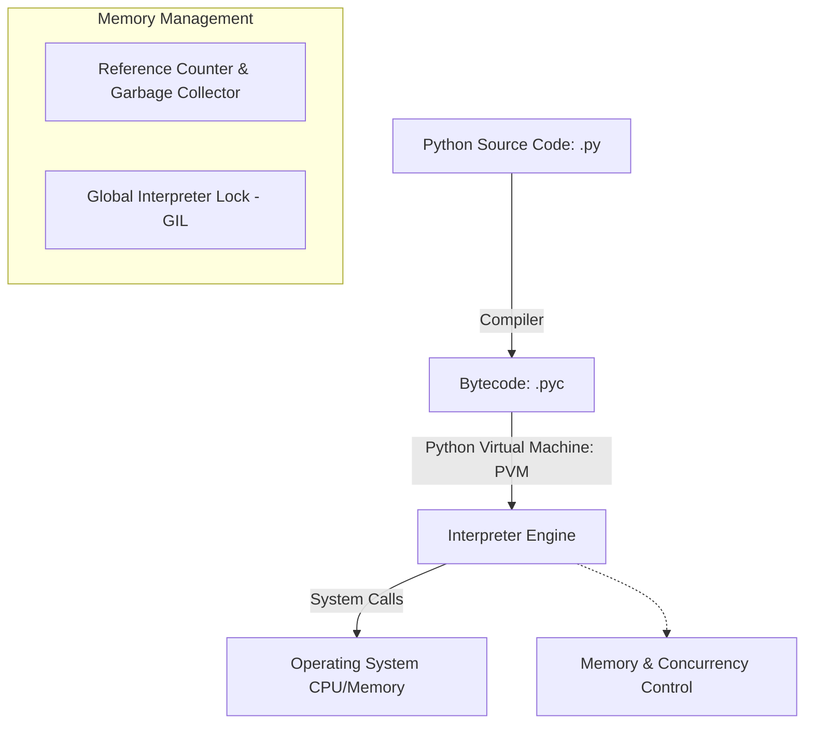

# Python Backend Engineering Master Guide

Python is a dynamic, high-level, interpreted programming language known for its readability, expressive syntax, and robust ecosystem. In backend engineering, it powers APIs, data processing pipelines, and agentic AI integrations.

---

## Installation & Downloads

To install Python on your machine:
1. Navigate to the [Official Python Downloads Page](https://www.python.org/downloads/).
2. Download the installer for your Operating System (Windows, macOS, or Linux).
3. Run the installer and **check the box "Add Python to PATH"** before clicking Install.
4. Verify the installation by running:
   ```bash
   python --version
   ```

### Official Download Portal


---

## 1. Phase 1: Beginner Fundamentals

### 1.1 Variables, Dynamic Typing, and Basic Types
Python is dynamically typed, meaning you do not need to declare a variable's type explicitly. Types are resolved at runtime.

* **Integers & Floats**: Representation of numeric values (`x = 42`, `y = 3.14`).
* **Strings**: Immutable sequence of Unicode characters (`name = "AuraDocs"`).
* **Booleans**: Logical values (`is_active = True`).

```python
# Variables and dynamic reassignment
data = 100        # Initially an integer
data = "Active"   # Reassigned to a string
print(f"Current state: {data} (Type: {type(data)})")
```

### 1.2 Operators
* **Arithmetic**: `+`, `-`, `*`, `/`, `//` (floor division), `%` (modulo), `**` (exponentiation).
* **Comparison**: `==`, `!=`, `>`, `<`, `>=`, `<=`.
* **Logical**: `and`, `or`, `not`.

### 1.3 Control Flow
Control flow structures direct the execution path of the application.

```python
# Conditional blocks
score = 85
if score >= 90:
    grade = "A"
elif score >= 80:
    grade = "B"
else:
    grade = "C"

# For loops (iterating over collections)
for i in range(3):
    print(f"Iteration {i}")

# While loops
count = 3
while count > 0:
    print(f"Countdown: {count}")
    count -= 1
```

### 1.4 Functions & Argument Passing
Functions are defined using the `def` keyword. Python supports positional arguments, keyword arguments, default values, and variable-length arguments (`*args`, `**kwargs`).

```python
def generate_user_profile(username, email, *roles, status="Active", **metadata):
    """
    Args:
        username (str): Position-based argument.
        email (str): Position-based argument.
        *roles: Variable positional arguments (tuples).
        status (str): Default keyword argument.
        **metadata: Variable keyword arguments (dictionary).
    """
    return {
        "username": username,
        "email": email,
        "roles": roles,
        "status": status,
        "extra_info": metadata
    }

# Invocation
profile = generate_user_profile(
    "dev_user", "dev@domain.com", "Admin", "Developer",
    status="Suspended", department="IT", location="US"
)
```

---

## 2. Phase 2: Intermediate Concepts

### 2.1 Core Data Structures

| Structure | Syntax | Mutable? | Ordered? | Access Complexity | Typical Use Case |
| :--- | :--- | :--- | :--- | :--- | :--- |
| **List** | `[1, 2, 3]` | Yes | Yes | $O(1)$ indexing, $O(n)$ search | Storing collections of elements to modify dynamically. |
| **Tuple** | `(1, 2, 3)` | No | Yes | $O(1)$ indexing, $O(n)$ search | Heterogeneous records, dictionary keys, data integrity. |
| **Dictionary** | `{"key": "val"}`| Yes | Yes (3.7+) | $O(1)$ average lookup | Key-value store, caching, JSON payloads mapping. |
| **Set** | `{1, 2, 3}` | Yes | No | $O(1)$ average lookup | Deduplication, membership tests, mathematical set algebra. |

```python
# List slicing and comprehensions
numbers = [x for x in range(10)]
evens = numbers[::2]  # Slice: start to end with step 2

# Dictionary lookup optimization
user_permissions = {"admin": ["read", "write", "delete"], "guest": ["read"]}
guest_rights = user_permissions.get("guest", [])  # Avoids KeyError
```

### 2.2 Exception Handling
Robust error handling prevents unexpected application crashes. Use specific exception types rather than catching all base `Exception` instances.

```python
class DatabaseConnectionError(Exception):
    """Custom exception class for connection issues."""
    pass

def execute_query(conn_string):
    try:
        if not conn_string:
            raise DatabaseConnectionError("Invalid connection string parameters.")
        # Perform db queries...
        print("Query executed successfully.")
    except DatabaseConnectionError as db_err:
        print(f"Database Error: {db_err}")
    except Exception as err:
        print(f"Generic Failure: {err}")
    finally:
        print("Cleaning up database cursors and connections.")
```

### 2.3 Context Managers (`with` statement)
Context managers guarantee that setup and teardown tasks (like closing files or closing sockets) are executed, even if exceptions are raised.

```python
# Custom Context Manager using class syntax
class ManagedFile:
    def __init__(self, filename):
        self.filename = filename

    def __enter__(self):
        self.file = open(self.filename, 'r')
        return self.file

    def __exit__(self, exc_type, exc_val, exc_tb):
        if self.file:
            self.file.close()

# Usage
# with ManagedFile('data.txt') as f:
#     data = f.read()
```

---

## 3. Phase 3: Advanced Core Python

### 3.1 Execution & Memory Model



* **Bytecode Compilation**: Source code is compiled into bytecode (`.pyc`) stored in `__pycache__` directories.
* **Global Interpreter Lock (GIL)**: A mutex ensuring only one thread executes Python bytecode at a time, protecting internal reference counters.
* **Garbage Collection**: Reclaims memory using **reference counting** immediately when counters hit zero, backed by a generational collector to resolve cyclical dependencies.

### 3.2 Decorators (Metaprogramming)
Decorators wrap functions to extend or modify their behavior without modifying the source function code directly.

```python
import time
import functools

def execution_logger(func):
    @functools.wraps(func)
    def wrapper(*args, **kwargs):
        start_time = time.perf_counter()
        result = func(*args, **kwargs)
        end_time = time.perf_counter()
        print(f"Function {func.__name__} executed in {end_time - start_time:.4f} seconds.")
        return result
    return wrapper

@execution_logger
def process_database_query(query_id):
    time.sleep(0.1)
    return f"Result for query {query_id}"
```

### 3.3 Advanced Decorators in Modern AI: The `@tool` Decorator
In modern LLM and Agentic AI architectures (such as **LangChain** and **CrewAI**), the `@tool` decorator is a critical pattern. It transforms standard Python functions into structured tools that an agent can invoke, auto-generating the underlying JSON schemas from function signatures and docstrings.

```python
from langchain_core.tools import tool

@tool
def calculate_compound_interest(principal: float, rate: float, years: int) -> float:
    """
    Calculates the compound interest for a given principal, annual interest rate, and duration.
    
    Args:
        principal (float): The initial sum of money (e.g., 10000.0).
        rate (float): The annual interest rate as a decimal (e.g., 0.05 for 5%).
        years (int): The number of years the money is invested.
        
    Returns:
        float: The final balance after compound interest.
    """
    return principal * ((1 + rate) ** years)

# The agent parses the schema of this function to understand WHEN and HOW to call it:
print("Tool Name:", calculate_compound_interest.name)
print("Tool Description:", calculate_compound_interest.description)
print("Input Schema:", calculate_compound_interest.args)
```

### 3.4 Generators (Memory Efficiency)
Generators yield values lazily using `yield`. Instead of loading huge datasets into memory, generators stream them on-demand maintaining $O(1)$ memory complexity.

```python
def stream_large_log_file(file_path):
    with open(file_path, "r") as file:
        for line in file:
            if "ERROR" in line:
                yield line.strip()

# Iterates line by line without loading the entire file into memory
# for error_log in stream_large_log_file("server.log"):
#     print(f"Alert: {error_log}")
```

### 3.5 Advanced Object-Oriented Programming (OOP)
Python supports complex OOP patterns including multiple inheritance, dunder method hooks, properties, and name mangling.

```python
from abc import ABC, abstractmethod

class BaseService(ABC):
    @abstractmethod
    def execute(self, payload: dict) -> dict:
        pass

class LoggingMixIn:
    def log(self, message: str):
        print(f"[AUDIT LOG] {message}")

class BillingService(BaseService, LoggingMixIn):
    def __init__(self, stripe_key: str):
        self.public_key = "pk_live..."  # Public
        self._temp_session = None       # Protected
        self.__secret_key = stripe_key  # Private (Mangled to _BillingService__secret_key)

    @property
    def secret_key(self) -> str:
        raise AttributeError("Secret keys are write-only.")

    @secret_key.setter
    def secret_key(self, key: str):
        if not key.startswith("sk_"):
            raise ValueError("Invalid Stripe secret key prefix.")
        self.__secret_key = key

    def execute(self, payload: dict) -> dict:
        self.log(f"Executing payment charge...")
        return {"status": "success", "amount": payload.get("amount", 0)}

# Inspection of MRO (Method Resolution Order)
print(BillingService.__mro__)
```

---

## 4. Phase 4: Concurrency & Parallelism

### 4.1 Asynchronous Programming (`asyncio`)
Async programming uses a single-threaded event loop to achieve high concurrency for I/O-bound operations.

```python
import asyncio

async def fetch_api_data(endpoint, delay):
    print(f"Fetching from {endpoint}...")
    await asyncio.sleep(delay)  # Non-blocking sleep
    print(f"Data received from {endpoint}")
    return {"endpoint": endpoint, "data": 200}

async def main():
    # Execute API requests concurrently
    results = await asyncio.gather(
        fetch_api_data("users", 1.5),
        fetch_api_data("orders", 1.0),
        fetch_api_data("products", 0.5)
    )
    print(f"All operations complete: {len(results)} tasks.")

# Run event loop
# asyncio.run(main())
```

### 4.2 Multithreading vs. Multiprocessing
* **Multithreading (`threading`)**: Best for **I/O-bound tasks** (network calls, file input). Blocked by the GIL from speeding up CPU computations.
* **Multiprocessing (`multiprocessing`)**: Best for **CPU-bound tasks** (data processing, image compression). Spawns separate processes with their own memory space and Python interpreters, bypassing the GIL.

---

## 5. Phase 5: Python Library Ecosystem

### 5.1 Web & API Frameworks
* **`FastAPI`**: Modern, fast web framework based on ASGI, supporting automatic OpenAPI generation and async execution.
* **`Django`**: Batteries-included framework with an integrated ORM, admin dashboard, and security features.
* **`Flask`**: Micro-framework focused on simplicity and modular extension.

### 5.2 Data Science & Machine Learning
* **`NumPy`**: Fundamental package for scientific computing with support for multi-dimensional arrays and matrix algebra.
* **`Pandas`**: Data manipulation library providing high-performance DataFrame objects.
* **`Matplotlib` / `Seaborn`**: Visualization libraries for generating plots and statistical graphics.
* **`Scikit-Learn`**: Machine learning library for classification, regression, clustering, and data preprocessing.

### 5.3 Utility & Database Clients
* **`Pydantic`**: Data validation and settings management using Python type annotations.
* **`SQLAlchemy`**: SQL Toolkit and Object-Relational Mapper (ORM) providing powerful database operations.
* **`Requests` / `HTTPX`**: Standard HTTP clients for executing remote API requests.

### 5.4 LLM & Agentic AI
* **`LangChain`**: Framework for building context-aware applications powered by LLMs (Chains, Agents, Retrievers).
* **`CrewAI`**: Orchestration library for role-playing, autonomous AI agent teams.
