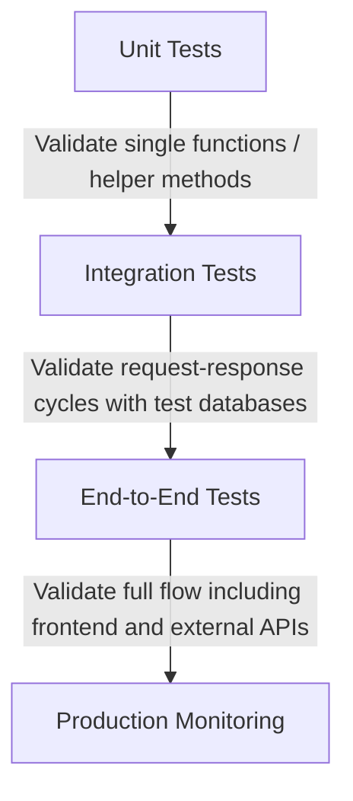

# API Testing & Debugging

Building APIs is only half the battle; testing and debugging are critical to ensure endpoints behave predictably under load and don't regress during refactoring.

---

## 1. Testing Hierarchy

A robust API utilizes multiple tiers of testing to ensure correctness.



---

## 2. Testing FastAPI with Pytest

To test FastAPI async views, we use `pytest` alongside the `httpx` async client.

```python
# test_main.py
import pytest
from httpx import AsyncClient
from main import app

@pytest.mark.anyio
async def test_get_items():
    async with AsyncClient(app=app, base_url="http://test") as ac:
        response = await ac.get("/api/items")
    assert response.status_code == 200
    assert isinstance(response.json(), list)

@pytest.mark.anyio
async def test_create_item():
    payload = {"name": "Test Item", "description": "Generic description"}
    async with AsyncClient(app=app, base_url="http://test") as ac:
        response = await ac.post("/api/items", json=payload)
    assert response.status_code == 201
    data = response.json()
    assert data["name"] == "Test Item"
    assert "id" in data
```

---

## 3. Testing Django DRF with APITestCase

Django Rest Framework provides custom test clients that simplify authenticating users and making JSON calls.

```python
# tests.py
from django.urls import reverse
from rest_framework import status
from rest_framework.test import APITestCase
from .models import Item

class ItemAPITests(APITestCase):
    def setUp(self):
        # Create seed data for list view
        self.item = Item.objects.create(name="Pre-existing Item", description="Old description")
        self.url = reverse('item-list-api')

    def test_list_items(self):
        response = self.client.get(self.url)
        self.assertEqual(response.status_code, status.HTTP_200_OK)
        self.assertEqual(len(response.data), 1)
        self.assertEqual(response.data[0]['name'], "Pre-existing Item")

    def test_create_item(self):
        data = {'name': 'New Item', 'description': 'Fresh description'}
        response = self.client.post(self.url, data, format='json')
        self.assertEqual(response.status_code, status.HTTP_201_CREATED)
        self.assertEqual(Item.objects.count(), 2)
        self.assertEqual(Item.objects.latest('id').name, 'New Item')
```

---

## 4. Useful Debugging Utilities
1. **Swagger UI**: Visit `/docs` on your FastAPI server to interactively call endpoints.
2. **Postman / Insomnia**: Set up collections to automate manual testing with local environment variable files.
3. **cURL**: Test endpoints directly from your shell:
   ```bash
   curl -X POST http://localhost:8000/api/items/ \
        -H "Content-Type: application/json" \
        -d '{"name": "Generic Item", "description": "Some description"}'
   ```
