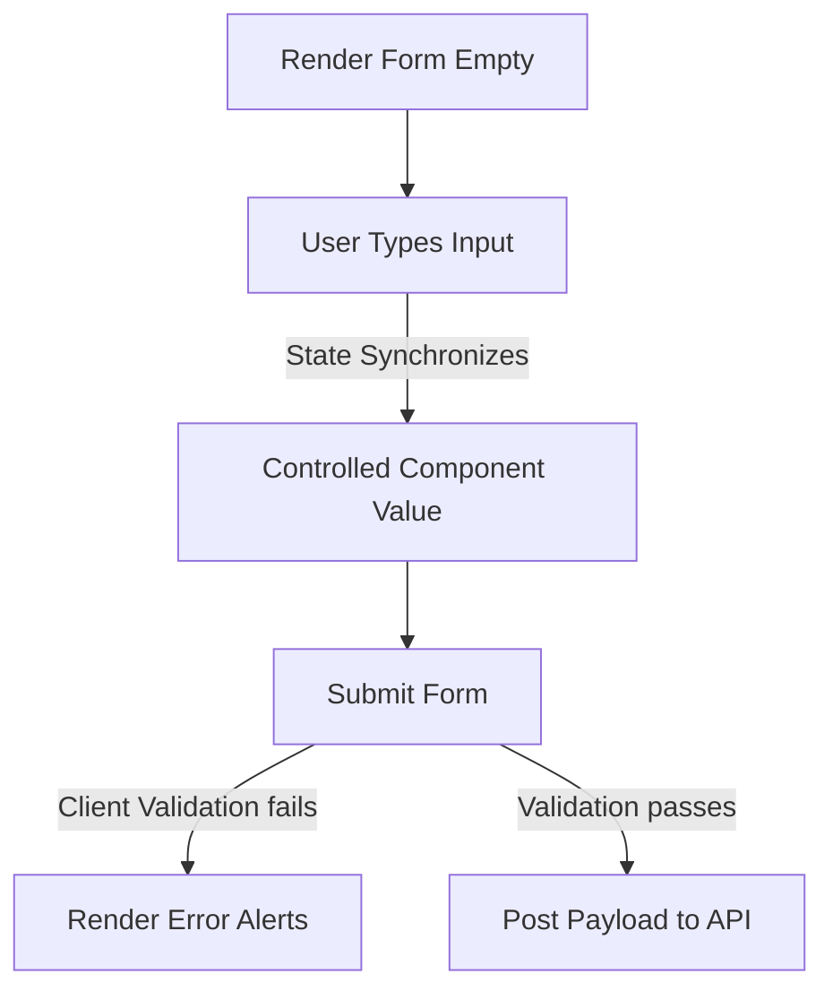

# Interactive Components & Forms

Forms allow users to write data back to your backend APIs. Building interactive components requires managing input states, handling form submissions asynchronously, and validating client values.

---

## 1. Interactive Form Layout Flow



---

## 2. Code Implementation: Item Manager Component

```jsx
// ItemManager.jsx
import React, { useState } from 'react';
import { useApi } from './useApi';

export const ItemManager = () => {
  const { data: items, loading, error, refetch } = useApi('/api/items');
  
  // Local states for item creation form
  const [name, setName] = useState('');
  const [description, setDescription] = useState('');
  const [formError, setFormError] = useState('');
  const [submitting, setSubmitting] = useState(false);

  const handleSubmit = async (e) => {
    e.preventDefault();
    if (!name) {
      setFormError('Please enter a name.');
      return;
    }
    
    setSubmitting(true);
    setFormError('');

    try {
      const response = await fetch('/api/items', {
        method: 'POST',
        headers: {
          'Content-Type': 'application/json',
        },
        body: JSON.stringify({ name, description }),
      });

      if (!response.ok) {
        throw new Error('Failed to create item');
      }

      // Clear input fields
      setName('');
      setDescription('');
      
      // Trigger data refetch to update UI list
      refetch();
    } catch (err) {
      setFormError(err.message);
    } finally {
      setSubmitting(false);
    }
  };

  return (
    <div className="item-manager">
      <h2>Generic Item Catalog Manager</h2>
      
      {/* 1. Add Item Form */}
      <form onSubmit={handleSubmit} className="add-item-form">
        <h3>Create New Item</h3>
        {formError && <div className="error-alert">{formError}</div>}
        
        <div className="form-group">
          <label>Item Name</label>
          <input 
            type="text" 
            value={name} 
            onChange={(e) => setName(e.target.value)} 
            placeholder="e.g. Standard Resource"
          />
        </div>

        <div className="form-group">
          <label>Description</label>
          <input 
            type="text" 
            value={description} 
            onChange={(e) => setDescription(e.target.value)} 
            placeholder="e.g. A generic framework resource description"
          />
        </div>

        <button type="submit" disabled={submitting}>
          {submitting ? 'Creating...' : 'Add Item'}
        </button>
      </form>

      <hr />

      {/* 2. Item Catalog List */}
      <div className="item-list-container">
        <h3>Available Items</h3>
        
        {loading && <div className="loader">Loading items...</div>}
        {error && <div className="error-alert">Error loading data: {error}</div>}
        
        {!loading && items.length === 0 && (
          <p className="no-data">No items available. Add one above!</p>
        )}

        <ul className="item-grid">
          {items.map((item) => (
            <li key={item.id} className="item-card">
              <h4>{item.name}</h4>
              <p className="description-text">{item.description}</p>
            </li>
          ))}
        </ul>
      </div>
    </div>
  );
};
```

---

## 3. Best Practices
* **Controlled Inputs**: Always tie input value props to state variables (`value={name}`) and track inputs via `onChange` listeners. This guarantees the react component model is the single source of truth for user inputs.
* **UX Micro-interactions**: Disable submission buttons (`disabled={submitting}`) during active requests to prevent users from accidentally trigger duplicate requests.
