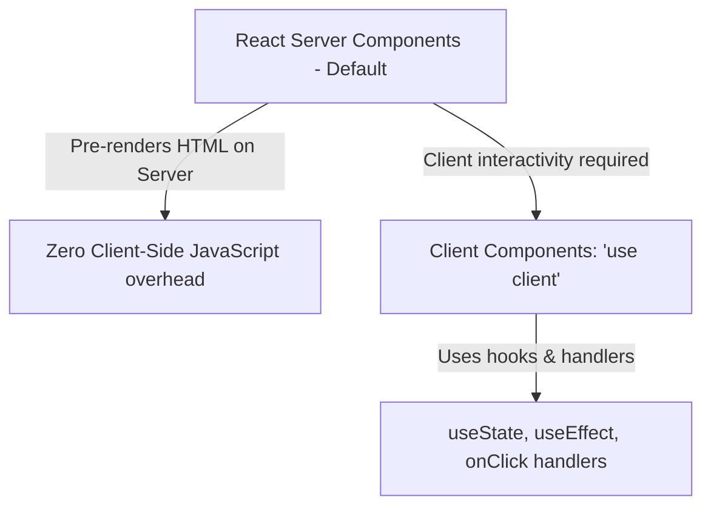

# Next.js Full Stack Framework

Next.js is a React framework for building full-stack web applications. It simplifies page routing, handles server-side rendering, and optimizes asset delivery.

---

## 1. React Server Components (RSC) vs Client Components

Next.js App Router defaults to **Server Components** to maximize performance by shifting code execution to the server.



### Component Categories:
* **Server Components**: Rendered entirely on the server. They have direct access to backend resources (like databases or file systems) and send zero JavaScript bundle overhead to the client.
* **Client Components (marked with `'use client'`)**: Pre-rendered on the server, but hydrated with client-side JavaScript in the browser to support reactivity, state hooks, and web APIs.

---

## 2. Server Rendering Strategies

* **SSR (Server-Side Rendering)**: Pre-renders pages dynamically on each incoming request. Ideal for user dashboards and personalized data views.
* **SSG (Static Site Generation)**: Builds HTML pages statically at compile time. Ideal for marketing pages, blogs, and documentation sites.
* **ISR (Incremental Static Regeneration)**: Updates static pages in the background on-demand without rebuilds.

### Code Demonstration: Page Routing
```jsx
// app/items/page.jsx (Server Component)

async function fetchItems() {
  const res = await fetch('https://api.example.com/items', { 
    next: { revalidate: 3600 } // ISR: Revalidate cached data every hour
  });
  return res.json();
}

export default async function ItemsPage() {
  const items = await fetchItems();

  return (
    <main className="items-page">
      <h1>Server-Rendered Catalog</h1>
      <ul>
        {items.map(item => (
          <li key={item.id}>{item.name}</li>
        ))}
      </ul>
    </main>
  );
}
```
