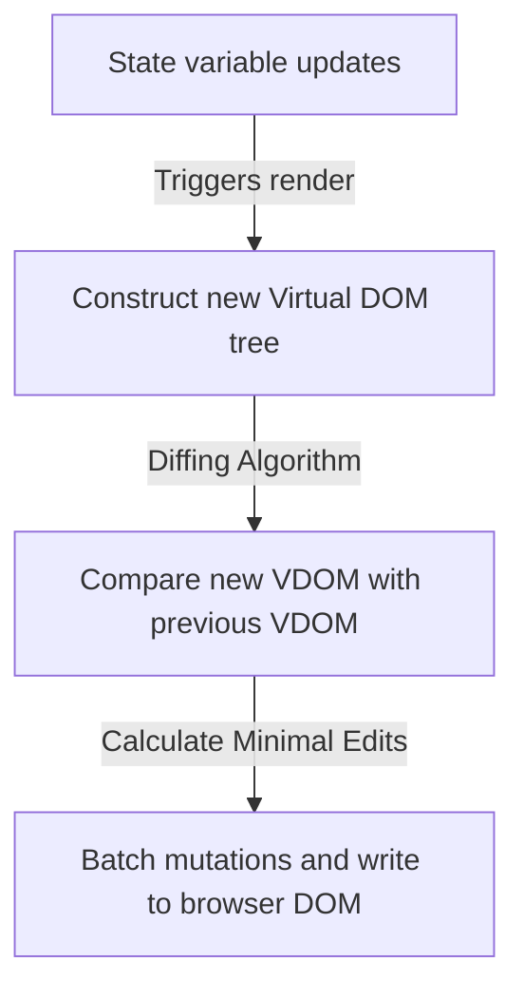

# React Library Architecture

React is a declarative, component-based frontend library for building interactive user interfaces. It uses a virtual representation of the DOM to optimize page updates.

---

## 1. Reconciliation & Virtual DOM Render Loop



### Key Phases:
* **Render Phase**: Constructs the Virtual DOM tree. This phase is purely computational and can be paused or restarted.
* **Commit Phase**: React writes the computed differences (diffs) to the actual browser DOM elements. This happens synchronously to prevent layout flickering.

---

## 2. Core Hooks Lifecycle

```jsx
import React, { useState, useEffect, useRef } from 'react';

export const CounterManager = () => {
  const [count, setCount] = useState(0); // 1. State hook for reactive values
  const clickCountRef = useRef(0);      // 2. Ref hook for values that survive render without triggering re-render

  // 3. Effect hook for side-effects (e.g., event listeners, API fetch)
  useEffect(() => {
    console.log(`Count updated. Syncing value: ${count}`);
    
    // Clean-up function (unmount / before next effect execution)
    return () => {
      console.log('Cleaning up previous effect...');
    };
  }, [count]); // Dependency array: triggers only when 'count' changes

  const handleIncrement = () => {
    setCount(prev => prev + 1);
    clickCountRef.current += 1;
  };

  return (
    <div className="counter-container">
      <h2>Count: {count}</h2>
      <button onClick={handleIncrement}>Increment Value</button>
    </div>
  );
};
```

---

## 3. Best Practices
* **Keep State Local**: Do not move state to parent components unless it needs to be shared with sibling elements.
* **Stable Keys in Lists**: Always use unique, stable keys (like database IDs) when rendering arrays. Avoid using index indices as keys, as they degrade performance and can cause state rendering bugs when sorting list arrays.
