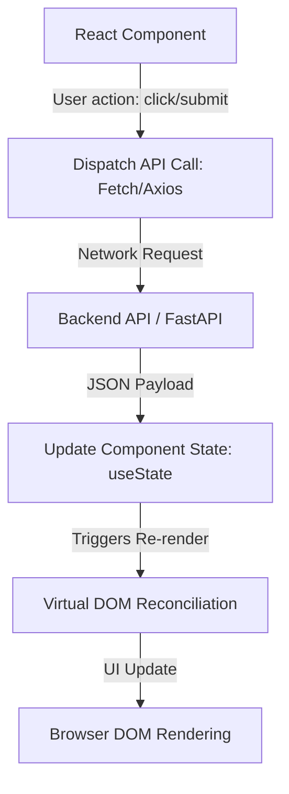

# Frontend React Architecture Overview

Welcome to the Frontend React Architecture overview. The frontend layer manages UI rendering, handles client interactions, and coordinates API communication.

---

## 1. Frontend & API Data Flow

In modern single-page applications (SPAs), the frontend maintains a client-side Virtual DOM that synchronizes with backend REST endpoints dynamically.

---

## 2. Core Concepts of Modern Frontends

| Focus Area | Responsibility | Primary Technologies |
| :--- | :--- | :--- |
| **Component Layout** | Creating modular, reusable UI elements. | JSX, CSS Modules, Tailwind CSS |
| **State Management** | Managing local UI states and global application values. | `useState`, Context API, Zustand |
| **Routing** | Client-side page navigation without reloading. | React Router, Next.js App Router |
| **Data Ingestion** | Communicating with backend services over HTTP/HTTPS. | Fetch API, Axios, custom React Hooks |

---

## 3. The React Rendering Pipeline
1. **Trigger**: Component state or props change.
2. **Render**: React calls the component function to calculate the virtual DOM tree representation.
3. **Commit**: React compares the new tree with the old tree (reconciliation) and updates the browser DOM where differences occur.
