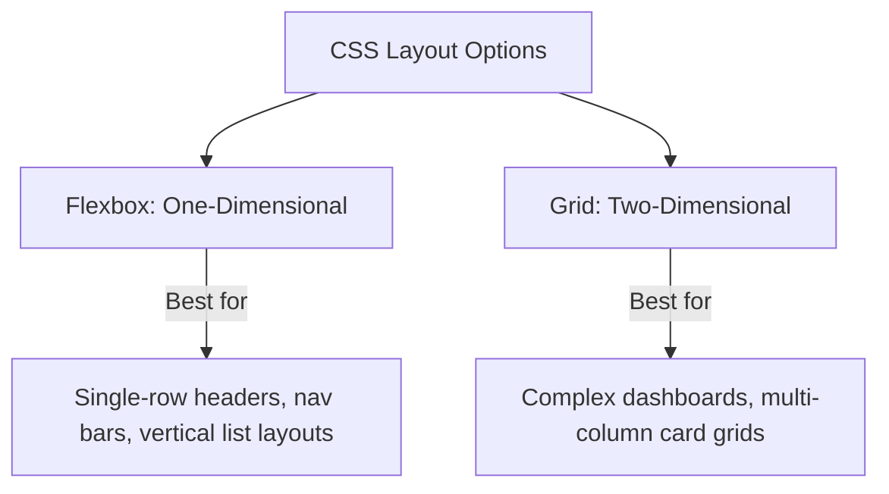

# HTML5 & CSS3 Frontend Foundations

HTML5 provides the structured semantic scaffold of a web page, and CSS3 controls the layout, colors, styling, responsive typography, and animations.

---

## 1. CSS Layout Paradigms: Flexbox vs Grid



### Differences:
* **Flexbox**: Positions items along a single axis (either row or column). Excellent for scaling and distributing space dynamically.
* **Grid**: Positions items along both rows and columns simultaneously. Ideal for template-based page regions.

---

## 2. Code Demonstration: HTML5 Semantics & Responsive Layouts

### HTML5 Structural Schema
```html
<!DOCTYPE html>
<html lang="en">
<head>
  <meta charset="UTF-8">
  <title>Semantic Portal</title>
</head>
<body>
  <!-- Semantic Header -->
  <header class="app-header">
    <nav>Logo & Navigation Links</nav>
  </header>

  <!-- Main Content Layout -->
  <main class="dashboard-grid">
    <article class="main-report">
      <h1>Analytical Report</h1>
      <p>Report body content goes here.</p>
    </article>

    <aside class="sidebar">
      <h3>Context Links</h3>
    </aside>
  </main>
</body>
</html>
```

### CSS Responsive Rules
```css
/* Custom CSS Variables (Design Tokens) */
:root {
  --primary-color: #4f46e5;
  --bg-color: #f9fafb;
  --gap-size: 16px;
}

body {
  background-color: var(--bg-color);
  font-family: 'Inter', sans-serif;
  margin: 0;
}

/* Two-Dimensional Grid Layout */
.dashboard-grid {
  display: grid;
  grid-template-columns: 3fr 1fr; /* 3 parts main report, 1 part sidebar */
  gap: var(--gap-size);
  padding: var(--gap-size);
}

/* Responsive Media Query for Mobile Screens */
@media (max-width: 768px) {
  .dashboard-grid {
    grid-template-columns: 1fr; /* Stack sidebar below main report */
  }
}
```
