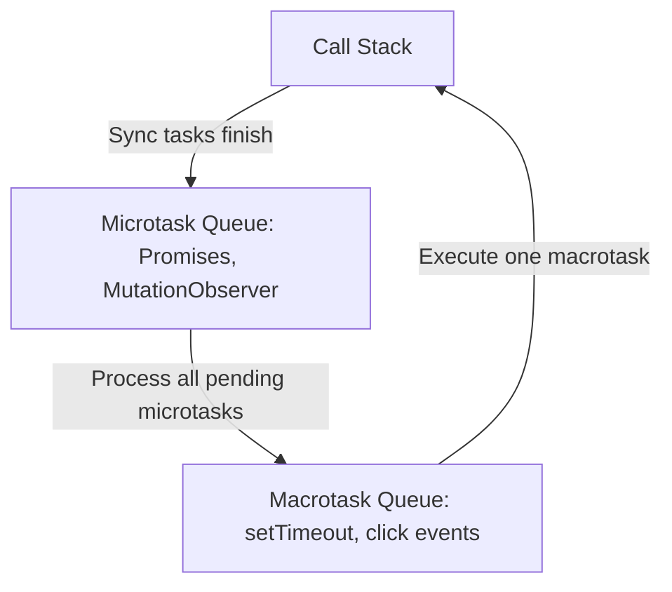

# JavaScript Frontend Engineering

JavaScript is a dynamic, single-threaded, prototype-based language that runs natively inside all major web browsers, powering interactive web logic and client-side scripting.

---

## 1. Browser Event Loop: Microtasks vs Macrotasks

The browser schedules tasks to execute sequentially on the single main thread.



* **Microtasks**: Execute immediately after the current script finishes, before the browser repaints the UI.
* **Macrotasks**: Wait in line for the next loop iteration, allowing UI renders to occur in between tasks.

---

## 2. Functional Closures

A **closure** is the combination of a function bundled together with references to its surrounding state (the lexical environment). Closures allow inner functions to access outer scope variables even after the outer function has returned.

### Code Demonstration: Closure Instance
```javascript
function createCounter(incrementStep) {
  let count = 0; // Private state variable
  
  return function() {
    count += incrementStep;
    return count;
  };
}

const incrementByTwo = createCounter(2);
console.log(incrementByTwo()); // Output: 2
console.log(incrementByTwo()); // Output: 4
```

---

## 3. Asynchronous Operations: Promises & Async/Await

### Promises & Chaining
```javascript
function fetchUserData() {
  return new Promise((resolve, reject) => {
    setTimeout(() => {
      const success = true;
      if (success) {
        resolve({ id: 101, user: "admin" });
      } else {
        reject("Network timeout error");
      }
    }, 100);
  });
}

// Chaining
fetchUserData()
  .then(data => console.log("Received Data:", data))
  .catch(err => console.error("Error:", err));
```

### Modern Async/Await Syntax
```javascript
async function executeTransaction() {
  try {
    const user = await fetchUserData();
    console.log(`Processing profile for ${user.user}`);
  } catch (error) {
    console.error("Transaction aborted:", error);
  }
}
```
